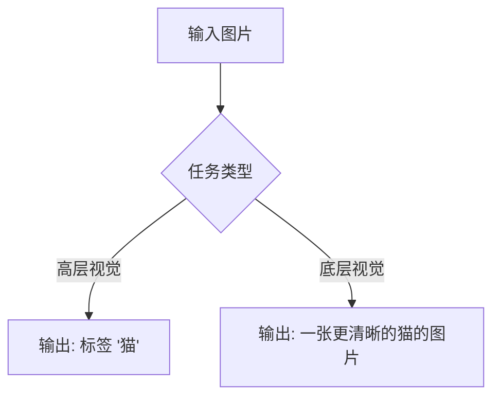
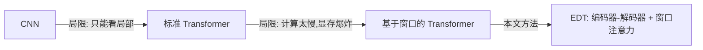
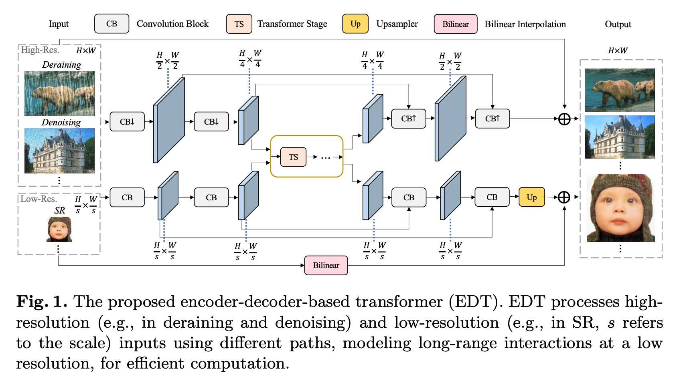
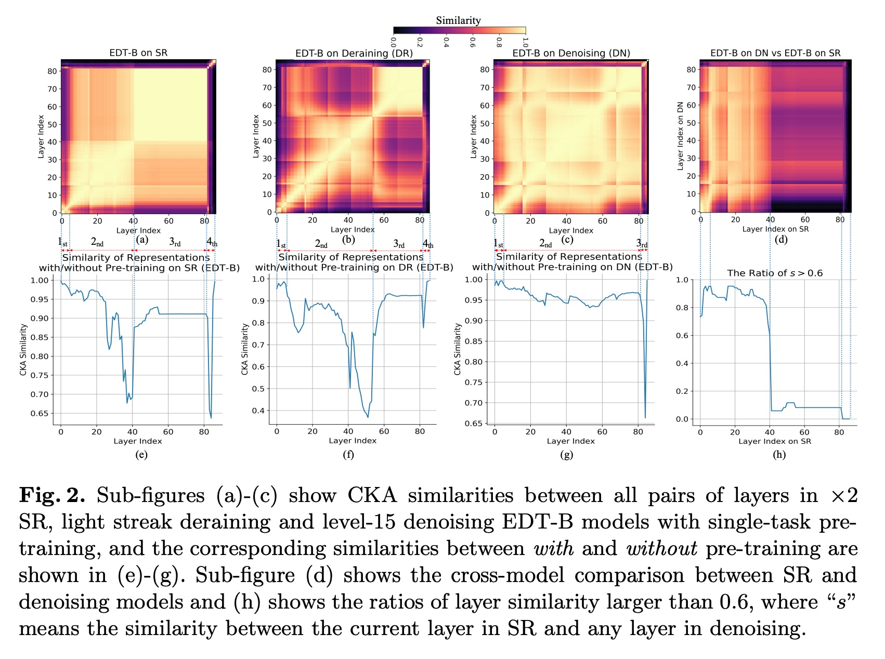
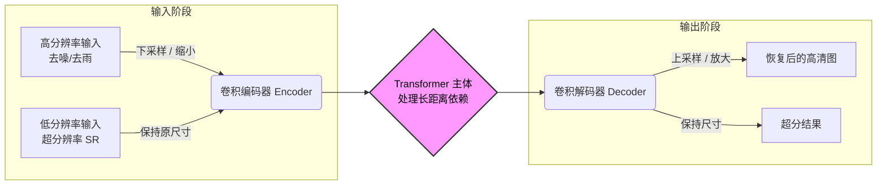
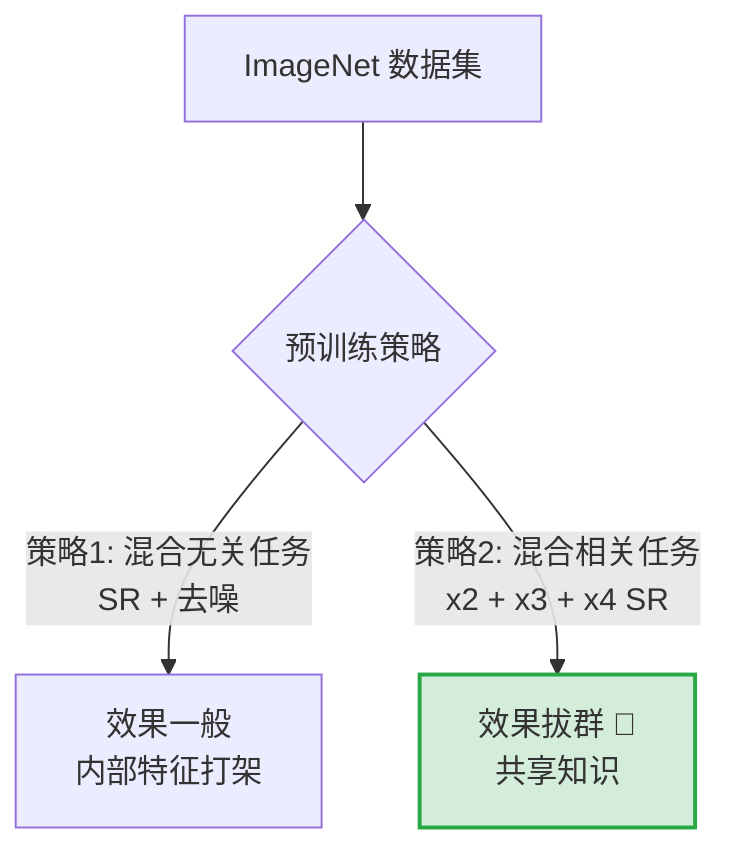

## AI论文解读 | On Efficient Transformer-Based Image Pre-training for Low-Level Vision
        
### 作者        
digoal        
        
### 日期        
2025-12-10        
        
### 标签        
PostgreSQL , PolarDB , DuckDB , AI , 论文解读        
        
----        
        
## 背景  
      
https://arxiv.org/pdf/2112.10175        
  
提示:          
```          
读懂《On Efficient Transformer-Based Image Pre-training for Low-Level Vision》这篇论文需要提前掌握哪些基础知识, 请使用中文通熟易懂的讲解这些基础知识, 可以引用论文中的图、表或使用Markdown支持的图形(text,mermaid等)增加解释性. 
  
使用中文通熟易懂的解读《On Efficient Transformer-Based Image Pre-training for Low-Level Vision》这篇论文, 其中的关键内容请着重讲解, 可以引用论文中的图、表或使用Markdown支持的图形(text,mermaid等)增加解释性. 
  
提取《On Efficient Transformer-Based Image Pre-training for Low-Level Vision》这篇论文中的重要术语, 使用中文对这些术语进行通熟易懂的讲解, 可以引用论文中的图、表或使用Markdown支持的图形(text,mermaid等)增加解释性. 
```     
  
## 1 前置知识 
  
阅读这就篇名为《On Efficient Transformer-Based Image Pre-training for Low-Level Vision》（基于高效Transformer的底层视觉图像预训练研究）的论文，你需要掌握以下四个核心领域的“预备知识”。

为了让你轻松理解，我将用通俗的语言配合图表来解释这些概念。

-----

### 1\. 计算机视觉的任务分类：底层 vs. 高层

论文的核心是 **“底层视觉”（Low-Level Vision）** 。你需要明白它和我们常见的“高层视觉”有什么区别。

  * **高层视觉 (High-Level Vision):** 像人脑一样理解图片内容。
      * *例子:* 图像分类（这是猫还是狗？）、目标检测（猫在哪里？）。
      * *关注点:* 语义信息（Semantics）。
  * **底层视觉 (Low-Level Vision):** 像修图软件一样处理像素。
      * *例子:* **超分辨率 (Super-Resolution, SR)** （把模糊小图变清晰大图）、**去噪 (Denoising)** （去掉噪点）、**去雨 (Deraining)** 。
      * *关注点:* 纹理、边缘、像素细节。

**图解任务区别：**



> **论文关联：** 论文的第一句摘要就提到，预训练在高层视觉很成功，但很少有人研究它在底层视觉（如超分、去噪）中是怎么起作用的 。

-----

### 2\. 模型架构：从 CNN 到 Transformer

这篇论文提出了一种叫 **EDT (Encoder-Decoder-Based Transformer)** 的模型。要理解它，你需要懂两个概念：

#### A. 卷积神经网络 (CNN)

  * **通俗解释：** 就像拿一个手电筒（卷积核）在图片上滑动，每次只看一小块区域。它是过去十年处理图像的王者。
  * **特点：** 擅长捕捉局部特征（如边缘），但看不太到全局关系。

#### B. Transformer 与 自注意力机制 (Self-Attention)

  * **通俗解释：** 最初用于翻译语言（如ChatGPT的基础）。在看图片时，它能让图片中的每一个像素都“关注”其他所有像素，不管它们距离多远。
  * **特点：** 全局视野强，但计算量巨大（因为像素太多了）。

#### C. 窗口注意力 (Window-based Attention)

  * **核心痛点：** 图片像素太多，Transformer算不过来。
  * **解决办法：** 把大图切成一个个小方块（Window），只在方块内做注意力计算。这篇论文用的就是这种变体（参考论文中的 Shifted Crossed Local Attention）。

**图解架构演进：**



> **论文引用：** 论文中的 **Fig. 1** 展示了这种架构，左边是输入（低清图），中间经过Transformer处理长距离关系，右边输出高清图 。

 

-----

### 3\. 训练策略：预训练 (Pre-training) 与 微调 (Fine-tuning)

这是论文标题中的核心词汇。

  * **预训练 (Pre-training):**

      * **比喻：** 在上“超分辨率”这门专业课之前，先读完整个图书馆的书（ImageNet大数据集）。虽然读的书不一定直接教你怎么把图变清楚，但让你学会了什么是“线条”、什么是“纹理”、什么是“自然图像的规律”。
      * **论文的做法：** 先在 ImageNet（分类数据集）上训练，让模型“见过世面”。

  * **微调 (Fine-tuning):**

      * **比喻：** 读完书后，专门做“超分辨率”的练习题。
      * **论文的做法：** 把预训练好的模型拿来，用专门的低清-高清图片对进行训练。

**本文的核心发现之一**就是：预训练对不同任务（超分 vs. 去噪）的效果截然不同。

-----

### 4\. 分析工具：CKA (Centered Kernel Alignment)

这是论文中最“硬核”的分析工具，用来回答“模型到底学到了什么？”。

  * **通俗解释：** 想象两个学生（神经网络的层），CKA 就是一种算法，用来对比这两个学生的“脑电波”是否相似。

      * 如果 CKA 分数高（接近1）：说明这两层学到的特征很像。
      * 如果 CKA 分数低（接近0）：说明它们关注的东西完全不同。

  * **如何看论文中的图 (Heatmap):**
    论文大量使用了热力图（Heatmap）来展示 CKA。

      * **横轴/纵轴：** 代表网络的层数（第1层到第N层）。
      * **颜色越亮 (黄/红):** 相似度越高。
      * **颜色越暗 (紫/黑):** 相似度越低。

**示例分析 (基于论文 Fig. 2):**

  
  
> **解读指南：**  
>  
>   * 如果你看到对角线有亮块（Block结构），说明这些层在干类似的事情。  
>     * 论文通过 CKA 发现： **超分辨率模型**的浅层和深层干的活儿不一样（分工明确），而**去噪模型**整个网络似乎都在干类似的活儿（比较均匀）。  

-----

### 总结：读懂论文的逻辑链

掌握了以上知识，你就能顺畅地理解论文的逻辑了：

1.  **背景：** 大家都在用 **Transformer** 做视觉，也都在用 **预训练**。
2.  **问题：** 但这套组合拳在 **底层视觉**（修图）上到底好不好使？为什么？
3.  **方法：** 我们设计了一个高效模型 **EDT**，并用 **CKA** 工具去“解剖”模型的内部。
4.  **结论：**
      * 预训练能让模型学到更多“局部纹理”信息。
      * 这对**超分辨率**很有用（缺细节），但对**去噪**用处不大（因为去噪本身就是处理局部）。
      * 提出了一种**多任务预训练**的方法（Multi-related-task），效果最好。

**下一步建议：**
现在你可以尝试阅读论文的 **Section 3.3** 和 **Fig. 2**，结合上面的 CKA 知识，看看你是否能理解作者是如何通过热力图得出“去噪模型和超分模型内部结构不同”这一结论的。
  
## 2 解读论文 
  
这篇论文 **《On Efficient Transformer-Based Image Pre-training for Low-Level Vision》**（基于高效Transformer的底层视觉图像预训练研究）探讨了一个在当时（2021/2022年）非常前沿的问题： **在大规模数据上“预训练”模型，到底能不能帮我们把图片修得更好（如超分辨率、去噪）？如果能，原理是什么？**

以往大家都在研究怎么用预训练做分类（高层视觉），但这篇论文深入到了像素级别的修复任务（底层视觉）。

以下是这篇论文的通俗解读，分为**核心背景**、**模型架构**、**深度诊断（由内而外的分析）和实战指南**四个部分。

-----

### 1\. 核心背景：为什么要研究这个？

在计算机视觉里， **“预训练” (Pre-training)** 就像是让学生在正式考试前，先通读百科全书（大数据集，如ImageNet）。

  * **高层任务（如分类）：** 预训练效果极好，已经成为标配。
  * **底层任务（如超分辨率 SR、去噪 Denoising）：** 以前大家觉得这主要是处理纹理细节，预训练有没有用？怎么用？大家都不太清楚。

**这篇论文的野心：** 不仅要证明预训练有用，还要造一个**高效的Transformer模型（EDT）** ，并通过一种“CT扫描”技术（CKA）通过去**看透模型内部**发生了什么变化。

-----

### 2\. 倚天剑：高效模型 EDT (Encoder-Decoder Transformer)

作者首先提出了一个新模型 **EDT**。之所以叫“高效”，是因为它不像之前的 IPT 模型那样参数量巨大（IPT有1.16亿参数，EDT只有它的1/10左右），而且速度更快。

#### EDT 的工作流程图解

EDT 采用了**编码器-解码器**结构，针对不同任务有不同的处理路径：



  * **设计巧思 ：**
      * 对于**去噪/去雨**（输入图很大）：先用卷积把图缩小（下采样），让 Transformer 在小图上跑，计算量大幅降低，最后再放大回去。
      * 对于**超分辨率**（输入图本来就小）：直接在原尺寸上跑，效率很高。

-----

### 3\. 核心诊断：预训练到底改变了什么？

这是论文最精彩的部分。作者没有只看结果（PSNR分数），而是用了一种叫 **CKA (Centered Kernel Alignment)** 的工具，像做CT扫描一样，对比了模型各层之间的“相似度”。

#### 发现一：不同任务的“脑回路”完全不同 

作者对比了模型内部各层的特征相似度：

  * **超分辨率 (SR) 模型：** 像是有明显的“分工阶段”。前面的层关注局部（纹理），后面的层关注全局（结构）。
  * **去噪 (Denoising) 模型：** 整个模型从头到尾都很像，结构非常均匀，似乎大家都在干类似的事情（处理局部噪点）。

#### 发现二：预训练的作用是“注入局部信息” 

预训练对模型内部产生了什么物理改变？

  * **没有预训练时：** Transformer 的深层往往只关注全局信息。
  * **有预训练后：** 预训练把更多的 **局部信息（Local Information）** 带到了模型的深层。这就好比让模型在宏观把控的同时，也不要忘了微观的纹理细节。

#### 发现三：预训练对 SR 很补，对去噪“无感” 

这是基于 CKA 分析得出的重要结论：

  * **超分辨率 (SR) & 去雨：** 预训练极大地改变了模型的内部表示，效果提升显著（PSNR 提升可达 0.4dB+）。
  * **去噪：** 预训练几乎没改变模型内部的特征表示。因为去噪本身就是个局部任务，不需要太多的全局预训练知识，而且去噪本身的数据集往往已经够大了。

-----

### 4\. 实战指南：如何正确地“炼丹”？

既然预训练有用，那怎么练效果最好？作者对比了三种策略 ：

| 策略名称 | 描述 | 效果评价 |
| :--- | :--- | :--- |
| **单任务预训练** | 只用 ImageNet 训练一个 SR 模型 | 有效，但不是最强 |
| **多无关任务预训练** | 把 SR、去噪、去雨混在一起练 | **效果一般**，因为任务之间特征冲突（如前面说的“脑回路”不同） |
| **多相关任务预训练** | **推荐策略** 🌟 <br> 把 x2, x3, x4 倍率的 SR 混在一起练 | **效果最好！** 任务互补，数据利用率最高 |

**图解预训练策略的有效性：**



### 5\. 总结与成绩

  * **效果：** 使用 **EDT 模型 + 多相关任务预训练**，在超分辨率、去雨等任务上均达到了当时的 SOTA（最先进水平）。
  * **效率：** 相比于之前的巨无霸模型 IPT，EDT 的参数量只有它的 **10%**，预训练数据量也只需要它的 **15%** 。
  * **启示：** 
    1\.  Transformer 做底层视觉，预训练很重要。
    2\.  不要盲目混用任务，要把“相关的”任务放在一起预训练（如不同倍率的SR）。
    3\.  去噪任务可能不需要大规模预训练。
  
## 3 术语 
  
这篇论文《On Efficient Transformer-Based Image Pre-training for Low-Level Vision》涉及许多计算机视觉领域的专业概念。为了让你更轻松地理解，我提取了其中的核心术语，并配合图表和通俗的比喻进行讲解。

### 1\. 核心任务类术语

#### **底层视觉 (Low-Level Vision)**

  * **通俗解释：**
    想象你拿到一张照片，**高层视觉**（High-Level）是像人类一样去理解“这是猫还是狗”；而**底层视觉**则是像修图师一样，只关心画质好不好。它的目标是改善图像的像素质量，比如把模糊变清晰（超分辨率）、把噪点去掉（去噪）或把雨滴修掉（去雨）。
  * **论文中的应用：**
    论文主要研究这三类底层任务：
    1.  **超分辨率 (SR):** 把小图放大变高清 。
    2.  **去噪 (Denoising):** 去除照片上的颗粒感（高斯噪声）。
    3.  **去雨 (Deraining):** 去除遮挡画面的雨痕 。

#### **预训练 (Pre-training)**

  * **通俗解释：**
    就像学生在参加“超分辨率”这门专业考试前，先去通读《百科全书》（ImageNet 大规模数据集）来积累基础知识。虽然百科全书不直接教你怎么修图，但能让你学会什么是“边缘”、什么是“纹理”。论文发现，这种“考前辅导”能让模型在处理底层视觉任务时表现得更好 。

-----

### 2\. 模型架构类术语

#### **EDT (Encoder-Decoder-Based Transformer)**

  * **通俗解释：**
    这是作者提出的模型名称，意为“基于编码器-解码器的Transformer”。普通的 Transformer 计算量很大，处理大图很慢。EDT 采用了“三明治”结构来提高效率 ：

    1.  **编码器 (Encoder):** 先把图片“压缩”或提取特征 。
    2.  **Transformer 主体:** 在压缩后的特征上进行深加工，处理复杂的长距离关系 。
    3.  **解码器 (Decoder):** 把加工好的特征“还原”成高清图片 。

  * **工作流程图解 (基于论文 Fig. 1)：**    

    ```mermaid
    graph LR
        A[输入图片] --> B{任务类型?}
        
        subgraph EDT模型结构
        B -- 去噪/去雨 (大图) --> C[卷积编码器: 下采样缩小]
        B -- 超分辨率 (小图) --> D[卷积编码器: 保持尺寸]
        C --> E[Transformer 主体: 深层处理]
        D --> E
        E --> F[卷积解码器: 上采样还原]
        end
        
        F --> G[输出高清图]
    ```

    > 引用支持：EDT 针对去噪/去雨任务会先进行下采样以减少计算量，而超分辨率任务则保持原尺寸处理 。

#### **移位交叉局部注意力 (Shifted Crossed Local Attention)**

  * **通俗解释：**
    Transformer 的核心是“注意力机制”，即让图片上的像素互相“交流”。如果让所有像素都两两交流，计算量会爆炸。
    作者设计了一种巧妙的方法：把图片切成条状（水平和垂直），只让条状内的像素交流，然后在下一层把条状的位置“移一移”（Shift）。这样既省力，又能保证像素最终能看到全局信息 。
      * **形象比喻：** 就像看书，先横着读一行，再竖着读一列，交替进行，就能快速掌握整页纸的内容。

-----

### 3\. 分析诊断类术语

#### **CKA (Centered Kernel Alignment)**

  * **通俗解释：**
    这是论文用来给模型做“CT扫描”的工具。它用来测量神经网络中两层之间到底有多像 。
      * 如果 CKA 分数高（接近1）：说明这两层学到的东西很像。
      * 如果 CKA 分数低（接近0）：说明它们在关注完全不同的特征。
  * **论文中的发现 (基于 Fig. 2)：**    
    作者用 CKA 生成了热力图，发现：
      * **超分辨率模型**有明显的“阶段性”（浅层看局部，深层看全局）。
      * **去噪模型**则是“铁板一块”（各层都很像，都在处理局部）。

#### **归纳偏置 (Inductive Bias)**

  * **通俗解释：**
    这是指模型在学习时的一种“先天倾向”或“思维定势”。论文发现，预训练给模型注入了一种特殊的归纳偏置——**局部信息 (Local Information)** 。
      * **简单来说：** 没有预训练的模型可能太关注宏观画面而忽略细节；预训练后，模型变得更在意微小的纹理和边缘，这对于修图（超分辨率）非常重要 。

-----

### 4\. 训练策略术语

#### **多相关任务预训练 (Multi-related-task Pre-training)**

  * **通俗解释：**
    在预训练阶段，怎么教模型效果最好？

      * **单任务：** 只教它做“2倍放大”。
      * **多无关任务：** 同时教它“2倍放大”和“去噪”（容易学杂了）。
      * **多相关任务（最佳）：** 同时教它“2倍放大”、“3倍放大”、“4倍放大”。

  * **结论：** 论文证明，把相关的任务放在一起练，比单纯增加数据量更有效，也更省时间 。

    ```mermaid
    graph TD
        A[预训练策略对比]
        A --> B[单任务: 效果尚可]
        A --> C[多无关任务: 效果受限]
        A --> D[多相关任务: 效果最佳 🏆]
        
        C -- 原因 --> E[不同任务特征冲突<br>如去噪与超分]
        D -- 原因 --> F[任务互补<br>数据利用率高]
    ```

    > 引用支持：多相关任务预训练被证明比其他替代方案更有效且数据利用率更高 。
  
## 参考        
         
https://arxiv.org/pdf/2112.10175    
        
<b> 以上内容基于DeepSeek、Qwen、Gemini及诸多AI生成, 轻微人工调整, 感谢杭州深度求索人工智能、阿里云、Google等公司. </b>        
        
<b> AI 生成的内容请自行辨别正确性, 当然也多了些许踩坑的乐趣, 毕竟冒险是每个男人的天性.  </b>        
  
    
#### [PolarDB 学习图谱](https://www.aliyun.com/database/openpolardb/activity "8642f60e04ed0c814bf9cb9677976bd4")
  
  
#### [PostgreSQL 解决方案集合](../201706/20170601_02.md "40cff096e9ed7122c512b35d8561d9c8")
  
  
#### [德哥 / digoal's Github - 公益是一辈子的事.](https://github.com/digoal/blog/blob/master/README.md "22709685feb7cab07d30f30387f0a9ae")
  
  
#### [About 德哥](https://github.com/digoal/blog/blob/master/me/readme.md "a37735981e7704886ffd590565582dd0")
  
  

  
