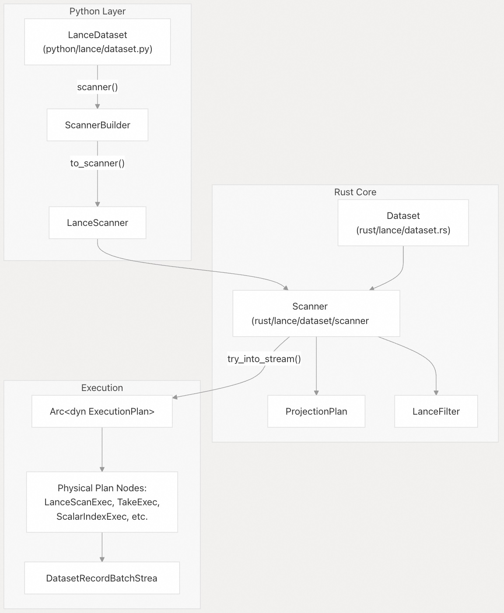
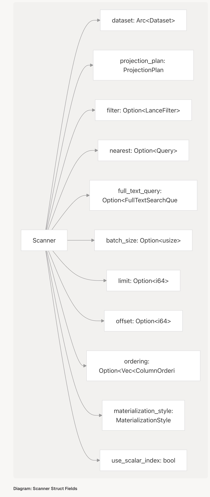
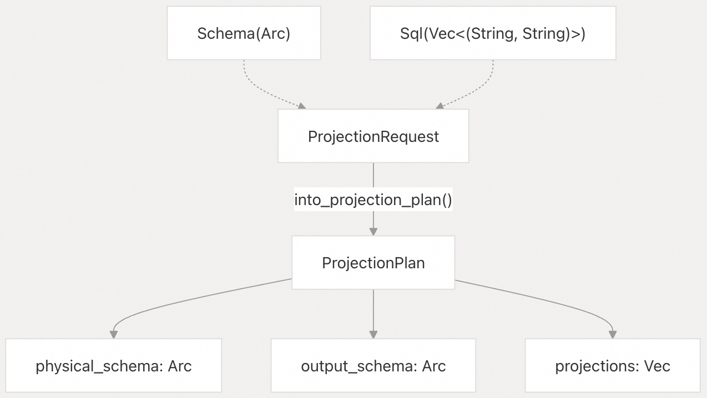
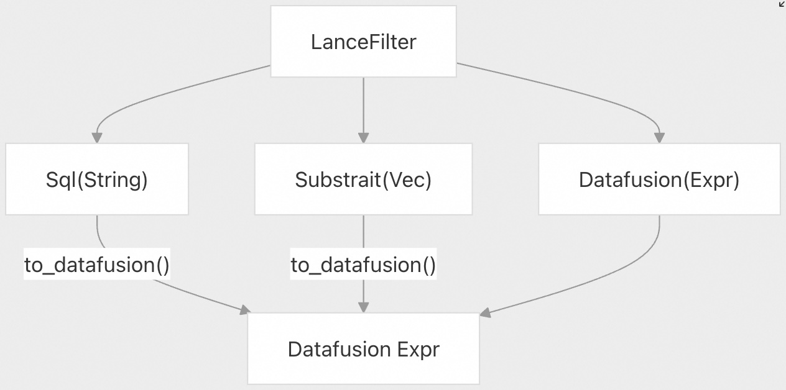
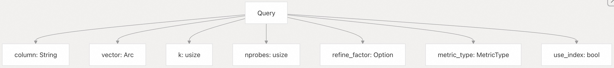
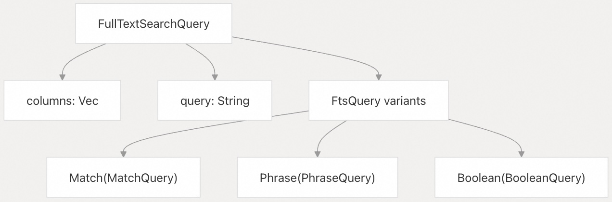
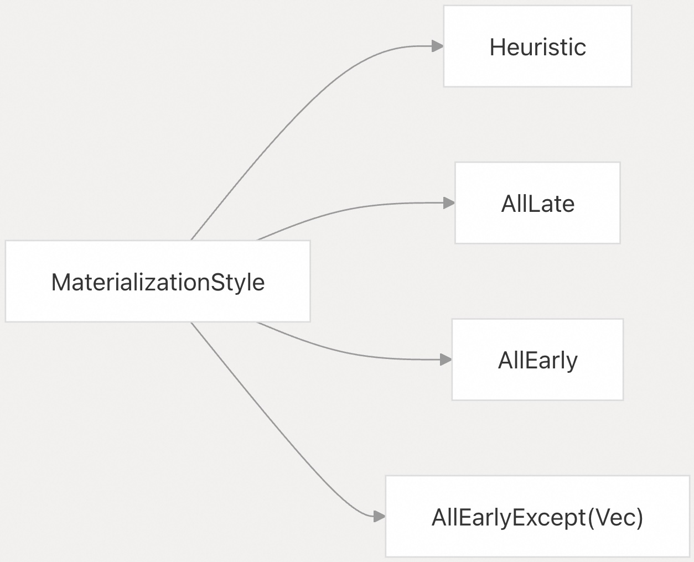
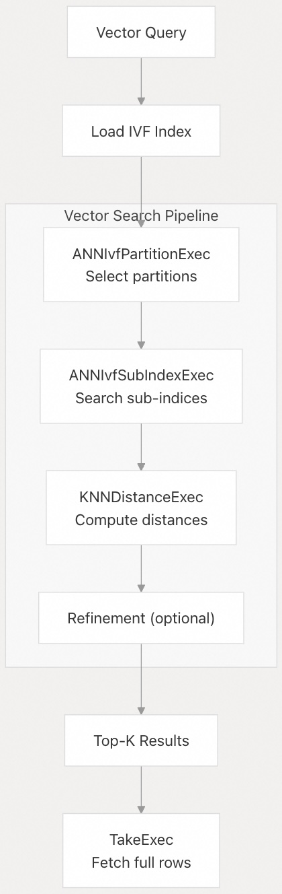

## Lance 源码学习: 4.1 扫描器（Scanner） API  
  
### 作者  
digoal  
  
### 日期  
2025-12-10  
  
### 标签  
Lance , AI 数据存储与搜索引擎 , 存储引擎 , 向量索引 , 标量索引 , 全文检索 , 多模态支持 , 零拷贝 , 版本控制 , 时间旅行 , 源码学习 , 随机访问加速 , Parquet  
  
----  
  
## 背景  
**Scanner API**（扫描器 API）提供了从 Lance 数据集读取和查询数据的主要接口。它支持 **Columnar Projection**（列式投影）、**Predicate Filtering**（谓词过滤）、向量相似性搜索、全文搜索以及各种性能优化。**Scanner** 会构建 **DataFusion** 执行计划，并将这些计划与 Lance 的存储层和索引子系统集成。  
  
**来源:**  
[`rust/lance/src/dataset/scanner.rs` 304-441](https://github.com/lance-format/lance/blob/0204e7e2/rust/lance/src/dataset/scanner.rsL304-L441)  
[`python/python/lance/dataset.py` 689-922](https://github.com/lance-format/lance/blob/0204e7e2/python/python/lance/dataset.pyL689-L922)  
  
-----  
  
## 核心架构  
  
**Scanner API** 在 Rust 和 Python 中都实现为**Builder Pattern**（构建器模式）。Rust 中的 `Scanner` 结构体维护配置状态并生成执行计划，而 Python 的 `LanceScanner` 则通过 PyO3 绑定封装了这一功能。  
  
    
  
**图表：Scanner API 架构**  
  
扫描器配置从 Python 流经 Rust，构建起一组参数，这些参数最终被转换为 **DataFusion** 执行计划。  
  
**来源:**  
[`python/python/lance/dataset.py` 689-922](https://github.com/lance-format/lance/blob/0204e7e2/python/python/lance/dataset.pyL689-L922)  
[`rust/lance/src/dataset/scanner.rs` 304-441](https://github.com/lance-format/lance/blob/0204e7e2/rust/lance/src/dataset/scanner.rsL304-L441)  
  
-----  
  
## 扫描器配置  
  
### 创建扫描器  
  
扫描器是通过 `Dataset` 实例的 `scanner()` 方法创建的。该方法在 Python 中返回一个 `ScannerBuilder`，可以在调用 `to_scanner()` 获取最终扫描器之前进行进一步配置。  
  
```python  
# Python example  
dataset = lance.dataset("data.lance")  
scanner = dataset.scanner(  
    columns=["id", "vector", "metadata"],  
    filter="price > 100",  
    limit=1000  
)  
```  
  
Rust 实现将扫描器状态维护在 `Scanner` 结构体中：  
  
    
  
**图表：Scanner 结构体字段**  
  
**来源:**  
[`rust/lance/src/dataset/scanner.rs` 318-441](https://github.com/lance-format/lance/blob/0204e7e2/rust/lance/src/dataset/scanner.rsL318-L441)  
[`python/python/lance/dataset.py` 689-714](https://github.com/lance-format/lance/blob/0204e7e2/python/python/lance/dataset.pyL689-L714)  
  
-----  
  
## 投影（Projection）与列选择  
  
### 列投影  
  
`columns` 参数控制扫描返回哪些列。它接受多种格式：  
  
  * **列名列表**：`["col1", "col2"]`  
  * **SQL 表达式字典**：`{"new_col": "col1 + col2"}`  
  * **None**（空）：返回所有列（默认）  
  
在内部，这表示为 `ProjectionRequest`，它可以是基于 **Schema**（模式）的**Projection**（投影）或 SQL 表达式。  
  
    
  
**图表：投影解析流程**  
  
投影计划将必须从磁盘读取的**物理列**与应用任何 SQL 表达式后的**逻辑输出模式**分开。  
  
**来源:**  
[`rust/lance/src/dataset.rs` 318-424](https://github.com/lance-format/lance/blob/0204e7e2/rust/lance/src/dataset.rsL318-L424)  
[`python/python/lance/dataset.py` 687-920](https://github.com/lance-format/lance/blob/0204e7e2/python/python/lance/dataset.pyL687-L920)  
  
### 系统列  
  
Lance 支持可请求的特殊**系统列**：  
  
  * **`_rowid`**：稳定的行标识符（如果启用）  
  * **`_rowaddr`**：内部行地址 (`fragment_id << 32 | row_offset`)  
  * **`_rowoffset`**：数据集内的行偏移量  
  
这些列通过 Python 中的 `with_row_id` 和 `with_row_address` 参数访问：  
  
```python  
scanner = dataset.scanner(with_row_id=True, with_row_address=True)  
```  
  
**来源:**  
[`rust/lance/src/dataset/scanner.rs` 430-440](https://github.com/lance-format/lance/blob/0204e7e2/rust/lance/src/dataset/scanner.rsL430-L440)  
[`lance/core/src/lib.rs` (ROW\_ID, ROW\_ADDR constants)](https://github.com/lance-format/lance/blob/0204e7e2/lance/core/src/lib.rs)  
  
-----  
  
## 过滤（Filtering）  
  
### 过滤表达式  
  
`filter` 参数接受 SQL `WHERE` 子句表达式或 Arrow 计算表达式。过滤器在内部表示为 `LanceFilter` 枚举：  
  
    
  
**图表：过滤器表示**  
  
所有过滤器类型最终都被转换为 **DataFusion** 表达式以供执行。  
  
**来源:**  
[`rust/lance/src/dataset/scanner.rs` 230-302](https://github.com/lance-format/lance/blob/0204e7e2/rust/lance/src/dataset/scanner.rsL230-L302)  
  
### 过滤器下推（Filter Pushdown）  
  
过滤器可以在不同阶段应用：  
  
  * **早期过滤（Early filtering）** ：在文件扫描期间，**Projection**（投影）之前应用。  
  * **后期过滤（Late filtering）** ：在 **Projection**（投影）之后应用。  
  * **基于索引的过滤（Index-based filtering）** ：使用标量索引来跳过数据。  
  
`use_stats` 参数（默认值：`true`）启用基于统计信息的**Pruning**（剪枝），而 `use_scalar_index`（默认值：`true`）则启用标量索引的使用。  
  
**来源:**  
[`rust/lance/src/dataset/scanner.rs` 369-380](https://github.com/lance-format/lance/blob/0204e7e2/rust/lance/src/dataset/scanner.rsL369-L380)  
  
-----  
  
## 向量搜索  
  
### 最近邻搜索  
  
`nearest` 参数启用向量相似性搜索（**k-NN** 或 **ANN**）。它接受一个包含以下内容的字典：  
  
```  
scanner = dataset.scanner(  
    nearest={  
        "column": "embedding",  
        "q": query_vector,          # Query vector  
        "k": 10,                     # Number of results  
        "nprobes": 20,              # IVF partitions to search  
        "refine_factor": 10,        # Refinement multiplier  
        "use_index": True           # Whether to use vector index  
    }  
)  
```  
  
在内部，这被存储为 `Query` 结构体：  
  
    
  
**图表：向量查询结构**  
  
**来源:**  
[`rust/lance/src/dataset/scanner.rs` 367-367](https://github.com/lance-format/lance/blob/0204e7e2/rust/lance/src/dataset/scanner.rsL367-L367)  
[`python/python/lance/dataset.py` 731-744](https://github.com/lance-format/lance/blob/0204e7e2/python/python/lance/dataset.pyL731-L744)  
  
### 预过滤（Prefiltering）  
  
`prefilter` 参数控制标量过滤器相对于向量搜索何时应用：  
  
  * **`prefilter=True`**：在向量搜索之前过滤（更准确，但可能较慢）  
  * **`prefilter=False`**：在向量搜索之后过滤（更快，但可能返回较少结果）  
  
**来源:**  
[`python/python/lance/dataset.py` 763-772](https://github.com/lance-format/lance/blob/0204e7e2/python/python/lance/dataset.pyL763-L772)  
  
-----  
  
## 全文搜索  
  
全文搜索通过 `full_text_query` 参数启用：  
  
```  
scanner = dataset.scanner(  
    full_text_query={  
        "columns": ["text_column"],  
        "query": "hello world"  
    }  
)  
```  
  
查询也可以是一个简单的字符串，在这种情况下它会搜索所有已索引的文本列。在内部，这会创建一个 `FullTextSearchQuery`：  
  
    
  
**图表：全文查询类型**  
  
全文搜索返回按 **BM25** 分数排名的结果，分数位于 `_score` 列中。  
  
**来源:**  
[`rust/lance/src/dataset/scanner.rs` 339-340](https://github.com/lance-format/lance/blob/0204e7e2/rust/lance/src/dataset/scanner.rsL339-L340)  
[`python/python/lance/dataset.py` 794-806](https://github.com/lance-format/lance/blob/0204e7e2/python/python/lance/dataset.pyL794-L806)  
  
-----  
  
## 高级配置  
  
### 实例化/物化策略（Materialization Strategy）  
  
`late_materialization` 参数控制何时获取列数据：  
  
  * **`True`**：所有列都使用**Late Materialization**（延迟实例化，即过滤后获取）  
  * **`False`**：所有列都使用**Early Materialization**（早期实例化，即过滤前获取）  
  * **`List[str]`**：指定的列使用**Late Materialization**（延迟实例化）  
  * **`None`**：基于启发式算法（默认）  
  
    
  
**图表：实例化选项**  
  
当过滤器具有高度选择性时，**Late Materialization**（延迟实例化）非常有用，因为它可以避免读取被过滤掉的行中的列数据。  
  
**来源:**  
[`rust/lance/src/dataset/scanner.rs` 176-221](https://github.com/lance-format/lance/blob/0204e7e2/rust/lance/src/dataset/scanner.rsL176-L221)  
[`python/python/lance/dataset.py` 777-793](https://github.com/lance-format/lance/blob/0204e7e2/python/python/lance/dataset.pyL777-L793)  
  
### 排序（Ordering）  
  
`order_by` 参数指定结果的排序方式：  
  
```  
scanner = dataset.scanner(  
    order_by=[  
        lance.LanceScanner.ColumnOrdering("price", ascending=True, nulls_first=False),  
        "name"  # Defaults to ascending, nulls last  
    ]  
)  
```  
  
每个排序都由 `ColumnOrdering` 结构体表示：  
  
**来源:**  
[`rust/lance/src/dataset/scanner.rs` 131-174](https://github.com/lance-format/lance/blob/0204e7e2/rust/lance/src/dataset/scanner.rsL131-L174)  
[`python/python/lance/dataset.py` 819-823](https://github.com/lance-format/lance/blob/0204e7e2/python/python/lance/dataset.pyL819-L823)  
  
### 分页（Pagination）  
  
使用 `limit` 和 `offset` 进行分页：  
  
```  
# Get rows 100-200  
scanner = dataset.scanner(limit=100, offset=100)  
```  
  
**来源:**  
[`python/python/lance/dataset.py` 727-730](https://github.com/lance-format/lance/blob/0204e7e2/python/python/lance/dataset.pyL727-L730)  
  
### 性能调优  
  
#### 批次配置（Batch Configuration）  
  
  * **`batch_size`**：返回批次的**目标**大小（默认值：可变）  
  * **`strict_batch_size`**：是否强制执行精确的批次大小  
  * **`batch_readahead`**：预取的批次数量  
  * **`fragment_readahead`**：并发读取的**Fragment**（数据片段）数量  
  
```  
scanner = dataset.scanner(  
    batch_size=8192,  
    batch_readahead=16,  
    fragment_readahead=4  
)  
```  
  
**来源:**  
[`python/python/lance/dataset.py` 745-759](https://github.com/lance-format/lance/blob/0204e7e2/python/python/lance/dataset.pyL745-L759)  
[`rust/lance/src/dataset/scanner.rs` 342-349](https://github.com/lance-format/lance/blob/0204e7e2/rust/lance/src/dataset/scanner.rsL342-L349)  
  
#### I/O 配置  
  
  * **`io_buffer_size`**：用于 I/O 操作的缓冲区大小（字节）  
  * **`scan_in_order`**：是否保持确定性顺序（默认值：`True`）  
  
**来源:**  
[`python/python/lance/dataset.py` 756-759](https://github.com/lance-format/lance/blob/0204e7e2/python/python/lance/dataset.pyL756-L759)  
[`rust/lance/src/dataset/scanner.rs` 351-352](https://github.com/lance-format/lance/blob/0204e7e2/rust/lance/src/dataset/scanner.rsL351-L352)  
  
-----  
  
## 执行管道（Execution Pipeline）  
  
### 查询规划（Query Planning）  
  
当扫描器执行时，它会构建一个 **DataFusion** 执行计划。主要的规划逻辑位于 `try_into_stream()` 方法中：  
  
    
  
**图表：扫描器规划决策流程**  
  
扫描器根据查询特征选择不同的执行策略，在适用时倾向于更专业的**Operator**（操作符）。  
  
**来源:**  
[`rust/lance/src/dataset/scanner.rs` 655-1200](https://github.com/lance-format/lance/blob/0204e7e2/rust/lance/src/dataset/scanner.rsL655-L1200)  
  
### 物理操作符（Physical Operators）  
  
扫描器使用的关键执行计划节点：  
  
| 操作符（Operator） | 目的 | 源代码文件 |  
| :--- | :--- | :--- |  
| `LanceScanExec` | 带有完整**Projection**（投影）的基本 **Fragment**（数据片段）扫描 | [`rust/lance/src/io/exec/lance_scan.rs`](https://github.com/lance-format/lance/blob/0204e7e2/rust/lance/src/io/exec/lance_scan.rs) |  
| `FilteredReadExec` | 使用来自索引的行范围的过滤扫描 | [`rust/lance/src/io/exec/filtered_read.rs`](https://github.com/lance-format/lance/blob/0204e7e2/rust/lance/src/io/exec/filtered_read.rs) |  
| `TakeExec` | 按行 ID/地址/偏移量直接行访问 | [`rust/lance/src/io/exec/take.rs`](https://github.com/lance-format/lance/blob/0204e7e2/rust/lance/src/io/exec/take.rs) |  
| `ScalarIndexExec` | 执行标量索引查询（BTree、Bitmap 等） | [`rust/lance/src/io/exec/scalar_index.rs`](https://github.com/lance-format/lance/blob/0204e7e2/rust/lance/src/io/exec/scalar_index.rs) |  
| `MaterializeIndexExec` | 将索引结果转换为行地址 | [`rust/lance/src/io/exec/scalar_index.rs`](https://github.com/lance-format/lance/blob/0204e7e2/rust/lance/src/io/exec/scalar_index.rs) |  
| `ANNIvfPartitionExec` | 向量索引分区选择（IVF 阶段） | [`rust/lance/src/io/exec/knn.rs`](https://github.com/lance-format/lance/blob/0204e7e2/rust/lance/src/io/exec/knn.rs) |  
| `ANNIvfSubIndexExec` | 向量索引分区搜索（PQ/SQ 阶段） | [`rust/lance/src/io/exec/knn.rs`](https://github.com/lance-format/lance/blob/0204e7e2/rust/lance/src/io/exec/knn.rs) |  
| `MatchQueryExec` | 带有 BM25 评分的全文搜索执行 | [`rust/lance/src/io/exec/fts.rs`](https://github.com/lance-format/lance/blob/0204e7e2/rust/lance/src/io/exec/fts.rs) |  
| `AddRowAddrExec` | 添加 `_rowaddr` 系统列 | [`rust/lance/src/io/exec/mod.rs`](https://github.com/lance-format/lance/blob/0204e7e2/rust/lance/src/io/exec/mod.rs) |  
| `AddRowOffsetExec` | 添加 `_rowoffset` 系统列 | [`rust/lance/src/io/exec/mod.rs`](https://github.com/lance-format/lance/blob/0204e7e2/rust/lance/src/io/exec/mod.rs) |  
| `LanceFilterExec` | 对批次应用**Predicate Filter**（谓词过滤） | [`rust/lance/src/io/exec/mod.rs`](https://github.com/lance-format/lance/blob/0204e7e2/rust/lance/src/io/exec/mod.rs) |  
  
**来源:**  
[`rust/lance/src/io/exec/`](https://github.com/lance-format/lance/blob/0204e7e2/rust/lance/src/io/exec/) (各种执行模块)  
  
### 流式执行（Stream Execution）  
  
最终结果是 `DatasetRecordBatchStream`，它封装了一个 **DataFusion** 的 `SendableRecordBatchStream`：  
  
    
  
**图表：流式执行与消费**  
  
`DatasetRecordBatchStream` 被定义为一个类型别名，并实现了 `Stream` **Trait**（特征）以实现异步批次迭代。  
  
**来源:**  
[`rust/lance/src/dataset/scanner.rs` 93-95](https://github.com/lance-format/lance/blob/0204e7e2/rust/lance/src/dataset/scanner.rsL93-L95)  
  
-----  
  
## 扫描器方法（Scanner Methods）  
  
### 核心方法  
  
扫描器提供了几种用于消费结果的方法：  
  
**Rust API：**  
  
  * `try_into_stream() -> Result<DatasetRecordBatchStream>`：执行并返回一个**Record Batch**（记录批次）流  
  * `try_into_dfstream() -> Result<SendableRecordBatchStream>`：转换为 **DataFusion** 流  
  * `explain_plan(verbose: bool) -> Result<String>`：显示执行计划  
  * `count_rows() -> Result<usize>`：计算匹配的行数，无需实例化数据  
  
**Python API（通过 `_Scanner` 绑定）：**  
  
  * `to_table() -> pa.Table`：将所有结果实例化为 PyArrow 表  
  * `to_batches() -> Iterator[pa.RecordBatch]`：延迟迭代批次  
  * `to_reader() -> pa.RecordBatchReader`：获取 Arrow 读取器接口  
  * `explain_plan(verbose: bool) -> str`：显示物理执行计划  
  * `count_rows() -> int`：返回匹配的行数  
  
```  
# Python examples  
table = scanner.to_table()  
for batch in scanner.to_batches():  
    process(batch)  
plan = scanner.explain_plan(verbose=True)  
row_count = scanner.count_rows()  
```  
  
**来源:**  
[`python/src/scanner.rs` 1-100](https://github.com/lance-format/lance/blob/0204e7e2/python/src/scanner.rsL1-L100)  
[`rust/lance/src/dataset/scanner.rs` 655-750](https://github.com/lance-format/lance/blob/0204e7e2/rust/lance/src/dataset/scanner.rsL655-L750)  
  
### 投影模式（Projection Schema）  
  
扫描器提供对其输出模式的访问：  
  
```  
scanner = dataset.scanner(columns=["id", "vector"])  
schema = scanner.projected_schema  # PyArrow schema  
```  
  
**来源:**  
[`python/python/lance/dataset.py` 922-930](https://github.com/lance-format/lance/blob/0204e7e2/python/python/lance/dataset.pyL922-L930)  
  
-----  
  
## Take 操作  
  
扫描器可以检测并优化通过 ID 或地址请求特定行的 "**Take**" 模式：  
  
```  
# These patterns are detected and optimized  
scanner = dataset.scanner(filter="_rowid IN (1, 2, 3)")  
scanner = dataset.scanner(filter="_rowid = 10 OR _rowid = 20")  
scanner = dataset.scanner(filter="_rowaddr = 100")  
```  
  
扫描器使用 `TakeOperation::try_from_expr()` 来检测这些模式，并将它们转换为高效的 `TakeExec` 计划。  
  
[`rust/lance/src/dataset/scanner.rs` 493-611](https://github.com/lance-format/lance/blob/0204e7e2/rust/lance/src/dataset/scanner.rsL493-L611) 中的 `TakeOperation::try_from_expr()` 方法通过递归分析过滤表达式树并提取行 ID/地址/偏移量列表来检测这些模式。  
  
**来源:**  
[`rust/lance/src/dataset/scanner.rs` 442-611](https://github.com/lance-format/lance/blob/0204e7e2/rust/lance/src/dataset/scanner.rsL442-L611)  
  
-----  
  
## 与索引集成 (Integration with Indices)  
  
### 标量索引使用 (Scalar Index Usage)  
  
当 `use_scalar_index=True`（默认值）时，扫描器（scanner）会自动使用 **BTree**、**布隆过滤器**（Bloom filter）或 **倒排索引**（inverted indices）来加速查询：  
  
    
  
**图表：标量索引查询路径 (Diagram: Scalar Index Query Path)**  
  
来源:  
[`rust/lance/src/dataset/scanner.rs` 950-1050](https://github.com/lance-format/lance/blob/0204e7e2/rust/lance/src/dataset/scanner.rsL950-L1050)  
  
### 向量索引使用 (Vector Index Usage)  
  
当指定了 `nearest` 参数且向量索引存在时，扫描器会使用基于 **IVF** 的索引：  
  
    
  
**图表：向量索引查询路径 (Diagram: Vector Index Query Path)**  
  
`refine_factor` 参数控制是否进行过量抓取（over-fetch）并使用精确距离进行**精炼**（refine）。  
  
来源:  
[`rust/lance/src/dataset/scanner.rs` 1200-1400](https://github.com/lance-format/lance/blob/0204e7e2/rust/lance/src/dataset/scanner.rsL1200-L1400)  
  
-----  
  
## 错误处理 (Error Handling)  
  
常见的扫描器错误：  
  
  * **列名无效**：请求不存在的列。  
  * **类型不匹配**：过滤表达式使用错误的类型。  
  * **缺少索引**：没有所需索引的向量/文本搜索。  
  * **表达式无效**：格式错误的 SQL 表达式。  
  
扫描器在规划（planning）期间验证配置并返回描述性错误。  
  
来源:  
[`rust/lance/src/dataset/scanner.rs` (throughout)](https://github.com/lance-format/lance/blob/0204e7e2/rust/lance/src/dataset/scanner.rs)  
  
-----  
  
## 性能考量 (Performance Considerations)  
  
### 选择批次大小 (Choosing Batch Size)  
  
更大的批次大小（batch sizes）可以减少开销（overhead），但会增加内存使用：  
  
  * **小型数据集**：使用默认值或较小值（1024-4096）。  
  * **大型数据集**：使用较大值（8192-16384）。  
  * **内存受限**：使用较小的值。  
  
### 片段预读 (Fragment Readahead)  
  
更高的片段预读（fragment readahead）可提高大型扫描的吞吐量（throughput），但会增加内存：  
  
  * **顺序扫描**：使用较高的值（8-16）。  
  * **随机访问**：使用较低的值（2-4）。  
  * **云存储**：使用较高的值以最大化吞吐量。  
  
### 物化策略 (Materialization Strategy)  
  
对于**高选择性过滤器**（highly selective filters）（\< 1% 的行）：  
  
  * 使用**后期物化**（late materialization）或设置 `late_materialization=True`。  
  
对于**低选择性过滤器**（less selective filters）（\> 10% 的行）：  
  
  * 使用**早期物化**（early materialization）或设置 `late_materialization=False`。  
  
来源:  
[`rust/lance/src/dataset/scanner.rs` 176-221](https://github.com/lance-format/lance/blob/0204e7e2/rust/lance/src/dataset/scanner.rsL176-L221)  
[`python/python/lance/dataset.py` 777-793](https://github.com/lance-format/lance/blob/0204e7e2/python/python/lance/dataset.pyL777-L793)  
  
-----  
  
## 示例用法 (Example Usage)  
  
### 基本扫描 (Basic Scan)  
  
```python  
import lance  
import pyarrow.compute as pc  
  
# Open dataset (打开数据集)  
dataset = lance.dataset("data.lance")  
  
# Configure scanner (配置扫描器)  
scanner = dataset.scanner(  
    columns=["id", "name", "price"],  
    filter=pc.field("price") > 100,  
    limit=100  
)  
  
# Execute and get results (执行并获取结果)  
table = scanner.to_table()  
```  
  
### 向量搜索 (Vector Search)  
  
```python  
import numpy as np  
  
# Query vector (查询向量)  
query = np.random.randn(128).astype(np.float32)  
  
# Vector search with filtering (带过滤器的向量搜索)  
scanner = dataset.scanner(  
    columns=["id", "metadata"],  
    nearest={  
        "column": "embedding",  
        "q": query,  
        "k": 10,  
        "refine_factor": 5  
    },  
    filter="category = 'electronics'",  
    prefilter=True  
)  
  
results = scanner.to_table()  
```  
  
### 全文搜索 (Full-Text Search)  
  
```python  
# Full-text search (全文搜索)  
scanner = dataset.scanner(  
    full_text_query="machine learning",  
    limit=20  
)  
  
results = scanner.to_table()  
  
# Results include _score column with BM25 scores   
# (结果包含带有 BM25 分数的 _score 列)  
```  
  
  
-----  
  
# 附录1: **【架构师/开发者角度】** 索引集成与查询优化的痛点：Lance 是如何在高维向量搜索和复杂标量过滤之间，做出智能的查询路径选择（例如预过滤和后期物化），以确保查询延迟最优？  
  
## 展开细节、背景知识与痛点  
  
* **背景痛点 (The Pain Point)** ：在向量数据库中，通常存在向量搜索（例如 K-NN 搜索，使用 **IVF** 索引）和标量过滤（例如 `WHERE price > 100`，使用 **BTree** 或 **Bloom Filter** 索引）的混合查询。  
    * 如果先做向量搜索，再做标量过滤（**Post-filtering**），可能导致返回的 $k$ 个结果中，有大量不符合标量条件的行，浪费计算资源。  
    * 如果先做标量过滤（**Prefiltering**），再做向量搜索，虽然结果精确，但如果过滤选择性低，可能会增加向量索引查询的搜索空间，拖慢速度。  
* **Lance 的机制**：Scanner API 提到了 `prefilter` 参数（手动控制预过滤 vs. 后期过滤）以及 `late_materialization`（后期物化）策略。  
* **价值提问**：  
    1.  除了手动设置 `prefilter=True/False` 外，Lance 内部的 **DataFusion 执行计划**是如何**自动决策**和**优**化查询路径的？  
    2.  `late_materialization` 是如何与向量搜索（`nearest`）和标量过滤（`filter`）结合起来，最小化磁盘 I/O 的？（例如：是否只有在过滤完成之后，才去读取 `columns` 中非向量的列数据？）  
    3.  `refine_factor`（精炼因子）在 **IVF** 索引中使用时，如何平衡召回率 (Recall) 和查询延迟 (Latency)？  
  
## 回答  
  
Lance通过DataFusion执行计划、预过滤策略和后期物化机制来优化混合查询路径选择，主要实现包括：  
  
1. **自动决策机制**：Scanner在`create_plan()`中根据`prefilter`参数和索引覆盖情况自动选择执行路径    
  
2. **后期物化优化**：通过`MaterializationStyle`枚举控制列物化时机，向量搜索默认使用后期物化    
  
3. **refine_factor平衡**：在IVF索引中控制重排序候选数量，平衡召回率与延迟    
  
  
### 1. DataFusion执行计划的自动决策  
  
Lance的查询优化核心在`Scanner::create_plan()`方法中实现：  
  
```rust  
// 决定是否使用标量索引（仅在预过滤时）  
let use_scalar_index = self.use_scalar_index && (self.prefilter || self.nearest.is_none());  
```    
  
执行计划根据查询类型自动选择：  
- **向量搜索**：调用`vector_search_source()`处理    
- **标量过滤**：通过`create_filter_plan()`创建过滤计划  
- **混合查询**：根据`prefilter`参数决定执行顺序  
  
预过滤源创建逻辑：  
```rust  
async fn prefilter_source(&self, filter_plan: &FilterPlan, required_frags: RoaringBitmap) -> Result<PreFilterSource>  
```    
  
### 2. late_materialization与I/O优化  
  
物化策略通过`MaterializationStyle`枚举控制：    
  
- **Heuristic**：基于存储类型的启发式策略（云存储>1000字节，本地存储>10字节）  
- **AllLate**：所有列延迟物化  
- **AllEarly**：所有列早期物化  
  
在Python API中，`late_materialization`参数可以精确控制：  
```python  
def scanner(self, *, late_materialization: Optional[bool | List[str]] = None):  
```    
  
向量搜索始终使用后期物化，只有在过滤完成后才读取非向量列数据  。  
  
### 3. refine_factor的召回率与延迟平衡  
  
在IVF索引中，`refine_factor`控制重排序策略：    
  
工作原理：  
- 如果k=10且refine_factor=5，先检索50个ANN候选  
- 使用实际距离重新排序  
- 返回前10个结果  
  
在KNN执行节点中实现：  
```rust  
pub struct ANNIvfSubIndexExec {  
    query: Query,  
    prefilter_source: PreFilterSource,  
    // ...  
}  
```    
  
### 4. 索引覆盖与片段分区  
  
Lance通过片段位图优化索引选择：  
```rust  
async fn partition_frags_by_coverage(&self, index_expr: &ScalarIndexExpr, fragments: Arc<Vec<Fragment>>) -> Result<(Vec<Fragment>, Vec<Fragment>)>  
```    
  
确保只使用覆盖所有相关片段的索引，避免不完整的索引查询。  
  
## Notes  
  
- Lance的查询优化主要在Rust层实现，Python层提供参数接口  
- 预过滤决策基于`prefilter`参数和索引覆盖情况自动选择  
- 后期物化策略对I/O密集型查询特别有效  
- `refine_factor`是召回率和延迟的关键调优参数  
  
  
  
  
-----  
  
# 附录2: **【用户/开发者角度】** 性能调优的量化指导：在面临不同的数据特征和硬件限制时，应如何科学地选择关键的性能参数？  
  
## 展开细节、背景知识与日常使用动作  
  
* **日常使用/维护动作**：用户在生产环境中部署 Lance 时，经常需要面对大数据集、云存储 I/O 延迟和内存限制。`Scanner API` 中提供的性能参数（`batch_size`、`fragment_readahead`、`io_buffer_size`）是核心调优点。  
* **背景知识**：这些参数之间存在复杂的相互作用和权衡（Trade-offs）：  
    * `batch_size` vs 内存占用 vs CPU 开销。  
    * `fragment_readahead` vs I/O 延迟隐藏 vs 内存占用。  
* **价值提问**：  
    1.  针对**云存储 (如 S3/GCS) 环境**，我们应如何量化地指导用户设置 `fragment_readahead` 和 `io_buffer_size` 的值，以最大化 **I/O 吞吐量**？是否有推荐的经验法则（Rule of Thumb）？  
    2.  `batch_size` 和 `fragment_readahead` 的设置，是否应该与底层 **Arrow RecordBatch** 的大小保持一致，以避免不必要的内存拷贝或重组？  
    3.  对于需要**严格确定性顺序**（`scan_in_order=True`）的场景，Lance 内部的并发度会受到多大程度的限制？如何在这种约束下，通过其他参数（如 `batch_readahead`）来弥补性能损失？  
  
## 回答  
  
## 性能调优量化指导  
  
基于 Lance Scanner API 的实现，以下是针对不同数据特征和硬件限制的科学参数选择指导：  
  
### 1. 云存储环境的 `fragment_readahead` 和 `io_buffer_size` 设置  
  
**经验法则：**  
- `io_buffer_size`: 默认 2GB，支持约 256 个并发 I/O 线程    
- `fragment_readahead`: 默认为 `2 * io_parallelism`（v2 文件格式）    
  
**云存储优化建议：**  
```python  
# 对于高吞吐云存储（S3/GCS）  
io_buffer_size = 2 * 1024**3  # 2GB  
fragment_readahead = 128  # 或更高，取决于网络带宽  
```  
  
内存计算公式：`扫描内存使用 ≈ (2 * io_buffer_size) + (batch_size * num_compute_threads)`    
  
### 2. `batch_size` 与 Arrow RecordBatch 的一致性  
  
**默认计算逻辑：**  
```rust  
batch_size = max(object_store.block_size() / 4, BATCH_SIZE_FALLBACK) // 8192  
```    
  
**对齐建议：**  
- 标量数据：保持批次大小约 1MB，默认 8192 行通常合适    
- 大向量数据（如 1024 维浮点向量）：建议减小到 1024 行/批次以控制内存    
  
### 3. `scan_in_order=True` 的并发限制与补偿  
  
**并发影响：**  
- `scan_in_order=True` 时，v1 文件格式会限制并发度，必须按顺序处理片段    
- v2 文件格式无此限制，始终可以并发扫描    
  
**补偿策略：**  
```python  
# 对于需要顺序的场景，增加 batch_readahead  
batch_readahead = num_cpu_cores * 2  # 默认为 CPU 核心数  
```    
  
## 详细参数交互分析  
  
### I/O 线程池配置  
- 本地存储：默认 8 个 I/O 线程  
- 云存储：默认 64 个 I/O 线程，可能需要 128-256 个来饱和网络带宽    
  
### 内存使用估算  
每个 I/O 线程约需 32MB 内存缓冲页面数据  。  
  
### 参数优先级  
1. 首先设置 `io_buffer_size` 基于 I/O 线程数  
2. 然后调整 `fragment_readahead` 基于 I/O 并行度  
3. 最后根据行大小和内存限制微调 `batch_size`  
  
## Notes  
  
- v2 文件格式（当前默认）在 `scan_in_order` 方面有显著性能改进，无并发损失    
- `batch_readahead` 参数在 v2 文件格式中被忽略    
- 环境变量 `LANCE_IO_THREADS` 和 `LANCE_CPU_THREADS` 可覆盖默认线程数    
  
  
  
-----  
  
# 附录3: **【开发者角度】** 扩展性与架构：Scanner API 底层是如何与 DataFusion 抽象集成的？这为 Lance 未来支持更复杂的 SQL 分析能力带来了哪些可能性？  
  
## 展开细节与背景知识  
  
* **背景知识**：文档提到：“The Scanner builds **DataFusion execution plans** that integrate with Lance's storage layer and indexing subsystems.” (**DataFusion** 是一个基于 Rust 的 Apache Arrow SQL 查询引擎）。  
* **开发者痛点**：对于希望在 Lance 上构建复杂数据管道或自定义查询功能的开发者来说，了解其底层架构至关重要。  
* **价值提问**：  
    1.  Lance **Scanner** 是如何将其特有的功能（如 `nearest` 向量搜索、全文搜索）转化为 DataFusion **物理计划**中的自定义**优化器规则**或**自定义算子**（Custom Operators/Functions）的？（例如，向量搜索是否被视为一个特殊的**表函数**或**数据源**？）  
    2.  DataFusion 的集成是否意味着 Lance **天然支持**更高级的 SQL 聚合操作（例如 `GROUP BY`、`JOIN`）？如果支持，Scanner API 层面是否有计划暴露这些能力？  
    3.  在支持 **Deletion Vectors**（删除向量）和 **Stable Row IDs**（稳定行 ID）时，Scanner 是如何将这些系统级的列 (`_rowid` 等) 高效地集成到 DataFusion 的数据流中，确保被标记为删除的行不会被返回？  
  
## 回答  
  
Lance Scanner API 与 DataFusion 集成架构分析  
  
## 核心集成机制  
  
Lance Scanner 通过构建 DataFusion 物理执行计划来实现查询引擎集成。核心入口是 `Scanner::create_plan()` 方法，它根据查询类型（向量搜索、全文搜索或普通扫描）创建不同的执行计划  。  
  
### 1. 特有功能的 DataFusion 转化  
  
#### 向量搜索（nearest）  
向量搜索通过自定义的 DataFusion 物理算子实现，主要包括：  
- `KNNVectorDistanceExec` - 执行向量距离计算  
- `ANNIVFPartitionExec` - 处理 IVF 索引分区搜索    
- `MultivectorScoringExec` - 处理多向量评分  
  
这些算子作为 DataFusion 执行计划树中的节点，不是表函数而是数据源算子。  
  
#### 全文搜索（full_text_query）  
全文搜索同样通过自定义算子实现：  
- `MatchQueryExec` - 执行匹配查询  
- `PhraseQueryExec` - 执行短语查询  
- `BooleanQueryExec` - 执行布尔查询    
  
### 2. 高级 SQL 操作支持  
  
Lance 通过 `LanceTableProvider` 实现了 DataFusion 的 `TableProvider` trait，天然支持：  
- **JOIN 操作**：文档展示了两个数据集的 JOIN 示例    
- **GROUP BY 聚合**：通过 DataFusion 的聚合执行器支持  
- **复杂 SQL 查询**：支持完整的 DataFusion SQL 语法  
  
Scanner API 层面通过 `Dataset::sql()` 方法暴露这些能力  。  
  
### 3. 删除向量和稳定行 ID 处理  
  
系统列通过以下机制集成：  
  
#### Schema 层面  
在 `LanceScanExec` 中，系统列通过 `LanceScanConfig` 控制是否添加到输出 schema  ：  
```rust  
pub struct LanceScanConfig {  
    pub with_row_id: bool,  
    pub with_row_address: bool,  
    pub with_make_deletions_null: bool,  
    // ...  
}  
```  
  
#### 执行层面  
- `with_make_deletions_null` 选项控制是否将删除行的 `_rowid` 设为 null    
- 删除向量通过 `DeletionVector` 在数据读取时过滤    
  
#### DataFusion 集成  
在 `LanceTableProvider::scan()` 中，系统列通过投影索引处理  ：  
```rust  
if Some(*field_idx) == self.row_id_idx {  
    scan.with_row_id();  
} else if Some(*field_idx) == self.row_addr_idx {  
    scan.with_row_address();  
}  
```  
  
## 架构扩展性  
  
这种设计为未来扩展提供了强大基础：  
  
1. **自定义算子机制**：新的索引类型或搜索算法可以通过实现新的 DataFusion 物理算子轻松集成  
2. **优化器规则**：可以通过添加自定义优化器规则来优化特定查询模式  
3. **UDF 支持**：文档展示了如何注册和使用自定义函数    
4. **流式处理**：支持大于内存的聚合操作  
  
## Notes  
  
- Scanner 的计划构建分为 5 个阶段：源、过滤、排序、限制/偏移、投影    
- 向量搜索和过滤的组合执行顺序可以通过 `prefilter` 参数控制  
- 系统列 `_rowid`、`_rowaddr` 等在 DataFusion 中被视为普通列，但由 Lance 特殊处理  
- Java API 也提供了相同的 SQL 查询能力    
  
    
#### [PolarDB 学习图谱](https://www.aliyun.com/database/openpolardb/activity "8642f60e04ed0c814bf9cb9677976bd4")
  
  
#### [PostgreSQL 解决方案集合](../201706/20170601_02.md "40cff096e9ed7122c512b35d8561d9c8")
  
  
#### [德哥 / digoal's Github - 公益是一辈子的事.](https://github.com/digoal/blog/blob/master/README.md "22709685feb7cab07d30f30387f0a9ae")
  
  
#### [About 德哥](https://github.com/digoal/blog/blob/master/me/readme.md "a37735981e7704886ffd590565582dd0")
  
  

  
