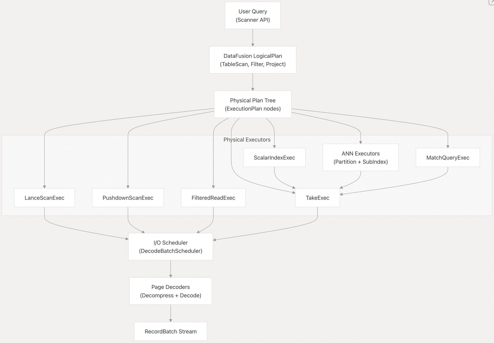
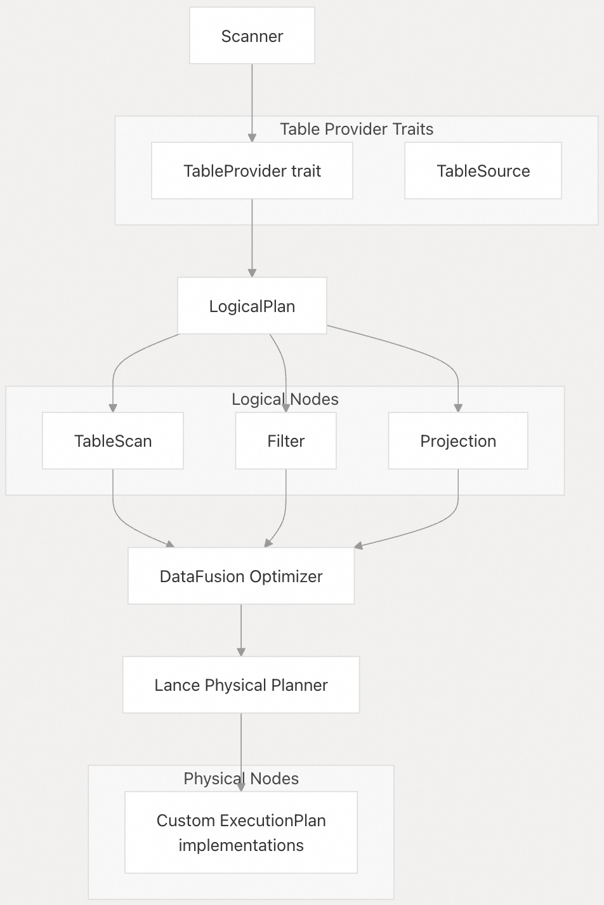
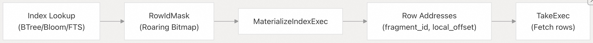
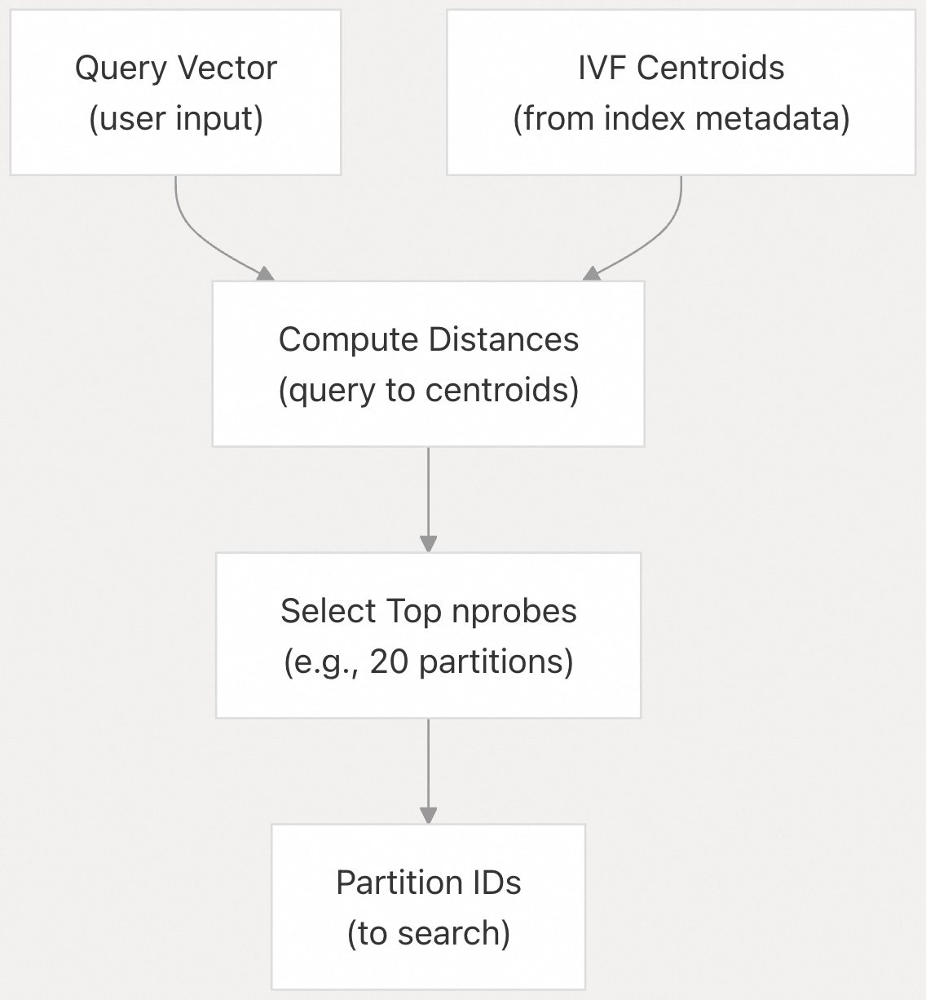
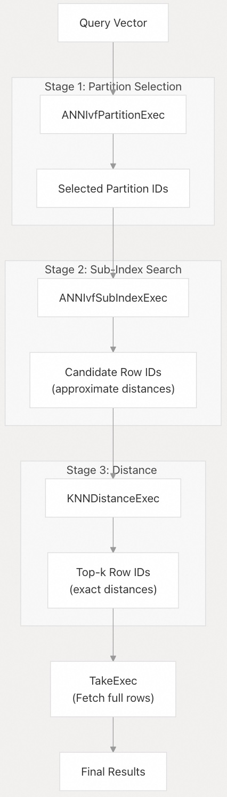
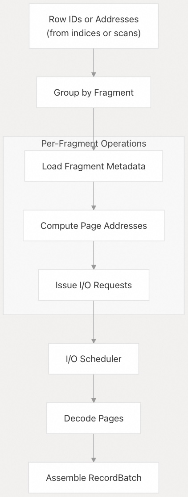
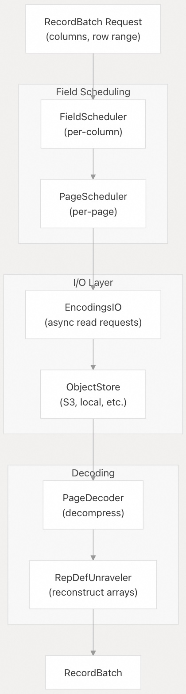
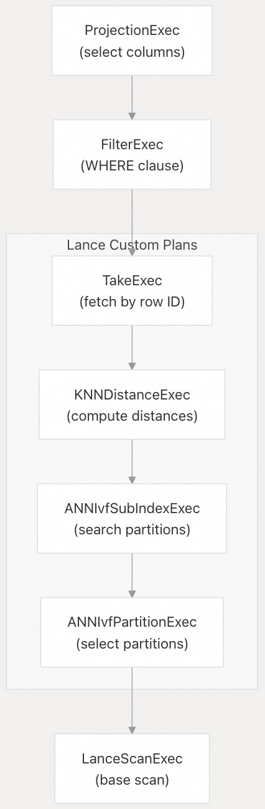

## Lance 源码学习: 4.2 查询执行管线（Query Execution Pipeline）  
    
### 作者    
digoal    
    
### 日期    
2025-12-10    
    
### 标签    
Lance , AI 数据存储与搜索引擎 , 存储引擎 , 向量索引 , 标量索引 , 全文检索 , 多模态支持 , 零拷贝 , 版本控制 , 时间旅行 , 源码学习 , 随机访问加速 , Parquet    
    
----    
    
## 背景    
本文介绍了 Lance 内部的**查询执行架构**，内容涵盖用户查询如何从高级 API 调用转换为**物理执行计划（Physical Execution Plans）** ，并最终转化为 **Arrow 记录批次（RecordBatches）** 。这包括 Lance 如何集成 **Apache DataFusion** 进行查询规划、自定义的物理执行操作符、I/O 调度和数据解码等。  
  
-----  
  
## 查询执行概述  
  
Lance 使用多阶段管线来执行查询：  
  
1.  **查询输入（Query Input）** ：用户通过 Scanner API、SQL 或 Substrait 指定查询。  
2.  **逻辑规划（Logical Planning）** ：DataFusion 将输入转换为**逻辑计划树（Logical Plan Tree）** 。  
3.  **物理规划（Physical Planning）** ：Lance 提供自定义的 **ExecutionPlan** 实现。  
4.  **执行（Execution）** ：计划异步执行，发出 I/O 请求。  
5.  **解码（Decoding）** ：数据被解压缩并解码为 Arrow 格式。  
6.  **具象化（Materialization）** ：结果作为 **Arrow 记录批次（RecordBatches）** 流式传回。  
  
**查询执行流程**  
  
  
  
来源：高级架构图（图 4：查询执行管线）  
  
-----  
  
## DataFusion 集成  
  
Lance 与 **Apache DataFusion** 深度集成，以利用其查询规划和优化能力。`Scanner` 实现了 DataFusion 的 **表提供者（table provider）** 特质（traits），允许 Lance 数据集参与 DataFusion 的逻辑和物理规划。  
  
### 逻辑计划构建  
  
当用户使用过滤器（filters）和投影（projections）创建 `Scanner` 时，Lance 会构建一个 DataFusion **逻辑计划（LogicalPlan）** 树：  
  
  * **TableScan**：表示扫描 Lance 数据集。  
  * **Filter**：应用谓词（Predicate，尽可能下推）。  
  * **Projection**：选择特定列。  
  
逻辑计划由 DataFusion 的优化器进行优化，优化内容包括：  
  
  * 谓词下推（Predicate pushdown）  
  * 投影下推（Projection pushdown）  
  * 常量折叠（Constant folding）  
  * 过滤器重排序（Filter reordering）  
  
### 物理计划生成  
  
Lance 实现了自定义的 **ExecutionPlan** 节点，这些节点理解 Lance 的存储格式和索引。在物理规划阶段，Lance 的规划器根据以下因素决定要使用的执行策略：  
  
  * 可用的索引（向量、标量、全文）  
  * 查询谓词及其选择性（selectivity）  
  * 列投影（Column projections）  
  * 排序要求（Sort requirements）  
  
**DataFusion 集成架构**  
  
  
  
来源：[`rust/lance-datafusion/src/planner.rs`](https://github.com/lance-format/lance/blob/0204e7e2/rust/lance-datafusion/src/planner.rs) [`rust/lance/src/dataset/scanner.rs`](https://github.com/lance-format/lance/blob/0204e7e2/rust/lance/src/dataset/scanner.rs)  
  
-----  
  
## 物理执行计划（Physical Execution Plans）  
  
Lance 实现了多种专门的 **ExecutionPlan** 类型，它们通过理解 Lance 格式和利用索引来高效执行查询。  
  
### 基础扫描执行器  
  
#### LanceScanExec  
  
这是基本的扫描执行器，在没有索引辅助的情况下从 Lance **数据片段（fragments）** 中读取数据。它：  
  
  * 顺序或并行地遍历数据片段。  
  * 应用 **列投影（column projection）** 以仅读取所需字段。  
  * 使用 I/O 调度器读取数据文件。  
  * 返回 `RecordBatch` 结果流。  
  
**关键实现细节：**  
  
  * 实现 DataFusion 的 `ExecutionPlan` 特质。  
  * 维护每个分区的片段元数据。  
  * 协调并行片段扫描。  
  * 基于统计信息应用行组（row group）过滤。  
  
#### PushdownScanExec  
  
这是一种优化的扫描执行器，将谓词**下推**到存储层。它：  
  
  * 在解码（decoding）期间评估谓词，以避免具象化（materializing）被过滤的行。  
  * 使用列统计信息跳过不匹配谓词的页面（pages）。  
  * 在完全解压缩之前在页面级别应用过滤器。  
  
**谓词下推流程：**  
  
  
  
来源：[`rust/lance-datafusion/src/exec/scan.rs`](https://github.com/lance-format/lance/blob/0204e7e2/rust/lance-datafusion/src/exec/scan.rs) [`rust/lance-datafusion/src/pushdown.rs`](https://github.com/lance-format/lance/blob/0204e7e2/rust/lance-datafusion/src/pushdown.rs)  
  
#### FilteredReadExec  
  
这是一种结合了索引查找和数据读取的执行器。当索引可以提供匹配行的 `RowIdMask` 时使用：  
  
  * 接受来自索引执行器的 `RowIdMask`。  
  * 仅读取掩码中指定的行。  
  * 如果没有任何行匹配，则完全跳过片段。  
  * 使用 `take` 操作进行稀疏行访问。  
  
来源：[`rust/lance-datafusion/src/exec/filtered_read.rs`](https://github.com/lance-format/lance/blob/0204e7e2/rust/lance-datafusion/src/exec/filtered_read.rs)  
  
### 标量索引执行器  
  
#### ScalarIndexExec  
  
执行标量索引查找，用于等式查询、范围查询或全文搜索等谓词。该执行器：  
  
  * 确定哪些索引可以回答查询。  
  * 执行索引查找以获取匹配的行 ID。  
  * 为下游执行器生成一个 `RowIdMask`。  
  
**标量索引类型：**  
  
  * **BTree**：范围查询（例如 `WHERE age >= 18 AND age < 65`）。  
  * **Bloom Filter**：等式检查（例如 `WHERE user_id = 'abc123'`）。  
  * **Inverted Index（倒排索引）** ：全文搜索（例如 `WHERE text MATCH 'query'`）。  
  * **Label List**：数组操作（例如 `WHERE tags CONTAIN 'ml'`）。  
  
#### MaterializeIndexExec  
  
将索引结果转换为可供 `TakeExec` 使用的行 ID 或地址：  
  
  * 从索引执行器获取 `RowIdMask` 位图。  
  * 将行 ID 解析为片段 ID 和局部偏移量。  
  * 生成用于获取的行地址列表。  
  
**索引到行 ID 的解析：**  
  
  
  
来源：[`rust/lance-datafusion/src/exec/scalar_index.rs`](https://github.com/lance-format/lance/blob/0204e7e2/rust/lance-datafusion/src/exec/scalar_index.rs) [`rust/lance-index/src/scalar/`](https://github.com/lance-format/lance/blob/0204e7e2/rust/lance-index/src/scalar/)  
  
### 向量搜索执行器  
  
向量搜索是作为一系列专门执行器的管线来实现的，这些执行器反映了 **IVF 索引**结构。  
  
#### ANNIvfPartitionExec  
  
向量搜索的第一阶段，用于识别相关的 **IVF 分区**：  
  
  * 将查询向量作为输入。  
  * 从索引元数据中加载 **IVF 质心（centroids）** 。  
  * 计算到所有质心的距离。  
  * 选择 `nprobes` 个最近的分区。  
  * 输出分区 ID 给下一阶段。  
  
**分区选择过程：**  
  
  
  
来源：[`rust/lance-index/src/vector/ivf/`](https://github.com/lance-format/lance/blob/0204e7e2/rust/lance-index/src/vector/ivf/) [`rust/lance-datafusion/src/exec/ann.rs`](https://github.com/lance-format/lance/blob/0204e7e2/rust/lance-datafusion/src/exec/ann.rs)  
  
#### ANNIvfSubIndexExec  
  
在选定的 IVF 分区内进行搜索：  
  
  * 接收来自 `ANNIvfPartitionExec` 的分区 ID。  
  * 加载分区数据（可能已量化）。  
  * 执行子索引搜索（Flat、PQ、SQ 或 HNSW）。  
  * 返回带有近似距离的**候选行 ID**。  
  * 如果存在标量谓词，则可能应用**预过滤（Prefiltering）** 。  
  
**子索引类型：**  
  
  * **Flat**：分区内的精确搜索（全向量）。  
  * **PQ (Product Quantization)** ：使用**非对称距离计算**的压缩向量。  
  * **SQ (Scalar Quantization)** ：8 位量化向量。  
  * **HNSW**：用于加速 **ANN**（Approximate Nearest Neighbor，近似最近邻）的分层可导航小世界图。  
  
#### KNNDistanceExec  
  
精炼子索引搜索的结果：  
  
  * 接收来自 `ANNIvfSubIndexExec` 的候选行 ID。  
  * 获取候选向量的**全精度向量**。  
  * 重新计算**精确距离**。  
  * 在所有分区中执行最终的 **k-NN** 选择。  
  * 处理距离度量转换（L2、余弦、点积）。  
  
**向量搜索管线：**  
  
  
  
来源：[`rust/lance-index/src/vector/ivf/`](https://github.com/lance-format/lance/blob/0204e7e2/rust/lance-index/src/vector/ivf/) [`rust/lance-datafusion/src/exec/ann.rs`](https://github.com/lance-format/lance/blob/0204e7e2/rust/lance-datafusion/src/exec/ann.rs) [`protos/index.proto` 56-74](https://github.com/lance-format/lance/blob/0204e7e2/protos/index.proto#L56-L74)  
  
### 全文搜索执行器  
  
#### MatchQueryExec  
  
使用倒排索引执行全文搜索查询：  
  
  * 解析查询文本并进行**词元化（tokenizes）** 。  
  * 查找每个词元的**倒排列表（posting lists）** 。  
  * 组合倒排列表（AND/OR/短语操作）。  
  * 计算匹配文档的 **BM25 分数**。  
  * 返回按相关性分数排序的行 ID。  
  
该执行器支持各种查询类型：  
  
  * **术语查询（Term queries）** ：单个词匹配。  
  * **短语查询（Phrase queries）** ：带有位置信息的精确短语匹配。  
  * **布尔查询（Boolean queries）** ：使用 AND/OR/NOT 组合术语。  
  
来源：[`rust/lance-index/src/scalar/inverted/`](https://github.com/lance-format/lance/blob/0204e7e2/rust/lance-index/src/scalar/inverted/) [`rust/lance-datafusion/src/exec/fts.rs`](https://github.com/lance-format/lance/blob/0204e7e2/rust/lance-datafusion/src/exec/fts.rs)  
  
### 行获取执行器  
  
#### TakeExec  
  
通过 ID 或地址获取完整行的最终执行器：  
  
  * 接收来自上游执行器的行 ID 或地址。  
  * 按片段对获取请求进行分组，以实现高效 I/O。  
  * 使用 I/O 调度器读取特定行。  
  * 应用列投影。  
  * 返回完整的 `RecordBatch` 结果。  
  
**Take 操作策略：**  
  
  * **顺序获取（Sequential Take）** ：当行 ID 大多是顺序时。  
  * **随机获取（Random Take）** ：当行 ID 分散时（使用索引）。  
  * **批次获取（Batch Take）** ：对小型获取请求进行分组以提高效率。  
  
**Take 执行流程：**  
  
  
  
来源：[`rust/lance-datafusion/src/exec/take.rs`](https://github.com/lance-format/lance/blob/0204e7e2/rust/lance-datafusion/src/exec/take.rs) [`rust/lance/src/io/exec/take.rs`](https://github.com/lance-format/lance/blob/0204e7e2/rust/lance/src/io/exec/take.rs)  
  
-----  
  
## I/O 调度与执行  
  
Lance 使用复杂的 I/O 调度系统，以在从存储中读取数据时最大限度地提高并行度并最小化延迟。  
  
### DecodeBatchScheduler  
  
`DecodeBatchScheduler` 是协调 I/O 操作的核心组件：  
  
  * **两阶段设计**：首先发出 I/O 请求，然后等待结果。  
  * **并发 I/O**：多个读取操作并行执行。  
  * **合并（Coalescing）** ：合并邻近的读取请求以减少系统调用。  
  * **优先级**：关键路径读取优先执行。  
  
**调度架构：**  
  
  
  
### 字段和页面调度  
  
每个列都是独立调度的：  
  
1.  **FieldScheduler**：确定哪些页面包含请求的行范围。  
2.  **PageScheduler**：发出页面元数据和数据的读取请求。  
3.  **EncodingsIO**：管理到 **ObjectStore** 的异步 I/O 操作。  
  
调度器优化以下方面：  
  
  * **最小 I/O**：仅读取与行范围相交的页面。  
  * **读取合并（Read Coalescing）** ：将邻近的读取请求合并为更大的请求。  
  * **元数据预取（Metadata Prefetching）** ：在读取数据之前读取页面元数据。  
  
### 页面解码  
  
一旦数据从存储到达，它将经历解码管线：  
  
1.  **解压缩（Decompression）** ：页面被解压缩（ZSTD、LZ4 等）。  
2.  **物理解码（Physical Decoding）** ：数据根据编码类型（字典、RLE、MiniBlock）进行解码。  
3.  **逻辑重构（Logical Reconstruction）** ：使用重复级别（Repetition）和定义级别（Definition levels）来重建嵌套结构。  
4.  **Arrow 转换**：解码后的数据被组装成 Arrow 数组。  
  
**解码管线：**  
  
  
  
来源：[`rust/lance-encoding/src/decoder/`](https://github.com/lance-format/lance/blob/0204e7e2/rust/lance-encoding/src/decoder/) [`rust/lance-io/src/scheduler.rs`](https://github.com/lance-format/lance/blob/0204e7e2/rust/lance-io/src/scheduler.rs)  
  
-----  
  
## 结果具象化  
  
查询执行的最后一步是将结果具象化为 **Arrow 记录批次（RecordBatches）** ，供用户消费。  
  
### RecordBatch 流  
  
所有 Lance 执行计划都实现了 `RecordBatchStream` 特质，该特质提供：  
  
  * **异步迭代器（Async Iterator）** ：结果增量流式传输。  
  * **背压（Backpressure）** ：下游消费者控制流速。  
  * **取消（Cancellation）** ：查询可以在执行过程中被取消。  
  
### 模式投影  
  
查询执行管线确保：  
  
  * 仅解码请求的列。  
  * 列顺序与投影匹配。  
  * 模式元数据（字段 ID、编码信息）得以保留。  
  
### 批次大小控制  
  
Lance 控制批次大小以实现最佳性能：  
  
  * **目标批次大小**：可配置（通常为 1024-8192 行）。  
  * **片段边界**：批次遵守片段边界。  
  * **内存管理**：避免过度的内存分配。  
  
**执行计划树示例：**  
  
  
  
来源：[`rust/lance-datafusion/src/exec/`](https://github.com/lance-format/lance/blob/0204e7e2/rust/lance-datafusion/src/exec/) [`rust/lance/src/dataset/scanner.rs`](https://github.com/lance-format/lance/blob/0204e7e2/rust/lance/src/dataset/scanner.rs)  
  
-----  
  
## 执行计划选择  
  
Lance 的物理规划器根据查询特性选择执行策略：  
  
| 查询类型 | 可用索引 | 执行计划 |  
| :--- | :--- | :--- |  
| 全扫描（Full scan） | 无 | `LanceScanExec` |  
| 谓词过滤（Predicate filter） | 仅统计信息 | `PushdownScanExec` |  
| 等式过滤（Equality filter） | BTree/Bloom | `ScalarIndexExec` → `TakeExec` |  
| 范围过滤（Range filter） | BTree | `ScalarIndexExec` → `TakeExec` |  
| k-NN 搜索 | 向量索引 | `ANNIvfPartitionExec` → `ANNIvfSubIndexExec` → `KNNDistanceExec` → `TakeExec` |  
| 全文搜索 | 倒排索引 | `MatchQueryExec` → `TakeExec` |  
| k-NN + 过滤 | 向量 + 标量索引 | 带有 `FilteredReadExec` 的**预过滤** ANN |  
  
### 预过滤（Prefiltering）  
  
当向量搜索和标量过滤器同时存在时，Lance 使用**预过滤（Prefiltering）** ：  
  
1.  首先执行标量索引查找。  
2.  获取匹配行的 `RowIdMask`。  
3.  将掩码传递给向量搜索执行器。  
4.  向量搜索**仅**考虑经过预过滤的行。  
5.  最终结果同时满足两个条件。  
  
当标量过滤器具有高度选择性（highly selective）时，这比 **后过滤（post-filtering）** 更有效。  
  
来源：[`rust/lance-datafusion/src/planner.rs`](https://github.com/lance-format/lance/blob/0204e7e2/rust/lance-datafusion/src/planner.rs) [`rust/lance/src/dataset/scanner.rs`](https://github.com/lance-format/lance/blob/0204e7e2/rust/lance/src/dataset/scanner.rs)  
  
-----  
  
## 性能考量  
  
查询执行管线已针对以下方面进行优化：  
  
  * **并行性**：多个片段并发扫描。  
  * **I/O 效率**：合并读取、元数据预取。  
  * **内存管理**：流式传输结果、受控的批次大小。  
  * **索引利用**：自动索引选择和使用。  
  * **谓词下推**：在最低级别进行过滤。  
  
### 执行指标  
  
Lance 在执行过程中收集指标：  
  
  * **I/O 指标**：读取的字节数、请求数、延迟。  
  * **缓存指标**：索引和元数据缓存的命中率。  
  * **索引指标**：搜索的分区数、评估的候选数。  
  * **解码指标**：解码的页面数、解压缩时间。  
  
这些指标有助于诊断性能问题和优化查询。  
  
来源：[`rust/lance/src/io/`](https://github.com/lance-format/lance/blob/0204e7e2/rust/lance/src/io/) [`rust/lance-encoding/src/`](https://github.com/lance-format/lance/blob/0204e7e2/rust/lance-encoding/src/) [`rust/lance-index/src/`](https://github.com/lance-format/lance/blob/0204e7e2/rust/lance-index/src/)  
    
-----  
  
# 附录1: 架构师/高级用户关注：**索引选择和执行计划的透明度**  
  
* **问题：** Lance 的物理规划器（Physical Planner）如何准确地选择和组合多个索引（例如，向量索引与标量索引同时存在）？是否存在一种机制（如日志或 API）让用户或架构师**检查和可视化**特定查询的最终**执行计划树（Execution Plan Tree）** ，以便验证索引是否被高效利用或辅助性能调优？  
* **展开细节/背景痛点：**  
    * **痛点：** 查询性能是数据湖/向量数据库的核心，但当查询包含复杂谓词（`k-NN` **AND** `age > 18`）时，用户很难知道系统是先执行标量过滤（**预过滤**）还是先执行向量搜索，或是否使用了最优的索引组合。  
    * **价值：** 明确的执行计划可视化（类似于 `EXPLAIN ANALYZE`）能让架构师快速诊断性能瓶颈（例如，是否退化为全表扫描）和验证 **谓词下推（Predicate Pushdown）** 的效果。  
    * **关联部分：** “Execution Plan Selection” 和 “Prefiltering” 部分。  
  
## 回答  
  
## 索引选择和执行计划透明度  
  
Lance 的物理规划器通过 `Scanner` 的 `create_plan()` 方法选择和组合索引，并提供 `explain_plan()` 和 `analyze_plan()` API 来检查和可视化执行计划树   。  
  
### 索引选择机制  
  
物理规划器在 `create_plan()` 中根据查询类型和可用索引决定执行策略：  
  
1. **标量索引使用条件**：仅在 `prefilter=True` 或没有向量搜索时使用    
2. **向量搜索与标量过滤组合**：当同时存在 `nearest` 和 `filter` 时，规划器会创建包含 `ScalarIndexQuery` 和向量搜索节点的计划    
3. **索引覆盖检查**：通过 `fragment_bitmap` 跟踪索引覆盖的数据片段，确保只使用相关索引    
  
### 执行计划检查机制  
  
#### 1. explain_plan() - 查看执行计划树  
  
```python  
dataset = lance.dataset("path/to/dataset")  
scanner = dataset.scanner(  
    nearest={"column": "vector", "q": query_vector, "k": 10},  
    filter="age > 18",  
    prefilter=True  
)  
plan = scanner.explain_plan(verbose=True)  
print(plan)  
```  
  
输出显示索引使用情况，如：  
- `ScalarIndexQuery: query=[age > 18]@age_idx` - 标量索引被使用  
- `ANNSubIndex` - 向量索引被使用  
- `LanceRead` - 全表扫描（当索引不可用时）    
  
#### 2. analyze_plan() - 执行并分析性能  
  
```python  
analysis = scanner.analyze_plan()  
print(analysis)  
```  
  
执行计划并收集运行时指标，包括：  
- `bytes_read`/`bytes_written` - I/O 量  
- `fragments_scanned` - 扫描的片段数  
- `output_rows` - 输出行数    
  
### 索引组合示例  
  
测试代码展示了不同索引组合的执行计划：  
  
1. **仅标量索引**：  
   ```  
   ScalarIndexQuery: query=[i > 10]@i_idx  
   ```  
  
2. **向量+标量索引（预过滤）** ：  
   ```  
   ANNSubIndex: name=..., k=5, deltas=1  
     ANNIvfPartition: uuid=...  
     ScalarIndexQuery: query=[i > 10]@i_idx  
   ```  
  
3. **混合场景（部分数据有索引）** ：  
   ```  
   UnionExec  
     ScalarIndexQuery (索引数据)  
     LanceScan (非索引数据)  
   ```    
  
### REST API 支持  
  
Lance 还提供 REST API 来检查执行计划：  
- `/v1/table/{id}/explain_plan` - 获取执行计划说明  
- `/v1/table/{id}/analyze_plan` - 分析执行计划性能    
  
## Notes  
  
- 执行计划中的 `ScalarIndexQuery` 表示标量索引被使用，`MaterializeIndex`（Legacy 版本）也表示索引使用  
- `prefilter=True` 参数确保标量过滤在向量搜索之前执行，提高效率  
- 索引优化操作（`optimize_indices()`）会影响执行计划的选择  
- 计划可视化功能类似于传统数据库的 `EXPLAIN ANALYZE`，帮助诊断性能瓶颈  
  
  
  
  
-----  
  
# 附录2: 开发者/维护者关注：**I/O 调度与异步执行的效率及瓶颈诊断**  
  
* **问题：** `DecodeBatchScheduler` 在处理大量**稀疏**（Random Take）或**随机** I/O 请求时，如何保证其**读取合并（Read Coalescing）** 的效率？当 I/O 成为性能瓶颈时，开发者如何利用 Lance 收集的**执行指标（Execution Metrics）** （如 I/O 延迟、缓存命中率）来精确定位是存储系统慢、网络延迟高，还是调度器本身的设计限制？  
* **展开细节/背景痛点：**  
    * **痛点：** 无论是云存储还是本地 NVMe，I/O 调度和并发控制都是异步数据系统的最大挑战。特别是在 `TakeExec` 执行大量随机行获取时，如果合并效果不佳，会导致大量小请求和高延迟。  
    * **价值：** 理解调度器的工作原理和指标，是开发者优化**存储配置**（例如，缓存大小、并发度）和**数据布局**（例如，文件大小、行组统计）的关键，以确保查询执行管线能充分利用底层硬件的并行能力。  
    * **关联部分：** “I/O Scheduling and Execution” 和 “Execution Metrics” 部分。  
  
## 回答  
  
## I/O 调度与读取合并机制  
  
`DecodeBatchScheduler` 通过 `FileScheduler` 实现读取合并，核心逻辑在 `submit_request` 方法中  。系统使用 `is_close_together` 函数判断相邻的 I/O 请求是否可以合并  ：  
  
```rust  
fn is_close_together(range1: &Range<u64>, range2: &Range<u64>, block_size: u64) -> bool {  
    range2.start <= (range1.end + block_size)  
}  
```  
  
对于 `TakeExec` 的随机行获取，调度器会：  
1. 将随机请求排序后提交（便于合并）    
2. 根据 `block_size` 配置决定合并阈值  
3. 通过 `max_iop_size` 限制单个 I/O 请求的最大大小    
  
## 执行指标与瓶颈诊断  
  
Lance 提供丰富的执行指标帮助定位 I/O 瓶颈：  
  
### 关键指标定义  
- `iops`: I/O 操作数    
- `bytes_read`: 读取字节数    
- `requests`: 存储层请求数    
- `fragments_scanned`: 扫描的片段数    
  
### 指标收集机制  
`IoMetrics` 在执行过程中记录这些指标  ：  
  
```rust  
pub fn record(&self, scan_scheduler: &ScanScheduler) {  
    let current_stats = scan_scheduler.stats();  
    self.iops.set_max(current_stats.iops as usize);  
    self.bytes_read.set_max(current_stats.bytes_read as usize);  
}  
```  
  
### 瓶颈诊断策略  
1. **存储系统慢**: 高 `iops` 但低 `bytes_read` 表明大量小 I/O  
2. **网络延迟高**: `requests` 远大于 `iops` 说明请求合并效果差  
3. **调度器限制**: 通过调整 `io_parallelism` 和 `io_buffer_size_bytes` 优化    
  
## 性能优化建议  
  
1. **调整并发度**: 通过 `LANCE_IO_THREADS` 环境变量增加 I/O 线程数    
2. **优化缓冲区**: 增加 `io_buffer_size` 以容纳更多待处理请求  
3. **监控合并效果**: 使用 `scheduler.stats()` 检查实际 IOPS 与请求数的比例    
  
## Notes  
  
- `DecodeBatchScheduler` 本身不直接处理 I/O 合并，而是委托给底层的 `ScanScheduler` 和 `FileScheduler`  
- 随机读取的合并效果高度依赖于数据的物理布局和请求的分布模式  
- 执行指标可通过 `ExecutionPlan.metrics()` 获取，支持实时监控和事后分析  
  
  
  
-----  
  
# 附录3: 用户/数据工程师关注：**批次大小控制与内存管理的平衡**  
  
* **问题：** 在 **Result Materialization** 阶段，Lance 如何在保证**目标批次大小（Target Batch Size）** （例如 4096 行）的同时，有效地执行 **内存管理**和**背压（Backpressure）** ？如果用户自定义的批次大小超出了系统的合理范围，Lance 有没有内置的**安全机制**来防止内存溢出（OOM）或过度换页？  
* **展开细节/背景痛点：**  
    * **痛点：** 数据工程师倾向于使用大批次（`RecordBatch`）来减少处理开销（例如，减少 Python/Rust 边界的上下文切换），但这可能迅速消耗内存。  
    * **价值：** 明确批次大小的限制和调整策略，有助于用户在性能和内存占用之间找到平衡点，避免因批次过大导致集群不稳定，或批次过小导致 CPU 浪费在调度上。  
    * **关联部分：** “Result Materialization” 和 “Batch Size Control” 部分。  
  
  
## 回答  
  
## 批次大小控制与内存管理机制  
  
Lance 在 Result Materialization 阶段通过多层机制来平衡批次大小、内存管理和背压控制。  
  
### 核心控制机制  
  
**1. 批次大小配置**  
- `Scanner` 结构体中的 `batch_size` 字段控制目标批次大小    
- 默认批次大小为 8192 行，可通过环境变量 `LANCE_DEFAULT_BATCH_SIZE` 覆盖    
  
**2. 内存缓冲控制**  
- `io_buffer_size` 控制用于存储 I/O 数据的 RAM 大小，默认 2GB    
- 当缓冲区满时，扫描器会阻塞直到缓冲区被处理，实现背压    
  
### 安全机制  
  
**1. 大批次警告**  
- 当批次内存超过阈值时，Lance 会发出警告建议减小批次大小    
- 警告阈值由 `BATCH_SIZE_BYTES_WARNING` 常量定义  
  
**2. 自适应批次调整**  
- 解码器可能发出比请求更小的批次，例如字符串列超过 2^31 字节限制时    
- `StrictBatchSizeStream` 确保精确批次大小，但可能需要复制数据    
  
**3. 内存使用估算**  
- 扫描可能使用多达 `(2 * io_buffer_size) + (batch_size * num_compute_threads)` 字节内存    
- 每个 I/O 线程建议约 32MB 内存    
  
### 背压实现  
  
背压主要通过 I/O 调度器实现：  
- 当解码流消费速度跟不上时，I/O 请求会堆积    
- `EncodingsIo::submit_request` 在 I/O 请求过多时返回待处理的 future    
  
### 最佳实践建议  
  
1. **向量数据**：对于 1024 维浮点向量，建议使用 1024 行/批次而非默认 8192    
2. **标量数据**：保持批次在 1MB 左右以优化性能    
3. **I/O 线程调整**：增加 I/O 线程数时相应增加 `io_buffer_size`    
  
## Notes  
  
Lance 没有严格的批次大小上限，但通过警告机制和内存估算指导用户合理设置。测试显示，当批次大小（以字节计）超过 I/O 缓冲区大小时可能导致死锁，这是一个已知问题  。  
  
    
#### [PolarDB 学习图谱](https://www.aliyun.com/database/openpolardb/activity "8642f60e04ed0c814bf9cb9677976bd4")
  
  
#### [PostgreSQL 解决方案集合](../201706/20170601_02.md "40cff096e9ed7122c512b35d8561d9c8")
  
  
#### [德哥 / digoal's Github - 公益是一辈子的事.](https://github.com/digoal/blog/blob/master/README.md "22709685feb7cab07d30f30387f0a9ae")
  
  
#### [About 德哥](https://github.com/digoal/blog/blob/master/me/readme.md "a37735981e7704886ffd590565582dd0")
  
  

  
