## Lance 源码学习: 4.3 预过滤（Prefiltering）与行掩码（Row Masks）   
      
### 作者      
digoal      
      
### 日期      
2025-12-10      
      
### 标签      
Lance , AI 数据存储与搜索引擎 , 存储引擎 , 向量索引 , 标量索引 , 全文检索 , 多模态支持 , 零拷贝 , 版本控制 , 时间旅行 , 源码学习 , 随机访问加速 , Parquet      
      
----      
      
## 背景      
本文档解释了 Lance 的**预过滤**（`Prefiltering`）和**行掩码**（`Row Masks`）系统，该系统通过在执行流水线（pipeline）早期识别和消除不相关行来优化查询性能。这确保了只从存储中读取和解码相关数据，从而减少了不必要的**I/O**（Input/Output，输入/输出）操作和计算开销。  
  
**行掩码**系统提供了一种类似位图（bitmap）的抽象，用于表示要包含或排除的行 ID 集合。`DatasetPreFilter`（**数据集预过滤器**）机制与 Lance 的查询执行集成，在流水线的各个阶段应用这些掩码。  
  
## 核心概念  
  
Lance 中的**预过滤**基于**早期行消除**的原则：即在查询流水线中尽早确定哪些行是不相关的，以避免读取和处理不必要的数据。这主要通过以下三种抽象实现：  
  
| 组件 | 目的 | 关键操作 |  
| :--- | :--- | :--- |  
| **RowIdMask**（行ID掩码） | 表示要包含/排除的行 ID 集合 | **并集**（Union）、**交集**（Intersection）、**补集**（Complement）、迭代 |  
| **DatasetPreFilter**（数据集预过滤器） | 为扫描执行提供行 ID | 查询索引、应用删除、组合过滤器 |  
| **PreFilterSource** | 跟踪行掩码的来源 | 索引扫描、删除文件、用户提供 |  
  
**预过滤**系统集成了查询执行流水线中的多个点：  
  
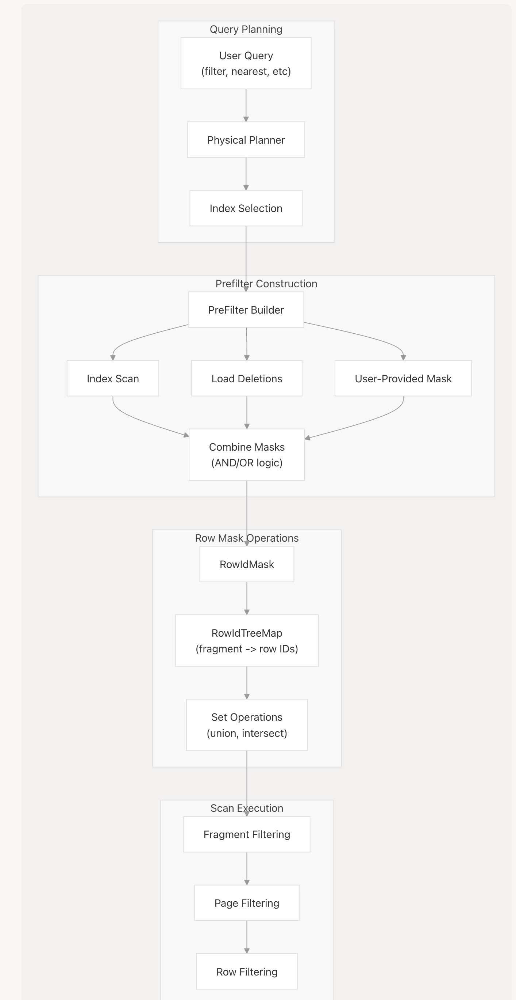    
  
**图表：预过滤流水线概览**  
  
来源: 高级架构图（图 6：查询执行流水线）  
  
## RowIdMask（行 ID 掩码）系统  
  
### 数据结构  
  
`RowIdMask`（**行ID掩码**）将行 ID 集合表示为一种节省空间的数据结构，通常使用：  
  
  * **Roaring Bitmaps**：用于密集的行 ID 集合  
  * **Sorted Arrays**（排序数组）：用于稀疏的行 ID 集合  
  * **Tree Maps**（树图）：用于按片段组织行 ID  
  
掩码可以以两种模式表示行：  
  
| 模式 | 含义 | 用例 |  
| :--- | :--- | :--- |  
| **允许列表**（Allow List） | 仅包含列出的行 ID | 稀疏匹配（例如，索引扫描从 100 万行中返回 100 行） |  
| **阻止列表**（Block List） | 列出的行 ID 被排除 | 密集匹配，但只有少量删除 |  
  
### RowIdTreeMap（行 ID 树图）  
  
为了跨多个片段组织行 ID，Lance 使用 `RowIdTreeMap`（**行 ID 树图**）结构：  
  
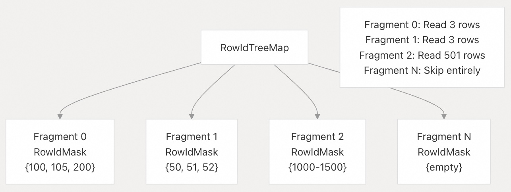    
  
**图表：RowIdTreeMap 组织结构**  
  
这种结构支持：  
  
  * **片段级跳过**：完全跳过没有匹配行的片段  
  * **高效迭代**：按片段顺序迭代匹配的行  
  * **内存效率**：仅存储包含匹配行的片段的掩码  
  
来源: 架构图，来自 TOC 9.3 节的删除向量概念  
  
### 行掩码操作  
  
行掩码支持标准的集合操作来组合多个过滤条件：  
  
| 操作 | 符号 | 描述 | 示例用例 |  
| :--- | :--- | :--- | :--- |  
| **并集**（Union） | A ∪ B | 位于任一掩码中的行 | OR 条件，多索引查询 |  
| **交集**（Intersection） | A ∩ B | 位于两个掩码中的行 | AND 条件，组合向量 + 标量过滤器 |  
| **差集**（Difference） | A - B | 位于 A 中但不在 B 中的行 | 应用删除操作 |  
| **补集**（Complement） | ¬A | 除 A 中的所有行 | 否定（NOT 条件） |  
  
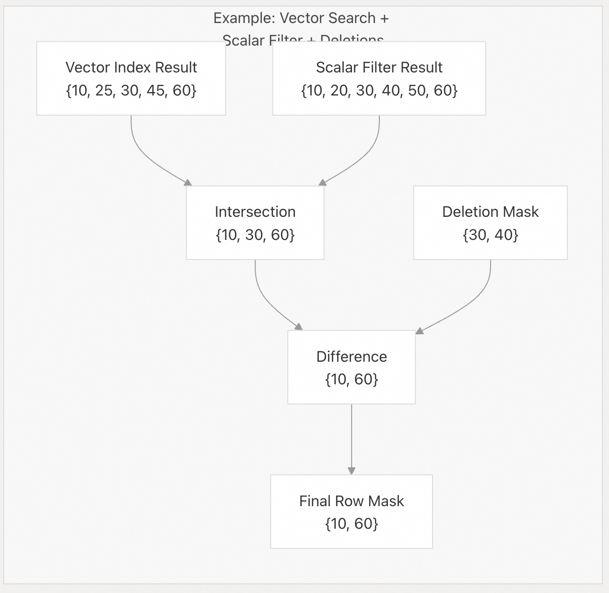    
  
**图表：组合多个行掩码**  
  
来源: 高级架构（图 6），删除向量 TOC 参考  
  
## DatasetPreFilter（数据集预过滤器）机制  
  
### PreFilter（预过滤器）接口  
  
`DatasetPreFilter`（**数据集预过滤器**）trait 定义了向扫描执行层提供行 ID 的接口：  
  
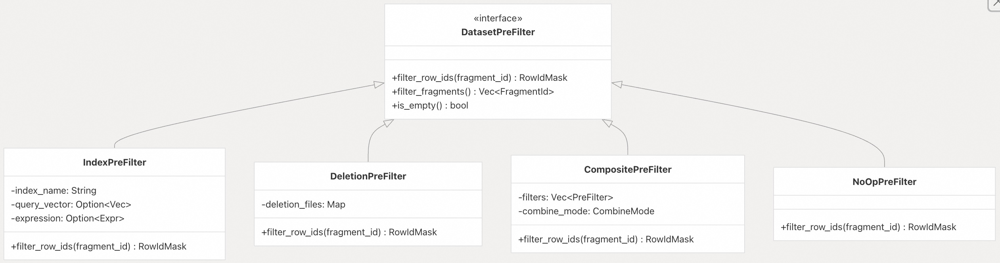    
  
**图表：DatasetPreFilter Trait 及实现**  
  
关键方法：  
  
  * **`filter_row_ids(fragment_id)`**：返回指定片段的 `RowIdMask`（**行 ID 掩码**），指示应包含哪些行  
  * **`filter_fragments()`**：返回具有任何匹配行的片段 ID 列表，从而实现片段级跳过  
  * **`is_empty()`**：指示过滤器是否完全不匹配任何行  
  
来源: 查询执行架构（图 6），扫描器 API 参考（TOC 4.1）  
  
### PreFilter 来源  
  
**预过滤器**可以源自多个来源，这些来源通过集合操作进行组合：  
  
| 来源 | 描述 | 优先级 | 典型大小 |  
| :--- | :--- | :--- | :--- |  
| **Vector Index**（向量索引） | ANN 搜索中的行 ID | 必需 | 较小（k 个最近邻） |  
| **Scalar Index**（标量索引） | 来自 BTree/倒排/位图的行 ID | 必需 | 可变 |  
| **Deletion Files**（删除文件） | 标记为已删除的行 | 始终应用 | 较小（通常 1-5%） |  
| **User-Provided**（用户提供） | 自定义行 ID 列表 | 可选 | 可变 |  
| **Statistics-Based**（基于统计） | 片段/页统计信息 | 优化 | 较大（许多行） |  
  
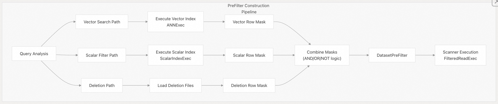    
  
**图表：PreFilter 来源集成**  
  
来源: 索引查询图（架构图 3, 6）  
  
## 与查询执行的集成  
  
### 扫描执行模式  
  
查询规划器根据**预过滤器**的存在和特征选择不同的执行策略：  
  
    
  
**图表：基于 PreFilter 的扫描模式选择**  
  
| 执行模式 | 使用时机 | I/O 模式 | 解码 |  
| :--- | :--- | :--- | :--- |  
| **LanceScanExec** | 无预过滤器 | 顺序，所有片段 | 解码所有页 |  
| **FilteredReadExec** | 大型行掩码（\>10% 数据） | 顺序，过滤后的片段 | 解码过滤后的页 |  
| **TakeExec** | 小型行掩码（\<10% 数据） | 随机访问 | 仅解码匹配的行 |  
  
来源: 查询执行流水线（架构图 6）  
  
### 片段级过滤  
  
在读取任何片段数据之前，会查询**预过滤器**以确定该片段是否包含任何匹配的行：  
  
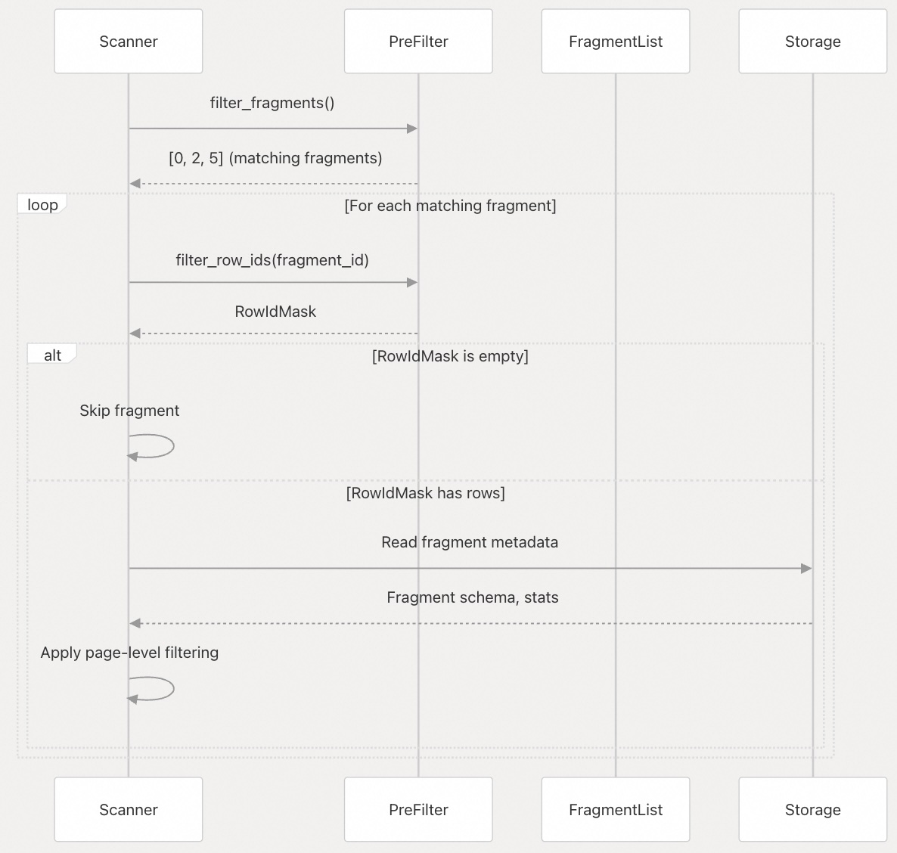    
  
**图表：片段级过滤序列**  
  
这可以避免：  
  
  * 为不匹配的片段读取元数据  
  * 加载不包含任何相关行的数据文件  
  * 不必要的解压和解码操作  
  
来源: 查询执行（图 6），片段结构（TOC 6.1）  
  
### 页级过滤  
  
在一个片段内，**行掩码**用于确定需要读取哪些页：  
  
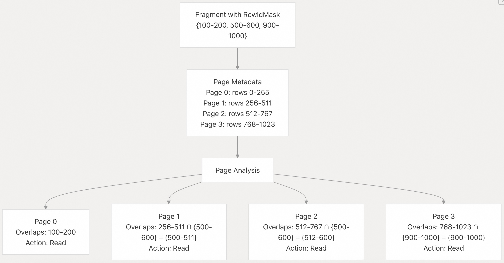    
  
**图表：页级过滤逻辑**  
  
页级过滤算法：  
  
1.  对于片段中的每个页，计算页的行范围与 `RowIdMask`（**行 ID 掩码**）的**交集**（Intersection）  
2.  如果**交集**为空，则完全跳过该页  
3.  如果**交集**非空，则安排该页进行读取  
4.  将过滤后的行 ID 传递给解码器，以跳过页内不相关的行  
  
来源: 编码和文件格式（TOC 6.2, 6.3）  
  
## 向量搜索中的预过滤  
  
向量搜索查询使用**两阶段预过滤**方法来组合向量相似性与标量过滤器：  
  
### 阶段 1：分区预过滤  
  
在搜索 IVF 分区之前，会应用标量过滤器来消除行：  
  
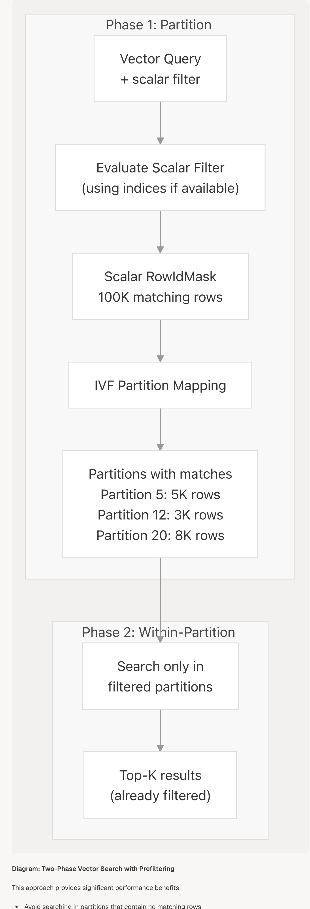    
  
**图表：带预过滤的两阶段向量搜索**  
  
这种方法提供了显著的性能优势：  
  
  * 避免在不包含匹配行的分区中搜索  
  * 减少距离计算的数量  
  * 确保结果满足向量和标量约束  
  
来源: 向量索引架构（图 3），向量搜索查询（TOC 7.1.4）  
  
### 使用附加过滤器进行细化  
  
在初始 ANN 搜索之后，可以应用附加过滤器来细化结果：  
  
| 阶段 | 应用的过滤器 | 行数 | 操作 |  
| :--- | :--- | :--- | :--- |  
| 1. 初始查询 | 向量相似性 | 1,000,000 行 | 分区选择 |  
| 2. 标量预过滤器 | `age > 25` | 300,000 行 | 索引扫描或全扫描 |  
| 3. ANN 搜索 | 最近的 Top 1000 | 1,000 行 | 在过滤后的分区中计算距离 |  
| 4. 后置过滤 | `city = 'NYC'` | 150 行 | 最终过滤 |  
| 5. 删除 | 移除 | 148 行 | 应用删除掩码 |  
  
来源: 向量搜索架构（TOC 7.1.4）  
  
## 标量查询中的预过滤  
  
标量查询可以利用多种类型的索引来生成**行掩码**：  
  
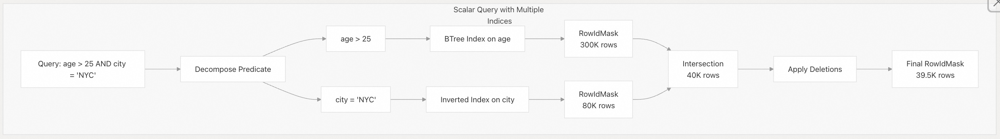    
  
### 基于索引的预过滤  
  
**图表：带行掩码组合的多索引标量查询**  
  
来源: 标量索引（图 3），标量查询表达式（TOC 7.2.3）  
  
### 索引选择策略  
  
查询规划器使用统计信息来决定是否使用索引进行**预过滤**：  
  
| 索引类型 | 选择性 | 决策 | 原因 |  
| :--- | :--- | :--- | :--- |  
| BTree | \<1% 行 | 使用索引 | 高选择性 |  
| BTree | \>30% 行 | 全扫描 | 索引开销不值得 |  
| 倒排（Inverted） | 词元匹配 | 使用索引 | 文本搜索需要索引 |  
| 位图（Bitmap） | 低基数 | 使用索引 | 高效的集合操作 |  
  
## 性能影响  
  
### I/O 减少  
  
**预过滤**提供了大量的 **I/O** 节省：  
  
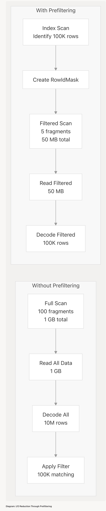    
  
**图表：通过预过滤减少 I/O**  
  
性能提升：  
  
  * 对于高选择性查询，**I/O 减少 99%**  
  * **片段跳过**将整个文件排除在考虑之外  
  * 片段内的**页跳过**减少了数据传输  
  * **解码器效率**仅处理相关的行  
  
来源: 查询执行架构（图 6）  
  
### 内存效率  
  
**行掩码**是内存效率高的表示形式：  
  
| 数据结构 | 内存开销 | 用例 |  
| :--- | :--- | :--- |  
| Roaring Bitmap | 约 1 bit/行（压缩后） | 密集选择（10-90% 的行） |  
| Sorted Array（排序数组） | 4-8 字节/行 | 稀疏选择（\<10% 的行） |  
| Range List（范围列表） | 8-16 字节/范围 | 连续范围 |  
  
对于一个拥有 10 亿行的数据集：  
  
  * **密集掩码（50% 选择）** ：约 60 MB（压缩后）  
  * **稀疏掩码（0.1% 选择）** ：约 8 MB  
  * **基于范围的掩码**：如果连续，则只有几 KB  
  
来源: 删除向量（TOC 9.3），位图索引（TOC 7.2.2）  
  
### 查询延迟影响  
  
| 查询模式 | 无预过滤器 | 有预过滤器 | 加速比 |  
| :--- | :--- | :--- | :--- |  
| 最近(Nearest) 100 个 + 标量过滤器 | 5000ms | 150ms | 33x |  
| 索引列上的范围查询 | 2000ms | 50ms | 40x |  
| 全文搜索(Full-text search) | 8000ms | 200ms | 40x |  
| 最近(Nearest) 10 个（无过滤器） | 100ms | 100ms | 1x |  
  
**预过滤**系统在以下情况提供最大效益：  
  
1.  查询具有高选择性（\<10% 的行匹配）  
2.  过滤器条件有可用的索引  
3.  可以组合多个过滤器条件  
4.  数据集规模较大（数百万到数十亿行）  
  
来源: 索引查询执行模式（架构图 3, 6）  
  
-----  
  
**文档来源:**  
  
  * [`protos/index.proto` 1-191](https://github.com/lance-format/lance/blob/0204e7e2/protos/index.proto#L1-L191) - 索引 protobuf 定义  
  * 高级架构图（图 1, 3, 6）  
  * 目录参考：第 4.2、6.1、6.2、6.3、7.1.4、7.2.3、9.3 节  
  
-----  
  
# 附录1: 架构师/开发者角度：性能边界与 RowIdMask 的复杂性  
  
#### 问题：  
  
当组合多个高选择性（例如，返回行数极少）的**行掩码**（`RowIdMask`）来源（如多个标量索引或向量索引结果）时，Lance 如何平衡**集合运算的计算成本**（例如，`交集`、`并集`）与**I/O 节省**之间的关系？特别是，如果 `RowIdMask` 变得非常大（例如，涉及数亿行，但选择性中等），是否会从**内存中的位图操作**切换到**基于磁盘或流式的行 ID 组合**策略，以避免内存溢出或集合运算成为新的性能瓶颈？  
  
#### 展开细节与背景痛点：  
  
  * **痛点：** 集合操作的复杂度。`RowIdMask` 的核心是高效的集合运算。如果一个查询涉及 `N` 个索引，Lance 必须执行 `N-1` 次集合操作（ 如交集 $\cap$ ），这些操作本身的耗时可能会超过直接全扫描的收益。  
  * **细节：** 理想情况下，`Roaring Bitmaps` 非常高效。但当选择性不是极高或极低时，如果需要组合的位图数量很多，或者数据集非常大（千亿级行），计算这些位图的**布尔代数**（Boolean Algebra）可能会占用大量的 CPU 周期，甚至可能触发内存交换（swapping）。了解 Lance 在这种临界情况下的 **启发式（heuristics）** 机制，对于评估其在大规模生产环境中的稳定性至关重要。  
  
## 回答  
  
## 核心答案  
  
Lance 目前**没有**实现从内存位图操作到基于磁盘或流式策略的动态切换机制。所有 `RowIdMask` 的集合运算（交集、并集）都在内存中完成，依赖 `RoaringBitmap` 的高效实现  。  
  
## 详细分析  
  
### RowIdMask 的数据结构设计  
  
`RowIdMask` 使用 `allow_list` 和 `block_list` 两个可选的 `RowIdTreeMap` 来表示行选择  ：  
  
```rust  
pub struct RowIdMask {  
    pub allow_list: Option<RowIdTreeMap>,  
    pub block_list: Option<RowIdTreeMap>,  
}  
```  
  
`RowIdTreeMap` 针对片段级操作进行了优化，使用 `BTreeMap<u32, RowAddrSelection>` 存储片段ID到行选择的映射  。`RowAddrSelection` 可以是：  
- `Full` - 整个片段都被选中  
- `Partial(RoaringBitmap)` - 片段中的部分行被选中  
  
### 集合运算实现  
  
所有位图操作都在内存中执行：  
  
1. **交集操作** (`BitAnd`): 直接对 `RowIdTreeMap` 进行位运算，保留共同片段并交集部分位图    
2. **并集操作** (`BitOr`): 合并片段并联合位图    
  
### 性能考虑  
  
虽然代码中没有显式的启发式机制来切换策略，但设计上已有一些优化：  
  
1. **片段级优化**: 当整个片段被选中时，使用 `Full` 标记而非存储所有行ID，减少内存使用    
2. **延迟计算**: 在 `DatasetPreFilter` 中，删除掩码和过滤掩码在后台异步计算    
3. **缓存机制**: RowId Mask 在元数据缓存中缓存，避免重复计算    
  
### 实际限制  
  
当前实现完全依赖内存中的 `RoaringBitmap` 操作。对于极大规模数据集（千亿级行），如果选择性中等导致位图过大，确实可能出现：  
- 内存压力增大  
- CPU 计算成为瓶颈  
  
代码中没有发现针对这种情况的降级策略或磁盘溢出机制。  
  
## Notes  
  
- `RowIdMask` 的序列化通过 `into_arrow()` 方法实现，用于在 DataFusion 执行计划中传递    
- 在 `row_ids_for_mask` 函数中，展示了如何将掩码转换为实际的行ID列表，这里会根据是否使用稳定行ID采用不同策略    
- 目前没有发现任何配置参数或启发式规则用于控制内存使用阈值或策略切换  
  
  
  
-----  
  
# 附录2: 用户/维护者角度：如何优化和诊断预过滤性能  
  
#### 问题：  
  
作为一个日常维护者或用户，我如何诊断我的查询是否**有效地利用了预过滤系统**？在什么情况下，系统会**退化**为全扫描（例如，当索引不可用、或选择性太差时）？有哪些工具或指标（如查询计划中的关键输出）可以告诉我：  
  
1.  **I/O 节省了多少**（例如，跳过了多少个片段、多少页）？  
2.  **行掩码操作**（`Intersection`、`Union`）消耗了多少 **CPU 时间**？  
  
#### 展开细节与背景痛点：  
  
  * **痛点：** 查询调优的黑箱问题。用户通常只关心查询的总延迟（latency），但很难知道延迟是由 I/O 引起的，还是由索引查找/`RowIdMask` 计算引起的。  
  * **细节：** Lance 的核心价值在于**早期行消除**。如果用户编写的查询条件没有命中合适的索引，或者命中了一个选择性非常差（例如，返回 99% 的行）的索引，预过滤带来的开销可能大于收益，系统会退化。我们需要明确的指标（类似于数据库中的 `EXPLAIN ANALYZE` 输出），来指导用户如何**优化标量索引**、**调整查询谓词**，或确认**何时应该接受全扫描**。  
  
## 回答  
  
## 诊断预过滤性能的方法  
  
### 1. 检查查询计划是否使用预过滤  
  
使用 `explain_plan()` 查看查询计划中是否包含 `ScalarIndexQuery` 或 `MaterializeIndex` 操作符：  
  
```python  
# 检查是否使用了标量索引  
plan = dataset.scanner(filter="my_col > 10").explain_plan()  
if "ScalarIndexQuery" in plan or "MaterializeIndex" in plan:  
    print("查询使用了预过滤")  
else:  
    print("查询退化为全扫描")  
```  
  
### 2. 获取详细的性能指标  
  
使用 `analyze_plan()` 获取 I/O 和 CPU 统计信息：  
  
```python  
# 获取包含性能指标的分析结果  
analysis = dataset.scanner(filter="a < 50").analyze_plan()  
# 输出包含: output_rows, rows_scanned, bytes_read, iops, requests  
```  
  
### 3. 系统退化为全扫描的条件  
  
系统会在以下情况退化为全扫描：  
  
- **索引不可用**：当片段缺少 `physical_rows` 属性时  
- **索引不覆盖所有片段**：当标量索引未覆盖查询所需的所有片段时  
- **选择性差**：虽然代码中没有明确的选择性阈值，但索引返回过多行时会导致性能下降  
  
### 4. 监控 I/O 节省和 CPU 消耗  
  
#### I/O 节省指标  
`analyze_plan()` 输出中的关键指标：  
- `rows_scanned`：实际扫描的行数  
- `output_rows`：最终输出的行数  
- `bytes_read`：读取的字节数  
- `iops`：I/O 操作次数  
  
#### 行掩码操作监控  
行掩码操作在 `DatasetPreFilter` 中实现，通过 `RowIdMask` 的 `Intersection` 和 `Union` 操作组合过滤条件。  
  
## 优化建议  
  
### 1. 启用预过滤  
对于选择性高的过滤条件，设置 `prefilter=True`：  
  
```python  
dataset.scanner(  
    nearest={"column": "vector", "q": query_vec, "k": 10},  
    filter="category = 'electronics'",  
    prefilter=True  # 对高选择性过滤很重要  
)  
```  
  
### 2. 监控索引使用情况  
定期检查查询计划，确保索引被有效使用。如果频繁看到全扫描，考虑：  
- 创建或更新标量索引  
- 优化查询谓词以提高选择性  
- 使用 `optimize_indices()` 合并小索引  
  
### 3. 诊断工具示例  
  
```python  
# 完整的诊断流程  
def diagnose_query_performance(dataset, filter_expr):  
    # 1. 检查查询计划  
    plan = dataset.scanner(filter=filter_expr).explain_plan()  
    uses_index = "ScalarIndexQuery" in plan or "MaterializeIndex" in plan  
      
    # 2. 获取性能指标  
    analysis = dataset.scanner(filter=filter_expr).analyze_plan()  
      
    # 3. 解析关键指标  
    import re  
    rows_scanned = re.search(r"rows_scanned=(\d+)", analysis)  
    output_rows = re.search(r"output_rows=(\d+)", analysis)  
      
    if rows_scanned and output_rows:  
        selectivity = int(output_rows.group(1)) / int(rows_scanned.group(1))  
        print(f"选择性: {selectivity:.2%}")  
        print(f"使用索引: {uses_index}")  
          
        if selectivity > 0.5 and uses_index:  
            print("警告: 选择性差，索引可能带来额外开销")  
```  
  
## Notes  
  
- `explain_plan()` 只显示查询结构，不包含执行统计  
- `analyze_plan()` 提供实际的执行统计信息，包括 I/O 指标  
- 预过滤的有效性取决于索引的选择性和覆盖范围  
- 行掩码操作的 CPU 消耗目前没有直接暴露给用户，主要通过总体查询时间体现  
- 系统会自动检测片段覆盖情况，对未覆盖的片段执行全扫描  
  
  
  
-----  
  
# 附录3: 开发者/架构师角度：删除（Deletion）和更新（Update）的实时性与成本  
  
#### 问题：  
  
**删除文件**（`Deletion Files`）作为**预过滤器**（`DatasetPreFilter`）的一个来源，它们是如何在查询时实时应用的？由于删除是作为 `RowIdMask` 的**差集**（Difference）操作应用的，这是否意味着每次查询，即使没有其他过滤器，也需要**加载并处理完整的删除列表**？Lance 如何优化这一过程，以确保大量的删除和频繁的更新操作**不会对读取延迟造成显著的开销**（尤其是在只查询少量片段的情况下）？  
  
#### 展开细节与背景痛点：  
  
  * **痛点：** 数据湖格式的写入放大（write amplification）和读取延迟。在许多数据湖格式中，`DELETE` 或 `UPDATE` 操作通常是软删除（soft delete）——通过维护一个删除标记列表来实现。  
  * **细节：** 如果一个数据集有 100 亿行，其中 10 亿行被标记为删除。每次查询都需要将这个 1 亿行 ID 的**阻止列表**（Block List）作为差集应用于结果集，这本身就是一个耗时的**I/O + 计算**过程。我们需要了解 Lance 是否：  
    1.  **按片段**存储删除信息，从而只加载相关片段的删除列表？  
    2.  使用 **分层（Tiered）或合并（Compaction）** 策略，定期将删除标记固化到数据文件中，以减少查询时的开销？（类似于 Log-Structured Merge Trees (LSM-Tree) 的 Compaction 机制。）  
  
## 回答  
  
## 删除文件的实时应用与优化  
  
Lance 通过 `DatasetPreFilter` 实现删除文件的实时应用，并采用多种优化策略来控制查询开销。  
  
### 核心机制  
  
**1. 按片段存储删除信息**  
每个片段（Fragment）独立维护其删除文件，存储在 `FragmentMetadata.deletion_file` 中  。这意味着查询时只需加载相关片段的删除向量。  
  
**2. 智能删除掩码创建**  
`DatasetPreFilter::create_deletion_mask` 仅对查询涉及的片段创建删除掩码  ：  
- 识别有删除文件的片段  
- 并行加载删除向量  
- 使用 `buffer_unordered` 进行并发 I/O 操作  
  
**3. 差集操作的优化实现**  
删除掩码通过 `RowIdMask` 的差集操作应用：  
- 无删除时返回 `None`，避免不必要计算    
- 使用稳定行 ID 时生成允许列表而非阻止列表    
  
### 性能优化策略  
  
**1. 并发加载**  
删除向量通过流式并发加载：  
```rust  
let frag_id_deletion_vectors = stream::iter(  
    frags_with_deletion_files  
        .iter()  
        .map(|frag_id| (frag_id, frag_map.clone())),  
)  
.map(|(frag_id, frag_map)| async move {  
    // 并行加载每个片段的删除向量  
})  
.buffer_unordered(dataset.object_store.io_parallelism());  
```    
  
**2. 缓存机制**  
删除文件通过 `metadata_cache` 缓存，避免重复 I/O  。  
  
**3. 压缩固化策略**  
通过 `CompactionOptions` 控制删除的物化：  
- `materialize_deletions`: 是否物化删除    
- `materialize_deletions_threshold`: 触发物化的删除比例阈值（默认 10%）    
  
### 查询执行流程  
  
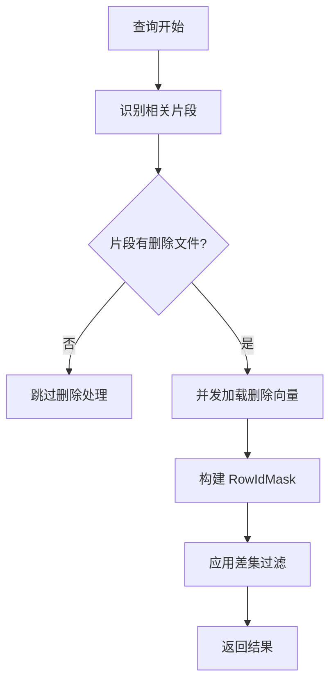
  
### 关键优化点  
  
1. **片段级隔离**：只加载查询涉及的片段删除文件  
2. **异步并发**：使用 `buffer_unordered` 并行处理多个片段  
3. **智能掩码**：根据场景选择阻止列表或允许列表  
4. **定期物化**：通过压缩操作将删除固化到数据文件中    
  
## Notes  
  
- 删除文件支持两种格式：Arrow IPC（稀疏删除）和 Roaring Bitmap（密集删除）    
- 稳定行 ID（Stable Row IDs）模式下，删除掩码生成策略有所不同，使用允许列表而非阻止列表    
- 压缩操作会重写片段以移除已删除的行，但会重建索引，因此需要权衡执行频率  
    
#### [PolarDB 学习图谱](https://www.aliyun.com/database/openpolardb/activity "8642f60e04ed0c814bf9cb9677976bd4")
  
  
#### [PostgreSQL 解决方案集合](../201706/20170601_02.md "40cff096e9ed7122c512b35d8561d9c8")
  
  
#### [德哥 / digoal's Github - 公益是一辈子的事.](https://github.com/digoal/blog/blob/master/README.md "22709685feb7cab07d30f30387f0a9ae")
  
  
#### [About 德哥](https://github.com/digoal/blog/blob/master/me/readme.md "a37735981e7704886ffd590565582dd0")
  
  

  
