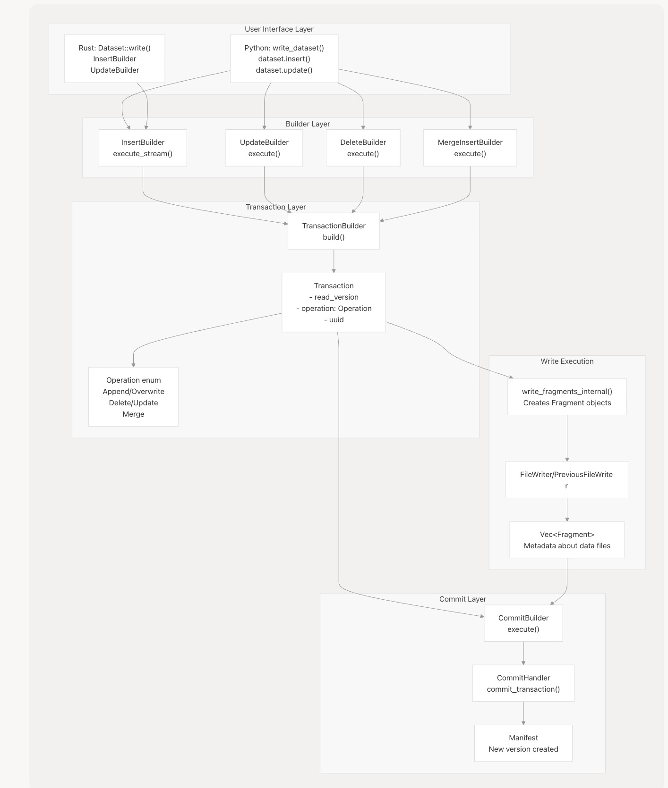
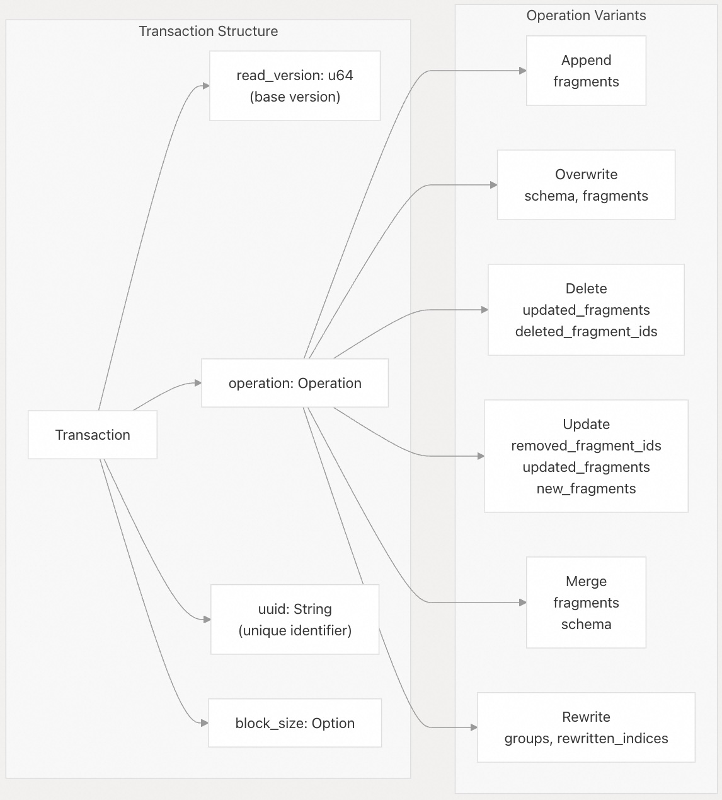
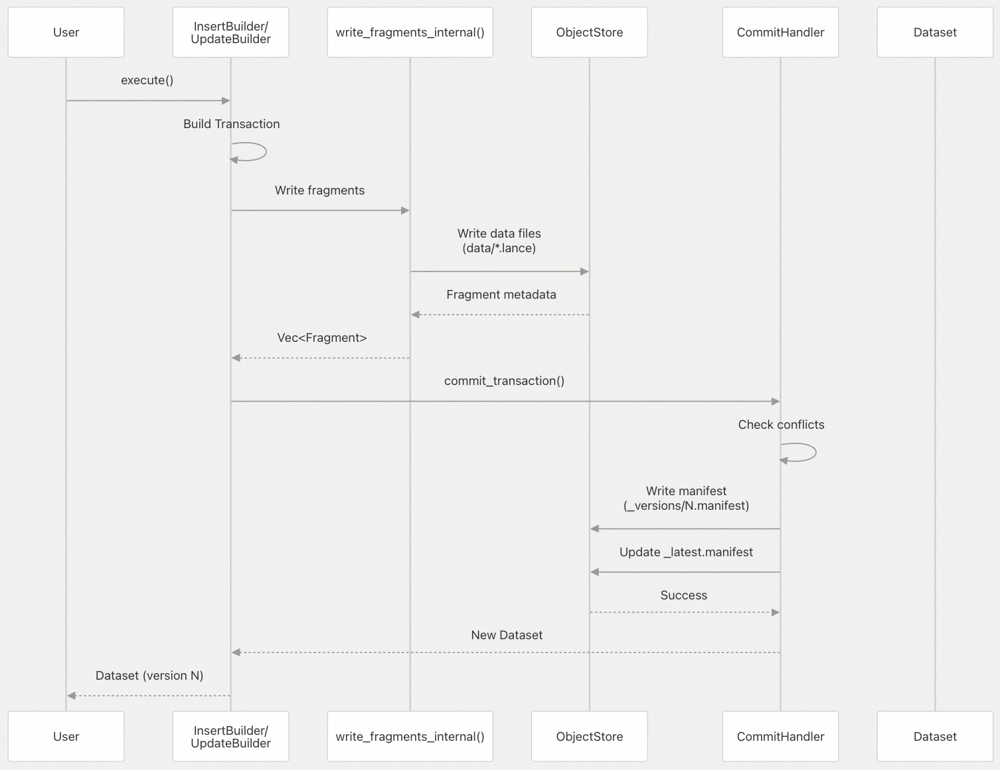
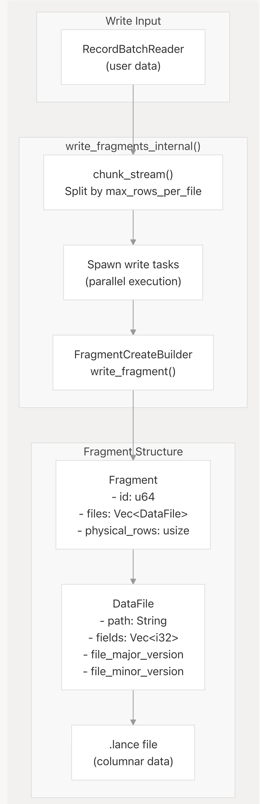
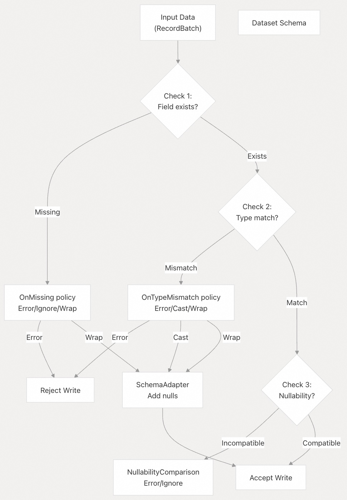
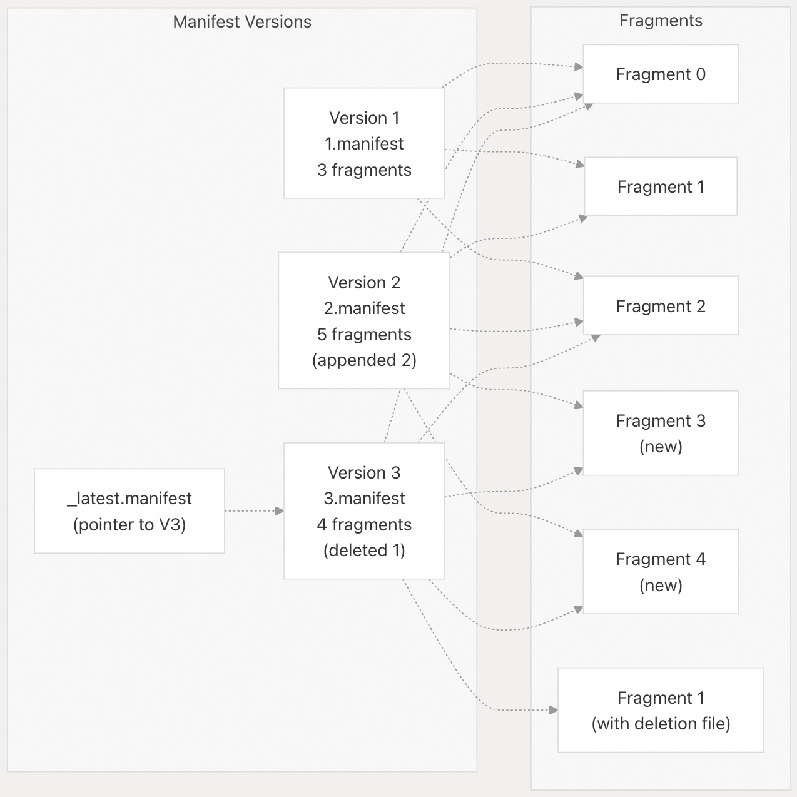
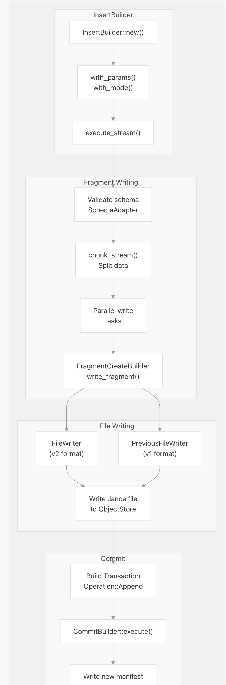

## Lance 源码学习: 5 写入和修改数据 (Writing and Modifying Data)    
        
### 作者        
digoal        
        
### 日期        
2025-12-10        
        
### 标签        
Lance , AI 数据存储与搜索引擎 , 存储引擎 , 向量索引 , 标量索引 , 全文检索 , 多模态支持 , 零拷贝 , 版本控制 , 时间旅行 , 源码学习 , 随机访问加速 , Parquet        
        
----        
        
## 背景        
本页面涵盖了在 Lance **数据集**（**Dataset**）中写入和修改数据的核心概念和机制。它解释了**事务模型**（**Transactional Model**）、写入参数、**数据片段**（**Fragment**）创建，以及不同的写入操作如何整合到 Lance 的版本控制系统。  
  
-----  
  
## 写入操作类型 (**Write Operation Types**)  
  
Lance 支持五种主要的**写入模式**（**WriteMode**），每种模式都通过一个**原子事务**（**Atomic Transaction**）创建一个新的数据集版本：  
  
| 写入模式 | 操作类型 | 用例 | **Schema**（模式）要求 |  
| :--- | :--- | :--- | :--- |  
| **创建**（Create） | `WriteMode::Create` | 初始化新数据集 | 推断或提供 **Schema** |  
| **追加**（Append） | `WriteMode::Append` | 添加新行 | 必须匹配或为现有 **Schema** 的子集 |  
| **覆盖**（Overwrite） | `WriteMode::Overwrite` | 替换所有数据 | 可以完全更改 **Schema** |  
| **更新**（Update） | `Operation::Update` | 修改现有行 | **Schema** 保持不变 |  
| **删除**（Delete） | `Operation::Delete` | 移除行 | **Schema** 保持不变 |  
| **合并插入**（Merge Insert） | `Operation::Merge` | **Upsert**（更新或插入） | 必须匹配现有 **Schema** |  
  
来源:  
[`rust/lance/src/dataset/write.rs` 113-122](https://github.com/lance-format/lance/blob/0204e7e2/rust/lance/src/dataset/write.rs#L113-L122)  
[`rust/lance/src/dataset/transaction.rs`](https://github.com/lance-format/lance/blob/0204e7e2/rust/lance/src/dataset/transaction.rs)  
  
-----  
  
## 写入架构概述 (**Write Architecture Overview**)  
  
    
  
**写入操作流程**：该图表展示了写入操作如何从用户 API 经过构建器（builders）、**事务**（**Transaction**）创建、**数据片段**（**Fragment**）写入，最终到原子提交（**Atomic Commits**）的流程。每个写入操作都会创建一个 `Transaction`，其中包含描述更改的 `Operation`。该事务会被执行以写入数据文件，然后原子性提交以创建一个新的**清单**（**Manifest**）版本。  
  
来源:  
[`rust/lance/src/dataset/write.rs` 1-50](https://github.com/lance-format/lance/blob/0204e7e2/rust/lance/src/dataset/write.rs#L1-L50)  
[`rust/lance/src/dataset/write/insert.rs` 1-40](https://github.com/lance-format/lance/blob/0204e7e2/rust/lance/src/dataset/write/insert.rs#L1-L40)  
[`rust/lance/src/dataset/transaction.rs`](https://github.com/lance-format/lance/blob/0204e7e2/rust/lance/src/dataset/transaction.rs)  
[`python/python/lance/dataset.py` 789-800](https://github.com/lance-format/lance/blob/0204e7e2/python/python/lance/dataset.py#L789-L800)  
  
-----  
  
## 事务模型 (**Transaction Model**)  
  
Lance 使用 **MVCC**（**Multi-Version Concurrency Control**，多版本并发控制）风格的事务模型，其中每个写入操作都会原子性地创建一个新的数据集版本。  
  
### 事务结构 (**Transaction Structure**)  
  
    
  
**事务（Transaction）和操作类型**：一个 `Transaction` 对象封装了应用于数据集更改所需的所有信息。它引用了一个 `read_version`（正在被修改的版本），并包含一个描述要进行何种更改的 `Operation`。不同的操作类型处理不同的修改模式。  
  
来源:  
[`rust/lance/src/dataset/transaction.rs`](https://github.com/lance-format/lance/blob/0204e7e2/rust/lance/src/dataset/transaction.rs)  
[`rust/lance-table/src/format/transaction.rs`](https://github.com/lance-format/lance/blob/0204e7e2/rust/lance-table/src/format/transaction.rs)  
  
### 提交过程 (**Commit Process**)  
  
提交过程通过以下步骤确保原子性：  
  
1.  **准备事务**：使用操作详情构建一个 `Transaction`。  
2.  **写入数据文件**：执行操作，将新的 `.lance` 文件写入数据目录。  
3.  **验证**：检查是否存在与并发写入的冲突。  
4.  **提交清单**：原子性地写入一个新的**清单**（**Manifest**）文件，链接到**数据片段**（**Fragment**）。  
5.  **更新最新版本**：更新 `_latest.manifest` 指针（或等效物）。  
  
    
  
**提交序列**：提交过程首先写入数据文件，然后原子性地提交一个新的**清单**（**Manifest**）。这确保了未提交的数据文件可以安全地清理，而不会影响数据集的一致性。  
  
来源:  
[`rust/lance/src/io/commit.rs`](https://github.com/lance-format/lance/blob/0204e7e2/rust/lance/src/io/commit.rs)  
[`rust/lance-table/src/io/commit/mod.rs`](https://github.com/lance-format/lance/blob/0204e7e2/rust/lance-table/src/io/commit/mod.rs)  
[`rust/lance/src/dataset/write/commit.rs`](https://github.com/lance-format/lance/blob/0204e7e2/rust/lance/src/dataset/write/commit.rs)  
  
-----  
  
## 写入参数 (**Write Parameters**)  
  
`WriteParams` 结构体控制着写入操作的各个方面：  
  
| 参数 | 类型 | 默认值 | 描述 |  
| :--- | :--- | :--- | :--- |  
| `max_rows_per_file` | `usize` | 1,048,576 | 单个数据文件中的最大行数 |  
| `max_rows_per_group` | `usize` | 1,024 | 内部行组（row group）的行数 |  
| `max_bytes_per_file` | `usize` | 90 GB | 文件大小的软限制 |  
| `mode` | `WriteMode` | 必需 | 创建/追加/覆盖 |  
| `storage_format` | `LanceFileVersion` | 最新稳定版 | 文件格式版本（2.0、2.1 等） |  
| `enable_stable_row_ids` | `bool` | `false` | 在压缩（compactions）过程中保持**稳定的行 ID**（**Stable Row IDs**） |  
| `enable_v2_manifest_paths` | `bool` | `true` | 使用基于时间戳的**清单**（**Manifest**）命名 |  
| `use_legacy_format` | `bool` | `false` | 使用 2.0 之前的文件格式 |  
  
来源:  
[`rust/lance/src/dataset/write.rs` 156-192](https://github.com/lance-format/lance/blob/0204e7e2/rust/lance/src/dataset/write.rs#L156-L192)  
[`python/python/lance/dataset.py` 1191-1261](https://github.com/lance-format/lance/blob/0204e7e2/python/python/lance/dataset.py#L1191-L1261)  
  
### Python API 示例  
  
```  
# Python: lance/dataset.py  
lance.write_dataset(  
    data,  
    "my_dataset.lance",  
    mode="append",  
    max_rows_per_file=500_000,  
    max_rows_per_group=2048,  
    data_storage_version="2.1",  
    enable_stable_row_ids=True  
)  
```  
  
来源:  
[`python/python/lance/dataset.py` 1139-1278](https://github.com/lance-format/lance/blob/0204e7e2/python/python/lance/dataset.py#L1139-L1278)  
  
-----  
  
## **数据片段**（**Fragment**）创建  
  
写入操作会创建一个或多个 `Fragment` 对象，每个对象代表一个逻辑数据分区：  
  
    
  
**数据片段（Fragment）创建流程**：输入数据根据 `max_rows_per_file` 进行分块，然后每个块并行写入以创建数据片段。每个**数据片段**（**Fragment**）包含一个或多个数据文件的元数据，这些文件存储实际的列式数据。  
  
来源:  
[`rust/lance/src/dataset/write.rs` 287-450](https://github.com/lance-format/lance/blob/0204e7e2/rust/lance/src/dataset/write.rs#L287-L450)  
[`rust/lance/src/dataset/fragment/write.rs`](https://github.com/lance-format/lance/blob/0204e7e2/rust/lance/src/dataset/fragment/write.rs)  
[`rust/lance-table/src/format/fragment.rs`](https://github.com/lance-format/lance/blob/0204e7e2/rust/lance-table/src/format/fragment.rs)  
  
### 数据文件组织 (**Data File Organization**)  
  
当列被拆分到多个文件时，每个**数据片段**（**Fragment**）可以包含多个数据文件：  
  
  * **单个文件**：所有列都在一个 `.lance` 文件中（常见于小型 **Schema**）。  
  * **多个文件**：不同的列组存储在单独的文件中（适用于宽型 **Schema**）。  
  * 每个数据文件都包含：  
      * `path`：相对路径，例如 `data/abc123.lance`  
      * `fields`：存储在该文件中的字段 ID  
      * `column_indices`：列在该文件中的位置  
      * 用于格式兼容性的版本信息  
  
来源:  
[`rust/lance-table/src/format/fragment.rs` 23-111](https://github.com/lance-format/lance/blob/0204e7e2/rust/lance-table/src/format/fragment.rs#L23-L111)  
[`rust/lance/src/dataset/fragment/write.rs` 1-100](https://github.com/lance-format/lance/blob/0204e7e2/rust/lance/src/dataset/fragment/write.rs#L1-L100)  
  
-----  
  
## **Schema**（模式）验证和演进  
  
### 写入时的 **Schema** 检查  
  
当写入现有数据集时，Lance 会验证 **Schema** 兼容性：  
  
    
  
**Schema 验证流程**：Lance 在写入过程中执行三个级别的验证：字段存在性、类型兼容性和可空性检查。策略（Policies）控制着不匹配是导致错误还是自动适配。  
  
来源:  
[`lance-core/src/datatypes/schema.rs`](https://github.com/lance-format/lance/blob/0204e7e2/lance-core/src/datatypes/schema.rs)  
[`rust/lance/src/dataset/utils.rs`](https://github.com/lance-format/lance/blob/0204e7e2/rust/lance/src/dataset/utils.rs)  
  
### **Schema**（模式）比较选项 (**Schema Comparison Options**)  
  
`SchemaCompareOptions` 结构体控制着 **Schema** 验证的行为：  
  
| 选项 | 值 | 描述 |  
| :--- | :--- | :--- |  
| `on_missing` | Error, Ignore, Wrap | 如何处理缺失的字段 |  
| `on_type_mismatch` | Error, Cast, Wrap | 如何处理类型不匹配 |  
| `nullability_cmp` | Error, MatchOrUpcast, Ignore | **可空性**（**Nullability**）的兼容性 |  
  
对于追加（append）操作，默认是**严格匹配**（strict matching）。对于覆盖（overwrite）操作，**Schema** 可以完全不同。  
  
来源:  
[`lance-core/src/datatypes/schema.rs`](https://github.com/lance-format/lance/blob/0204e7e2/lance-core/src/datatypes/schema.rs)  
  
-----  
  
## 版本控制和**清单**（**Manifests**）  
  
每一次写入操作都会创建一个新的**清单**（**Manifest**）版本：  
  
    
  
**清单版本链**（**Manifest Version Chain**）：每个清单版本引用了一组**数据片段**（**Fragment**）。追加操作会添加新的数据片段，删除操作会向现有数据片段添加**删除文件**（**Deletion Files**），而覆盖操作则会替换整个数据片段集合。`_latest.manifest` 文件指向当前版本。  
  
来源:  
[`rust/lance-table/src/format/manifest.rs`](https://github.com/lance-format/lance/blob/0204e7e2/rust/lance-table/src/format/manifest.rs)  
[`rust/lance/src/dataset.rs` 186-209](https://github.com/lance-format/lance/blob/0204e7e2/rust/lance/src/dataset.rs#L186-L209)  
  
### **清单**（**Manifest**）结构  
  
一个清单包含以下内容：  
  
| 字段 | 类型 | 描述 |  
| :--- | :--- | :--- |  
| `version` | `u64` | 连续的版本号 |  
| `schema` | Schema | 带有字段 ID 的数据集 **Schema** |  
| `fragments` | `Vec<Fragment>` | 数据片段列表 |  
| `index_section` | `Option<u64>` | 索引元数据（index metadata）的偏移量 |  
| `transaction_section` | `Option<u64>` | 事务详情（transaction details）的偏移量 |  
| `timestamp` | DateTime | 创建时间戳 |  
| `metadata` | `HashMap<String, String>` | 用户元数据 |  
| `writer_feature_flags` | `u64` | 写入器使用的特性标志 |  
| `reader_feature_flags` | `u64` | 读取器需要的特性标志 |  
  
来源:  
[`rust/lance-table/src/format/manifest.rs`](https://github.com/lance-format/lance/blob/0204e7e2/rust/lance-table/src/format/manifest.rs)  
[`rust/lance/src/dataset.rs` 620-739](https://github.com/lance-format/lance/blob/0204e7e2/rust/lance/src/dataset.rs#L620-L739)  
  
-----  
  
## 写入执行流程 (**Write Execution Flow**)  
  
### 插入/追加（Insert/Append）执行  
  
    
  
**插入执行路径**（**Insert Execution Path**）：插入操作会验证 **Schema**，将数据分块为适当大小的批次，并行写入**数据片段**（**Fragment**），然后通过写入新的**清单**（**Manifest**） **原子性地提交事务**（**Commit the Transaction Atomically**）。  
  
来源:  
[`rust/lance/src/dataset/write/insert.rs` 35-200](https://github.com/lance-format/lance/blob/0204e7e2/rust/lance/src/dataset/write/insert.rs#L35-L200)  
[`rust/lance/src/dataset/fragment/write.rs`](https://github.com/lance-format/lance/blob/0204e7e2/rust/lance/src/dataset/fragment/write.rs)  
[`rust/lance/src/dataset/write/commit.rs`](https://github.com/lance-format/lance/blob/0204e7e2/rust/lance/src/dataset/write/commit.rs)  
  
### 更新/删除（Update/Delete）执行  
  
更新和删除操作与插入操作的工作方式不同，因为它们**修改了现有数据片段**：  
  
* **删除**（Delete）：向**数据片段**（**Fragment**）添加一个**删除文件**（**Deletion File**），将特定的行 ID 标记为已删除。  
* **更新**（Update）：可以使用以下任一方式：  
    * **行级重写**（Row-level rewrite）：重写整个**数据片段**（**Fragment**），包含更新后的行。  
    * **列级重写**（Column-level rewrite）：仅添加包含更新后列的新数据文件。  
  
来源:  
[`rust/lance/src/dataset/write/delete.rs`](https://github.com/lance-format/lance/blob/0204e7e2/rust/lance/src/dataset/write/delete.rs)  
[`rust/lance/src/dataset/write/update.rs`](https://github.com/lance-format/lance/blob/0204e7e2/rust/lance/src/dataset/write/update.rs)  
[`rust/lance/src/dataset/updater.rs`](https://github.com/lance-format/lance/blob/0204e7e2/rust/lance/src/dataset/updater.rs)  
  
-----  
  
## 写入性能考量 (**Write Performance Considerations**)  
  
### 并行性 (**Parallelism**)  
  
Lance 会**并行**写入**数据片段**（**Fragment**），并行度最高达到可用的 CPU 核心数：  
  
  * **数据片段**（**Fragment**）写入是相互独立的，可以并发执行。  
  * 每个数据片段写入都是在异步运行时（async runtime）上派生的单独任务。  
  * 并行度由 `get_num_compute_intensive_cpus()` 控制。  
  
来源:  
[`rust/lance/src/dataset/write.rs` 287-350](https://github.com/lance-format/lance/blob/0204e7e2/rust/lance/src/dataset/write.rs#L287-L350)  
[`rust/lance/src/dataset/fragment/write.rs` 200-300](https://github.com/lance-format/lance/blob/0204e7e2/rust/lance/src/dataset/fragment/write.rs#L200-L300)  
  
### 文件大小调整 (**File Size Tuning**)  
  
最佳设置取决于您的工作负载：  
  
| 场景 | `max_rows_per_file` | `max_bytes_per_file` | 理由 |  
| :--- | :--- | :--- | :--- |  
| 许多小批量写入 | 100K - 500K | 1-5 GB | 更快的提交，更容易压缩（compaction） |  
| 批量摄取（Bulk ingestion） | 1M - 5M | 50-90 GB | 文件更少，扫描性能更好 |  
| 宽 **Schema** (\>100 列) | 500K - 1M | 10-50 GB | 平衡并行性和开销 |  
| 云存储 (S3) | 1M+ | 50-90 GB | 减少 S3 请求数量 |  
  
来源:  
[`rust/lance/src/dataset/write.rs` 156-177](https://github.com/lance-format/lance/blob/0204e7e2/rust/lance/src/dataset/write.rs#L156-L177)  
[`python/python/lance/dataset.py` 1191-1220](https://github.com/lance-format/lance/blob/0204e7e2/python/python/lance/dataset.py#L1191-L1220)  
  
### 写入进度跟踪 (**Write Progress Tracking**)  
  
Lance 提供了 `WriteFragmentProgress` trait（特性）来监控写入操作：  
  
  * `begin()`：在**数据片段**（**Fragment**）写入开始时调用。  
  * `complete()`：在**数据片段**（**Fragment**）写入完成时调用。  
  * 可以跟踪写入的字节数、处理的行数等。  
  * Python API 通过写入函数中的 `progress` 参数暴露此功能。  
  
来源:  
[`rust/lance/src/dataset/progress.rs`](https://github.com/lance-format/lance/blob/0204e7e2/rust/lance/src/dataset/progress.rs)  
[`python/python/lance/dataset.py` 1191-1278](https://github.com/lance-format/lance/blob/0204e7e2/python/python/lance/dataset.py#L1191-L1278)  
  
-----  
  
## 错误处理和重试 (**Error Handling and Retries**)  
  
### 写入冲突 (**Write Conflicts**)  
  
当多个写入器尝试同时提交时，Lance 会检测到冲突：  
  
  * **乐观并发**（**Optimistic Concurrency**）：写入操作不会锁定，而是在提交时进行验证。  
  * **冲突检测**（**Conflict Detection**）：`CommitHandler` 会检查基础版本是否已更改。  
  * **重试逻辑**（**Retry Logic**）：操作可以自动使用新的基础版本进行重试。  
  
对于**合并插入**（**Merge Insert**）操作，重试行为可以通过 `conflict_retries()` 和 `retry_timeout()` 进行配置。  
  
来源:  
[`rust/lance/src/dataset/transaction.rs`](https://github.com/lance-format/lance/blob/0204e7e2/rust/lance/src/dataset/transaction.rs)  
[`rust/lance/src/dataset/write/merge_insert.rs` 199-223](https://github.com/lance-format/lance/blob/0204e7e2/rust/lance/src/dataset/write/merge_insert.rs#L199-L223)  
[`python/python/lance/dataset.py` 199-223](https://github.com/lance-format/lance/blob/0204e7e2/python/python/lance/dataset.py#L199-L223)  
  
### 失败写入的清理 (**Cleanup of Failed Writes**)  
  
失败的写入会在 `data/` 目录中留下未被任何**清单**（**Manifest**）引用的数据文件：  
  
  * 这些“孤立”（orphaned）文件可以安全删除。  
  * 使用 `dataset.cleanup_old_versions()` 来删除它们。  
  * 默认情况下，会清理 7 天以上的文件。  
  
来源:  
[`rust/lance/src/dataset/cleanup.rs`](https://github.com/lance-format/lance/blob/0204e7e2/rust/lance/src/dataset/cleanup.rs)  
[`python/python/lance/dataset.py` 1467-1540](https://github.com/lance-format/lance/blob/0204e7e2/python/python/lance/dataset.py#L1467-L1540)  
  
-----  
  
## 代码入口点 (**Code Entry Points**)  
  
### Rust API  
  
| 函数 | 位置 | 用途 |  
| :--- | :--- | :--- |  
| `Dataset::write()` | [`rust/lance/src/dataset.rs` 789-800](https://github.com/lance-format/lance/blob/0204e7e2/rust/lance/src/dataset.rs#L789-L800) | 主要写入入口点 |  
| `InsertBuilder::execute_stream()` | [`rust/lance/src/dataset/write/insert.rs` 85-200](https://github.com/lance-format/lance/blob/0204e7e2/rust/lance/src/dataset/write/insert.rs#L85-L200) | 插入/追加执行 |  
| `UpdateBuilder::execute()` | [`rust/lance/src/dataset/write/update.rs`](https://github.com/lance-format/lance/blob/0204e7e2/rust/lance/src/dataset/write/update.rs) | 更新执行 |  
| `DeleteBuilder::execute()` | [`rust/lance/src/dataset/write/delete.rs`](https://github.com/lance-format/lance/blob/0204e7e2/rust/lance/src/dataset/write/delete.rs) | 删除执行 |  
| `MergeInsertBuilder::execute()` | [`rust/lance/src/dataset/write/merge_insert.rs`](https://github.com/lance-format/lance/blob/0204e7e2/rust/lance/src/dataset/write/merge_insert.rs) | 合并插入执行 |  
| `write_fragments_internal()` | [`rust/lance/src/dataset/write.rs` 287-450](https://github.com/lance-format/lance/blob/0204e7e2/rust/lance/src/dataset/write.rs#L287-L450) | 核心**数据片段**（**Fragment**）写入逻辑 |  
| `commit_transaction()` | [`rust/lance/src/io/commit.rs`](https://github.com/lance-format/lance/blob/0204e7e2/rust/lance/src/io/commit.rs) | 原子提交 |  
  
### Python API  
  
| 函数 | 位置 | 用途 |  
| :--- | :--- | :--- |  
| `lance.write_dataset()` | [`python/python/lance/dataset.py` 1139-1278](https://github.com/lance-format/lance/blob/0204e7e2/python/python/lance/dataset.py#L1139-L1278) | 创建或覆盖数据集 |  
| `dataset.insert()` | [`python/python/lance/dataset.py` 1281-1380](https://github.com/lance-format/lance/blob/0204e7e2/python/python/lance/dataset.py#L1281-L1380) | 追加数据 |  
| `dataset.delete()` | [`python/python/lance/dataset.py` 1381-1434](https://github.com/lance-format/lance/blob/0204e7e2/python/python/lance/dataset.py#L1381-L1434) | 删除行 |  
| `dataset.update()` | [`python/python/lance/dataset.py` 1437-1464](https://github.com/lance-format/lance/blob/0204e7e2/python/python/lance/dataset.py#L1437-L1464) | 更新行 |  
| `dataset.merge_insert()` | [`python/python/lance/dataset.py` 1599-1648](https://github.com/lance-format/lance/blob/0204e7e2/python/python/lance/dataset.py#L1599-L1648) | **Upsert** 操作 |  
  
来源:  
[`rust/lance/src/dataset/write.rs`](https://github.com/lance-format/lance/blob/0204e7e2/rust/lance/src/dataset/write.rs)  
[`python/python/lance/dataset.py` 1139-1648](https://github.com/lance-format/lance/blob/0204e7e2/python/python/lance/dataset.py#L1139-L1648)  
  
  
-----  
  
# 附录1: 事务和并发控制：如何保证写入的原子性和数据一致性？（面向架构师/高级用户）  
  
**背景痛点：** 在数据湖或数据仓库场景中，多个进程（例如 ETL 管道、实时摄取服务）可能会同时尝试写入同一份数据集。如果并发写入失败或部分成功，可能导致数据损坏或版本不一致。  
  
**展开细节：**  
* Lance 如何利用 **MVCC**（**多版本并发控制**）实现**原子性提交**？  
* 在**提交过程**的“验证”阶段，具体如何检测和处理**并发写入冲突**（Conflict Resolution）？如果发生冲突，操作是失败并需要重试，还是会自动回滚？  
* **清单**（**Manifest**）文件和 `_latest.manifest` 指针的具体工作机制是什么？它们如何确保在更新数据集版本时，旧版本的读取操作不会受到干扰？  
  
## 回答    
  
Lance通过MVCC（多版本并发控制）机制实现原子性提交和并发控制，核心在于Manifest文件的版本化管理和事务冲突检测。  
  
## MVCC实现原子性提交  
  
Lance使用不可变的Manifest文件来表示数据集的每个版本  。每次提交都会创建一个新的Manifest文件，包含完整的版本信息、schema定义和数据片段列表  。这种设计确保了：  
  
- **原子性**：提交要么完全成功（新Manifest文件写入），要么完全失败（无残留）  
- **版本隔离**：每个版本都是独立的快照，读取操作不会被并发写入影响  
  
## 并发冲突检测与解决  
  
### 冲突检测机制  
  
在提交的"验证"阶段，Lance通过`TransactionRebase`检测并发冲突  。系统会加载自读取版本以来的所有其他事务，并检查兼容性  。  
  
冲突检测基于操作类型矩阵，定义了不同操作间的兼容性规则  ：  
  
| 操作类型 | Append | Delete/Update | Overwrite | Rewrite | Merge |  
|---------|--------|---------------|-----------|---------|-------|  
| Append | ✅ | ✅ | ❌ | ✅ | ❌ |  
| Delete/Update | ✅ | 条件兼容 | ❌ | 条件兼容 | ❌ |  
| Overwrite | ✅ | ✅ | ✅ | ✅ | ✅ |  
| Rewrite | ✅ | 条件兼容 | ❌ | 条件兼容 | ❌ |  
| Merge | ❌ | ❌ | ❌ | ✅ | ❌ |  
  
### 冲突处理策略  
  
当检测到冲突时，Lance采用以下策略：  
  
1. **可重试冲突**：返回`RetryableCommitConflict`错误，系统会自动重试    
2. **不兼容冲突**：返回`CommitConflict`错误，操作失败需要手动处理    
  
重试机制使用指数退避策略，最多重试`num_retries`次  。  
  
### 具体冲突检测示例  
  
对于Delete/Update操作，冲突检测主要基于片段ID：  
- 如果操作影响不同的片段，则兼容  
- 如果影响相同片段，则产生冲突需要重试    
  
```rust  
// 检查片段级冲突  
if updated_fragments  
    .iter()  
    .map(|f| f.id)  
    .chain(deleted_fragment_ids.iter().copied())  
    .any(|id| self.modified_fragment_ids.contains(&id))  
{  
    return Err(self.retryable_conflict_err(  
        other_transaction,  
        other_version,  
        location!(),  
    ));  
}  
```  
  
## Manifest文件机制  
  
### Manifest结构  
  
Manifest文件包含：  
- 版本号（单调递增）  
- 完整schema定义  
- 数据片段列表  
- 索引元数据引用    
  
### \_latest.manifest指针  
  
`_latest.manifest`是一个指针文件，指向当前最新的Manifest版本。更新过程采用原子性操作：  
  
1. 写入新的Manifest文件到版本化路径  
2. 原子性更新`_latest.manifest`指针    
  
这种机制确保：  
- 读取操作始终看到一致的版本快照  
- 新版本提交不会影响正在进行的旧版本读取  
- 支持时间旅行查询  
  
### 提交流程  
  
完整的提交流程如下  ：  
  
1. 检查版本并加载数据集状态  
2. 加载并发事务进行冲突检测  
3. 构建新Manifest  
4. 原子性提交Manifest文件  
5. 更新缓存和触发清理  
  
## Notes  
  
- Lance的MVCC实现与Iceberg等格式类似，但通过操作级冲突检测提供了更细粒度的并发控制  
- 冲突检测主要基于片段ID和操作类型，对于行级冲突需要通过删除向量检测    
- 严格覆盖模式（`strict_overwrite`）跳过冲突检测，适用于完全重建场景    
  
  
  
  
-----  
  
# 附录2: 性能与数据组织：如何优化写入操作以减少小文件问题和查询延迟？（面向开发者/运维）  
  
**背景痛点：** 写入操作经常导致数据文件被分割成大量小型文件（即**小文件问题**）。这会显著降低对象存储（如 S3、HDFS）的读取效率，并增加查询引擎的开销（如打开和管理大量文件）。  
  
**展开细节：**  
* `WriteParams` 中的 `max_rows_per_file` 和 `max_bytes_per_file` 这两个参数对于**控制文件大小和数量**有何影响？在日常使用中，如何根据数据类型和查询模式选择合适的参数值？  
* 在写入操作中，数据是如何被分块创建成**数据片段**（**Fragment**）的？这种分片逻辑（Fragment Creation Process）如何帮助优化后续的并行读取？  
* 如果执行了大量的行级 `Update` 和 `Delete` 操作（参见 5.2），是否会产生大量冗余的旧数据片段？Lance 如何通过**数据压缩**（Data Compaction，参见 9.1）机制来解决这个问题？这是自动发生的吗？  
  
## 回答    
  
## 优化写入操作以减少小文件问题和查询延迟  
  
### 1. WriteParams 参数对文件大小和数量的控制  
  
`WriteParams` 中的 `max_rows_per_file` 和 `max_bytes_per_file` 直接控制数据文件的分割策略：  
  
- **max_rows_per_file**：默认 1,048,576 行，控制单个文件的最大行数    
- **max_bytes_per_file**：默认 90GB，控制单个文件的最大字节数（软限制）    
  
在写入过程中，Lance 会在每个行组写入后检查这两个限制  ：  
  
```rust  
if num_rows_in_current_file >= params.max_rows_per_file as u32  
    || writer.as_mut().unwrap().tell().await? >= params.max_bytes_per_file as u64  
{  
    // 创建新文件  
}  
```  
  
**参数选择建议**：  
- **频繁小批量写入**：设置较小的值（100K-500K 行，1-5GB）以加快提交速度  
- **批量导入**：使用较大值（1M-5M 行，50-90GB）以减少文件数量  
- **宽表模式**（>100列）：建议 500K-1M 行，10-50GB 以平衡并行度和开销  
- **云存储（S3）** ：推荐 1M+ 行，50-90GB 以减少 S3 请求次数    
  
### 2. Fragment 创建过程与并行读取优化  
  
数据写入时的 Fragment 创建流程：  
  
1. **数据分块**：根据 `max_rows_per_file` 将输入流分割成块    
2. **并行写入**：每个块作为独立任务并行写入，创建 Fragment    
3. **Fragment 结构**：每个 Fragment 包含一个或多个数据文件，存储实际列数据    
  
这种设计优化了并行读取：  
- 每个 Fragment 是独立的逻辑分区，可以并行扫描  
- 查询引擎可以根据谓词下推只读取相关 Fragment  
- Fragment 内的列存储允许按需读取特定列，减少 IO    
  
### 3. Update/Delete 操作与数据压缩机制  
  
大量的行级 Update 和 Delete 确实会产生数据碎片：  
  
- **Delete 操作**：为 Fragment 添加删除文件，标记被删除的行    
- **Update 操作**：可能重写整个 Fragment 或只更新特定列  
  
Lance 通过 **数据压缩（Compaction）** 解决这个问题：  
  
**压缩功能**：  
- 合并小 Fragment 到较大 Fragment（默认目标 1M 行）    
- 物化删除行，移除删除文件    
- 移除已删除的列    
  
**重要：压缩不是自动的**，需要手动触发：  
  
```python  
# Python API  
dataset.optimize.compact_files(  
    target_rows_per_fragment=1024*1024,  
    materialize_deletions=True,  
    materialize_deletions_threshold=0.1  
)  
```    
  
压缩过程会重写数据文件，并可能需要重建索引（除非启用稳定行 ID）  。  
  
## Notes  
  
- `max_bytes_per_file` 是软限制，实际文件大小可能略超，因为需要在行组边界检查    
- Fragment 创建支持分布式写入，可通过 `write_fragments` API 在多个 worker 上并行执行    
- 压缩操作可以通过 `Compaction.plan` 分布式执行，适合大规模数据集    
  
  
  
  
-----  
  
# 附录3: 数据生命周期：**Schema** 演进和 **Stable Row IDs** 的实际作用是什么？（面向高级用户/数据工程师）  
  
**背景痛点：** 随着业务发展，数据集的**模式**（**Schema**）几乎总是需要演变（例如添加新列）。此外，对于需要长期追踪特定记录的场景（如审计、时间序列分析），如果数据行 ID 随着数据重写而变化，会带来很大的困扰。  
  
**展开细节：**  
* `Overwrite` 模式允许更改 **Schema**，而 `Append` 和 `Merge Insert` 模式则要求 **Schema** 保持匹配。在 **Schema** 兼容性检查不通过时，用户或开发者有什么**自动适配**（automatic adaptation）的选项？  
* **Stable Row IDs**（稳定的行 ID）的具体实现原理是什么？启用此功能（通过 `enable_stable_row_ids: true`）对写入性能和存储空间有什么样的影响或开销？  
* **Stable Row IDs** 如何与 **Deletion Vectors**（删除向量，参见 9.3）和**数据压缩**（Data Compaction）机制协同工作，以确保即使在数据被物理重写后，用户仍然能够通过原始 ID 引用到该行？  
  
## 回答    
  
## Schema演进与Stable Row IDs详解  
  
### Schema演进机制  
  
Lance支持多种Schema演进操作，通过专门的API实现  ：  
  
- **`add_columns()`**: 添加新列，类似SQL的`ALTER TABLE ADD COLUMN`  
- **`drop_columns()`**: 删除列，类似SQL的`ALTER TABLE DROP COLUMN`    
- **`alter_columns()`**: 修改列的名称、类型或可空性  
  
#### Schema兼容性与自动适配  
  
对于不同写入模式的Schema要求  ：  
  
| 写入模式 | Schema要求 | 自动适配选项 |  
|---------|------------|-------------|  
| **Overwrite** | 可完全改变Schema | 无需适配，直接替换 |  
| **Append** | 必须匹配或为现有Schema的子集 | 通过`SchemaCompareOptions`控制适配行为 |  
| **Merge Insert** | 必须匹配现有Schema | 通过`SchemaCompareOptions`控制适配行为 |  
  
Schema验证使用三层检查机制  ：  
1. 字段存在性检查  
2. 类型兼容性检查    
3. 可空性检查  
  
### Stable Row IDs实现原理  
  
#### 核心机制  
  
Stable Row IDs通过在Fragment元数据中存储`row_id_sequence`实现  ：  
  
```protobuf  
// 存储Fragment中行的row ids，按行出现顺序排列  
oneof row_id_sequence {  
  bytes inline_row_ids = 5;        // 小于200KB时内联存储  
  ExternalFile external_row_ids = 6; // 否则存储为外部文件  
}  
```  
  
启用Stable Row IDs需要在数据集创建时设置  ：  
```rust  
pub enable_stable_row_ids: bool,  // 实验性功能  
```  
  
#### 性能与存储影响  
  
**写入性能影响**：  
- 需要为每行分配和维护全局唯一的row ID    
- 增加元数据序列化开销  
- 测试显示压缩操作更高效，因为无需更新二级索引    
  
**存储空间影响**：  
- 每个Fragment额外存储row_id_sequence  
- 小数据集内联存储（<200KB），大数据集使用外部文件  
- 增加Manifest的`next_row_id`字段跟踪  
  
### 与Deletion Vectors和Compaction的协同  
  
#### 与Deletion Vectors协作  
  
Stable Row IDs与Deletion Vectors协同工作  ：  
  
```rust  
pub struct FragmentRowIdIndex {  
    fragment_id: u32,  
    row_id_sequence: RowIdSequence,  
    deletion_vector: DeletionVector,  // 删除向量  
}  
```  
  
即使行被删除，原始row ID仍保留在序列中，通过删除向量标记状态。  
  
#### 与Compaction协作  
  
压缩过程中Stable Row IDs保持不变  ：  
  
```rust  
// 验证压缩前后row ID一致性  
assert_eq!(  
    map_before.keys().collect::<HashSet<_>>(),  
    map_after.keys().collect::<HashSet<_>>()  
);  
```  
  
测试显示压缩后索引保持不变，查询结果一致  。  
  
#### 版本元数据追踪  
  
Lance还追踪行的创建和更新版本  ：  
- `ROW_CREATED_AT_VERSION`: 行创建时的版本号  
- `ROW_LAST_UPDATED_AT_VERSION`: 行最后更新的版本号  
  
这为审计和时间序列分析提供了完整的版本历史。  
  
## Notes  
  
- Stable Row IDs必须在数据集创建时启用，现有数据集无法事后启用    
- Update操作会改变row ID，即使启用了Stable Row IDs    
- Schema演进操作（如add_columns）与现有数据文件通过字段ID关联，支持高效的数据演化    
  
  
-----  
  
# 附录4: Manifest文件和表的关系, 是不是需要一个库来维护Manifest文件列表  
  
## 回答  
### Manifest文件和表的关系  
  
在Lance格式中，Manifest文件与表的关系是：**每个表（数据集）的每个版本都有一个对应的Manifest文件**，而**不需要单独的库来维护Manifest文件列表**，因为Lance内置了版本管理系统来处理这个需求。    
  
#### 关键组件  
  
1. **Dataset Manifest** - 描述数据集单个版本的文件，包含：  
   - 完整的schema定义  
   - 数据片段列表  
   - 版本号  
   - 索引元数据    
  
2. **版本管理系统** - 通过`CommitHandler`和`ExternalManifestStore`管理Manifest文件：  
   - 自动处理版本递增  
   - 维护版本到Manifest路径的映射  
   - 支持并发提交控制    
  
3. **Namespace Manifest表** - 特殊的`__manifest`表用于跟踪命名空间中的所有表：  
   - 存储表的位置和元数据  
   - 支持表发现和管理  
   - 可选的目录列表回退    
  
#### Manifest文件管理  
  
Manifest文件列表的维护由以下组件自动处理：  
  
- **CommitHandler** - 负责解析最新版本位置和管理Manifest文件路径    
- **版本目录结构** - Manifest文件存储在`_versions/`目录下，按版本号命名  
- **外部存储支持** - 通过`ExternalManifestStore` trait支持外部Manifest存储系统    
  
## Notes  
  
Lance的版本管理系统已经内置了Manifest文件的维护功能，不需要额外的库。对于表级别的管理，可以使用`ManifestNamespace`提供的`__manifest`表功能，它提供了表发现、元数据存储和命名空间支持。  
  
    
#### [PolarDB 学习图谱](https://www.aliyun.com/database/openpolardb/activity "8642f60e04ed0c814bf9cb9677976bd4")
  
  
#### [PostgreSQL 解决方案集合](../201706/20170601_02.md "40cff096e9ed7122c512b35d8561d9c8")
  
  
#### [德哥 / digoal's Github - 公益是一辈子的事.](https://github.com/digoal/blog/blob/master/README.md "22709685feb7cab07d30f30387f0a9ae")
  
  
#### [About 德哥](https://github.com/digoal/blog/blob/master/me/readme.md "a37735981e7704886ffd590565582dd0")
  
  

  
