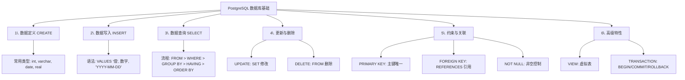
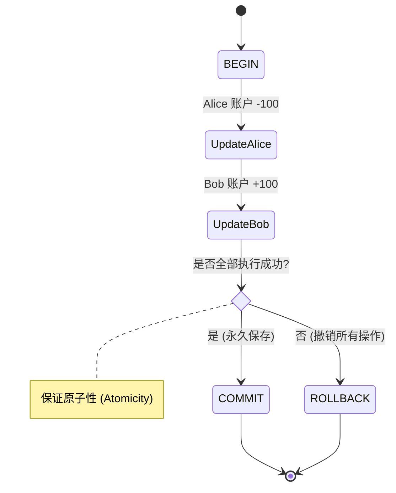
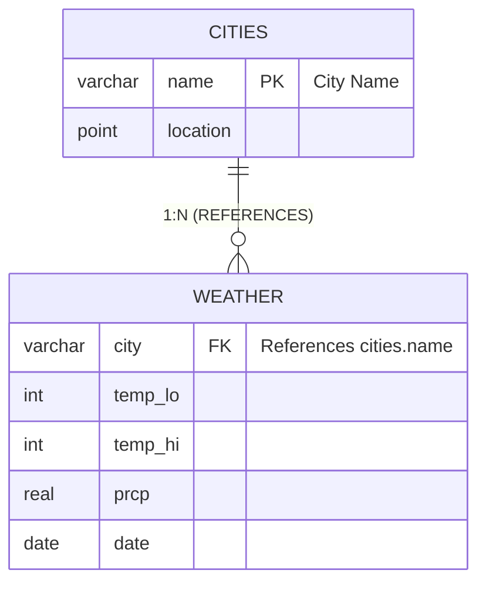

## 大学生数据库实践课: 2 熟悉基本SQL操作  
  
### 作者  
digoal  
  
### 日期  
2025-12-10  
  
### 标签  
PostgreSQL , DuckDB , 语义搜索 , 向量搜索 , 关键词检索 , 全文检索 , 标量检索 , 混合搜索 , 多模态搜索 , 重排序 , embedding , document split , ORC , 大模型 , 多模态大模型 , Dify , 压力测试 , 索引优化 , 倒排向量索引 , Ivfflat , 图向量索引 , HNSW , DiskANN , 量化 , rabitq , sbq , 二值量化 , bm25 , 相关性 , 相似性 , 召回率 , pgbench , 数据集 , ann-benchmarks , 图搜索 , PGQ , 递归 , 深度优先 , 广度优先 , 最短路径 , N度关系 , LLM , Ollama  
  
----  
  
## 背景  
  
https://deepwiki.com/search/-postgresql-sql_cc787ff5-300a-4abb-81e9-de7e5a0fe0c4?mode=fast  
  
作为刚学完数据库原理的大学生, 以PostgreSQL数据库为例, 给出掌握数据库基本用法的SQL示例, 并解释其语法;  
  
# PostgreSQL 数据库基本用法 SQL 示例  
  
作为初学者，掌握以下几个核心操作是必要的：**创建表、插入数据、查询数据、更新/删除数据、以及约束和事务**。下面我将通过PostgreSQL官方文档中的实际示例来讲解。  
  
---  
  
## 1. 创建表 (CREATE TABLE)   
  
```sql  
CREATE TABLE weather (  
    city            varchar(80),  
    temp_lo         int,           -- low temperature  
    temp_hi         int,           -- high temperature  
    prcp            real,          -- precipitation  
    date            date  
);  
```  
  
这个示例创建了一个名为 `weather` 的表，包含5个列：  
- `city` - 可变长字符串，最多80个字符  
- `temp_lo` 和 `temp_hi` - 整数类型，存储温度  
- `prcp` - 实数类型，存储降水量  
- `date` - 日期类型  
  
**语法说明**：`CREATE TABLE 表名 (列名 数据类型, ...);`  
  
更复杂的例子包含约束：   
  
```sql  
CREATE TABLE films (  
    code        char(5) CONSTRAINT firstkey PRIMARY KEY,  
    title       varchar(40) NOT NULL,  
    did         integer NOT NULL,  
    date_prod   date,  
    kind        varchar(10),  
    len         interval hour to minute  
);  
  
CREATE TABLE distributors (  
     did    integer PRIMARY KEY GENERATED BY DEFAULT AS IDENTITY,  
     name   varchar(40) NOT NULL CHECK (name &lt;&gt; '')  
);  
```  
  
这里展示了：  
- `PRIMARY KEY` - 主键约束，唯一标识每一行  
- `NOT NULL` - 非空约束，该列必须有值  
- `GENERATED BY DEFAULT AS IDENTITY` - 自动生成ID  
  
---  
  
## 2. 插入数据 (INSERT)   
  
```sql  
INSERT INTO weather VALUES ('San Francisco', 46, 50, 0.25, '1994-11-27');  
```  
  
**语法说明**：`INSERT INTO 表名 VALUES (值1, 值2, ...);`  
  
数据类型的输入格式相当直观：字符串用单引号括起来，数字直接输入，日期格式为 `'YYYY-MM-DD'`。  
  
---  
  
## 3. 查询数据 (SELECT)    
  
SELECT 的基本处理流程包括：  
1. **FROM** - 指定数据来源表  
2. **WHERE** - 过滤满足条件的行  
3. **GROUP BY** - 按指定列分组  
4. **HAVING** - 对分组后的结果进行过滤  
5. **ORDER BY** - 排序结果  
  
简单示例：  
```sql  
SELECT * FROM weather;  -- 查询所有列  
SELECT city, temp_lo FROM weather WHERE temp_lo > 40;  -- 条件查询  
```  
  
---  
  
## 4. 更新和删除数据   
  
```sql  
UPDATE accounts SET balance = balance - 100.00  
    WHERE name = 'Alice';  
UPDATE branches SET balance = balance - 100.00  
    WHERE name = (SELECT branch_name FROM accounts WHERE name = 'Alice');  
UPDATE accounts SET balance = balance + 100.00  
    WHERE name = 'Bob';  
UPDATE branches SET balance = balance + 100.00  
    WHERE name = (SELECT branch_name FROM accounts WHERE name = 'Bob');  
```      
  
这个例子展示了银行转账场景中的多个UPDATE语句：  
```sql  
UPDATE accounts SET balance = balance - 100.00 WHERE name = 'Alice';  
UPDATE accounts SET balance = balance + 100.00 WHERE name = 'Bob';  
```  
  
**DELETE 示例**：   
  
```sql  
DELETE FROM foo WHERE number = 9999;  
```  
  
---  
  
## 5. 外键约束 (FOREIGN KEY)   
  
```sql  
CREATE TABLE cities (  
        name     varchar(80) PRIMARY KEY,  
        location point  
);  
  
CREATE TABLE weather (  
        city      varchar(80) REFERENCES cities (name),  
        temp_lo   int,  
        temp_hi   int,  
        prcp      real,  
        date      date  
);  
```  
  
这个例子展示了两个表之间的关系：  
- `cities` 表有主键 `name`  
- `weather` 表的 `city` 列引用 `cities` 表的 `name` 列  
  
**语法说明**：`REFERENCES 表名 (列名)` 用于定义外键约束。  
  
当尝试插入不存在的城市时，PostgreSQL会拒绝：   
  
```sql  
INSERT INTO weather VALUES ('Berkeley', 45, 53, 0.0, '1994-11-28');  
  
ERROR:  insert or update on table "weather" violates foreign key constraint "weather_city_fkey"  
DETAIL:  Key (city)=(Berkeley) is not present in table "cities".  
```  
  
---  
  
## 6. 视图 (VIEW)   
  
```sql  
CREATE VIEW myview AS  
    SELECT name, temp_lo, temp_hi, prcp, date, location  
        FROM weather, cities  
        WHERE city = name;  
  
SELECT * FROM myview;  
```  
  
视图是一个虚拟表，基于一个或多个表的查询结果。创建后可以像普通表一样查询。  
  
---  
  
## 7. 事务 (TRANSACTION)    
  
事务的核心概念是"全有或全无"：要么所有操作都成功，要么都失败。这保证了数据的一致性。  
  
```sql  
BEGIN;  
UPDATE accounts SET balance = balance - 100 WHERE name = 'Alice';  
UPDATE accounts SET balance = balance + 100 WHERE name = 'Bob';  
COMMIT;  -- 提交事务  
```  
  
如果中间出错，可以用 `ROLLBACK` 撤销所有更改。  
  
---  
  
## Notes  
  
PostgreSQL 支持标准 SQL 类型如 `int`、`varchar`、`date`、`timestamp` 等。    
  
SQL 命令以分号 (`;`) 结尾，且对关键字不区分大小写（除非用双引号括起标识符）。    
  
这些基础操作构成了数据库应用的核心，掌握它们后可以进一步学习更高级的特性如索引、触发器和存储过程。  

---

**要义图示**  
  
### 1. SQL 核心操作分类图

这张图概括了文章中提到的所有基础功能模块，方便学生建立全局观。




### 2. SELECT 查询逻辑流程图

文章中特别提到了 `SELECT` 的处理流程，这对于初学者理解 SQL 执行逻辑非常重要。


### 3. 事务 (Transaction) 全有或全无逻辑图

通过银行转账的例子，展示事务如何保证数据一致性。




### 4. 表关系与外键示例 (ER简图)

根据文中 `cities` 和 `weather` 的代码示例生成的实体关系图。


  
    
      
#### [PolarDB 学习图谱](https://www.aliyun.com/database/openpolardb/activity "8642f60e04ed0c814bf9cb9677976bd4")
  
  
#### [PostgreSQL 解决方案集合](../201706/20170601_02.md "40cff096e9ed7122c512b35d8561d9c8")
  
  
#### [德哥 / digoal's Github - 公益是一辈子的事.](https://github.com/digoal/blog/blob/master/README.md "22709685feb7cab07d30f30387f0a9ae")
  
  
#### [About 德哥](https://github.com/digoal/blog/blob/master/me/readme.md "a37735981e7704886ffd590565582dd0")
  
  

  
