## 大学生数据库实践课: 6 RAG 概念     
      
### 作者      
digoal      
      
### 日期      
2025-12-10      
      
### 标签      
PostgreSQL , DuckDB , 语义搜索 , 向量搜索 , 关键词检索 , 全文检索 , 标量检索 , 混合搜索 , 多模态搜索 , 重排序 , embedding , document split , ORC , 大模型 , 多模态大模型 , Dify , 压力测试 , 索引优化 , 倒排向量索引 , Ivfflat , 图向量索引 , HNSW , DiskANN , 量化 , rabitq , sbq , 二值量化 , bm25 , 相关性 , 相似性 , 召回率 , pgbench , 数据集 , ann-benchmarks , 图搜索 , PGQ , 递归 , 深度优先 , 广度优先 , 最短路径 , N度关系 , LLM , Ollama      
      
----      
      
## 背景      
  
面向大学生, 通俗易懂的解读这篇文章: https://github.com/digoal/blog/blob/master/202504/20250414_04.md     
  
针对以上文章, 循序渐进的提出几个问题, 帮助加深对文章的理解;    
  
浅显易懂的回答这几个问题;    
    
-----  
  
## 🤖 为什么用了 RAG，我的 AI 还是“笨”？（RAG 效果评测与优化）  
  
### 1. 核心问题：RAG 是什么？为什么需要它？  
  
#### 📌 RAG 是什么？（检索增强生成）  
  
想象一下，大模型（比如 GPT-4, Gemini）就像一个**记忆力超强的“学霸”** ，它知道所有教科书上的知识（训练数据）。  
  
* **RAG 的工作原理：** 当你问它一个关于**新知识**或**专业私有数据**（比如你公司最新的内部文件、你个人的病历数据）的问题时，RAG 机制会让学霸**先去“查阅”** 你给的这些外部资料，然后根据查到的资料来回答你的问题。  
    * **本质：** 结合了 **检索（Retrieval，查资料）** 和 **生成（Generation，写答案）** 两种能力。  
  
  
  
#### 📌 为什么需要 RAG？（解决“幻觉”和知识盲区）  
  
1.  **知识盲区：** 大模型训练时没用到的知识（例如企业内部文档、最新的时事、保密数据），它就不知道。  
2.  **成本/时效性：** 重新训练或微调大模型耗费巨大、耗时漫长。RAG 相当于给它一个 **“活字典”** ，成本低、更新快。  
3.  **“幻觉”：** 大模型在不知道答案时会 **“一本正经地胡说八道”** 。RAG 提供了事实依据，减少了这种“胡说”现象。  
  
  
  
### 2. 为什么 AI 还是“笨”？—— 系统的评估才是关键！  
  
作者指出，不能凭感觉说 AI 笨，需要**科学地量化评估**。  
  
文章重点推荐了开源项目 **Ragas**（一个评测工具），它将 RAG 的效果拆解成三个关键指标来衡量，就像给 AI 做了个“期末考试”。  
  
| 评估指标 | 衡量目标 | 通俗理解 |  
| :--- | :--- | :--- |  
| **1. 回答准确率 (Answer Correctness)** | 最终答案与标准答案的相似度和事实准确度。 | **你答对了吗？** (0.25 语义相似度 + 0.75 事实准确度 F1 Score) |  
| **2. 召回覆盖率 (Context Recall)** | 检索到的外部资料（Contexts）是否涵盖了正确答案所涉及的**所有关键信息点**。 | **你查全了吗？** (查到的关键点数量 / 正确答案总关键点数量) |  
| **3. 召回精度 (Context Precision)** | 检索到的外部资料有多少是**真正相关的**，以及最相关的资料是否排在前面。 | **你查准了吗？** (无关资料太多或关键信息排在后面，都会扣分) |  
  
#### 🔑 “笨”的四个原因诊断表（重点）  
  
| 回答正确性 | 召回覆盖率 | 召回精度 | **核心问题所在** | **通俗的比喻** |  
| :---: | :---: | :---: | :--- | :--- |  
| 低 | 高 | 高 | **模型不行**（给了正确信息，大模型也不会用） | 老师把所有答案都写在黑板上了，你还是答错了。 |  
| 低 | 高 | 低 | **召回干扰太多**（无关信息排在前面，大模型被误导） | 老师给你一堆参考书，其中 90% 是不相关的，你被带偏了。 |  
| 低 | 低 | 高 | **召回信息不全**（漏掉了关键信息） | 老师只给了你一半答案，你当然答不全。 |  
| 低 | 低 | 低 | **全方位问题**（解析、切分、召回都有问题） | 你用的参考书是乱码的，而且查到的都是错的。 |  
  
  
  
### 3. 如何让 AI 变“聪明”？—— RAG 的系统优化  
  
针对上面的诊断，作者提出了一个完整的 RAG 优化流程，这是一个**多阶段的系统工程**。  
  
  
  
#### 💡 优化思路概览（从源头到结果）  
  
| 阶段 | 出现的问题 | 解决方案（如何改进） |  
| :--- | :--- | :--- |  
| **1. 文档处理 (Chunking)** | 文档切分太粗或太细，导致信息丢失或噪音过多。 | **改进切分方法：** 按固定 tokens、按句子、按语义，甚至使用 **“父子模式”** （用父文本获取上下文，子文本精准匹配问题）。 |  
| **2. 向量化 (Embedding)** | 转换出的向量不够精确，相似度计算不准确。 | **升级 Embedding 模型：** 更换新的、对中文支持更好的模型，并重新生成所有文档向量。 |  
| **3. 召回 (Retrieval)** | 召回不准或不全。 | **多路召回：** 不只用向量搜索，结合**模糊查询**、**关键词匹配 (如 BM25)** 、**标签搜索**（对内容打上人物、地点等标签）。 |  
| **4. 排序 (Rerank)** | 召回结果虽然全，但无关信息排在前面（即召回精度低）。 | **引入 Rerank 模型：** 对多路召回的结果进行**二次排序**，把最相关的条目提到最前面。 |  
| **5. 上下文 (Context)** | 召回的片段太短，缺乏背景信息。 | **滑动窗口/上下文扩展：** 在召回最相关的片段后，同时带出它前后相邻的段落，补齐上下文。 |  
| **6. 生成 (Generation)** | 召回信息很完美，但大模型仍然答不好。 | **更换更强大的大模型（LLM）。** |  
  
#### 🌟 特别提到了 BM25  
  
BM25 是一种经典的文本相关性打分算法，它考虑了词语的 **“稀有度”** 和 **“出现频率”** 。在 RAG 流程中，它非常适合作为**多路召回**或**重排序（Rerank）** 的一种手段，因为它能有效地把包含稀有、核心关键词的文档片段排到前面，弥补纯向量搜索的不足。  
  
  
### 4. 总结  
  
作者通过这篇解读告诉我们：  
  
1.  **RAG 不是万能药：** 只是一个框架，效果好坏取决于你在每个环节（从数据处理到召回、再到排序和生成）的工程优化水平。  
2.  **数据驱动优化：** 必须使用 **Ragas** 这类工具进行量化评测，找到到底是 **“查不全”** （召回覆盖率低）、 **“查不准”** （召回精度低）、还是 **“模型笨”** 的问题，然后对症下药。  
3.  **技术栈是基石：** 文章标签中提到了 PostgreSQL/PolarDB/DuckDB，说明高效的数据库（特别是支持向量、全文检索、模糊查询的数据库）是实现复杂多路召回和 Rerank 的技术基础。  
  
  
-----  
  
## 💡 循序渐进的 RAG 深度理解问题  
  
### 阶段一：基础概念与背景（What & Why）  
  
1.  **RAG 的核心目标是什么？** 文章提到，在什么情况下大模型会“一本正经地胡说八道”（幻觉）？RAG 如何从根本上解决这个问题？  
2.  **RAG 与模型微调（Fine-tuning）相比，最大的优势和劣势分别是什么？** 文章为什么说 RAG 是一种更适合处理企业**私有知识**和**最新信息**的解决方案？  
3.  **请用自己的话概括 RAG 的完整工作流程**（从用户提问到获得最终答案），这个流程可以分成哪两个主要阶段？  
  
### 阶段二：量化评估（How to Measure）  
  
1.  **为什么需要量化评估 RAG 效果？** 文章推荐的 Ragas 评测体系将 RAG 效果拆解为哪两大方向？  
2.  **请解释“召回覆盖率 (Context Recall)”和“召回精度 (Context Precision)”这两个指标的区别。** 哪个指标关注的是“**查全**”（不遗漏关键信息），哪个指标关注的是“**查准**”（只返回相关信息且排名靠前）？  
3.  **在 Ragas 的 Answer Correctness (回答准确率) 计算中，为什么“事实准确度得分”的权重（0.75）要高于“语义相似度得分”（0.25）？** 这体现了 RAG 应用对哪一方面的最高要求？  
  
### 阶段三：诊断与优化（How to Fix）  
  
1.  **根据文章提供的“笨”的原因诊断表，如果一个 RAG 系统的回答准确率低、召回覆盖率高、召回精度低，这说明主要问题出在哪里？** 针对这种情况，作者给出了什么核心的优化建议？  
2.  **在 RAG 流程中，“文本切分（Chunking）”是一个关键步骤。** 如果切分太小，会导致什么问题？如果切分太大，又会引入什么问题？文章中提到的“父子模式”切分法的目的是什么？  
3.  **什么是“多路召回”？** 除了最常用的**向量检索**外，文章还建议结合哪些传统的检索方法来提高召回效果？为什么需要多种方法？  
4.  **请解释“Rerank（重排序）”的作用。** 它主要解决的是 RAG 流程中哪一个量化指标低的问题？文章提到了哪种经典的检索算法可以用于 Rerank？  
5.  **在整个 RAG 优化流程中，数据库（如 PostgreSQL/PolarDB）主要扮演了什么角色？** 为什么高性能的数据库对于实现多路召回非常重要？  
  
-----  
  
    
## 阶段一：基础概念与背景（What & Why）  
  
### 1. RAG 的核心目标是什么？  
  
* **RAG 的核心目标：** 让大型语言模型（LLM，比如 AI 助手）能够回答**它训练时不知道的新问题**，同时减少它 **“瞎编”** （即幻觉）的情况。  
  
* **幻觉出现的情况：** 当你问 AI 一个它不知道、但又必须回答的问题时，它会利用自己学到的语言模式和概率，**一本正经地捏造一个答案**。  
    * **例子：** 问 AI “你老板昨天吃了什么？” 如果这个问题不在它的训练数据里，它可能会根据“老板、吃饭”等关键词，编造一个听起来合理的回答：“据我所知，他可能吃了健康午餐。” 
  
* **RAG 如何解决：** RAG 就像给 AI 增加了一个“搜索引擎”和 **“参考资料”** 。当 AI 拿到问题后，它会先去你提供的资料库（比如公司的文档）里**精确查找**答案，然后**引用这些找到的资料**来生成回答。有资料作证，它就没必要“瞎编”了。  
      
  
### 2. RAG 与模型微调（Fine-tuning）相比，最大的优势和劣势分别是什么？  
  
把大模型看作一个“厨师”，RAG 和微调就是两种不同的“升级”方式。  
  
| 方式 | 作用 | RAG (检索增强生成) | 微调 (Fine-tuning) |  
| :--- | :--- | :--- | :--- |  
| **升级点** | **知识来源** | **查资料**（提供食谱） | **提升手艺**（改变训练） |  
| **优势** | 1. **快且便宜：** 只需要上传新文档，无需重新训练模型。 2. **隐私安全：** 企业私有数据无需上传到大模型训练方。 3. **知识时效性：** 可以即时更新最新知识。 | 1. **深度定制：** 改变模型回答的风格、语气或遵循特定格式。 2. **提高效率：** 对于特定任务，生成速度可能更快。 |  
| **劣势** | **性能上限：** 模型本身能力不变，如果给的资料太差，回答还是会受影响。 | **昂贵且慢：** 需要大量的计算资源和高质量数据，知识更新周期长。 |  
  
**结论：** RAG 是处理**大量、易变、私有知识**（如公司手册、最新报告）的最佳选择。  
  
### 3. 请用自己的话概括 RAG 的完整工作流程  
  
你可以把 RAG 想象成一个学生**写一篇开放性论文**的过程：  
  
1.  **准备阶段（数据处理）：** 学生需要先把图书馆里所有的书（知识库） **拆分** 成一张张**索引卡片**（切分文档），并在每张卡片上写下**关键词**（向量化），存入卡片柜（向量数据库）。  
2.  **检索阶段（Retrieval）：** 老师布置了论文题目（用户输入问题）。学生根据题目，在卡片柜里**快速搜索**并**找出**几张最相关的卡片（召回相关的文档片段）。  
3.  **生成阶段（Generation）：** 学生把找到的这些卡片（召回的上下文）放在桌上，**参考**上面的信息，用自己的知识和语言**组织**成一篇完整的论文（生成最终答案）。  
  
  
  
## 阶段二：量化评估（How to Measure）  
  
### 1. 为什么需要量化评估 RAG 效果？  
  
* **目的：** 为了科学地找出 RAG **变“笨”** 的真正原因，而不是凭感觉猜测。  
* **两大方向：** Ragas 体系将评估拆解为：  
    1.  **检索（查资料）效果：** 即**召回**（有没有找到）  
    2.  **生成（写答案）效果：** 即**回答**（有没有答对）  
    * 只有这两方面都优秀，RAG 才是真正“聪明”的。  
  
### 2. 请解释“召回覆盖率 (Context Recall)”和“召回精度 (Context Precision)”的区别。  
  
* **召回覆盖率 (Recall) = 查全了吗？**  
    * 它关注的是：正确答案中的所有关键信息点，你检索到的文档片段**是否都包括了**？  
    * **例子：** 正确答案需要提到“张伟是教研部的**并且**负责大数据”。如果你只检索到了“张伟是教研部的”这个信息，那么召回覆盖率就不够高。  
  
* **召回精度 (Precision) = 查准了吗？**  
    * 它关注的是：你检索到的文档片段中，**有多少是真正相关的**？并且最相关的片段是否被排在了**最前面**？  
    * **例子：** 为了回答“张伟的部门”，你检索到了两条信息：“张伟是教研部的”和“牛顿发现了万有引力”。第二条就是**无关信息（噪音）** ，会降低你的召回精度。  
  
### 3. 在 Ragas 的 Answer Correctness (回答准确率) 计算中，为什么“事实准确度得分”的权重（0.75）要高于“语义相似度得分”（0.25）？  
  
* **RAG 的最高要求：** **事实正确性。**  
    * RAG 存在的根本原因就是为了解决大模型的“幻觉”和知识错误。因此，我们最关心的不是 AI 回答得是不是“文艺”或“像人话”（语义相似度），而是它提供的**事实是不是百分之百准确**。  
    * **权重分配 (0.75 vs 0.25)：** 这种分配清晰地表达了评估者的倾向——**即使你回答得文笔不好，只要事实是对的，分数就高；如果你事实错了，即使语义上再像正确答案，分数也会被严重拉低。**  
  
  
## 阶段三：诊断与优化（How to Fix）  
  
### 1. 如果一个 RAG 系统的回答准确率低、召回覆盖率高、召回精度低，这说明主要问题出在哪里？  
  
* **诊断结果：** 问题出在“**召回干扰太多**”。  
* **通俗理解：** “召回覆盖率高”说明你**查全了**（所有正确信息都找到了）。但是“召回精度低”说明你同时找到了**太多无关的噪音信息**，而且这些噪音可能排在了前面。  
* **优化建议：** 针对这种“查全了但太杂”的情况，核心解决办法就是引入 **Rerank（重排序）** 。让一个专门的“评委”模型对所有查到的资料进行二次筛选和排序，**把噪音踢出去，把真正关键的信息排到最前面**，减轻大模型的负担。  
  
### 2. 在 RAG 流程中，“文本切分（Chunking）”是一个关键步骤。  
  
* **切分太小的问题：** 导致**信息散乱，丢失上下文**。就像把一篇文章切成单个单词，当检索到“苹果”这个词时，模型不知道说的是“水果苹果”还是“苹果公司”。召回覆盖率会低。  
* **切分太大的问题：** **引入过多噪音**，容易超出大模型的上下文窗口限制。就像把一本书作为单个片段，当检索时，整个书的内容都会被传给 AI，大量的无关内容会干扰 AI 的判断。召回精度会低。  
* **“父子模式”切分法：** 这是一种聪明的方法。  
    * **“子文档”（小片段）：** 用于**精确检索**。  
    * **“父文档”（大片段，包含子文档的上下文）：** 用于**生成答案**。  
    * 这样，检索时能快速定位到核心信息（子），生成时又能提供完整的上下文（父），兼顾了查准和上下文完整性。  
  
### 3. 什么是“多路召回”？  
  
* **定义：** 不依赖单一的检索方式（比如只靠向量相似度），而是**同时使用多种不同的检索方法**来找到相关信息。  
* **需要结合的方法：**  
    1.  **语义向量检索：** 通过 Embedding 模型判断“意思”相似的片段。  
    2.  **模糊查询/全文检索：** 依靠传统的**关键词匹配**，找包含特定词汇的片段。  
    3.  **标签召回：** 基于预先用大模型打好的“标签”（如 人物：张伟，地点：杭州），进行精确过滤。  
* **目的：** **避免“偏科”** 。向量检索擅长找“意思相近”的，但可能错过关键词；关键词检索擅长找“字面匹配”的，但可能错过意思相近但用词不同的。多路召回能够**互补**，大大提高召回覆盖率。  
  
### 4. 请解释“Rerank（重排序）”的作用。  
  
* **作用：** Rerank 就像一个裁判，它接收多路召回系统找到的所有潜在相关文档片段，然后根据问题，给这些片段**重新打分并排序**，选出最相关的一小部分（Top K）。  
* **解决指标：** 主要解决**召回精度低**的问题。  
* **使用的经典算法：** 文章提到了 **BM25**。它是一种传统的、基于词频和稀有度的算法，非常适合用来对关键词匹配的结果进行精确排序。  
  
### 5. 在整个 RAG 优化流程中，数据库（如 PostgreSQL/PolarDB）主要扮演了什么角色？  
  
数据库在 RAG 优化中是**地基**。  
  
* **主要角色：** **知识库的存储与检索中心。**  
* **具体作用：**  
    1.  **存储：** 存储知识库的**原始文本**、**向量值**（用于向量检索）、**标签值**（用于标签召回）。  
    2.  **加速：** 通过数据库的**索引技术**（如向量索引、倒排索引），大幅加速多路召回的检索速度。如果没有高效的数据库支持，多路召回可能因为查询太慢而无法在实际应用中使用。  
  
简而言之，**RAG 的复杂优化策略都是建立在强大的数据库检索能力之上的。**  

---  
  
**要义图示**  
  
### 1. RAG 核心工作原理图

这张图展示了 RAG 如何将“外部知识库”与“大模型”结合，解决大模型知识盲区的问题。

```mermaid
graph TD
    User((用户提问)) --> Search[1\. 检索阶段 Retrieval]
    subgraph Knowledge_Base [企业私有/最新知识库]
        DB[(向量数据库)]
    end
    Search -->|查找相关片段| DB
    DB -->|返回参考资料| Context[2\. 增强阶段 Augmentation]
    Context -->|问题 + 参考资料| LLM[3\. 生成阶段 Generation]
    LLM -->|产生有据可查的回答| Answer((最终答案))

    style Knowledge_Base fill:#f9f,stroke:#333,stroke-width:2px
    style LLM fill:#bbf,stroke:#333,stroke-width:2px
```

### 2. Ragas 评估指标体系

这张图拆解了文章中提到的三大关键量化指标，帮助你理解如何评价一个 RAG 系统的好坏。

```mermaid
mindmap
  root((RAG 效果评估))
    检索质量_查资料
      召回覆盖率_Recall
        ::icon(fa fa-check-square)
        查全了吗
        关键信息点是否漏掉
      召回精度_Precision
        ::icon(fa fa-target)
        查准了吗
        无关干扰信息是否太多
    生成质量_写答案
      回答准确率_Correctness
        事实准确度_75%
        语义相似度_25%
```

### 3. RAG “笨”的原因诊断逻辑

当 AI 表现不佳时，可以通过这套逻辑快速定位问题所在（对应文中的诊断表）。

```mermaid
graph TD
    Start[AI 回答错误/不好] --> Q1{资料查到了吗?}
    Q1 -- 没查全 --> Issue1[召回覆盖率低: 优化切分或多路召回]
    Q1 -- 查到了 --> Q2{资料里杂质多吗?}
    Q2 -- 杂质多/乱 --> Issue2[召回精度低: 增加 Rerank 重排序]
    Q2 -- 资料很精准 --> Issue3[模型能力弱: 更换更强大 LLM]

    style Issue1 fill:#ffcccb
    style Issue2 fill:#ffcccb
    style Issue3 fill:#ffcccb
```

### 4. RAG 系统全链路优化流程

这是一套从文档处理到最终生成的工程化优化路径。

```mermaid
flowchart LR
    Doc[文档处理] --> Chunk[语义切分/父子模式]
    Chunk --> Embed[Embedding 向量化]
    Embed --> Retrieval{多路召回}
    
    subgraph Retrieval_Methods [召回技术]
        direction TB
        V[向量搜索]
        K[关键词 BM25]
        T[标签过滤]
    end
    
    Retrieval --> Rerank[Rerank 重排序]
    Rerank --> Context[上下文增强/滑动窗口]
    Context --> Generation[LLM 生成最终答案]

    style Retrieval_Methods fill:#e1f5fe,stroke:#01579b
```

  
  
    
#### [PolarDB 学习图谱](https://www.aliyun.com/database/openpolardb/activity "8642f60e04ed0c814bf9cb9677976bd4")
  
  
#### [PostgreSQL 解决方案集合](../201706/20170601_02.md "40cff096e9ed7122c512b35d8561d9c8")
  
  
#### [德哥 / digoal's Github - 公益是一辈子的事.](https://github.com/digoal/blog/blob/master/README.md "22709685feb7cab07d30f30387f0a9ae")
  
  
#### [About 德哥](https://github.com/digoal/blog/blob/master/me/readme.md "a37735981e7704886ffd590565582dd0")
  
  

  
