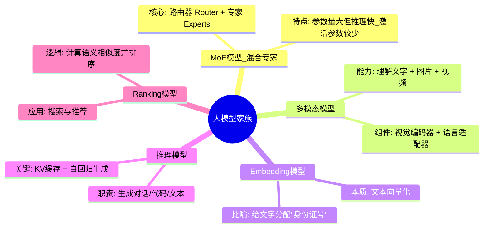
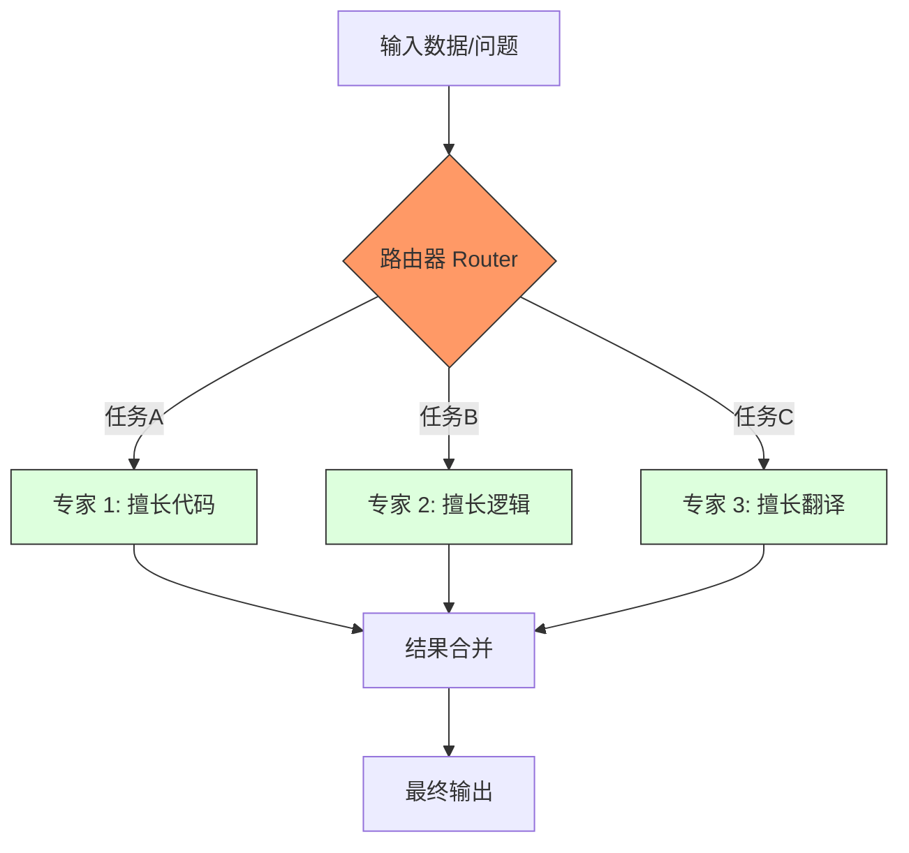
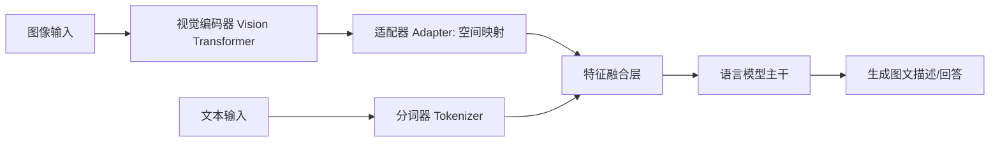
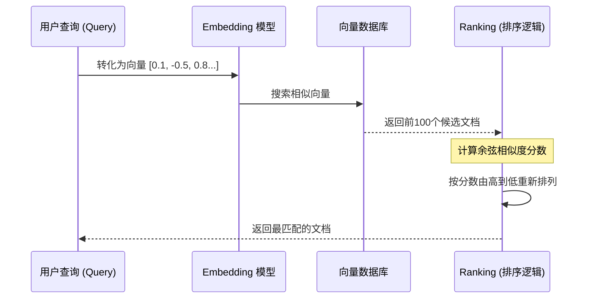

## 大学生数据库实践课: 7.1 模型介绍     
        
### 作者        
digoal        
        
### 日期        
2025-12-10        
        
### 标签        
PostgreSQL , DuckDB , 语义搜索 , 向量搜索 , 关键词检索 , 全文检索 , 标量检索 , 混合搜索 , 多模态搜索 , 重排序 , embedding , document split , ORC , 大模型 , 多模态大模型 , Dify , 压力测试 , 索引优化 , 倒排向量索引 , Ivfflat , 图向量索引 , HNSW , DiskANN , 量化 , rabitq , sbq , 二值量化 , bm25 , 相关性 , 相似性 , 召回率 , pgbench , 数据集 , ann-benchmarks , 图搜索 , PGQ , 递归 , 深度优先 , 广度优先 , 最短路径 , N度关系 , LLM , Ollama        
        
----        
        
## 背景        
  
面向大学生通俗讲解以下内容: 1、模型分类介绍(MoE模型、多模态模型、推理模型、embedding、ranking 等)   
  
ollama deepwiki:  
- https://deepwiki.com/search/-1moeembeddingranking_c24df039-c322-44ac-a526-832005ef7f66?mode=fast  
  
mistral deepwiki:  
- https://deepwiki.com/search/-1moeembeddingranking_a490cb04-417c-4909-89e0-dd804284efe1?mode=fast  
  
-----  
  
# 模型分类通俗讲解  
  
## 1. MoE模型（Mixture of Experts，专家混合模型）  
  
MoE模型就像一个"专家团队"，每个专家擅长处理不同类型的任务。模型会根据输入内容自动选择最合适的专家来处理。  
  
**核心实现**：  
- `TextMOE`结构体包含路由器(Router)和多个专家(Experts)    
- 路由器决定使用哪些专家：`routerLogits := moe.Router.Forward(ctx, hiddenStates)`    
- 专家处理结果与共享专家结合：`return sharedStates.Add(ctx, routedStates)`    
  
**实际例子**：DeepSeek模型的MoE实现通过TopK选择专家    
  
## 2. 多模态模型  
  
多模态模型能同时理解文本、图像等多种信息类型，就像人眼和大脑协同工作。  
  
**接口定义**：  
- `MultimodalProcessor`接口定义了多模态处理标准    
- `EncodeMultimodal`方法处理图像等非文本输入    
  
**具体实现**：  
- LLaVA模型处理图像：`imageEmbeddings, err := multimodalProcessor.EncodeMultimodal(ctx, images[imageIndex].Data)`    
- Gemma3模型结合视觉和文本组件    
  
## 3. Embedding模型  
  
Embedding模型将文本转换为数字向量，就像给每个词分配一个"身份证号"，相似的内容号码相近。  
  
**实现原理**：  
- 通过文本模型获取隐藏状态，然后进行池化和归一化    
- 最终输出L2归一化的向量：`hiddenStates = hiddenStates.L2Norm(ctx, 1e-12)`    
  
**使用示例**：  
```python  
response = ollama.embed(  
  model='embeddinggemma',  
  input='Your text to embed'  
)  
```    
  
## 4. 推理模型  
  
推理模型负责根据输入生成输出，是AI对话的核心引擎。  
  
**推理流程**：  
1. 输入处理：将提示和图像转换为模型可理解的格式    
2. 前向传播：`model.Forward(ctx, batch)`计算输出    
3. 批处理优化：同时处理多个请求提高效率  
  
**模型接口**：  
所有推理模型都实现`Model`接口，包含`Forward`方法    
  
## 5. Ranking模型（排序模型）  
  
虽然代码库中没有直接的ranking模型实现，但embedding模型常用于排序：  
- 计算查询与文档的向量相似度  
- 根据相似度分数对结果排序  
- 常用于搜索和推荐系统  
  
## 总结  
  
这些模型类型各有专长：  
- **MoE**：专家协作，处理复杂任务  
- **多模态**：图文并茂，理解丰富信息    
- **Embedding**：文本数字化，衡量相似性  
- **推理**：对话生成，智能交互  
- **Ranking**：智能排序，优化结果  
  
在实际应用中，这些模型经常组合使用，发挥各自优势。  
  
## Notes  
  
- 代码库中的MoE实现包括LLaMA4、DeepSeek、DeepSeekOCR等模型  
- 多模态模型支持图像处理，通过`[img-<n>]`标记在文本中插入图像  
- Embedding模型使用余弦相似度进行语义搜索  
- 推理模型支持批处理和流式输出，提高性能  
- Ranking功能通常基于embedding相似度实现  
  
  
  
-----  
  
# 模型分类通俗讲解  
  
## 1. MoE模型（Mixture of Experts，专家混合模型）  
  
MoE模型就像一个"专家团队"，每个专家擅长处理不同类型的任务。当输入数据进来时，模型会智能地选择最合适的专家来处理。  
  
在代码中，MoE通过`MoeLayer`实现  ：  
- 包含多个专家（FeedForward网络）  
- 有一个门控网络（gate）决定选择哪个专家  
- 配置通过`MoeArgs`定义    
  
**优势**：模型参数量很大，但每次推理只使用部分专家，计算效率高。  
  
## 2. 多模态模型  
  
多模态模型能同时处理多种类型的数据，比如文字和图片。就像人既能看图又能读文字一样。  
  
在mistral-inference中，多模态处理包括：  
- **视觉编码器**：`VisionTransformer`将图片转换为特征向量    
- **视觉-语言适配器**：`VisionLanguageAdapter`将图片特征映射到语言空间    
- **特征融合**：在`embed_vision_language_features`中组合文字和图片特征    
  
**应用场景**：图片描述、视觉问答、文档理解等。  
  
## 3. 推理模型  
  
推理模型专注于生成连贯的文本回答，而不是简单的分类或回归。整个mistral-inference库都是为推理优化的。  
  
核心推理流程：  
- **生成函数**：`generate`函数实现自回归文本生成    
- **KV缓存**：存储已计算的键值对，加速生成过程  
- **温度控制**：控制生成文本的随机性  
  
**特点**：能够进行对话、写作、编程等创造性任务。  
  
## 4. Embedding（嵌入）  
  
Embedding是将离散的符号（如文字）转换为连续向量表示的技术。让计算机理解"语义相似性"。  
  
在代码中的体现：  
- **词嵌入层**：`tok_embeddings`将token ID转换为向量    
- **特征提取**：通过模型各层提取语义特征  
- **实际应用**：在分类任务中，用模型的embedding作为特征    
  
**比喻**：就像给每个词在"语义空间"中找一个坐标，意思相近的词坐标也相近。  
  
## 5. Ranking（排序）  
  
虽然代码库中没有直接的ranking模型实现，但基于embedding的排序是常见应用。  
  
**基本原理**：  
1. 将查询和候选文档都转换为embedding  
2. 计算相似度（如余弦相似度）  
3. 按相似度排序  
  
**可能实现**：可以利用mistral模型的embedding功能，结合相似度计算来实现文档排序。  
  
  
  
## 总结  
  
这些模型类型各有特点：  
- **MoE**：大模型高效推理的解决方案  
- **多模态**：处理多种数据类型的统一模型  
- **推理模型**：专注于文本生成的通用模型  
- **Embedding**：理解语义的基础技术  
- **Ranking**：基于语义相似度的排序应用  
  
在实际应用中，这些技术经常组合使用，比如多模态MoE模型可以高效处理图文任务。  
  
## Notes  
  
- 代码中的MoE实现使用了稀疏激活，每次只选择部分专家  
- 多模态支持通过`VisionEncoderArgs`配置    
- 推理优化包括KV缓存、pipeline并行等技术  
- Embedding维度通常为4096（取决于模型配置）  
- Ranking功能需要基于embedding自行实现相似度计算  
  
---  
  
**要义图示**  
  

### 1. 模型分类全景图

这张图概括了文章中提到的五大模型类别及其核心功能，帮助学生建立宏观概念。




### 2. MoE（混合专家模型）工作流程图

通过这张流程图，学生可以直观理解“路由器”是如何根据任务分配“专家”的。




### 3. 多模态模型：图文融合逻辑

这张图展示了多模态模型（如 LLaVA 或 Mistral 多模态版本）如何将图像信号转化为模型能理解的语言信号。




### 4. Embedding 与 Ranking 的关系流程

这张图解释了“语义搜索”的底层逻辑：如何从一堆文档中找出最相关的那一个。


  

学习要点（给同学们的复习笔记）：

1. **MoE 是为了“提效”**：它解决了模型想变大但算力跟不上的矛盾。
2. **Embedding 是“基础”**：没有它，计算机永远无法理解“苹果”和“iphone”在语义上是相关的。
3. **多模态是“感知”**：它让 AI 从“纯文本聊天”进化到了“能看、能听”。
4. **推理是“大脑”**：所有的学习成果最终通过推理（Forward）转化为人类能读懂的文字。  
    
#### [PolarDB 学习图谱](https://www.aliyun.com/database/openpolardb/activity "8642f60e04ed0c814bf9cb9677976bd4")
  
  
#### [PostgreSQL 解决方案集合](../201706/20170601_02.md "40cff096e9ed7122c512b35d8561d9c8")
  
  
#### [德哥 / digoal's Github - 公益是一辈子的事.](https://github.com/digoal/blog/blob/master/README.md "22709685feb7cab07d30f30387f0a9ae")
  
  
#### [About 德哥](https://github.com/digoal/blog/blob/master/me/readme.md "a37735981e7704886ffd590565582dd0")
  
  

  
