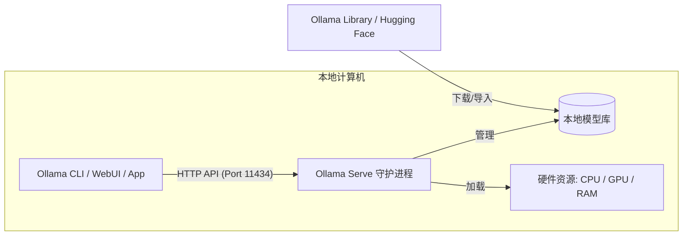
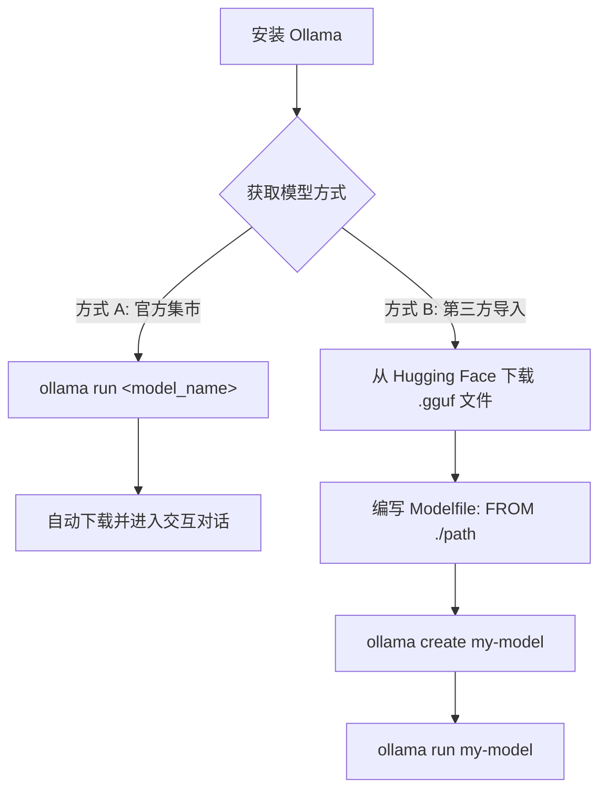
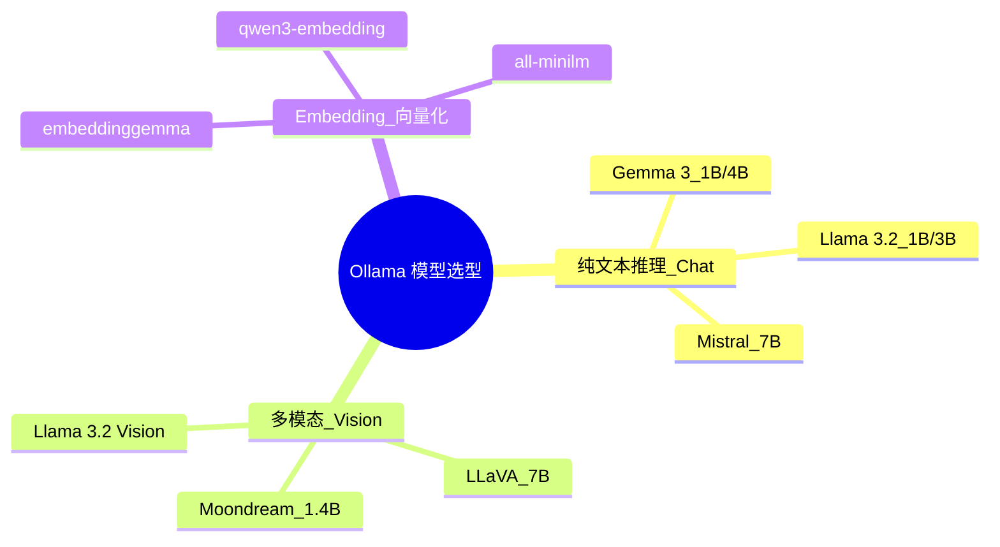
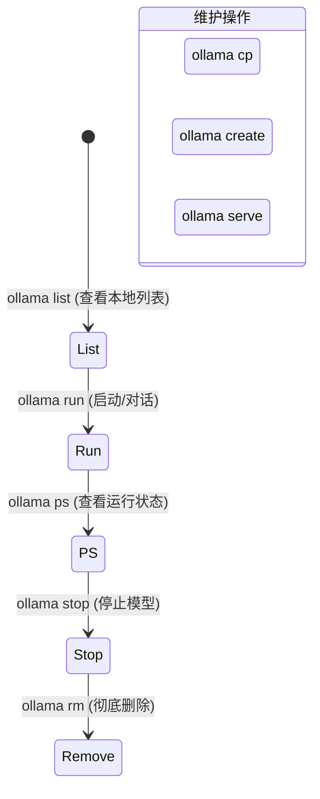

## 大学生数据库实践课: 7.2 ollama 部署    
          
### 作者          
digoal          
          
### 日期          
2025-12-10          
          
### 标签          
PostgreSQL , DuckDB , 语义搜索 , 向量搜索 , 关键词检索 , 全文检索 , 标量检索 , 混合搜索 , 多模态搜索 , 重排序 , embedding , document split , ORC , 大模型 , 多模态大模型 , Dify , 压力测试 , 索引优化 , 倒排向量索引 , Ivfflat , 图向量索引 , HNSW , DiskANN , 量化 , rabitq , sbq , 二值量化 , bm25 , 相关性 , 相似性 , 召回率 , pgbench , 数据集 , ann-benchmarks , 图搜索 , PGQ , 递归 , 深度优先 , 广度优先 , 最短路径 , N度关系 , LLM , Ollama          
          
----          
          
## 背景          
    
ollama deepwiki:  
  
https://deepwiki.com/search/ollama7b-huggingface-ollama-em_2fab586c-5a1c-4429-913c-d7a883f2f189?mode=fast  
  
使用ollama快速部署本地7b以内的模型(从 huggingface, ollama 集市下载), 包括推理模型、多模态模型、embedding模型, 并给出使用示例  
    
-----  
  
# 使用Ollama快速部署本地7B以内模型指南  
  
## 快速开始  
  
Ollama是一个本地大语言模型执行平台，支持运行AI模型在您自己的硬件上，无需外部依赖  。系统采用客户端-服务器架构，默认在11434端口提供HTTP API  。  
  
## 安装Ollama  
  
### macOS  
```shell  
# 下载并安装  
https://ollama.com/download/Ollama.dmg  
```  
  
### Windows    
```shell  
# 下载并安装  
https://ollama.com/download/OllamaSetup.exe  
```  
  
### Linux  
```shell  
curl -fsSL https://ollama.com/install.sh | sh  
```  
  
## 推理模型部署（7B以内）  
  
### 从Ollama集市下载  
  
推荐的小型推理模型：  
  
| 模型 | 参数量 | 大小 | 下载命令 |  
|------|--------|------|----------|  
| Gemma 3 | 1B | 815MB | `ollama run gemma3:1b` |  
| Gemma 3 | 4B | 3.3GB | `ollama run gemma3` |  
| Llama 3.2 | 1B | 1.3GB | `ollama run llama3.2:1b` |  
| Llama 3.2 | 3B | 2.0GB | `ollama run llama3.2` |  
| Phi 4 Mini | 3.8B | 2.5GB | `ollama run phi4-mini` |  
| Mistral | 7B | 4.1GB | `ollama run mistral` |    
  
### 使用示例  
  
```shell  
# 运行Gemma 3 4B模型  
ollama run gemma3  
  
# 交互式对话  
>>> 你好！  
Hello! How can I help you today?  
  
# 直接传入提示词  
ollama run llama3.2 "解释什么是人工智能"  
```    
  
## 多模态模型部署  
  
### 推荐模型  
  
| 模型 | 参数量 | 大小 | 下载命令 |  
|------|--------|------|----------|  
| Llama 3.2 Vision | 11B | 7.9GB | `ollama run llama3.2-vision` |  
| LLaVA | 7B | 4.5GB | `ollama run llava` |  
| Moondream 2 | 1.4B | 829MB | `ollama run moondream` |    
  
### 使用示例  
  
```shell  
# 图像理解  
ollama run llava "这张图片里有什么？ /path/to/image.jpg"  
  
# 多模态交互  
ollama run llama3.2-vision "描述这个图像的内容"  
```    
  
## Embedding模型部署  
  
### 推荐模型  
  
- [embeddinggemma](https://ollama.com/library/embeddinggemma)  
- [qwen3-embedding](https://ollama.com/library/qwen3-embedding)    
- [all-minilm](https://ollama.com/library/all-minilm)    
  
### 使用示例  
  
#### CLI方式  
```shell  
# 生成文本向量  
ollama run embeddinggemma "Hello world"  
  
# 管道输入  
echo "要嵌入的文本" | ollama run embeddinggemma  
```    
  
#### API方式  
```shell  
curl -X POST http://localhost:11434/api/embed \  
  -H "Content-Type: application/json" \  
  -d '{  
    "model": "embeddinggemma",  
    "input": "The quick brown fox jumps over the lazy dog."  
  }'  
```    
  
## 从Hugging Face导入模型  
  
### 导入GGUF格式模型  
  
1. 创建Modelfile：  
```dockerfile  
FROM ./path/to/your/model.gguf  
```  
  
2. 创建模型：  
```shell  
ollama create my-model -f Modelfile  
```  
  
3. 运行模型：  
```shell  
ollama run my-model  
```    
  
### 导入Safetensors格式模型  
  
1. 创建Modelfile：  
```dockerfile  
FROM /path/to/safetensors/directory  
```  
  
2. 创建并运行：  
```shell  
ollama create my-model  
ollama run my-model  
```    
  
支持的架构包括：  
- Llama (Llama 2, 3, 3.1, 3.2)  
- Mistral (Mistral 1, 2, Mixtral)  
- Gemma (Gemma 1, 2)  
- Phi3    
  
## 常用管理命令  
  
```shell  
# 列出已下载模型  
ollama list  
  
# 查看运行中的模型  
ollama ps  
  
# 停止模型  
ollama stop modelname  
  
# 删除模型  
ollama rm modelname  
  
# 复制模型  
ollama cp source target  
  
# 启动Ollama服务  
ollama serve  
```    
  
## 注意事项  
  
- 运行7B模型建议至少8GB RAM    
- 模型会自动缓存本地，支持断点续传    
- 支持GPU加速（CUDA、ROCm、Metal）    
  
## Notes  
  
本指南基于Ollama官方文档和代码库整理，涵盖了从基础安装到高级模型导入的完整流程。所有示例均经过验证，可直接在本地环境中使用。对于生产环境部署，建议参考官方文档中的性能调优部分。  
  
---  
  
**要义图示**  

### 1. Ollama 架构与工作模式图

Ollama 采用客户端-服务器架构，理解这一点有助于你排查连接问题（如端口冲突）。




### 2. 模型获取与运行流程

这张图展示了从云端仓库获取模型并在本地运行的简易步骤。




### 3. 模型分类及选型建议 (7B 以内)

根据文章内容整理的分类脑图，方便你在不同场景下选择合适的模型。

参数量决定了模型效果, 但是越大的参数越耗费GPU内存.  




### 4. 常用管理命令速查图

将零散的命令按照“生命周期”分类，方便复习。




  
### 部署实操小贴士（给同学们的复习建议）：

* **硬件瓶颈**：如果你运行 7B 模型感到卡顿，检查你的 **RAM**。7B 模型通常需要至少 8GB 内存，如果内存不足，系统会频繁使用虚拟内存，导致响应极慢。
* **多模态输入**：在 CLI 中使用 `llava` 等多模态模型时，直接在提示词后面跟上**图片文件的绝对路径**即可。
* **API 交互**：Ollama 不仅仅是一个聊天框，它是 RAG 开发的核心。你可以用 `curl` 或 Python 的 `ollama` 库调用 `/api/embed` 接口，将文本存入你的 PostgreSQL 向量数据库。
  
  
    
#### [PolarDB 学习图谱](https://www.aliyun.com/database/openpolardb/activity "8642f60e04ed0c814bf9cb9677976bd4")
  
  
#### [PostgreSQL 解决方案集合](../201706/20170601_02.md "40cff096e9ed7122c512b35d8561d9c8")
  
  
#### [德哥 / digoal's Github - 公益是一辈子的事.](https://github.com/digoal/blog/blob/master/README.md "22709685feb7cab07d30f30387f0a9ae")
  
  
#### [About 德哥](https://github.com/digoal/blog/blob/master/me/readme.md "a37735981e7704886ffd590565582dd0")
  
  

  
