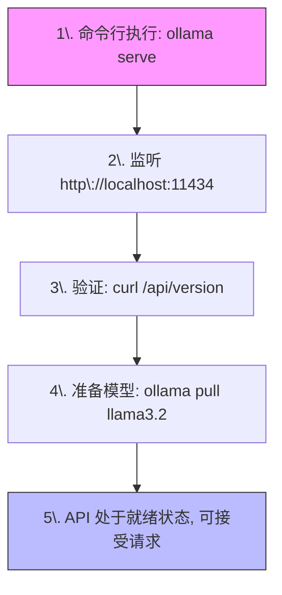
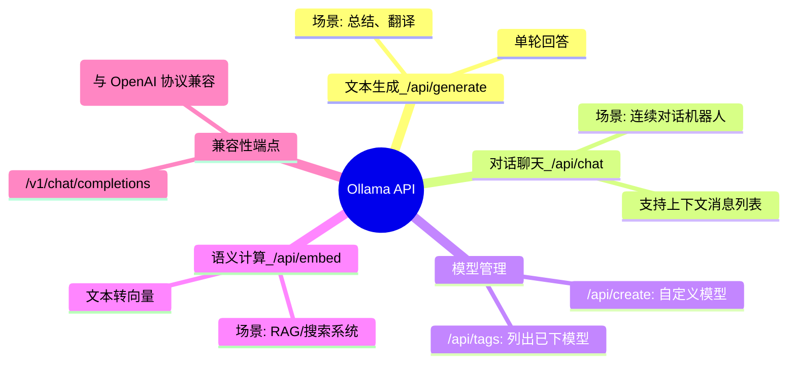
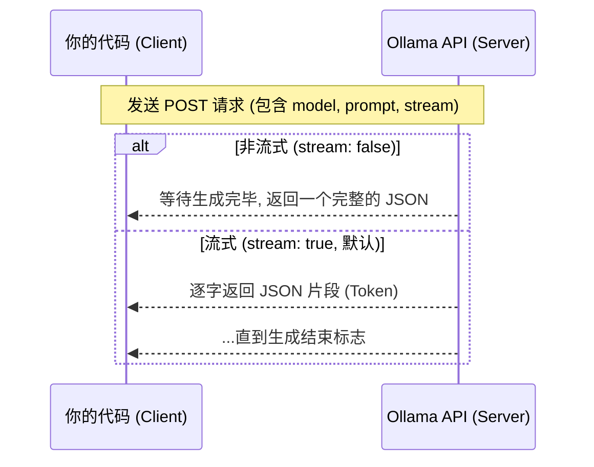
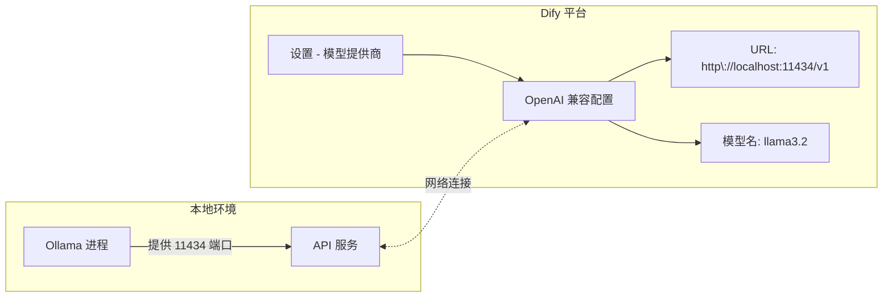

## 大学生数据库实践课: 7.4 ollama API介绍      
                
### 作者                
digoal                
                
### 日期                
2025-12-10                
                
### 标签                
PostgreSQL , DuckDB , 语义搜索 , 向量搜索 , 关键词检索 , 全文检索 , 标量检索 , 混合搜索 , 多模态搜索 , 重排序 , embedding , document split , ORC , 大模型 , 多模态大模型 , Dify , 压力测试 , 索引优化 , 倒排向量索引 , Ivfflat , 图向量索引 , HNSW , DiskANN , 量化 , rabitq , sbq , 二值量化 , bm25 , 相关性 , 相似性 , 召回率 , pgbench , 数据集 , ann-benchmarks , 图搜索 , PGQ , 递归 , 深度优先 , 广度优先 , 最短路径 , N度关系 , LLM , Ollama                
                
----                
                
## 背景                
  
ollama deepwiki:  
  
https://deepwiki.com/search/-1-ollama-api-2ollama-api-3-cu_a73005af-82f6-412e-b040-fb725f08facc?mode=fast  
    
面向大学生通俗易懂解答如下问题:   
1、给出 ollama 作为 API 服务运行的实操;  
2、ollama API 介绍;  
3、给出使用 curl 调用 ollama API 的实操例子;  
4、在 Dify 中配置使用 ollama 模型;   
   
API:  
- https://docs.ollama.com/api/introduction  
   
-----  
  
  
# Ollama API 使用指南  
  
## 简要总结  
  
Ollama是一个本地大语言模型执行平台，可以通过REST API在本地运行AI模型。启动服务后，默认在`http://localhost:11434`提供API服务。支持生成对话、聊天补全等多种API端点，可以通过curl、Python、JavaScript等多种方式调用。Dify作为社区集成工具之一，可以通过配置Ollama的API端点来使用本地模型。  
  
## 详细解答  
  
### 1. Ollama作为API服务运行的实操  
  
#### 启动Ollama服务  
  
要启动Ollama作为API服务，使用以下命令：  
  
```shell  
ollama serve  
```  
  
这个命令会启动Ollama服务器，默认监听在`http://localhost:11434`  。  
  
#### 验证服务运行  
  
服务启动后，可以通过以下方式验证：  
  
```shell  
curl http://localhost:11434/api/version  
```  
  
这将返回Ollama的版本信息  。  
  
#### 下载模型  
  
在使用API之前，需要先下载模型：  
  
```shell  
ollama pull llama3.2  
```  
  
### 2. Ollama API介绍  
  
Ollama提供RESTful API，主要端点包括  ：  
  
- **生成补全**: `POST /api/generate` - 单次提示生成  
- **聊天补全**: `POST /api/chat` - 多轮对话  
- **创建模型**: `POST /api/create` - 创建自定义模型  
- **列出模型**: `GET /api/tags` - 查看本地模型  
- **生成嵌入**: `POST /api/embed` - 生成文本嵌入  
  
#### API基础URL  
  
本地API基础地址为：  
```  
http://localhost:11434/api  
```  
  
云端API基础地址为：  
```  
https://ollama.com/api  
```    
  
#### 重要特性  
  
- **流式响应**: 默认支持流式输出，可设置`"stream": false`禁用    
- **模型格式**: 遵循`model:tag`格式，如`llama3.2:latest`    
- **OpenAI兼容**: 提供`/v1/chat/completions`等OpenAI兼容端点  
  
### 3. 使用curl调用Ollama API的实操例子  
  
#### 生成补全示例  
  
```shell  
curl http://localhost:11434/api/generate -d '{  
  "model": "llama3.2",  
  "prompt": "为什么天空是蓝色的？"  
}'  
```    
  
#### 聊天补全示例  
  
```shell  
curl http://localhost:11434/api/chat -d '{  
  "model": "llama3.2",  
  "messages": [  
    { "role": "user", "content": "为什么天空是蓝色的？" }  
  ]  
}'  
```    
  
#### 非流式响应示例  
  
```shell  
curl http://localhost:11434/api/generate -d '{  
  "model": "llama3.2",  
  "prompt": "为什么天空是蓝色的？",  
  "stream": false  
}'  
```    
  
#### 带参数的示例  
  
```shell  
curl http://localhost:11434/api/generate -d '{  
  "model": "llama3.2",  
  "prompt": "为什么天空是蓝色的？",  
  "options": {  
    "temperature": 0.7,  
    "num_ctx": 4096  
  }  
}'  
```    
  
#### 生成嵌入示例  
  
```shell  
curl http://localhost:11434/api/embed -d '{  
  "model": "all-minilm",  
  "input": "为什么天空是蓝色的？"  
}'  
```    
  
### 4. 在Dify中配置使用Ollama模型  
  
虽然代码库中没有Dify配置的具体信息，但基于Ollama的API特性，可以提供一般配置指导：  
  
#### 配置步骤  
  
1. **确保Ollama服务运行**  
   ```shell  
   ollama serve  
   ```  
  
2. **配置API端点**  
   - 在Dify中设置模型提供商为"OpenAI兼容"  
   - API基础URL: `http://localhost:11434/v1`  
   - API密钥: 可留空或填写任意值  
  
3. **模型名称配置**  
   - 使用已下载的模型名，如`llama3.2`  
   - 或使用别名：`ollama cp llama3.2 gpt-3.5-turbo`    
  
4. **测试连接**  
   - 发送测试消息验证配置  
  
#### 注意事项  
  
- Dify被列为Ollama的社区集成之一    
- 确保网络访问权限（如需要远程访问）  
- 检查CORS设置：`OLLAMA_ORIGINS=*`    
  
## Notes  
  
- Ollama默认绑定127.0.0.1:11434，如需远程访问需设置`OLLAMA_HOST`环境变量    
- 模型默认在内存中保持5分钟，可通过`keep_alive`参数调整    
- 支持GPU加速，使用`ollama ps`查看模型加载状态    
- 所有API调用都在本地进行，不会发送数据到外部服务器    
  
---  
  
**要义图示**   

### 1. Ollama API 服务运行生命周期

这张图展示了从启动服务到验证、准备模型的标准操作流程。



 

### 2. Ollama 核心 API 端点与功能矩阵

这张图概括了 Ollama 提供的不同功能端点，帮助你根据需求选择正确的 URL。



 

### 3. API 请求与响应结构（以 curl 为例）

这张图展示了调用 API 时的“包裹”是如何打开和关闭的，特别是“流式”与“非流式”的区别。



 
### 4. Dify 集成本地 Ollama 逻辑图

这张图说明了如何将本地运行的 Ollama “接入”到 Dify 这种大模型开发平台中。




### 实践小贴士（给同学们的实验建议）：

1. **CORS 跨域问题**：如果你在网页前端调用 API 报错，记得在启动前设置环境变量：`export OLLAMA_ORIGINS="*"`。
2. **API 调试神器**：如果你觉得 `curl` 写起来太麻烦，可以使用 **Postman** 或者 VS Code 的 **REST Client** 插件，把 JSON 请求保存下来反复调试。
3. **内网穿透**：想让舍友在另一台电脑调用你的模型？设置 `export OLLAMA_HOST=0.0.0.0` 即可让 Ollama 监听局域网内所有 IP。
4. **性能监控**：调用 API 的时候，可以同时打开任务管理器或 `nvidia-smi`（如果你有显卡），观察 API 响应时 CPU/GPU 的负载变化。

    
    
#### [PolarDB 学习图谱](https://www.aliyun.com/database/openpolardb/activity "8642f60e04ed0c814bf9cb9677976bd4")
  
  
#### [PostgreSQL 解决方案集合](../201706/20170601_02.md "40cff096e9ed7122c512b35d8561d9c8")
  
  
#### [德哥 / digoal's Github - 公益是一辈子的事.](https://github.com/digoal/blog/blob/master/README.md "22709685feb7cab07d30f30387f0a9ae")
  
  
#### [About 德哥](https://github.com/digoal/blog/blob/master/me/readme.md "a37735981e7704886ffd590565582dd0")
  
  

  
