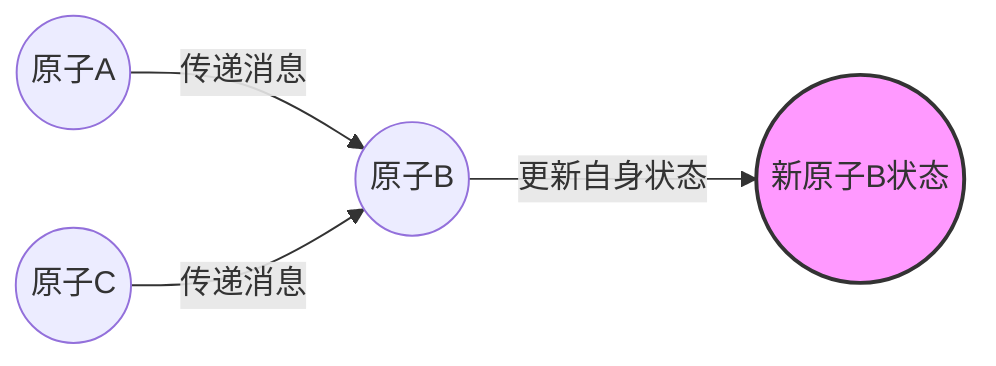
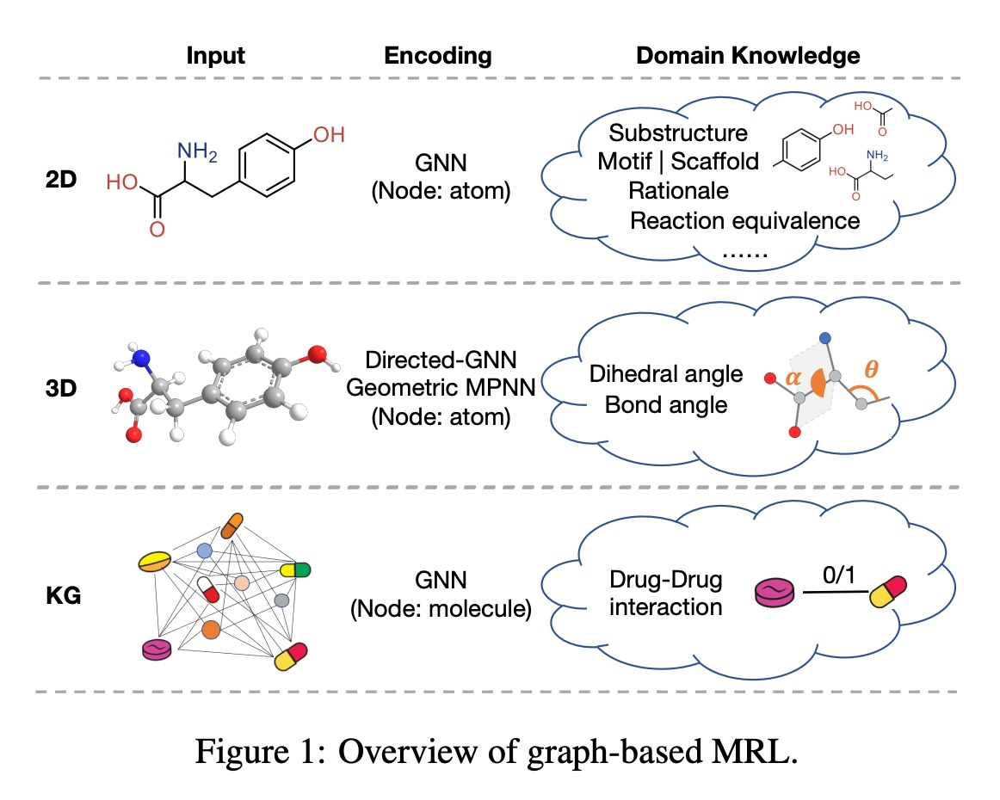
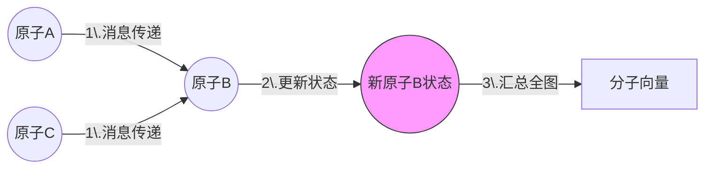

## AI论文解读 | Graph-based Molecular Representation Learning
        
### 作者        
digoal        
        
### 日期        
2025-12-12        
        
### 标签        
PostgreSQL , PolarDB , DuckDB , AI , 论文解读        
        
----        
        
## 背景  
      
https://arxiv.org/pdf/2207.04869        
  
提示:          
```          
读懂《Graph-based Molecular Representation Learning》这篇论文需要提前掌握哪些基础知识, 请使用中文通熟易懂的讲解这些基础知识, 可以引用论文中的图、表或使用Markdown支持的图形(text,mermaid等)增加解释性. 
  
使用中文通熟易懂的解读《Graph-based Molecular Representation Learning》这篇论文, 其中的关键内容请着重讲解, 可以引用论文中的图、表或使用Markdown支持的图形(text,mermaid等)增加解释性. 
  
提取《Graph-based Molecular Representation Learning》这篇论文中的重要术语, 使用中文对这些术语进行通熟易懂的讲解, 可以引用论文中的图、表或使用Markdown支持的图形(text,mermaid等)增加解释性. 
```     
  
## 1 前置知识 
  
阅读这就好比在学习“AI如何像化学家一样思考”。要读懂这就篇综述论文《Graph-based Molecular Representation Learning》，你需要掌握三大块基础拼图： **图深度学习基础**、**化学分子的数字化表示**以及**基本的化学领域知识**。

以下我将用通俗易懂的语言为你拆解这些前置知识，并结合论文中的图表进行解释。

### 1\. 核心概念：什么是“分子表示学习” (MRL)?

在深入细节前，你需要理解这个核心逻辑：

  * **输入**：一个化学分子（比如阿司匹林）。
  * **过程**：通过深度学习模型（特别是图神经网络），把这个分子变成一串计算机能理解的**数字向量**（Embedding）。
  * **目的**：保留分子的结构和化学性质，以便后续做预测（如：这药有没有毒？能不能治病？）。

-----

### 2\. 计算机科学基础：图与图神经网络 (GNN)

这是理解论文方法论（第3章）的关键。

#### A. 分子就是“图” (Graph)

在计算机眼里，分子天然就是一个图：

  * **节点 (Node)** = 原子 (Atom) 。
  * **边 (Edge)** = 化学键 (Bond) 。
  * **属性 (Features)** = 原子的类型（C, H, O）、键的类型（单键、双键）等 。

#### B. 消息传递机制 (Message Passing)

论文中反复提到的 **MPNN (Message Passing Neural Networks)** 是所有图方法的基础 。

  * **通俗解释**：想象每个原子都是一个人。每一轮“消息传递”，原子都会把自己掌握的信息告诉它的邻居原子。经过几轮对话后，每个原子都掌握了周围环境的信息，最终聚合起来就形成了整个分子的特征。




  * **论文中的数学表达**：论文第3.1节提到了 $m_{v}^{t+1}$ （消息聚合）和 $h_{v}^{t+1}$ （状态更新），指的就是这个过程 。

-----

### 3\. 化学信息学基础：分子的三种“长相”

论文将分子表示方法分为三大类（2D, 3D, KG），你需要理解它们的区别。请看论文中的核心概念图：

#### A. 1D 序列 (SMILES) vs. 2D 图

  * **SMILES**：是用一行字母来表示分子（例如 `CCO` 代表乙醇）。
      * *缺点*：原本在空间上相连的原子，写成字符串后可能离得很远，丢失了结构信息 。
  * **2D 分子图**：就是我们中学课本上画的化学结构式。
      * *特点*：只有连接关系（拓扑结构），没有空间距离 。
      * *关键知识点*： **拓扑 (Topology)** —— 指的是谁和谁连着，而不关心它们在空间里弯曲成什么样。

#### B. 3D 构象 (Conformer)

  * **概念**：分子在真实世界中是立体的，而且是会动的。
  * **关键术语**：
      * **构象 (Conformer)** ：分子在能量最低时的某种3D形态 。
      * **手性 (Chirality)** ：像左手和右手一样，结构对称但无法重合的性质（2D图往往看不出区别，必须用3D）。
      * **键角与二面角**：原子之间的夹角，决定了分子的胖瘦和折叠方式 。

| 维度 | 包含信息 | 缺失信息 | 适用场景 |
| :--- | :--- | :--- | :--- |
| **2D** | 原子连接关系、键类型 | 空间距离、旋转角度 | 基础性质预测  |
| **3D** | 也就是几何信息 (Geometric)，包含精确坐标、角度 | 计算成本高 | 药物与蛋白结合、精细化学反应  |

-----

### 4\. 进阶：化学领域知识 (Domain Knowledge)

论文强调了现在的AI模型开始融入“化学直觉” 。你需要懂以下几个化学术语，才能理解论文中提到的改进方法：

#### A. 官能团与基序 (Functional Groups & Motifs)

  * **通俗解释**：分子中起决定性作用的“小团队”。比如“羧基”决定了酸性。
  * **Motif (基序)** ：复现率很高的子图结构。AI如果能识别出这些“小团队”，就能更准确地预测性质 。

#### B. 骨架 (Scaffold)

  * **通俗解释**：分子的“主干”或“地基”。
  * **作用**：药物研发中，通常保持核心骨架不变，修修补补侧链来优化药物。AI需要学会识别哪个是主干，哪个是装饰 。

#### C. 药效团 (Pharmacophore) 与 构效关系 (SAR)

虽然文中未大篇幅展开，但这是隐含背景。

  * **原理**：分子的结构（Structure）决定了它的活性/性质（Activity）。AI的任务就是学习这种**构效关系**。

-----

### 5\. 机器学习策略：如何训练模型？

论文在第3章后面讨论了多种学习策略，你需要了解：

#### A. 监督学习 (Supervised Learning)

  * 给AI看分子图（X）和标签（Y，比如毒性），让它在这个特定任务上学习。
  * *缺点*：需要大量带标签的数据，但这在化学里很贵 。

#### B. 自监督学习与对比学习 (Self-supervised & Contrastive Learning)

这是论文讨论的重点趋势 。

  * **通俗解释**：
    1.  **预训练 (Pre-training)** ：先不让AI做具体任务，而是给它海量无标签的分子，让它做“完形填空”（比如遮住一个原子让它猜）。
    2.  **对比学习 (Contrastive Learning)** ：给同一个分子拍两张不同的“照片”（比如旋转一下，或者遮住一部分），告诉AI这两张是同一个东西，而另一张照片是别的分子。这能训练AI的“眼力”，让它透过现象看本质 。

-----

### 总结：你的学习路线图

要完全吃透这篇论文，建议按以下顺序回顾基础：

1.  **先看图论**：理解 节点(Node)、边(Edge)、邻接矩阵。
2.  **再看化学**：搞懂 SMILES字符串、3D构象的区别，以及什么是“官能团”。
3.  **最后看深度学习**：理解 GNN 的“消息传递”机制和“对比学习”的思想。

掌握了这些，你就能顺畅地理解论文中图1所展示的架构： **如何把不同维度的分子输入（Input），通过GNN编码（Encoding），并结合化学知识（Domain Knowledge），最终解决药物发现等实际问题。**

  
  
## 2 解读论文 
  
这篇论文《Graph-based Molecular Representation Learning》是对**基于图的分子表示学习**（Molecular Representation Learning, MRL）领域的系统性综述 。

简单来说，它的核心问题是： **如何利用人工智能（特别是图神经网络），把化学分子变成计算机能听懂、能计算的“数字向量”，从而帮助人类发现新药、预测化学性质？**

以下是该论文的通俗化解读，我将通过核心逻辑流为你拆解关键内容。

-----

### 1\. 为什么要用“图”来表示分子？

在过去，计算机处理分子常用 SMILES 字符串（比如用 `CCO` 表示乙醇）。但这种方式像把立体的乐高积木压扁成了一行字，丢失了很多结构信息 。

论文指出，**分子天然就是一张图（Graph）** ：

  * **节点 (Node)** = 原子 (Atom)
  * **边 (Edge)** = 化学键 (Bond)

使用图神经网络 (GNN) 可以直接在这样的结构上学习，捕捉更丰富的化学信息 。

#### 核心图解：分子的三种“打开方式”

论文将基于图的分子学习分成了三大流派，这构成了全文的框架（参考论文 Figure 1）：    

| 输入类型 | 描述 | 关键点 | 适用场景 |
| :--- | :--- | :--- | :--- |
| **2D 分子图** | 也就是我们在课本上画的化学结构式 。 | 只有连接关系（拓扑结构），没有空间距离 。 | 基础性质预测、分子生成 |
| **3D 分子图** | 包含原子在三维空间中的坐标 。 | 包含键长、键角、二面角。**同一个分子可能有不同的3D姿态（构象）** 。 | 药物结合、精细化学反应 |
| **知识图谱 (KG)** | 宏观的分子关系网 。 | 节点是“分子”，边是“药物-药物相互作用”等关系 。 | 药物相互作用预测 |

-----

### 2\. 核心方法论：AI 如何“读懂”分子？

这是论文最硬核的部分（第3章）。目前的 AI 主要通过以下步骤将分子转化为向量：

#### A. 基础引擎：消息传递 (Message Passing)

大多数方法都基于**消息传递神经网络 (MPNN)** 。

  * **原理**：想象每个原子是一个人，每一轮对话中，它都会把自己的特征（我是碳原子、我有双键...）告诉邻居。经过几轮“八卦”后，每个原子都知道了周围环境长什么样 。
  * **结果**：最后将所有原子信息汇总（Readout），就得到了整个分子的特征向量 。




#### B. 进阶策略：融入“化学直觉” (Domain Knowledge)

普通的 GNN 只是把分子当成普通的图。但论文强调，**优秀的 MRL 模型必须融入化学领域知识** 。

论文总结了几个关键的“化学外挂”：

1.  **官能团与基序 (Motifs)** ：
      * AI 不能只看单个原子，要学会看“团伙”。比如“苯环”或“羧基”是决定性质的关键子结构 。
      * *方法*：像搭积木一样，基于这些子结构进行训练（如 GROVER 模型）。
2.  **3D 几何信息**：
      * 2D 图由于缺失空间信息，可能无法区分某些异构体。3D 方法引入了角度和距离 。
      * *难点*：分子是会动的，怎么处理？方法包括使用球面坐标 (SphereNet) 或对比学习 。
3.  **对比学习 (Contrastive Learning)** ：
      * 这是一种自监督学习。比如把一个分子旋转一下，或者遮住一部分，告诉 AI “这还是同一个分子”，让 AI 学会透过现象看本质 。
      * 例子： **MoIR** 模型利用了“化学反应守恒”原理——反应物的向量之和应该等于生成物的向量之和 。

-----

### 3\. 应用场景：学出来的向量有什么用？

论文在第4章详细列举了四大应用场景 ：

#### 1\. 分子性质预测 (Property Prediction)

  * **任务**：预测这个分子是否有毒？溶解度多少？能不能穿透血脑屏障？
  * **地位**：这是最基础的任务，用来测试模型好不好用。
  * **SOTA模型**：论文提到 **UnifiedPML** 通过结合 2D 和 3D 信息取得了很好的效果 。

#### 2\. 分子生成 (Molecular Generation)

  * **任务**：让 AI 像化学家一样凭空“画”出新药分子 。
  * **难点**：生成的图必须符合化学规则（比如碳原子不能连5条线）。
  * **方法**：
      * **JT-VAE**：把分子拆解成树状结构生成，保证化学有效性 。
      * **GraphAF**：像流模型一样一步步画出分子 。

#### 3\. 反应预测 (Reaction Prediction)

  * **任务**：给定反应物，预测产物是什么（正向）；或者给定产物，反推怎么合成（逆合成分析）。
  * **新思路**：像翻译语言一样，把反应物“翻译”成产物 。

#### 4\. 药物-药物相互作用 (DDI)

  * **任务**：病人同时吃两种药，会不会产生副作用？
  * **方法**：通常使用知识图谱（KG）技术，预测药物节点之间的连接关系 。

-----

### 4\. 数据集与未来方向

为了方便大家研究，论文整理了常用的“题库”（Benchmarks）：

  * **ZINC15 / ChEMBL**: 用于预训练的超大规模分子库 。
  * **MoleculeNet (包含 ESOL, BBBP, Tox21 等)** : 用于测试性质预测的标准考题 。

#### 未来研究方向 (Future Directions)

论文最后指出了现在的瓶颈 ：

1.  **更好的 3D 学习**：目前的 3D 模型还没完全标准化，需要更精准地捕捉几何信息 。
2.  **可解释性 (Explainability)** ：AI 预测这个药有毒，必须告诉化学家“是因为哪个结构导致的”，否则没人敢用 。
3.  **小样本学习 (Insufficient Data)** ：化学标注数据非常昂贵（需要做实验），AI 需要学会从少量数据中快速学习（Meta-learning）。

-----

### 总结

这篇论文告诉我们： **将图神经网络 (GNN) 应用于化学分子，关键在于如何把“化学知识”（如3D构象、官能团、反应机理）巧妙地编码进神经网络中。** 这一领域正在从简单的图拓扑学习，向着结合 3D 几何与领域知识的深水区迈进。
  
## 3 术语 
  
为了帮助你更好地理解《Graph-based Molecular Representation Learning》这篇论文，我提取了其中的**核心术语**，并按照逻辑分类进行了通俗化的解读。

### 第一类：分子的“数字替身” (表示形式)

要让 AI 处理化学分子，首先得把分子变成计算机能懂的数据格式。

#### 1\. 分子表示学习 (Molecular Representation Learning, MRL)

  * **定义**：利用深度学习模型，将化学分子编码成一串**数值向量**（Feature Vector）的过程 。
  * **通俗解读**：这就好比给每一个化学分子办理一张 **“数字身份证”** 。这张身份证上的一串数字（向量）浓缩了分子的结构、化学性质等信息。后续的任务（比如预测这药有没有毒）只要读这张身份证就行了。

#### 2\. SMILES (简化分子线性输入规范)

  * **定义**：一种基于文本的分子表示方法，用字母和符号串来描述分子结构 。
  * **通俗解读**：把立体的分子“压扁”成一行字。
      * 例如：乙醇（酒精）写作 `CCO`。
      * **缺点**：就像把一幅画拆成了一行像素，原本在空间上挨得很近的原子，写成字符串后可能隔得很远，导致 AI 很难理解它们的真实关系 。

#### 3\. 2D 分子图 (2D Molecular Graph)

  * **定义**：将分子视为图论中的“图”。原子是**节点 (Nodes)** ，化学键是**边 (Edges)** 。
  * **通俗解读**：这是最直观的“化学结构式”。它告诉 AI 谁和谁连着，但没有空间距离感。
      * *主要特征*：原子类型、键的类型（单键/双键）、是否在环上等 。
      * *图解*：
    
    ```mermaid
    graph LR
        C1((C: 碳)) === C2((C: 碳))
        C2 --- O1((O: 氧))
        style C1 fill:#ddd
        style C2 fill:#ddd
        style O1 fill:#f9f
    ```
    *(乙醇的简单 2D 图示)*

#### 4\. 3D 分子图 (3D Molecular Graph / Conformer)

  * **定义**：在 2D 图的基础上，加入了原子在三维空间中的**坐标 (Coordinates)** 。
  * **关键点**：
      * **构象 (Conformer)** ：分子不是僵硬的，它会扭动。能量最低、最稳定的那个 3D 姿态叫构象 。
      * **通俗解读**：如果不看 3D，就分不清“左手”和“右手”（手性分子）。3D 图包含了**键长、键角、二面角**等几何信息，对于药物和蛋白质怎么“卡”在一起（结合）至关重要 。

-----

### 第二类：化学领域的“行话” (关键子结构)

论文强调了引入“领域知识”的重要性，以下是 AI 需要特别关注的子结构：

#### 5\. 基序 (Motif)

  * **定义**：在分子数据集中反复出现的子图模式 。
  * **通俗解读**： **乐高里的通用组件**。比如“苯环”或者特定的“官能团”就是一个 Motif。如果你看到一个分子里有这个组件，大概就能猜到它有一部分性质是什么。许多模型（如 GROVER）会专门训练 AI 去识别这些组件 。

#### 6\. 骨架 (Scaffold)

  * **定义**：分子的核心框架，通常是预定义的环系统 。
  * **通俗解读**： **房子的承重结构**。在制药中，科学家通常保持核心骨架（Scaffold）不变，通过修饰周边的“装饰品”（侧链）来优化药物性能。

#### 7\. Rationale (原理子图)

  * **定义**：与某种特定分子性质（如毒性、溶解度）直接相关的子图 。
  * **通俗解读**： **“起效部位”** 。假如一个分子能治头痛，可能不是因为整个分子都在干活，而是其中一小块结构（Rationale）像钥匙一样插进了锁孔。

-----

### 第三类：AI 的“思考方式” (算法与机制)

#### 8\. MPNN (消息传递神经网络)

  * **定义**：图神经网络（GNN）的一种通用框架，包含消息传递、节点更新和读出三个阶段 。
  * **通俗解读**： **“原子传声筒”游戏**。
    1.  **消息传递**：每个原子看看周围的邻居，把自己的信息告诉它们。
    2.  **更新**：每个原子结合邻居传来的八卦，更新自己对环境的认知。
    3.  **读出**：经过几轮传话，把所有原子的信息汇总，就懂了整个分子。

#### 9\. 对比学习 (Contrastive Learning)

  * **定义**：一种自监督学习方法。通过最大化同一分子的不同视角（View）之间的一致性来训练模型 。
  * **通俗解读**： **“找茬与找同”** 。
      * AI 没见过标签，怎么自学？
      * 给它看两张图：图 A 是原本的分子，图 B 是把图 A 旋转或者遮住一半的样子。
      * 告诉 AI：“这俩是同一个东西，你要算出它们很像；那张图 C 是别的分子，你要算出它们不像。”
      * 通过这种训练，AI 就学会了抓取分子的本质特征 。

#### 10\. 反应等价性 (Reaction Equivalence)

  * **定义**：化学反应中，反应物（原料）的原子总和应该等于生成物（产品）的原子总和，且嵌入向量应保持某种守恒关系 。
  * **通俗解读**： **化学守恒定律的 AI 版**。模型不仅要看懂分子，还要懂“加法”：原料 A + 原料 B 的特征，应该约等于 产品 C 的特征。这被用于增强模型的逻辑能力（如 MolR 模型）。

-----

### 第四类：AI 能干什么？ (应用任务)

#### 11\. 性质预测 (Property Prediction)

  * **解释**：这是最常见的任务。给分子，猜性质（是否有毒、溶解度多少、能否透过血脑屏障） 。
  * **指标**：常用 **ROC-AUC**（分类任务，越接近 1 越好）或 **RMSE**（回归任务，误差越小越好） 。

#### 12\. 分子生成 (Molecular Generation)

  * **解释**：让 AI 像搭积木一样，生成一个全新的、符合化学规则的、且具有目标药效的分子 。
  * **难点**：不能生成“断胳膊少腿”的无效分子（Validity），且生成的分子要多种多样（Diversity） 。

#### 13\. 逆合成预测 (Retrosynthesis)

  * **解释**：反应预测的逆过程。给出一个复杂的药物分子（目标），让 AI 倒推需要哪些简单的原料和步骤才能把它造出来 。就像给一道菜，反推菜谱。

*(此概念对应论文 Figure 1，展示了从 2D/3D 输入到编码再到任务的全流程)*

  
  
## 参考        
         
https://arxiv.org/pdf/2207.04869    
        
<b> 以上内容基于DeepSeek、Qwen、Gemini及诸多AI生成, 轻微人工调整, 感谢杭州深度求索人工智能、阿里云、Google等公司. </b>        
        
<b> AI 生成的内容请自行辨别正确性, 当然也多了些许踩坑的乐趣, 毕竟冒险是每个男人的天性.  </b>        
  
    
#### [PolarDB 学习图谱](https://www.aliyun.com/database/openpolardb/activity "8642f60e04ed0c814bf9cb9677976bd4")
  
  
#### [PostgreSQL 解决方案集合](../201706/20170601_02.md "40cff096e9ed7122c512b35d8561d9c8")
  
  
#### [德哥 / digoal's Github - 公益是一辈子的事.](https://github.com/digoal/blog/blob/master/README.md "22709685feb7cab07d30f30387f0a9ae")
  
  
#### [About 德哥](https://github.com/digoal/blog/blob/master/me/readme.md "a37735981e7704886ffd590565582dd0")
  
  

  
