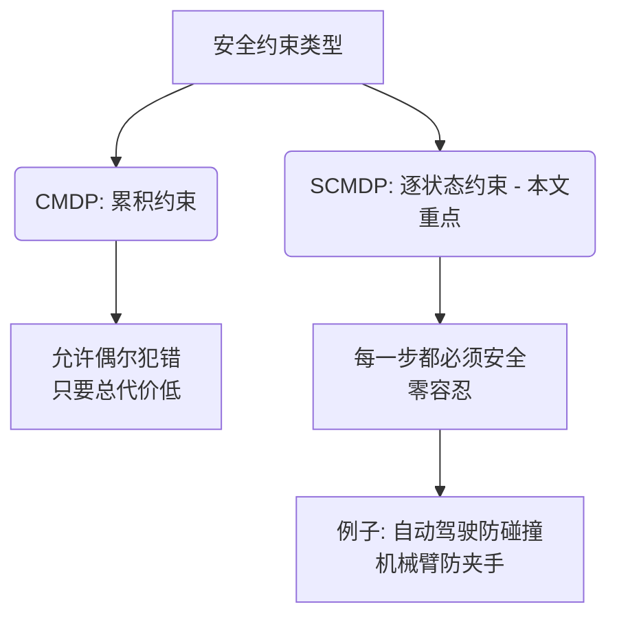
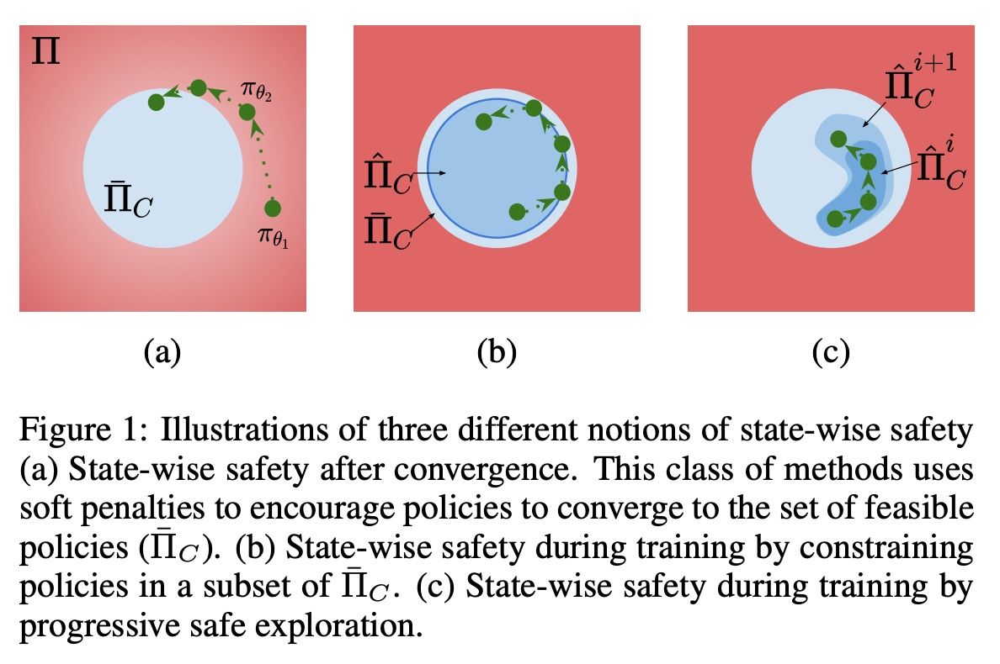
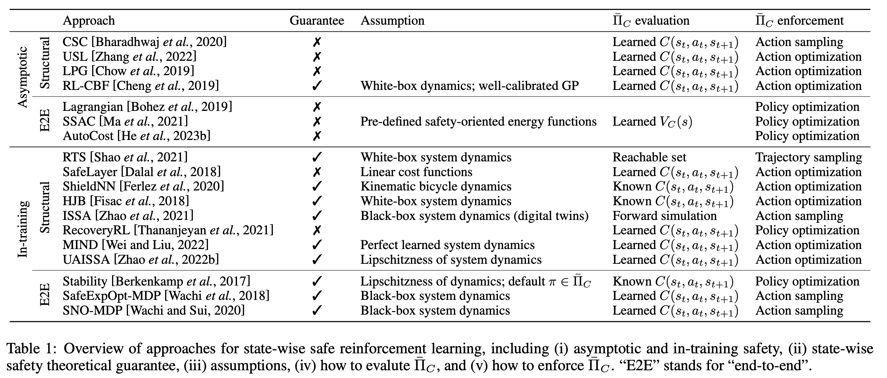
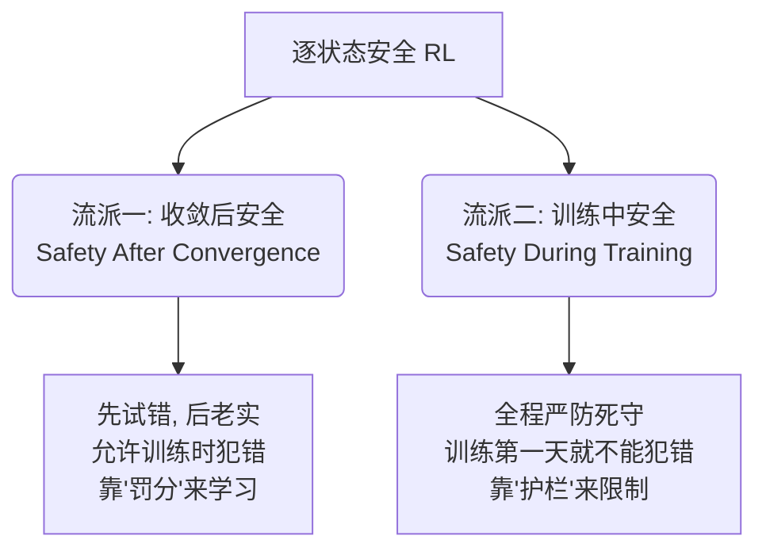
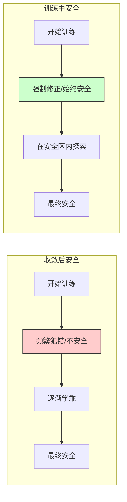
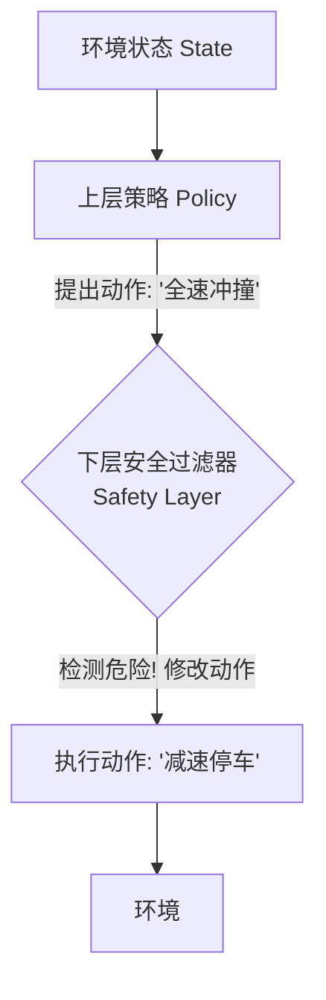

## AI论文解读 | State-wise Safe Reinforcement Learning: A Survey
        
### 作者        
digoal        
        
### 日期        
2025-12-12        
        
### 标签        
PostgreSQL , PolarDB , DuckDB , AI , 论文解读        
        
----        
        
## 背景  
      
https://arxiv.org/pdf/2302.03122        
  
提示:          
```          
读懂《State-wise Safe Reinforcement Learning: A Survey》这篇论文需要提前掌握哪些基础知识, 请使用中文通熟易懂的讲解这些基础知识, 可以引用论文中的图、表或使用Markdown支持的图形(text,mermaid等)增加解释性. 
  
使用中文通熟易懂的解读《State-wise Safe Reinforcement Learning: A Survey》这篇论文, 其中的关键内容请着重讲解, 可以引用论文中的图、表或使用Markdown支持的图形(text,mermaid等)增加解释性. 
  
提取《State-wise Safe Reinforcement Learning: A Survey》这篇论文中的重要术语, 使用中文对这些术语进行通熟易懂的讲解, 可以引用论文中的图、表或使用Markdown支持的图形(text,mermaid等)增加解释性. 
```     
  
## 1 前置知识 
  
阅读这篇关于**State-wise Safe Reinforcement Learning (逐状态安全强化学习)** 的综述论文 ，你需要建立一座由“基础强化学习”、“优化理论”和“控制理论”构成的知识金字塔。

为了让你更轻松地理解，我将这些前置知识拆解为通俗易懂的模块，并结合论文中的核心概念进行说明。

### 1\. 核心地基：马尔可夫决策过程 (MDP)

这是所有强化学习的起点。你需要理解 RL 智能体是如何与环境交互的。

  * **通俗解释**：想象你在教一台机器人走迷宫。
      * **状态 ( $S$ )** ：机器人当前在哪里，或者它看到的画面 。
      * **动作 ( $A$ )** ：机器人决定向左走还是向右走 。
      * **奖励 ( $\mathcal{R}$ )** ：走出迷宫给糖吃（正奖励），撞墙扣分（负奖励）。
      * **策略 ( $\pi$ )** ：机器人的脑子，即“在什么状态下做什么动作”的概率分布 。
      * **目标**：最大化未来能拿到的**总**糖果数（ 累积奖励 $\mathcal{J}$ ）。

> **论文关联**：论文第 2.1 节就是在定义这个标准过程。你需要明白普通 RL 只在乎“总分最高”，而不一定在乎过程中是否犯错，这正是安全问题产生的根源 。

-----

### 2\. 关键区分：CMDP vs. SCMDP (累积约束 vs. 逐状态约束)

这是读懂这篇论文最关键的概念。你需要区分“大概率安全”和“每一步都绝对安全”。

  * **Constrained MDP (CMDP)** ：
      * **解释**：类似“平均速度限制”。只要你全程平均速度不超过 100km/h 就可以，哪怕中间有一秒飙到了 200km/h，只要后面慢下来拉低平均值就行。
      * **数学形式**：累积代价小于某个阈值 。
  * **State-wise CMDP (SCMDP - 本文主角)** ：
      * **解释**：类似“绝对禁止撞墙”。这是**即时(Instantaneous)** 且 **确定性(Deterministic)** 的硬约束。无论你之前开得再好，只要这一秒撞墙了，任务就失败了 。
      * **例子**：论文中举例，机器人拿杯子，必须把杯子放在平稳的桌面上才能松手。这是一个必须在那个“状态”下立刻满足的条件，不能靠之前的表现来弥补 。

**图解对比**：



-----

### 3\. 两种安全达成方式：软约束 vs. 硬截断

论文将方法分为两大类，理解这一点的基础在于理解“如何修正错误”。

#### A. 软约束 (Soft Penalties / Lagrangian)

  * **概念**：把违反规则变成扣分。
  * **通俗解释**：如果车开出界了，我不会强行把方向盘扳回来，但我会罚你 10000 分。智能体为了得高分，自然会学着不去越界。
  * **缺点**：在训练初期，智能体还在试错，可能会发生严重的事故（虽然它被扣分了，但事故已经发生了）。
  * **对应论文概念**： **State-wise Safety After Convergence (收敛后安全)** 。即学成之后是安全的，但学习过程中可能不安全 。

#### B. 硬截断/屏蔽 (Projection / Shielding / Barrier)

  * **概念**：有一个“监护人”或“过滤器”强制修正动作。
  * **通俗解释**：智能体想把车开进沟里，但有一个底层的安全系统（像电子围栏）强制接管方向盘，把车推回安全区域。
  * **对应论文概念**： **State-wise Safety During Training (训练中安全)** 。即使智能体很笨，监护人也能保证它不出事 。

> **论文图表导读 (Figure 1)** ：
> 请看论文第 2 页的 **Figure 1** 。
>
>   * **(a) 图**：代表软约束。红区是危险区，绿点（策略）一开始可能在红区（不安全），慢慢挪进蓝区（安全区）。
>   * **(b) & (c) 图**：代表硬约束。绿点始终被限制在蓝区或者蓝区的一个子集里，从来没去过红区。

  

-----

### 4\. 控制理论基础 (Control Theory)

论文中提到了大量基于“控制理论”的方法（特别是在 Hierarchical Agent 部分），你需要了解以下两个术语的直观含义：

  * **Lyapunov Function (李雅普诺夫函数)** ：
      * **通俗解释**：想象一个碗，碗底是最安全的状态。小球（系统状态）在重力作用下总会滚向碗底。Lyapunov 函数就是描述这个“能量”的函数。如果我们能证明系统的“能量”一直在降低，就能证明系统是稳定的、安全的 。
  * **Control Barrier Function (CBF, 控制障碍函数)** ：
      * **通俗解释**：这是悬崖边的护栏。当系统状态接近危险边缘（悬崖）时，CBF 会生成一个斥力，强制把系统推回安全地带。在数学上，它定义了一个不可逾越的边界 。

-----

### 5\. 论文的核心分类逻辑 (阅读导航)

掌握了以上基础，你就能看懂论文的分类逻辑表（即 **Table 1** ）：

  

1.  **分层架构 (Hierarchical Agent)** ：

      * **上层**：一个普通的 RL 想要拿高分（甚至可能想做危险动作）。
      * **下层**：一个“安全过滤器”（基于上述的 CBF 或投影法），把危险动作修正为安全动作。
      * *知识点*：你需要理解这种“指令-\>修正-\>执行”的流程。

2.  **端到端 (End-to-End Agent)** ：

      * 没有分层，直接训练一个神经网络，把安全约束写在优化目标里（比如用拉格朗日乘子法），让它自己学会既拿高分又安全。

-----

### 总结：你需要准备的技能包

1.  **基础 RL**：知道 State, Action, Reward, Policy 是什么。
2.  **约束概念**：明白“撞墙就死”（State-wise）和“平均分及格”（Cumulative）的区别。
3.  **优化直觉**：明白我们可以通过“罚款”（软约束）或“强制改动作”（硬约束）来纠正行为。
4.  **控制论直觉**：知道 Lyapunov 和 CBF 像是“能量碗”和“隐形护栏”，用于保证系统不失控。

**下一步建议：**
这就为您打好了阅读基础。建议您从论文的 **Figure 1** 和 **Table 1** 开始看起，这两个部分最能直观反映上述知识点的应用。如果您对“安全过滤器”的具体数学实现（如 CBF 或 投影法）感兴趣，我可以为您详细解析第 3.1 节或 4.1 节的内容。
  
  

  

## 2 解读论文 
  
这是一篇关于**逐状态安全强化学习 (State-wise Safe Reinforcement Learning)** 的综述论文。为了让你轻松读懂，我将跳过复杂的数学公式，用通俗的语言、图表和类比来拆解这篇论文的核心逻辑。

### 1\. 核心背景：为什么我们需要“逐状态”安全？

传统的强化学习 (RL) 就像一个为了拿高分不择手段的“游戏狂人”。

  * **普通 RL**：为了早点到达终点（高奖励），可能会选择飙车，甚至偶尔擦碰一下也没关系，只要总分高就行 。
  * **安全 RL (Safe RL)** ：要求智能体必须守规矩。

但这篇论文指出了一个关键区别： **“平均安全” vs. “每时每刻都安全”** 。

  * **以前的方法 (CMDP)** ：类似“限制全程平均速度”。只要平均不超速就行，中间偶尔飙到 200迈也可以 。
  * **本文关注的方法 (SCMDP - State-wise)** ：类似“绝对防碰撞”。这是**即时(Instantaneous)** 且 **硬性(Hard)** 的约束。比如自动驾驶车，**任何一秒**都不能撞人；或者机械臂拿杯子，**任何时候**没放稳都不能松手 。

**一句话总结**：这篇论文研究的是**如何在强化学习的每一步决策中，都硬性地保证不违反安全规则**。

-----

### 2\. 方法的两大流派：什么时候保证安全？

论文根据 **“什么时候开始保证安全”** ，将现有的方法分成了两大阵营 。我们可以结合论文中的 **Figure 1** 来理解：




  

#### 流派一：收敛后安全 (Safety After Convergence)

  * **逻辑**：就像学骑自行车。刚开始学的时候允许你摔跤（违反约束），但我会给你很重的扣分（Soft Penalties）。摔得多了，你为了拿高分，最后学会了（收敛了）就不摔了 。
  * **论文图解 (Figure 1a)** ：策略一开始可能在红色危险区，通过惩罚慢慢挪进蓝色安全区 。
  * **优缺点**：
      * 优点：探索能力强，学得快，不需要太复杂的物理知识 。
      * 缺点：训练过程中可能会发生危险，如果你是在训练一台真实的挖掘机，它可能已经把墙撞塌了 。

#### 流派二：训练中安全 (Safety During Training)

  * **逻辑**：就像驾校教练坐在副驾驶。你想乱打方向盘？教练会一把抓（屏蔽/修正），强制让你留在安全范围内。无论你是新手还是老手，车永远不会撞 。
  * **论文图解 (Figure 1b/c)** ：策略始终被限制在蓝色安全区内，或者从一个小的安全圈慢慢扩大，绝对不碰红色区域 。
  * **优缺点**：
      * 优点：全程零事故，适合真实物理机器人 。
      * 缺点：太保守了，可能有些原本能走的高分捷径被封死了；而且通常需要很多先验知识（比如通过物理公式计算刹车距离） 。

-----

### 3\. 智能体的结构：大脑是怎么设计的？

论文还根据 **“怎么实现安全”** ，把智能体分成了两种结构（见论文 Table 1）：    

#### A. 分层式架构 (Hierarchical Agent) —— “老板+保镖”模式

这种方法把“想拿分”和“保平安”分开处理。

  * **上层 (RL Policy)** ：负责拿分。它可能会发出“全速前进”这种危险指令 。
  * **下层 (Safety Layer/Filter)** ：这是保镖。它不仅听上层的，还盯着安全仪表盘。如果上层指令危险，它会把动作**投影 (Projection)** 或 **修正** 为安全动作 。

> **典型技术**：
> * **CSC / USL**：通过采样或优化，把动作修正到安全值 。
> * **ShieldNN / ISSA**：如果你懂物理模型（比如知道车的动力学方程），可以用数学公式（CBF/Barrier Function）直接算出安全边界；如果不懂，就用黑盒模型去预测 。

#### B. 端到端架构 (End-to-End Agent) —— “内化于心”模式

这种方法没有保镖，而是让智能体的大脑（神经网络）自己学会安全。

  * **做法**：把安全约束直接写进神经网络的损失函数里（比如用拉格朗日乘子法），或者让网络输出的同时预测风险。智能体自己在做决定时就会权衡“冲过去拿分”和“会不会死” 。

> **典型技术**：
> * **Lagrangian Methods**：动态调整罚款力度 。
> * **Lyapunov-based**：基于李雅普诺夫稳定性理论，确保系统永远在一个“能量碗”里转悠，不会飞出去 。

-----

### 4\. 关键挑战与权衡 (Trade-offs)

论文在第 5 章讨论了做这行必须面对的痛苦取舍 。

#### 权衡 1：理论保证 vs. 扩展性 (Guarantee vs. Scalability)

  * **现状**：你想获得**100%的数学安全证明**吗？那你通常需要假设由于很简单的物理环境（比如知道摩擦力系数、质量分布，即白盒动力学） 。
  * **问题**：真实世界很复杂（比如人形机器人、复杂地形），物理参数很难完全知道。
  * **结论**：如果你想把算法用到复杂环境（扩展性强），通常就得牺牲掉一部分理论上的绝对安全保证，改用概率安全（比如 99% 安全） 。

#### 权衡 2：收敛后安全 vs. 训练中安全

  * **收敛后安全**：容易实现，能探索更多动作，最后分数可能更高，但前期要交学费 。
  * **训练中安全**：前期不交学费，但需要很多先验知识（Prior Knowledge），而且因为不敢乱动，可能学不到最高分的走法 。

-----

### 5\. 总结与未来 (Summary)

**这篇论文到底讲了什么？**
它把“逐状态安全 RL”整理得明明白白：

1.  **定义**：SCMDP 解决了“不能有哪怕一次犯错”的问题。
2.  **分类**：你想要“最后安全”还是“全程安全”？你想用“分层保镖”还是“端到端自学”？
3.  **难点**：需要在“绝对安全”和“算法通用性”之间做平衡。

**未来怎么做？** 

  * **减少对先验知识的依赖**：别老假设我知道物理公式，要能从数据里学出物理规律 。
  * **解决最优性问题**：现在的安全方法往往因为太保守，导致得分不如不安全的算法高 。

这篇论文是研究 Safe RL 的绝佳地图，特别是当你需要处理真实机器人、自动驾驶等**不能容忍失败**的场景时。
  
## 3 术语 
  
这篇论文《State-wise Safe Reinforcement Learning: A Survey》中有许多专业术语，它们构建了“逐状态安全强化学习”的整个知识体系。

为了帮助你透彻理解，我提取了其中最核心的术语，并用通俗的语言和图表进行了解读。

### 1\. 核心定义类：什么是真正的“安全”？

#### **SCMDP (State-wise Constrained MDP, 逐状态约束马尔可夫决策过程)**

  * **通俗解释**：这是论文的主角。想象你在走钢丝，SCMDP 要求你**走的每一步**都必须稳在绳子上。只要有**一步**踏空（违反约束），任务就失败了，通常会导致灾难性后果（如撞车、坠落）。
  * **对比**：与之相对的是 **CMDP**（累积约束），CMDP 就像考试算平均分，只要总分及格，中间做错几道题也没关系。但现实中有些事（如核电站控制、手术机器人）是不能看“平均分”的。
  * **关键特征**：约束是**瞬时的 (Instantaneous)** 且 **硬性的 (Hard)** 。

#### **Instantaneous Hard Constraint (瞬时硬约束)**

  * **通俗解释**：这是 SCMDP 的具体规则。意思是“此时此刻，绝对不行”。
  * **例子**：不管你之前开得多好，**现在**这一秒不能撞到行人 。这就是一个瞬时硬约束。

-----

### 2\. 时间分类类：什么时候保证安全？

论文根据“什么时候开始变安全”将算法分成了两类，这决定了算法能不能直接用于真实硬件。

#### **State-wise Safety After Convergence (收敛后安全)**

  * **通俗解释**： **“先学会跑，再学会不摔跤”。**
      * 在训练初期，智能体（AI）是个鲁莽的新手，可能会频繁违反安全规则（比如频繁撞墙）。
      * 通过不断的“惩罚”（扣分），它慢慢意识到撞墙很痛。
      * **收敛后**（学成出师时），它变成了一个安全的老司机。
  * **适用场景**：仿真模拟器（撞了也没事）。
  * **核心机制**： **Safe Critic (安全评论家)** —— 一个专门预测“这样做好不好”的模块，用扣分来吓唬智能体 。

#### **State-wise Safety During Training (训练中安全)**

  * **通俗解释**： **“带着辅助轮学车”。**
      * 从训练的第一秒开始，就不允许智能体犯错。
      * 即便智能体想发疯乱跑，也有机制强制把它拉回安全区。
      * 全程零事故。
  * **适用场景**：真实机器人（撞坏了赔不起）。
  * **核心机制**： **Projection / Shielding (投影/屏蔽)** —— 类似汽车的自动刹车系统，强制接管 。

**图解对比**：



-----

### 3\. 结构分类类：智能体长什么样？

#### **Hierarchical Agent (分层智能体)**

  * **通俗解释**： **“莽撞司机 + 电子围栏”组合。**
      * **上层 (Policy)** ：一个普通的 AI，只管怎么快怎么来，甚至想违规。
      * **下层 (Safety Layer/Filter)** ：一个严厉的监护人。它盯着上层的指令，如果指令安全就通过；如果指令危险，就强行修改成安全的指令。
  * **术语关联**：
      * **Projection (投影)** ：把危险动作“修改”成离它最近的安全动作 。
      * **Filter (过滤器)** ：直接把危险动作过滤掉 。

#### **End-to-End Agent (端到端智能体)**

  * **通俗解释**： **“谨小慎微的老司机”。**
      * 没有专门的监护人。
      * 这个 AI 在学习过程中，把安全规则内化到了自己的神经网络里。它自己就能输出既能拿高分又安全的动作。
  * **核心难点**：很难在没有监护人的情况下，仅仅靠自我约束就做到 100% 安全 。

**图解分层结构**：



-----

### 4\. 关键技术/工具类：用什么数学工具实现？

#### **Control Barrier Function (CBF, 控制障碍函数)**

  * **通俗解释**： **“悬崖边的斥力场”。**
      * 想象你在悬崖边开车。CBF 就是一个数学公式，它定义了你离悬崖边缘还有多远。
      * 当你离边缘太近时，CBF 会产生一个无限大的“推力”，强制把方向盘往回打，绝不让你掉下去。
      * 这是实现“训练中安全”的常用工具 。

#### **Lyapunov Function (李雅普诺夫函数)**

  * **通俗解释**： **“能量碗”。**
      * 想象一个碗，碗底是最稳定的状态。只要小球在碗里，它最终都会滚回碗底（稳定/安全）。
      * Lyapunov 函数就是描述这个“碗”的形状。
      * **ROA (Region of Attraction, 吸引域)** ：就是这个碗口的范围。只要在这个范围内，系统就是安全的。算法的目标就是一边探索，一边确认这个“安全碗”到底有多大 。

#### **Safe Critic (安全评论家)**

  * **通俗解释**： **“预言家”。**
      * 它不直接控制动作，而是根据当前的状态和动作，预测“未来出事的概率”或“未来的总罚款”。
      * 如果它预测风险很高，智能体就会换个动作试试。

#### **System Dynamics (系统动力学)**

  * **通俗解释**： **“世界运行的规律”。**
      * **White-box (白盒)** ：完全知道物理公式（如牛顿定律），可以精准计算是否撞墙。
      * **Black-box (黑盒)** ：不知道公式，只能像盲人摸象一样，输入一个动作，看环境反馈什么结果（比如数字孪生仿真） 。

### 总结表格

| 术语 | 核心含义 | 就像... | 引用 |
| :--- | :--- | :--- | :--- |
| **SCMDP** | 每一步都必须满足硬约束 | 走钢丝，一步都不能错 |  |
| **收敛后安全** | 学成后安全，学习中不管 | 骑车摔跤很多次后学会了 |  |
| **训练中安全** | 全程每一秒都安全 | 带着辅助轮学车，从不摔跤 |  |
| **分层智能体** | 策略提出动作，安全层修正 | 司机开车 + 自动刹车辅助 |  |
| **CBF** | 强制修正动作的数学边界 | 悬崖边的隐形护栏 |  |
  
## 参考        
         
https://arxiv.org/pdf/2302.03122    
        
<b> 以上内容基于DeepSeek、Qwen、Gemini及诸多AI生成, 轻微人工调整, 感谢杭州深度求索人工智能、阿里云、Google等公司. </b>        
        
<b> AI 生成的内容请自行辨别正确性, 当然也多了些许踩坑的乐趣, 毕竟冒险是每个男人的天性.  </b>        
  
    
#### [PolarDB 学习图谱](https://www.aliyun.com/database/openpolardb/activity "8642f60e04ed0c814bf9cb9677976bd4")
  
  
#### [PostgreSQL 解决方案集合](../201706/20170601_02.md "40cff096e9ed7122c512b35d8561d9c8")
  
  
#### [德哥 / digoal's Github - 公益是一辈子的事.](https://github.com/digoal/blog/blob/master/README.md "22709685feb7cab07d30f30387f0a9ae")
  
  
#### [About 德哥](https://github.com/digoal/blog/blob/master/me/readme.md "a37735981e7704886ffd590565582dd0")
  
  

  
