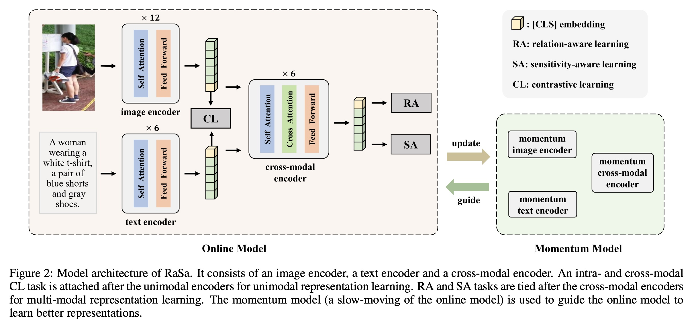
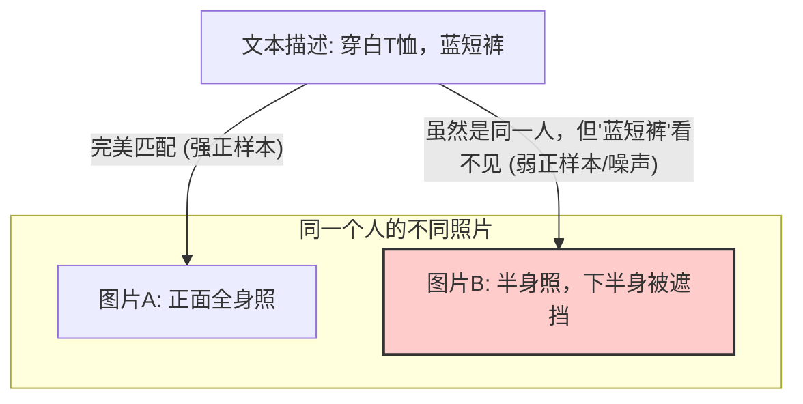
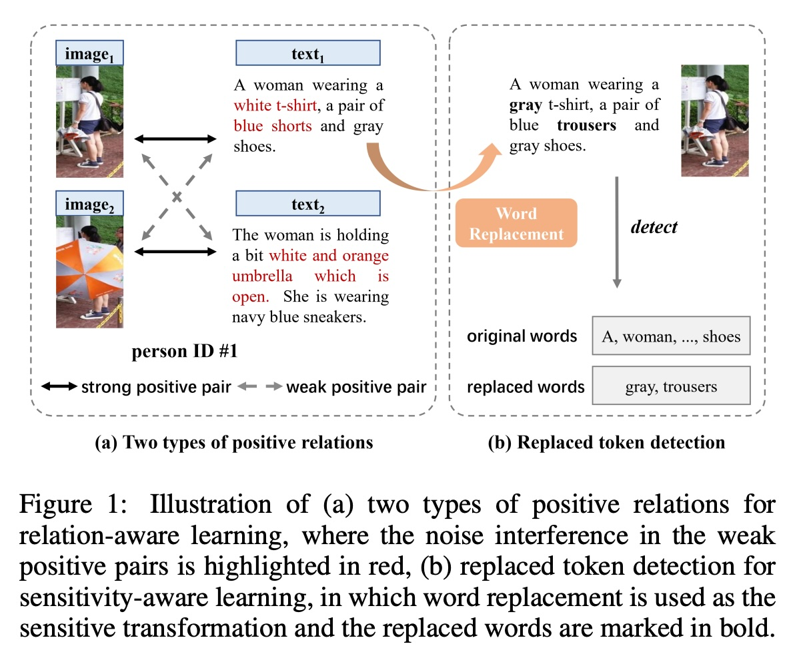
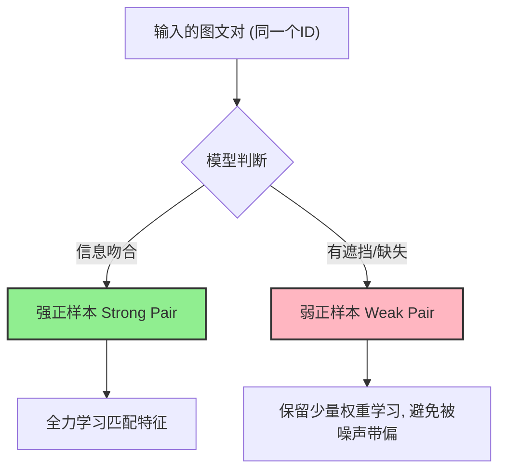
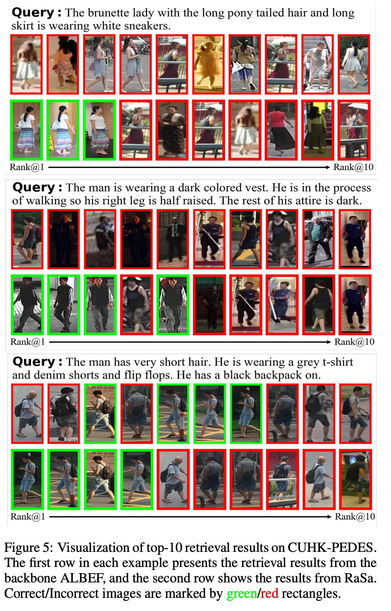
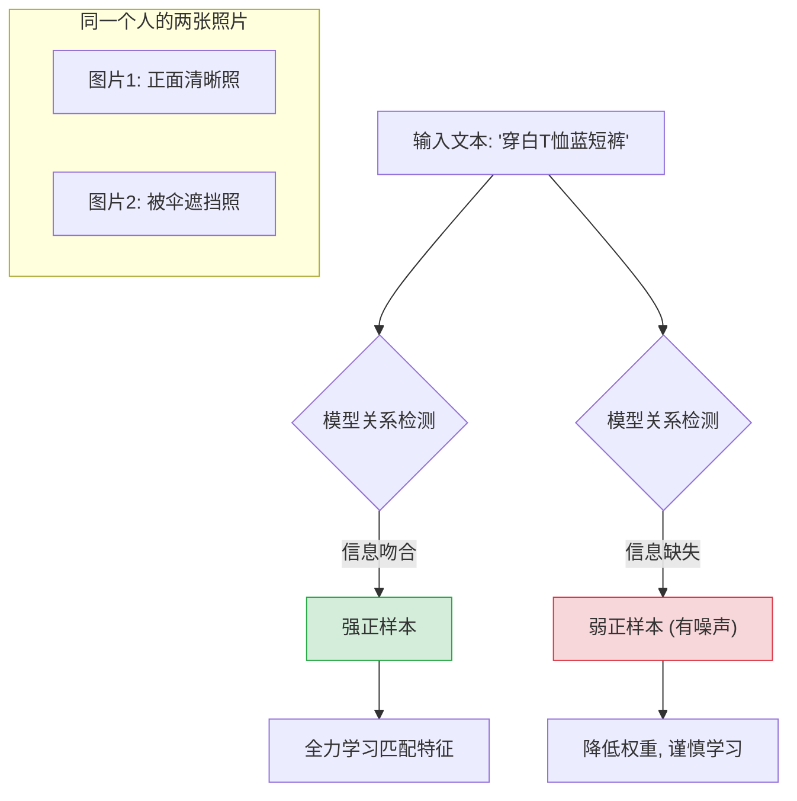
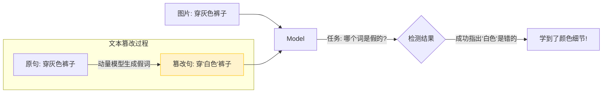

## AI论文解读 | RaSa: Relation and Sensitivity Aware Representation Learning for Text-based Person Search
        
### 作者        
digoal        
        
### 日期        
2025-12-12        
        
### 标签        
PostgreSQL , PolarDB , DuckDB , AI , 论文解读        
        
----        
        
## 背景  
      
https://arxiv.org/pdf/2305.13653        
  
提示:          
```          
读懂《RaSa: Relation and Sensitivity Aware Representation Learning for Text-based Person Search》这篇论文需要提前掌握哪些基础知识, 请使用中文通熟易懂的讲解这些基础知识, 可以引用论文中的图、表或使用Markdown支持的图形(text,mermaid等)增加解释性. 
  
使用中文通熟易懂的解读《RaSa: Relation and Sensitivity Aware Representation Learning for Text-based Person Search》这篇论文, 其中的关键内容请着重讲解, 可以引用论文中的图、表或使用Markdown支持的图形(text,mermaid等)增加解释性. 
  
提取《RaSa: Relation and Sensitivity Aware Representation Learning for Text-based Person Search》这篇论文中的重要术语, 使用中文对这些术语进行通熟易懂的讲解, 可以引用论文中的图、表或使用Markdown支持的图形(text,mermaid等)增加解释性. 
```     
  
## 1 前置知识 
  
为了让你轻松读懂《RaSa: Relation and Sensitivity Aware Representation Learning for Text-based Person Search》这篇论文，我为你整理了一份通俗易懂的基础知识清单。

这篇论文的核心在于解决 **“如何通过文字描述准确地在茫茫人海中找到特定的人”** 。为了实现这一点，它改进了现有的深度学习方法。

以下是你需要掌握的 5 个核心概念：

### 1\. 任务背景：基于文本的行人搜索 (Text-based Person Search)

  * **通俗解释**：
    想象你在监控室，通过输入“一个穿白T恤、蓝色短裤的女人”来搜索视频库中的人，而不是上传一张照片去搜。
  * **难点**：
    这是一个 **跨模态（Cross-modal）** 任务。计算机需要理解两种完全不同的语言：图像（像素）和文本（单词），并把它们对齐。这就好比要把中文和英文翻译成同一种“机器通用的中间语言”才能进行比较 。
  * **与其他任务的区别**：
    它比一般的搜图更难，因为它是 **细粒度（Fine-grained）** 的。搜“狗”很容易，但在几百个穿白衣服的人里找到“穿白T恤且背黑包”的人很难 。

-----

### 2\. 核心模型架构：Transformer 与 跨模态学习

这篇论文的模型架构（如图2所示）基于目前最流行的 Transformer 技术。

  

*(图注：论文中的图2展示了图像编码器、文本编码器和跨模态编码器的结构 )*

  * **你需要知道的基础**：
      * **Image Encoder (图像编码器)** ：把图片切成小方块（Patches），转化成计算机能懂的向量。论文里用了 ViT (Vision Transformer) 。
      * **Text Encoder (文本编码器)** ：把句子切成单词（Tokens），转化成向量。论文里用了 BERT 类的模型 。
      * **Cross-modal Encoder (跨模态编码器)** ：这是关键。它不仅看图、不仅看字，而是通过**Cross-Attention (交叉注意力机制)** 让图片和文字“互相交流”。比如，看到文字里的“背包”，模型会特意去图片里找背部的区域 。

-----

### 3\. 对比学习 (Contrastive Learning) 与 “正负样本”

這是论文提出改进的核心痛点所在。

  * **基础概念**：
    深度学习训练通常通过 **“拉近正样本，推开负样本”** 来学习。
      * **正样本 (Positive Pair)** ：同一人的图片 + 描述这段话。
      * **负样本 (Negative Pair)** ：A的图片 + B的描述。
  * **论文发现的问题 (Relation-Aware Learning 的由来)** ：
    传统的做法认为，只要是同一个人的图片和文字，就是完美的“正样本”。但论文指出这是不对的。
      * **强正样本 (Strong Positive)** ：文字就是看着这张图写的，完全匹配。
      * **弱正样本 (Weak Positive)** ：文字是描述A图的，但B图也是这个人。可是B图里这个人可能被挡住了，或者转过身了，导致文字里的“白色T恤”在B图里根本看不见。这就是**噪声 (Noise)** 。

**我用 Mermaid 图表来解释论文试图解决的逻辑：**



  * **论文的改进 (RA)** ：RaSa模型学会了 **“察言观色”** ，它能判断这一对是“强”还是“弱”，如果太弱（噪声太大），就不要强行匹配，以免学偏了 。

-----

### 4\. 掩码语言建模 (MLM) 与 敏感性感知

论文提出了一个很有趣的观点： **Sensitivity-Aware (SA)** 。

  * **基础概念 (MLM)** ：
    类似英语考试的“完形填空”。把句子里的几个词挖掉（Mask），让模型猜填什么。这能帮模型理解上下文。
  * **论文的进阶概念 (Replaced Token Detection)** ：
    论文认为，模型不仅要能填空，还要能 **“找茬”** 。
    如果把“穿**灰色**裤子”改成“穿**白色** 裤子”，模型能察觉到吗？
      * 传统的模型希望对变化**不敏感 (Invariant)** ，主要学大轮廓。
      * 这篇论文认为模型必须**敏感 (Sensitive)** ，因为在找人的时候，衣服颜色的细微差别就是关键证据 。

*(图注：图1(b) 展示了如何通过替换单词（如把gray trousers换成white shorts）来训练模型的敏感性 )*

  

-----

### 5\. 动量模型 (Momentum Model / EMA)

在论文的图2右侧，你会看到一个 **Momentum Model** 。    

  * **通俗解释**：
    这就好比一个“老师模型”和一个“学生模型”。
      * **学生 (Online Model)** ：正在疯狂刷题（训练），参数变动很快，不稳定。
      * **老师 (Momentum Model)** ：它的参数是学生参数的“滑动平均值”（Exponential Moving Average, EMA）。它变化很慢，更加稳重、准确。
  * **用途**：
    论文利用这个“稳重”的老师模型来生成掩码任务的标签，或者用来做更难的对比任务，防止学生模型“学得太快但学歪了” 。

-----

### 总结：如何串联这些知识读论文？

当你阅读这篇论文时，试着这样理解：

1.  **目标**：模型要通过文字找人（Task: Text-based Person Search）。
2.  **痛点1**：以前的方法不管图片是否模糊/遮挡，只要是同一个人就硬学，导致学到了错误特征（比如把遮挡物当成了人的特征）。
      * **对策**： **Relation-Aware (RA)** -\> 区分“强/弱”关系，去噪 。
3.  **痛点2**：以前的方法对细微变化（如换个词）反应迟钝。
      * **对策**： **Sensitivity-Aware (SA)** -\> 用“找茬”游戏（RTD）逼迫模型关注细节 。
4.  **工具**：用Transformer做骨架，用动量模型（Momentum）来辅助训练。

**接下来如果你想深入了解某个具体模块（比如 RA 是如何计算损失函数的），可以随时告诉我！**
  
## 2 解读论文 
  
这是一篇非常有意思的论文，针对 **“基于文本的行人搜索”** （Text-based Person Search）任务提出了两个非常符合直觉但以前被忽视的改进点。

简单来说，这项任务的目标是： **给你一段文字描述（比如“一个穿白T恤蓝短裤的女士”），让你在成千上万张图片中找到这个人** 。

这篇论文的核心痛点在于：以前的模型学得太“粗糙”了，容易被噪声误导，也容易忽略细节。这篇论文提出的 **RaSa** 方法，就像是给模型装上了“过滤器”和“放大镜”。

以下是对这篇论文的通俗解读：

-----

### 1\. 核心背景：为什么以前的方法不够好？

在训练模型时，我们通常认为：只要图片和文字描述的是**同一个ID（同一个人）** ，它们就是“完美的一对”（正样本），模型应该把它们的特征拉得很近。

但是论文指出了两个大问题：

1.  **并不是所有“正样本”都是完美的（噪声问题）** ：
    有时候虽然是同一个人，但图片里这个人可能被遮挡了，或者只拍到了背面，导致文字里写的“白色T恤”在图片里根本看不见。如果强迫模型把这些看不见特征的图文硬凑在一起，模型就会学乱（Overfitting）。
2.  **模型对细节不够敏感（鲁棒性问题）** ：
    以前的方法为了让模型更稳健，倾向于让模型忽略细微变化（不变性）。但在找人时，细微变化（比如把“灰”鞋子换成“白”鞋子）是非常关键的区分点。模型需要具备“找茬”的能力 。

为了解决这两个问题，作者提出了 **RaSa** (Relation and Sensitivity aware representation learning)。

-----

### 2\. 关键创新一：关系感知学习 (Relation-Aware Learning, RA)

**通俗理解**：模型学会了“察言观色”，懂得区分“高质量匹配”和“低质量匹配”。

以前的方法把所有同一个人的图文对都一视同仁。RaSa 将它们分为两类 ：

  * **强正样本 (Strong Positive)** ：文字完全描述了图片，信息完美对应。
  * **弱正样本 (Weak Positive)** ：虽然是同一个人，但图片有遮挡或缺失信息，存在**噪声**。

#### RA 模块是如何工作的？

论文设计了一个任务来探测这种关系，主要包含两个部分：

1.  **正关系检测 (Positive Relation Detection, PRD)** ：直接训练一个分类器，让模型明确判断这一对图文是“强”还是“弱” 。
2.  **概率图文匹配 (p-ITM)** ：在训练匹配时，给“弱正样本”更低的权重或概率，减少噪声对模型的误导，防止过拟合 。




> **引用图表解释**：论文中的 **Figure 1 (a)** 非常直观地展示了这一点。`image1` 和 `text1` 是强匹配（Strong）；但 `image2`（可能有遮挡）和 `text1` 虽然是同一个人，但由于遮挡导致文字里的 "white t-shirt" 在图里看不见，这就是**弱匹配（Weak）** ，如果不加区分地学习，红色的噪声部分就会干扰模型 。

  

-----

### 3\. 关键创新二：敏感性感知学习 (Sensitivity-Aware Learning, SA)

**通俗理解**：训练模型玩“找茬”游戏，让它对颜色、属性的细微篡改极其敏感。

为了让模型对细节更敏感，作者设计了一个**被替换Token检测 (Replaced Token Detection, RTD)** 任务。

#### SA 模块是如何工作的？

1.  **篡改文本**：模型会故意把原本描述中的某个词换掉。比如把“**灰色**裤子”改成“**白色**裤子” 。
2.  **生成假词**：这个“假词”不是瞎编的，而是利用一个**动量模型 (Momentum Model)** 生成的。动量模型是主模型的一个更稳定、更新更慢的版本，它生成的假词更具迷惑性（更难分辨） 。
3.  **让模型找茬**：模型需要看着图片和被篡改的文字，指出哪一个词被换过了。如果模型能发现“白色”是错的（因为图里是灰色），说明它真正看懂了细节 。

> **引用图表解释**：论文中的 **Figure 1 (b)** 展示了这个过程。
>
>   * 原始词：`gray trousers` (灰色裤子)
>   * 替换词：`white shorts` (白色短裤)
>     * 模型任务：结合图片信息，必须检测出 "white" 和 "shorts" 是被篡改过的 。

  

-----

### 4\. 模型整体架构 (Model Architecture)

RaSa 的架构基于 ALBEF（一种强大的视觉-语言预训练模型）。

  * **双流编码器**：图像和文本先分别通过 Image Encoder 和 Text Encoder 提取特征。
  * **跨模态融合**：然后通过 Cross-modal Encoder 进行深度的交互（Cross-Attention） 。
  * **动量模型 (Momentum Model)** ：右侧有一个与左侧结构相同但参数更新缓慢的“老师模型”，用来辅助生成上述的“假词”以及提供更稳定的特征目标 。

-----

### 5\. 实验结果 (Results)

RaSa 的效果提升非常显著，证明了区分“强弱关系”和“敏感性训练”的有效性。

  * **数据集表现**：
      * 在 **CUHK-PEDES** 数据集上，Rank@1（首选命中率）达到了 **76.51%**，比之前的最佳方法提高了 **6.94%** 。
      * 在 **RSTPReid** 数据集上，更是惊人地提高了 **15.35%** 。
  * **可视化效果**：
    论文附录中的可视化图（Figure 5）显示，RaSa 能够更精准地排除那些“看起来像但细节不对”的干扰项 。    

### 总结

**RaSa 这篇论文到底讲了什么？**

它告诉我们，在教计算机通过文字找人时：

1.  **不要盲目自信**：要承认有些同ID的图文是不匹配的（去噪，对应 RA 模块）。
2.  **要关注细节**：通过故意改错词让模型去纠错，从而逼迫模型学会关注衣服颜色、款式等细微特征（细粒度感知，对应 SA 模块）。

这两个策略结合，使得 RaSa 在基于文本的行人搜索任务上取得了当时的 SOTA（State-Of-The-Art）效果。
  
## 3 术语 
  
这份文档是关于一篇名为《RaSa: Relation and Sensitivity Aware Representation Learning for Text-based Person Search》的计算机视觉论文。为了帮你透彻理解，我提取了论文中最重要的核心术语，并用通俗的语言配合图表进行讲解。

### 1\. 基础任务相关术语

#### **Text-based Person Search (基于文本的行人搜索)**

  * **通俗解释**：
    这是论文要解决的核心任务。想象你在监控室，手里没有嫌疑人的照片，只有一段目击者的描述（比如“穿白T恤、蓝短裤的短发女士”）。你需要让计算机根据这段**文字**，在成千上万张路人**照片**中，准确找出那个人 。
  * **难点**：文字和图片是两种完全不同的“语言”，而且人的衣服、姿态、遮挡情况非常复杂。

-----

### 2\. 核心痛点与解决方案：RaSa

**RaSa** 是论文提出的方法名称，全称是 **R**elation **a**nd **S**ensitivity **a**ware（关系与敏感性感知）。它由两个关键模块组成，分别解决两个大问题。

#### **模块一：Relation-Aware Learning (RA, 关系感知学习)**

  * **解决什么问题？** 解决“噪声”问题。以前的方法认为，只要文字和图片属于同一个人，就是完美的一对（正样本）。但实际上，有些图片可能只拍到了背影或被遮挡，导致文字里描述的特征在图里根本看不见，这种“瞎学”会误导模型 。

  * **关键术语细分**：

      * **Strong Positive Pair (强正样本/强关联)**

          * **解释**：完美的“图文对”。文字就是看着这张图写的，描述得严丝合缝。比如文字说“白T恤”，图里就能清晰看到白T恤 。

      * **Weak Positive Pair (弱正样本/弱关联)**

          * **解释**：虽然图和文是**同一个人**，但是图里有干扰。比如文字描述“白T恤”，但这张图里人侧着身或者被柱子挡住了，根本看不见T恤。这就是“噪声” 。

      * **Positive Relation Detection (PRD, 正关系检测)**

          * **解释**：这是 RA 里的一个子任务。模型通过学习，能够自己**判断**眼前这一对图文是“强正样本”还是“弱正样本”。就像给模型装了一个“质量检测仪” 。

      * **Probabilistic Image-Text Matching (p-ITM, 概率图文匹配)**

          * **解释**：传统的匹配是非黑即白的（要么匹配，要么不匹配）。p-ITM 引入了**概率**。如果是“弱正样本”，模型就给它一个较低的权重（比如只信它10%），避免被图里的噪声带偏 。

**[Mermaid 图解：RA 的工作逻辑]**



-----

#### **模块二：Sensitivity-Aware Learning (SA, 敏感性感知学习)**

  * **解决什么问题？** 解决“不敏感”问题。在找人时，细节决定成败。如果模型对“灰色裤子”和“白色裤子”的区别视而不见，就很容易找错人。SA 就是要训练模型对这种细微变化极其**敏感** 。

  * **关键术语细分**：

      * **Replaced Token Detection (RTD, 替换词检测)**

          * **解释**：这是 SA 的核心玩法，类似于“大家来找茬”。系统会故意把描述文本里的一个词改掉（比如把“灰”改成“白”），然后让模型看着原图，指出**哪一个词被篡改了**。如果模型能指出来，说明它真正看懂了图片里的细节 。

      * **Sensitive Transformation (敏感变换)**

          * **解释**：指那些一旦改变，含义就完全不同的操作。在这里特指“单词替换”。比如“戴帽子”变成“没戴帽子”，这对找人来说是致命的区别，模型必须对这种变换保持敏感 。

      * **Momentum Model (动量模型)**

          * **解释**：这好比是模型的一个“稳重版分身”。
              * **在线模型 (Online Model)** ：正在疯狂刷题的学生，参数变动快。
              * **动量模型 (Momentum Model)** ：是学生参数的“滑动平均值”，像一个经验丰富的老师，变化慢但更稳定 。
          * **作用**：在 SA 任务中，论文利用这个“稳重老师”来生成那些用来替换的假词。老师出题（生成假词）比学生自己瞎猜更具迷惑性，能更好地锻炼学生模型 。

**[Mermaid 图解：SA (敏感性感知) 的“找茬”流程]**



-----

### 3\. 模型架构术语

#### **Cross-modal Encoder (跨模态编码器)**

  * **通俗解释**：这是模型的大脑中枢。
      * **Image Encoder** 负责看图。
      * **Text Encoder** 负责读字。
      * **Cross-modal Encoder** 负责把图和字放在一起“搅拌”。它让文字里的每个词去图片里找对应的区域（比如“鞋子”这个词会去关注图里的脚部区域）。RaSa 的核心创新 RA 和 SA 都是作用在这个层面的 。

#### **Masked Language Modeling (MLM, 掩码语言建模)**

  * **通俗解释**：类似于英语考试里的“完形填空”。把句子里的某个词挖掉（Mask），让模型根据上下文填空。这是预训练模型（如BERT）的经典能力。在这篇论文里，MLM 被用来生成 SA 任务中用于替换的“假词” 。

-----

### 总结

这篇论文通过 **RaSa** 方法，让计算机在看图找人时变得更聪明：

1.  **Relation-Aware (RA)** ：让它懂得**区分优劣**，不被遮挡严重的烂图误导。
2.  **Sensitivity-Aware (SA)** ：让它懂得**关注细节**，通过“找茬游戏”学会分辨衣服颜色、款式等细微差别。
  
## 参考        
         
https://arxiv.org/pdf/2305.13653    
        
<b> 以上内容基于DeepSeek、Qwen、Gemini及诸多AI生成, 轻微人工调整, 感谢杭州深度求索人工智能、阿里云、Google等公司. </b>        
        
<b> AI 生成的内容请自行辨别正确性, 当然也多了些许踩坑的乐趣, 毕竟冒险是每个男人的天性.  </b>        
  
    
#### [PolarDB 学习图谱](https://www.aliyun.com/database/openpolardb/activity "8642f60e04ed0c814bf9cb9677976bd4")
  
  
#### [PostgreSQL 解决方案集合](../201706/20170601_02.md "40cff096e9ed7122c512b35d8561d9c8")
  
  
#### [德哥 / digoal's Github - 公益是一辈子的事.](https://github.com/digoal/blog/blob/master/README.md "22709685feb7cab07d30f30387f0a9ae")
  
  
#### [About 德哥](https://github.com/digoal/blog/blob/master/me/readme.md "a37735981e7704886ffd590565582dd0")
  
  

  
