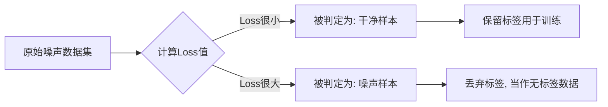
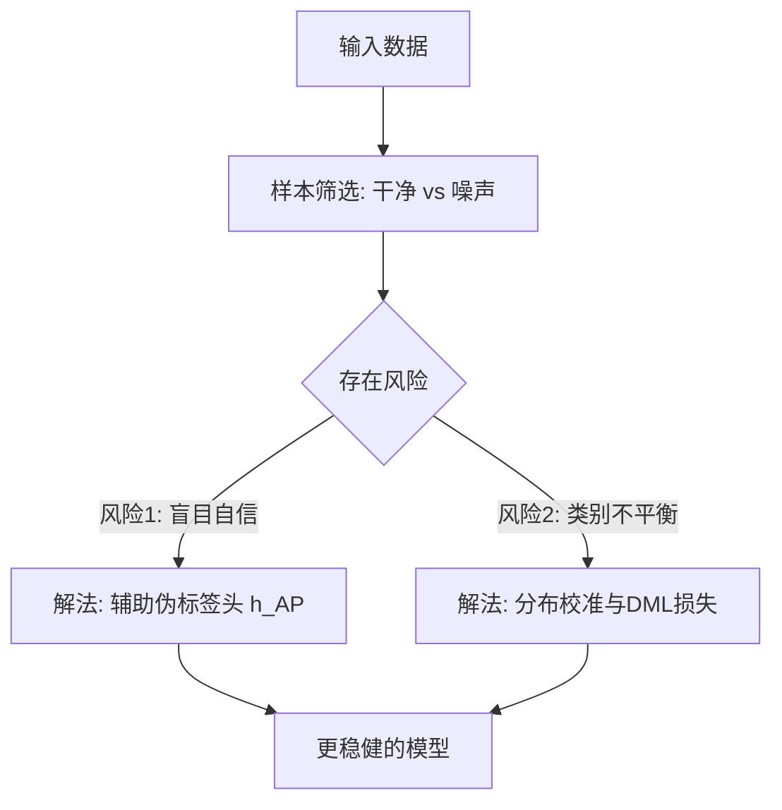
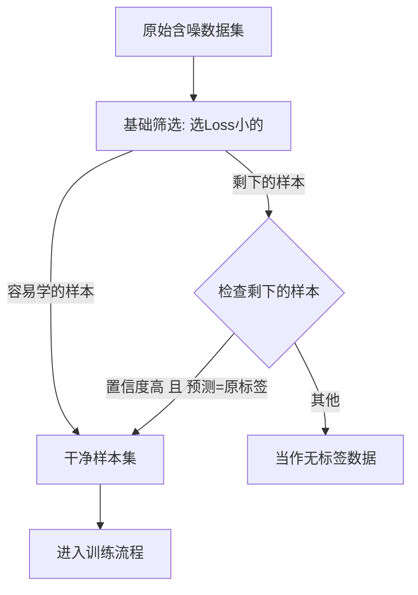
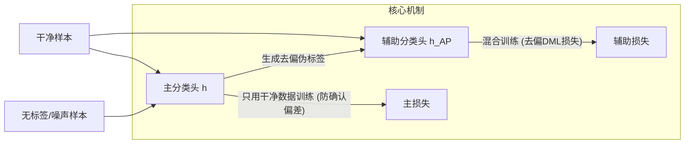
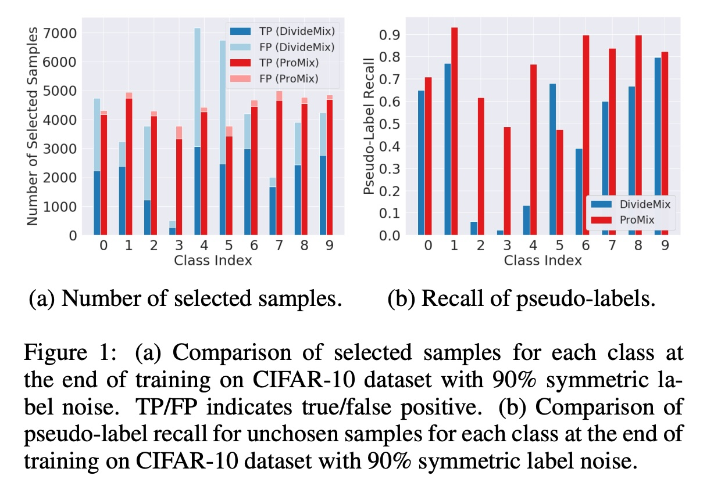
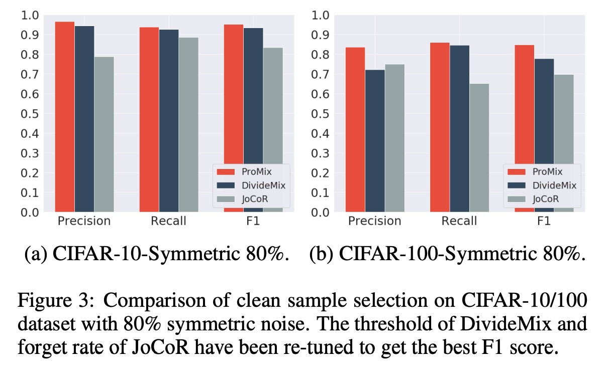
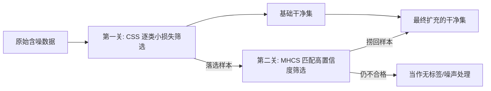
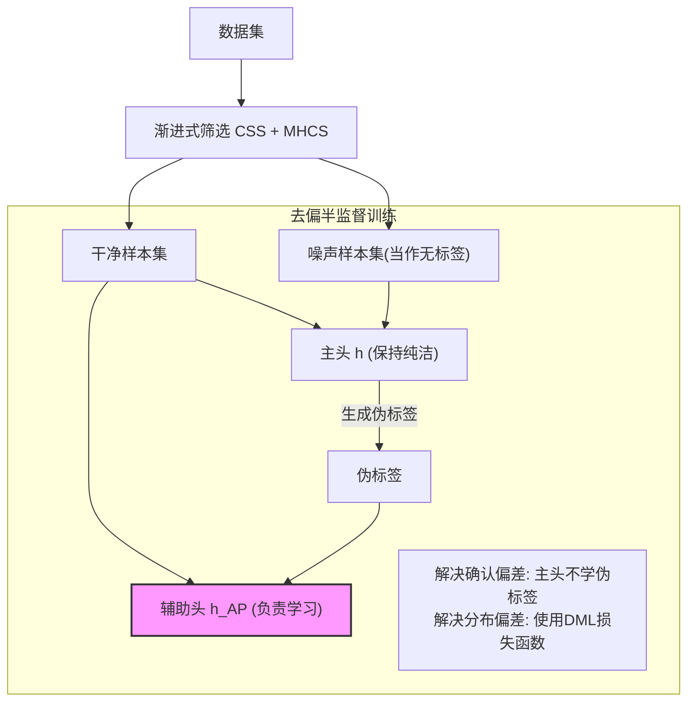

## AI论文解读 | ProMix: Combating Label Noise via Maximizing Clean Sample Utility
        
### 作者        
digoal        
        
### 日期        
2025-12-12        
        
### 标签        
PostgreSQL , PolarDB , DuckDB , AI , 论文解读        
        
----        
        
## 背景  
      
https://arxiv.org/pdf/2207.10276        
  
提示:          
```          
读懂《ProMix: Combating Label Noise via Maximizing Clean Sample Utility》这篇论文需要提前掌握哪些基础知识, 请使用中文通熟易懂的讲解这些基础知识, 可以引用论文中的图、表或使用Markdown支持的图形(text,mermaid等)增加解释性. 
  
使用中文通熟易懂的解读《ProMix: Combating Label Noise via Maximizing Clean Sample Utility》这篇论文, 其中的关键内容请着重讲解, 可以引用论文中的图、表或使用Markdown支持的图形(text,mermaid等)增加解释性. 
  
提取《ProMix: Combating Label Noise via Maximizing Clean Sample Utility》这篇论文中的重要术语, 使用中文对这些术语进行通熟易懂的讲解, 可以引用论文中的图、表或使用Markdown支持的图形(text,mermaid等)增加解释性. 
```     
  
## 1 前置知识 
  
要读懂《ProMix: Combating Label Noise via Maximizing Clean Sample Utility》这篇论文，你需要掌握以下四个核心领域的“背景知识”。这篇论文主要解决的是**深度学习模型在训练数据标签有错误（噪声）时，如何还能训练得很好**的问题。

以下是通俗易懂的基础知识讲解，配合了论文中的引用和可视化图表：

-----

### 1\. 标签噪声学习 (Learning with Noisy Labels, LNL)

**这是什么？**
在理想情况下，训练数据的标签都是对的（比如图片是猫，标签就是“猫”）。但在现实中，获取大量完美标注的数据非常贵 。我们常用网络爬虫或众包平台获取数据，这难免会包含错误标签（比如图片是猫，标签却写成了“狗”）。

**核心挑战：**
深度神经网络（DNN）非常强大，强大到即使标签是乱写的，它也能强行“记住”这些错误。如果直接用带噪声的数据训练，模型就会学偏，导致在测试时表现很差 。

**论文中的关联：**
ProMix 的目标就是在一个充满“噪声”的数据集中，尽可能多地挖掘出“干净”的样本来训练模型 。

-----

### 2\. “小损失”假设与记忆效应 (Small-Loss Criterion & Memorization Effect)

**这是什么？**
这是目前解决噪声标签问题最常用的“黄金法则”。
科学家发现，深度学习模型有一个有趣的**记忆效应 (Memorization Effect)** ：

  * **早期：** 模型会先学会简单、有规律的模式（即**干净样本**）。
  * **后期：** 模型为了降低误差，开始强行记忆那些没有规律的错误数据（即**噪声样本**）。

**如何利用？**
因为干净样本先被学会，所以它们在训练早期的**损失值 (Loss)** 比较小。

  * **小损失 (Small Loss) = 可能是干净样本**
  * **大损失 (Large Loss) = 可能是噪声样本**

**图解：**
我们可以通过设定一个阈值，把数据分成两堆：



**论文中的改进：**
传统的“小损失选择” (Small-loss Selection) 会漏掉很多难学的干净样本 。ProMix 提出了一种 **MHCS (Matched High Confidence Selection)** 方法，不仅看损失小不小，还要看模型对样本的“自信程度”以及预测是否和原标签匹配，从而捞回更多被误杀的干净样本 。

> **论文原图引用：** 如下图 (a) 所示，ProMix (红色条) 比传统方法 (蓝色条 DivideMix) 选出了更多的真实样本 (TP)，这就是基于上述理论的改进 。

-----

### 3\. 半监督学习 (Semi-Supervised Learning, SSL)

**这是什么？**
当你把数据分成“干净”和“噪声”两部分后：

  * **干净集**：有标签，照常训练。
  * **噪声集**：既然标签是错的，我们干脆把标签撕掉，把它当成**无标签数据 (Unlabeled Data)** 。

这时候就需要用到**半监督学习**。它的核心思想是：利用有标签数据训练一个基础模型，然后让这个模型去“猜测”无标签数据的标签（这叫 **伪标签 Pseudo-Labeling**），再把猜测结果拿来继续训练 。

**论文中的关联：**
ProMix 沿用了 **DivideMix**  的框架，即：

1.  筛选样本。
2.  把“干净样本”作为 Labeled Set。
3.  把“噪声样本”作为 Unlabeled Set。
4.  使用 SSL 技术（如 MixMatch）混合训练两者 。

-----

### 4\. 确认偏差与分布偏差 (Confirmation Bias & Distribution Bias)

**这是什么？**
这是ProMix为了改进现有方法而着重解决的两个“副作用”。

  * **确认偏差 (Confirmation Bias)：** 也就是“盲目自信”或“左脚踩右脚上天”。如果模型一开始猜错了（伪标签错了），它拿这个错的标签去训练，就会越学越错，导致错误累积无法修正 。

      * *ProMix的解法：* 搞了两个头（Head），一个主头生成伪标签，另一个辅助头 ( $h_{AP}$ ) 专门用来训练，把“生成”和“使用”解耦 。

  * **分布偏差 (Distribution Bias)：** 也就是“长尾问题”或“类别不平衡”。筛选出来的干净样本可能很不均匀（比如“猫”的干净样本选出了1000张，“老虎”只选出了10张）。模型就会偏向“猫”，导致对“老虎”识别很差 。

      * *ProMix的解法：* 引入了一个去偏的损失函数 (Debiased Margin-based Loss) 和伪标签校准，动态平衡各类别的影响力 。

**图解 ProMix 的去偏流程：**



> **论文原图引用：** 论文图 2 展示了这个完整架构。你可以看到数据被分成了 Labeled Set 和 Unlabeled Set，然后通过 $h$ (主头) 和 $h_{AP}$ (辅助头) 进行去偏训练 。

  

### 总结

要读懂这篇论文，你只需要心里装着这三个步骤：

1.  **筛选 (Selection)：** 利用“小损失”原理把脏数据挑出来，ProMix 想办法挑得更多更准。
2.  **利用 (Utilization)：** 脏数据不丢弃，作为无标签数据用半监督学习 (SSL) 方法利用起来。
3.  **纠偏 (De-biasing)：** 在利用过程中，防止模型因为“盲目自信”和“类别不平衡”而走火入魔。
  
## 2 解读论文 
  
这篇论文《ProMix: Combating Label Noise via Maximizing Clean Sample Utility》的核心思想非常直观： **在处理带有错误标签（噪声）的数据时，不要仅仅满足于找到“最干净”的一小部分样本，而是要尽可能地把所有“可能干净”的样本都挖掘出来，并利用这些样本来训练出一个不偏科的模型。**

以下是为您整理的通俗易懂的解读：

### 1\. 核心背景：为什么要做这个？

在深度学习中，数据通常是通过网络爬虫或人工标注获取的，难免会有标错的情况（比如把猫标成狗），这就是**标签噪声（Label Noise）** 。

  * **旧方法的局限：** 以前的方法（如 DivideMix）通常比较保守。它们为了保证选出来的样本绝对干净，只敢选那些模型觉得“最简单、最可信”的样本 。
  * **后果：** 这样会导致大量的“虽然有点难，但其实是标对了”的样本被扔掉（漏选）。样本少了，模型学到的东西就不全面，效果自然上不去 。
  * **ProMix 的目标：** **最大化干净样本的利用率**（Maximize Clean Sample Utility）。不仅要选得准，还要选得多 。

-----

### 2\. ProMix 的两大绝招

ProMix 的框架主要由两个关键步骤组成： **渐进式样本筛选** 和 **去偏半监督训练**。

#### 第一招：渐进式样本筛选 (Progressive Selection)

**—— 像淘金一样，先把大金块筛出来，再把小金砂也捡回来。**

传统的筛选只看“损失值小不小”（Loss小说明模型学得轻松，通常是干净的）。ProMix在此基础上加了一步：

1.  **基础筛选 (Base Selection - CSS)：** 利用“小损失原则”，按类别选出一批最容易学的样本作为“地基” 。
2.  **扩展筛选 (Matched High Confidence Selection - MHCS)：** 这是ProMix的创新点。它会去检查那些被剩下的样本，如果模型对某个样本的**预测置信度很高**，而且**预测的类别和它原本的标签一致**（Matched），就把通过这层考验的样本也捞回来，加入干净样本集 。

**图解筛选流程：**



> 论文实验表明，这种方法能选出更多的干净样本（Recall高），同时误选的噪声样本很少 。

-----

### 3\. 第二招：去偏半监督训练 (Debiased Semi-Supervised Learning)

**—— 防止模型因为“偏科”和“盲目自信”走火入魔。**

选出了更多样本后，直接训练会有副作用。ProMix 设计了一套机制来消除偏差。

#### 问题 A：确认偏差 (Confirmation Bias)

**现象：** 模型如果一开始猜错了某个无标签数据的类别（伪标签错了），它后面就会拿这个错的标签训练自己，导致越错越离谱，就像“左脚踩右脚上天” 。
**解法：** **辅助伪标签头 ( Auxiliary Pseudo Head, $h_{AP}$ )** 。

  * ProMix 设置了两个“头”（分类器）：主头 $h$ 和 辅助头 $h_{AP}$ 。
  * **主头 $h$**：只用确认干净的样本训练，负责给无标签数据生成“伪标签” 。
  * **辅助头 $h_{AP}$**：利用主头生成的伪标签来训练，负责挖掘无标签数据的价值 。
  * **原理：** 把“生成伪标签”和“使用伪标签”分开，避免模型自己骗自己 。

#### 问题 B：分布偏差 (Distribution Bias)

**现象：** 筛选出来的干净样本往往是不平衡的。比如“狗”很容易识别，选出来的多；“狼”很难识别，选出来的少。模型就会倾向于把什么都预测成“狗” 。
**解法：** **去偏损失 (Debiased Loss) 与 校准**。

  * 引入了去偏的 Margin-based Loss ( $l_{DML}$ ) 。
  * 根据每个类别选出了多少样本，动态调整模型对该类别的“偏好”，给样本少的类别更多机会 。

**图解训练架构：**



*注：该图对应论文 Figure 2 的简化逻辑 。*

  

-----

### 4\. 实验效果

论文在多个数据集上进行了验证，结果非常显著：

  * **CIFAR-10/100 (人工模拟噪声)：** 在各种噪声比例下，ProMix 都超过了之前的 SOTA 方法（如 DivideMix）。特别是噪声很大时（90%的标签都是错的），ProMix 依然很稳 。
  * **CIFAR-N (真实世界噪声)：** 这是真实的人类标注错误数据。ProMix 在各种设置下均取得了最好成绩 。
  * **干净样本挖掘能力：** 如下图表数据所示，ProMix 找回的干净样本（Recall）比对比方法高很多，同时保持了很高的准确率（Precision）。

| 方法 | Precision (查准率) | Recall (查全率) | 说明 |
| :--- | :--- | :--- | :--- |
| DivideMix | 高 | 低 | 比较保守，漏掉了很多有用数据 |
| **ProMix** | **高** | **高** | **既准又全，最大化利用了数据** |

*(基于论文 Figure 1 和 Figure 3 的总结 )*

  

  

### 总结

ProMix 这篇论文告诉我们：在面对带有噪声的数据时， **“敢于信任”** （通过高置信度匹配捞回样本）和 **“小心求证”** （通过双头架构和去偏损失防止跑偏）是提升模型性能的关键。它成功地将被其他人抛弃的“难样本”变废为宝，从而取得了更好的效果 。
  
## 3 术语 
  
为了帮助您深入理解这篇论文，我为您提取了文中的**核心术语**，并按照它们在解决问题过程中的逻辑关系进行了分类讲解。

### 一、 核心问题与理念

#### 1\. 噪声标签学习 (Learning with Noisy Labels, LNL)

**通俗解释：**
这就是这篇论文要解决的根本问题。通常我们训练AI模型，假设给的数据标签都是对的（比如图片是猫，标签就是“猫”）。但现实中，很多数据标签是标错的（比如把猫标成了“狗”），这就叫“噪声标签” 。LNL 的目标就是： **在一堆标错的数据里，还能训练出聪明的模型**。

#### 2\. 干净样本利用率 (Clean Sample Utility)

**通俗解释：**
这是 ProMix 的核心哲学。

  * **以前的方法：** 很保守，为了怕选错，只挑那些“绝对干净”的样本。结果是很多“虽然难一点但其实是干净”的数据被浪费了 。
  * **ProMix 的观点：** 数据很宝贵，我们不仅要找得准，还要找得全。**最大化利用每一个可能的干净样本**，才能让模型学得更好 。

-----

### 二、 怎么把干净样本找出来？（筛选机制）

论文提出了一套**渐进式筛选 (Progressive Selection)** 机制，像漏斗一样分两步走：

#### 3\. 逐类小损失筛选 (Class-wise Small-loss Selection, CSS)

**通俗解释：**
这是筛选的“第一关”，用来打地基。

  * **原理：** 深度学习有个特点，它会先学会简单的（干净的），后学会复杂的（噪声）。所以训练初期，**损失值（Loss）小的往往是干净样本** 。
  * **为什么是“逐类”？** 因为有些类别简单（比如分辨“圆圈”），有些难（分辨“某种狗的品种”）。如果混在一起比Loss，难的类别会吃亏。所以 ProMix **在每一个类别内部单独挑Loss小的**，保证各类别都有样本被选上 。

#### 4\. 匹配高置信度筛选 (Matched High Confidence Selection, MHCS)

**通俗解释：**
这是 ProMix 的“独门绝技”，也是筛选的“第二关”。
很多干净样本虽然 Loss 稍微大点（可能是因为图片比较模糊或难认），但在第一关被刷掉了。MHCS 负责把它们捞回来。

  * **怎么捞？** 只要满足两个条件：
    1.  **自信：** 模型对这张图的预测非常有把握（置信度高）。
    2.  **吻合：** 模型预测的类别，刚好和原始那个“可能标错”的标签**一模一样**。
  * **逻辑：** 如果模型觉得自己看懂了，而且看懂的结果和原标签一样，那说明原标签大概率是对的，这个样本是干净的 。

**图解筛选流程：**



*(基于论文 3.1 节内容绘制 )*

-----

### 三、 怎么防止模型练偏了？（去偏训练）

样本选好了，接下来用半监督学习（SSL）来训练。但因为样本本身可能有偏差，ProMix 引入了特殊的“纠偏”设计。

#### 5\. 确认偏差 (Confirmation Bias)

**通俗解释：**
这就是“盲目自信”的陷阱。
在半监督学习中，模型会给无标签数据打“伪标签”（自己猜个标签）。如果一开始猜错了，模型拿着错的标签去学，就会越学越错，觉得自己特对，最后彻底跑偏 。

#### 6\. 辅助伪标签头 ( Auxiliary Pseudo Head, $h_{AP}$ )

**通俗解释：**
这是为了解决“确认偏差”设计的**双头机制**。
想象模型有两个大脑（Head）：

  * **主大脑 ( $h$ )：** 只看那些确定的“真题”（干净样本）。它负责给无标签数据出“参考答案”（生成伪标签）。
  * **副大脑 ( $h_{AP}$ )：** 既看“真题”，也看主大脑给出的“参考答案”。它负责冒险去学那些无标签数据。
  * **妙处：** **主大脑永远不看那些可能错的伪标签**，保持纯洁和客观，这样它给出的参考答案就不会越来越离谱，从而打破恶性循环 。

#### 7\. 分布偏差 (Distribution Bias)

**通俗解释：**
这就是“偏科”问题。
即便我们很努力筛选，选出来的干净样本可能还是不均匀。比如“猫”选了1000张，“鸟”只选了50张。模型就会自然地偏向“猫”，觉得啥都是猫 。

#### 8\. 去偏间隔损失 (Debiased Margin-based Loss, DML)

**通俗解释：**
这是解决“偏科”的数学工具。
它通过计算每个类别样本的多少，给少样本的类别“加分”（增加 Margin）。简单说，就是**强迫模型在那些样本少的类别上学得更扎实**，以此来平衡模型对各类别的关注度 。

-----

### 四、 其他实用技术

#### 9\. 协议标签猜测 (Label Guessing by Agreement, LGA)

**通俗解释：**
这是一种更激进的“修正”手段。
到了训练后期，ProMix 会训练两个独立的网络（Peer Networks）。对于那些本来标签是错的（噪声）样本，如果**两个网络都非常自信地预测它是同一个新类别**，我们就把这个样本的标签改过来，当作干净样本用。这就相当于“两个专家会诊，意见一致就确诊” 。

### 总结图：ProMix 的工作原理



*(基于论文 Figure 2 架构绘制 )*
  
  
  
## 参考        
         
https://arxiv.org/pdf/2207.10276    
        
<b> 以上内容基于DeepSeek、Qwen、Gemini及诸多AI生成, 轻微人工调整, 感谢杭州深度求索人工智能、阿里云、Google等公司. </b>        
        
<b> AI 生成的内容请自行辨别正确性, 当然也多了些许踩坑的乐趣, 毕竟冒险是每个男人的天性.  </b>        
  
    
#### [PolarDB 学习图谱](https://www.aliyun.com/database/openpolardb/activity "8642f60e04ed0c814bf9cb9677976bd4")
  
  
#### [PostgreSQL 解决方案集合](../201706/20170601_02.md "40cff096e9ed7122c512b35d8561d9c8")
  
  
#### [德哥 / digoal's Github - 公益是一辈子的事.](https://github.com/digoal/blog/blob/master/README.md "22709685feb7cab07d30f30387f0a9ae")
  
  
#### [About 德哥](https://github.com/digoal/blog/blob/master/me/readme.md "a37735981e7704886ffd590565582dd0")
  
  

  
