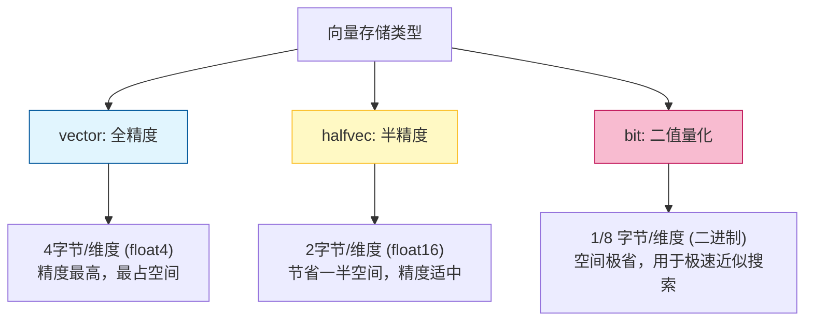
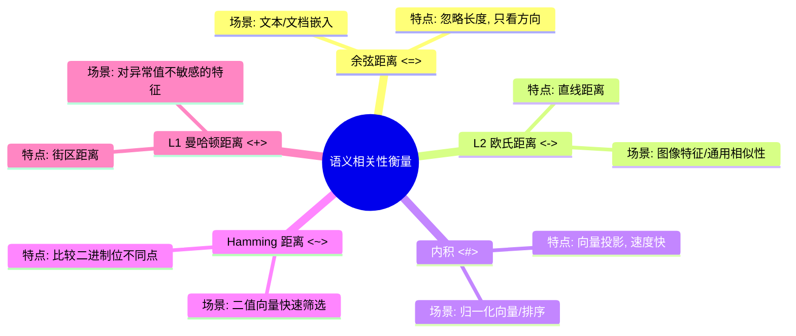
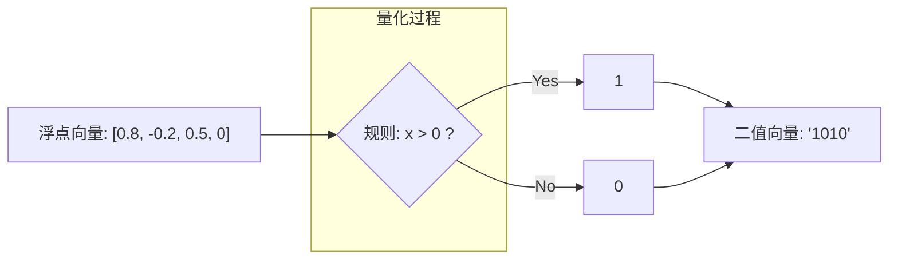
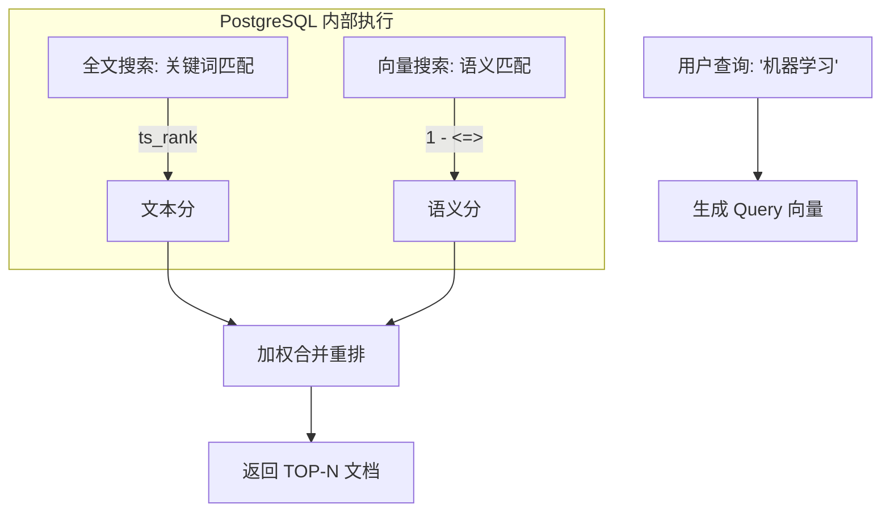
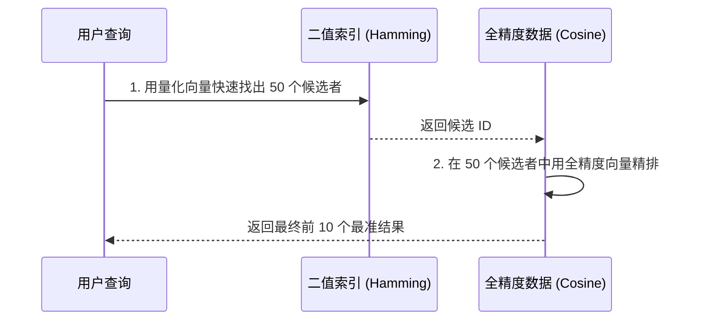

## 大学生数据库实践课: 11.1 向量类型基础      
                    
### 作者                    
digoal                    
                    
### 日期                    
2025-12-11                    
                    
### 标签                    
PostgreSQL , DuckDB , 语义搜索 , 向量搜索 , 关键词检索 , 全文检索 , 标量检索 , 混合搜索 , 多模态搜索 , 重排序 , embedding , document split , ORC , 大模型 , 多模态大模型 , Dify , 压力测试 , 索引优化 , 倒排向量索引 , Ivfflat , 图向量索引 , HNSW , DiskANN , 量化 , rabitq , sbq , 二值量化 , bm25 , 相关性 , 相似性 , 召回率 , pgbench , 数据集 , ann-benchmarks , 图搜索 , PGQ , 递归 , 深度优先 , 广度优先 , 最短路径 , N度关系 , LLM , Ollama                    
                    
----                    
                    
## 背景                    
      
pgvector deepwiki:      
  
https://deepwiki.com/search/-1_6f4fbd27-8f72-4981-80b5-7e2359bb1306?mode=fast  
      
面向大学生通俗讲解以下内容, 并给出示例:      
1、介绍全精度、半精度、二值量化向量类型;   
2、介绍语义相关性;   
3、介绍每种类型对应的向量距离算法;   
4、给出示例;   
    
-----      
  
# pgvector向量类型详解  
  
pgvector支持三种主要的向量类型，每种类型在存储空间和精度之间有不同的平衡。  
  
## 1. 全精度向量 (vector)  
  
全精度向量使用单精度浮点数存储，每个元素占用4字节，是最常用的向量类型。    
  
```sql  
-- 创建全精度向量表  
CREATE TABLE items (id bigserial PRIMARY KEY, embedding vector(3));  
  
-- 插入数据  
INSERT INTO items (embedding) VALUES ('[1,2,3]'), ('[4,5,6]');  
  
-- 查询示例  
SELECT * FROM items ORDER BY embedding <-> '[3,1,2]' LIMIT 5;  
```  
  
**特点：**  
- 存储空间：`4 * 维度数 + 8` 字节  
- 精度高，适合需要精确计算的场景  
- 支持最多16,000维度  
  
## 2. 半精度向量 (halfvec)  
  
半精度向量使用16位浮点数存储，每个元素只占用2字节，可以节省一半的存储空间。    
  
```sql  
-- 创建半精度向量表  
CREATE TABLE items (id bigserial PRIMARY KEY, embedding halfvec(3));  
  
-- 插入数据  
INSERT INTO items (embedding) VALUES ('[1,2,3]'), ('[4,5,6]');  
  
-- 类型转换示例  
SELECT '[1,2,3]'::vector::halfvec;  -- 全精度转半精度  
SELECT '[1,2,3]'::halfvec::vector;  -- 半精度转全精度  
```  
  
**特点：**  
- 存储空间：`2 * 维度数 + 8` 字节  
- 精度较低，但存储效率高  
- 支持最多16,000维度  
- 适合存储空间敏感的应用  
  
## 3. 二值量化向量 (bit)  
  
二值量化将浮点向量转换为二进制向量，正值变为1，负值和零变为0。    
  
```sql  
-- 创建二值向量表  
CREATE TABLE items (id bigserial PRIMARY KEY, embedding bit(3));  
  
-- 直接插入二值数据  
INSERT INTO items (embedding) VALUES ('101'), ('110');  
  
-- 从浮点向量量化  
SELECT binary_quantize('[1,-2,3,-4,0]'::vector);  -- 结果: 10100  
  
-- 使用Hamming距离查询  
SELECT * FROM items ORDER BY embedding <~> '101' LIMIT 5;  
```  
  
**量化过程示例：**  
```sql  
-- 半精度向量量化  
SELECT binary_quantize('[1,0,-1]'::halfvec);  -- 结果: 100  
  
-- 复杂向量量化  
SELECT binary_quantize('[0,0.1,-0.2,-0.3,0.4,0.5,0.6,-0.7,0.8,-0.9,1]'::vector);  
-- 结果: 01001110101  
```  
  
**特点：**  
- 存储空间：`维度数 / 8 + 8` 字节  
- 极高的存储效率  
- 支持最多64,000维度  
- 适合快速近似搜索  
  
## 类型对比总结  
  
| 类型 | 存储空间 | 精度 | 最大维度 | 适用场景 |  
|------|----------|------|----------|----------|  
| vector | 4×维度+8字节 | 高 | 16,000 | 精确计算 |  
| halfvec | 2×维度+8字节 | 中 | 16,000 | 存储优化 |  
| bit | 维度/8+8字节 | 低 | 64,000 | 快速搜索 |  
  
## 实际应用建议  
  
1. **精确搜索**：使用`vector`类型，如科学计算、推荐系统  
2. **存储优化**：使用`halfvec`类型，如大规模向量存储  
3. **快速近似搜索**：使用二值量化，如图像哈希、快速检索  
  
```sql  
-- 混合使用示例：先用二值量化快速筛选，再用全精度重排  
SELECT * FROM (  
    SELECT * FROM items   
    ORDER BY binary_quantize(embedding)::bit(3) <~> binary_quantize('[1,-2,3]')   
    LIMIT 20  
) ORDER BY embedding <=> '[1,-2,3]' LIMIT 5;  
```  
  
## Notes  
  
- 所有向量类型都要求元素必须是有限数值（不允许NaN或Infinity）    
- 类型转换时要注意范围限制，如半精度向量的最大值为65504    
- 二值量化会丢失精度信息，主要用于近似搜索场景  
  
    
-----  
  
# pgvector中的语义相关性  
  
语义相关性是指两个向量在语义空间中的相似程度，通过计算它们之间的距离来衡量。  在pgvector中，距离越小表示相关性越强。  
  
## 距离函数类型  
  
pgvector支持多种距离函数来衡量语义相关性：  
  
### 1. L2距离（欧几里得距离）  
最常用的距离度量，计算向量间的直线距离。    
  
```sql  
-- 查找最相似的向量（L2距离最小）  
SELECT * FROM items ORDER BY embedding <-> '[3,1,2]' LIMIT 5;  
```  
  
### 2. 余弦距离  
衡量向量方向上的差异，忽略向量长度。    
  
```sql  
-- 计算余弦相似度（1 - 余弦距离）  
SELECT 1 - (embedding <=> '[3,1,2]') AS cosine_similarity FROM items;  
```  
  
### 3. 内积  
用于已归一化向量的快速相似度计算。    
  
```sql  
-- 内积距离（返回负值，因为Postgres只支持升序索引扫描）  
SELECT * FROM items ORDER BY embedding <#> '[3,1,2]' LIMIT 5;  
```  
  
### 4. L1距离（曼哈顿距离）  
计算向量各维度差值的绝对值之和。    
  
```sql  
-- L1距离查询  
SELECT * FROM items ORDER BY embedding <+> '[3,1,2]' LIMIT 5;  
```  
  
## 实际应用示例  
  
### 文档相似度搜索  
```sql  
-- 创建文档表  
CREATE TABLE documents (  
    id bigserial PRIMARY KEY,  
    content text,  
    embedding vector(768)  
);  
  
-- 插入文档向量  
INSERT INTO documents (content, embedding)   
VALUES ('机器学习是人工智能的一个分支', '[0.1,0.2,...]'),  
       ('深度学习使用神经网络', '[0.15,0.25,...]');  
  
-- 查找相似文档  
SELECT content, 1 - (embedding <=> '[0.12,0.22,...]') AS similarity  
FROM documents   
ORDER BY embedding <=> '[0.12,0.22,...]'   
LIMIT 5;  
```  
  
### 混合搜索示例  
结合全文搜索和向量相似度：    
  
```sql  
-- 语义相关性与关键词匹配结合  
SELECT id, content FROM documents, plainto_tsquery('机器学习') query  
WHERE to_tsvector('chinese', content) @@ query  
ORDER BY embedding <=> '[0.12,0.22,...]'   
LIMIT 5;  
```  
  
## 距离函数选择指南  
  
| 场景 | 推荐距离函数 | 原因 |  
|------|-------------|------|  
| 文本嵌入 | 余弦距离 | 忽略文本长度差异 |  
| 图像特征 | L2距离 | 考虑特征强度 |  
| 归一化向量 | 内积 | 计算效率最高 |  
| 稀疏特征 | L1距离 | 对异常值更鲁棒 |  
  
## Notes  
  
- 余弦距离范围是[0,2]，0表示完全相关，2表示完全相反    
- 内积返回负值，因为PostgreSQL索引只支持升序扫描    
- 对于零向量，余弦距离返回NaN    
- 所有距离函数都要求向量维度相同    
  
  
  
-----  
  
# pgvector向量距离算法详解  
  
pgvector为不同的向量类型提供了多种距离算法，每种算法都有其特定的应用场景和数学原理。    
  
## 全精度向量(vector)和半精度向量(halfvec)的距离算法  
  
### 1. L2距离（欧几里得距离）`<->`  
**通俗解释**：计算两个向量之间的直线距离，就像在地图上测量两点间的直线距离。  
  
```sql  
-- L2距离查询示例  
SELECT * FROM items ORDER BY embedding <-> '[3,1,2]' LIMIT 5;  
```  
  
**数学公式**：√(Σᵢ(aᵢ - bᵢ)²)    
  
### 2. 内积`<#>`  
**通俗解释**：计算两个向量的点积，值越大表示越相似。注意pgvector返回负值以便排序。  
  
```sql  
-- 内积查询（返回负值）  
SELECT * FROM items ORDER BY embedding <#> '[3,1,2]' LIMIT 5;  
  
-- 获取实际内积值  
SELECT (embedding <#> '[3,1,2]') * -1 AS inner_product FROM items;  
```  
  
**数学公式**：-Σᵢ(aᵢ × bᵢ)    
  
### 3. 余弦距离`<=>`  
**通俗解释**：衡量两个向量方向的相似度，忽略向量的长度差异。  
  
```sql  
-- 余弦距离查询  
SELECT * FROM items ORDER BY embedding <=> '[3,1,2]' LIMIT 5;  
  
-- 转换为余弦相似度  
SELECT 1 - (embedding <=> '[3,1,2]') AS cosine_similarity FROM items;  
```  
  
**数学公式**：1 - (Σᵢ(aᵢ × bᵢ))/(‖a‖ × ‖b‖)    
  
### 4. L1距离（曼哈顿距离）`<+>`  
**通俗解释**：计算两个向量在各维度上差值的绝对值之和，像在城市街区中行走只能沿街道移动。  
  
```sql  
-- L1距离查询  
SELECT * FROM items ORDER BY embedding <+> '[3,1,2]' LIMIT 5;  
```  
  
**数学公式**：Σᵢ|aᵢ - bᵢ|    
  
## 稀疏向量(sparsevec)的距离算法  
  
稀疏向量支持与全精度向量相同的距离算法，但计算时会跳过零值元素以提高效率。    
  
```sql  
-- 稀疏向量L2距离  
SELECT * FROM sparse_items ORDER BY sparse_embedding <-> '{1:3,3:1,5:2}/5' LIMIT 5;  
```  
  
## 二值向量(bit)的距离算法  
  
### 1. Hamming距离`<~>`  
**通俗解释**：计算两个二进制向量不同位置的位数，就像比较两个字符串有多少个字符不同。  
  
```sql  
-- Hamming距离查询  
SELECT * FROM binary_items ORDER BY embedding <~> '101010' LIMIT 5;  
  
-- 直接计算Hamming距离  
SELECT hamming_distance('10101', '11100') AS distance;  -- 结果: 3  
```  
  
**数学公式**：count(aᵢ ≠ bᵢ)    
  
### 2. Jaccard距离`<%>`  
**通俗解释**：衡量两个集合的差异程度，基于交集与并集的比例。  
  
```sql  
-- Jaccard距离查询  
SELECT * FROM binary_items ORDER BY embedding <%> '101010' LIMIT 5;  
  
-- 直接计算Jaccard距离  
SELECT jaccard_distance('10101', '11100') AS distance;  
```  
  
**数学公式**：1 - |A ∩ B|/|A ∪ B|    
  
## 距离算法选择指南  
  
| 向量类型 | 推荐算法 | 适用场景 |  
|----------|----------|----------|  
| vector/halfvec | L2距离 | 通用相似性搜索 |  
| vector/halfvec | 余弦距离 | 文本嵌入（忽略长度） |  
| vector/halfvec | 内积 | 已归一化向量 |  
| vector/halfvec | L1距离 | 对异常值鲁棒的场景 |  
| sparsevec | L2/余弦 | 高维稀疏数据 |  
| bit | Hamming | 快速二进制匹配 |  
| bit | Jaccard | 集合相似性 |  
  
## 实际应用示例  
  
```sql  
-- 混合距离算法比较  
SELECT   
    id,  
    embedding <-> '[3,1,2]' AS l2_distance,  
    embedding <#> '[3,1,2]' AS negative_inner_product,  
    embedding <=> '[3,1,2]' AS cosine_distance,  
    embedding <+> '[3,1,2]' AS l1_distance  
FROM items  
ORDER BY l2_distance  
LIMIT 10;  
```  
  
## Notes  
  
- 所有距离操作符都满足交换律：`a <-> b` 等价于 `b <-> a`    
- 内积操作符返回负值是为了适配PostgreSQL的升序索引扫描    
- 余弦距离范围为[0,2]，0表示完全相关，2表示完全相反  
- Hamming距离范围为[0,n]，n为向量维度  
- Jaccard距离范围为[0,1]，0表示完全相同，1表示完全不同  
  
  
-----  
  
# pgvector综合示例：智能文档搜索系统  
  
下面我们构建一个完整的文档搜索系统，展示pgvector的各种功能如何协同工作。  
  
## 1. 系统初始化  
  
```sql  
-- 启用pgvector扩展  
CREATE EXTENSION IF NOT EXISTS vector;  
  
-- 创建文档表（全精度向量）  
CREATE TABLE documents (  
    id bigserial PRIMARY KEY,  
    title text NOT NULL,  
    content text,  
    category text,  
    embedding vector(768),  -- OpenAI embedding维度  
    created_at timestamp DEFAULT CURRENT_TIMESTAMP  
);  
  
-- 创建图像特征表（半精度向量）  
CREATE TABLE images (  
    id bigserial PRIMARY KEY,  
    filename text,  
    description text,  
    embedding halfvec(512),  -- 图像特征向量  
    tags text[]  
);  
  
-- 创建快速检索表（二值向量）  
CREATE TABLE documents_binary (  
    doc_id bigint REFERENCES documents(id),  
    embedding bit(768),  
    PRIMARY KEY (doc_id)  
);  
```  
  
## 2. 数据插入  
  
```sql  
-- 插入文档数据  
INSERT INTO documents (title, content, category, embedding) VALUES  
('机器学习基础', '机器学习是人工智能的一个重要分支，通过算法让计算机从数据中学习', '技术', '[0.1,0.2,0.3,...]'),  
('深度学习入门', '深度学习使用神经网络模拟人脑的学习过程', '技术', '[0.15,0.25,0.35,...]'),  
('Python编程', 'Python是一种简洁而强大的编程语言', '编程', '[0.2,0.1,0.4,...]');  
  
-- 插入图像数据  
INSERT INTO images (filename, description, embedding, tags) VALUES  
('cat.jpg', '一只可爱的小猫', '[0.5,0.3,0.2,...]', '{动物,宠物}'),  
('dog.jpg', '忠诚的狗狗', '[0.4,0.4,0.3,...]', '{动物,宠物}'),  
('car.jpg', '红色跑车', '[0.6,0.2,0.1,...]', '{交通,豪华}');  
  
-- 生成二值量化索引  
INSERT INTO documents_binary (doc_id, embedding)  
SELECT id, binary_quantize(embedding)::bit(768) FROM documents;  
-- 最后一张表实际使用时可以不需要, 使用表达式索引代替  
-- 或者使用更高级的插件 vectorchord, pgvectorscale等, 索引内置了量化技术  
```  
  
## 3. 创建索引  
  
```sql  
-- 为文档创建HNSW索引（高质量搜索）  
CREATE INDEX documents_embedding_hnsw_idx   
ON documents USING hnsw (embedding vector_cosine_ops)  
WITH (m = 16, ef_construction = 64);  
  
-- 为图像创建IVFFlat索引（快速构建）  
CREATE INDEX images_embedding_ivfflat_idx   
ON images USING ivfflat (embedding halfvec_l2_ops)  
WITH (lists = 10);  
  
-- 为二值向量创建Hamming距离索引  
CREATE INDEX documents_binary_hamming_idx   
ON documents_binary USING hnsw (embedding bit_hamming_ops);  
```  
  
## 4. 基础查询示例  
  
### 4.1 文档语义搜索  
```sql  
-- 使用余弦相似度搜索相似文档  
SELECT   
    id,   
    title,   
    content,  
    1 - (embedding <=> '[0.12,0.22,0.32,...]') AS similarity  
FROM documents   
ORDER BY embedding <=> '[0.12,0.22,0.32,...]'   
LIMIT 5;  
```  
  
### 4.2 图像相似度搜索  
```sql  
-- 使用L2距离搜索相似图像  
SELECT   
    filename,   
    description,  
    embedding <-> '[0.45,0.35,0.25,...]' AS distance  
FROM images   
ORDER BY embedding <-> '[0.45,0.35,0.25,...]'   
LIMIT 5;  
```  
  
### 4.3 快速二值搜索  
```sql  
-- 使用Hamming距离进行快速筛选  
SELECT d.id, d.title, d.content  
FROM documents_binary b  
JOIN documents d ON b.doc_id = d.id  
ORDER BY b.embedding <~> binary_quantize('[0.12,0.22,0.32,...]'::vector)::bit(768)  
LIMIT 20;  
```  
  
## 5. 高级查询示例  
  
### 5.1 混合搜索（语义+关键词）  
```sql  
-- 结合全文搜索和向量相似度  
SELECT   
    d.id,   
    d.title,   
    d.content,  
    ts_rank_cd(to_tsvector('chinese', d.content), query) AS text_rank,  
    1 - (d.embedding <=> '[0.12,0.22,0.32,...]') AS semantic_rank  
FROM documents d, plainto_tsquery('机器学习 学习') query  
WHERE to_tsvector('chinese', d.content) @@ query  
ORDER BY semantic_rank DESC, text_rank DESC  
LIMIT 5;  
```  
  
### 5.2 多阶段搜索优化  
```sql  
-- 先用二值量化快速筛选，再用全精度重排  
SELECT * FROM (  
    SELECT d.id, d.title, d.content  
    FROM documents_binary b  
    JOIN documents d ON b.doc_id = d.id  
    ORDER BY b.embedding <~> binary_quantize('[0.12,0.22,0.32,...]'::vector)::bit(768)  
    LIMIT 50  
) candidates  
ORDER BY embedding <=> '[0.12,0.22,0.32,...]'  
LIMIT 10;  
```  
  
### 5.3 条件过滤+相似度搜索  
```sql  
-- 在特定类别中搜索相似文档  
SELECT id, title, content  
FROM documents   
WHERE category = '技术'  
ORDER BY embedding <=> '[0.12,0.22,0.32,...]'  
LIMIT 5;  
```  
  
## 6. 性能调优示例  
  
### 6.1 动态调整搜索参数  
```sql  
-- 提高HNSW搜索精度  
BEGIN;  
SET LOCAL hnsw.ef_search = 100;  
SELECT id, title FROM documents   
ORDER BY embedding <=> '[0.12,0.22,0.32,...]'   
LIMIT 10;  
COMMIT;  
  
-- 提高IVFFlat搜索范围  
BEGIN;  
SET LOCAL ivfflat.probes = 5;  
SELECT filename, description FROM images   
ORDER BY embedding <-> '[0.45,0.35,0.25,...]'   
LIMIT 10;  
COMMIT;  
```  
  
### 6.2 批量数据导入  
```sql  
-- 使用COPY批量导入数据  
COPY documents (title, content, category, embedding) FROM STDIN WITH (FORMAT BINARY);  
COPY images (filename, description, embedding, tags) FROM STDIN WITH (FORMAT BINARY);  
```  
  
## 7. 聚合分析示例  
  
```sql  
-- 计算各类别的平均向量  
SELECT   
    category,  
    AVG(embedding) as centroid,  
    COUNT(*) as doc_count  
FROM documents   
GROUP BY category;  
  
-- 查找与类别中心最相似的文档  
WITH category_centroids AS (  
    SELECT category, AVG(embedding) as centroid  
    FROM documents   
    GROUP BY category  
)  
SELECT   
    d.id,   
    d.title,   
    c.category,  
    1 - (d.embedding <=> c.centroid) AS similarity_to_category  
FROM documents d  
JOIN category_centroids c ON d.category = c.category  
ORDER BY d.category, similarity_to_category DESC;  
```  
  
## 8. 完整的工作流程  
  
```sql  
-- 1. 创建索引（如果数据量大，建议先导入数据再创建索引）  
CREATE INDEX CONCURRENTLY documents_embedding_hnsw_idx   
ON documents USING hnsw (embedding vector_cosine_ops);  
  
-- 2. 执行搜索  
WITH search_results AS (  
    SELECT   
        id,   
        title,   
        content,  
        1 - (embedding <=> '[0.12,0.22,0.32,...]') AS similarity  
    FROM documents   
    ORDER BY embedding <=> '[0.12,0.22,0.32,...]'   
    LIMIT 10  
)  
SELECT   
    id,   
    title,   
    LEFT(content, 100) || '...' as preview,  
    ROUND(similarity::numeric, 3) as similarity_score  
FROM search_results  
WHERE similarity > 0.7  -- 只显示相似度大于0.7的结果  
ORDER BY similarity DESC;  
```  
  
## Notes  
  
- 索引创建时使用`CONCURRENTLY`可以避免锁表    
- HNSW索引支持增量构建，IVFFlat需要先有数据    
- 二值量化会损失精度，但可以大幅提升搜索速度    
- 查询参数`hnsw.ef_search`和`ivfflat.probes`可以在运行时动态调整    
    
---  

**要义图示**  
  
  

### 1. pgvector 三大向量类型对比

这张图展示了全精度、半精度和二值向量在“存储空间”与“计算精度”之间的权衡关系。




### 2. 语义相关性与距离函数对应表

这张图将具体的应用场景与 pgvector 的操作符对应起来。




### 3. 二值量化 (Binary Quantize) 原理

这张图直观解释了如何将复杂的浮点向量转化为简单的二进制位。




### 4. 智能文档搜索系统架构

这张图展示了一个典型的“生产级”混合搜索是如何在数据库内部运行的。




### 5. 多阶段搜索优化 (粗筛 + 精排)

针对大规模数据，利用二值向量进行“两阶段”加速的实操逻辑。




### 实验小贴士（给同学们的复习重点）：

1. **关于操作符**：
    * `<->` 是 L2 (两点之间连线最短)。
    * `<=>` 是余弦 (像时钟指针看夹角)。
    * `<~>` 是 Hamming (像数两个二进制串有多少位不一样)。
2. **符号的秘密**：你会发现内积 `<#>` 算出的值是负数。这是为了让 PostgreSQL 的索引（默认从小到大排）能把最相似（内积最大）的结果放在最前面。
3. **零向量警告**：余弦距离计算涉及除法，如果向量全为 0，结果会是 `NaN`。
4. **维度一致性**：进行任何距离计算前，务必确认查询向量的维度（如 768 或 1536）与表定义的维度完全一致，否则 SQL 会报错。
  
  
#### [PolarDB 学习图谱](https://www.aliyun.com/database/openpolardb/activity "8642f60e04ed0c814bf9cb9677976bd4")
  
  
#### [PostgreSQL 解决方案集合](../201706/20170601_02.md "40cff096e9ed7122c512b35d8561d9c8")
  
  
#### [德哥 / digoal's Github - 公益是一辈子的事.](https://github.com/digoal/blog/blob/master/README.md "22709685feb7cab07d30f30387f0a9ae")
  
  
#### [About 德哥](https://github.com/digoal/blog/blob/master/me/readme.md "a37735981e7704886ffd590565582dd0")
  
  

  
