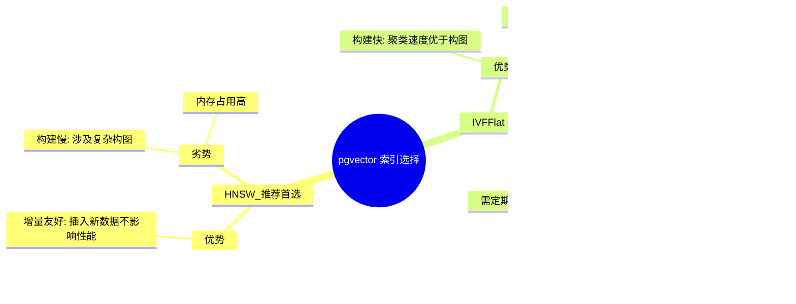

## 大学生数据库实践课: 11.2 pgvector向量索引   
                      
### 作者                      
digoal                      
                      
### 日期                      
2025-12-11                      
                      
### 标签                      
PostgreSQL , DuckDB , 语义搜索 , 向量搜索 , 关键词检索 , 全文检索 , 标量检索 , 混合搜索 , 多模态搜索 , 重排序 , embedding , document split , ORC , 大模型 , 多模态大模型 , Dify , 压力测试 , 索引优化 , 倒排向量索引 , Ivfflat , 图向量索引 , HNSW , DiskANN , 量化 , rabitq , sbq , 二值量化 , bm25 , 相关性 , 相似性 , 召回率 , pgbench , 数据集 , ann-benchmarks , 图搜索 , PGQ , 递归 , 深度优先 , 广度优先 , 最短路径 , N度关系 , LLM , Ollama                      
                      
----                      
                      
## 背景                      
        
pgvector deepwiki:        
    
https://deepwiki.com/search/-1hnsw_6bade5b7-8bf8-440a-bf69-66f9b3df1e47?mode=fast  
        
面向大学生通俗讲解以下内容:    
1、hnsw 索引原理    
2、ivfflat 索引原理    
3、hnsw 索引使用示例    
4、ivfflat 索引使用示例    
5、hnsw 和 ivfflat 索引优化示例   
      
-----      
  
# HNSW 索引原理通俗讲解  
  
## 核心思想：多层高速公路网络  
  
HNSW（Hierarchical Navigable Small World）索引就像一个智能的多层高速公路系统，帮助在海量向量数据中快速找到相似的向量  。  
  
### 1. 多层图结构  
  
想象一下你要在一个巨大的城市中找到离你最近的咖啡店：  
  
- **顶层（高速公路层）** ：连接很少但距离很远的主要节点，像城市间的高速公路    
- **中间层**：连接数适中，像省道或城市主干道  
- **底层（local 层）** ：连接最密集，像城市内的街道网络    
  

  
### 2. 搜索过程：从粗到精  
  
搜索时采用"从粗到精"的策略  ：  
  
1. **快速定位**：从顶层开始，用很少的步骤快速跳转到目标区域附近  
2. **逐层细化**：每下降一层，搜索范围就缩小一些  
3. **精确搜索**：在最底层进行详细的邻近搜索  
  
这就像先用飞机跨省，再换汽车进城，最后步行找具体地址。  
  
### 3. 关键参数  
  
#### m 参数：连接数控制  
- `m`：每层的最大连接数（默认16）    
- 底层连接数是 `2*m`，更密集  
- 越大的 `m` 意味着更好的召回率，但索引更大、查询更慢  
  
#### ef_construction 参数：构建精度  
- `ef_construction`：构建时的动态候选列表大小（默认64）    
- 越大意味着构建时考虑更多候选，召回率更好但构建更慢  
  
### 4. 构建过程  
  
HNSW 索引构建分为两个阶段  ：  
  
1. **内存阶段**：整个图在内存中构建，速度快  
2. **磁盘阶段**：当内存不足时，切换到磁盘增量构建  
  
每个新向量插入时：  
1. 随机决定它出现在哪些层（层数越低概率越大）  
2. 从顶层开始搜索到合适的插入位置  
3. 在每层建立双向连接    
  
### 5. 查询优化  
  
查询时使用 `ef_search` 参数控制搜索范围  ：  
- 默认值为40  
- 越大搜索越精确，但速度越慢  
- 可以根据需要在查询时动态调整  
  
## 实际应用示例  
  
```sql  
-- 创建 HNSW 索引  
CREATE INDEX ON items USING hnsw (embedding vector_l2_ops)   
WITH (m = 16, ef_construction = 64);  
  
-- 查询时调整搜索精度  
SET hnsw.ef_search = 100;  
SELECT * FROM items ORDER BY embedding <-> '[3,1,2]' LIMIT 5;  
```  
  
## 优势与特点  
  
1. **无需训练**：不像 IVFFlat 需要先训练聚类，可以直接构建    
2. **高召回率**：在相同查询时间下比 IVFFlat 召回率更好  
3. **动态扩展**：支持增量插入新向量  
4. **内存友好**：可以通过参数调整内存使用  
  
## Notes  
  
- HNSW 是近似最近邻搜索，会牺牲少量精度换取速度  
- 空向量和 NULL 向量不会被索引    
- 支持多种距离度量：L2、内积、余弦距离等    
- 最大支持 2000 维的 vector 类型    
  
  
    
-----     
  
# IVFFlat 索引原理通俗讲解  
  
## 核心思想：智能分区搜索  
  
IVFFlat（Inverted File with Flat compression）索引就像一个智能的城市分区系统，先把整个城市分成若干个区域，查询时只在最相关的几个区域里找答案  。  
  
### 1. 分区策略：K-means 聚类  
  
想象一下你要管理一个大型图书馆：  
  
- **建馆阶段**：先把所有书籍按内容相似性分成 100 个类别（lists=100）    
- **每个类别**：选一个"代表书籍"（聚类中心）  
- **新书入库**：计算与各类别代表书的相似度，归入最相似的类别  
  

  
### 2. 构建过程：四个阶段  
  
IVFFlat 索引构建需要经过四个明确的阶段  ：  
  
1. **初始化阶段**：准备内存和数据结构  
2. **K-means 阶段**：运行聚类算法找到中心点  
3. **分配阶段**：将每个向量分配到最近的列表  
4. **加载阶段**：将向量写入索引页面  
  
### 3. 查询策略：精准搜索  
  
查询时采用"先定位后搜索"的策略：  
  
1. **计算距离**：计算查询向量与所有聚类中心的距离  
2. **选择列表**：选出距离最近的 `probes` 个列表（默认1个）    
3. **精确搜索**：在这些列表中计算实际的向量距离  
  
```sql  
-- 创建索引时指定列表数量  
CREATE INDEX ON items USING ivfflat (embedding vector_l2_ops)   
WITH (lists = 100);  
  
-- 查询时设置探测的列表数  
SET ivfflat.probes = 10;  
SELECT * FROM items ORDER BY embedding <-> '[3,1,2]' LIMIT 5;  
```  
  
### 4. 关键参数  
  
#### lists 参数：分区数量  
- 控制聚类的数量（1-32768，默认100）    
- 推荐值：100万行以下用 `rows/1000`，超过100万行用 `sqrt(rows)`    
- 更多列表 = 更快查询但更低召回率  
  
#### probes 参数：搜索范围  
- 查询时搜索的列表数量（默认1）    
- 更大值 = 更好召回率但更慢查询  
- 设置为 lists 数量可获得精确搜索  
  
### 5. 重要限制  
  
**必须先有数据**：IVFFlat 需要在表中有数据才能构建索引，因为需要训练聚类  。  
  
如果在空表或数据很少的表上创建索引，会收到警告：  
```  
NOTICE: ivfflat index created with little data  
DETAIL: This will cause low recall.  
HINT: Drop the index until the table has more data.  
```    
  
## 实际应用示例  
  
```sql  
-- 正确做法：先加载数据再创建索引  
CREATE TABLE items (embedding vector(1536));  
INSERT INTO items (embedding) VALUES (...);  -- 加载数据  
CREATE INDEX ON items USING ivfflat (embedding vector_l2_ops)   
WITH (lists = 1000);  -- 根据数据量调整  
  
-- 查询时动态调整精度  
SET ivfflat.probes = 10;  -- 平衡速度和精度  
SELECT * FROM items ORDER BY embedding <-> query_vector LIMIT 5;  
```  
  
## 优势与特点  
  
1. **构建快速**：比 HNSW 构建更快，内存使用更少    
2. **简单高效**：算法简单，易于理解和实现  
3. **适合大数据**：特别适合已有大量数据的场景  
4. **可调精度**：通过 probes 参数动态调整查询精度  
  
## Notes  
  
- IVFFlat 是近似搜索，会牺牲一些精度换取速度  
- 支持 vector、halfvec、bit 类型，但不支持 sparsevec    
- NULL 向量和零向量（余弦距离）不会被索引    
- 支持迭代扫描，可在需要时自动扩大搜索范围    
  
  
    
-----        
  
# HNSW 索引使用示例  
  
## 基础使用：创建索引和查询  
  
### 1. 创建不同距离的索引  
  
HNSW 支持多种距离度量，需要为每种距离创建单独的索引  ：  
  
```sql  
-- L2 距离（欧几里得距离）  
CREATE INDEX ON items USING hnsw (embedding vector_l2_ops);  
  
-- 内积（适合归一化向量）  
CREATE INDEX ON items USING hnsw (embedding vector_ip_ops);  
  
-- 余弦距离  
CREATE INDEX ON items USING hnsw (embedding vector_cosine_ops);  
  
-- L1 距离（曼哈顿距离）  
CREATE INDEX ON items USING hnsw (embedding vector_l1_ops);  
```  
  
### 2. 基本查询模式  
  
查询必须包含 `ORDER BY` 距离算子和 `LIMIT` 才能使用索引  ：  
  
```sql  
-- 查找最相似的 5 个向量  
SELECT * FROM items ORDER BY embedding <-> '[3,1,2]' LIMIT 5;  
  
-- 带过滤条件的查询  
SELECT * FROM items   
WHERE category_id = 123   
ORDER BY embedding <-> '[3,1,2]'   
LIMIT 5;  
```  
  
## 参数调优：平衡速度与精度  
  
### 1. 构建时参数  
  
创建索引时可以调整两个关键参数  ：  
  
```sql  
CREATE INDEX ON items USING hnsw (embedding vector_l2_ops)   
WITH (m = 16, ef_construction = 64);  
```  
  
- **`m`**：每层最大连接数（默认16，范围2-100）  
- **`ef_construction`**：构建时候选列表大小（默认64，范围4-1000）  
  
### 2. 查询时参数  
  
查询时可以动态调整搜索精度  ：  
  
```sql  
-- 全局设置  
SET hnsw.ef_search = 100;  
  
-- 单次查询设置  
BEGIN;  
SET LOCAL hnsw.ef_search = 200;  
SELECT * FROM items ORDER BY embedding <-> '[3,1,2]' LIMIT 10;  
COMMIT;  
```  
  
## 实际测试示例  
  
### 1. 基础测试用例  
  
从测试文件中可以看到完整的使用流程  ：  
  
```sql  
-- 创建表和插入数据  
CREATE TABLE t (val vector(3));  
INSERT INTO t (val) VALUES ('[0,0,0]'), ('[1,2,3]'), ('[1,1,1]'), (NULL);  
  
-- 创建索引  
CREATE INDEX ON t USING hnsw (val vector_l2_ops);  
  
-- 插入更多数据（索引支持增量更新）  
INSERT INTO t (val) VALUES ('[1,2,4]');  
  
-- 查询  
SELECT * FROM t ORDER BY val <-> '[3,3,3]';  
```  
  
### 2. 不同距离算子的查询结果  
  
测试结果显示了不同距离算子的行为差异  ：  
  
```sql  
-- L2 距离查询结果  
SELECT * FROM t ORDER BY val <-> '[3,3,3]';  
-- 输出：[1,2,3], [1,2,4], [1,1,1], [0,0,0]  
  
-- 内积查询结果（注意顺序相反）  
SELECT * FROM t ORDER BY val <#> '[3,3,3]';  
-- 输出：[1,2,4], [1,2,3], [1,1,1], [0,0,0]  
  
-- 余弦距离查询结果  
SELECT * FROM t ORDER BY val <=> '[3,3,3]';  
-- 输出：[1,1,1], [1,2,3], [1,2,4]  
```  
  
## 高级功能：迭代扫描  
  
### 1. 启用迭代扫描  
  
当过滤条件导致结果不足时，可以启用迭代扫描自动扩大搜索范围  ：  
  
```sql  
-- 严格排序模式  
SET hnsw.iterative_scan = strict_order;  
SET hnsw.ef_search = 1;  
SELECT * FROM t ORDER BY val <-> '[3,3,3]';  
  
-- 宽松排序模式（更好的召回率）  
SET hnsw.iterative_scan = relaxed_order;  
SELECT * FROM t ORDER BY val <-> '[3,3,3]';  
```  
  
### 2. 迭代扫描参数控制  
  
可以控制迭代扫描的最大扫描元组数和内存使用  ：  
  
```sql  
-- 设置最大扫描元组数（默认20000）  
SET hnsw.max_scan_tuples = 50000;  
  
-- 设置内存倍数（默认1倍work_mem）  
SET hnsw.scan_mem_multiplier = 2;  
```  
  
## 性能优化建议  
  
### 1. 构建优化  
  
```sql  
-- 增加维护内存以加速构建  
SET maintenance_work_mem = '8GB';  
  
-- 增加并行工作进程（默认2个）  
SET max_parallel_maintenance_workers = 7;  
  
-- 生产环境使用CONCURRENTLY避免阻塞写入  
CREATE INDEX CONCURRENTLY ON items USING hnsw (embedding vector_l2_ops);  
```  
  
### 2. 监控构建进度  
  
```sql  
-- 查看索引构建进度  
SELECT phase, round(100.0 * blocks_done / nullif(blocks_total, 0), 1) AS "%"   
FROM pg_stat_progress_create_index;  
```  
  
## 常见问题和解决方案  
  
### 1. 参数范围限制  
  
测试文件显示了参数的有效范围  ：  
  
```sql  
-- 错误示例：超出范围的参数  
CREATE INDEX ON t USING hnsw (val vector_l2_ops) WITH (m = 1);  
-- ERROR: value 1 out of bounds for option "m"  
-- DETAIL: Valid values are between "2" and "100".  
  
CREATE INDEX ON t USING hnsw (val vector_l2_ops) WITH (ef_construction = 3);  
-- ERROR: ef_construction must be greater than or equal to 2 * m  
```  
  
### 2. 索引使用条件  
  
确保查询满足索引使用条件  ：  
  
```sql  
-- ✓ 使用索引  
ORDER BY embedding <=> '[3,1,2]' LIMIT 5;  
  
-- ✗ 不使用索引（表达式在ORDER BY中）  
ORDER BY 1 - (embedding <=> '[3,1,2]') DESC LIMIT 5;  
```  
  
## Notes  
  
- HNSW 索引支持 `vector`（最大2000维）、`halfvec`（最大4000维）、`bit`（最大64000维）和 `sparsevec`（最大1000个非零元素）    
- 索引构建时会显示内存使用警告，可以通过增加 `maintenance_work_mem` 来优化    
- 迭代扫描功能在 0.8.0 版本引入，可以有效处理带过滤条件的查询    
  
  
    
-----        
  
# IVFFlat 索引使用示例  
  
## 基础使用：创建索引和查询  
  
### 1. 创建不同距离的索引  
  
IVFFlat 支持多种距离度量，需要为每种距离创建单独的索引  ：  
  
```sql  
-- L2 距离（欧几里得距离）  
CREATE INDEX ON items USING ivfflat (embedding vector_l2_ops) WITH (lists = 100);  
  
-- 内积距离  
CREATE INDEX ON items USING ivfflat (embedding vector_ip_ops) WITH (lists = 100);  
  
-- 余弦距离  
CREATE INDEX ON items USING ivfflat (embedding vector_cosine_ops) WITH (lists = 100);  
  
-- Hamming 距离（用于 bit 向量）  
CREATE INDEX ON items USING ivfflat (embedding bit_hamming_ops) WITH (lists = 100);  
```  
  
### 2. 基本查询模式  
  
查询必须包含 `ORDER BY` 距离算子和 `LIMIT` 才能使用索引  ：  
  
```sql  
-- 查找最相似的 5 个向量  
SELECT * FROM items ORDER BY embedding <-> '[3,1,2]' LIMIT 5;  
  
-- 带过滤条件的查询  
SELECT * FROM items   
WHERE category_id = 123   
ORDER BY embedding <-> '[3,1,2]'   
LIMIT 5;  
```  
  
## 参数调优：平衡速度与精度  
  
### 1. lists 参数：分区数量  
  
根据数据量选择合适的列表数量  ：  
  
```sql  
-- 100万行以下：rows/1000  
CREATE INDEX ON items USING ivfflat (embedding vector_l2_ops) WITH (lists = 100);  
  
-- 100万行以上：sqrt(rows)  
CREATE INDEX ON items USING ivfflat (embedding vector_l2_ops) WITH (lists = 1000);  
```  
  
### 2. probes 参数：搜索范围  
  
查询时动态调整搜索的列表数量  ：  
  
```sql  
-- 全局设置  
SET ivfflat.probes = 10;  
  
-- 单次查询设置  
BEGIN;  
SET LOCAL ivfflat.probes = 20;  
SELECT * FROM items ORDER BY embedding <-> '[3,1,2]' LIMIT 10;  
COMMIT;  
```  
  
## 实际测试示例  
  
### 1. 基础测试用例  
  
从测试文件中可以看到完整的使用流程  ：  
  
```sql  
-- 创建表和插入数据  
CREATE TABLE t (val vector(3));  
INSERT INTO t (val) VALUES ('[0,0,0]'), ('[1,2,3]'), ('[1,1,1]'), (NULL);  
  
-- 创建索引（注意：lists=1 用于测试）  
CREATE INDEX ON t USING ivfflat (val vector_l2_ops) WITH (lists = 1);  
  
-- 插入更多数据  
INSERT INTO t (val) VALUES ('[1,2,4]');  
  
-- 查询  
SELECT * FROM t ORDER BY val <-> '[3,3,3]';  
```  
  
### 2. 不同距离算子的查询结果  
  
测试结果显示了不同距离算子的行为差异  ：  
  
```sql  
-- L2 距离查询结果  
SELECT * FROM t ORDER BY val <-> '[3,3,3]';  
-- 输出：[1,2,3], [1,2,4], [1,1,1], [0,0,0]  
  
-- 内积查询结果（注意顺序相反）  
SELECT * FROM t ORDER BY val <#> '[3,3,3]';  
-- 输出：[1,2,4], [1,2,3], [1,1,1], [0,0,0]  
  
-- 余弦距离查询结果  
SELECT * FROM t ORDER BY val <=> '[3,3,3]';  
-- 输出：[1,1,1], [1,2,3], [1,2,4]  
```  
  
## 高级功能：迭代扫描  
  
### 1. 启用迭代扫描  
  
当过滤条件导致结果不足时，可以启用迭代扫描自动扩大搜索范围  ：  
  
```sql  
-- 创建索引  
CREATE TABLE t (val vector(3));  
INSERT INTO t (val) VALUES ('[0,0,0]'), ('[1,2,3]'), ('[1,1,1]'), (NULL);  
CREATE INDEX ON t USING ivfflat (val vector_l2_ops) WITH (lists = 3);  
  
-- 启用宽松排序模式  
SET ivfflat.iterative_scan = relaxed_order;  
SELECT * FROM t ORDER BY val <-> '[3,3,3]';  
  
-- 设置最大探测数  
SET ivfflat.max_probes = 2;  
SELECT * FROM t ORDER BY val <-> '[3,3,3]';  
```  
  
### 2. 迭代扫描参数控制  
  
可以控制迭代扫描的最大探测数  ：  
  
```sql  
-- 设置最大探测数（默认32768）  
SET ivfflat.max_probes = 100;  
  
-- 如果 max_probes < probes，则使用 probes  
```  
  
## 性能优化建议  
  
### 1. 构建优化  
  
```sql  
-- 增加并行工作进程（默认2个）  
SET max_parallel_maintenance_workers = 7;  
  
-- 生产环境使用CONCURRENTLY避免阻塞写入  
CREATE INDEX CONCURRENTLY ON items USING ivfflat (embedding vector_l2_ops)   
WITH (lists = 1000);  
```  
  
### 2. 监控构建进度  
  
```sql  
-- 查看索引构建进度  
SELECT phase, round(100.0 * tuples_done / nullif(tuples_total, 0), 1) AS "%"   
FROM pg_stat_progress_create_index;  
```  
  
构建阶段包括  ：  
1. `initializing` - 初始化  
2. `performing k-means` - 执行 K-means 聚类  
3. `assigning tuples` - 分配元组  
4. `loading tuples` - 加载元组  
  
## 常见问题和解决方案  
  
### 1. 参数范围限制  
  
测试文件显示了参数的有效范围  ：  
  
```sql  
-- 错误示例：超出范围的参数  
CREATE INDEX ON t USING ivfflat (val vector_l2_ops) WITH (lists = 0);  
-- ERROR: value 0 out of bounds for option "lists"  
-- DETAIL: Valid values are between "1" and "32768".  
  
SET ivfflat.probes = 0;  
-- ERROR: 0 is outside the valid range for parameter "ivfflat.probes" (1 .. 32768)  
```  
  
### 2. 数据不足警告  
  
在数据很少的表上创建索引会收到警告  ：  
  
```sql  
-- 在空表或数据很少的表上创建索引  
NOTICE: ivfflat index created with little data  
DETAIL: This will cause low recall.  
HINT: Drop the index until the table has more data.  
```  
  
### 3. 过滤查询优化  
  
对于带过滤条件的查询，可以创建部分索引  ：  
  
```sql  
-- 创建部分索引  
CREATE INDEX partial_idx ON tst USING ivfflat (v vector_l2_ops)   
WITH (lists = 5) WHERE (c = 123);  
  
-- 查询时会使用部分索引  
SELECT * FROM tst WHERE c = 123 ORDER BY v <-> '[3,1,2]' LIMIT 5;  
```  
  
## 实际应用场景  
  
### 1. 大规模数据集  
  
对于 10 万条数据的测试  ：  
  
```sql  
-- 创建测试表  
CREATE TABLE tst (i int4 primary key, v vector(3));  
INSERT INTO tst SELECT i, ARRAY[random(), random(), random()]   
FROM generate_series(1, 100000) i;  
  
-- 创建索引  
CREATE INDEX ON tst USING ivfflat (v vector_l2_ops);  
  
-- 测试召回率  
SET enable_seqscan = off;  
SET ivfflat.probes = 10;  
SELECT v FROM tst ORDER BY v <-> '[0.5,0.5,0.5]' LIMIT 1;  
```  
  
### 2. 并发插入测试  
  
测试并发插入性能  ：  
  
```sql  
-- 创建表和索引  
CREATE TABLE tst (v vector(768));  
INSERT INTO tst SELECT ARRAY[random(), random(), ...] FROM generate_series(1, 10000) i;  
CREATE INDEX ON tst USING ivfflat (v vector_l2_ops);  
  
-- 并发插入测试  
-- 5个客户端，每个执行100次事务，每次插入10条记录  
```  
  
## Notes  
  
- IVFFlat 索引支持 `vector`（最大2000维）、`halfvec`（最大4000维）和 `bit`（最大64000维）    
- 必须在表中有数据时才能创建索引，否则会导致低召回率    
- NULL 向量和零向量（余弦距离）不会被索引    
- 迭代扫描功能可以有效处理带过滤条件的查询    
  
  
    
-----     
  
# HNSW 和 IVFFlat 索引优化示例  
  
## 核心优化思想：平衡速度与精度  
  
索引优化就像调校赛车引擎 - 你需要在速度（查询快）和精度（结果准）之间找到最佳平衡点  。  
  
## 一、构建时优化：打好基础  
  
### 1. 内存优化：给索引足够的"工作空间"  
  
```sql  
-- HNSW 和 IVFFlat 都适用  
SET maintenance_work_mem = '8GB';  -- 默认通常较小  
```  
  
当 HNSW 图超出内存时，系统会警告  ：  
```  
NOTICE: hnsw graph no longer fits into maintenance_work_mem after 100000 tuples  
HINT: Increase maintenance_work_mem to speed up builds.  
```  
  
### 2. 并行构建：多工人同时施工  
  
```sql  
-- 增加并行工作进程（默认2个）  
SET max_parallel_maintenance_workers = 7;  -- 加上主进程共8个  
-- 可能需要增加总并行数限制  
SET max_parallel_workers = 8;  
```  
  
### 3. 生产环境优化：不阻塞业务  
  
```sql  
-- 避免阻塞写入操作  
CREATE INDEX CONCURRENTLY ON items USING hnsw (embedding vector_l2_ops);  
```  
  
## 二、HNSW 专项优化  
  
### 1. 参数调优策略  
  

  
### 2. 实际优化示例  
  
```sql  
-- 基础优化：提高召回率  
CREATE INDEX ON items USING hnsw (embedding vector_l2_ops)   
WITH (m = 24, ef_construction = 128);  -- 比默认更高精度  
  
-- 查询时动态调整  
SET hnsw.ef_search = 100;  -- 默认40，提高精度  
SET hnsw.ef_search = 200;  -- 更高精度，但更慢  
  
-- 单次查询优化  
BEGIN;  
SET LOCAL hnsw.ef_search = 300;  
SELECT * FROM items ORDER BY embedding <-> query_vector LIMIT 10;  
COMMIT;  
```  
  
### 3. 迭代扫描优化  
  
处理过滤查询时的智能扩展  ：  
  
```sql  
-- 启用宽松排序（更好召回率）  
SET hnsw.iterative_scan = relaxed_order;  
  
-- 调整扫描限制  
SET hnsw.max_scan_tuples = 50000;      -- 默认20000  
SET hnsw.scan_mem_multiplier = 2;      -- 默认1倍work_mem  
  
-- 严格排序模式  
SET hnsw.iterative_scan = strict_order;  
```  
  
## 三、IVFFlat 专项优化  
  
### 1. 关键参数选择  
  
```sql  
-- 根据数据量选择 lists 参数  
-- 100万行以下：rows/1000  
CREATE INDEX ON items USING ivfflat (embedding vector_l2_ops)   
WITH (lists = 100);  -- 10万行数据  
  
-- 100万行以上：sqrt(rows)    
CREATE INDEX ON items USING ivfflat (embedding vector_l2_ops)   
WITH (lists = 1000);  -- 100万行数据  
```  
  
### 2. 查询优化策略  
  
```sql  
-- 动态调整探测数量  
SET ivfflat.probes = 10;    -- 默认1，提高召回率  
SET ivfflat.probes = sqrt(lists);  -- 经验值  
  
-- 迭代扫描优化  
SET ivfflat.iterative_scan = relaxed_order;  
SET ivfflat.max_probes = 100;  -- 限制最大探测数  
```  
  
## 四、性能测试与监控  
  
### 1. 监控构建进度  
  
```sql  
-- HNSW 构建进度  
SELECT phase, round(100.0 * blocks_done / nullif(blocks_total, 0), 1) AS "%"   
FROM pg_stat_progress_create_index;  
-- 阶段：initializing, loading tuples  
  
-- IVFFlat 构建进度    
SELECT phase, round(100.0 * tuples_done / nullif(tuples_total, 0), 1) AS "%"  
FROM pg_stat_progress_create_index;  
-- 阶段：initializing, performing k-means, assigning tuples, loading tuples  
```  
  
### 2. 查询性能分析  
  
```sql  
-- 分析查询执行计划  
EXPLAIN (ANALYZE, BUFFERS)   
SELECT * FROM items ORDER BY embedding <-> '[3,1,2]' LIMIT 5;  
  
-- 监控最耗时查询  
CREATE EXTENSION pg_stat_statements;  
SELECT query, calls, ROUND((total_plan_time + total_exec_time) / calls) AS avg_time_ms  
FROM pg_stat_statements   
ORDER BY total_plan_time + total_exec_time DESC LIMIT 20;  
```  
  
### 3. 召回率测试  
  
```sql  
-- 对比近似搜索与精确搜索  
BEGIN;  
SET LOCAL enable_indexscan = off;  -- 使用精确搜索  
SELECT id FROM items ORDER BY embedding <-> query_vector LIMIT 10;  
COMMIT;  
  
-- 使用索引搜索  
SET hnsw.ef_search = 40;  
SELECT id FROM items ORDER BY embedding <-> query_vector LIMIT 10;  
```  
  
## 五、优化决策矩阵  
  
| 场景 | HNSW 优化策略 | IVFFlat 优化策略 |  
|------|---------------|------------------|  
| **构建速度优先** | 使用默认参数 | 增加 lists 数量 |  
| **查询精度优先** | 提高 ef_search | 提高 probes |  
| **内存受限** | 减小 m, ef_construction | 选择合适的 lists |  
| **过滤查询多** | 启用迭代扫描 | 启用迭代扫描 |  
  
## 六、实际优化案例  
  
### 案例1：电商商品相似度搜索  
  
```sql  
-- 1000万商品向量  
CREATE INDEX ON products USING hnsw (embedding vector_cosine_ops)   
WITH (m = 32, ef_construction = 256);  
  
-- 日常查询：平衡速度和精度  
SET hnsw.ef_search = 64;  
SELECT * FROM products   
WHERE category_id = 123   
ORDER BY embedding <-> query_vector LIMIT 20;  
  
-- 节假日大促：优先保证可用性  
SET hnsw.ef_search = 32;  
SET hnsw.iterative_scan = relaxed_order;  
```  
  
### 案例2：学术论文推荐系统  
  
```sql  
-- 50万论文向量，更新频繁  
CREATE INDEX ON papers USING ivfflat (embedding vector_l2_ops)   
WITH (lists = 500);  
  
-- 精确推荐  
SET ivfflat.probes = 50;  
SELECT * FROM papers   
ORDER BY embedding <-> query_vector LIMIT 10;  
  
-- 快速预览  
SET ivfflat.probes = 5;  
SELECT * FROM papers   
ORDER BY embedding <-> query_vector LIMIT 5;  
```  
  
## 七、常见优化陷阱  
  
### 1. 过度优化  
  
```sql  
-- ❌ 错误：参数过大  
CREATE INDEX ON items USING hnsw (embedding vector_l2_ops)   
WITH (m = 100, ef_construction = 1000);  -- 构建极慢，内存爆炸  
  
-- ✅ 正确：逐步调整  
CREATE INDEX ON items USING hnsw (embedding vector_l2_ops)   
WITH (m = 24, ef_construction = 128);  
```  
  
### 2. 忽略数据特性  
  
```sql  
-- ❌ 错误：空表创建 IVFFlat 索引  
CREATE TABLE items (embedding vector(1536));  
CREATE INDEX ON items USING ivfflat (embedding vector_l2_ops);  
-- 警告：ivfflat index created with little data  
  
-- ✅ 正确：先加载数据  
INSERT INTO items SELECT embedding FROM source_data;  
CREATE INDEX ON items USING ivfflat (embedding vector_l2_ops)   
WITH (lists = 1000);  
```  
  
## Notes  
  
- 优化是一个迭代过程，建议从默认参数开始，根据实际需求逐步调整    
- 使用 `EXPLAIN (ANALYZE, BUFFERS)` 来验证优化效果    
- 对于归一化向量（如 OpenAI embeddings），使用内积距离性能最佳    
- 定期监控索引大小和查询性能，及时调整优化策略    
  
    
---  

**要义图示**  


### 1. HNSW 索引：分层导航图原理

HNSW 就像一个分层的交通系统。顶层是“高速公路”，底层是“街道”。通过在稀疏的顶层快速跳转，然后在密集的底层精细搜索，实现极速定位。


### 2. IVFFlat 索引：聚类分区原理

IVFFlat 则是通过“分区”来减少搜索范围。它先用 K-means 将数据聚类，查询时只扫描与目标最接近的几个“桶（List）”。


### 3. HNSW vs IVFFlat：核心差异决策脑图

面对不同的业务需求，应该如何选择索引？这张图表能帮你快速做决定。




### 4. 索引优化参数关系图

调整这些参数，就像在调节赛车的“速度”与“油耗”。


### 实验小贴士（给同学们的复习建议）：

1. **HNSW 的 ef_search**：这是你最常用的“后悔药”。如果你觉得搜索结果不够准，不需要重索引，直接 `SET hnsw.ef_search = 100;` 就能提高精度（虽然会慢一点）。
2. **IVFFlat 的警告**：千万不要在空表上建 IVFFlat。如果看到 `NOTICE: ivfflat index created with little data`，说明索引里的“中心点”是乱找的，搜出来的结果会非常离谱。
3. **距离算子匹配**：创建索引时用的是 `vector_l2_ops`，查询时就必须用 `<->`；用的是 `vector_cosine_ops`，查询就必须用 `<=>`。如果不匹配，数据库会直接放弃索引走全表扫描！
4. **内存加速**：创建索引前，记得执行 `SET maintenance_work_mem = '2GB';`。这能让你的索引构建速度从“散步”变成“起飞”。

  
  
#### [PolarDB 学习图谱](https://www.aliyun.com/database/openpolardb/activity "8642f60e04ed0c814bf9cb9677976bd4")
  
  
#### [PostgreSQL 解决方案集合](../201706/20170601_02.md "40cff096e9ed7122c512b35d8561d9c8")
  
  
#### [德哥 / digoal's Github - 公益是一辈子的事.](https://github.com/digoal/blog/blob/master/README.md "22709685feb7cab07d30f30387f0a9ae")
  
  
#### [About 德哥](https://github.com/digoal/blog/blob/master/me/readme.md "a37735981e7704886ffd590565582dd0")
  
  

  
