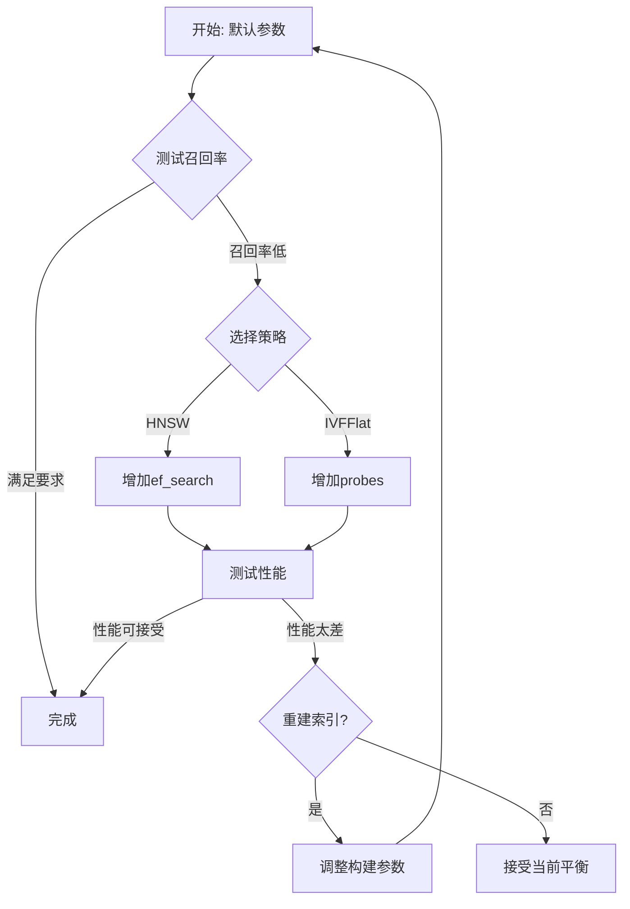
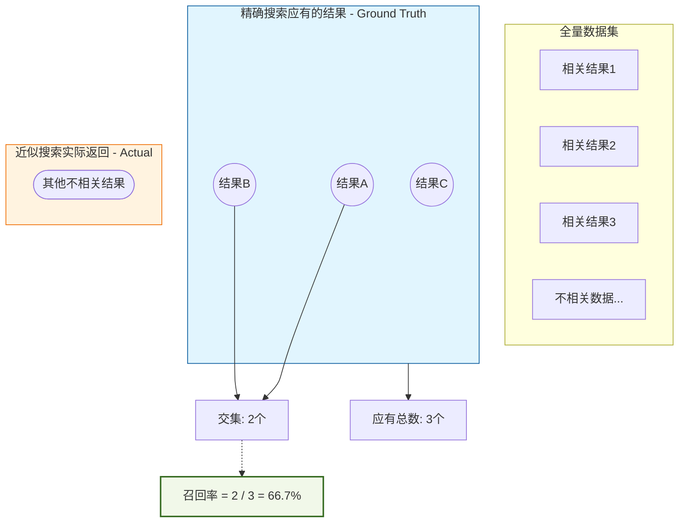
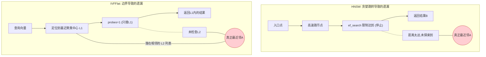
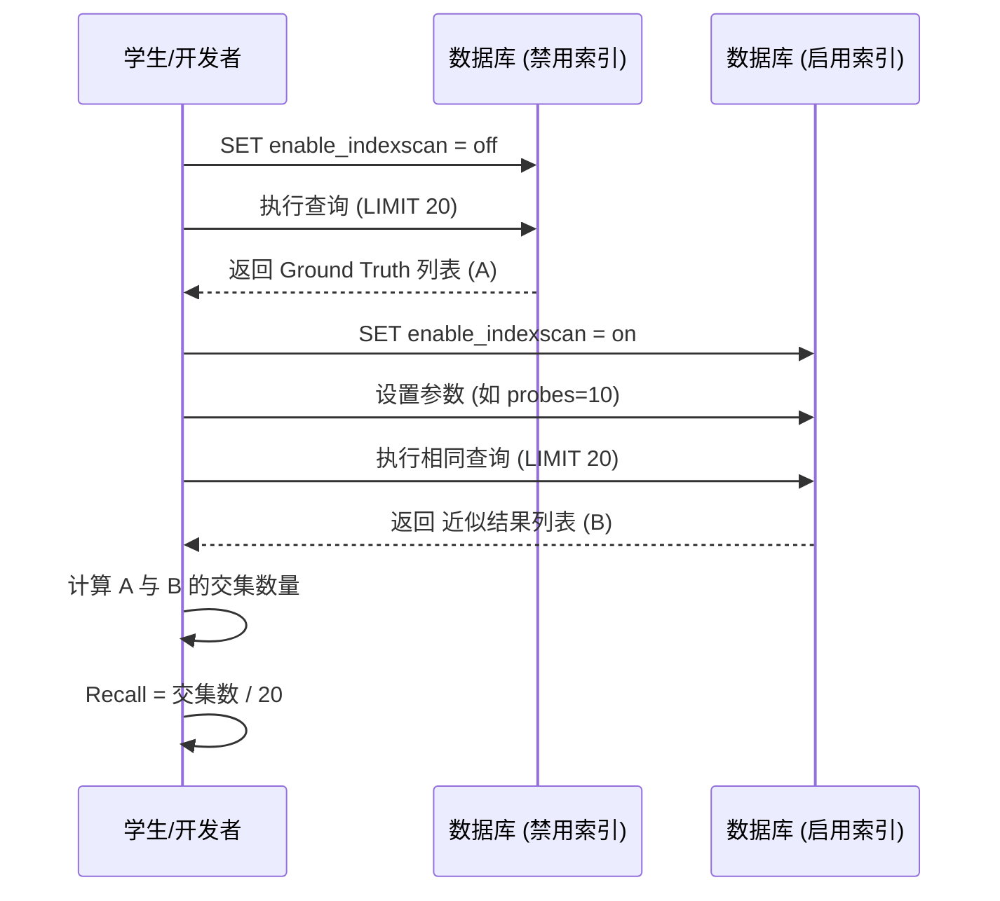

## 大学生数据库实践课: 12 召回率  
  
### 作者  
digoal  
  
### 日期  
2025-12-11  
  
### 标签  
PostgreSQL , DuckDB , 语义搜索 , 向量搜索 , 关键词检索 , 全文检索 , 标量检索 , 混合搜索 , 多模态搜索 , 重排序 , embedding , document split , ORC , 大模型 , 多模态大模型 , Dify , 压力测试 , 索引优化 , 倒排向量索引 , Ivfflat , 图向量索引 , HNSW , DiskANN , 量化 , rabitq , sbq , 二值量化 , bm25 , 相关性 , 相似性 , 召回率 , pgbench , 数据集 , ann-benchmarks , 图搜索 , PGQ , 递归 , 深度优先 , 广度优先 , 最短路径 , N度关系 , LLM , Ollama  
  
----  
  
## 背景  
  
pgvector deepwiki:  
  
https://deepwiki.com/search/-1_51ba3200-80ce-41d9-a8bf-78ea9b21c9ae?mode=fast  
  
https://deepwiki.com/search/-3_93be3172-5b1c-4172-acc5-701b018b67d7?mode=fast  
  
面向大学生通俗讲解以下内容:    
1、什么是召回率    
2、为什么会有召回率的概念? 为什么hsnw, ivfflat索引搜索的结果不是精确的? 给个例子从hsnw, ivfflat索引原理角度讲解结果不是精确的情况!  
3、如何评测召回率    
4、如何提升召回率    
5、平衡召回率和查询性能的方法, 详细的构建索引参数、搜索参数介绍, 给出示例  
  
-----  
  
# 什么是召回率  
  
召回率(Recall)是衡量搜索系统准确性的重要指标，特别是在向量相似性搜索中。通俗来说，召回率回答了这样一个问题："在所有应该被找到的结果中，系统实际找到了多少？"  
  
## 召回率的定义  
  
召回率 = 正确找到的相关结果数 / 所有应该找到的相关结果总数  
  
在pgvector中，召回率用来衡量近似最近邻搜索(ANN)相对于精确搜索的准确性  。  
  
## pgvector中的召回率计算  
  
从测试代码中可以看到，pgvector通过以下方式计算召回率：  
  
```perl  
# 获取精确搜索结果（基准）  
my @expected_ids = split("\n", $expected[$i]);  
  
# 获取近似搜索结果  
my @actual_ids = split("\n", $actual);  
  
# 计算交集  
my %expected_set = map { $_ => 1 } @expected_ids;  
foreach (@actual_ids) {  
    if (exists($expected_set{$_})) {  
        $correct++;  
    }  
}  
  
# 计算召回率  
$recall = $correct / $total;  
```    
  
## 实际应用示例  
  
在IVFFlat索引测试中，不同probes参数对应不同的召回率要求  ：  
  
- probes=1时，召回率要求≥33%  
- probes=10时，召回率要求≥93%    
- probes=100时，召回率要求≥98-100%  
  
这体现了速度与准确性的权衡：probes值越高，搜索越准确（召回率越高），但速度越慢。  
  
## 为什么需要召回率  
  
1. **性能权衡**：精确搜索100%准确但很慢，近似搜索快但可能遗漏结果  
2. **质量保证**：确保索引参数设置合理，不会遗漏太多重要结果  
3. **参数调优**：帮助选择合适的搜索参数（如HNSW的ef_search、IVFFlat的probes）  
  
## 监控召回率  
  
在生产环境中，可以通过比较精确搜索和近似搜索的结果来监控召回率  ：  
  
```sql  
BEGIN;  
SET LOCAL enable_indexscan = off; -- 使用精确搜索  
SELECT ...  
COMMIT;  
```  
  
## Notes  
  
召回率是0到1之间的值，1表示完美召回（找到了所有应该找到的结果）。在实际应用中，通常需要在召回率和查询速度之间找到平衡点。pgvector的HNSW和IVFFlat索引都允许通过参数调整这种平衡。  
  
  
-----  
  
# 为什么会有召回率概念？为什么HNSW和IVFFlat搜索不精确？  
  
召回率概念的存在是因为**近似最近邻搜索(ANN)需要权衡速度和准确性**。pgvector默认执行精确搜索，提供100%召回率，但在大数据集上速度很慢。添加索引后使用近似搜索，牺牲部分召回率来换取显著的性能提升  。  
  
## HNSW索引为什么不精确？  
  
### 原理  
HNSW创建**多层图结构**，类似于高速公路网络  ：  
- 顶层：少量长距离连接（高速公路）  
- 中层：中等距离连接（国道）  
- 底层：大量短距离连接（本地道路）  
  
### 不精确的原因  
搜索时，HNSW从顶层开始，贪婪地选择最近的邻居向下跳转。这种贪婪策略可能错过真正的最近邻：  
  
```sql  
-- HNSW搜索受ef_search参数限制  
SET hnsw.ef_search = 40;  -- 默认只考虑40个候选向量  
```  
  
当`ef_search=40`时，算法最多评估40个候选向量就停止搜索，可能遗漏更远的真正最近邻  。  
  
### 例子  
假设查询向量Q，真正的最近邻是A，但A位于图的"偏远地区"。HNSW可能：  
1. 从入口点开始，沿着"主干道"搜索  
2. 在40步内找到了B（距离稍远但位置更"中心"）  
3. 达到`ef_search`限制后停止，返回B而不是A  
  
## IVFFlat索引为什么不精确？  
  
### 原理  
IVFFlat使用**k-means聚类**将向量分成多个列表，搜索时只探测部分列表  。  
  
### 不精确的原因  
1. **聚类边界问题**：向量可能被分配到"错误"的聚类中心  
2. **探测数量限制**：默认只探测1个列表(`probes=1`)  
  
```sql  
-- IVFFlat搜索受probes参数限制    
SET ivfflat.probes = 1;  -- 默认只探测1个最近列表  
```  
  
### 例子  
假设有100个列表，查询向量Q：  
- 真正的最近邻A在列表L50中  
- 但Q的聚类中心计算显示它"应该"在列表L1中  
- `probes=1`时只搜索L1，完全错过L50中的A  
  
测试显示，当`probes=1`时召回率可能只有57-88%，而`probes=10`时可达到98%  。  
  
## 为什么接受这种不精确性？  
  
1. **性能需求**：百万级向量精确搜索可能需要数秒，近似搜索只需毫秒级  
2. **参数可控**：可通过`ef_search`和`probes`调整精度-速度权衡  
3. **实际应用**：很多场景下"足够好"的结果比"完美但慢"更有价值  
  
## Notes  
  
召回率是0到1之间的值，1表示完美召回。HNSW和IVFFlat都通过限制搜索空间来实现速度提升，这必然导致可能遗漏真正的最近邻。理解这种权衡对于正确使用向量索引至关重要。  
  
  
-----  
  
# 如何评测召回率  
  
召回率（Recall）是衡量向量搜索准确性的重要指标，表示近似搜索结果与精确搜索结果的重合程度。    
  
## 基本评测方法  
  
召回率评测的核心思路是对比近似搜索和精确搜索的结果：  
  
1. **获取精确结果**：禁用索引，进行全表扫描得到ground truth  
2. **获取近似结果**：启用索引，进行近似搜索  
3. **计算重叠度**：统计两种结果的交集数量  
  
```perl  
# 从test/t/032_ivfflat_halfvec_build_recall.pl可以看到评测流程  
sub test_recall {  
    my ($probes, $min, $operator) = @_;  
    my $correct = 0;  
    my $total = 0;  
      
    # 获取近似搜索结果  
    my $actual = $node->safe_psql("postgres", qq(  
        SET enable_seqscan = off;  
        SET ivfflat.probes = $probes;  
        SELECT i FROM tst ORDER BY v $operator '$queries[$i]' LIMIT $limit;  
    ));  
      
    # 与精确结果比较  
    foreach (@actual_ids) {  
        if (exists($expected_set{$_})) {  
            $correct++;  
        }  
    }  
      
    # 计算召回率  
    cmp_ok($correct / $total, ">=", $min, $operator);  
}  
```  
  
## 具体评测示例  
  
### 1. IVFFlat索引召回率测试  
  
在`test/t/032_ivfflat_halfvec_build_recall.pl`中，测试了不同probes参数下的召回率：    
  
- probes=1时，期望召回率≥33%  
- probes=10时，期望召回率≥93%    
- probes=100时，期望召回率≥98%（余弦距离）或100%（其他距离）  
  
### 2. 身份查询测试  
  
`test/t/005_ivfflat_query_recall.pl`使用了一种特殊的测试方法：查询表中已存在的向量，期望100%召回率  。  
  
### 3. 迭代扫描召回率测试  
  
`test/t/042_ivfflat_iterative_scan_recall.pl`测试了在有过滤条件下的召回率  。  
  
## 评测关键点  
  
1. **数据集准备**：通常使用10万条随机向量数据    
2. **查询生成**：生成20个随机查询向量    
3. **结果限制**：通常取前20个结果（LIMIT 20）    
4. **阈值设定**：根据索引类型和参数设定最低召回率要求  
  
## 实际应用建议  
  
在实际应用中，你可以通过以下方式评测召回率：  
  
```sql  
-- 获取精确搜索结果  
SET enable_indexscan = off;  
SELECT id FROM items ORDER BY embedding <-> query_vector LIMIT 20;  
  
-- 获取近似搜索结果    
SET enable_indexscan = on;  
SET ivfflat.probes = 10;  
SELECT id FROM items ORDER BY embedding <-> query_vector LIMIT 20;  
  
-- 手动计算召回率（比较两个结果集的重合度）  
```  
  
通过调整`ivfflat.probes`或`hnsw.ef_search`参数，你可以在速度和准确性之间找到平衡点。  
  
## Notes  
  
召回率评测是pgvector测试套件的重要组成部分，涵盖了多种向量类型（vector、halfvec、bit、sparsevec）和索引方法（HNSW、IVFFlat）。测试代码位于`test/t/`目录下，文件名通常包含`recall`关键字。这些测试确保了pgvector在不同配置下都能满足最低质量要求。  
  
  
  
-----  
  
# 如何提升召回率  
  
提升召回率是向量搜索优化的核心任务，主要通过调整索引参数和查询参数来实现。    
  
## 主要方法  
  
### 1. 调整查询参数  
  
#### HNSW索引 - 增加ef_search  
`hnsw.ef_search`控制搜索时的候选列表大小，默认值为40  。  
  
```sql  
-- 提升召回率（牺牲速度）  
SET hnsw.ef_search = 100;  
-- 或在事务中临时设置  
BEGIN;  
SET LOCAL hnsw.ef_search = 200;  
SELECT * FROM items ORDER BY embedding <-> '[3,1,2]' LIMIT 10;  
COMMIT;  
```  
  
#### IVFFlat索引 - 增加probes  
`ivfflat.probes`控制搜索时检查的列表数量，默认值为1  。  
  
```sql  
-- 提升召回率（牺牲速度）  
SET ivfflat.probes = 10;  
-- 设置为lists数量可实现精确搜索  
SET ivfflat.probes = 100;  -- 假设lists=100  
```  
  
### 2. 使用迭代扫描  
  
迭代扫描可以在需要时自动扩展搜索范围，特别适用于有过滤条件的查询  。  
  
```sql  
-- HNSW迭代扫描  
SET hnsw.iterative_scan = strict_order;  -- 严格排序  
SET hnsw.iterative_scan = relaxed_order; -- 放松排序（更好召回率）  
  
-- IVFFlat迭代扫描  
SET ivfflat.iterative_scan = relaxed_order;  
```  
  
### 3. 优化索引构建参数  
  
#### HNSW构建参数  
- `m`：每层最大连接数（默认16），更高值提升召回率但增加索引大小    
- `ef_construction`：构建时的候选列表大小（默认64），更高值提升召回率但延长构建时间    
  
```sql  
CREATE INDEX ON items USING hnsw (embedding vector_l2_ops)   
WITH (m = 32, ef_construction = 128);  
```  
  
#### IVFFlat构建参数  
- `lists`：聚类列表数量，影响召回率和速度平衡    
  
```sql  
-- 根据数据量选择合适的lists值  
CREATE INDEX ON items USING ivfflat (embedding vector_l2_ops)   
WITH (lists = 1000);  -- 适用于约100万条数据  
```  
  
## 实际效果对比  
  
从测试代码可以看到参数调整对召回率的影响  ：  
  
| IVFFlat probes | 期望召回率 |  
|---------------|-----------|  
| 1 | ≥33% |  
| 10 | ≥93% |  
| 100 | ≥98%（余弦）或100%（其他）   |  
  
## 最佳实践  
  
1. **渐进式调优**：从默认参数开始，逐步增加直到满足召回率要求  
2. **平衡性能**：在召回率和查询速度间找到平衡点  
3. **监控效果**：使用EXPLAIN ANALYZE监控查询性能    
4. **测试验证**：在实际数据上测试不同参数组合的效果  
  
## Notes  
  
提升召回率通常会增加查询时间和资源消耗。建议在生产环境中根据具体需求选择合适的参数组合。HNSW通常提供更好的召回率-速度权衡，而IVFFlat在构建速度和内存使用上有优势。迭代扫描功能（0.8.0+）为有过滤条件的查询提供了自动优化召回率的能力。  
  
  
  
-----  
  
  
# 平衡召回率和查询性能的方法  
  
在向量搜索中，召回率和查询性能是一对需要权衡的指标。提高召回率通常会增加查询时间，而追求速度可能会降低准确性。    
  
## 核心权衡策略  
  
### 选择合适的索引类型  
  
| 索引类型 | 构建速度 | 内存使用 | 查询速度 | 召回率 | 适用场景 |  
|---------|---------|---------|---------|--------|---------|  
| **HNSW** | 慢 | 高 | 快 | 更好 | 需要高召回率和快速查询 |  
| **IVFFlat** | 快 | 低 | 慢 | 较低 | 构建速度快、内存有限 |    
  
## 详细参数介绍  
  
### HNSW索引参数  
  
#### 构建时参数（创建后不可修改）  
  
| 参数 | 默认值 | 范围 | 影响 | 推荐值 |  
|------|--------|------|------|--------|  
| `m` | 16 | 2-100 | 每层连接数，影响召回率和索引大小 | 默认或32 |  
| `ef_construction` | 64 | 4-1000 | 构建时候选列表大小，影响召回率和构建时间 | 64-128 |  
  
```sql  
-- 创建HNSW索引时指定参数  
CREATE INDEX ON items USING hnsw (embedding vector_l2_ops)   
WITH (m = 32, ef_construction = 128);  
```    
  
#### 查询时参数（可动态调整）  
  
| 参数 | 默认值 | 范围 | 影响 | 调整策略 |  
|------|--------|------|------|----------|  
| `hnsw.ef_search` | 40 | 1-1000 | 搜索时候选列表大小 | 根据召回率需求调整 |  
| `hnsw.iterative_scan` | off | off/relaxed/strict | 迭代扫描模式 | 有过滤条件时启用 |  
  
```sql  
-- 查询时调整参数  
SET hnsw.ef_search = 100;  -- 提高召回率  
-- 或单次查询  
BEGIN;  
SET LOCAL hnsw.ef_search = 200;  
SELECT * FROM items ORDER BY embedding <-> '[3,1,2]' LIMIT 10;  
COMMIT;  
```    
  
### IVFFlat索引参数  
  
#### 构建时参数  
  
| 参数 | 默认值 | 范围 | 影响 | 推荐公式 |  
|------|--------|------|------|----------|  
| `lists` | - | 1-32768 | 聚类数量，影响召回率和速度 | rows/1000或sqrt(rows) |  
  
```sql  
-- 根据数据量选择lists  
-- 10万条数据  
CREATE INDEX ON items USING ivfflat (embedding vector_l2_ops)   
WITH (lists = 100);  
  
-- 100万条数据    
CREATE INDEX ON items USING ivfflat (embedding vector_l2_ops)   
WITH (lists = 1000);  
```    
  
#### 查询时参数  
  
| 参数 | 默认值 | 范围 | 影响 | 调整策略 |  
|------|--------|------|------|----------|  
| `ivfflat.probes` | 1 | 1-32768 | 搜索的列表数量 | 从sqrt(lists)开始 |  
  
```sql  
-- 提高召回率  
SET ivfflat.probes = 10;  -- 检查10个列表  
-- 精确搜索（但可能不使用索引）  
SET ivfflat.probes = 100; -- 等于lists数量  
```    
  
## 实际应用示例  
  
### 场景1：高召回率要求（推荐系统）  
  
```sql  
-- 创建高质量HNSW索引  
CREATE INDEX products_embedding_idx ON products   
USING hnsw (embedding vector_cosine_ops)   
WITH (m = 32, ef_construction = 128);  
  
-- 查询时使用高ef_search  
SET hnsw.ef_search = 200;  
SELECT product_id, title FROM products   
ORDER BY embedding <-> query_embedding LIMIT 20;  
```  
  
### 场景2：快速响应（实时搜索）  
  
```sql  
-- 使用默认参数的HNSW  
CREATE INDEX items_embedding_idx ON items   
USING hnsw (embedding vector_l2_ops);  
  
-- 查询时使用默认ef_search=40  
SET hnsw.ef_search = 40;  
SELECT * FROM items   
ORDER BY embedding <-> query_embedding LIMIT 5;  
```  
  
### 场景3：大数据量（内存受限）  
  
```sql  
-- 使用IVFFlat处理大数据  
CREATE INDEX logs_embedding_idx ON logs   
USING ivfflat (embedding vector_l2_ops)   
WITH (lists = 10000);  -- 1000万条数据  
  
-- 平衡的probes设置  
SET ivfflat.probes = 100;  -- sqrt(10000)  
SELECT * FROM logs   
ORDER BY embedding <-> query_embedding LIMIT 10;  
```  
  
### 场景4：有过滤条件的查询  
  
```sql  
-- 启用迭代扫描自动优化  
SET hnsw.iterative_scan = relaxed_order;  
SET hnsw.ef_search = 100;  
  
-- 过滤查询会自动扩展搜索直到获得足够结果  
SELECT * FROM items   
WHERE category_id = 123   
ORDER BY embedding <-> query_embedding LIMIT 10;  
```    
  
## 参数调优流程  
  

  
## 性能监控  
  
```sql  
-- 监控查询性能  
EXPLAIN (ANALYZE, BUFFERS)   
SELECT * FROM items ORDER BY embedding <-> '[3,1,2]' LIMIT 5;  
  
-- 监控召回率  
BEGIN;  
SET LOCAL enable_indexscan = off;  -- 精确搜索  
SELECT id FROM items ORDER BY embedding <-> query LIMIT 20;  
COMMIT;  
  
BEGIN;  
SET LOCAL enable_indexscan = on;   -- 近似搜索  
SELECT id FROM items ORDER BY embedding <-> query LIMIT 20;  
COMMIT;  
```    
  
## 最佳实践建议  
  
1. **从默认开始**：先使用默认参数测试，根据实际需求调整  
2. **渐进式调优**：逐步增加参数值，避免一次性设置过高  
3. **测试验证**：在实际数据上测试不同参数组合  
4. **监控效果**：定期检查查询性能和召回率  
5. **考虑迭代扫描**：有过滤条件时优先使用迭代扫描功能  
  
## Notes  
  
HNSW通常提供更好的召回率-速度权衡，适合大多数应用场景。IVFFlat在构建速度和内存使用上有优势，适合超大数据集或内存受限的环境。迭代扫描功能（0.8.0+）为有过滤条件的查询提供了自动优化召回率的能力，是处理复杂查询的有效工具。  
  
    
-----  
  
使用 vchord 插件提供的函数, 在数据库中直接测试召回率.    
  
# 测试召回率的例子  
  
VectorChord 提供了 `vchordrq_evaluate_query_recall` 函数来测试查询的召回率。以下是具体的使用示例：  
  
## 1. 基本召回率测试  
  
```sql  
-- 创建测试表和索引  
CREATE TABLE t (id SERIAL PRIMARY KEY, val vector(3));  
INSERT INTO t (val)  
SELECT ARRAY[i * 0.0001, i * 0.00005, i * 0.0002]::vector(3)   
FROM generate_series(1, 10000) as s(i);  
CREATE INDEX idx1 ON t USING vchordrq (val vector_l2_ops);  
  
-- 设置搜索参数  
SET vchordrq.epsilon = 0.8;  
SET vchordrq.probes = '1';  
  
-- 测试召回率  
SELECT * FROM vchordrq_evaluate_query_recall(  
  query => $$SELECT ctid FROM t ORDER BY val <-> '[0.5, 0.25, 1.0]' LIMIT 10$$  
);  
```    
  
## 2. 精确搜索召回率测试  
  
```sql  
-- 使用精确搜索作为基准  
SELECT * FROM vchordrq_evaluate_query_recall(  
  query => $$SELECT ctid FROM t ORDER BY val <-> '[0.5, 0.25, 1.0]' LIMIT 10$$,  
  exact_search => true  
);  
```    
  
## 3. 批量召回率测试  
  
```sql  
-- 对多个采样查询计算平均召回率  
SELECT AVG(recall_value)  
FROM (  
    SELECT  
        vchordrq_evaluate_query_recall(  
            query => format(  
                'SELECT ctid FROM %I.%I ORDER BY %I OPERATOR(%s) %L LIMIT 10',  
                lq.schema_name,  
                lq.table_name,  
                lq.column_name,  
                lq.operator,  
                lq.value  
            )  
        ) AS recall_value  
    FROM  
        vchordrq_sampled_queries('idx2') AS lq  
) AS eval_results;  
```    
  
## 4. Python 基准测试中的召回率计算  
  
```python  
def calculate_metrics(all_results, k, m, num_processes=1):  
    """Calculate recall, QPS, and latency percentiles from results"""  
    hits, latencies = zip(*all_results)  
      
    # 计算召回率  
    total_hits = sum(hits)  
    recall = total_hits / (k * m * num_processes)  
      
    return recall, qps, p50, p99  
```    
  
## 召回率函数参数说明  
  
`vchordrq_evaluate_query_recall` 函数支持以下参数：  
  
- `query`: 要测试的查询语句  
- `exact_search`: 是否使用精确搜索（默认 false）  
- `accu_probes`: 累积搜索的探测数（默认 NULL，自动选择）  
- `accu_epsilon`: 累积搜索的 epsilon 值（默认 1.9）    
  
## Notes  
  
- 召回率测试需要查询返回 `ctid` 字段用于比较  
- MaxSim 操作符（`@#`）不能用于估算召回率测试，必须使用 `exact_search => true`  
- 当查询无结果时，函数返回 `NaN`  
- 测试时会自动比较近似搜索结果与精确搜索结果的交集来计算召回率  
  
  
  
---  

**要义图示**  


### 1. 召回率的直观定义

这个图表解释了为什么召回率不是看“找到了多少”，而是看“漏掉了多少”。




### 2. 为什么结果不精确？（HNSW vs IVFFlat 原理示例）

这张图用形象的对比解释了为什么近似索引会“迷路”。




### 3. 如何评测召回率（标准实验流程）

学生在写实验报告时，可以参考这个标准的对比评测逻辑。




### 4. 性能与召回率的平衡杠杆

这张图汇总了文章中提到的关键参数，帮助学生记忆“调哪个按钮能提速/提质”。


| 索引类型 | 提升召回率的“杠杆” (参数) | 带来的代价 |
| :--- | :--- | :--- |
| **HNSW (查询时)** | `hnsw.ef_search` ↑ | 增加计算耗时 |
| **HNSW (构建时)** | `m` ↑ , `ef_construction` ↑ | 索引变大、构建变慢 |
| **IVFFlat (查询时)** | `ivfflat.probes` ↑ | 扫描更多列表，变慢 |
| **通用 (新版本)** | `iterative_scan = relaxed_order` | 自动扩展，增加 IO |


### 总结给学生的“金句”：

* **召回率是“舍得”的艺术**：想要毫秒级响应（舍），就得接受偶尔漏掉几个最完美的匹配（得）。
* **IVFFlat 的 `probes` 就像搜房间**：房间（lists）很多，你只搜 1 个房间速度快，但可能东西在隔壁；搜的房间越多，找到的概率（召回率）越高。
* **HNSW 的 `ef_search` 就像导航**：导航在计算路径时考虑的候选点越多，给出的路线就越接近最优，但耗电（CPU）也更多。

  
  
#### [PolarDB 学习图谱](https://www.aliyun.com/database/openpolardb/activity "8642f60e04ed0c814bf9cb9677976bd4")
  
  
#### [PostgreSQL 解决方案集合](../201706/20170601_02.md "40cff096e9ed7122c512b35d8561d9c8")
  
  
#### [德哥 / digoal's Github - 公益是一辈子的事.](https://github.com/digoal/blog/blob/master/README.md "22709685feb7cab07d30f30387f0a9ae")
  
  
#### [About 德哥](https://github.com/digoal/blog/blob/master/me/readme.md "a37735981e7704886ffd590565582dd0")
  
  

  
