## 大学生数据库实践课: 14.1 从文本到关键词   
    
### 作者    
digoal    
    
### 日期    
2025-12-11    
    
### 标签    
PostgreSQL , DuckDB , 语义搜索 , 向量搜索 , 关键词检索 , 全文检索 , 标量检索 , 混合搜索 , 多模态搜索 , 重排序 , embedding , document split , ORC , 大模型 , 多模态大模型 , Dify , 压力测试 , 索引优化 , 倒排向量索引 , Ivfflat , 图向量索引 , HNSW , DiskANN , 量化 , rabitq , sbq , 二值量化 , bm25 , 相关性 , 相似性 , 召回率 , pgbench , 数据集 , ann-benchmarks , 图搜索 , PGQ , 递归 , 深度优先 , 广度优先 , 最短路径 , N度关系 , LLM , Ollama    
    
----    
    
## 背景    
    
pg_tokenizer deepwiki:  
  
https://deepwiki.com/search/-1_df93a2d3-10f7-4377-bf44-342dbfb13e00?mode=fast  
  
面向大学生通俗讲解以下内容:    
1、为什么要将文本转换为关键词?  
2、如何提取文本关键词? 有哪些技术?  
3、详细讲解各自提取关键词的技术原理  
4、给出从文本到关键词的转换示例  
  
[《全文检索的地基: 标记化(Tokenization)原理详解》](../202510/20251017_06.md)  
  
-----  
  
# 为什么要将文本转换为关键词？  
  
将文本转换为关键词（或称为"标记化"）是文本处理的基础步骤，主要原因包括：  
  
## 1. 提高搜索效率  
  
计算机处理原始文本字符串效率低下，而关键词数组可以快速匹配和比较。在pg_tokenizer中，`TextAnalyzer::apply`方法将文本转换为`Vec<String>`标记数组  ，这样搜索引擎就能快速找到相关文档。  
  
## 2. 标准化文本格式  
  
通过字符过滤器（如`to_lowercase`）和标记过滤器（如`stemmer`），消除文本的变体形式  ：  
- "PostgreSQL" → "postgresql"（小写化）  
- "databases" → "databas"（词干提取）  
  
## 3. 去除无关信息  
  
停用词过滤器移除常见但无意义的词汇（如"the"、"is"、"a"）  ，让搜索专注于真正重要的内容。  
  
## 4. 支持多语言处理  
  
不同语言需要不同的分词策略：  
- 英文使用`unicode_segmentation`    
- 中文使用`jieba`分词    
- 日文使用Lindera模型    
  
## 5. 生成向量表示  
  
关键词是生成文本向量嵌入的基础。在pg_tokenizer中，标记通过模型转换为整数数组（`INT[]`），用于相似度搜索和BM25排名  。  
  
## 实际应用示例  
  
```sql  
-- 原始文本  
'PostgreSQL is a powerful, open-source object-relational database system.'  
  
-- 转换后的关键词  
{postgresql, powerful, open, sourc, object, relation, databas, system}  
```  
  
这些关键词可以用于：  
- 全文搜索索引  
- 文档相似度计算  
- 语义检索  
- 自动分类  
  
## Notes  
  
文本转换为关键词是自然语言处理的核心步骤，它将非结构化的文本数据转换为计算机可以理解和处理的结构化形式。pg_tokenizer通过可配置的文本分析器实现了这一过程，支持多种语言和自定义处理规则。  
  
  
  
-----  
  
# 如何提取文本关键词？有哪些技术？  
  
在pg_tokenizer中，文本关键词提取通过一个可配置的处理管道实现，主要包含以下技术：  
  
## 核心处理流程  
  
文本分析器(`TextAnalyzer`)是整个处理管道的核心，通过`apply`方法按顺序执行三个步骤  ：  
  
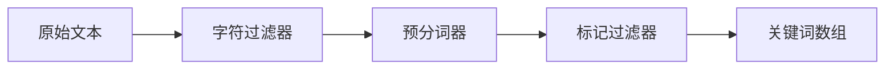
  
## 1. 字符过滤技术  
  
在分词前对文本进行预处理：  
  
- **小写化转换**：`to_lowercase = {}` 将所有字符转为小写    
- **Unicode标准化**：`unicode_normalization = "nfkd"` 统一字符编码格式    
  
## 2. 预分词技术  
  
将文本切分为初始标记：  
  
- **Unicode分词**：`unicode_segmentation` 基于Unicode标准#29的词边界分割    
- **正则表达式**：`regex = "\w+"` 使用自定义模式匹配    
- **中文分词**：`jieba` 专门处理中文文本，支持full/precise/search三种模式    
  
## 3. 标记过滤技术  
  
对初始标记进行优化和筛选：  
  
### 过滤器类型  
- **非字母数字过滤**：`skip_non_alphanumeric = {}` 移除纯符号标记    
- **停用词过滤**：`stopwords = "nltk_english"` 移除常见无意义词汇    
- **词干提取**：`stemmer = "english_porter2"` 将单词还原为词根形式    
- **同义词替换**：`synonym = "dict_name"` 统一同义词表达    
- **N-gram生成**：生成字符级别的n元语法组合    
  
### 支持的词干算法  
支持25种语言的词干提取，包括英语、中文、阿拉伯语、日语等    
  
## 实际应用示例  
  
### 英文文本处理  
```sql  
SELECT create_text_analyzer('english_analyzer', $$  
pre_tokenizer = "unicode_segmentation"  
[[character_filters]]  
to_lowercase = {}  
[[token_filters]]  
skip_non_alphanumeric = {}  
[[token_filters]]  
stopwords = "nltk_english"  
[[token_filters]]  
stemmer = "english_porter2"  
$$);  
```  
输入：`'PostgreSQL is a powerful database system'`    
输出：`{postgresql, powerful, databas, system}`  
  
### 中文文本处理  
```sql  
SELECT create_text_analyzer('chinese_analyzer', $$  
[pre_tokenizer.jieba]  
mode = "search"  
enable_hmm = true  
$$);  
```  
  
### 日文文本处理  
使用Lindera模型，包含日文特有的字符过滤器和标记过滤器    
  
## 技术优势  
  
1. **模块化设计**：每个处理环节可独立配置和组合    
2. **多语言支持**：针对不同语言提供专门的处理策略  
3. **可扩展性**：支持自定义停用词和同义词词典    
4. **高性能**：使用对象池缓存已配置的分析器实例    
  
## Notes  
  
pg_tokenizer的关键词提取技术基于现代自然语言处理的最佳实践，通过管道式处理实现了高效、准确的文本分析。这些技术不仅适用于搜索引擎，还可用于文档分类、相似度计算、语义检索等多种应用场景。  
  
  
  
-----  
  
# 关键词提取技术原理详解  
  
## 1. 字符过滤器原理  
  
字符过滤器在分词前对原始文本进行预处理，通过修改文本内容来标准化输入。  
  
### 小写化转换 (to_lowercase)  
  
```rust  
// src/text_analyzer.rs:56-60  
let mut text = Cow::Borrowed(text);  
for filter in &self.character_filters {  
    filter.apply(&mut text);  
}  
```  
  
小写化过滤器通过遍历文本的每个字符，将其转换为小写形式。这确保了"PostgreSQL"和"postgresql"被视为相同的词，提高了搜索的召回率。  
  
### Unicode标准化 (unicode_normalization)  
  
Unicode标准化解决字符编码的多种表示形式问题。例如：  
- "é" 可以表示为单个字符 U+00E9 或两个字符序列 "e" + "´"  
- NFKC形式会将兼容字符转换为标准形式    
  
## 2. 预分词器原理  
  
预分词器负责将文本分割成初始的词汇单元。  
  
### Unicode分词 (unicode_segmentation)  
  
基于Unicode标准附录#29的词边界算法，识别文本中的词汇边界：  
  
```rust  
// src/text_analyzer.rs:62-66  
let text = text.as_ref();  
let pre_tokenized = match &self.pre_tokenizer {  
    Some(pre_tokenizer) => pre_tokenizer.pre_tokenize(text),  
    None => vec![text],  
};  
```  
  
该算法考虑了：  
- 字符类别（字母、数字、标点等）  
- 语言特定的规则  
- 连字符和撇号的处理  
  
### 正则表达式分词 (regex)  
  
使用正则表达式模式匹配生成词汇：  
  
```toml  
pre_tokenizer = "\\w+"  
```  
  
这会匹配所有连续的字母数字字符序列，忽略标点符号和空格。  
  
### 中文分词 (Jieba)  
  
Jieba是基于词典的中文分词算法，包含三种模式：  
  
```rust  
// src/pre_tokenizer/jieba.rs:45-61  
impl PreTokenizer for JiebaFull {  
    fn pre_tokenize<'a>(&self, text: &'a str) -> Vec<&'a str> {  
        JIEBA.cut(text, self.enable_hmm)  
    }  
}  
  
impl PreTokenizer for JiebaSearch {  
    fn pre_tokenize<'a>(&self, text: &'a str) -> Vec<&'a str> {  
        JIEBA.cut_for_search(text, self.enable_hmm)  
    }  
}  
```  
  
- **Full模式**：输出文本中所有可能的词语组合  
- **Precise模式**：使用Viterbi算法找出最精确的分词路径  
- **Search模式**：对Full模式的结果再进行细分，提高召回率  
  
HMM（隐马尔可夫模型）用于识别未登录词（词典中不存在的词）  。  
  
## 3. 标记过滤器原理  
  
标记过滤器对预分词结果进行优化和筛选。  
  
### 非字母数字过滤 (skip_non_alphanumeric)  
  
```rust  
// src/token_filter/mod.rs:16-24  
pub trait TokenFilter {  
    fn apply(&self, token: String) -> Vec<String>;  
      
    fn apply_batch(&self, tokens: Vec<String>) -> Vec<String> {  
        tokens  
            .into_iter()  
            .flat_map(|token| self.apply(token))  
            .collect()  
    }  
}  
```  
  
该过滤器检查每个token是否包含至少一个字母或数字字符，纯符号的token会被移除。  
  
### 停用词过滤 (stopwords)  
  
停用词是语言中高频但语义贡献低的词汇（如"的"、"是"、"the"）。pg_tokenizer支持多种内置停用词词典：  
  
- `lucene_english`：Apache Lucene的英文停用词表  
- `nltk_english`：NLTK的英文停用词表  
- `iso_english`：ISO标准的英文停用词表    
  
### 词干提取 (stemmer)  
  
词干提取将词汇还原为其词根形式，支持25种语言的Snowball算法：  
  
```rust  
// src/token_filter/mod.rs:44  
TokenFilterConfig::Stemmer(kind) => Arc::new(StemmerTokenFilter::new(kind)),  
```  
  
例如：  
- "running" → "run"  
- "databases" → "databas"  
- "connection" → "connect"  
  
英语Porter2算法是最常用的词干提取器之一  。  
  
### 同义词替换 (synonym)  
  
同义词词典将多个表达相同概念的词汇统一为标准形式：  
  
```sql  
SELECT tokenizer_catalog.create_synonym('db_synonyms', $$  
pgsql postgres postgresql  
index indices  
db database  
$$);  
```  
  
每行代表一组同义词，第一个词是标准形式。  
  
### N-gram生成  
  
N-gram生成器创建字符级别的滑动窗口序列：  
  
```rust  
// src/token_filter/ngram.rs:6-39  
pub struct Ngram {  
    min_gram: usize,  
    max_gram: usize,  
    preserve_original: bool,  
}  
```  
  
配置参数：  
- `min_gram`：最小n-gram长度（默认1）  
- `max_gram`：最大n-gram长度（默认2）  
- `preserve_original`：是否保留原始token（默认false）  
  
例如，"Quick"在min_gram=1, max_gram=2时生成：  
["Q", "Qu", "u", "ui", "i", "ic", "c", "ck", "k"]    
  
## 4. 日文处理原理 (Lindera)  
  
日文需要特殊的形态学分析，因为日文没有空格分词且混合使用多种文字系统。  
  
### Lindera模型架构  
  
```rust  
// src/model/lindera.rs:26-36  
impl TokenizerModel for LinderaModel {  
    fn apply(&self, token: String) -> Vec<u32> {  
        self.tokenizer  
            .tokenize(&token)  
            .unwrap()  
            .into_iter()  
            .map(|t| t.word_id.id)  
            .filter(|id| *id != u32::MAX)  
            .collect()  
    }  
}  
```  
  
Lindera使用IPADic词典进行形态学分析，输出包含：  
- 词形（surface form）  
- 词性（part-of-speech）  
- 词典ID（word_id）  
  
### 日文特有的过滤器  
  
1. **japanese_iteration_mark**：展开重复符号（々、ゝ、ゞ）  
2. **japanese_compound_word**：合并复合词（如数词+量词）  
3. **japanese_number**：标准化数字表达  
4. **japanese_stop_tags**：基于词性过滤功能词  
5. **japanese_katakana_stem**：截断片假名词的长音    
  
## 5. 完整处理流程  
  
整个关键词提取流程在`TextAnalyzer::apply`方法中实现：  
  
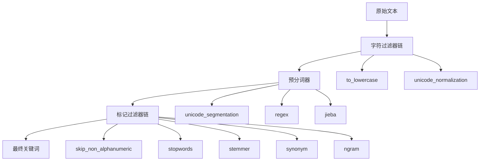
  
每个阶段都接收前一阶段的输出，进行转换后传递给下一阶段，最终生成标准化的关键词数组  。  
  
## Notes  
  
这些技术的组合使用使得pg_tokenizer能够处理多种语言的文本，并生成适合搜索和分析的关键词。每种技术都有其特定的应用场景，通过合理配置可以实现最佳的文本处理效果。  
  
  
  
-----  
  
  
# 从文本到关键词的转换示例  
  
## 1. 英文文本处理示例  
  
### 基础英文处理  
  
**原始文本：**  
```  
'PostgreSQL is a powerful, open-source object-relational database system.'  
```  
  
**配置：**    
```sql  
SELECT create_text_analyzer('english_analyzer', $$  
pre_tokenizer = "unicode_segmentation"  
[[character_filters]]  
to_lowercase = {}  
[[character_filters]]  
unicode_normalization = "nfkd"  
[[token_filters]]  
skip_non_alphanumeric = {}  
[[token_filters]]  
stopwords = "nltk_english"  
[[token_filters]]  
stemmer = "english_porter2"  
$$);  
```  
  
**转换过程：**  
1. **字符过滤**：转换为小写，Unicode标准化  
   - `'PostgreSQL is a powerful, open-source object-relational database system.'`  
   - → `'postgresql is a powerful, open-source object-relational database system.'`  
  
2. **预分词**：按Unicode词边界分割  
   - → `['postgresql', 'is', 'a', 'powerful', ',', 'open', '-', 'source', 'object', '-', 'relational', 'database', 'system', '.']`  
  
3. **标记过滤**：  
   - 移除非字母数字：`['postgresql', 'is', 'a', 'powerful', 'open', 'source', 'object', 'relational', 'database', 'system']`  
   - 移除停用词：`['postgresql', 'powerful', 'open', 'source', 'object', 'relational', 'database', 'system']`  
   - 词干提取：`['postgresql', 'powerful', 'open', 'sourc', 'object', 'relation', 'databas', 'system']`  
  
**最终结果：**  
```sql  
{postgresql, powerful, open, sourc, object, relation, databas, system}  
```  
  
## 2. 中文文本处理示例  
  
### 中文分词处理  
  
**原始文本：**    
```  
'红海早过了，船在印度洋面上开驶着，但是太阳依然不饶人地迟落早起，侵占去大部分的夜。'  
```  
  
**配置：**    
```sql  
SELECT create_text_analyzer('chinese_analyzer', $$  
[pre_tokenizer.jieba]  
mode = "search"  
enable_hmm = true  
$$);  
```  
  
**转换过程：**  
1. **字符过滤**：无特殊处理  
2. **预分词**：Jieba分词（搜索模式）  
   - `'红海早过了'` → `['红海', '早', '过', '了']`  
   - `'船在印度洋面上'` → `['船', '在', '印度洋', '面', '上']`  
   - `'开驶着'` → `['开驶', '着']`  
   - `'但是太阳依然'` → `['但是', '太阳', '依然']`  
   - `'不饶人地迟落早起'` → `['不', '饶人', '地', '迟', '落', '早', '起']`  
   - `'侵占去大部分的夜'` → `['侵占', '去', '大部分', '的', '夜']`  
  
3. **标记过滤**：无特殊过滤  
  
**最终结果：**  
```sql  
{红海, 早, 过, 了, 船, 在, 印度洋, 面, 上, 开驶, 着, 但是, 太阳, 依然, 不, 饶人, 地, 迟, 落, 早, 起, 侵占, 去, 大部分, 的, 夜}  
```  
  
## 3. 日文文本处理示例  
  
### 日文形态学分析  
  
**原始文本：**    
```  
'関西国際空港限定トートバッグ'  
```  
  
**配置：**    
```sql  
SELECT create_lindera_model('lindera_ipadic', $$  
[segmenter]  
mode = "normal"  
  [segmenter.dictionary]  
  kind = "ipadic"  
[[character_filters]]  
kind = "unicode_normalize"  
  [character_filters.args]  
  kind = "nfkc"  
[[character_filters]]  
kind = "japanese_iteration_mark"  
  [character_filters.args]  
  normalize_kanji = true  
  normalize_kana = true  
[[token_filters]]  
kind = "japanese_stop_tags"  
  [token_filters.args]  
  tags = ["助詞", "助動詞", "記号"]  
[[token_filters]]  
kind = "japanese_katakana_stem"  
  [token_filters.args]  
  min = 3  
$$);  
```  
  
**转换过程：**  
1. **字符过滤**：  
   - Unicode标准化（NFKC）  
   - 展开重复符号（如果有）  
  
2. **形态学分析**（IPADic词典）：  
   - `'関西国際空港'` → `['関西', '国際', '空港']`  
   - `'限定'` → `['限定']`  
   - `'トートバッグ'` → `['トート', 'バッグ']`  
  
3. **标记过滤**：  
   - 移除助词、助动词、符号  
   - 片假名词干提取  
  
**最终结果：**    
```sql  
{372979,374175}  
```  
（数字是IPADic词典中的词汇ID）  
  
## 4. 自定义模型示例  
  
### 批量文档处理  
  
**原始文本集合：**    
```sql  
INSERT INTO documents (passage) VALUES   
('PostgreSQL is a powerful, open-source object-relational database system. It has over 15 years of active development.'),  
('Full-text search is a technique for searching in plain-text documents or textual database fields. PostgreSQL supports this with tsvector.'),  
('BM25 is a ranking function used by search engines to estimate the relevance of documents to a given search query.'),  
('PostgreSQL provides many advanced features like full-text search, window functions, and more.'),  
('Search and ranking in databases are important in building effective information retrieval systems.'),  
('The BM25 ranking algorithm is derived from the probabilistic retrieval framework.'),  
('Full-text search indexes documents to allow fast text queries. PostgreSQL supports this through its GIN and GiST indexes.'),  
('The PostgreSQL community is active and regularly improves the database system.'),  
('Relational databases such as PostgreSQL can handle both structured and unstructured data.'),  
('Effective search ranking algorithms, such as BM25, improve search results by understanding relevance.');  
```  
  
**配置：**    
```sql  
SELECT create_text_analyzer('text_analyzer1', $$  
pre_tokenizer = "unicode_segmentation"  
[[character_filters]]  
to_lowercase = {}  
[[character_filters]]  
unicode_normalization = "nfkd"  
[[token_filters]]  
skip_non_alphanumeric = {}  
[[token_filters]]  
stopwords = "nltk_english"  
[[token_filters]]  
stemmer = "english_porter2"  
$$);  
```  
  
**转换结果：**    
```sql  
SELECT embedding FROM documents ORDER BY id;  
-- 结果为每篇文档的词汇ID数组  
{1,2,3,4,5,6,7,8}  
{9,10,11,12,13,14,15,16,17,18}  
{19,20,21,22,23,24,25,26,27}  
...  
```  
  
## 5. 复杂处理管道示例  
  
### 多步骤处理流程  
  
**原始文本：**  
```  
'PostgreSQL's connection pooling improves database performance significantly.'  
```  
  
**复杂配置：**  
```sql  
SELECT create_text_analyzer('complex_analyzer', $$  
[[character_filters]]  
unicode_normalization = "nfkc"  
[[character_filters]]  
to_lowercase = {}  
pre_tokenizer = "unicode_segmentation"  
[[token_filters]]  
skip_non_alphanumeric = {}  
[[token_filters]]  
synonym = "db_synonyms"  
[[token_filters]]  
stopwords = "nltk_english"  
[[token_filters]]  
stemmer = "english_porter2"  
[[token_filters]]  
[token_filters.n_gram]  
min = 2  
max = 3  
$$);  
```  
  
**转换过程：**  
1. **字符过滤**：  
   - Unicode标准化：`'PostgreSQL's connection pooling improves database performance significantly.'`  
   - 小写化：`'postgresql's connection pooling improves database performance significantly.'`  
  
2. **预分词**：  
   - `['postgresql', "'", 's', 'connection', 'pooling', 'improves', 'database', 'performance', 'significantly', '.']`  
  
3. **标记过滤**：  
   - 移除非字母数字：`['postgresql', 's', 'connection', 'pooling', 'improves', 'database', 'performance', 'significantly']`  
   - 同义词替换：`['postgresql', 's', 'connect', 'pool', 'improv', 'databas', 'perform', 'signific']`  
   - 移除停用词：`['postgresql', 'connect', 'pool', 'improv', 'databas', 'perform', 'signific']`  
   - 词干提取：`['postgresql', 'connect', 'pool', 'improv', 'databas', 'perform', 'signific']`  
   - N-gram生成：`['po', 'pool', 'oo', 'ool', 'ol', 'im', 'imp', 'mp', 'mpr', 'pr', 'pro', 'ro', 'per', 'er', 'for', 'or', 'sig', 'ign', 'gni']`  
  
**最终结果：**  
```sql  
{po, pool, oo, ool, ol, im, imp, mp, mpr, pr, pro, ro, per, er, for, or, sig, ign, gni}  
```  
  
## Notes  
  
这些示例展示了pg_tokenizer如何处理不同语言的文本，通过配置不同的处理组件来实现特定的文本分析需求。每个示例都遵循相同的处理流程：字符过滤 → 预分词 → 标记过滤，但根据语言和需求选择不同的具体实现。最终输出的关键词数组可用于全文搜索、文档相似度计算、语义检索等应用场景。  
    
---  

**要义图示**  


### 1. 为什么需要“文本转关键词”？（核心价值图）

这个图表用对比的方式展示了原始文本与结构化关键词在计算机处理上的差异。

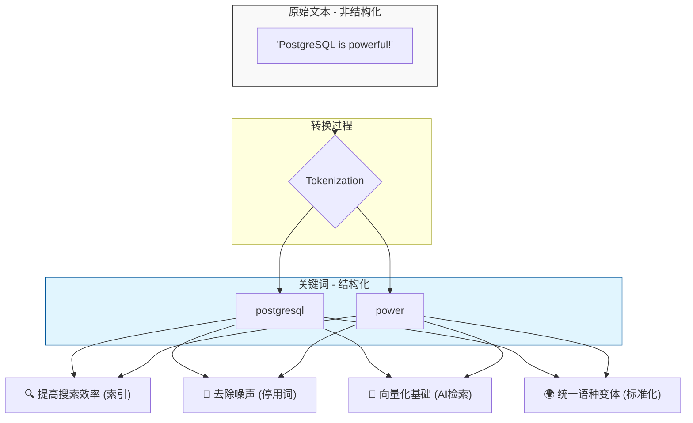


### 2. `pg_tokenizer` 技术流水线（原理详解图）

这是文章中最核心的技术流程，展示了文本是如何像在工厂流水线上一样被一步步处理的。

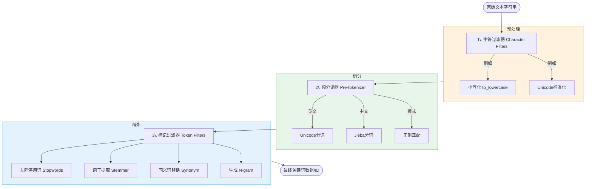


### 3. 中英文处理逻辑对比图

针对不同语言，流水线的侧重点完全不同。这个图表能帮学生直观理解为什么中文需要特殊算法。

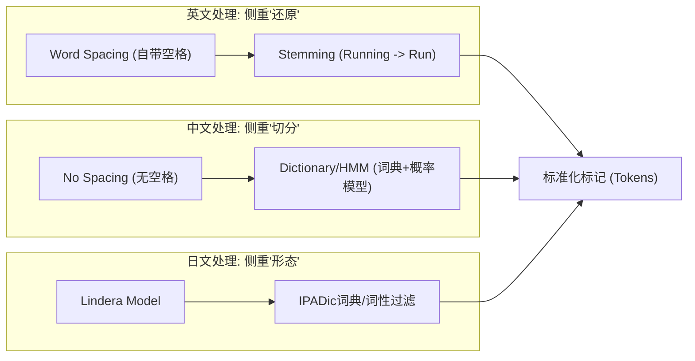


### 给学生的学习建议（配合图表使用）：

1. **看图 2 理解“顺序”**：告诉学生，这个过程是不可逆且有先后顺序的。如果先去掉了所有符号，后续基于正则的切分可能就会失效。
2. **词干提取（Stemming）的重点**：强调它并不是把单词变正确，而是把它们变“统一”。比如 `databases` 变成 `databas` 虽然不是正确单词，但能保证搜索 `database` 时也能搜到它。
3. **Jieba 的三种模式**：
* **精确模式**：像切蛋糕，每块都要准。
* **全模式**：像切丝，所有可能的组合都切出来。
* **搜索模式**（课件重点）：在精确模式基础上对长词再切分，提高搜索到的机会。

---

**停用词过滤（Stopwords）的“信息降噪”原理图**，以及**词干提取（Stemming）的“时空还原”演示图**。

### 1. 停用词过滤：信息的“降噪与提纯”

学生常问：“为什么要删掉这些词？”这张图展示了停用词过滤如何帮助计算机聚焦于**高价值语义**。

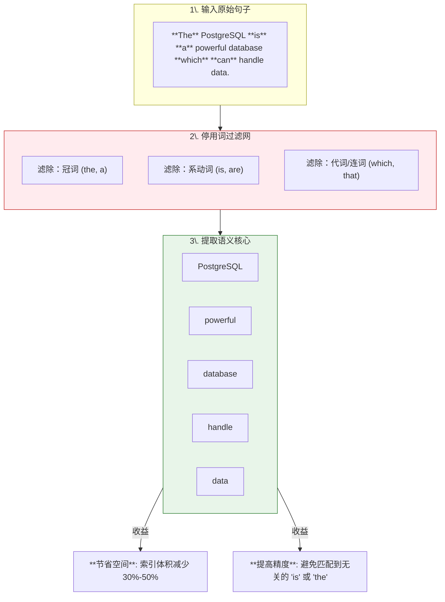


### 2. 词干提取：单词的“时空还原”

英文单词有各种时态、单复数变化。这张图通过 **Porter2 算法** 的逻辑，展示了如何将不同形态的词汇收敛到同一个“根”上，解决“搜 search 搜不到 searching”的痛点。

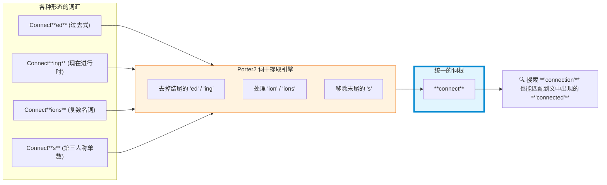


### 教学重点总结（供老师讲解参考）：

* **关于停用词（Stopwords）**：
* **比喻**：就像我们发短信，为了省钱会省略“的、了、呢”，但对方依然能读懂核心意思。
* **注意点**：停用词是**语境相关**的。在普通搜索中“to”是停用词，但在搜索莎士比亚名句“To be or not to be”时，如果过滤了停用词，搜索结果就会变成空白。


* **关于词干提取（Stemming）**：
* **原理**：它主要是一种**基于规则的“砍掉”后缀**的方法（Heuristic process）。
* **有趣事实**：它不一定生成一个“真正的单词”。比如文章提到的 `databases` -> `databas`。虽然 `databas` 在字典里查不到，但只要所有相关的词都变成了 `databas`，搜索就能精准匹配。这就是为什么它被称为“提取词干”而不是“字典还原（Lemmatization）”。

---

**倒排索引（Inverted Index）**。它是搜索引擎能够实现“毫秒级响应”的真正秘密。


### 1. 倒排索引：从“文档找词”到“词找文档”

这个图表展示了数据库如何重新组织数据。左边是原始存储方式，右边是优化后的倒排结构。

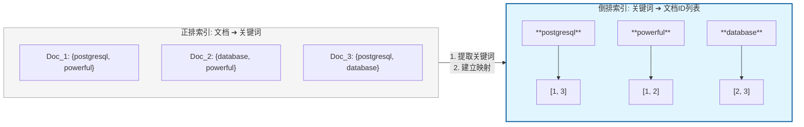


### 2. 搜索查询逻辑（逻辑门操作）

当用户搜索多个关键词时，数据库实际上是在做**数学上的集合运算**。

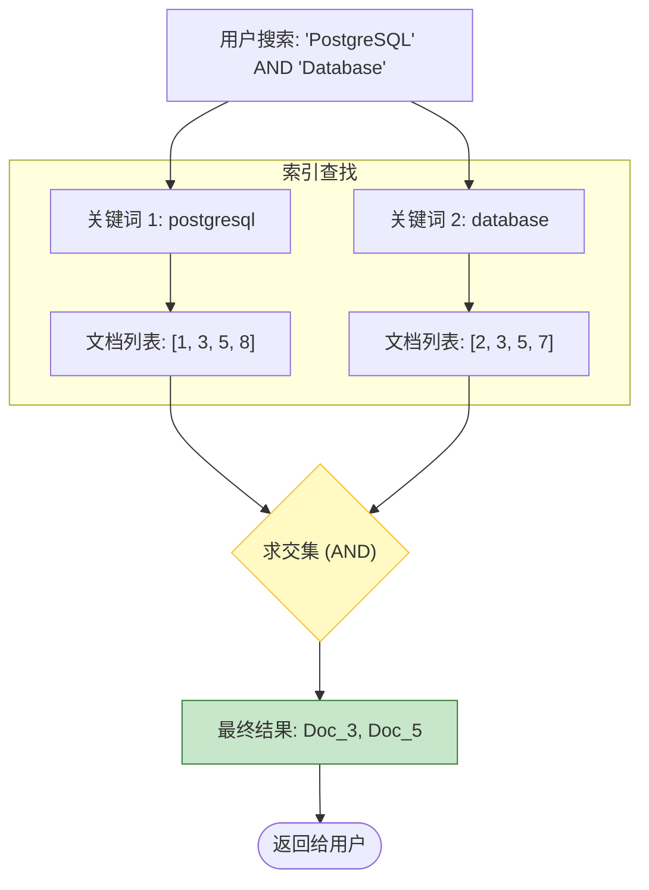


### 教学重点总结（倒排索引的“三个为什么”）：

1. **为什么叫“倒排”？**
* **正排**（Normal）：书的**目录**（第一章在第几页）。
* **倒排**（Inverted）：书末尾的**索引表**（某个专业术语出现在哪几页）。搜索时，我们是拿着“术语”找“页码”，所以倒排才是搜索标配。


2. **为什么搜索快？**
* 如果没有倒排索引，数据库必须扫描每一行（Full Table Scan），对比每个单词。
* 有了倒排索引，数据库直接定位到关键词，像翻字典一样快。


3. **实践课中的联系**：
* 在 PostgreSQL 中，这种倒排索引通常通过 **GIN (Generalized Inverted Index)** 索引来实现。
* 上节课提到的 `pg_tokenizer` 生成的关键词数组，最终就是被塞进 GIN 索引的这些“列表”里。

---

理解 BM25, 就能理解搜索引擎“为什么搜得准”的关键。


### 1. BM25 核心思想：相关性=词频 x 稀有度 x 文档匹配度

这张图将 BM25 的复杂公式分解成三个学生容易理解的直观概念。

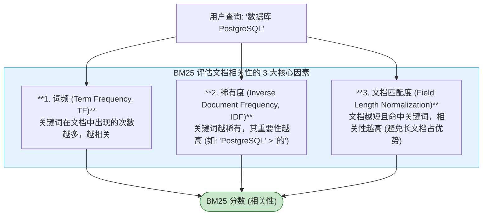


### 2. TF 与 文档长度：平衡“啰嗦”与“精炼”

这个图表专门解释了 BM25 如何巧妙地处理文档长度，避免“长文档”天然具有更多关键词的优势。

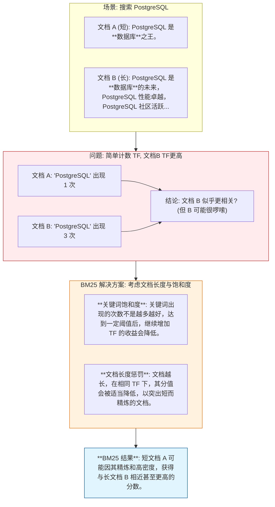


### 教学重点总结（BM25 的实用哲学）：

1. **BM25 不是“越多次越好”**：
* 学生很容易误以为关键词出现次数越多越好。但 BM25 考虑了“饱和度”，就像喝水，喝到一定程度就饱了，再喝多反而不好。
* **比喻**：一篇论文里“量子力学”出现 5 次，比出现 50 次的八股文更可能真正相关。


2. **BM25 鼓励“精炼”**：
* 它会适当“惩罚”那些过长的文档。这符合直觉：如果一个很短的文档完美回答了问题，它的相关性通常高于一个包含同样答案但又长又啰嗦的文档。


3. **实践中的应用**：
* 在实际搜索引擎（如 Lucene, Elasticsearch, PostgreSQL 的全文检索）中，BM25 都是默认或核心的排序算法。
* 数据库在执行全文检索时，不仅要找到包含关键词的文档，还要用 BM25 这样的算法对它们进行**相关性排序**，决定哪个文档排在前面。
  
  
#### [PolarDB 学习图谱](https://www.aliyun.com/database/openpolardb/activity "8642f60e04ed0c814bf9cb9677976bd4")
  
  
#### [PostgreSQL 解决方案集合](../201706/20170601_02.md "40cff096e9ed7122c512b35d8561d9c8")
  
  
#### [德哥 / digoal's Github - 公益是一辈子的事.](https://github.com/digoal/blog/blob/master/README.md "22709685feb7cab07d30f30387f0a9ae")
  
  
#### [About 德哥](https://github.com/digoal/blog/blob/master/me/readme.md "a37735981e7704886ffd590565582dd0")
  
  

  
