## 大学生数据库实践课: 14.2 关键词检索   
      
### 作者      
digoal      
      
### 日期      
2025-12-11      
      
### 标签      
PostgreSQL , DuckDB , 语义搜索 , 向量搜索 , 关键词检索 , 全文检索 , 标量检索 , 混合搜索 , 多模态搜索 , 重排序 , embedding , document split , ORC , 大模型 , 多模态大模型 , Dify , 压力测试 , 索引优化 , 倒排向量索引 , Ivfflat , 图向量索引 , HNSW , DiskANN , 量化 , rabitq , sbq , 二值量化 , bm25 , 相关性 , 相似性 , 召回率 , pgbench , 数据集 , ann-benchmarks , 图搜索 , PGQ , 递归 , 深度优先 , 广度优先 , 最短路径 , N度关系 , LLM , Ollama      
      
----      
      
## 背景      
      
vectorchord-bm25 deepwiki:      
  
https://deepwiki.com/search/-1_f3be292e-5c15-458a-b70d-789f377523ab?mode=fast  
      
面向大学生通俗讲解以下内容:      
1、什么是关键词检索      
2、如何计算查询语句和文本的相关性      
3、bm25 相比其他全文检索的优势   
4、给出关键词检索的使用示例      
5、如何通过索引加速关键词搜索      
6、索引原理详解      
    
  
    
-----    
  
# 关键词检索通俗讲解  
  
关键词检索是一种通过查找文档中包含特定关键词来找到相关信息的技术。在 VectorChord-BM25 系统中，关键词检索通过 BM25 算法实现，这是一种现代搜索引擎广泛使用的相关性排序算法。    
  
## 核心概念  
  
### 1. 文档向量化  
  
系统首先将文本文档转换为 `bm25vector` 类型，这是一个稀疏向量，存储词汇ID及其出现频率。例如：  
  
```sql  
SELECT tokenize('A quick brown fox jumps over the lazy dog.', 'bert')::bm25vector;  
-- 输出: {1012:1, 1037:1, 1996:1, 2058:1, 2829:1, 3899:1, 4248:1, 4419:1, 13971:1, 14523:1}  
```  
  
这里 `1012:1` 表示词汇ID为1012的词在文档中出现1次。    
  
### 2. 查询处理  
  
查询也被转换为相同的向量格式，然后使用 `to_bm25query()` 函数创建查询对象：    
  
```sql  
to_bm25query('documents_embedding_bm25', tokenize('PostgreSQL', 'bert'))  
```  
  
### 3. 相关性计算  
  
使用 `<&>` 操作符计算文档与查询的BM25相关性分数。分数为负值，越负表示相关性越高：    
  
```sql  
SELECT id, passage, embedding <&> to_bm25query('documents_embedding_bm25', tokenize('PostgreSQL', 'bert')) AS bm25_score   
FROM documents;  
```  
  
## 工作流程  
  
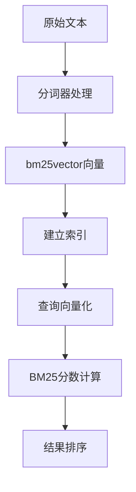
  
1. **文本预处理**：使用分词器（如BERT）将文本切分为词汇  
2. **向量化**：将词汇转换为ID并统计频率，形成稀疏向量  
3. **索引建立**：为向量列创建BM25索引以加速搜索    
4. **查询执行**：计算查询向量与文档向量的BM25相关性分数  
5. **结果排序**：按分数从高到低返回最相关的文档  
  
## BM25算法特点  
  
BM25考虑了以下因素来评估相关性：    
  
- **词频**：关键词在文档中的出现次数  
- **文档频率**：关键词在整个文档集合中的分布情况  
- **文档长度**：对长文档进行归一化处理  
  
这使得BM25比简单的关键词匹配更智能，能够识别真正相关的文档而不仅仅是包含关键词的文档。  
  
## Notes  
  
- VectorChord-BM25 是 PostgreSQL 的扩展，专门用于实现 BM25 排序算法  
- 系统支持多种分词器，包括预训练模型（如BERT）和自定义模型  
- BM25 分数设计为负值是为了方便使用 `ORDER BY` 直接获取最相关结果  
- 该系统相比 PostgreSQL 原生的全文搜索提供了更现代的相关性排序方法  
  
  
  
-----    
  
# 查询语句和文本相关性计算  
  
## BM25相关性分数计算原理  
  
在VectorChord-BM25系统中，查询语句和文本的相关性通过BM25算法计算。核心计算函数是 `search_bm25query`，它接收文档向量和查询对象，返回相关性分数。    
  
### 计算公式核心要素  
  
BM25算法考虑三个关键因素来评估相关性：    
  
1. **词频(TF)** ：查询词在文档中出现的次数  
2. **逆文档频率(IDF)** ：查询词在整个文档集合中的稀有程度  
3. **文档长度归一化**：调整不同长度文档的分数  
  
### 实际计算过程  
  
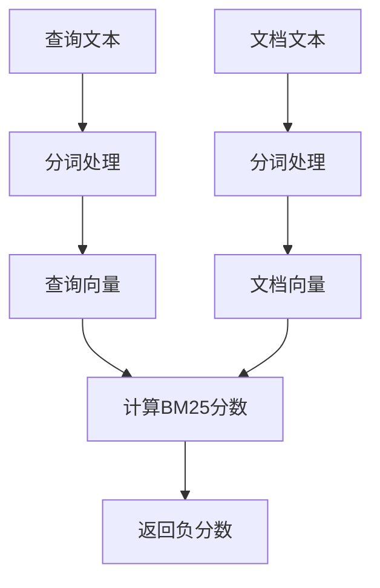
  
计算步骤如下：  
  
1. **向量化转换**：查询和文档都转换为 `bm25vector` 格式，存储词汇ID和频率    
  
2. **统计信息获取**：从索引元数据中获取文档总数(`doc_cnt`)和平均文档长度(`avgdl`)    
  
3. **分数计算**：调用 `bm25_score_batch` 函数计算最终分数    
  
4. **结果返回**：返回负值分数，便于直接使用 `ORDER BY` 排序    
  
### 代码示例  
  
```sql  
-- 计算查询"PostgreSQL"与所有文档的相关性  
SELECT id, passage,   
       embedding <&> to_bm25query('documents_embedding_bm25', tokenize('PostgreSQL', 'bert')) AS bm25_score  
FROM documents  
ORDER BY bm25_score;  
```  
  
`<&>` 操作符会调用 `search_bm25query` 函数，返回负的BM25分数。    
  
### 优化算法  
  
系统使用Block-WeakAnd算法来优化大规模文档的相关性计算：  
  
- **块级最大分数**：每个数据块预先计算最大可能分数，用于快速跳过不相关块    
- **动态阈值**：维护当前top-k结果的阈值，提前终止不可能超过阈值的计算    
- **多词查询优化**：对多个查询词进行并行处理和合并    
  
## Notes  
  
- BM25分数为负值是设计选择，使得最相关文档排在前面  
- 计算依赖于全局统计信息，需要先建立索引  
- 系统支持单词和多词查询的优化计算路径  
- 相关性计算考虑了文档长度，避免长文档获得不公平的高分  
  
  
-----    
  
# BM25相比其他全文检索的优势  
  
BM25算法在现代信息检索系统中相比传统全文检索方法具有显著优势，主要体现在相关性排序的准确性和查询效率上。    
  
## 相比PostgreSQL原生全文搜索的优势  
  
### 1. 更现代的相关性排序  
PostgreSQL原生全文搜索使用`tsvector`数据类型和GIN索引，但缺乏现代相关性排序方法。它需要检索所有匹配文档后使用`ts_rank`重新排序，这种方法效率低下且可能掩盖最相关的结果。    
  
### 2. 专门的BM25算法实现  
VectorChord-BM25从零开始实现了Block-WeakAnd算法，构建为自定义操作符和索引（类似于pgvector），专门用于加速查询。这种设计使得相关性计算更加精确和高效。    
  
## 相比其他解决方案的优势  
  
### 1. 更轻量级的设计  
与ParadeDB这种功能完整的PostgreSQL替代方案不同，VectorChord-BM25专注于在PostgreSQL内提供BM25排名功能。ParadeDB将全文搜索操作卸载到Tantivy，而VectorChord-BM25直接在PostgreSQL内部实现，更加轻量级。    
  
### 2. 原生API支持  
VectorChord-BM25提供了更原生和直观的API，使用标准的PostgreSQL语法，而不是像ParadeDB那样使用不同的查询和过滤语法。这使得开发者更容易集成和使用。    
  
## 技术优势总结  
  
| 特性 | PostgreSQL原生 | ParadeDB | VectorChord-BM25 |  
|------|---------------|----------|------------------|  
| 相关性算法 | ts_rank（传统） | BM25 | BM25（Block-WeakAnd） |  
| 查询语法 | 标准SQL | 自定义语法 | 标准SQL |  
| 实现方式 | 内置 | 外部引擎(Tantivy) | PostgreSQL扩展 |  
| 性能优化 | 基础 | 高级 | 专门优化 |  
  
## Notes  
  
- BM25分数设计为负值是为了方便使用`ORDER BY`直接获取最相关结果    
- 系统支持多种分词器，包括预训练模型（如BERT）和自定义模型    
- VectorChord-BM25专门实现了Block-WeakAnd算法来优化大规模文档的查询性能    
  
  
-----    
  
# 关键词检索使用示例  
  
## 基础示例：英文文本检索  
  
### 1. 环境准备  
  
首先创建必要的扩展和分词器：    
  
```sql  
CREATE EXTENSION IF NOT EXISTS pg_tokenizer CASCADE;  
CREATE EXTENSION IF NOT EXISTS vchord_bm25 CASCADE;  
```  
  
### 2. 创建文档表  
  
创建一个包含文本和向量化字段的表：    
  
```sql  
CREATE TABLE documents (  
    id SERIAL PRIMARY KEY,  
    passage TEXT,  
    embedding bm25vector  
);  
```  
  
### 3. 插入示例数据  
  
插入一些关于PostgreSQL和全文搜索的文档：    
  
```sql  
INSERT INTO documents (passage) VALUES  
('PostgreSQL is a powerful, open-source object-relational database system. It has over 15 years of active development.'),  
('Full-text search is a technique for searching in plain-text documents or textual database fields. PostgreSQL supports this with tsvector.'),  
('BM25 is a ranking function used by search engines to estimate the relevance of documents to a given search query.'),  
('PostgreSQL provides many advanced features like full-text search, window functions, and more.');  
```  
  
### 4. 创建分词器  
  
使用BERT模型创建分词器：    
  
```sql  
SELECT create_tokenizer('bert', $$  
model = "bert_base_uncased"  
$$);  
```  
  
### 5. 文档向量化  
  
将文本转换为BM25向量：    
  
```sql  
UPDATE documents SET embedding = tokenize(passage, 'bert');  
```  
  
### 6. 创建索引  
  
为向量列创建BM25索引以加速搜索：    
  
```sql  
CREATE INDEX documents_embedding_bm25 ON documents USING bm25 (embedding bm25_ops);  
```  
  
### 7. 执行关键词检索  
  
搜索包含"PostgreSQL"的文档并按相关性排序：    
  
```sql  
SELECT id, passage,   
       embedding <&> to_bm25query('documents_embedding_bm25', tokenize('PostgreSQL', 'bert')) AS rank  
FROM documents  
ORDER BY rank  
LIMIT 10;  
```  
  
## 高级示例  
  
### 1. 带过滤条件的检索  
  
可以在检索时添加WHERE条件进行过滤：    
  
```sql  
WITH results AS (  
    SELECT id, passage,   
           embedding <&> to_bm25query('documents_embedding_bm25', tokenize('Post', 'bert')) AS rank  
    FROM documents  
    WHERE condition = TRUE  
    ORDER BY rank  
    LIMIT 10  
)  
SELECT COUNT(1) FROM results;  
```  
  
### 2. 中文文本检索  
  
对于中文文本，使用jieba分词器：    
  
```sql  
-- 创建使用jieba的文本分析器  
SELECT create_text_analyzer('text_analyzer1', $$  
[pre_tokenizer.jieba]  
$$);  
  
-- 创建自定义分词器  
SELECT create_custom_model_tokenizer_and_trigger(  
    tokenizer_name => 'tokenizer1',  
    model_name => 'model1',  
    text_analyzer_name => 'text_analyzer1',  
    table_name => 'documents',  
    source_column => 'passage',  
    target_column => 'embedding'  
);  
  
-- 搜索中文关键词  
SELECT id, passage,   
       embedding <&> to_bm25query('documents_embedding_bm25', tokenize('人', 'tokenizer1')) AS rank  
FROM documents  
ORDER BY rank  
LIMIT 10;  
```  
  
### 3. 使用预分词数组  
  
可以直接使用词汇ID数组进行搜索：    
  
```sql  
-- 将整数数组转换为bm25vector  
SELECT '{1, 2, 1}'::int[]::bm25vector;  
-- 输出: {1:2, 2:1}  
  
-- 使用预分词的向量进行搜索  
SELECT id, passage,  
       embedding <&> to_bm25query('documents_embedding_bm25', '{1,2,1}'::int[]::bm25vector) AS rank  
FROM documents  
ORDER BY rank;  
```  
  
## 实际应用场景  
  
### 1. 文档搜索系统  
  
```sql  
-- 搜索技术文档  
SELECT title, content,   
       embedding <&> to_bm25query('docs_index', tokenize('database optimization', 'bert')) AS relevance  
FROM technical_documents  
WHERE category = 'database'  
ORDER BY relevance  
LIMIT 20;  
```  
  
### 2. 电商商品搜索  
  
```sql  
-- 搜索商品  
SELECT product_name, description, price,  
       embedding <&> to_bm25query('products_index', tokenize('wireless headphones', 'bert')) AS score  
FROM products  
WHERE price BETWEEN 50 AND 200  
ORDER BY score, price  
LIMIT 10;  
```  
  
## 性能优化提示  
  
1. **预加载模型**：对于频繁使用的模型，可以预加载以减少首次查询延迟    
  
```sql  
SELECT add_preload_model('bert');  
```  
  
2. **调整返回结果数量**：通过设置`bm25_limit`控制最大返回结果数    
  
```sql  
SET bm25_catalog.bm25_limit = 1000;  
```  
  
3. **启用/禁用预过滤**：根据查询模式选择是否启用预过滤    
  
```sql  
SET bm25_catalog.enable_prefilter = on;  
```  
  
## Notes  
  
- BM25分数为负值，分数越小表示相关性越高  
- 系统支持多种语言，需要选择合适的分词器  
- 索引建立后才能进行有效的相关性计算  
- 可以结合WHERE条件实现更精确的搜索  
  
  
-----    
  
# 通过索引加速关键词搜索  
  
## 索引的基本概念  
  
索引就像书的目录，让我们能够快速找到包含特定关键词的文档，而不需要逐页翻阅整本书。在VectorChord-BM25中，索引为`bm25vector`列创建，存储了词汇和文档的映射关系以及统计信息。    
  
## BM25索引结构  
  
### 1. 索引创建  
  
```sql  
CREATE INDEX documents_embedding_bm25 ON documents USING bm25 (embedding bm25_ops);  
```  
  
这个命令创建一个BM25索引，使用`bm25_ops`操作符类支持`<&>`操作符进行相关性排序。    
  
### 2. 索引内部结构  
  
BM25索引采用分层结构设计：  
  
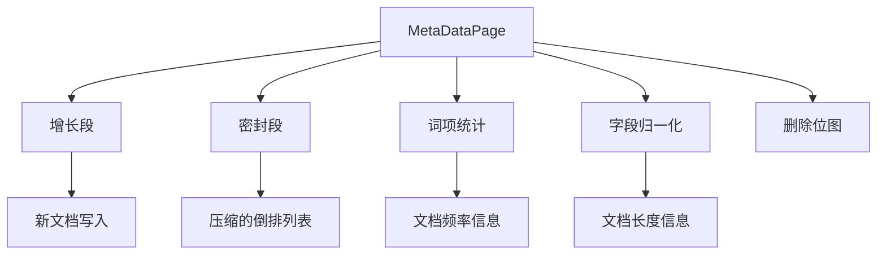
  
**核心组件**：  
- **元数据页**：存储文档总数、平均文档长度等全局统计信息    
- **增长段**：接收新文档的写入，使用链表结构存储  
- **密封段**：只读的压缩数据，优化查询性能  
- **词项统计**：记录每个词在多少文档中出现  
- **字段归一化**：存储文档长度信息用于BM25计算  
  
## 索引加速搜索的原理  
  
### 1. Block-WeakAnd算法  
  
索引使用Block-WeakAnd算法实现高效的top-k检索：  
  
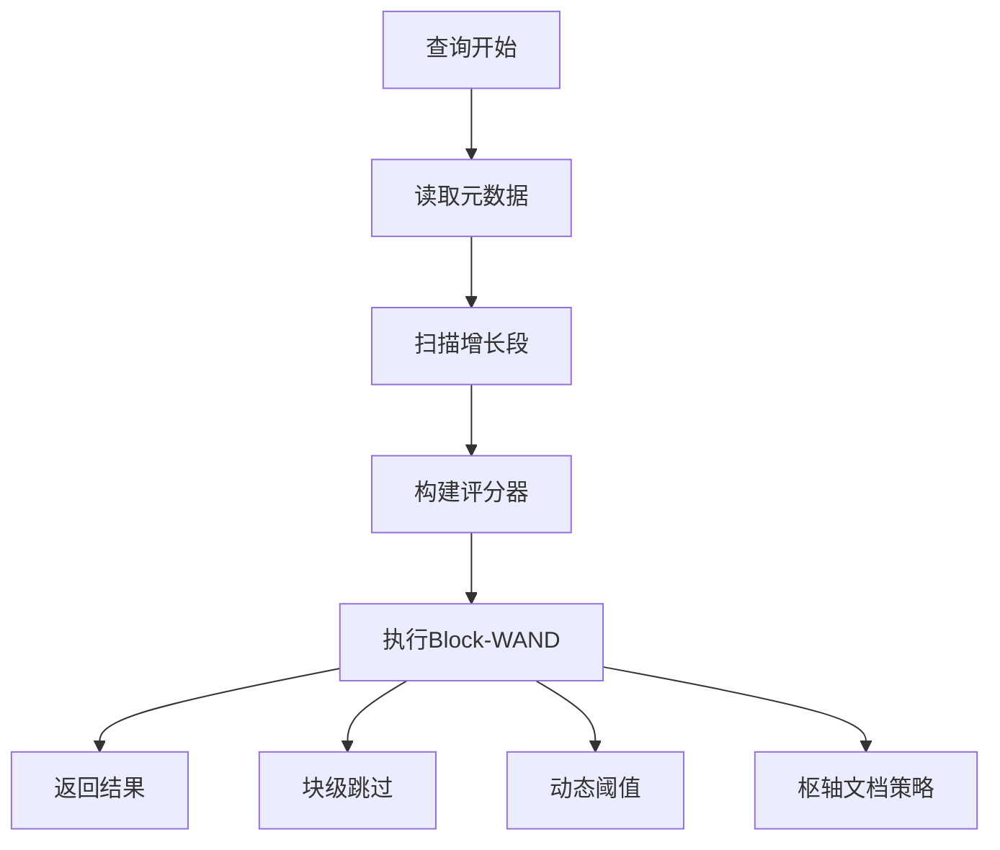
  
**关键优化技术**：  
- **块级跳过**：每个数据块预计算最大可能分数，跳过不可能超过阈值的块    
- **动态阈值**：维护当前top-k结果的阈值，提前终止低分计算    
- **枢轴文档策略**：智能选择候选文档进行评分    
  
### 2. 查询执行流程  
  
```sql  
-- 使用索引的查询  
SELECT id, passage, embedding <&> to_bm25query('documents_embedding_bm25', tokenize('PostgreSQL', 'bert')) AS rank  
FROM documents  
ORDER BY rank  
LIMIT 10;  
```  
  
执行过程：  
1. **初始化扫描**：`ambeginscan`创建扫描器状态    
2. **设置查询参数**：`amrescan`提取查询向量和索引信息    
3. **执行主扫描**：`scan_main`协调Block-WAND算法执行    
4. **返回结果**：按相关性分数排序返回文档ID  
  
## 性能优化特性  
  
### 1. 单词查询优化  
  
对于单个查询词，使用简化的`block_wand_single`函数，避免复杂的多词处理开销：    
  
### 2. 预过滤机制  
  
当启用`enable_prefilter`时，系统在评分前检查文档的MVCC可见性，避免对不可见文档进行无效计算：    
  
### 3. 暴力搜索模式  
  
设置`bm25_limit = -1`时，系统会评分所有文档而不是使用top-k优化，适用于需要完整结果集的场景：    
  
## 索引维护  
  
### 1. 文档插入  
  
新文档首先写入增长段，当增长段达到`segment_growing_max_page_size`（默认4096页）时，会自动转换为密封段：    
  
### 2. 段转换过程  
  
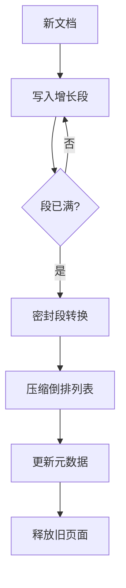
  
## 实际应用建议  
  
### 1. 索引配置  
  
```sql  
-- 调整返回结果数量  
SET bm25_catalog.bm25_limit = 1000;  
  
-- 启用预过滤（适合多事务环境）  
SET bm25_catalog.enable_prefilter = on;  
  
-- 调整段大小（根据写入频率）  
SET bm25_catalog.segment_growing_max_page_size = 8192;  
```  
  
### 2. 性能监控  
  
索引性能主要取决于：  
- **查询选择性**：查询词越稀有，索引效果越好  
- **结果集大小**：较小的`LIMIT`值能更好地利用top-k优化  
- **文档更新频率**：频繁更新会增加段转换开销  
  
## Notes  
  
- BM25索引专门为相关性排序优化，不同于传统的B-tree或GIN索引  
- 索引会占用额外存储空间，但能显著提升查询性能  
- 索引在创建时会扫描整个表，大表创建时间较长  
- 系统支持并行查询，可以进一步提升搜索性能  
  
  
  
-----    
  
# 索引原理详解  
  
## 索引的整体架构  
  
BM25索引是一个专门为相关性排序设计的倒排索引，它将"词汇到文档"的映射关系存储在高效的数据结构中。    
  
### 核心组件  
  
索引由多个关键部分组成：  
  
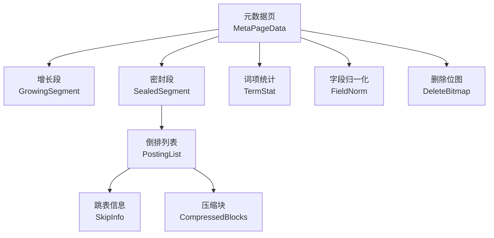
  
**元数据页**是索引的控制中心，存储全局统计信息如文档总数(`doc_cnt`)、平均文档长度(`avgdl`)等  。  
  
## 倒排索引的实现  
  
### 1. 倒排列表结构  
  
每个词汇都有一个倒排列表，记录包含该词汇的所有文档：  
  
```rust  
// 倒排列表的元数据结构  
struct PostingTermMetaData {  
    skip_info_blkno: u32,        // 跳表信息位置  
    block_data_blkno: u32,       // 压缩块数据位置    
    block_count: u32,            // 块数量  
    unfulled_docid[128],         // 未压缩的文档ID  
    unfulled_freq[128]           // 未压缩的词频  
}  
```  
  
### 2. 压缩存储策略  
  
倒排列表使用128个文档为单位的块进行压缩存储：  
  
- **Delta编码**：文档ID存储为与前一个ID的差值  
- **位打包**：根据最大值确定所需位数，紧凑存储  
- **跳表索引**：每个块记录最大BM25分数，支持快速跳过  
  

  
## Block-WeakAnd算法的索引利用  
  
### 1. 块级最大分数  
  
每个压缩块预先计算可能的最大BM25分数：  
  
```rust  
// 跳过分数过低的块  
while scorer.posting.block_max_score(&scorer.weight) <= computer.threshold() {  
    if !scorer.posting.next_block() {  
        break 'outer;  
    }  
}  
```  
  
### 2. 动态阈值机制  
  
算法维护当前top-k结果的阈值，任何块的最大分数低于阈值都会被跳过。  
  
### 3. 枢轴文档策略  
  
通过智能选择候选文档，避免不必要的解压和计算。  
  
## 索引的创建过程  
  
### 1. 构建阶段  
  
索引创建时扫描整个表，为每个文档建立向量表示：  
  
```rust  
// 处理每个文档的回调函数  
fn build_callback(index, ctid, datum, is_null, state) {  
    let vector = Bm25VectorInput::from_datum(*datum, *is_null);  
    let id = item_pointer_to_u64(ctid.read());  
    state.builder.insert(id, vector.borrow());  
}  
```  
  
### 2. 序列化存储  
  
构建完成后，将所有数据结构写入磁盘：  
  
- 创建删除位图  
- 写入词项统计  
- 序列化倒排列表  
- 更新元数据页  
  
## 索引的维护机制  
  
### 1. 双段架构  
  
索引采用增长段和密封段的双段设计：  
  
- **增长段**：接收新文档写入，结构简单  
- **密封段**：只读压缩数据，查询优化  
  
### 2. 段转换过程  
  
当增长段达到`segment_growing_max_page_size`（默认4096页）时自动转换：  
  
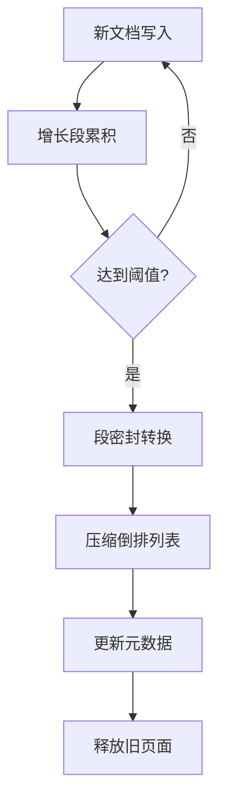
  
### 3. 并发控制  
  
段转换时使用条件锁确保并发安全。  
  
## 查询执行流程  
  
### 1. 扫描初始化  
  
查询开始时创建扫描器状态。  
  
### 2. 参数设置  
  
提取查询向量和索引信息。  
  
### 3. 主扫描执行  
  
协调Block-WAND算法，处理增长段和密封段。  
  
## 性能优化特性  
  
### 1. 存储优化  
  
- **虚拟页面系统**：管理跨页数据结构  
- **压缩算法**：Delta-bitpacking减少存储空间  
- **块大小选择**：128文档平衡压缩和访问效率  
  
### 2. 查询优化  
  
- **预过滤机制**：避免对不可见文档评分  
- **单查询优化**：`block_wand_single`简化单词条处理  
- **暴力模式**：`bm25_limit = -1`时返回所有结果  
  
## Notes  
  
- BM25索引专为相关性排序优化，不同于传统B-tree索引  
- 索引使用PostgreSQL的扩展机制，深度集成到查询优化器  
- Block-WeakAnd算法是索引高效查询的核心技术  
- 双段架构平衡了写入性能和查询效率  
  
    
---  

**要义图示**  

### 1. 关键词检索：从“文本”到“向量”

关键词检索的第一步是将人类能读懂的文字，变成计算机能计算的数字（向量）。

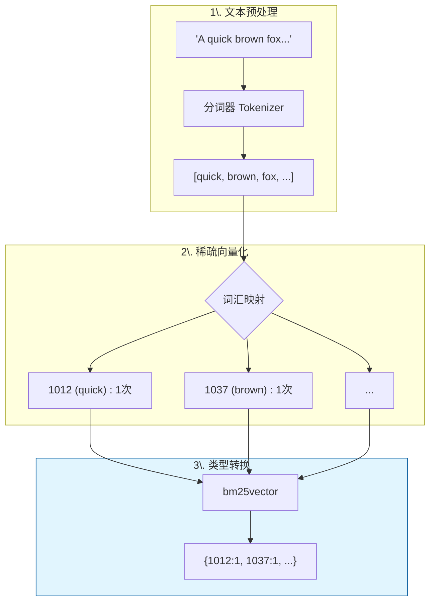

---

### 2. BM25 相关性计算的核心：三大维度

为什么有些文档排在前面？BM25 算法考虑了这三个核心变量来平衡得分。

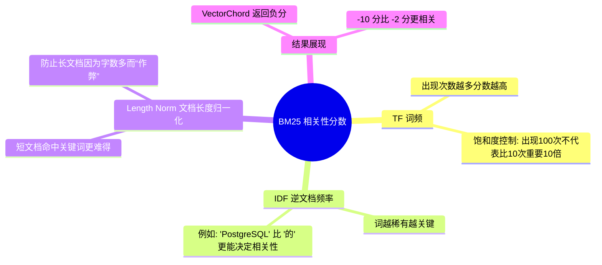


### 3. BM25 索引结构：双段架构设计

为了平衡“快速写入”和“快速查询”，索引被设计成了“增长段”和“密封段”两部分。

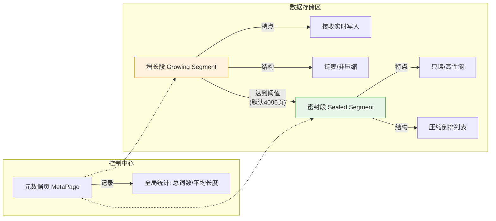


### 4. 搜索加速黑科技：Block-WeakAnd (WAND) 算法

这是索引能跑得快的核心逻辑。它不再傻傻地遍历所有文档，而是学会了“跳过”。

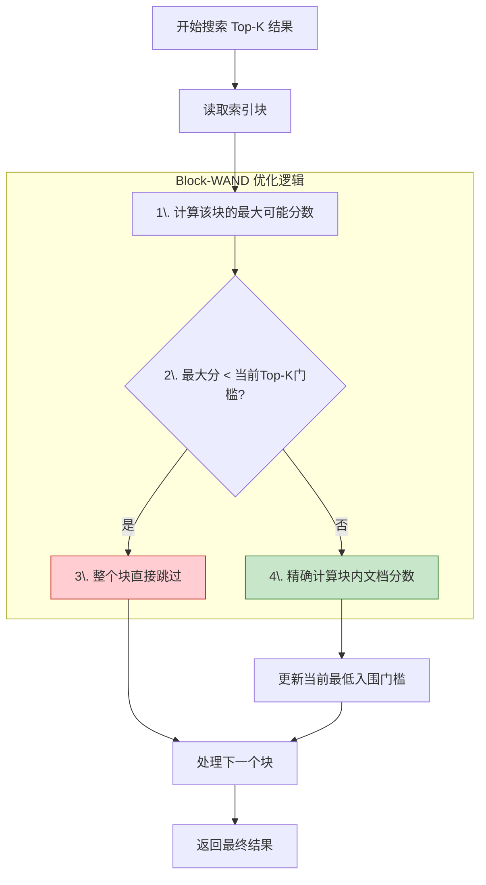


### 给同学的学习锦囊：

1. **关于负分**：为什么要返回 `-10.5` 这种负分？因为在 SQL 中 `ORDER BY` 默认是升序（从小到大）。把分数做成负的，最小的负数（绝对值最大的）就会排在最前面，非常巧妙。
2. **关于索引维护**：新插入的数据都在“增长段”，就像在草稿纸上写字；等攒够了，数据库会把它们整理成“密封段”，就像打印成书。查询时，两者都会被搜索。
3. **WAND 算法**：它的本质是“如果一个文档所在的这一组里，最厉害的人（最大可能分）都达不到及格线，那这组人我就全都不看了”。

---

两个支撑起高性能索引的“底层黑科技”：**倒排列表的压缩算法（Delta-Bitpacking）和查询优化参数的影响**。


### 1. 倒排列表压缩：Delta + 位打包 (Bitpacking)

为了节省磁盘 I/O，数据库不会直接存储文档 ID，而是存储它们的“间距”。

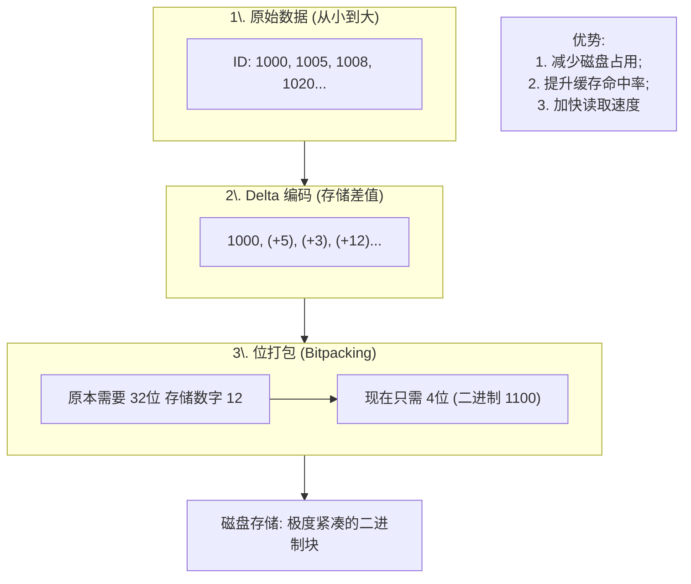


### 2. 查询调优参数：平衡“精度”与“速度”

在数据库实践中，调节参数是优化性能的关键。这里展示了文章提到的三个核心参数如何改变搜索行为。


| 参数名 | 默认值/范围 | 作用说明 | 就像是在... |
| :--- | :--- | :--- | :--- |
| **`bm25_limit`** | `1000` | 限制 Top-K 检索的数量。设置 `-1` 则变为暴力搜索。 | 决定复试入围名单的人数。 |
| **`enable_prefilter`** | `on / off` | 是否在评分前检查文档可见性（MVCC）。 | 先查身份证（可见性），再决定是否给面试机会。 |
| **`segment_growing_...`** | `4096 (pages)` | 增长段转密封段的阈值。 | 决定笔记记满多少页才“装订成书”。 |


### 3. WAND 算法的“及格线”动态变化图

Block-WAND 为什么越搜越快？因为它维护了一个动态的“入围门槛”。

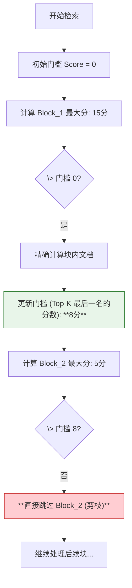


### 实验课调试建议：

1. **观察 `EXPLAIN ANALYZE`** ：在执行查询前加上这个命令，让学生观察使用了索引和没用索引时，`Execution Time` 的巨大差异。
2. **暴力搜索测试**：尝试 `SET bm25_catalog.bm25_limit = -1;`。在数据量很大时，查询会明显变慢，这能让学生直观感受到 **Top-K 优化算法** 的价值。
3. **并发测试**：在插入数据的同时进行查询，观察“增长段”和“密封段”共存时的系统表现。

  
  
#### [PolarDB 学习图谱](https://www.aliyun.com/database/openpolardb/activity "8642f60e04ed0c814bf9cb9677976bd4")
  
  
#### [PostgreSQL 解决方案集合](../201706/20170601_02.md "40cff096e9ed7122c512b35d8561d9c8")
  
  
#### [德哥 / digoal's Github - 公益是一辈子的事.](https://github.com/digoal/blog/blob/master/README.md "22709685feb7cab07d30f30387f0a9ae")
  
  
#### [About 德哥](https://github.com/digoal/blog/blob/master/me/readme.md "a37735981e7704886ffd590565582dd0")
  
  

  
