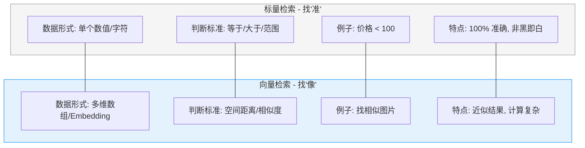
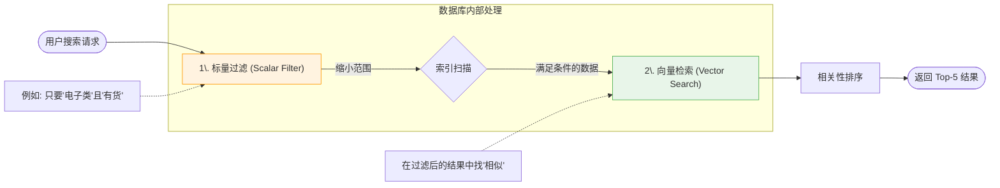
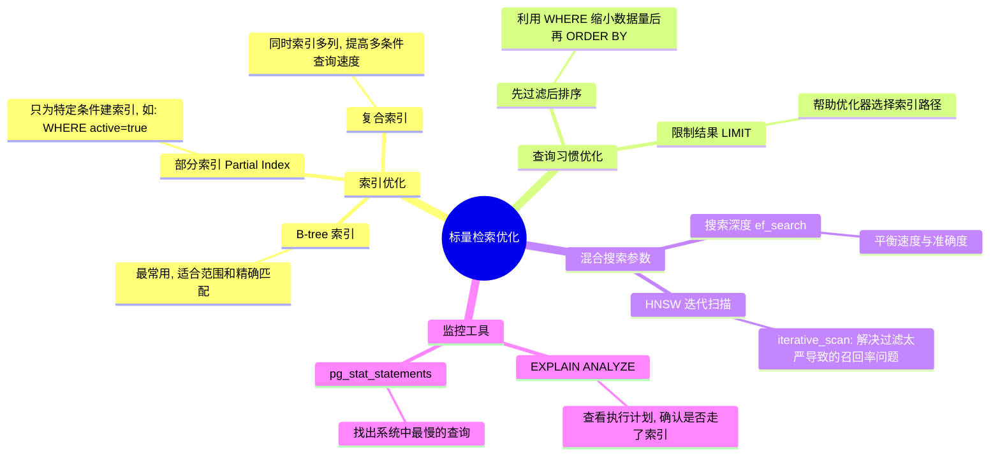

## 大学生数据库实践课: 15 标量检索  
  
### 作者  
digoal  
  
### 日期  
2025-12-11  
  
### 标签  
PostgreSQL , DuckDB , 语义搜索 , 向量搜索 , 关键词检索 , 全文检索 , 标量检索 , 混合搜索 , 多模态搜索 , 重排序 , embedding , document split , ORC , 大模型 , 多模态大模型 , Dify , 压力测试 , 索引优化 , 倒排向量索引 , Ivfflat , 图向量索引 , HNSW , DiskANN , 量化 , rabitq , sbq , 二值量化 , bm25 , 相关性 , 相似性 , 召回率 , pgbench , 数据集 , ann-benchmarks , 图搜索 , PGQ , 递归 , 深度优先 , 广度优先 , 最短路径 , N度关系 , LLM , Ollama  
  
----  
  
## 背景  
  
pgvector deepwiki:  
  
https://deepwiki.com/search/-1_737ed9d0-6b48-44ff-8c60-ee69d45fa5bc?mode=fast  
  
面向大学生通俗讲解以下内容:    
1、什么是标量检索    
2、标量检索例子    
3、标量检索优化    
  
  
  
-----  
  
# 什么是标量检索  
  
标量检索是最基础、最常见的数据检索方式，它基于**单个数值**（标量）进行比较和匹配。  
  
## 核心概念  
  
**标量**：单个数值，如年龄、价格、分数、日期等  
**标量检索**：通过比较这些单个数值来查找数据  
  
## 与向量检索的对比  
  
| 检索类型 | 数据形式 | 比较方式 | 应用场景 |  
|---------|---------|---------|---------|  
| **标量检索** | 单个数值 | 精确匹配、范围比较 | 查找年龄>25的用户 |  
| **向量检索** | 多维数组 | 相似度计算 | 找相似图片、推荐商品 |  
  
## 实际例子  
  
在传统数据库中，我们经常使用标量检索：  
  
```sql  
-- 标量检索：查找价格小于100的商品  
SELECT * FROM products WHERE price < 100;  
  
-- 标量检索：查找特定日期的订单  
SELECT * FROM orders WHERE order_date = '2024-01-01';  
```  
  
而在pgvector中，向量检索则是：  
  
```sql  
-- 向量检索：查找与给定向量最相似的商品  
SELECT * FROM items ORDER BY embedding <-> '[3,1,2]' LIMIT 5;    
```  
  
## 为什么需要了解标量检索  
  
1. **基础性**：所有数据库系统都支持标量检索  
2. **高效性**：对于精确匹配和范围查询，标量检索通常更快  
3. **互补性**：在实际应用中，标量检索和向量检索经常结合使用  
  
例如，在pgvector中，你可以先用标量检索过滤数据，再用向量检索找相似项：  
  
```sql  
-- 先用标量检索过滤类别，再用向量检索找相似项  
SELECT * FROM items   
WHERE category_id = 123  -- 标量检索  
ORDER BY embedding <-> '[3,1,2]' LIMIT 5;  -- 向量检索    
```  
  
## Notes  
  
- 标量检索是数据库检索的基础，向量检索是其扩展  
- pgvector虽然专注于向量检索，但仍然支持PostgreSQL的所有标量检索功能  
- 在实际应用中，两种检索方式往往需要结合使用以达到最佳效果  
  
  
-----  
  
# 标量检索例子  
  
## 日常生活中的标量检索  
  
标量检索就像我们日常生活中的各种"筛选"活动：  
  
### 📚 图书馆找书  
- 按出版年份查找：找2020年后出版的书  
- 按页数查找：找少于300页的书  
- 按价格查找：找价格低于50元的书  
  
### 🛒 购物网站筛选  
- 价格区间：100-500元之间的商品  
- 评分筛选：4星以上的商品  
- 上市时间：最近7天上新的商品  
  
## pgvector中的标量检索例子  
  
### 1. 基础标量比较操作  
  
pgvector支持所有标准的标量比较操作符  ：  
  
```sql  
-- 等于比较  
SELECT '[1,2,3]'::vector = '[1,2,3]';  -- 返回 true  
SELECT '[1,2,3]'::vector = '[1,2]';     -- 返回 false  
  
-- 大小比较  
SELECT '[1,2,3]'::vector < '[1,2,4]';   -- 返回 true  
SELECT '[1,2,3]'::vector > '[1,2,2]';   -- 返回 true  
  
-- 范围比较  
SELECT '[1,2,3]'::vector <= '[1,2,3]';  -- 返回 true  
SELECT '[1,2,3]'::vector >= '[1,2]';    -- 返回 true  
```  
  
### 2. 实际应用场景  
  
#### 商品过滤  
```sql  
-- 按类别过滤（标量检索）  
SELECT * FROM items WHERE category_id = 123;  
  
-- 按价格范围过滤  
SELECT * FROM products WHERE price BETWEEN 100 AND 500;  
  
-- 按评分过滤  
SELECT * FROM reviews WHERE rating >= 4.0;  
```  
  
#### 结合向量检索的混合查询  
```sql  
-- 先用标量检索过滤类别，再用向量检索找相似项    
SELECT * FROM items   
WHERE category_id = 123  -- 标量检索：过滤类别  
ORDER BY embedding <-> '[3,1,2]' LIMIT 5;  -- 向量检索：找最相似的  
```  
  
### 3. 索引优化标量检索  
  
#### 创建标量索引  
```sql  
-- 为类别列创建B-tree索引  
CREATE INDEX ON items (category_id);  
  
-- 为多列创建复合索引  
CREATE INDEX ON items (location_id, category_id);  
```  
  
#### 部分索引（针对特定标量值）  
```sql  
-- 只为特定类别创建向量索引    
CREATE INDEX ON items USING hnsw (embedding vector_l2_ops) WHERE (category_id = 123);  
```  
  
### 4. 测试中的标量检索例子  
  
从测试文件可以看到，pgvector对向量类型也支持标量比较  ：  
  
```sql  
-- 向量的字典序比较  
SELECT vector_cmp('[1,2,3]', '[1,2,3]');  -- 返回 0 (相等)  
SELECT vector_cmp('[1,2,3]', '[0,0,0]');  -- 返回 1 (大于)  
SELECT vector_cmp('[0,0,0]', '[1,2,3]');  -- 返回 -1 (小于)  
```  
  
## 标量检索的性能特点  
  
### 何时使用标量检索  
- **精确匹配**：查找特定ID、日期、名称  
- **范围查询**：价格区间、时间范围、分数段  
- **排序需求**：按价格、时间、评分排序  
  
### 性能优势  
- **索引支持**：B-tree、Hash等传统索引  
- **精确结果**：100%准确，无近似  
- **低内存消耗**：不需要额外的向量存储  
  
## Notes  
  
- 标量检索是数据库的基础功能，pgvector完全兼容PostgreSQL的标量操作  
- 在实际应用中，建议先用标量检索缩小数据范围，再用向量检索提高精度  
- 标量索引和向量索引可以同时存在，优化不同类型的查询  
  
  
  
-----  
  
# 标量检索优化  
  
## 核心优化策略  
  
标量检索优化主要通过**创建合适的索引**和**优化查询方式**来提升性能。  
  
### 1. 索引优化 - 最基础的优化  
  
#### 创建B-tree索引  
```sql  
-- 为常用过滤字段创建索引  
CREATE INDEX ON items (category_id);  -- 单列索引  
CREATE INDEX ON items (location_id, category_id);  -- 复合索引    
```  
  
#### 部分索引 - 只为特定数据创建索引  
```sql  
-- 只为特定类别创建向量索引，节省空间  
CREATE INDEX ON items USING hnsw (embedding vector_l2_ops) WHERE (category_id = 123);    
```  
  
### 2. 查询优化 - 写出高效的SQL  
  
#### 好的查询习惯  
```sql  
-- ✓ 高效：先过滤再排序  
SELECT * FROM items   
WHERE category_id = 123  -- 标量过滤  
ORDER BY embedding <-> '[3,1,2]' LIMIT 5;  
  
-- ✗ 低效：没有LIMIT，无法使用索引  
SELECT * FROM items ORDER BY embedding <-> '[3,1,2]';  
```  
  
#### 过滤条件的选择  
测试显示，过滤条件影响很大  ：  
```sql  
-- 过滤掉大部分数据时，使用索引扫描  
EXPLAIN ANALYZE SELECT i FROM tst WHERE c != $c ORDER BY v <-> '$query' LIMIT $limit;  
-- 结果：Index Scan using idx  
  
-- 只过滤少量数据时，使用顺序扫描  
EXPLAIN ANALYZE SELECT i FROM tst WHERE c = $c ORDER BY v <-> '$query' LIMIT $limit;  
-- 结果：Seq Scan  
```  
  
### 3. 混合查询优化 - 标量+向量的完美结合  
  
#### 两阶段过滤策略  
```sql  
-- 第一阶段：标量过滤缩小范围  
-- 第二阶段：向量检索找相似项  
SELECT * FROM items   
WHERE category_id = 123   
  AND price BETWEEN 100 AND 500  
ORDER BY embedding <-> '[3,1,2]' LIMIT 5;    
```  
  
#### 使用迭代扫描提高召回率  
```sql  
-- 当过滤条件较严格时，启用迭代扫描  
SET hnsw.iterative_scan = strict_order;  -- 严格排序  
-- 或  
SET hnsw.iterative_scan = relaxed_order;  -- 放松排序，更好召回率    
```  
  
### 4. 参数调优 - 细节决定性能  
  
#### HNSW索引参数  
```sql  
-- 增加搜索深度，提高召回率（默认40）  
SET hnsw.ef_search = 200;    
  
-- 限制最大扫描元组数（默认20000）  
SET hnsw.max_scan_tuples = 50000;    
```  
  
#### IVFFlat索引参数  
```sql  
-- 增加探测的列表数，提高召回率（默认1）  
SET ivfflat.probes = 10;    
  
-- 设置最大探测数  
SET ivfflat.max_probes = 100;    
```  
  
## 实际优化案例  
  
### 案例1：电商商品搜索  
```sql  
-- 优化前：全表扫描  
SELECT * FROM products ORDER BY embedding <-> '[...]' LIMIT 10;  
  
-- 优化后：先过滤类别，再向量搜索  
CREATE INDEX ON products (category_id);  
SELECT * FROM products   
WHERE category_id = 'electronics'   
  AND price > 100  
ORDER BY embedding <-> '[...]' LIMIT 10;  
```  
  
### 案例2：内容推荐系统  
```sql  
-- 使用部分索引优化特定用户群体  
CREATE INDEX ON user_items   
USING hnsw (embedding vector_cosine_ops)   
WHERE (user_type = 'premium' AND active = true);  
  
-- 查询时利用索引  
SELECT * FROM user_items   
WHERE user_type = 'premium'   
  AND active = true  
ORDER BY embedding <=> user_vector LIMIT 20;  
```  
  
## 性能监控与调试  
  
### 检查索引使用情况  
```sql  
-- 分析查询执行计划  
EXPLAIN (ANALYZE, BUFFERS)   
SELECT * FROM items ORDER BY embedding <-> '[3,1,2]' LIMIT 5;    
```  
  
### 监控慢查询  
```sql  
-- 启用pg_stat_statements监控  
CREATE EXTENSION pg_stat_statements;  
  
-- 查看最耗时的查询  
SELECT query, calls, avg_time_ms   
FROM pg_stat_statements   
ORDER BY total_plan_time + total_exec_time DESC LIMIT 20;    
```  
  
## 优化最佳实践  
  
1. **先加载数据，后创建索引**：索引构建更快，质量更好    
2. **生产环境使用CONCURRENTLY**：避免阻塞写入  
   ```sql  
   CREATE INDEX CONCURRENTLY ON items (category_id);  
   ```  
3. **合理选择索引类型**：  
   - HNSW：更好的查询性能，适合实时搜索  
   - IVFFlat：更快的构建速度，适合批量处理    
4. **定期维护**：重建索引，更新统计信息  
   ```sql  
   REINDEX INDEX CONCURRENTLY index_name;  
   VACUUM table_name;    
   ```  
  
## Notes  
  
- 标量检索优化是向量搜索优化的基础，良好的标量索引能大幅提升混合查询性能  
- 优化是一个迭代过程，需要根据实际数据分布和查询模式调整策略  
- 使用`EXPLAIN ANALYZE`是调试性能问题的最佳工具  
- 在生产环境中，建议在非高峰期进行索引创建和维护操作  
    
---  

**要义图示**  


### 1. 标量检索 vs 向量检索：直观对比

学生最容易混淆这两个概念。这张图通过“找东西”的逻辑，清晰展示了标量的“精确性”与向量的“模糊性/相似性”。




### 2. 混合查询流水线：标量 + 向量的协同

在实际应用中（如电商、推荐系统），我们很少只用向量搜索。这张图展示了标量检索如何作为“前置过滤器”提升整体效率。




### 3. 标量检索优化地图

这张思维导图总结了文章中提到的优化策略，方便学生复习记忆。




### 教学重点总结（供课堂互动参考）：

1. **“标量”不等于“简单”** ：
* 告诉学生，虽然标量检索只是简单的数值比较，但它是数据库的“地基”。没有高效的标量过滤，向量搜索在大规模数据面前会非常吃力。


2. **部分索引（Partial Index）的妙用**：
* 这是一个高级技巧。比如在一个有千万级商品的表中，如果 90% 的搜索只针对“数码产品”，那么我们可以只针对 `category_id = '数码'` 的数据建立向量索引，这样索引体积会小很多，速度却更快。


3. **迭代扫描（Iterative Scan）的必要性**：
* 这是一个容易忽略的点：如果标量过滤掉 99% 的数据，剩下的 1% 可能在向量空间里离得很远。此时需要启用 `hnsw.iterative_scan`，让数据库多花点力气在索引里“多绕几圈”找结果，否则可能一个相似的结果都找不回来（即召回率低）。
  
  
  
#### [PolarDB 学习图谱](https://www.aliyun.com/database/openpolardb/activity "8642f60e04ed0c814bf9cb9677976bd4")
  
  
#### [PostgreSQL 解决方案集合](../201706/20170601_02.md "40cff096e9ed7122c512b35d8561d9c8")
  
  
#### [德哥 / digoal's Github - 公益是一辈子的事.](https://github.com/digoal/blog/blob/master/README.md "22709685feb7cab07d30f30387f0a9ae")
  
  
#### [About 德哥](https://github.com/digoal/blog/blob/master/me/readme.md "a37735981e7704886ffd590565582dd0")
  
  

  
