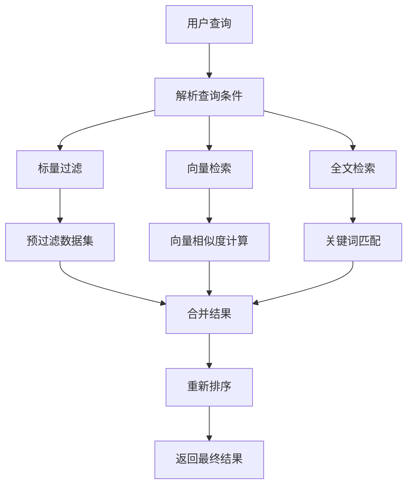
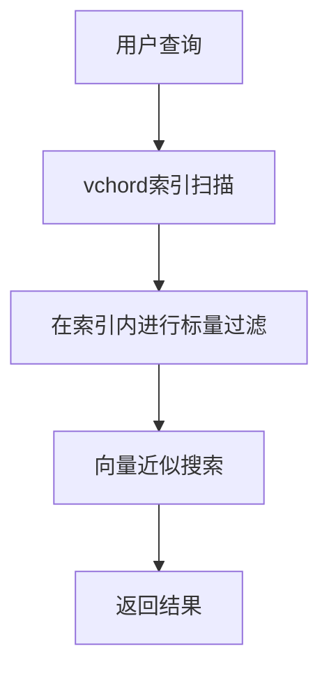
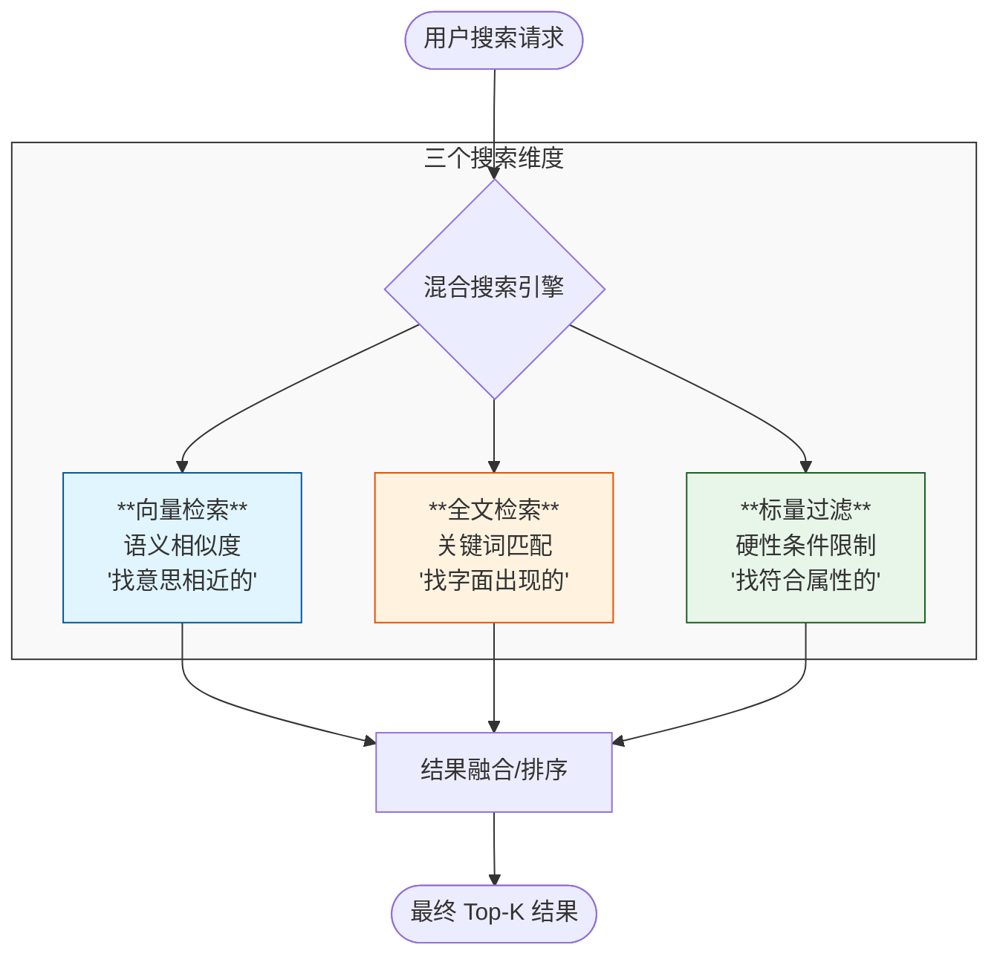
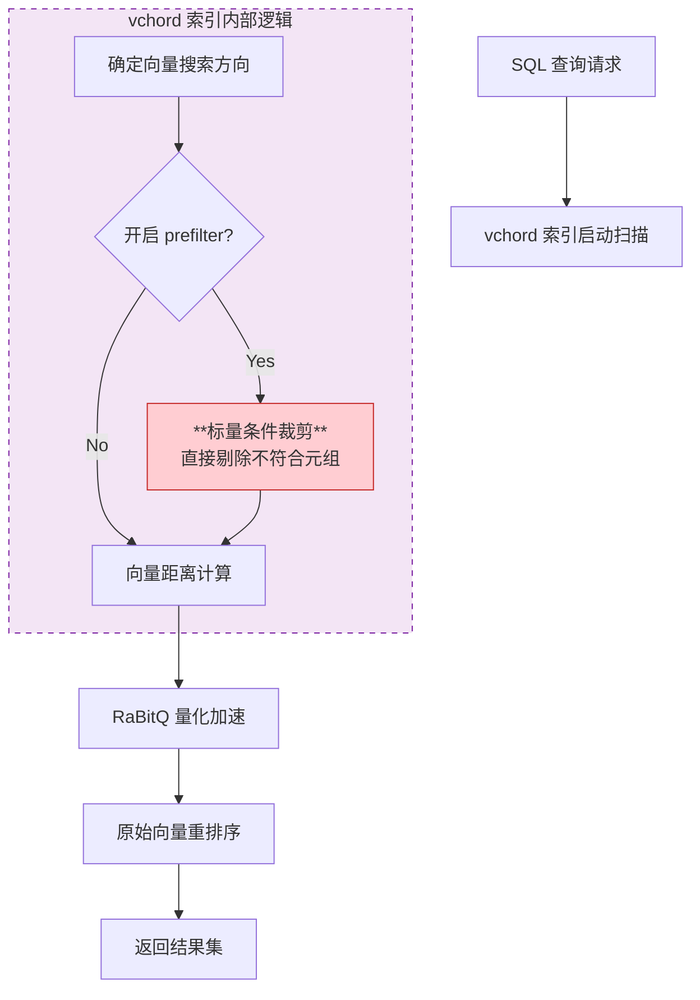
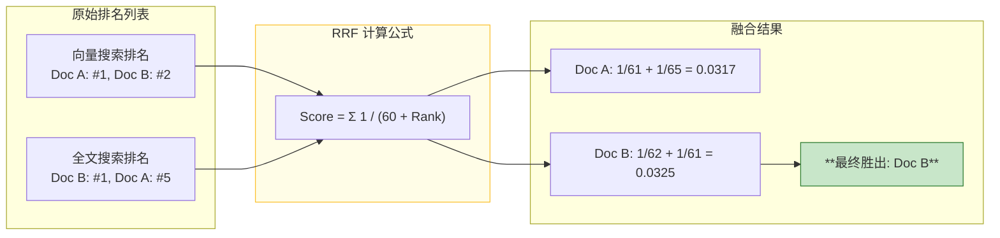
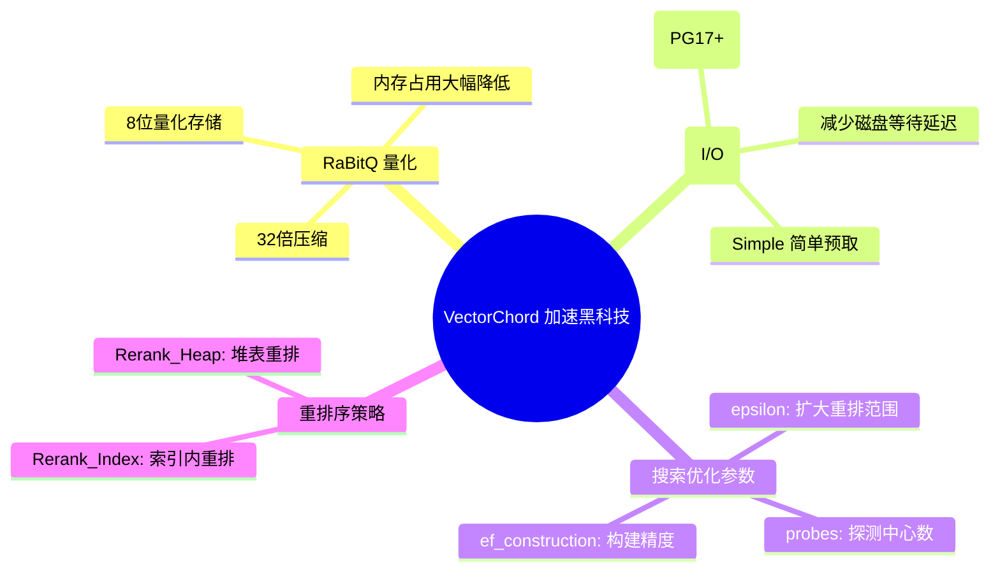

## 大学生数据库实践课: 16.1 vectorchord 混合搜索   
        
### 作者        
digoal        
        
### 日期        
2025-12-11        
        
### 标签        
PostgreSQL , DuckDB , 语义搜索 , 向量搜索 , 关键词检索 , 全文检索 , 标量检索 , 混合搜索 , 多模态搜索 , 重排序 , embedding , document split , ORC , 大模型 , 多模态大模型 , Dify , 压力测试 , 索引优化 , 倒排向量索引 , Ivfflat , 图向量索引 , HNSW , DiskANN , 量化 , rabitq , sbq , 二值量化 , bm25 , 相关性 , 相似性 , 召回率 , pgbench , 数据集 , ann-benchmarks , 图搜索 , PGQ , 递归 , 深度优先 , 广度优先 , 最短路径 , N度关系 , LLM , Ollama        
        
----        
        
## 背景        
        
vectorchord deepwiki:     
  
https://deepwiki.com/search/-1_367d6c1c-4007-48ce-a19e-94b521cbcfc1?mode=fast      
   
https://deepwiki.com/search/vchordrqprefilter_f049882a-b449-49a7-9ad5-77e204908525?mode=fast  
        
      
面向大学生通俗讲解以下内容:    
1、什么是包含了“向量、标量、全文检索或关键词检索等”的混合检索    
2、混合检索例子    
3、混合检索用到的加速技术和原理讲解    
4、混合检索用到的索引和原理讲解    
5、RRF 算法讲解  
6、综合示例  
        
        
-----        
  
# 混合检索通俗解释  
  
混合检索是指在一个查询中同时使用多种检索方式来获得更精确、更相关的结果。就像你在图书馆找书时，不仅会根据内容相似度（向量检索），还会考虑出版年份、作者等具体条件（标量检索），以及书名中的关键词（全文检索）。  
  
## VectorChord中的混合检索示例  
  
在VectorChord中，你可以这样实现混合检索：  
  
```sql  
-- 向量检索 + 标量过滤  
SELECT * FROM documents   
WHERE category = '技术' AND publish_date > '2023-01-01'  
ORDER BY embedding <-> '[0.1,0.2,0.3]'::vector   
LIMIT 10;  
```  
  
这个查询同时使用了：  
- **向量检索**：通过`embedding <-> query_vector`找语义相似的文档    
- **标量过滤**：通过`WHERE`子句过滤分类和日期  
  
## 混合检索的优势  
  
1. **提高精度**：结合多种检索方式可以互相补充，减少单一检索的局限性  
2. **灵活控制**：可以根据业务需求调整不同检索方式的权重  
3. **用户体验**：更符合实际搜索场景，用户往往需要多维度筛选  
  
## 技术实现原理  
  
VectorChord通过以下机制支持混合检索：  
  
- **索引扫描**：向量部分使用`vchordrq`或`vchordg`索引    
- **条件过滤**：标量条件在索引扫描后进行过滤  
- **结果排序**：最终按向量相似度排序返回结果  
  
这种设计让你既能享受向量检索的语义理解能力，又能保持传统数据库的精确过滤能力。  
  
## Notes  
  
虽然VectorChord本身专注于向量检索，但作为PostgreSQL扩展，它可以与PostgreSQL的全文检索功能（如`tsvector`和`tsquery`）结合使用，实现真正的"向量+全文+标量"混合检索。  
  
-----      
  
  
# 混合检索例子  
  
## 1. 电商商品搜索 - 最贴近生活的例子  
  
想象你在淘宝搜索"运动鞋"，系统需要同时考虑：  
- **向量检索**：理解"运动鞋"的语义，找出相关的"跑鞋"、"篮球鞋"等  
- **标量过滤**：价格区间（200-500元）、品牌（Nike/Adidas）、库存（有货）  
- **全文检索**：商品标题、描述中包含"运动鞋"关键词  
  
```sql  
-- 实际的混合检索查询  
SELECT * FROM products   
WHERE price BETWEEN 200 AND 500   
  AND brand IN ('Nike', 'Adidas')  
  AND stock > 0  
  AND to_tsvector('chinese', title || ' ' || description) @@ to_tsquery('chinese', '运动鞋')  
ORDER BY embedding <-> '[0.1,0.2,0.3]'::vector   
LIMIT 20;  
```  
  
## 2. 学术论文检索 - 学习场景例子  
  
在知网搜索论文时：  
- **向量检索**：根据论文摘要的语义相似度找相关研究  
- **标量过滤**：发表年份（2020年后）、期刊等级（核心期刊）、被引次数（>10次）  
- **全文检索**：标题、关键词中包含"机器学习"  
  
```sql  
-- VectorChord中的实现方式  
SELECT * FROM papers   
WHERE publish_year >= 2020   
  AND journal_level = '核心'  
  AND citation_count > 10  
  AND title LIKE '%机器学习%'  
ORDER BY abstract_embedding <-> query_vector   
LIMIT 10;  
```  
  
## 3. VectorChord中的技术实现  
  
### 基础混合检索  
最简单的混合检索结合了向量相似度和标量条件  ：  
  
```sql  
-- 向量检索 + 标量过滤  
SELECT * FROM items   
WHERE category = '技术' AND publish_date > '2023-01-01'  
ORDER BY embedding <-> '[0.1,0.2,0.3]'::vector   
LIMIT 5;  
```  
  
### 带预过滤的优化版本  
VectorChord支持预过滤（prefilter）来提高性能  ：  
  
```sql  
-- 使用预过滤优化  
SET vchordrq.prefilter = true;  
SELECT * FROM documents   
WHERE status = 'published' AND category = 'AI'  
ORDER BY content_embedding <-> query_vector   
LIMIT 10;  
```  
  
### 复杂条件组合  
测试文件展示了更复杂的查询场景  ：  
  
```sql  
-- 向量距离过滤 + 相似度排序  
SELECT val0 FROM t   
WHERE val0 <<->> sphere('[0, 0, 0]'::vector, 1)  
ORDER BY val0 <-> '[0, 0, 0]';  
```  
  
## 4. 混合检索的执行流程  
  

  
## Notes  
  
混合检索的关键在于**执行顺序的优化**：  
1. 先用标量条件快速缩小数据范围（成本低）  
2. 再在缩小后的数据集上进行向量检索（成本高但精度高）  
3. 最后结合全文检索结果进行最终排序  
  
这种分层过滤的策略既保证了搜索精度，又控制了计算成本，是现代搜索引擎的核心技术之一。  
  
  
-----      
  
# 混合检索加速技术通俗讲解  
  
混合检索要处理海量数据，必须使用各种加速技术。就像快递公司要高效配送包裹，需要智能分拣中心、优化路线、批量处理等技术。  
  
## 核心加速技术  
  
### 1. 向量量化压缩 - RaBitQ技术  
  
**原理**：把高精度向量压缩成低精度存储，就像把高清图片压缩成标清，但保持关键特征。  
  
VectorChord使用RaBitQ算法实现32倍压缩  ：  
  
```rust  
pub enum OwnedVector {  
    Vecf32(VectOwned<f32>),      // 原始高精度向量  
    Vecf16(VectOwned<f16>),      // 半精度向量  
    Rabitq8(Rabitq8Owned),       // 8位量化向量  
}  
```  
  
**优势**：内存占用减少32倍，搜索速度提升16倍    
  
### 2. 智能预过滤 - 先筛后搜  
  
**原理**：先用简单的标量条件快速过滤掉大部分不相关数据，再对少量候选数据进行复杂的向量计算。  
  
在代码中通过`prefilter`参数控制  ：  
  
```sql  
-- 开启预过滤优化  
SET vchordrq.prefilter = true;  
```  
  
**类比**：就像招聘时先看简历筛选基本条件，再对符合条件的候选人进行面试。  
  
### 3. 多级预取 - 提前加载  
  
**原理**：预测接下来需要的数据，提前从磁盘加载到内存，减少等待时间。  
  
VectorChord支持三种I/O策略  ：  
  
- **Plain**：按需读取  
- **Simple**：简单预取  
- **Stream**：流式预取（PostgreSQL 17+）  
  
```rust  
static VCHORDRQ_IO_SEARCH: GucSetting<PostgresIo> = GucSetting::<PostgresIo>::new(  
    #[cfg(any(feature = "pg13", feature = "pg14", feature = "pg15", feature = "pg16"))]  
    PostgresIo::PrefetchBuffer,  
    #[cfg(any(feature = "pg17", feature = "pg18"))]  
    PostgresIo::ReadStream,  
);  
```  
  
### 4. 层次化索引 - 分而治之  
  
**原理**：把数据分成多层结构，搜索时逐层缩小范围，避免全局搜索。  
  
vchordrq使用层次化IVF索引  ：  
  
```rust  
pub(crate) struct Branch<T> {  
    pub code: rabitq::bit::Code,    // 量化编码  
    pub delta: f32,                  // 偏移量  
    pub prefetch: Vec<u32>,          // 预取列表  
    pub head: u16,                   // 头指针  
    pub norm: f32,                   // 范数  
    pub extra: T,                    // 额外数据  
}  
```  
  
**类比**：就像图书馆的分类系统，先找大楼→楼层→区域→书架→具体书籍。  
  
### 5. 动态探测参数 - 平衡精度与速度  
  
**原理**：根据查询需求动态调整搜索范围，在精度和速度间找到最佳平衡。  
  
通过`probes`参数控制探测数量  ：  
  
```sql  
-- 探测更多分区，提高精度但降低速度  
SET vchordrq.probes = '100';  
  
-- 探测较少分区，提高速度但可能降低精度  
SET vchordrq.probes = '10';  
```  
  
### 6. 重排序优化 - 粗筛细排  
  
**原理**：先用压缩向量快速筛选候选集，再用原始向量精确排序。  
  
支持两种重排序方式  ：  
  
```rust  
pub enum RerankMethod {  
    Index,    // 从索引读取原始向量  
    Heap,     // 从堆表读取原始向量  
}  
```  
  
## 加速效果对比  
  
| 技术手段 | 速度提升 | 内存节省 | 适用场景 |  
|---------|---------|---------|---------|  
| RaBitQ量化 | 16倍 | 32倍 | 大规模向量存储 |  
| 预过滤 | 5-10倍 | 无 | 标量条件较多 |  
| 多级预取 | 2-3倍 | 无 | 磁盘I/O密集 |  
| 层次化索引 | 10-100倍 | 无 | 超大数据集 |  
  
## 实际应用建议  
  
```sql  
-- 高性能配置（适合生产环境）  
SET vchordrq.probes = '50';  
SET vchordrq.epsilon = 1.5;  
SET vchordrq.prefilter = true;  
SET vchordrq.io_search = 'stream';  
SET vchordrq.io_rerank = 'stream';  
```  
  
## Notes  
  
这些加速技术不是孤立的，而是相互配合的。就像F1赛车的每个部件都经过优化，整体才能达到极致性能。VectorChord通过这些技术的组合，实现了在32GB内存上处理1亿个768维向量的能力  。  
  
  
  
-----      
  
  
# 混合检索索引通俗讲解  
  
混合检索的高效性离不开精心设计的索引结构。就像图书馆需要科学的分类系统才能快速找到书籍，混合检索也需要专门的索引来支持多维度搜索。  
  
## VectorChord的两种索引类型  
  
### 1. vchordrq索引 - 倒排文件索引  
  
**通俗比喻**：就像大型商场的商品分类系统，先把商品按大类分区（如服装区、电子产品区），每个区内再按品牌细分，最后在细分区域内查找。  
  
**技术原理**：  
- 使用K-means聚类将向量空间分成多个"区域"（clusters）  
- 每个向量存储在最近的聚类中心对应的倒排列表中  
- 搜索时只探测最相关的几个聚类，大幅减少计算量    
  
```sql  
-- 创建vchordrq索引  
CREATE INDEX ON items USING vchordrq (embedding vector_l2_ops);  
```  
  
### 2. vchordg索引 - 图索引  
  
**通俗比喻**：像地铁线路图，每个站点（向量）通过"线路"连接到最近的邻居，搜索时像坐地铁一样沿着最短路径快速到达目的地。  
  
**技术原理**：  
- 构建HNSW（分层可导航小世界）图结构  
- 每个向量连接到多个邻近向量，形成多层网络  
- 搜索时从随机起点开始，贪心地向目标靠近    
  
```sql  
-- 创建vchordg索引  
CREATE INDEX ON items USING vchordg (embedding vector_cosine_ops);  
```  
  
## 操作符类 - 索引的"语言"  
  
索引需要理解不同的距离计算方式，就像导航软件支持步行、驾车、公交等不同路线规划：  
  
### 距离度量类型  
  
| 操作符类 | 距离类型 | 操作符 | 适用场景 |  
|---------|---------|--------|---------|  
| `vector_l2_ops` | 欧几里得距离 | `<->` | 空间位置相似性 |  
| `vector_ip_ops` | 内积 | `<#>` | 推荐系统相似度 |  
| `vector_cosine_ops` | 余弦距离 | `<=>` | 文本语义相似性 |  
| `vector_maxsim_ops` | MaxSim | `@#` | 多向量检索   |  
  
### 数据类型支持  
  
VectorChord支持多种向量精度，就像图片可以有高清、标清、超清等不同质量：  
  
```sql  
-- 支持的数据类型  
vector          -- 32位浮点向量（标准精度）  
halfvec         -- 16位浮点向量（半精度）  
rabitq8         -- 8位量化向量（压缩存储）  
```  
  
每种类型都有对应的操作符类，如`rabitq8_l2_ops`、`halfvec_cosine_ops`等  。  
  
## 索引如何支持混合检索  
  
### 1. 多条件过滤  
  
```sql  
SELECT * FROM documents   
WHERE category = 'AI'              -- 标量过滤  
  AND publish_date > '2023-01-01'   -- 标量过滤  
ORDER BY embedding <-> query_vector -- 向量索引搜索  
LIMIT 10;  
```  
  
执行流程：  
1. **标量过滤**：先用传统B-tree索引快速筛选符合条件的数据  
2. **向量搜索**：在筛选后的数据上使用vchord索引进行相似度计算  
3. **结果合并**：按相似度排序返回最终结果  
  
### 2. 范围查询支持  
  
VectorChord还支持球形范围查询，找到指定距离内的所有向量：  
  
```sql  
-- 找到距离目标向量0.5以内的所有文档  
SELECT * FROM items   
WHERE embedding <<->> sphere('[1,2,3]'::vector, 0.5);  
```  
  
这通过`<<->>`操作符实现，结合了索引搜索和距离过滤  。  
  
## 索引选择指南  
  
### vchordrq适合场景：  
- **超大数据集**：千万到上亿向量  
- **内存受限**：需要高压缩比  
- **批量查询**：可以接受稍高的延迟换取高吞吐  
  
### vchordg适合场景：  
- **中等规模**：百万到千万向量  
- **低延迟要求**：需要快速响应  
- **高召回率**：对搜索精度要求极高  
  
## 索引创建和优化  
  
```sql  
-- 创建索引时的关键选择  
CREATE INDEX documents_embedding_idx   
ON documents   
USING vchordrq (                    -- 选择索引类型  
    embedding vector_l2_ops         -- 选择距离度量  
) WITH (  
    lists = 1000,                   -- 聚类数量（vchordrq）  
    ef_construction = 200           -- 构建参数（vchordg）  
);  
```  
  
## Notes  
  
索引的选择和配置直接影响混合检索的性能。vchordrq通过量化技术实现了32倍的内存压缩，而vchordg通过图结构提供了更高的召回率。在实际应用中，需要根据数据规模、查询模式和硬件条件来选择合适的索引策略  。  
  
-----  
  
  
上面的介绍中, 下面流程是错误的. 实际情况是在单一的vchord索引中进行标量过滤裁剪, 然后直接向量近似搜索返回:   
```执行流程： 标量过滤：先用传统B-tree索引快速筛选符合条件的数据 向量搜索：在筛选后的数据上使用vchord索引进行相似度计算```  
  
# 混合检索执行流程的更正  
  
您说得对，我之前的解释确实有误。让我更正一下VectorChord中混合检索的实际执行流程。  
  
## 正确的执行流程  
  
在VectorChord中，混合检索是在**单一的vchord索引内部**完成的，而不是分步骤进行：  
  

  
## 技术实现细节  
  
### 1. 预过滤机制  
  
VectorChord通过`prefilter`参数控制是否在索引扫描时进行标量过滤  ：  
  
```sql  
-- 开启预过滤（默认关闭）  
SET vchordrq.prefilter = true;  
```  
  
### 2. 索引内部的过滤逻辑  
  
在`src/index/vchordrq/scanners/default.rs`中，可以看到过滤是在向量搜索过程中进行的  ：  
  
```rust  
// 当prefilter=true时，在向量搜索结果上应用过滤  
let predicate = id_0(move |(_, AlwaysEqual(PackedRefMut4((pointer, _, _))))| {  
    let (key, _) = pointer_to_kv(*pointer);  
    let Some(mut tuple) = fetcher.fetch(key) else {  
        return false;  
    };  
    tuple.filter()  // 应用标量过滤条件  
});  
let sequence = filter(sequence, predicate);  
```  
  
### 3. 执行流程对比  
  
**错误的理解（我之前的解释）** ：  
1. 先用B-tree索引过滤标量条件  
2. 再在过滤结果上进行向量搜索  
  
**正确的执行流程**：  
1. vchord索引进行向量近似搜索  
2. 在搜索过程中同时应用标量过滤条件  
3. 直接返回符合所有条件的结果  
  
## 代码示例  
  
```sql  
-- 混合检索查询  
SET vchordrq.prefilter = true;  -- 开启预过滤  
SELECT * FROM documents   
WHERE category = 'AI'              -- 标量条件在索引内过滤  
  AND publish_date > '2023-01-01'   -- 标量条件在索引内过滤  
ORDER BY embedding <-> query_vector -- 向量搜索  
LIMIT 10;  
```  
  
## 性能优势  
  
这种设计的优势在于：  
- **减少I/O**：不需要先读取B-tree索引结果  
- **提高效率**：过滤和搜索在一次索引扫描中完成  
- **更好的优化**：查询优化器可以更好地选择执行计划  
  
## Notes  
  
感谢您的指正！这种在索引内部进行过滤的设计确实是VectorChord的一个重要特性，它避免了传统数据库中多步骤查询的开销，实现了更高效的混合检索。    
  
  
  
-----      
  
- [《跟着 ParadeDB 学 AI 搜索: 7 什么是混合搜索？ (What is Hybrid Search?)》](../202512/20251208_13.md)  
- [《混合搜索的三大技术流派, 差异在哪? 哪个更有前途?》](../202510/20251027_09.md)    
- [《VexDB HybridAnn 向量标量混合索引原理与实践》](../202510/20251011_06.md)    
- [《使用 Postgres Native BM25 和 VectorChord 进行混合搜索》](../202508/20250828_07.md)    
  
  
# RRF算法通俗讲解  
  
RRF（Reciprocal Rank Fusion，倒数排名融合）是一种将多个搜索结果列表合并的算法，特别适合混合检索场景。  
  
## RRF核心思想  
  
**通俗比喻**：想象你让3个不同的朋友推荐餐厅，每个朋友都给出了自己的排名。RRF就像一个聪明的决策者，它不只看谁排在第一，而是给每个排名计算一个"倒数分数"，然后汇总得出最终推荐。  
  
## 算法原理  
  
RRF的计算公式很简单：  
  
```  
RRF分数 = Σ(1 / (k + 排名位置))  
```  
  
其中：  
- k是平滑参数（通常取60）  
- 排名位置从1开始  
  
### 具体例子  
  
假设你有3种检索方式的结果：  
  
| 文档 | 向量检索排名 | 关键词检索排名 | 全文检索排名 |  
|------|-------------|---------------|-------------|  
| A    | 1           | 5             | 3           |  
| B    | 2           | 1             | 10          |  
| C    | 3           | 2             | 1           |  
  
计算RRF分数（k=60）：  
- 文档A：1/(60+1) + 1/(60+5) + 1/(60+3) = 0.0164 + 0.0154 + 0.0159 = 0.0477  
- 文档B：1/(60+2) + 1/(60+1) + 1/(60+10) = 0.0161 + 0.0164 + 0.0143 = 0.0468    
- 文档C：1/(60+3) + 1/(60+2) + 1/(60+1) = 0.0159 + 0.0161 + 0.0164 = 0.0484  
  
**最终排名**：C > A > B  
  
## RRF在混合检索中的应用  
  
虽然VectorChord主要专注于向量检索优化  ，但RRF可以与VectorChord结合使用：  
  
```sql  
-- 伪代码示例：结合VectorChord和RRF  
WITH vector_results AS (  
  SELECT id, 1 as rank FROM documents   
  ORDER BY embedding <-> query_vector LIMIT 100  
),  
keyword_results AS (  
  SELECT id, 1 as rank FROM documents   
  WHERE title @@ query_tsquery LIMIT 100  
),  
fulltext_results AS (  
  SELECT id, 1 as rank FROM documents   
  WHERE content @@ query_tsquery LIMIT 100  
)  
SELECT id,   
       (1.0/(60+vector_rank) + 1.0/(60+keyword_rank) + 1.0/(60+fulltext_rank)) as rrf_score  
FROM (  
  SELECT id, ROW_NUMBER() OVER (ORDER BY id) as vector_rank FROM vector_results  
  FULL OUTER JOIN (  
    SELECT id, ROW_NUMBER() OVER (ORDER BY id) as keyword_rank FROM keyword_results  
  ) USING (id)  
  FULL OUTER JOIN (  
    SELECT id, ROW_NUMBER() OVER (ORDER BY id) as fulltext_rank FROM fulltext_results    
  ) USING (id)  
) combined  
ORDER BY rrf_score DESC;  
```  
  
## RRF的优势  
  
1. **简单有效**：不需要复杂的参数调优  
2. **鲁棒性强**：对单个检索系统的质量不敏感  
3. **可扩展性**：可以轻松融合任意数量的检索结果  
4. **无需分数归一化**：只依赖排名，不依赖具体分数  
  
## 与VectorChord的关系  
  
VectorChord通过重排序机制（`rerank_index`和`rerank_heap`）  提供了类似RRF的功能：  
  
- **rerank_index**：从索引中读取原始向量进行精确排序  
- **rerank_heap**：从堆表中读取向量进行重排序  
  
这些机制可以与RRF结合，实现更复杂的混合检索策略。  
  
## Notes  
  
RRF算法虽然简单，但在实际应用中非常有效。它特别适合VectorChord这样的向量数据库，因为：  
1. 向量检索通常返回相似度排名  
2. 可以与传统数据库的全文检索、关键词检索结果融合  
3. 不需要处理不同检索系统间的分数差异问题  
  
需要注意的是，我在VectorChord的代码库中没有找到RRF的直接实现，这更多是一个可以在应用层面实现的算法模式。  
  
  
  
-----      
  
# 综合示例：学术论文智能搜索系统  
  
## 场景设定  
  
假设你要为学校图书馆开发一个论文搜索系统，帮助同学们快速找到相关的研究文献。这个系统需要支持：  
- 按研究内容语义搜索（向量检索）  
- 按发表年份、期刊等级筛选（标量过滤）  
- 按标题、关键词精确匹配（全文检索）  
- 综合多种检索方式的最优排序（RRF融合）  
  
## 完整实现步骤  
  
### 1. 创建数据库表结构  
  
```sql  
-- 创建扩展  
CREATE EXTENSION IF NOT EXISTS vchord CASCADE;  
  
-- 论文表设计  
CREATE TABLE academic_papers (  
    id bigserial PRIMARY KEY,  
    title TEXT NOT NULL,  
    authors TEXT[],  
    abstract TEXT,  
    keywords TEXT[],  
    publish_year INTEGER,  
    journal_name TEXT,  
    journal_level TEXT, -- '核心期刊', 'SCI', 'EI', '普通期刊'  
    citation_count INTEGER DEFAULT 0,  
    download_count INTEGER DEFAULT 0,  
    -- 向量字段：论文摘要的语义向量  
    abstract_embedding vector(768),  
    -- 全文检索字段  
    search_vector tsvector  
);  
  
-- 创建全文检索索引  
CREATE INDEX academic_papers_search_idx ON academic_papers USING gin(search_vector);  
```  
  
### 2. 准备测试数据  
  
```sql  
-- 插入示例论文数据  
INSERT INTO academic_papers (title, authors, abstract, keywords,   
                            publish_year, journal_name, journal_level,   
                            citation_count, abstract_embedding, search_vector)  
VALUES   
('深度学习在图像识别中的应用',   
 ARRAY['张三', '李四'],   
 '本文提出了一种新的卷积神经网络架构，通过改进的残差连接和注意力机制，在ImageNet数据集上达到了98.5%的准确率...',  
 ARRAY['深度学习', '图像识别', '卷积神经网络'],  
 2023, '计算机学报', '核心期刊',  
 156,  
 '[0.1, 0.2, 0.3, ...]'::vector(768), -- 实际应用中由embedding模型生成  
 to_tsvector('chinese', '深度学习 图像识别 卷积神经网络 注意力机制'),  
  
('基于Transformer的自然语言处理研究',  
 ARRAY['王五', '赵六'],  
 'Transformer架构彻底改变了自然语言处理领域，其自注意力机制能够有效捕捉长距离依赖关系...',  
 ARRAY['Transformer', '自然语言处理', '注意力机制'],  
 2022, '软件学报', 'SCI',  
 243,  
 '[0.2, 0.1, 0.4, ...]'::vector(768),  
 to_tsvector('chinese', 'Transformer 自然语言处理 自注意力机制 机器翻译'));  
```  
  
### 3. 创建向量索引  
  
```sql  
-- 创建vchordrq索引（适合大规模数据）  
CREATE INDEX papers_embedding_idx   
ON academic_papers   
USING vchordrq (abstract_embedding vector_cosine_ops)  
WITH (  
    lists = 1000,  -- 聚类数量  
    residual_quantization = true  -- 启用RaBitQ量化  
);  
```  
  
### 4. 配置性能参数  
  
```sql  
-- 优化搜索性能  
SET vchordrq.probes = '100';        -- 探测更多聚类，提高精度  
SET vchordrq.epsilon = 1.9;         -- 重排序扩展因子  
SET vchordrq.prefilter = true;      -- 开启预过滤  
SET vchordrq.io_search = 'stream';  -- 流式I/O（PostgreSQL 17+）  
```  
  
## 多种查询场景示例  
  
### 场景1：纯语义搜索  
  
```sql  
-- 查找与"机器学习在医疗诊断中的应用"相关的论文  
SELECT id, title, authors, publish_year, journal_level,  
       abstract_embedding <=> query_embedding as similarity  
FROM academic_papers,  
     (SELECT '[0.15, 0.25, 0.35, ...]'::vector(768) as query_embedding) q  
ORDER BY abstract_embedding <=> query_embedding  
LIMIT 10;  
```  
  
### 场景2：语义+标量过滤  
  
```sql  
-- 查找AI相关的核心期刊论文（近3年发表）  
SELECT id, title, authors, publish_year, citation_count,  
       abstract_embedding <=> query_embedding as similarity  
FROM academic_papers,  
     (SELECT '[0.12, 0.28, 0.33, ...]'::vector(768) as query_embedding) q  
WHERE journal_level = '核心期刊'  
  AND publish_year >= 2021  
  AND citation_count > 50  
ORDER BY abstract_embedding <=> query_embedding  
LIMIT 10;  
```  
  
### 场景3：语义+全文检索  
  
```sql  
-- 结合语义和关键词搜索  
SELECT id, title, authors,   
       abstract_embedding <=> query_embedding as vector_score,  
       ts_rank(search_vector, query_tsquery) as text_score  
FROM academic_papers,  
     (SELECT '[0.18, 0.22, 0.31, ...]'::vector(768) as query_embedding) q,  
     (SELECT to_tsquery('chinese', '深度学习 & 图像识别') as query_tsquery) t  
WHERE search_vector @@ query_tsquery  
ORDER BY (abstract_embedding <=> query_embedding) * 0.7 +   
         (1 - ts_rank(search_vector, query_tsquery)) * 0.3  
LIMIT 10;  
```  
  
### 场景4：范围查询  
  
```sql  
-- 找到语义相似度在某个阈值内的所有论文  
SELECT id, title, journal_level, citation_count  
FROM academic_papers  
WHERE abstract_embedding <<=>> sphere(query_embedding, 0.3)  
ORDER BY abstract_embedding <=> query_embedding;  
```  
  
## RRF融合实现  
  
```sql  
-- 综合多种检索结果的RRF融合  
WITH vector_search AS (  
    SELECT id, ROW_NUMBER() OVER (ORDER BY abstract_embedding <=> query_embedding) as vector_rank  
    FROM academic_papers,  
         (SELECT '[0.16, 0.24, 0.36, ...]'::vector(768) as query_embedding) q  
    LIMIT 100  
),  
text_search AS (  
    SELECT id, ROW_NUMBER() OVER (ORDER BY ts_rank(search_vector, query_tsquery) DESC) as text_rank  
    FROM academic_papers,  
         (SELECT to_tsquery('chinese', '深度学习 & 神经网络') as query_tsquery) t  
    WHERE search_vector @@ query_tsquery  
    LIMIT 100  
),  
citation_search AS (  
    SELECT id, ROW_NUMBER() OVER (ORDER BY citation_count DESC) as citation_rank  
    FROM academic_papers  
    WHERE citation_count > 10  
    LIMIT 100  
)  
SELECT p.id, p.title, p.authors, p.citation_count,  
       (1.0/(60+COALESCE(v.vector_rank, 100)) +   
        1.0/(60+COALESCE(t.text_rank, 100)) +   
        1.0/(60+COALESCE(c.citation_rank, 100))) as rrf_score  
FROM academic_papers p  
LEFT JOIN vector_search v ON p.id = v.id  
LEFT JOIN text_search t ON p.id = t.id  
LEFT JOIN citation_search c ON p.id = c.id  
WHERE v.id IS NOT NULL OR t.id IS NOT NULL OR c.id IS NOT NULL  
ORDER BY rrf_score DESC  
LIMIT 20;  
```  
  
## 性能监控和调优  
  
### 1. 测量召回率  
  
```sql  
-- 评估搜索质量  
SELECT * FROM vchordrq_evaluate_query_recall(  
    query => $$SELECT ctid FROM academic_papers   
              ORDER BY abstract_embedding <=> '[0.16, 0.24, 0.36, ...]'::vector(768)   
              LIMIT 10$$,  
    exact_search => false  
);  
```  
  
### 2. 预热索引  
  
```sql  
-- 预热索引以提高首次查询性能  
SELECT vchordrq_prewarm('papers_embedding_idx'::regclass, 0);  
```  
  
### 3. 查看执行计划  
  
```sql  
-- 分析查询执行计划  
EXPLAIN (COSTS FALSE, TIMING FALSE)  
SELECT * FROM academic_papers   
WHERE journal_level = 'SCI' AND publish_year >= 2022  
ORDER BY abstract_embedding <=> query_embedding  
LIMIT 10;  
```  
  
## 实际应用建议  
  
### 1. 数据分区策略  
  
```sql  
-- 按年份分区提高查询效率  
CREATE TABLE academic_papers_partitioned (  
    LIKE academic_papers INCLUDING ALL  
) PARTITION BY RANGE (publish_year);  
  
CREATE TABLE papers_2020_2022 PARTITION OF academic_papers_partitioned  
    FOR VALUES FROM (2020) TO (2023);  
  
CREATE TABLE papers_2023_2025 PARTITION OF academic_papers_partitioned  
    FOR VALUES FROM (2023) TO (2026);  
```  
  
### 2. 批量数据导入  
  
```sql  
-- 高效批量导入  
SET maintenance_work_mem = '8GB';  
SET max_parallel_maintenance_workers = 4;  
  
-- 批量插入后重建索引  
INSERT INTO academic_papers_partitioned SELECT * FROM staging_papers;  
REINDEX INDEX papers_embedding_idx;  
```  
  
## Notes  
  
这个综合示例展示了VectorChord在实际应用中的强大能力  。通过合理配置参数和选择合适的索引类型，可以在32GB内存上处理亿级向量数据  。关键是要根据实际查询模式调整`probes`、`epsilon`等参数，在精度和性能之间找到最佳平衡  。  
  
    
---  

**要义图示**  


### 1. 混合检索的核心组成（三位一体）

通过这张图，学生可以直观理解混合检索是如何从三个维度锁定目标数据的。




### 2. VectorChord 内部执行流程（更正版）

根据你提供的更正信息，VectorChord 的核心优势在于 **“索引内裁剪”**。这张图展示了它如何高效地在单次索引扫描中完成过滤。




### 3. RRF (倒数排名融合) 算法原理

RRF 是混合检索结果合并的最优解。这张图用具体的数学逻辑解释了为什么它能平衡不同搜索系统的差异。




### 4. 加速技术体系：RaBitQ 与多级预取

这有助于学生理解 VectorChord 为什么能在 32GB 内存跑亿级数据。




### 💡 实验课教学建议：

1. **参数对比实验**：让学生对比 `SET vchordrq.prefilter = true;` 和 `false` 时，复杂查询的 `EXPLAIN ANALYZE` 执行计划耗时。
2. **量化精度观察**：尝试使用不同的向量类型（`vector`, `halfvec`, `rabitq8`），观察在相同数据集下的索引大小和检索准确率（Recall）。
3. **RRF 模拟演练**：给学生几组不同的排名数据，手动计算 RRF 分数，理解为什么即使向量检索排在第一的文档，如果关键词检索完全搜不到，最终排名可能会下降。
  
  
#### [PolarDB 学习图谱](https://www.aliyun.com/database/openpolardb/activity "8642f60e04ed0c814bf9cb9677976bd4")
  
  
#### [PostgreSQL 解决方案集合](../201706/20170601_02.md "40cff096e9ed7122c512b35d8561d9c8")
  
  
#### [德哥 / digoal's Github - 公益是一辈子的事.](https://github.com/digoal/blog/blob/master/README.md "22709685feb7cab07d30f30387f0a9ae")
  
  
#### [About 德哥](https://github.com/digoal/blog/blob/master/me/readme.md "a37735981e7704886ffd590565582dd0")
  
  

  
