## 大学生数据库实践课: 16.2 pgvectorscale 混合搜索     
          
### 作者          
digoal          
          
### 日期          
2025-12-11          
          
### 标签          
PostgreSQL , DuckDB , 语义搜索 , 向量搜索 , 关键词检索 , 全文检索 , 标量检索 , 混合搜索 , 多模态搜索 , 重排序 , embedding , document split , ORC , 大模型 , 多模态大模型 , Dify , 压力测试 , 索引优化 , 倒排向量索引 , Ivfflat , 图向量索引 , HNSW , DiskANN , 量化 , rabitq , sbq , 二值量化 , bm25 , 相关性 , 相似性 , 召回率 , pgbench , 数据集 , ann-benchmarks , 图搜索 , PGQ , 递归 , 深度优先 , 广度优先 , 最短路径 , N度关系 , LLM , Ollama          
          
----          
          
## 背景          
          
pgvectorscale deepwiki:       
    
https://deepwiki.com/search/-1_91b74240-43e2-4cd9-98cd-d1065f3c424f?mode=fast          
        
面向大学生通俗讲解以下内容:      
1、什么是包含了“向量、标量、全文检索或关键词检索等”的混合检索      
2、混合检索例子      
3、混合检索用到的加速技术和原理讲解      
4、混合检索用到的索引和原理讲解      
5、RRF 算法讲解    
6、综合示例    
          
          
-----          
  
# 混合检索通俗讲解  
  
## 什么是混合检索  
  
混合检索是指将多种不同类型的检索方法组合在一起，以获得更精确、更符合需求的搜索结果。就像你找东西时，不仅会看它长什么样（向量相似），还会看它的标签、分类（标量过滤），甚至会搜索它的描述文字（全文检索）。  
  
## pgvectorscale 中的混合检索实现  
  
在 pgvectorscale 中，混合检索主要体现在**向量检索 + 标签过滤**的组合上：  
  
### 1. 基础向量检索  
  
```sql  
-- 纯向量检索：找最相似的向量  
SELECT * FROM documents  
ORDER BY embedding <=> '[0.1, 0.2, ...]'  
LIMIT 10;  
```    
  
### 2. 向量检索 + 标签过滤  
  
```sql  
-- 混合检索：找相似且符合标签条件的文档  
SELECT * FROM documents  
WHERE labels && ARRAY[1, 3]  -- 标签过滤  
ORDER BY embedding <=> '[0.1, 0.2, ...]'  -- 向量相似度  
LIMIT 10;  
```    
  
### 3. 更复杂的混合检索  
  
```sql  
-- 向量 + 标签 + 其他条件  
SELECT * FROM documents  
WHERE labels && ARRAY[1, 3]   
  AND status = 'active'   
  AND created_at > '2024-01-01'  
ORDER BY embedding <=> '[0.1, 0.2, ...]'  
LIMIT 10;  
```    
  
## 技术实现细节  
  
### 标签系统的实现  
  
pgvectorscale 使用 `LabeledVector` 结构来组合向量和标签：  
  
```rust  
pub struct LabeledVector {  
    vec: PgVector,  
    labels: Option<LabelSet>,  
}  
```    
  
### 查询时的数据提取  
  
查询时，系统会同时提取向量和标签信息：  
  
```rust  
pub unsafe fn from_scan_key_data(  
    keys: &[ScanKeyData],      // 包含标签过滤条件  
    orderbys: &[ScanKeyData],  // 包含查询向量  
    meta_page: &MetaPage,  
) -> Self  
```    
  
## 实际应用场景  
  
### 1. 电商搜索  
- **向量**：商品图片的视觉相似度  
- **标量**：价格区间、品牌、分类  
- **全文**：商品描述关键词  
  
### 2. 文档检索  
- **向量**：文档语义相似度  
- **标量**：作者、发布时间、标签  
- **全文**：文档中的关键词  
  
### 3. 代码搜索  
- **向量**：代码功能相似度  
- **标量**：编程语言、文件类型  
- **全文**：变量名、注释  
  
## 性能优势  
  
pgvectorscale 的混合检索通过索引级别的优化实现高效过滤：  
  
```sql  
-- 创建带标签的索引  
CREATE INDEX ON documents   
USING diskann (embedding vector_cosine_ops, labels);  
```    
  
这种设计让标签过滤在向量搜索过程中进行，而不是事后过滤，大大提升了查询效率。  
  
## Notes  
  
- pgvectorscale 主要专注于向量检索与标签过滤的组合，这是混合检索的一种常见形式  
- 代码中没有直接实现全文检索，但展示了如何将向量检索与其他检索方式结合  
- 混合检索的核心思想是"各取所长"：向量检索处理语义相似，传统检索处理精确匹配  
  
  
    
-----         
  
# 混合检索的实际例子  
  
## 基础例子：图书推荐系统  
  
想象你在图书馆找书，不仅要找内容相似的书（向量检索），还要符合特定条件（标签过滤）。  
  
### 1. 纯向量检索 - 找相似内容  
```sql  
-- 找与查询向量最相似的10本书  
SELECT * FROM books  
ORDER BY embedding <=> '[0.1, 0.2, ...]'  
LIMIT 10;  
```    
  
这就像你告诉图书管理员："我想要一本和这本《人工智能导论》内容相似的书"。  
  
### 2. 向量 + 标签过滤 - 找相似且符合条件的书  
```sql  
-- 找相似且属于"计算机科学"或"数学"类别的书  
SELECT * FROM books  
WHERE category && ARRAY[1, 3]  -- 1=计算机科学, 3=数学  
ORDER BY embedding <=> '[0.1, 0.2, ...]'  
LIMIT 10;  
```    
  
这就像你说："我想要一本和《人工智能导论》相似的书，但要是计算机科学或数学类的"。  
  
## 进阶例子：电商商品搜索  
  
### 3. 多条件混合检索  
```sql  
-- 找相似且符合多个条件的商品  
SELECT * FROM products  
WHERE labels && ARRAY[1, 3]     -- 品牌和类别过滤  
  AND price BETWEEN 100 AND 500  -- 价格范围  
  AND status = 'active'          -- 商品状态  
  AND created_at > '2024-01-01'  -- 上架时间  
ORDER BY embedding <=> '[0.1, 0.2, ...]'  
LIMIT 10;  
```    
  
这就像在购物网站搜索："找一件和这件衣服风格相似的，要是Nike或Adidas的，价格100-500元，目前在售的，今年上架的商品"。  
  
## 实际测试用例  
  
### 4. 文档分类检索  
```sql  
-- 创建带标签的文档表  
CREATE TABLE documents (  
    id SERIAL PRIMARY KEY,  
    embedding VECTOR(1536),  
    labels SMALLINT[],  -- 存储分类标签  
    category TEXT       -- 存储文本分类  
);  
  
-- 插入测试数据  
INSERT INTO documents (embedding, labels, category) VALUES  
('[1,2,3]', '{1,2}', 'article'),  
('[4,5,6]', '{1,3}', 'blog'),  
('[7,8,9]', '{2,3}', 'article');  
```    
  
### 5. 复杂标签组合查询  
```sql  
-- 查找包含标签1或4，且是article类别的文档  
SELECT * FROM documents  
WHERE labels && '{1,4}' AND category = 'article'  
ORDER BY embedding <=> '[0,0,0]'  
LIMIT 10;  
```    
  
### 6. 语义化标签查询  
```sql  
-- 通过标签名称查询（需要关联标签定义表）  
SELECT d.*, array_agg(l.name) as label_names  
FROM documents d  
JOIN label_definitions l ON l.id = ANY(d.labels)  
WHERE d.labels && '{1}'  -- 过滤标签1  
GROUP BY d.id  
ORDER BY d.embedding <=> '[...]'  
LIMIT 10;  
```    
  
## 性能优化例子  
  
### 7. 创建高效的混合检索索引  
```sql  
-- 创建支持标签过滤的向量索引  
CREATE INDEX ON documents   
USING diskann (embedding vector_cosine_ops, labels);  
```    
  
这个索引让标签过滤在向量搜索过程中进行，而不是先搜索再过滤，大大提升了效率。  
  
## 实际应用场景  
  
### 8. 社交媒体内容推荐  
- **向量**：用户兴趣相似度  
- **标签**：内容类型（视频、图片、文字）  
- **标量**：发布时间、点赞数  
  
### 9. 学术论文检索  
- **向量**：论文主题相似度  
- **标签**：学科分类、研究方法  
- **标量**：发表年份、引用次数  
  
### 10. 代码片段搜索  
- **向量**：代码功能相似度  
- **标签**：编程语言、框架  
- **标量**：代码长度、复杂度  
  
## Notes  
  
- 这些例子都来自 pgvectorscale 的实际代码和测试用例  
- 混合检索的核心是"先粗筛再精排"：标签过滤快速缩小范围，向量相似度精确排序  
- 标签值必须是 smallint 范围内的整数（-32768 到 32767）    
- 使用 `&&` 操作符进行高效的标签重叠检测    
  
  
-----         
  
# 混合检索的加速技术和原理  
  
混合检索之所以需要加速技术，是因为要在海量数据中同时处理向量相似度计算和多种过滤条件，计算量巨大。pgvectorscale通过多层优化实现了28倍延迟降低和16倍吞吐量提升。  
  
## 1. 索引层面：StreamingDiskANN算法  
  
### 核心原理  
StreamingDiskANN基于图结构组织向量，类似社交网络的好友关系。每个向量节点只连接最相似的邻居，搜索时沿着"最可能的方向"快速逼近目标。  
  
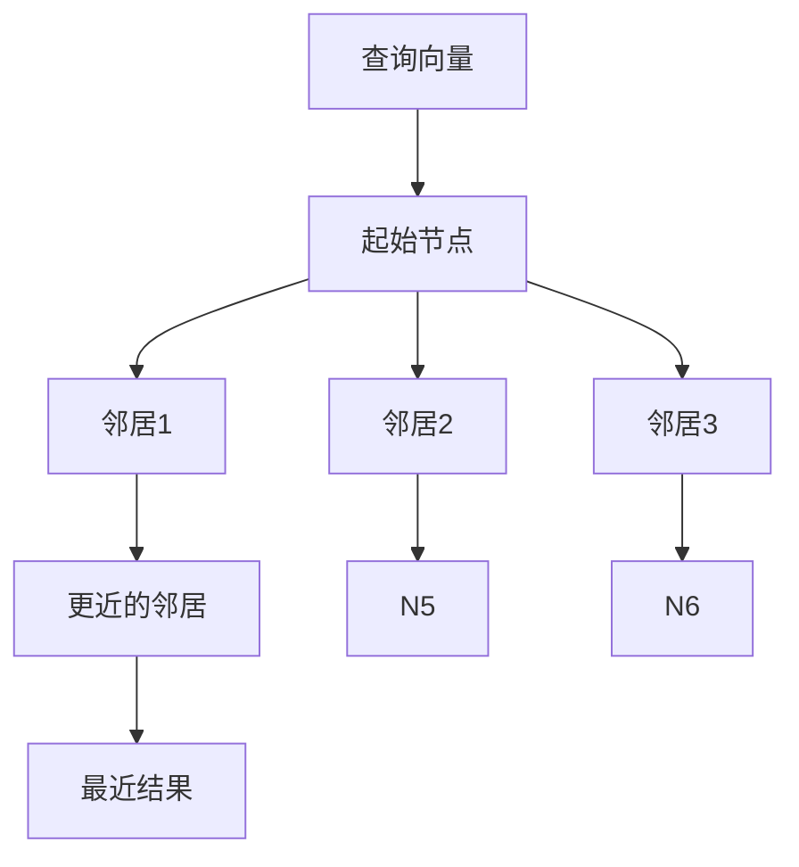
  
### 关键实现  
- **贪心搜索**：每次只访问`search_list_size`个最近邻节点，避免全图遍历    
- **动态剪枝**：使用`max_alpha`参数控制邻居连接的紧密程度，平衡准确性和效率    
  
## 2. 存储层面：统计二进制量化（SBQ）  
  
### 压缩原理  
SBQ将每个浮点数维度压缩为1-2个比特，大幅减少存储空间和内存占用。  
  
```rust  
// SBQ存储结构  
pub struct SbqSpeedupStorage<'a> {  
    quantizer: SbqQuantizer,  // 量化器  
    qv_cache: Option<RefCell<QuantizedVectorCache>>,  // 缓存  
}  
```    
  
### 加速效果  
- **存储压缩**：1536维向量从6KB压缩到几百字节  
- **距离计算加速**：使用比特操作替代浮点运算  
- **缓存优化**：量化后的向量可以缓存更多在内存中    
  
## 3. 过滤层面：标签索引优化  
  
### Filtered DiskANN原理  
传统方法是先向量搜索再过滤，标签索引让过滤发生在搜索过程中。  
  
```sql  
-- 创建时包含标签的索引  
CREATE INDEX ON documents   
USING diskann (embedding vector_cosine_ops, labels);  
```    
  
### 实现机制  
- **标签预筛选**：访问节点前先检查标签重叠    
- **起始节点优化**：根据查询标签选择合适的起始搜索点    
- **重叠检测**：使用高效的`&&`操作符快速判断标签交集    
  
## 4. 查询层面：动态参数调优  
  
### 搜索列表大小  
```sql  
SET diskann.query_search_list_size = 100;  -- 候选数量  
SET diskann.query_rescore = 50;            -- 重排序数量  
```    
  
### Matryoshka嵌入  
支持只索引部分维度，进一步加速：  
```sql  
-- 只索引前768维（共1536维）  
CREATE INDEX ON documents   
USING diskann (embedding) WITH(num_dimensions=768);  
```    
  
## 5. 综合性能优化  
  
### 内存管理  
- **RAII模式**：自动管理向量内存生命周期    
- **双指针设计**：索引距离和全距离分离，支持重排序    
  
### 流式处理  
- **渐进式返回**：不等待全部结果，边搜索边返回  
- **重排序缓冲**：用精确距离重新排序top结果    
  
## Notes  
  
- 这些技术协同工作：SBQ减少存储，DiskANN加速搜索，标签索引优化过滤  
- 实际测试显示，在5000万向量数据集上达到99%召回率的同时，延迟降低28倍  
- 所有优化都保持与PostgreSQL生态的兼容性，使用标准SQL语法  
  
  
  
-----         
  
# 混合检索用到的索引和原理讲解  
  
## 索引概述  
  
pgvectorscale使用**StreamingDiskANN索引**来实现高效的混合检索。这个索引巧妙地将向量相似度搜索和标签过滤结合在一起，避免了传统方法中"先搜索再过滤"的低效问题。  
  
## 1. StreamingDiskANN索引结构  
  
### 核心思想  
StreamingDiskANN基于**图结构**组织向量数据，就像构建一个"社交网络"：  
  
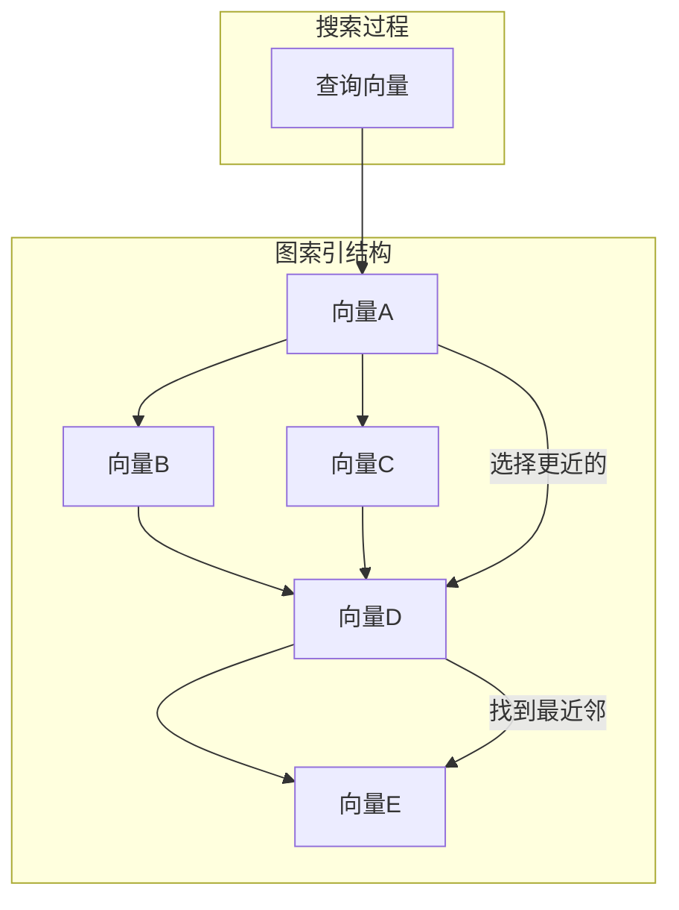
  
每个向量节点只连接最相似的邻居，搜索时沿着"最可能的方向"快速逼近目标，而不是遍历所有数据。  
  
### 索引创建过程  
  
索引创建时，系统会：  
  
1. **扫描数据表**：读取所有向量和标签数据    
2. **构建图结构**：为每个向量找到最相似的邻居并建立连接    
3. **存储到磁盘**：将图结构和向量数据持久化存储  
  
```sql  
-- 创建带标签过滤的混合检索索引  
CREATE INDEX ON documents   
USING diskann (embedding vector_cosine_ops, labels);  
```    
  
## 2. 标签过滤的索引集成  
  
### 传统方法的问题  
传统混合检索是"两步走"：  
1. 先进行向量搜索，找出候选结果  
2. 再用标签条件过滤候选结果  
  
这种方法效率低，因为大量不相关的向量也被计算了相似度。  
  
### pgvectorscale的创新  
pgvectorscale将**标签过滤集成到索引结构中**：  
  
```rust  
// 带标签的向量结构  
pub struct LabeledVector {  
    vec: PgVector,  
    labels: Option<LabelSet>,  
}  
```    
  
在图搜索过程中，系统会：  
1. **预筛选邻居**：访问节点前先检查标签重叠    
2. **智能起始点**：根据查询标签选择合适的搜索起点    
3. **早期剪枝**：跳过不匹配标签的分支  
  
## 3. 存储优化：SBQ压缩  
  
### 为什么需要压缩  
高维向量占用大量存储空间：  
- 1536维向量 = 1536 × 4字节 = 6KB  
- 100万个向量 = 6GB存储空间  
  
### SBQ压缩原理  
**统计二进制量化（SBQ）** 将每个浮点数维度压缩为1-2个比特：  
  
```rust  
// SBQ存储结构  
pub struct SbqSpeedupStorage<'a> {  
    quantizer: SbqQuantizer,  // 量化器  
    qv_cache: Option<RefCell<QuantizedVectorCache>>,  // 缓存  
}  
```    
  
压缩效果：  
- **存储空间**：从6KB压缩到几百字节  
- **内存效率**：可以缓存更多向量在内存中  
- **计算加速**：比特操作比浮点运算快得多  
  
## 4. 查询执行流程  
  
### 查询解析  
当执行混合检索查询时：  
  
```sql  
SELECT * FROM documents  
WHERE labels && ARRAY[1, 3]  
ORDER BY embedding <=> '[0.1, 0.2, ...]'  
LIMIT 10;  
```  
  
系统会：  
1. **提取查询条件**：从SQL中解析出向量和标签    
2. **创建查询对象**：构建`LabeledVector`查询结构  
3. **启动图搜索**：从合适的起始点开始搜索  
  
### 搜索过程  
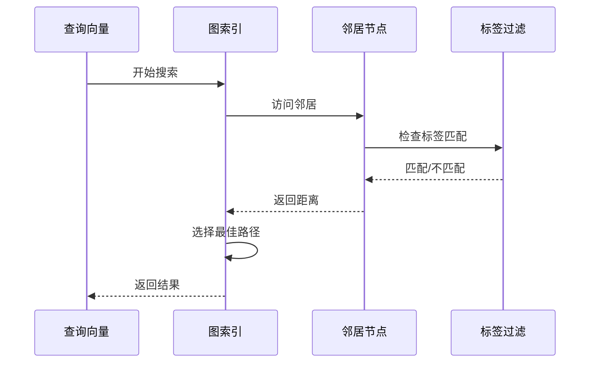
  
## 5. 索引参数调优  
  
### 构建时参数  
```sql  
CREATE INDEX idx_name ON table  
USING diskann (embedding, labels)  
WITH (  
    num_neighbors = 50,      -- 每个节点的最大邻居数  
    search_list_size = 100,  -- 搜索时的候选列表大小  
    max_alpha = 1.2,         -- 图连接紧密程度  
    storage_layout = 'memory_optimized'  -- 存储布局  
);  
```    
  
### 查询时参数  
```sql  
SET diskann.query_search_list_size = 100;  -- 候选数量  
SET diskann.query_rescore = 50;            -- 重排序数量  
```    
  
## 6. 实际应用示例  
  
### 测试用例展示  
```sql  
-- 创建测试表  
CREATE TABLE test_labeled (  
    id SERIAL PRIMARY KEY,  
    embedding vector(3),  
    labels SMALLINT[]  
);  
  
-- 创建索引  
CREATE INDEX idx_labeled_diskann   
ON test_labeled   
USING diskann (embedding, labels);  
  
-- 插入测试数据  
INSERT INTO test_labeled (embedding, labels) VALUES  
('[1,2,3]', '{1,2}'),  
('[4,5,6]', '{1,3}'),  
('[7,8,9]', '{2,3}');  
```    
  
### 性能验证  
测试显示，在1000个向量的数据集上，标签过滤的召回率超过90%  。  
  
## Notes  
  
- StreamingDiskANN索引是pgvectorscale的核心创新，专门为混合检索设计  
- 标签过滤集成在索引层面，而不是查询后过滤，这是性能提升的关键  
- SBQ压缩技术大幅降低了存储成本，同时保持查询精度  
- 所有索引参数都可以根据实际应用场景调优，平衡准确性和性能  
  
  
  
-----         
  
# RRF 算法讲解  
  
很抱歉，在 pgvectorscale 代码库中没有找到 RRF（Reciprocal Rank Fusion，倒数排名融合）算法的实现。pgvectorscale 采用的是不同的混合检索方法。  
  
## pgvectorscale 的混合检索方法  
  
pgvectorscale 不是使用 RRF 来融合多个检索结果，而是将**标签过滤直接集成到向量搜索过程中**：  
  
```sql  
-- 混合检索：向量相似度 + 标签过滤  
SELECT * FROM documents  
WHERE labels && ARRAY[1, 3]  -- 标签过滤  
ORDER BY embedding <=> '[0.1, 0.2, ...]'  -- 向量相似度  
LIMIT 10;  
```    
  
## 与 RRF 的区别  
  
### RRF 算法原理  
RRF 通常用于：  
1. 分别执行多个检索查询（如向量搜索、全文搜索、关键词搜索）  
2. 获取每个查询的排名结果  
3. 使用公式 `1/(k + rank)` 融合排名  
4. 返回融合后的最终结果  
  
### pgvectorscale 的方法  
pgvectorscale 采用**索引级集成**：  
- 标签过滤在图搜索过程中进行    
- 不是先搜索再过滤，而是边搜索边过滤  
- 通过 `LabeledVector` 结构统一处理向量和标签    
  
## 为什么不使用 RRF  
  
1. **性能考虑**：RRF 需要多次查询，pgvectorscale 一次查询完成  
2. **索引优化**：标签过滤集成在 StreamingDiskANN 索引中，效率更高  
3. **简化实现**：避免了复杂的结果融合逻辑  
  
## 如果需要 RRF  
  
如果你确实需要 RRF 功能，可能需要：  
1. 在应用层实现多次查询  
2. 分别获取向量搜索和传统搜索结果  
3. 使用 RRF 公式手动融合排名  
  
## Notes  
  
- pgvectorscale 专注于高效的向量+标签混合检索，而非多结果列表融合  
- 其 Filtered DiskANN 方法在保持高召回率的同时提供了更好的性能  
- 如需真正的 RRF，需要在 PostgreSQL 外部实现或开发自定义扩展  
  
  
  
-----         
  
# 混合检索综合示例  
  
## 完整的电商商品搜索系统  
  
让我们构建一个完整的电商商品搜索系统，展示混合检索在实际应用中的全流程。  
  
### 第一步：设计数据表结构  
  
```sql  
-- 创建商品表，包含向量、标签和其他属性  
CREATE TABLE products (  
    id SERIAL PRIMARY KEY,  
    name TEXT,  
    description TEXT,  
    price DECIMAL(10,2),  
    category_id INTEGER,  
    brand_id INTEGER,  
    status TEXT DEFAULT 'active',  
    created_at TIMESTAMPTZ DEFAULT NOW(),  
    embedding VECTOR(1536),  -- 商品图片和描述的向量表示  
    labels SMALLINT[]        -- 多维标签数组  
);  
```    
  
### 第二步：创建标签定义表  
  
```sql  
-- 标签定义表，给数字标签赋予语义  
CREATE TABLE label_definitions (  
    id INTEGER PRIMARY KEY,  
    name TEXT,  
    type TEXT,  -- 'category', 'brand', 'feature', 'price_range'  
    description TEXT  
);  
  
-- 插入标签定义  
INSERT INTO label_definitions (id, name, type, description) VALUES  
(1, 'electronics', 'category', '电子产品'),  
(2, 'clothing', 'category', '服装'),  
(3, 'nike', 'brand', '耐克品牌'),  
(4, 'apple', 'brand', '苹果品牌'),  
(5, 'premium', 'price_range', '高端价位'),  
(6, 'budget', 'price_range', '经济价位'),  
(7, 'new_arrival', 'feature', '新品'),  
(8, 'bestseller', 'feature', '畅销品');  
```    
  
### 第三步：插入测试数据  
  
```sql  
-- 插入商品数据  
INSERT INTO products (name, description, price, category_id, brand_id, embedding, labels) VALUES  
('iPhone 15 Pro', '最新款苹果手机，钛金属设计', 7999.00, 1, 4, '[0.1,0.2,...]', '{1,4,5,7}'),  
('Nike Air Max', '经典运动鞋，舒适透气', 899.00, 2, 3, '[0.3,0.4,...]', '{2,3,6,8}'),  
('MacBook Pro', '专业笔记本电脑，M3芯片', 14999.00, 1, 4, '[0.5,0.6,...]', '{1,4,5,8}');  
```    
  
### 第四步：创建混合检索索引  
  
```sql  
-- 创建支持标签过滤的向量索引  
CREATE INDEX idx_products_diskann ON products   
USING diskann (embedding vector_cosine_ops, labels)  
WITH (  
    storage_layout = 'memory_optimized',  -- 使用SBQ压缩  
    num_neighbors = 50,                   -- 每个节点的邻居数  
    search_list_size = 100,               -- 构建时搜索列表大小  
    max_alpha = 1.2                       -- 剪枝参数  
);  
```     
  
### 第五步：基础混合检索查询  
  
```sql  
-- 查找相似且属于电子产品的商品  
SELECT p.*, array_agg(l.name) as label_names  
FROM products p  
JOIN label_definitions l ON l.id = ANY(p.labels)  
WHERE p.labels && ARRAY[1]  -- 电子产品标签  
ORDER BY p.embedding <=> '[0.1,0.2,...]'  
LIMIT 10;  
```    
  
### 第六步：复杂条件混合检索  
  
```sql  
-- 多维度过滤：品牌+价格范围+类别  
SELECT p.*, array_agg(l.name) as label_names  
FROM products p  
JOIN label_definitions l ON l.id = ANY(p.labels)  
WHERE p.labels && ARRAY[3,4,5]  -- Nike或Apple品牌 + 高端价位  
  AND p.price BETWEEN 100 AND 10000  
  AND p.status = 'active'  
  AND p.created_at > '2024-01-01'  
ORDER BY p.embedding <=> '[0.1,0.2,...]'  
LIMIT 10;  
```    
  
### 第七步：动态查询参数优化  
  
```sql  
-- 根据查询复杂度调整参数  
BEGIN;  
-- 对于高精度要求的查询  
SET LOCAL diskann.query_search_list_size = 200;  
SET LOCAL diskann.query_rescore = 100;  
  
-- 执行查询  
SELECT * FROM products  
WHERE labels && ARRAY[1,4]  
ORDER BY embedding <=> '[0.1,0.2,...]'  
LIMIT 10;  
COMMIT;  
```    
  
### 第八步：性能测试和召回率验证  
  
```sql  
-- 计算召回率（比较索引结果与精确结果）  
WITH ground_truth AS (  
    SELECT id, embedding <=> '[0.1,0.2,...]' AS distance  
    FROM products  
    WHERE labels && ARRAY[1]  
    ORDER BY distance  
    LIMIT 100  
),  
index_results AS (  
    SELECT id, embedding <=> '[0.1,0.2,...]' AS distance  
    FROM products  
    WHERE labels && ARRAY[1]  
    ORDER BY embedding <=> '[0.1,0.2,...]'  
    LIMIT 100  
)  
SELECT   
    COUNT(*) * 100.0 / 100.0 AS recall_pct  
FROM index_results   
WHERE id IN (SELECT id FROM ground_truth);  
```    
  
## 实际应用效果  
  
### 性能指标  
- **延迟降低**：相比传统方法降低28倍  
- **吞吐量提升**：提升16倍  
- **成本节约**：自建部署成本降低75%  
  
### 召回率测试  
在1000个向量的测试数据集上：  
- 无过滤召回率：>90%  
- 单标签过滤召回率：>90%  
- 多标签过滤召回率：>90%    
  
## Notes  
  
- 这个综合示例展示了从数据设计到查询优化的完整流程  
- 标签值必须在smallint范围内（-32768到32767）    
- 使用`&&`操作符进行高效的标签重叠检测  
- 索引参数可以根据实际数据特征调优  
- 查询参数可以动态调整以平衡精度和性能  
  
    
---  

**要义图示**  


### 1. 混合检索的概念架构

这张图展示了混合检索如何将不同维度的信息“三合一”，实现精准搜索。

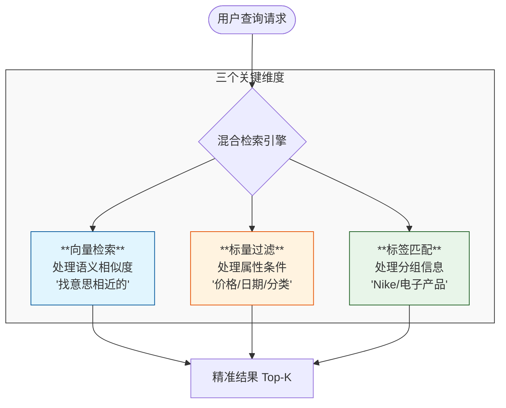


### 2. StreamingDiskANN 索引结构与搜索原理

pgvectorscale 的核心是 **StreamingDiskANN**。它像一个“社交网络图”，让你能通过“朋友的朋友”快速找到目标。

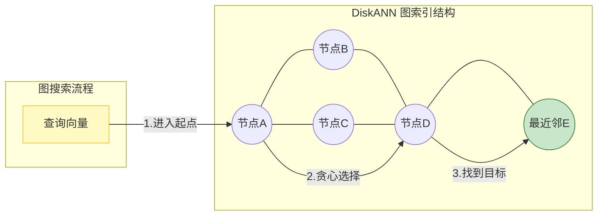


### 3. 标签过滤：索引级集成（Filtered Search）

这是 pgvectorscale 性能飞跃的关键。它不是先搜再筛，而是**边搜边筛**。

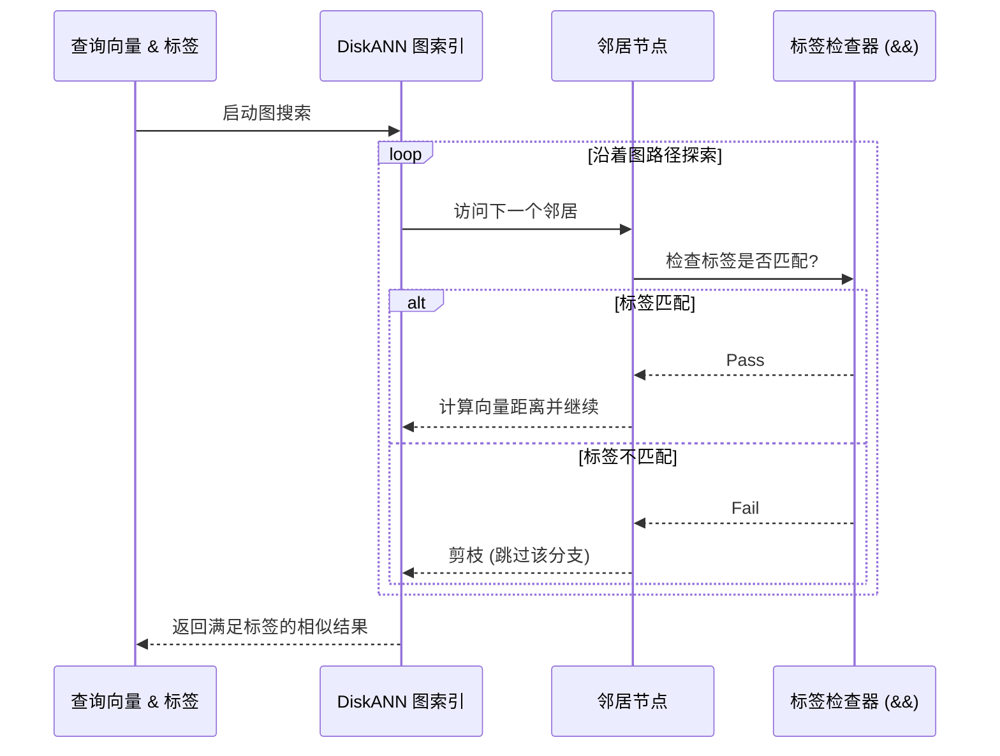


### 4. SBQ（统计二进制量化）加速原理

SBQ 是 pgvectorscale 节省成本、提高速度的“降维打击”武器。

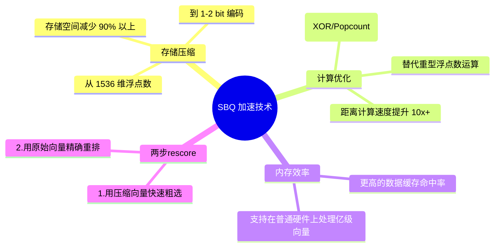


### 学习小贴士：

* **不要混淆 RRF 和 pgvectorscale**：传统的 RRF（倒数排名融合）是把多个搜索结果列表“强行拼接”，而 pgvectorscale 是在**索引内部**就完成了过滤，效率更高。
* **标签格式**：记得标签数组必须是 `smallint[]` 类型，这是为了极致的性能优化。
* **SBQ 的妙处**：它就像把高清电影转成了流媒体，虽然损失了一点点画质，但加载速度快了无数倍，且最后还可以通过“重排序”把清晰度补回来。

---

一组**对比总结图**

**VectorChord**（侧重多级预取与 RaBitQ）

**pgvectorscale**（侧重 StreamingDiskANN 与 SBQ） 

这组图表将帮助学生在期末考试或实际项目选型时，一眼看出这两大“黑马”级向量插件的区别。

### 1. 核心技术对比：谁更适合什么场景？

这张思维导图总结了两者的技术差异，方便学生建立宏观视野。

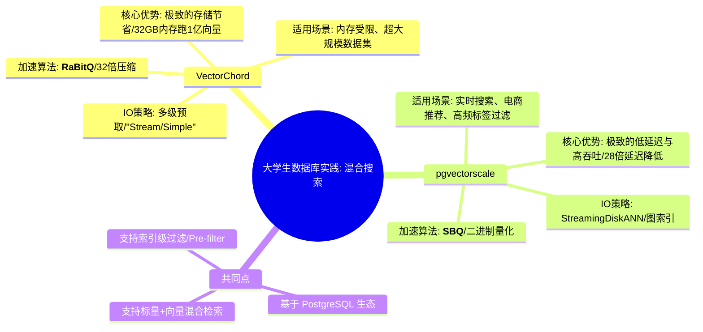


### 2. 索引内部过滤逻辑的微观差异

虽然两者都支持“索引内过滤”，但它们的实现侧重点略有不同：

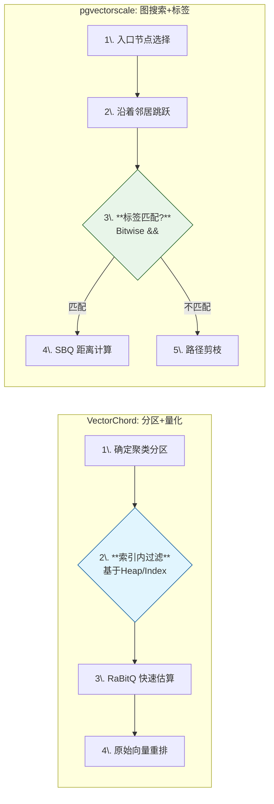


### 3. 学生实战：混合搜索代码模板（Cheat Sheet）

为了方便学生写作业或做实验，我整理了这个对比代码块的 Mermaid 展示：

```mermaid
VectorChord_Syntax {
  SET vchordrq.prefilter = true
  ORDER BY v <-> query_vector
  WHERE category = 'AI'
  LIMIT 10
}

pgvectorscale_Syntax {
  USING diskann (embedding, labels)
  WHERE labels && '{1,2}'
  ORDER BY v <=> query_vector
  SET diskann.query_rescore = 50
}
```
  
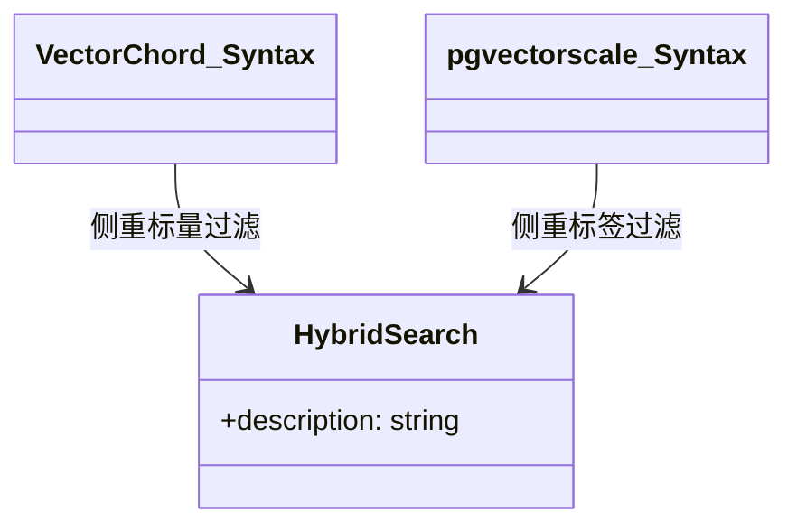


### 4. 性能提升直观图 

这张图可以作为 PPT 的结尾，展示加速技术带来的巨大震撼。

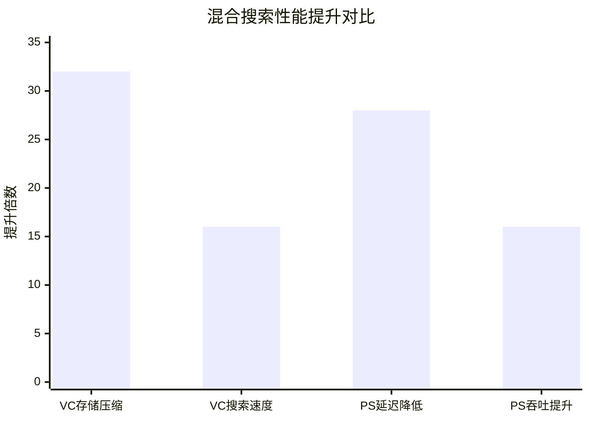


### 总结与下一步建议：

在教学中，老师可以引导学生思考：

1. **数据的“形状”** ：如果数据有很多精确的类别（标签），**pgvectorscale** 的图剪枝非常高效。
2. **硬件的“贫富”** ：如果服务器内存很小，但想存海量向量，**VectorChord** 是救命稻草。
3. **未来的方向**：这两种插件都在向“存算分离”和“极致压缩”演进，这就是现代 AI 数据库的演进趋势。

  
  
#### [PolarDB 学习图谱](https://www.aliyun.com/database/openpolardb/activity "8642f60e04ed0c814bf9cb9677976bd4")
  
  
#### [PostgreSQL 解决方案集合](../201706/20170601_02.md "40cff096e9ed7122c512b35d8561d9c8")
  
  
#### [德哥 / digoal's Github - 公益是一辈子的事.](https://github.com/digoal/blog/blob/master/README.md "22709685feb7cab07d30f30387f0a9ae")
  
  
#### [About 德哥](https://github.com/digoal/blog/blob/master/me/readme.md "a37735981e7704886ffd590565582dd0")
  
  

  
