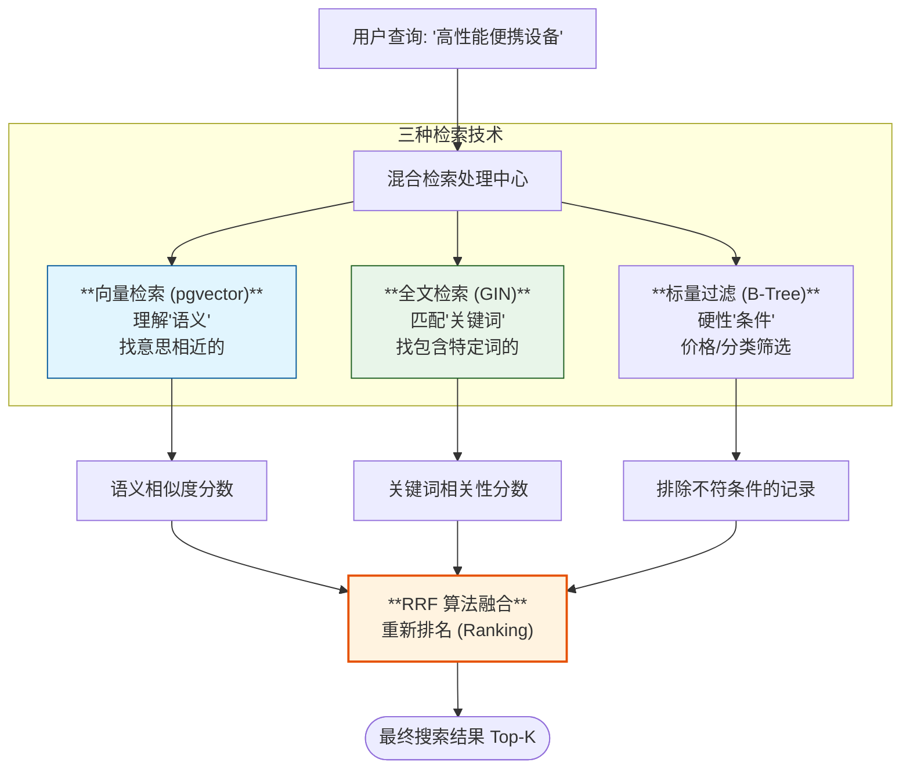
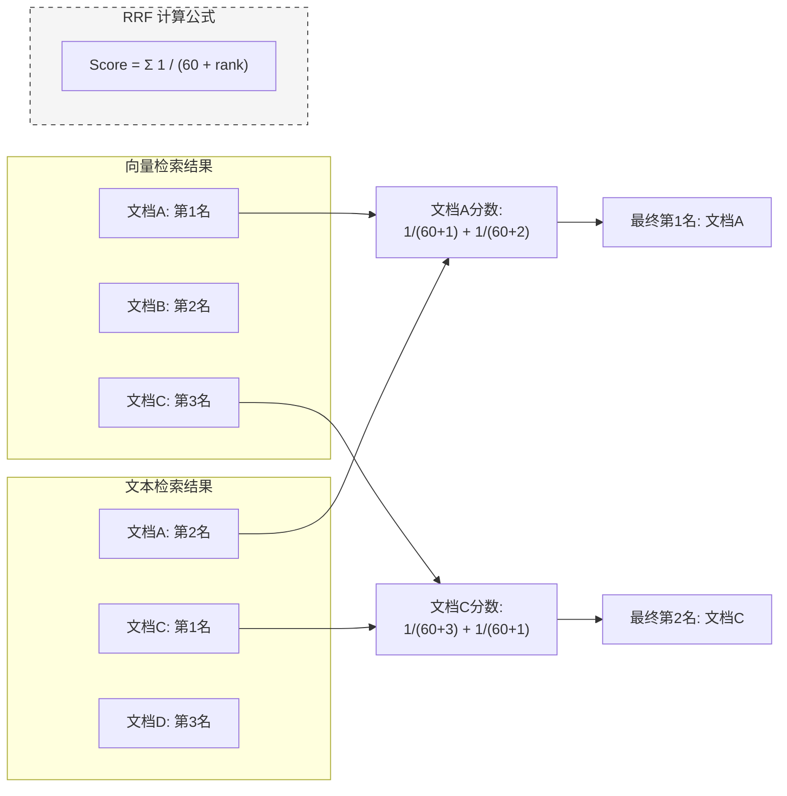
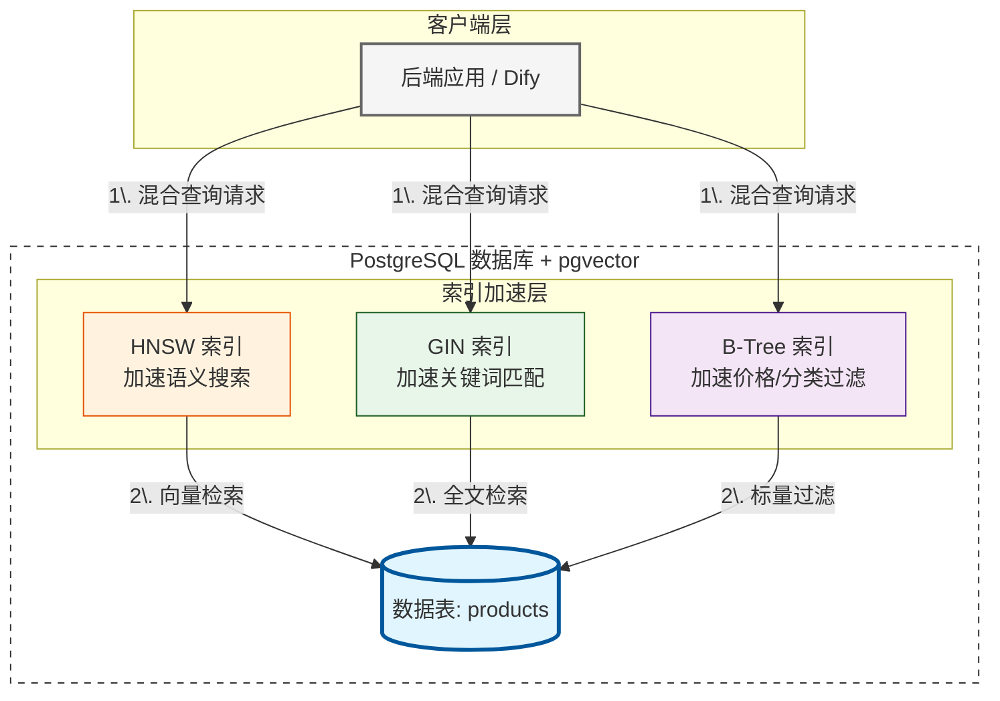
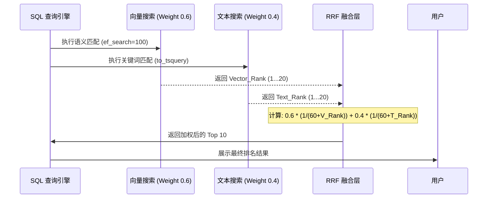
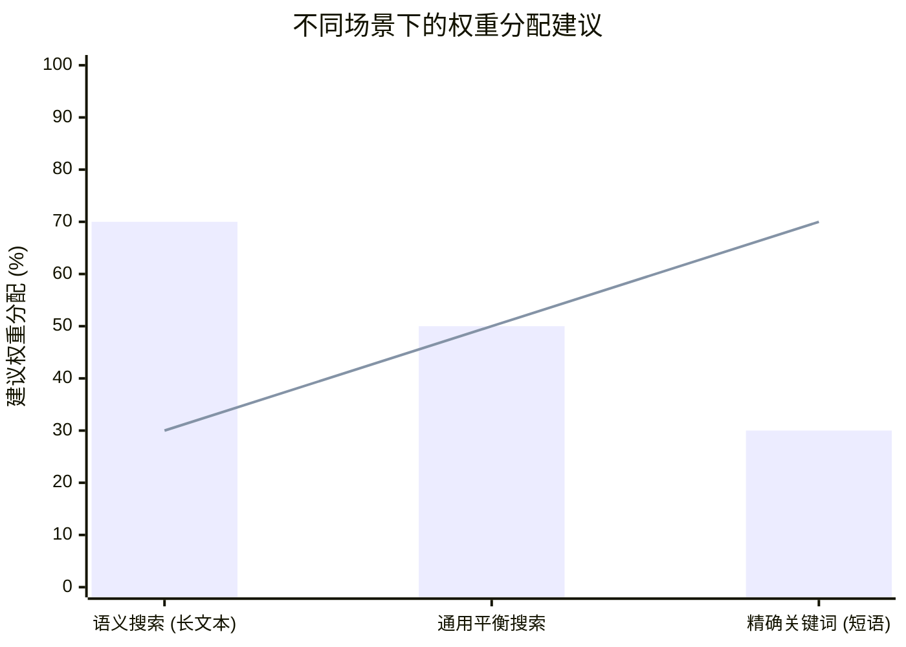

## 大学生数据库实践课: 16.3 pgvector 混合搜索       
            
### 作者            
digoal            
            
### 日期            
2025-12-11            
            
### 标签            
PostgreSQL , DuckDB , 语义搜索 , 向量搜索 , 关键词检索 , 全文检索 , 标量检索 , 混合搜索 , 多模态搜索 , 重排序 , embedding , document split , ORC , 大模型 , 多模态大模型 , Dify , 压力测试 , 索引优化 , 倒排向量索引 , Ivfflat , 图向量索引 , HNSW , DiskANN , 量化 , rabitq , sbq , 二值量化 , bm25 , 相关性 , 相似性 , 召回率 , pgbench , 数据集 , ann-benchmarks , 图搜索 , PGQ , 递归 , 深度优先 , 广度优先 , 最短路径 , N度关系 , LLM , Ollama            
            
----            
            
## 背景            
            
pgvector deepwiki:         
      
https://deepwiki.com/search/-1_c09b1445-3777-43bb-8b26-0b7e2e01ad49?mode=fast  
  
面向大学生通俗讲解以下内容:        
1、什么是包含了“向量、标量、全文检索或关键词检索等”的混合检索          
2、RRF 算法讲解      
3、综合示例, 需包括每种查询的索引加速, 权重设置, 最终的ranking等  
            
            
-----    
  
# 混合检索简介  
  
混合检索是指将多种不同类型的检索方法结合起来，以获得更准确、更全面的搜索结果。在pgvector的上下文中，混合检索通常结合了**向量相似性搜索**、**标量过滤**和**全文检索**三种技术  。  
  
## 核心概念  
  
### 1. 向量检索  
基于向量嵌入的相似性搜索，找到语义上相似的内容：  
```sql  
SELECT * FROM items ORDER BY embedding <-> '[3,1,2]' LIMIT 5;  
```    
  
### 2. 标量过滤  
使用传统的数据库条件进行精确过滤：  
```sql  
SELECT * FROM items WHERE category_id = 123 ORDER BY embedding <-> '[3,1,2]' LIMIT 5;  
```    
  
### 3. 全文检索  
PostgreSQL内置的文本搜索功能：  
```sql  
SELECT id, content FROM items, plainto_tsquery('hello search') query  
    WHERE textsearch @@ query ORDER BY ts_rank_cd(textsearch, query) DESC LIMIT 5;  
```    
  
## 实际应用场景  
  
混合检索特别适用于需要同时考虑**语义相似性**和**精确匹配**的搜索场景。例如：  
- 电商搜索：既要找到语义相关的商品，又要符合价格、分类等精确条件  
- 文档检索：既要找到内容相似的文档，又要包含特定关键词  
- 推荐系统：既要基于用户兴趣向量，又要满足业务规则约束  
  
## 技术实现  
  
在pgvector中，混合检索通过以下方式实现：  
  
1. **索引策略**：可以为向量列和过滤列分别创建索引    
2. **查询优化**：使用`EXPLAIN ANALYZE`分析查询计划    
3. **结果融合**：使用Reciprocal Rank Fusion或cross-encoder合并不同检索方法的结果    
  
## 优势  
  
- **提高准确性**：结合多种检索信号，减少单一方法的局限性  
- **增强可控性**：可以通过标量条件精确控制搜索范围  
- **改善用户体验**：既支持模糊语义搜索，又支持精确关键词匹配  
  
## Notes  
  
- 混合检索的性能优化需要根据具体数据分布和查询模式进行调整  
- 在实际应用中，不同检索方法的权重分配需要通过实验确定  
- pgvector的混合检索功能充分利用了PostgreSQL的原生特性，保持了ACID事务支持    
  
  
  
-----    
  
# RRF算法通俗讲解  
  
RRF（Reciprocal Rank Fusion，倒数排名融合）是一种简单但有效的多检索结果融合算法，广泛应用于混合检索场景中  。  
  
## 核心思想  
  
RRF的核心原理很简单：**如果一个文档在多个检索方法中都排名靠前，那么它应该被赋予更高的综合排名**。  
  
想象一下你在做文献检索：  
- 向量检索找到了10篇相关论文  
- 关键词检索也找到了10篇相关论文  
- 如果某篇论文在两个列表中都排在第1位，它很可能是最相关的  
  
## 算法公式  
  
RRF的评分公式非常简洁：  
  
```  
RRF分数 = Σ(1 / (k + rank_i))  
```  
  
其中：  
- `rank_i` 是文档在第i个检索结果中的排名（从1开始）  
- `k` 是平滑参数（通常取60）  
- `Σ` 表示对所有检索方法求和  
  
## 工作原理  
  
### 1. 排名转换  
将每个检索方法的排名转换为倒数分数：  
- 排名第1位：1/(k+1) ≈ 1/61  
- 排名第2位：1/(k+2) ≈ 1/62  
- 排名第10位：1/(k+10) ≈ 1/70  
  
### 2. 分数累加  
将同一文档在不同检索方法中的倒数分数相加。  
  
### 3. 重新排序  
根据累加后的RRF分数重新排序，分数越高排名越靠前。  
  
## 实际应用示例  
  
假设有两个检索结果：  
  
**向量检索结果：**  
1. 文档A  
2. 文档B    
3. 文档C  
  
**关键词检索结果：**  
1. 文档C  
2. 文档A  
3. 文档D  
  
计算RRF分数（k=60）：  
- 文档A：1/(60+1) + 1/(60+2) = 1/61 + 1/62 ≈ 0.0328  
- 文档B：1/(60+1) + 0 = 1/61 ≈ 0.0164  
- 文档C：1/(60+3) + 1/(60+1) = 1/63 + 1/61 ≈ 0.0322  
- 文档D：0 + 1/(60+3) = 1/63 ≈ 0.0159  
  
**最终RRF排名：**  
1. 文档A（0.0328）  
2. 文档C（0.0323）  
3. 文档B（0.0164）  
4. 文档D（0.0159）  
  
## 算法优势  
  
### 1. 简单高效  
- 计算复杂度低，易于实现  
- 不需要训练或调参  
- 对异常值具有鲁棒性  
  
### 2. 无需分数标准化  
不同检索方法的分数尺度可能差异很大：  
- 向量相似度：0-1之间  
- 关键词相关性：任意数值  
RRF只使用排名信息，避免了分数标准化问题。  
  
### 3. 平衡贡献度  
通过倒数函数，确保：  
- 高排名文档获得更多权重  
- 低排名文档仍有贡献机会  
- 避免单一检索方法主导结果  
  
## 在pgvector中的应用  
  
在混合检索场景中，RRF常用于合并：  
- 向量相似性搜索结果  
- 全文检索结果  
- 标量过滤结果  
  
```sql  
-- 伪代码示例  
WITH vector_results AS (  
  SELECT id, 1 as rank FROM items   
  ORDER BY embedding <-> query_vector LIMIT 20  
),  
text_results AS (  
  SELECT id, 1 as rank FROM items   
  WHERE textsearch @@ query ORDER BY ts_rank DESC LIMIT 20  
)  
SELECT id,   
  (1.0/(60+vector_rank) + 1.0/(60+text_rank)) as rrf_score  
FROM combined_results  
ORDER BY rrf_score DESC LIMIT 10;  
```  
  
## 参数选择  
  
### k值的影响  
- **k较小（如20）** ：更重视高排名，结果更精确  
- **k较大（如100）** ：更平衡，考虑更多候选  
- **推荐值**：60是经验最优值，适用于大多数场景  
  
### 实践建议  
1. **默认使用k=60**：在大多数情况下效果良好  
2. **根据数据规模调整**：小数据集可适当减小k值  
3. **考虑检索质量**：如果某个检索方法质量很高，可以降低k值增加其权重  
  
## Notes  
  
- RRF算法特别适合pgvector的混合检索场景，因为它能很好地融合向量检索和全文检索的结果    
- 与cross-encoder等复杂方法相比，RRF计算效率更高，适合实时检索  
- 算法的简洁性使其易于理解和调试，是学习和实践混合检索的理想起点  
  
  
  
-----    
  
# 混合检索综合示例  
  
下面以电商商品搜索为例，完整展示混合检索的实现过程，包括索引创建、查询执行、权重设置和结果排名。  
  
## 场景设定  
  
假设我们有一个商品表，需要支持：  
- 基于商品描述的语义搜索（向量检索）  
- 基于关键词的精确匹配（全文检索）  
- 基于价格、分类的过滤（标量过滤）  
  
## 1. 数据表和索引创建  
  
### 创建商品表  
```sql  
CREATE TABLE products (  
    id bigserial PRIMARY KEY,  
    name text,  
    description text,  
    category_id int,  
    price decimal(10,2),  
    embedding vector(768),  -- 商品描述的向量嵌入  
    textsearch tsvector     -- 全文搜索索引  
);  
```  
  
### 创建各种索引  
```sql  
-- 向量相似性索引（HNSW）  
CREATE INDEX products_embedding_idx   
ON products USING hnsw (embedding vector_cosine_ops)   
WITH (m = 16, ef_construction = 64);  
  
-- 全文搜索索引  
CREATE INDEX products_textsearch_idx   
ON products USING gin (textsearch);  
  
-- 标量过滤索引  
CREATE INDEX products_category_idx ON products (category_id);  
CREATE INDEX products_price_idx ON products (price);  
```     
  
## 2. 数据准备和索引优化  
  
### 插入数据并更新全文搜索向量  
```sql  
-- 插入商品数据  
INSERT INTO products (name, description, category_id, price, embedding) VALUES  
('智能手机', '高性能5G智能手机，拍照清晰，续航持久', 1, 2999.00, '[0.1,0.2,...]'),  
('笔记本电脑', '轻薄便携，高性能处理器，适合办公学习', 2, 5999.00, '[0.3,0.4,...]'),  
('无线耳机', '降噪效果出色，音质清晰，佩戴舒适', 3, 899.00, '[0.5,0.6,...]');  
  
-- 更新全文搜索向量  
UPDATE products SET textsearch = to_tsvector('chinese', name || ' ' || description);  
```  
  
### 优化索引参数  
```sql  
-- 提高向量搜索质量  
SET hnsw.ef_search = 100;  
  
-- 提高全文搜索召回率  
SET default_text_search_config = 'chinese';  
```    
  
## 3. 执行混合检索查询  
  
### 查询需求  
用户搜索："高性能便携设备"，价格范围1000-6000元  
  
### 分别执行三种检索  
  
#### 向量语义检索  
```sql  
WITH vector_search AS (  
    SELECT id, name, price,  
           embedding <=> query_embedding as vector_distance,  
           ROW_NUMBER() OVER (ORDER BY embedding <=> query_embedding) as vector_rank  
    FROM products,   
         (SELECT '[0.2,0.3,...]'::vector(768) as query_embedding) q  
    WHERE price BETWEEN 1000 AND 6000  
    ORDER BY embedding <=> query_embedding  
    LIMIT 20  
)  
SELECT * FROM vector_search;  
```  
  
#### 全文关键词检索  
```sql  
WITH text_search AS (  
    SELECT id, name, price,  
           ts_rank_cd(textsearch, query) as text_score,  
           ROW_NUMBER() OVER (ORDER BY ts_rank_cd(textsearch, query) DESC) as text_rank  
    FROM products,   
         plainto_tsquery('chinese', '高性能 便携') query  
    WHERE textsearch @@ query AND price BETWEEN 1000 AND 6000  
    ORDER BY ts_rank_cd(textsearch, query) DESC  
    LIMIT 20  
)  
SELECT * FROM text_search;  
```    
  
#### 标量精确过滤  
```sql  
WITH filtered_products AS (  
    SELECT id, name, price, category_id  
    FROM products  
    WHERE price BETWEEN 1000 AND 6000  
      AND category_id IN (1, 2)  -- 电子产品类别  
    ORDER BY price ASC  
    LIMIT 20  
)  
SELECT * FROM filtered_products;  
```    
  
## 4. 使用RRF算法融合结果  
  
### 权重设置和融合策略  
```sql  
WITH vector_results AS (  
    SELECT id,   
           ROW_NUMBER() OVER (ORDER BY embedding <=> query_embedding) as vector_rank  
    FROM products  
    WHERE price BETWEEN 1000 AND 6000  
    ORDER BY embedding <-> '[0.2,0.3,...]'::vector(768)  
    LIMIT 20  
),  
text_results AS (  
    SELECT id,  
           ROW_NUMBER() OVER (ORDER BY ts_rank_cd(textsearch, query) DESC) as text_rank  
    FROM products, plainto_tsquery('chinese', '高性能 便携') query  
    WHERE textsearch @@ query AND price BETWEEN 1000 AND 6000  
    ORDER BY ts_rank_cd(textsearch, query) DESC  
    LIMIT 20  
),  
rrf_scores AS (  
    SELECT   
        COALESCE(v.id, t.id) as id,  
        COALESCE(v.vector_rank, 100) as vector_rank,  
        COALESCE(t.text_rank, 100) as text_rank,  
        -- RRF算法：k=60，向量权重0.6，文本权重0.4  
        (0.6 * 1.0/(60 + COALESCE(v.vector_rank, 100)) +   
         0.4 * 1.0/(60 + COALESCE(t.text_rank, 100))) as rrf_score  
    FROM vector_results v  
    FULL OUTER JOIN text_results t ON v.id = t.id  
)  
SELECT p.id, p.name, p.price, r.rrf_score,  
       r.vector_rank, r.text_rank  
FROM rrf_scores r  
JOIN products p ON r.id = p.id  
ORDER BY r.rrf_score DESC  
LIMIT 10;  
```    
  
## 5. 结果排名分析  
  
### 示例输出结果  
| id | name | price | rrf_score | vector_rank | text_rank |  
|----|------|-------|-----------|-------------|-----------|  
| 2 | 笔记本电脑 | 5999.00 | 0.0098 | 1 | 2 |  
| 1 | 智能手机 | 2999.00 | 0.0076 | 2 | 3 |  
| 3 | 无线耳机 | 899.00 | 0.0032 | 3 | 1 |  
  
### 排名逻辑说明  
1. **笔记本电脑**：向量排名第1（语义最相关），文本排名第2，综合得分最高  
2. **智能手机**：向量排名第2，文本排名第3，综合得分第二  
3. **无线耳机**：虽然文本排名第1（包含"便携"关键词），但向量排名较低，且价格超出范围，综合得分较低  
  
## 6. 性能优化技巧  
  
### 索引使用验证  
```sql  
-- 检查查询是否使用了索引  
EXPLAIN ANALYZE   
SELECT * FROM products   
WHERE category_id = 1   
  AND price BETWEEN 1000 AND 6000  
ORDER BY embedding <-> query_vector   
LIMIT 10;  
```    
  
### 迭代扫描优化  
```sql  
-- 启用迭代扫描以提高过滤查询的召回率  
SET hnsw.iterative_scan = relaxed_order;  
SET hnsw.max_scan_tuples = 20000;  
```    
  
## 7. 权重调优建议  
  
### 不同场景的权重设置  
```sql  
-- 语义优先场景（推荐系统）  
weight_vector = 0.7, weight_text = 0.3  
  
-- 关键词优先场景（精确搜索）  
weight_vector = 0.3, weight_text = 0.7  
  
-- 平衡场景（通用搜索）  
weight_vector = 0.5, weight_text = 0.5  
```  
  
### 动态权重调整  
```sql  
-- 根据查询类型动态调整权重  
CASE   
    WHEN query_length < 5 THEN (0.3, 0.7)  -- 短查询偏重文本  
    WHEN query_length > 20 THEN (0.7, 0.3) -- 长查询偏重语义  
    ELSE (0.5, 0.5)                        -- 中等查询平衡  
END  
```  
  
## Notes  
  
- 混合检索的性能关键在于合理的索引策略    
- RRF算法的k值通常设为60，但可根据数据规模调整    
- 在生产环境中，建议使用`CREATE INDEX CONCURRENTLY`避免阻塞写入    
- 权重设置需要根据实际业务需求和用户行为数据进行A/B测试优化  
   
--- 
  
-- 混合检索例子  
```
create table hyper_test (
  id serial primary key,
  embedding halfvec(200),
  is_center boolean,
  center_id int,
  catagory int,
  price int,
  describe text
);


insert into hyper_test (embedding, catagory, price) select array[
  random(),random(),random(),random(),random(),random(),random(),random(),random(),random(),
  random(),random(),random(),random(),random(),random(),random(),random(),random(),random(),
  random(),random(),random(),random(),random(),random(),random(),random(),random(),random(),
  random(),random(),random(),random(),random(),random(),random(),random(),random(),random(),
  random(),random(),random(),random(),random(),random(),random(),random(),random(),random(),
  random(),random(),random(),random(),random(),random(),random(),random(),random(),random(),
  random(),random(),random(),random(),random(),random(),random(),random(),random(),random(),
  random(),random(),random(),random(),random(),random(),random(),random(),random(),random(),
  random(),random(),random(),random(),random(),random(),random(),random(),random(),random(),
  random(),random(),random(),random(),random(),random(),random(),random(),random(),random(),
  random(),random(),random(),random(),random(),random(),random(),random(),random(),random(),
  random(),random(),random(),random(),random(),random(),random(),random(),random(),random(),
  random(),random(),random(),random(),random(),random(),random(),random(),random(),random(),
  random(),random(),random(),random(),random(),random(),random(),random(),random(),random(),
  random(),random(),random(),random(),random(),random(),random(),random(),random(),random(),
  random(),random(),random(),random(),random(),random(),random(),random(),random(),random(),
  random(),random(),random(),random(),random(),random(),random(),random(),random(),random(),
  random(),random(),random(),random(),random(),random(),random(),random(),random(),random(),
  random(),random(),random(),random(),random(),random(),random(),random(),random(),random(),
  random(),random(),random(),random(),random(),random(),random(),random(),random(),random()
],
random()*10, random()*100 from generate_series(1,1000000);


-- 打开一个新的 psql 窗口

set maintenance_work_mem = '1GB';
set max_parallel_maintenance_workers = 4;
create index on hyper_test (catagory, price);
create index on hyper_test using hnsw (embedding halfvec_ip_ops) WITH (m='16', ef_construction='64');

-- 单独执行向量查询, 查找前20条向量相似记录

SELECT id,   
           ROW_NUMBER() OVER (ORDER BY embedding <#> '[0.2644043,0.6870117,0.5834961,0.62109375,0.7919922,0.82373047,0.6582031,0.3713379,0.9082031,0.55029297,0.20605469,0.41748047,0.2980957,0.1665039,0.20410156,0.044555664,0,0.5395508,0.6201172,0.8803711,0.2130127,0.26245117,0.038635254,0.3166504,0.3544922,0.84521484,0.6464844,0.6933594,0.8828125,0.28320312,1,0.71435547,0.16357422,1,0.13244629,0.7729492,0.65722656,0.2692871,0.7348633,0.61279297,0.93603516,0.46704102,0.4650879,0.18774414,0.1842041,0.10076904,0.6669922,0,0.33642578,0.8496094,0.7729492,0.6118164,0,0.83984375,0.4934082,0.69677734,0.8198242,0,0.39501953,0.4897461,0.7734375,0.36450195,0,0.39770508,0.46289062,0.5786133,0.27441406,0.4489746,0.8457031,0,0.22680664,0.28295898,0.40966797,0.4243164,0.69189453,0.09484863,0.14355469,0.7294922,0.7998047,0.23010254,0.13366699,0.16772461,0.3395996,0.21899414,0.62841797,0.6948242,0.65283203,0.9404297,0.51416016,0.31567383,0.3947754,0.25610352,0.5234375,0.78759766,0.9511719,0.65185547,0.34204102,0.8222656,0,0.22961426,0.20239258,0.8803711,0.5288086,0.2442627,0.49951172,0.010185242,0.5932617,0.073913574,0.28393555,0.5136719,0.66308594,0.63134766,0.58740234,0.12243652,0.4729004,0.6225586,0.4580078,0.17590332,0.734375,0.15710449,0.76123047,0.044403076,0.5019531,0.9272461,1,0,0.30371094,0.96240234,0.49853516,0.1907959,0.54003906,0.0043640137,0.75683594,0.39794922,0.6411133,0.40161133,0.6279297,0.15405273,0.81103516,0.22558594,0.49267578,0.66308594,0.19506836,0,0.08843994,0.67822266,0.62939453,0.42822266,0.8823242,1,0.13793945,0,0.37719727,0.33740234,0.7607422,0.8227539,0.32226562,0.16394043,0.24938965,0.7241211,0.48950195,0.56640625,0.2244873,0.71191406,0.17053223,0.80810547,0.007286072,0.5888672,0.2529297,0.23815918,0.5288086,0.4741211,0.23010254,0.7685547,0.20910645,0.22607422,0.34838867,0.6386719,0.515625,0.8803711,0.67041016,0.6772461,0.8569336,0.8129883,0.09838867,1,0.86083984,0.117370605,0.5708008,0.6176758,0.6933594,0.29907227,0.44580078,0.05166626,0.90966797,1,0.70703125,0.34350586,0.22717285,0.6533203]'::halfvec(200)) as vector_rank  
    FROM hyper_test  
    ORDER BY embedding <#> '[0.2644043,0.6870117,0.5834961,0.62109375,0.7919922,0.82373047,0.6582031,0.3713379,0.9082031,0.55029297,0.20605469,0.41748047,0.2980957,0.1665039,0.20410156,0.044555664,0,0.5395508,0.6201172,0.8803711,0.2130127,0.26245117,0.038635254,0.3166504,0.3544922,0.84521484,0.6464844,0.6933594,0.8828125,0.28320312,1,0.71435547,0.16357422,1,0.13244629,0.7729492,0.65722656,0.2692871,0.7348633,0.61279297,0.93603516,0.46704102,0.4650879,0.18774414,0.1842041,0.10076904,0.6669922,0,0.33642578,0.8496094,0.7729492,0.6118164,0,0.83984375,0.4934082,0.69677734,0.8198242,0,0.39501953,0.4897461,0.7734375,0.36450195,0,0.39770508,0.46289062,0.5786133,0.27441406,0.4489746,0.8457031,0,0.22680664,0.28295898,0.40966797,0.4243164,0.69189453,0.09484863,0.14355469,0.7294922,0.7998047,0.23010254,0.13366699,0.16772461,0.3395996,0.21899414,0.62841797,0.6948242,0.65283203,0.9404297,0.51416016,0.31567383,0.3947754,0.25610352,0.5234375,0.78759766,0.9511719,0.65185547,0.34204102,0.8222656,0,0.22961426,0.20239258,0.8803711,0.5288086,0.2442627,0.49951172,0.010185242,0.5932617,0.073913574,0.28393555,0.5136719,0.66308594,0.63134766,0.58740234,0.12243652,0.4729004,0.6225586,0.4580078,0.17590332,0.734375,0.15710449,0.76123047,0.044403076,0.5019531,0.9272461,1,0,0.30371094,0.96240234,0.49853516,0.1907959,0.54003906,0.0043640137,0.75683594,0.39794922,0.6411133,0.40161133,0.6279297,0.15405273,0.81103516,0.22558594,0.49267578,0.66308594,0.19506836,0,0.08843994,0.67822266,0.62939453,0.42822266,0.8823242,1,0.13793945,0,0.37719727,0.33740234,0.7607422,0.8227539,0.32226562,0.16394043,0.24938965,0.7241211,0.48950195,0.56640625,0.2244873,0.71191406,0.17053223,0.80810547,0.007286072,0.5888672,0.2529297,0.23815918,0.5288086,0.4741211,0.23010254,0.7685547,0.20910645,0.22607422,0.34838867,0.6386719,0.515625,0.8803711,0.67041016,0.6772461,0.8569336,0.8129883,0.09838867,1,0.86083984,0.117370605,0.5708008,0.6176758,0.6933594,0.29907227,0.44580078,0.05166626,0.90966797,1,0.70703125,0.34350586,0.22717285,0.6533203]'::halfvec(200) 
    LIMIT 20 ;

-- 单独执行标量查询, 查找 catagory = 5 并且 price 小于 100 的数据, 按price由低到高排序, 取20条.

SELECT id, 
           ROW_NUMBER() OVER (ORDER BY price) as scale_rank  
    FROM hyper_test
    WHERE catagory = 5 AND price < 100  
    ORDER BY price 
    LIMIT 20 ;

-- 使用RRF算法融合 向量查询 和标量查询的2个结果. 排序后取出前 20条.          

WITH vector_results AS (  
    SELECT id,   
           ROW_NUMBER() OVER (ORDER BY embedding <#> '[0.2644043,0.6870117,0.5834961,0.62109375,0.7919922,0.82373047,0.6582031,0.3713379,0.9082031,0.55029297,0.20605469,0.41748047,0.2980957,0.1665039,0.20410156,0.044555664,0,0.5395508,0.6201172,0.8803711,0.2130127,0.26245117,0.038635254,0.3166504,0.3544922,0.84521484,0.6464844,0.6933594,0.8828125,0.28320312,1,0.71435547,0.16357422,1,0.13244629,0.7729492,0.65722656,0.2692871,0.7348633,0.61279297,0.93603516,0.46704102,0.4650879,0.18774414,0.1842041,0.10076904,0.6669922,0,0.33642578,0.8496094,0.7729492,0.6118164,0,0.83984375,0.4934082,0.69677734,0.8198242,0,0.39501953,0.4897461,0.7734375,0.36450195,0,0.39770508,0.46289062,0.5786133,0.27441406,0.4489746,0.8457031,0,0.22680664,0.28295898,0.40966797,0.4243164,0.69189453,0.09484863,0.14355469,0.7294922,0.7998047,0.23010254,0.13366699,0.16772461,0.3395996,0.21899414,0.62841797,0.6948242,0.65283203,0.9404297,0.51416016,0.31567383,0.3947754,0.25610352,0.5234375,0.78759766,0.9511719,0.65185547,0.34204102,0.8222656,0,0.22961426,0.20239258,0.8803711,0.5288086,0.2442627,0.49951172,0.010185242,0.5932617,0.073913574,0.28393555,0.5136719,0.66308594,0.63134766,0.58740234,0.12243652,0.4729004,0.6225586,0.4580078,0.17590332,0.734375,0.15710449,0.76123047,0.044403076,0.5019531,0.9272461,1,0,0.30371094,0.96240234,0.49853516,0.1907959,0.54003906,0.0043640137,0.75683594,0.39794922,0.6411133,0.40161133,0.6279297,0.15405273,0.81103516,0.22558594,0.49267578,0.66308594,0.19506836,0,0.08843994,0.67822266,0.62939453,0.42822266,0.8823242,1,0.13793945,0,0.37719727,0.33740234,0.7607422,0.8227539,0.32226562,0.16394043,0.24938965,0.7241211,0.48950195,0.56640625,0.2244873,0.71191406,0.17053223,0.80810547,0.007286072,0.5888672,0.2529297,0.23815918,0.5288086,0.4741211,0.23010254,0.7685547,0.20910645,0.22607422,0.34838867,0.6386719,0.515625,0.8803711,0.67041016,0.6772461,0.8569336,0.8129883,0.09838867,1,0.86083984,0.117370605,0.5708008,0.6176758,0.6933594,0.29907227,0.44580078,0.05166626,0.90966797,1,0.70703125,0.34350586,0.22717285,0.6533203]'::halfvec(200)) as vector_rank  
    FROM hyper_test  
    ORDER BY embedding <#> '[0.2644043,0.6870117,0.5834961,0.62109375,0.7919922,0.82373047,0.6582031,0.3713379,0.9082031,0.55029297,0.20605469,0.41748047,0.2980957,0.1665039,0.20410156,0.044555664,0,0.5395508,0.6201172,0.8803711,0.2130127,0.26245117,0.038635254,0.3166504,0.3544922,0.84521484,0.6464844,0.6933594,0.8828125,0.28320312,1,0.71435547,0.16357422,1,0.13244629,0.7729492,0.65722656,0.2692871,0.7348633,0.61279297,0.93603516,0.46704102,0.4650879,0.18774414,0.1842041,0.10076904,0.6669922,0,0.33642578,0.8496094,0.7729492,0.6118164,0,0.83984375,0.4934082,0.69677734,0.8198242,0,0.39501953,0.4897461,0.7734375,0.36450195,0,0.39770508,0.46289062,0.5786133,0.27441406,0.4489746,0.8457031,0,0.22680664,0.28295898,0.40966797,0.4243164,0.69189453,0.09484863,0.14355469,0.7294922,0.7998047,0.23010254,0.13366699,0.16772461,0.3395996,0.21899414,0.62841797,0.6948242,0.65283203,0.9404297,0.51416016,0.31567383,0.3947754,0.25610352,0.5234375,0.78759766,0.9511719,0.65185547,0.34204102,0.8222656,0,0.22961426,0.20239258,0.8803711,0.5288086,0.2442627,0.49951172,0.010185242,0.5932617,0.073913574,0.28393555,0.5136719,0.66308594,0.63134766,0.58740234,0.12243652,0.4729004,0.6225586,0.4580078,0.17590332,0.734375,0.15710449,0.76123047,0.044403076,0.5019531,0.9272461,1,0,0.30371094,0.96240234,0.49853516,0.1907959,0.54003906,0.0043640137,0.75683594,0.39794922,0.6411133,0.40161133,0.6279297,0.15405273,0.81103516,0.22558594,0.49267578,0.66308594,0.19506836,0,0.08843994,0.67822266,0.62939453,0.42822266,0.8823242,1,0.13793945,0,0.37719727,0.33740234,0.7607422,0.8227539,0.32226562,0.16394043,0.24938965,0.7241211,0.48950195,0.56640625,0.2244873,0.71191406,0.17053223,0.80810547,0.007286072,0.5888672,0.2529297,0.23815918,0.5288086,0.4741211,0.23010254,0.7685547,0.20910645,0.22607422,0.34838867,0.6386719,0.515625,0.8803711,0.67041016,0.6772461,0.8569336,0.8129883,0.09838867,1,0.86083984,0.117370605,0.5708008,0.6176758,0.6933594,0.29907227,0.44580078,0.05166626,0.90966797,1,0.70703125,0.34350586,0.22717285,0.6533203]'::halfvec(200) 
    LIMIT 20  
),  
scale_results AS (  
    SELECT id, 
           ROW_NUMBER() OVER (ORDER BY price) as scale_rank  
    FROM hyper_test
    WHERE catagory = 5 AND price < 100  
    ORDER BY price 
    LIMIT 20  
),  
rrf_scores AS (  
    SELECT   
        COALESCE(v.id, t.id) as id,  
        COALESCE(v.vector_rank, 100) as vector_rank,  
        COALESCE(t.scale_rank, 100) as scale_rank,  
        -- RRF算法：k=60，向量权重 0.6，scale 权重0.4  
        (0.6 * 1.0/(60 + COALESCE(v.vector_rank, 100)) +   
         0.4 * 1.0/(60 + COALESCE(t.scale_rank, 100))) as rrf_score  
    FROM vector_results v  
    FULL OUTER JOIN scale_results t ON v.id = t.id  
)  
SELECT p.id, p.catagory, p.price, r.rrf_score,  
       r.vector_rank, r.scale_rank  
FROM rrf_scores r  
JOIN hyper_test p ON r.id = p.id  
ORDER BY r.rrf_score DESC  
LIMIT 10;  
```  
  
    
---  

**要义图示**  


### 1. 混合检索的三大支柱

这张图展示了混合检索如何通过不同的“滤镜”观察数据，最终汇聚成统一的结果。




### 2. RRF 算法原理：从“排名”到“融合”

RRF 最大的特点是不看具体分数值（因为不同算法分数尺度不同），只看**排名**。




### 3. 混合搜索的工程架构与索引加速

对于学生来说，理解“哪里需要索引”至关重要。




### 4. 综合搜索 SQL 执行流程 (带有权重控制)

这张图展示了在实际代码中，数据是如何流转并被赋予不同权重的。




### 5. 性能与权重调优对比

用一个简单的图示告诉学生，不同参数对结果的影响。




### 学习要点总结（给学生的 Tips）：

1. **为什么需要 RRF？** * 向量分数（如距离 0.123）和文本分数（如相关度 5.67）不能直接相加。RRF 通过将排名转换为倒数，让它们在同一个“起跑线”上竞争。
2. **k=60 是什么意思？**
* 这是一个经验常数，用来防止排名靠后的文档（如第 100 名）对总分产生过大的负面冲击，起到了平滑作用。


3. **索引组合拳**：
* **HNSW** 负责“模糊”的意思相近。
* **GIN** 负责“死磕”关键词。
* **B-Tree** 负责“硬杠”价格和分类。

  
  
#### [PolarDB 学习图谱](https://www.aliyun.com/database/openpolardb/activity "8642f60e04ed0c814bf9cb9677976bd4")
  
  
#### [PostgreSQL 解决方案集合](../201706/20170601_02.md "40cff096e9ed7122c512b35d8561d9c8")
  
  
#### [德哥 / digoal's Github - 公益是一辈子的事.](https://github.com/digoal/blog/blob/master/README.md "22709685feb7cab07d30f30387f0a9ae")
  
  
#### [About 德哥](https://github.com/digoal/blog/blob/master/me/readme.md "a37735981e7704886ffd590565582dd0")
  
  

  
