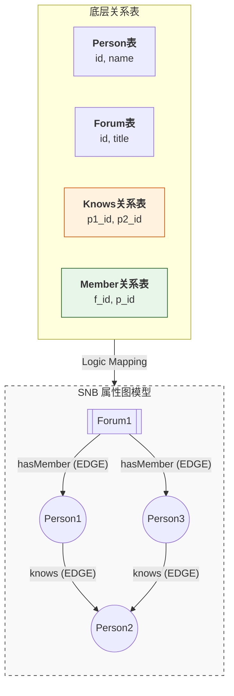
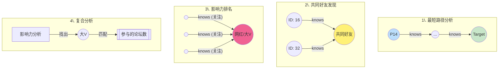
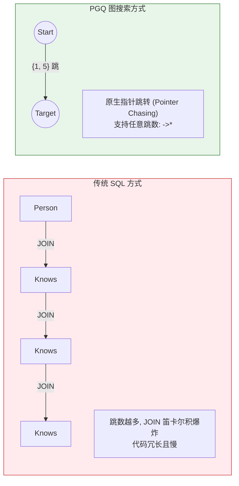
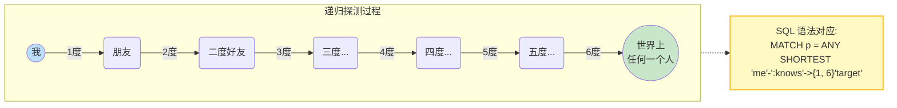
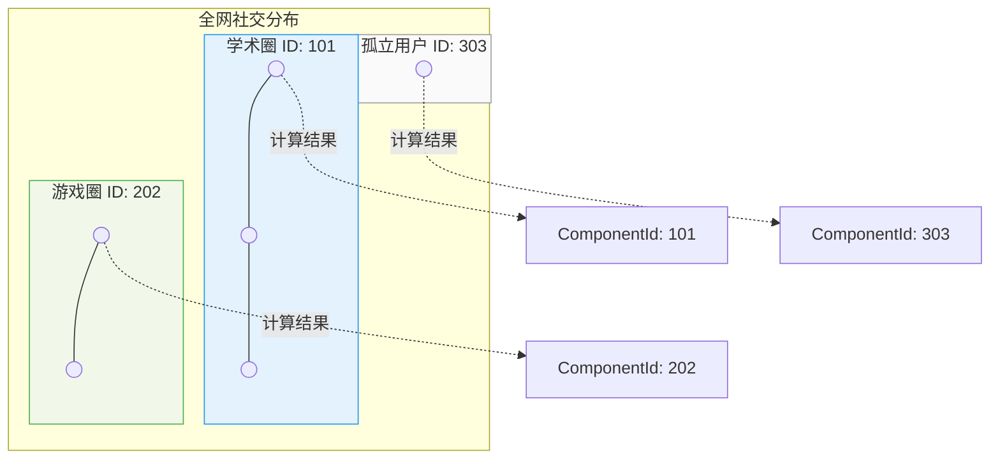
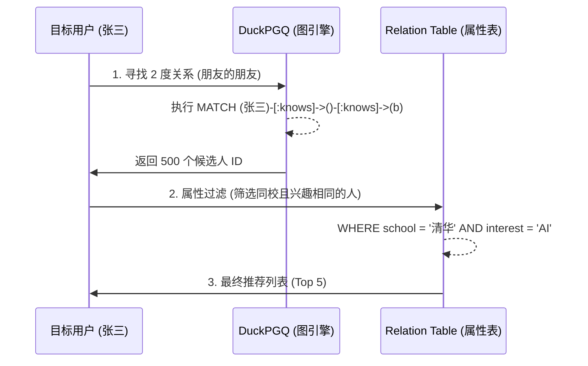

## 大学生数据库实践课: 19.1 PGQ 社交场景实践  
  
### 作者  
digoal  
  
### 日期  
2025-12-11  
  
### 标签  
PostgreSQL , DuckDB , 语义搜索 , 向量搜索 , 关键词检索 , 全文检索 , 标量检索 , 混合搜索 , 多模态搜索 , 重排序 , embedding , document split , ORC , 大模型 , 多模态大模型 , Dify , 压力测试 , 索引优化 , 倒排向量索引 , Ivfflat , 图向量索引 , HNSW , DiskANN , 量化 , rabitq , sbq , 二值量化 , bm25 , 相关性 , 相似性 , 召回率 , pgbench , 数据集 , ann-benchmarks , 图搜索 , PGQ , 递归 , 深度优先 , 广度优先 , 最短路径 , N度关系 , LLM , Ollama  
  
----  
  
## 背景  
  
duckpgq deepwiki:  
  
https://deepwiki.com/search/-1_395fdae1-a0be-4dd9-aba7-8c3ccb6742f9?mode=fast  
  
- https://duckpgq.org/  
- [《使用 DuckDB 图查询(PGQ)揭示金融犯罪》](../202510/20251023_13.md)  
- [《图数据库赛道没了 | SQL:PGQ标准出炉, 还不懂PGQ图式查询用法? 用DuckDB将PGQ一次整明白》](../202507/20250727_01.md)  
  
面向大学生通俗讲解以下内容:  
1、给出使用图数据库的几个典型场景示例  
  
  
面向大学生通俗讲解以下内容:  
1、基于以下内容对应的实际场景, 讲解场景的背景和需求, 解释例子中的语法细节;  
2、基于以下内容提出3个循序渐进的问题, 帮助理解图数据库的设计原理、语法和使用场景;  
  
```  
ATTACH 'https://github.com/Dtenwolde/duckpgq-docs/raw/refs/heads/main/datasets/snb.duckdb';  
  
use snb;  
install duckpgq from community;  
load duckpgq;  
  
CREATE or replace PROPERTY GRAPH snb  
VERTEX TABLES (  
  Person, Forum  
)  
EDGE TABLES (  
  Person_knows_person     SOURCE KEY (Person1Id) REFERENCES Person (id)  
                          DESTINATION KEY (Person2Id) REFERENCES Person (id)  
                          LABEL knows,  
  Forum_hasMember_Person  SOURCE KEY (ForumId) REFERENCES Forum (id)  
                          DESTINATION KEY (PersonId) REFERENCES Person (id)  
                          LABEL hasMember  
);  
  
-- find the shortest path from one person to all other persons  
FROM GRAPH_TABLE (snb  
  MATCH p = ANY SHORTEST (p1:person WHERE p1.id = 14)-[k:knows]->*(p2:person)  
  COLUMNS (p1.id, p2.id as other_person_id, element_id(p), path_length(p))  
);  
  
-- Find mutual friends between two users  
FROM GRAPH_TABLE (snb  
  MATCH (p1:Person WHERE p1.id = 16)-[k:knows]->(p2:Person)<-[k2:knows]-(p3:Person WHERE p3.id = 32)  
  COLUMNS (p2.firstName)  
);  
  
-- Find the 3 most popular people  
FROM GRAPH_TABLE (snb  
  MATCH (follower:Person)-[follows:knows]->(person:Person)  
  COLUMNS (person.id AS personID, person.firstname, person.lastname, follower.id AS followerID)  
)  
SELECT personID, firstname, lastname, COUNT(followerID) AS numFollowers  
GROUP BY ALL  
ORDER BY numFollowers DESC  
LIMIT 3;  
  
-- Number of forums posted on by the most followed person  
WITH  
mfp AS (  
  FROM GRAPH_TABLE (snb  
    MATCH (follower:Person)-[follows:knows]->(person:Person)  
    COLUMNS (person.id AS personID, person.firstname, follower.id AS followerID)  
  )  
SELECT personID, firstname, COUNT(followerID) AS numFollowers  
GROUP BY ALL ORDER BY numFollowers DESC LIMIT 1  
)  
FROM  
  mfp,  
  GRAPH_TABLE (snb  
    MATCH (person:Person)<-[fhm:hasMember]-(f:Forum)  
    COLUMNS (person.id AS personID, f.id as forumId)  
) mem  
SELECT mfp.personID, mfp.firstname, mfp.numFollowers, count(mem.forumId) forumCount  
WHERE mfp.personID = mem.personID  
GROUP BY ALL;  
```  
  
  
  
  
-----  
  
# 图数据库典型应用场景  
  
图数据库特别适合处理复杂的关系数据，以下是几个大学生容易理解的典型应用场景：  
  
## 1. 社交网络分析  
  
这是图数据库最经典的应用场景。想象一下微信、微博或Facebook：  
  
```sql  
-- 查找某人的好友（社交关系）  
FROM GRAPH_TABLE (snb  
    MATCH (a:person WHERE a.id = 17592186044461)-[k:knows]-(b:person)  
    COLUMNS (b.id, b.firstname, b.lastname, k.creationDate)  
) tmp  
```   
  
**实际应用**：推荐好友、分析影响力、传播路径分析  
  
## 2. 知识图谱与组织管理  
  
学校或公司的组织架构、人员关系网络：  
  
```sql  
-- 查找人员在哪个组织工作  
FROM GRAPH_TABLE (snb  
    MATCH (p:Person)-[w:workAt_Organisation]->(u:University)  
    COLUMNS (p.id as p_id, u.id as u_id, u.type as u_type)  
) tmp  
```   
  
**实际应用**：人才推荐、组织架构优化、专家查找  
  
## 3. 路径规划与导航  
  
地图导航、物流配送路径优化：  
  
```sql  
-- 查找最短路径  
FROM GRAPH_TABLE (snb  
    MATCH o = ANY SHORTEST (p4:Person where p4.rowid = 0)-[w3:knows]->(p:Person)-[w:knows]->{1,3}(p2:Person)-[w2:knows]->(p3:Person)  
    COLUMNS (p3.id as p3_id, element_id(o), path_length(o))  
) tmp  
```   
  
**实际应用**：GPS导航、快递路线规划、网络路由  
  
## 4. 推荐系统  
  
基于用户行为和关系的个性化推荐：  
  
```sql  
-- 查找用户的兴趣标签  
FROM GRAPH_TABLE(snb MATCH (p:Person)-[r:hasInterest]->(t:Tag)  
    COLUMNS (p.id as person_id, t.name as tag_name))  
```   
  
**实际应用**：商品推荐、内容推荐、好友推荐  
  
## 5. 欺诈检测与异常分析  
  
金融交易、网络安全中的异常模式识别：  
  
```sql  
-- 分析连通性（发现异常群体）  
select id, componentId from weakly_connected_component(pg_cyclic, student, know)  
```   
  
**实际应用**：反洗钱、信用卡欺诈检测、网络攻击溯源  
  
## 6. 生物网络分析  
  
蛋白质相互作用、基因调控网络：  
  
```sql  
-- 计算聚类系数（网络紧密程度）  
select id, local_clustering_coefficient from local_clustering_coefficient(varied_pg, variedstudent, variedknow)  
```   
  
**实际应用**：药物研发、疾病机理研究、生物进化分析  
  
## 为什么选择图数据库？  
  
传统关系型数据库在处理多跳查询时性能很差，比如"朋友的朋友"这种查询需要多次JOIN操作。而图数据库通过专门的存储结构和算法，可以高效处理这类关系查询。  
  
从代码中可以看到，DuckPGQ将关系表映射为图结构，既保持了SQL的易用性，又获得了图数据库的性能优势  。  
  
## Notes  
  
- 以上示例均来自DuckPGQ扩展的测试用例，该扩展在DuckDB之上实现了图数据库功能  
- 图数据库特别适合处理"关系"比"实体"更重要的场景  
- 现代图数据库通常支持SQL查询语法，降低了学习成本  
  
  
  
  
-----  
  
# 图数据库社交网络分析实战  
  
## 场景背景  
  
这些代码示例模拟了一个社交网络平台（类似Facebook、微博）的数据分析场景。平台包含用户信息、好友关系、论坛成员等数据，需要通过图数据库进行复杂的关系分析  。  
  
## 1. 最短路径分析  
  
**实际场景**：社交网络中的"六度分隔理论"验证，查找两个人之间的最短联系路径。  
  
```sql  
FROM GRAPH_TABLE (snb  
  MATCH p = ANY SHORTEST (p1:person WHERE p1.id = 14)-[k:knows]->*(p2:person)  
  COLUMNS (p1.id, p2.id as other_person_id, element_id(p), path_length(p))  
);  
```  
  
**语法详解**：  
- `ANY SHORTEST`：查找任意一条最短路径  
- `p1:person WHERE p1.id = 14`：起始用户（ID为14的人）  
- `-[k:knows]->*`：沿着"认识"关系，经过任意数量的跳转  
- `element_id(p)`：返回路径的节点ID序列  
- `path_length(p)`：返回路径长度（跳数）   
  
## 2. 共同好友发现  
  
**实际场景**：社交推荐系统，为用户推荐可能认识的人（通过共同好友）。  
  
```sql  
FROM GRAPH_TABLE (snb  
  MATCH (p1:Person WHERE p1.id = 16)-[k:knows]->(p2:Person)<-[k2:knows]-(p3:Person WHERE p3.id = 32)  
  COLUMNS (p2.firstName)  
);  
```  
  
**语法详解**：  
- `(p1:Person WHERE p1.id = 16)`：第一个用户  
- `-[k:knows]->(p2:Person)`：p1认识p2  
- `<-[k2:knows]-(p3:Person WHERE p3.id = 32)`：p3也认识p2（反向关系）  
- 整个模式：查找同时被用户16和用户32认识的人   
  
## 3. 影响力排名  
  
**实际场景**：识别平台中的"网红"或意见领袖，用于营销推广或内容推荐。  
  
```sql  
FROM GRAPH_TABLE (snb  
  MATCH (follower:Person)-[follows:knows]->(person:Person)  
  COLUMNS (person.id AS personID, person.firstname, person.lastname, follower.id AS followerID)  
)  
SELECT personID, firstname, lastname, COUNT(followerID) AS numFollowers  
GROUP BY ALL  
ORDER BY numFollowers DESC  
LIMIT 3;  
```  
  
**语法详解**：  
- `(follower:Person)-[follows:knows]->(person:Person)`：关注者关系模式  
- `GROUP BY ALL`：按所有非聚合字段分组  
- `COUNT(followerID)`：统计每个用户的关注者数量  
- `ORDER BY numFollowers DESC LIMIT 3`：取关注者最多的前3名   
  
## 4. 用户活跃度分析  
  
**实际场景**：分析最受欢迎用户的社区参与度，用于用户画像分析。  
  
```sql  
WITH  
mfp AS (  
  FROM GRAPH_TABLE (snb  
    MATCH (follower:Person)-[follows:knows]->(person:Person)  
    COLUMNS (person.id AS personID, person.firstname, follower.id AS followerID)  
  )  
  SELECT personID, firstname, COUNT(followerID) AS numFollowers  
  GROUP BY ALL ORDER BY numFollowers DESC LIMIT 1  
)  
FROM mfp, GRAPH_TABLE (snb  
  MATCH (person:Person)<-[fhm:hasMember]-(f:Forum)  
  COLUMNS (person.id AS personID, f.id as forumId)  
) mem  
SELECT mfp.personID, mfp.firstname, mfp.numFollowers, count(mem.forumId) forumCount  
WHERE mfp.personID = mem.personID  
GROUP BY ALL;  
```  
  
**语法详解**：  
- `WITH mfp AS (...)`：CTE（公共表表达式）先找出最受欢迎的人  
- `(person:Person)<-[fhm:hasMember]-(f:Forum)`：用户与论坛的成员关系  
- 通过连接两个图查询结果，分析该用户参与的论坛数量   
  
## 图模型定义  
  
```sql  
CREATE or replace PROPERTY GRAPH snb  
VERTEX TABLES (  
  Person, Forum  
)  
EDGE TABLES (  
  Person_knows_person     SOURCE KEY (Person1Id) REFERENCES Person (id)  
                          DESTINATION KEY (Person2Id) REFERENCES Person (id)  
                          LABEL knows,  
  Forum_hasMember_Person  SOURCE KEY (ForumId) REFERENCES Forum (id)  
                          DESTINATION KEY (PersonId) REFERENCES Person (id)  
                          LABEL hasMember  
);  
```  
  
**核心概念**：  
- **VERTEX TABLES**：顶点表（用户、论坛）  
- **EDGE TABLES**：边表（好友关系、论坛成员关系）  
- **SOURCE/DESTINATION KEY**：定义关系的起点和终点  
- **LABEL**：为关系类型赋予语义标签   
  
## Notes  
  
- 这些示例展示了图数据库在社交网络分析中的典型应用  
- DuckPGQ扩展让传统关系型数据库也能进行图查询，降低了学习成本  
- 图查询语法比传统SQL的多次JOIN更直观，性能也更好  
- 实际应用中可用于推荐系统、影响力分析、社区发现等场景  
  
  
-----  
  
  
# 图数据库学习三问  
  
## 问题一：图模型设计原理  
  
**为什么需要将关系表（Person_knows_person）转换为图结构中的边（EDGE），而不是直接用传统SQL的JOIN查询？**  
  
提示：观察`CREATE PROPERTY GRAPH`语句中`SOURCE KEY`和`DESTINATION KEY`的定义，思考图数据库如何通过"点-边"模型简化复杂关系查询  。  
  
## 问题二：查询语法理解  
  
**在共同好友查询中，为什么使用`<-[k2:knows]-`这种反向箭头语法？这相比传统SQL有什么优势？**  
  
```sql  
MATCH (p1:Person WHERE p1.id = 16)-[k:knows]->(p2:Person)<-[k2:knows]-(p3:Person WHERE p3.id = 32)  
```  
  
提示：分析这个查询模式如何表达"两个人都认识同一个人"的关系，对比传统SQL需要多次自连接的复杂性  。  
  
## 问题三：实际应用扩展  
  
**如果要分析"朋友的朋友"这种二度人脉推荐，如何修改最短路径查询来找到所有长度为2的路径？这对社交推荐有什么实际意义？**  
  
提示：基于现有的最短路径查询语法，思考如何限制路径长度并提取中间节点信息  。  
  
## 学习路径建议  
  
这三个问题分别对应：  
1. **设计思维**：理解为什么需要图数据库  
2. **语法掌握**：学会图查询的表达方式  
3. **应用实践**：将技术应用到实际场景  
  
通过回答这些问题，你将逐步掌握图数据库从设计原理到实际应用的完整知识体系。  
  
## Notes  
  
- 问题一引导学生理解图数据库的核心设计理念  
- 问题二重点在于图查询语法的直观性和表达能力  
- 问题三将技术知识与实际业务场景结合  
- 所有答案都能在提供的代码示例中找到线索  
  
    
---  

**要义图示**  


### 1. 社交网络图模型：从表到图的转换 (Schema)

这张图展示了 `CREATE PROPERTY GRAPH` 如何将平面的关系表映射为立体的社交关系网。




### 2. 核心社交查询逻辑：图式匹配 (Pattern Matching)

这张图拆解了文章中四个典型社交场景的 `MATCH` 逻辑，比 SQL JOIN 更易于视觉化理解。




### 3. 性能优势对比：为什么不用传统 SQL？

针对“学习三问”，通过对比展示图数据库在处理“多跳关系”时的效率差异。




### 学生实践要点 (Cheat Sheet)

* **最短路径语法**：`MATCH p = ANY SHORTEST (a)-[k:knows]->*(b)`
* `*` 表示“无限跳”，直到找到目标。


* **共同好友语法**：`MATCH (p1)-[k1]->(mutual)<-[k2]-(p2)`
* 注意中间的 `<-` 箭头，这代表两个人都指向同一个邻居。


* **影响力统计**：
```sql
-- 先在图里匹配模式，再用标准 SQL 做统计
FROM GRAPH_TABLE (snb MATCH (follower)-[:knows]->(person) ...)
SELECT personID, COUNT(*) GROUP BY ALL ORDER BY 2 DESC;
```


---

“六度分隔理论”及更复杂的社交关系挖掘。

这些图表旨在帮助学生理解图数据库如何处理**递归搜索**以及**复杂的多维关系挖掘**。


### 1. “六度分隔”递归搜索逻辑 (Recursive Search)

六度分隔理论的核心是：任何两个陌生人之间，通过最多 6 个中间人就能建立联系。在 SQL:PGQ 中，这通过“路径量词” `{1, 6}` 实现。




### 2. 社交圈子(社区)发现：弱连通分量 (WCC)

在实际场景中，平台需要知道哪些人形成了一个封闭的“小圈子”。`weakly_connected_component` 算法能自动为同一圈子的人打上相同的标签。




### 3. 混合分析场景：从关系挖掘到用户画像

这是一个综合实验案例：先通过图搜索找到“潜在好友”，再通过属性过滤进行“精准推荐”。




### 教学重点提炼 (给老师的建议)

1. **关于 `{1, n}` 的威力**：
* 告诉学生，在传统 SQL 中，找 6 度关系需要写 **5 个 JOIN**，代码不仅长且极其缓慢。
* 在 PGQ 中，只需改动一个数字，底层会自动使用 **BFS (广度优先搜索)** 算法高效完成。


2. **关于 `ANY SHORTEST**`：
* 强调“任意最短路径”。在社交网络中，路径可能有很多条，但用户通常只关心最快能通过谁认识对方。


3. **图与关系的边界**：
* **图 (Graph)**：处理“谁认识谁”、“谁在哪读过书”等**拓扑结构**。
* **关系 (Relational)**：处理“张三 20 岁”、“李四是教授”等**个体属性**。
* **PGQ 的优势**：在于它不需要你选择，你可以同时使用这两者的力量。

  
  
#### [PolarDB 学习图谱](https://www.aliyun.com/database/openpolardb/activity "8642f60e04ed0c814bf9cb9677976bd4")
  
  
#### [PostgreSQL 解决方案集合](../201706/20170601_02.md "40cff096e9ed7122c512b35d8561d9c8")
  
  
#### [德哥 / digoal's Github - 公益是一辈子的事.](https://github.com/digoal/blog/blob/master/README.md "22709685feb7cab07d30f30387f0a9ae")
  
  
#### [About 德哥](https://github.com/digoal/blog/blob/master/me/readme.md "a37735981e7704886ffd590565582dd0")
  
  

  
