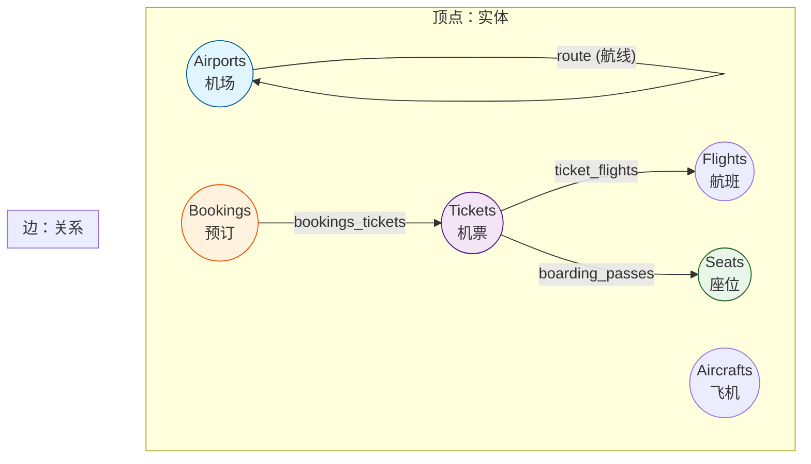
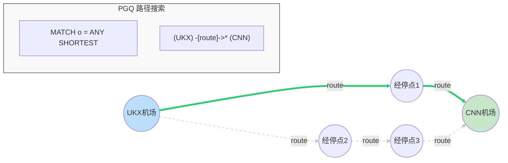
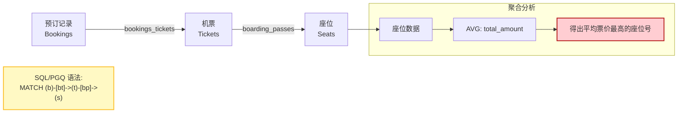
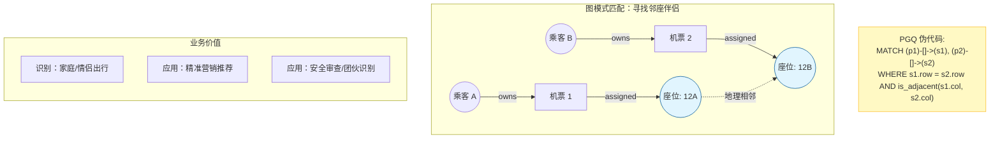
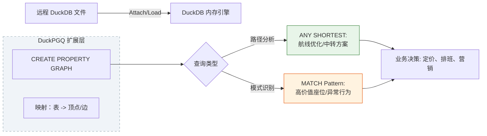

## 大学生数据库实践课: 19.2 PGQ 航空数据分析实践    
    
### 作者    
digoal    
    
### 日期    
2025-12-11    
    
### 标签    
PostgreSQL , DuckDB , 语义搜索 , 向量搜索 , 关键词检索 , 全文检索 , 标量检索 , 混合搜索 , 多模态搜索 , 重排序 , embedding , document split , ORC , 大模型 , 多模态大模型 , Dify , 压力测试 , 索引优化 , 倒排向量索引 , Ivfflat , 图向量索引 , HNSW , DiskANN , 量化 , rabitq , sbq , 二值量化 , bm25 , 相关性 , 相似性 , 召回率 , pgbench , 数据集 , ann-benchmarks , 图搜索 , PGQ , 递归 , 深度优先 , 广度优先 , 最短路径 , N度关系 , LLM , Ollama    
    
----    
    
## 背景    
    
duckpgq deepwiki:    
  
https://deepwiki.com/search/-1-attach-httpsgithubcomdtenwo_bd40d96a-f948-45c4-aa41-98ee32514614?mode=fast  
    
    
- https://duckpgq.org/    
- [《使用 DuckDB 图查询(PGQ)揭示金融犯罪》](../202510/20251023_13.md)    
- [《图数据库赛道没了 | SQL:PGQ标准出炉, 还不懂PGQ图式查询用法? 用DuckDB将PGQ一次整明白》](../202507/20250727_01.md)    
  
面向大学生通俗讲解以下内容:    
1、基于以下内容对应的实际场景, 讲解场景的背景和需求, 解释例子中的语法细节;    
2、基于以下内容提出3个循序渐进的问题, 帮助理解图数据库的设计原理、语法和使用场景;    
    
```  
ATTACH 'https://github.com/Dtenwolde/duckpgq-docs/raw/refs/heads/airline-data/datasets/airline-data-small.duckdb' as airline;  
  
use airline;  
install duckpgq from community;   
load duckpgq;   
  
CREATE PROPERTY GRAPH flight_graph  
  VERTEX TABLES (  
    aircrafts_data, airports_data,  
    bookings, flights,  
    tickets, seats  
  )  
  EDGE TABLES (  
    route  
      SOURCE KEY (departure_airport) REFERENCES airports_data(airport_code)  
      DESTINATION KEY (arrival_airport) REFERENCES airports_data(airport_code),  
    ticket_flights  
      SOURCE KEY (ticket_no) REFERENCES tickets(ticket_no)  
      DESTINATION KEY (flight_id) REFERENCES flights(flight_id),  
    bookings_tickets  
      SOURCE KEY (book_ref) REFERENCES bookings(book_ref)  
      DESTINATION KEY (ticket_no) REFERENCES tickets(ticket_no),  
    boarding_passes   
      SOURCE KEY (ticket_no) REFERENCES tickets(ticket_no)  
      DESTINATION KEY (seat_no) REFERENCES seats(seat_no)  
);  
  
-- Shortest Route Between Airports  
FROM (  
  SELECT unnest(flights) AS flights   
    FROM GRAPH_TABLE (  
    flight_graph   
    MATCH o = ANY SHORTEST (a:airports_data WHERE a.airport_code = 'UKX')  
      -[fr:route]->*  
      (a2:airports_data WHERE a2.airport_code = 'CNN')   
    COLUMNS (edges(o) AS flights)  
  )  
)   
JOIN route f   
  ON f.rowid = flights;  
  
-- Most Expensive Seats on Average  
FROM GRAPH_TABLE (  
  flight_graph   
  MATCH (b:bookings)-[bt:bookings_tickets]->(t:tickets)-[bp:boarding_passes]->(s:seats)  
)  
SELECT round(avg(total_amount), 2) avg_amount, seat_no   
GROUP BY seat_no   
ORDER BY avg_amount DESC;  
```  
    
-----  
  
# 航空数据图查询示例详解  
  
## 场景背景与需求  
  
这个例子模拟了一个**航空公司的数据管理系统**，用于分析航线网络和客户预订信息。想象一下，你是一家航空公司的数据分析师，需要回答这样的业务问题：  
- 从某个机场到另一个机场的最短航线是什么？  
- 哪些座位平均票价最高，帮助优化定价策略？  
  
传统的数据库查询很难直接回答这类"关系型"问题，而**图数据库**正好擅长处理实体间的复杂关系。  
  
## 语法详解  
  
### 1. 数据准备与扩展安装  
  
```sql  
ATTACH 'https://github.com/Dtenwolde/duckpgq-docs/raw/refs/heads/airline-data/datasets/airline-data-small.duckdb' as airline;  
```  
这行代码从远程URL附加一个DuckDB数据库文件，命名为`airline`，包含航空公司的各种数据表  。  
  
```sql  
install duckpgq from community;   
load duckpgq;  
```  
安装并加载DuckPGQ扩展，这是DuckDB的图查询扩展，支持SQL/PGQ标准  。  
  
### 2. 创建属性图  
  
```sql  
CREATE PROPERTY GRAPH flight_graph  
  VERTEX TABLES (  
    aircrafts_data, airports_data,  
    bookings, flights,  
    tickets, seats  
  )  
```  
定义图的**顶点**（实体）：  
- `airports_data`: 机场信息  
- `flights`: 航班信息    
- `bookings`: 预订记录  
- `tickets`: 机票信息  
- `seats`: 座位信息  
  
```sql  
EDGE TABLES (  
  route  
    SOURCE KEY (departure_airport) REFERENCES airports_data(airport_code)  
    DESTINATION KEY (arrival_airport) REFERENCES airports_data(airport_code),  
```  
定义图的**边**（关系）：  
- `route`: 航线关系，连接出发机场和到达机场  
- `ticket_flights`: 机票与航班的关联  
- `bookings_tickets`: 预订与机票的关联  
- `boarding_passes`: 登机牌与座位的关联  
  
这种设计将关系型表格映射为图结构，每个表对应图中的节点或边  。  
  
### 3. 最短路径查询  
  
```sql  
MATCH o = ANY SHORTEST (a:airports_data WHERE a.airport_code = 'UKX')  
  -[fr:route]->*  
  (a2:airports_data WHERE a2.airport_code = 'CNN')   
```  
- `MATCH`: 图模式匹配语法  
- `o = ANY SHORTEST`: 查找任意最短路径并命名为`o`  
- `(a:airports_data WHERE a.airport_code = 'UKX')`: 起始机场（代码UKX）  
- `-[fr:route]->*`: 沿着航线边，经过任意数量的中间节点  
- `(a2:airports_data WHERE a2.airport_code = 'CNN')`: 目标机场（代码CNN）  
  
```sql  
COLUMNS (edges(o) AS flights)  
```  
提取路径中的所有边（即航线）作为结果  。  
  
### 4. 座位价格分析查询  
  
```sql  
MATCH (b:bookings)-[bt:bookings_tickets]->(t:tickets)-[bp:boarding_passes]->(s:seats)  
```  
这个模式匹配了一个完整的预订链路：  
- 预订记录 → 机票 → 登机牌 → 座位信息  
  
```sql  
SELECT round(avg(total_amount), 2) avg_amount, seat_no   
GROUP BY seat_no   
ORDER BY avg_amount DESC;  
```  
计算每个座位号的平均票价，并按价格降序排列，找出最贵的座位类型。  
  
## 核心概念总结  
  
1. **属性图模型**: 将关系型数据映射为图结构，包含顶点（实体）和边（关系）  
2. **图模式匹配**: 使用类似正则表达式的语法描述实体间的关系模式  
3. **路径查询**: 支持最短路径、变长路径等复杂图算法  
4. **SQL集成**: 图查询与标准SQL无缝结合，可以同时使用图操作和关系操作  
  
这种图查询方式特别适合分析复杂的关联数据，如社交网络、供应链、交通网络等场景  。  
  
## Notes  
  
这个示例展示了DuckPGQ扩展的核心功能，它实现了SQL/PGQ标准，允许在DuckDB中进行图查询。代码中的`GRAPH_TABLE`函数是图查询的主要入口，支持复杂的模式匹配和路径查找算法。图定义存储在内部的`__duckpgq_internal`表中，支持跨会话的持久化  。  
  
  
  
-----  
  
# 图数据库学习三问  
  
## 问题1：设计原理 - 为什么需要图数据库？  
  
**问题**：传统关系型数据库已经能存储航空数据，为什么还要将其转换为图结构？图数据库解决了什么传统数据库难以处理的问题？  
  
**答案提示**：观察`CREATE PROPERTY GRAPH`语句，思考：  
- 关系型数据库中，查询"从机场A到机场B的最短路径"需要多少次JOIN？  
- 图数据库的`MATCH o = ANY SHORTEST`语法如何简化这类查询？    
  
## 问题2：语法理解 - 图模式匹配的特点  
  
**问题**：分析以下模式匹配语法的含义：  
```sql  
MATCH (b:bookings)-[bt:bookings_tickets]->(t:tickets)-[bp:boarding_passes]->(s:seats)  
```  
这种语法相比传统SQL的JOIN操作有什么优势？为什么说它更符合人类的思维习惯？  
  
**答案提示**：  
- 每个括号`()`代表什么？箭头`->`表示什么方向？  
- 对比传统SQL需要多次JOIN才能实现的相同查询    
  
## 问题3：应用场景 - 扩展业务分析  
  
**问题**：基于现有的航空图结构，如果要分析"哪些乘客经常乘坐同一航班的相邻座位"，应该如何设计图查询？这个需求在传统数据库中实现会有什么挑战？  
  
**答案提示**：  
- 需要利用哪些现有的顶点和边？  
- 可能需要添加什么新的关系或属性？  
- 思考图查询如何自然地表达"相邻座位"这种空间关系    
  
## Notes  
  
这三个问题从设计原理→语法理解→实际应用，层层递进。第一个问题关注图数据库的核心价值，第二个问题深入语法特点，第三个问题要求灵活运用。通过回答这些问题，学生能够理解图数据库不仅是技术工具，更是一种解决复杂关系问题的思维方式。  
  
    
---  

**要义图示**  


### 1. 航空数据“属性图”建模图 (Schema Mapping)

这张图展示了如何将多个传统的 RDBMS 数据表映射为相互连接的图节点（Vertex）与边（Edge）。




### 2. 最短路径查询逻辑图 (Shortest Path Logic)

解释 `ANY SHORTEST` 语法如何在复杂的航线网络中寻找最优解。




### 3. “预订-座位”链路分析图 (Join vs. Match)

展示第二个示例中，图模式匹配（Graph Pattern Matching）如何通过一条直线串联起复杂的业务链路。




### 辅助教学建议

1. **关于路径量词 `{->*}`**：
* **教学点**：向学生解释 `*` 代表“任意跳数”。在航空场景中，这意味着即使需要中转 3 次或 5 次，图引擎都能自动递归找到目标，而不需要像传统 SQL 那样手动写 5 次 `JOIN`。


2. **关于 `ANY SHORTEST` 的实际意义**：
* **教学点**：这不仅仅是代码的简化，更是算法的集成。它在底层使用了如 Dijkstra 或 BFS 等算法。在航空分析中，这能直接帮助调度员在航班延误时快速找到备选的最短经停方案。


3. **图查询的直观性**：
* **教学点**：对比 `SELECT...JOIN...JOIN...JOIN` 的“拼图式”写法，`MATCH (b)->(t)->(s)` 这种“链式”写法更符合业务专家的直觉。

---

**相邻座位乘客关系挖掘**，是一个典型的复杂关系分析场景（Link Prediction / Pattern Matching）。

在传统数据库中，查询“谁和谁经常坐在一起”需要对数百万行的机票和座位表进行极其复杂的自连接（Self-Join）。而在图数据库中，这被简化为一个**闭环路径匹配**问题。

### 4. “社交+地理”复合关系图：相邻座位分析逻辑

这张图展示了如何通过“座位（Seat）”作为媒介，利用图模式匹配找到具有潜在关系的乘客。




### 5. 航空数据流全景图：从数据源到图决策

为了让学生理解“大学生数据库实践课”的整体链路，这张图梳理了从 Attach 远程数据到生成业务洞察的完整流程。




### 进阶教学引导 (针对 **相邻座位乘客关系挖掘**)

1. **空间关系转为图关系**：
* **引导点**：在物理世界中，12A 和 12B 是相邻的。在图中，我们可以通过给座位节点添加“相邻”的边，或者在 `WHERE` 子句中计算座位号的距离。
* **核心**：图数据库让我们可以像描述“人类语言”一样描述物理空间联系。


2. **挑战分析**：
* **传统 SQL 挑战**：需要处理 `Seat` 表的自关联，并计算字符串或坐标距离，当数据量达到千万级时，查询效率会急剧下降。
* **图数据库优势**：一旦建立了“相邻”关系边，查询就变成了简单的**邻居遍历（Neighbor Traversal）**，时间复杂度从 O(n^2) 降到了 O(k)（k为平均度数）。


3. **课后思考**：
* “如果我们要找出‘过去一年中，共同飞行超过 5 次且座位相邻’的乘客对，图查询中应该如何通过 `COUNT` 来实现？”（这可以引导学生思考如何将图匹配结果与聚合函数结合）。

  
  
#### [PolarDB 学习图谱](https://www.aliyun.com/database/openpolardb/activity "8642f60e04ed0c814bf9cb9677976bd4")
  
  
#### [PostgreSQL 解决方案集合](../201706/20170601_02.md "40cff096e9ed7122c512b35d8561d9c8")
  
  
#### [德哥 / digoal's Github - 公益是一辈子的事.](https://github.com/digoal/blog/blob/master/README.md "22709685feb7cab07d30f30387f0a9ae")
  
  
#### [About 德哥](https://github.com/digoal/blog/blob/master/me/readme.md "a37735981e7704886ffd590565582dd0")
  
  

  
