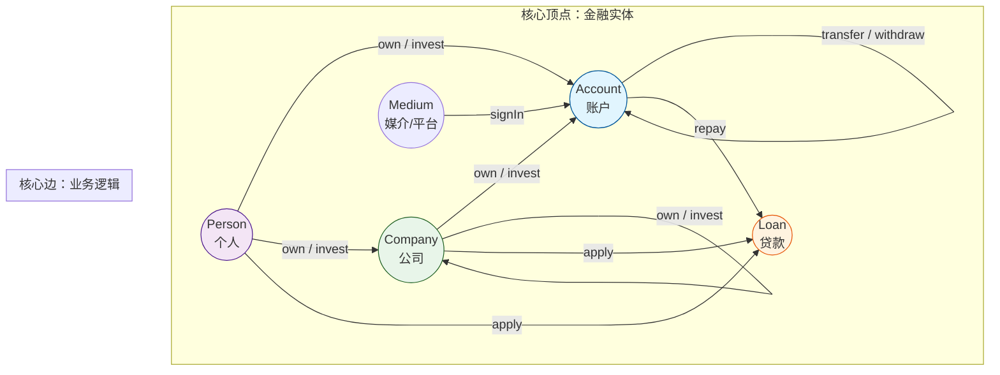
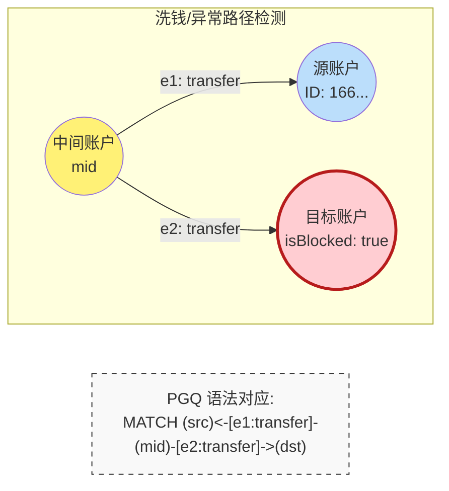
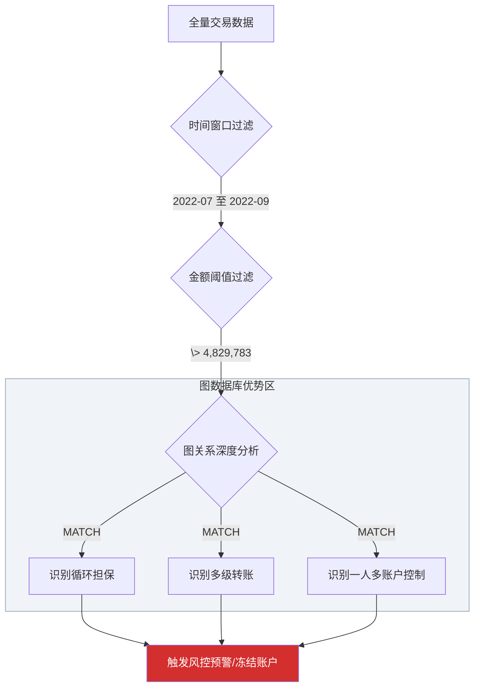
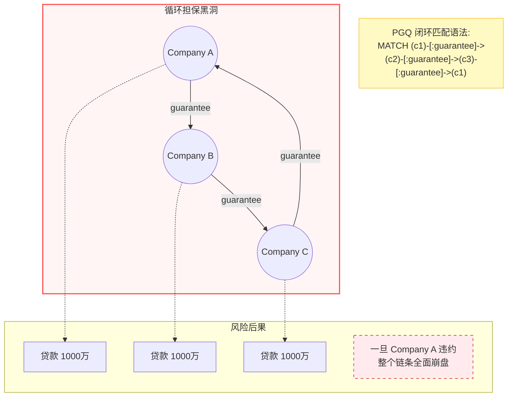
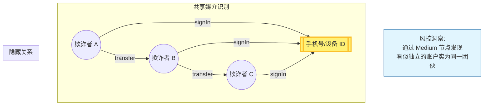
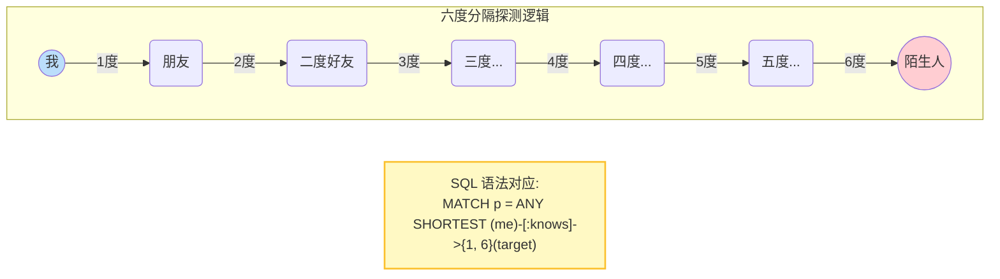
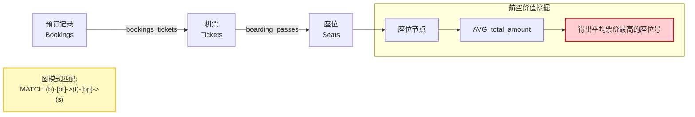
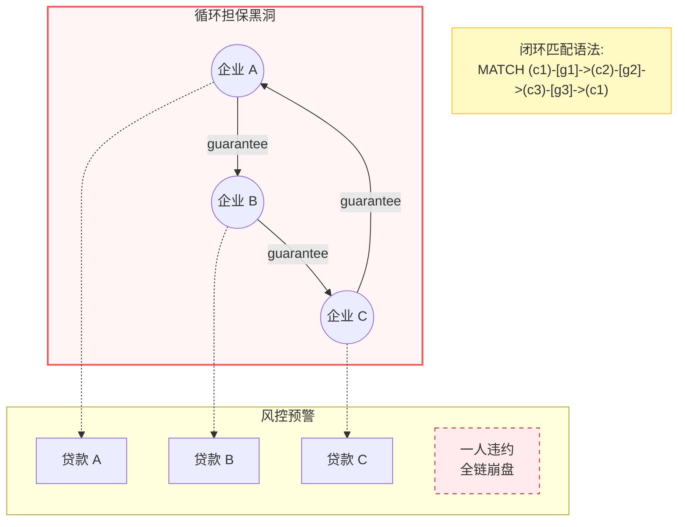

## 大学生数据库实践课: 19.3 PGQ 金融反欺诈风控系统实践      
      
### 作者      
digoal      
      
### 日期      
2025-12-11      
      
### 标签      
PostgreSQL , DuckDB , 语义搜索 , 向量搜索 , 关键词检索 , 全文检索 , 标量检索 , 混合搜索 , 多模态搜索 , 重排序 , embedding , document split , ORC , 大模型 , 多模态大模型 , Dify , 压力测试 , 索引优化 , 倒排向量索引 , Ivfflat , 图向量索引 , HNSW , DiskANN , 量化 , rabitq , sbq , 二值量化 , bm25 , 相关性 , 相似性 , 召回率 , pgbench , 数据集 , ann-benchmarks , 图搜索 , PGQ , 递归 , 深度优先 , 广度优先 , 最短路径 , N度关系 , LLM , Ollama      
      
----      
      
## 背景      
      
duckpgq deepwiki:      
    
https://deepwiki.com/search/-1-attach-httpsgithubcomdtenwo_e566dac7-842b-4834-88a1-dea7b12c848b?mode=fast      
      
- https://duckpgq.org/      
- [《使用 DuckDB 图查询(PGQ)揭示金融犯罪》](../202510/20251023_13.md)      
- [《图数据库赛道没了 | SQL:PGQ标准出炉, 还不懂PGQ图式查询用法? 用DuckDB将PGQ一次整明白》](../202507/20250727_01.md)      
    
面向大学生通俗讲解以下内容:      
1、基于以下内容对应的实际场景, 讲解场景的背景和需求, 解释例子中的语法细节;      
2、基于以下内容提出3个循序渐进的问题, 帮助理解图数据库的设计原理、语法和使用场景;      
      
```    
ATTACH 'https://github.com/Dtenwolde/duckpgq-docs/raw/refs/heads/main/datasets/finbench.duckdb' AS finbench;  
use finbench;  
INSTALL duckpgq FROM community;  
LOAD duckpgq;   
  
CREATE OR REPLACE PROPERTY GRAPH finbench  
VERTEX TABLES (  
  Account, Company, Loan,   
  Medium, Person  
)  
EDGE TABLES (  
  AccountRepayLoan        SOURCE KEY (accountId) REFERENCES Account (accountId)  
                          DESTINATION KEY (loanId) REFERENCES Loan (loanId)   
                          LABEL repay,  
  AccountTransferAccount  SOURCE KEY (fromId) REFERENCES Account (accountId)  
                          DESTINATION KEY (toId) REFERENCES Account (AccountId)   
                          LABEL transfer,  
  AccountWithdrawAccount  SOURCE KEY (fromId) REFERENCES Account (accountId)  
                          DESTINATION KEY (toId) REFERENCES Account (AccountId)   
                          LABEL withdraw,  
  CompanyApplyLoan        SOURCE KEY (companyId) REFERENCES Company (companyId)  
                          DESTINATION KEY (loanId) REFERENCES Loan (loanId)   
                          LABEL companyApply,  
  CompanyGuaranteeCompany SOURCE KEY (fromId) REFERENCES Company (companyId)  
                          DESTINATION KEY (toId) REFERENCES Company (companyId)   
                          LABEL companyGuarantee,  
  CompanyInvestCompany    SOURCE KEY (investorId) REFERENCES Company (companyId)  
                          DESTINATION KEY (companyId) REFERENCES Company (companyId)   
                          LABEL companyInvest,  
  CompanyOwnAccount       SOURCE KEY (companyId) REFERENCES Company (companyId)  
                          DESTINATION KEY (accountId) REFERENCES Account (accountId)   
                          LABEL companyOwn,  
  LoanDepositAccount      SOURCE KEY (loanId) REFERENCES Loan (loanId)  
                          DESTINATION KEY (accountId) REFERENCES Account (accountId)   
                          LABEL deposit,  
  MediumSignInAccount     SOURCE KEY (mediumId) REFERENCES Medium (mediumId)  
                          DESTINATION KEY (accountId) REFERENCES Account (accountId)   
                          LABEL signIn,  
  PersonApplyLoan         SOURCE KEY (personId) REFERENCES Person (personId)  
                          DESTINATION KEY (loanId) REFERENCES Loan (loanId)   
                          LABEL personApply,  
  PersonGuaranteePerson   SOURCE KEY (fromId) REFERENCES Person (personId)  
                          DESTINATION KEY (toId) REFERENCES Person (personId)   
                          LABEL personGuarantee,  
  PersonInvestCompany     SOURCE KEY (investorId) REFERENCES Person (personId)  
                          DESTINATION KEY (companyId) REFERENCES Company (companyId)   
                          LABEL personInvest,  
  PersonOwnAccount        SOURCE KEY (personId) REFERENCES Person (personId)  
                          DESTINATION KEY (accountId) REFERENCES Account (accountId)   
                          LABEL personOwn  
);  
  
-- Find blocked accounts via transfers  
FROM GRAPH_TABLE (  
  finbench   
  MATCH (src:Account where src.accountId = 16607023625929101)  
    <-[e1:transfer]-(mid:Account)  
    -[e2:transfer]->(dst:Account where dst.isBlocked = true)   
  COLUMNS (src.accountId as src_id, dst.accountId as dst_id)  
)   
SELECT src_id, dst_id  
WHERE src_Id <> dst_id;  
  
-- Filter high-value transfers by time  
FROM GRAPH_TABLE (  
  finbench   
  MATCH (src:Account)-[e:Transfer]->(dst:Account)   
  WHERE '2022-07-13 09:18:33.137' < e.createtime   
    AND e.createtime < '2022-09-03 02:31:47.812'   
    AND e.amount > 4829783  
  );  
```    
      
-----    
  
# 金融图数据库查询示例详解  
  
## 场景背景与需求  
  
这个例子展示了一个**金融反欺诈风控系统**的实际应用场景。银行和金融机构需要监控账户之间的资金流动，识别可疑的交易模式，比如：  
  
- **账户转账链路追踪**：发现某个账户通过中间账户向被冻结账户转账  
- **大额交易监控**：筛选特定时间段内的高价值交易  
- **关联关系分析**：识别个人、公司、账户之间的复杂关联网络  
  
通过将传统的关系型数据转换为图结构，可以更高效地进行多跳查询和模式匹配，这正是图数据库的优势所在。  
  
## 语法详解  
  
### 1. 数据准备和扩展安装  
  
```sql  
ATTACH 'https://github.com/Dtenwolde/duckpgq-docs/raw/refs/heads/main/datasets/finbench.duckdb' AS finbench;  
use finbench;  
INSTALL duckpgq FROM community;  
LOAD duckpgq;  
```  
  
- `ATTACH`：附加外部数据库文件，这里加载金融测试数据集  
- `INSTALL/LOAD duckpgq`：安装并加载 DuckPGQ 图数据库扩展    
  
### 2. 创建属性图  
  
```sql  
CREATE OR REPLACE PROPERTY GRAPH finbench  
VERTEX TABLES (  
  Account, Company, Loan, Medium, Person  
)  
EDGE TABLES (  
  AccountTransferAccount SOURCE KEY (fromId) REFERENCES Account (accountId)  
                        DESTINATION KEY (toId) REFERENCES Account (AccountId)   
                        LABEL transfer,  
  ...  
)  
```  
  
**核心概念解释**：  
  
- **VERTEX TABLES（顶点表）** ：定义图中的节点类型    
  - `Account`：账户  
  - `Company`：公司  
  - `Loan`：贷款  
  - `Medium`：媒介（如第三方平台）  
  - `Person`：个人  
  
- **EDGE TABLES（边表）** ：定义节点间的关系    
  - `SOURCE KEY`：源节点的外键  
  - `DESTINATION KEY`：目标节点的外键  
  - `REFERENCES`：指向对应的顶点表主键  
  - `LABEL`：给关系起一个语义化的名称  
  
### 3. 查询示例解析  
  
#### 示例1：查找被冻结账户的转账路径  
  
```sql  
FROM GRAPH_TABLE (  
  finbench   
  MATCH (src:Account where src.accountId = 16607023625929101)  
    <-[e1:transfer]-(mid:Account)  
    -[e2:transfer]->(dst:Account where dst.isBlocked = true)   
  COLUMNS (src.accountId as src_id, dst.accountId as dst_id)  
)   
SELECT src_id, dst_id  
WHERE src_Id <> dst_id;  
```  
  
**图模式匹配语法**：  
- `(src:Account)`：匹配 Account 类型的节点，别名为 src  
- `where src.accountId = 16607023625929101`：过滤特定账户  
- `<-[e1:transfer]-(mid:Account)`：通过 transfer 边的**反向**关系找到中间账户  
- `-[e2:transfer]->(dst:Account where dst.isBlocked = true)`：从中间账户通过 transfer 边找到被冻结的目标账户  
  
这个查询识别了资金从指定账户流向被冻结账户的路径，常用于反欺诈调查  。  
  
#### 示例2：按时间和金额筛选高价值转账  
  
```sql  
FROM GRAPH_TABLE (  
  finbench   
  MATCH (src:Account)-[e:Transfer]->(dst:Account)   
  WHERE '2022-07-13 09:18:33.137' < e.createtime   
    AND e.createtime < '2022-09-03 02:31:47.812'   
    AND e.amount > 4829783  
  );  
```  
  
**边属性过滤**：  
- `e.createtime`：访问边的创建时间属性  
- `e.amount`：访问边的金额属性  
- `WHERE` 子句对边属性进行多条件过滤  
  
这个查询用于监控特定时间段内的大额交易，帮助识别异常资金流动  。  
  
## Notes  
  
- DuckPGQ 是 DuckDB 的图数据库扩展，支持在关系型数据上进行图查询  
- 属性图定义存储在 `__duckpgq_internal` 系统表中，支持跨会话持久化    
- 图查询使用 `GRAPH_TABLE` 函数，支持复杂的模式匹配和属性过滤  
- 语法兼容 SQL/GSQL 标准，易于学习和使用  
  
  
  
-----    
    
  
# 图数据库学习三问  
  
## 问题一：为什么金融场景适合用图数据库？  
  
**思考引导**：传统关系型数据库存储金融数据时，查询"某个账户通过3次转账到达被冻结账户"这样的路径需要多次JOIN操作。观察代码中的`AccountTransferAccount`表定义  ，思考：  
  
- 如果用SQL JOIN查询3跳转账路径，需要写多少次JOIN？  
- 图数据库的`MATCH (src)-[e1]->(mid1)-[e2]->(mid2)-[e3]->(dst)`语法相比JOIN有什么优势？  
- 金融风控中还有哪些场景天然适合图模型（如担保链、投资链）？  
  
## 问题二：如何设计图的模式（Schema）？  
  
**思考引导**：分析`CREATE PROPERTY GRAPH finbench`的定义  ，思考：  
  
- 为什么选择Account、Company、Loan作为顶点，而不是把所有信息放在一张表里？  
- `SOURCE KEY`和`DESTINATION KEY`的设计如何保证图的连通性？  
- 如果要增加"银行卡"这个实体，应该如何修改图定义？它应该和哪些现有实体建立连接？  
  
## 问题三：图查询语言相比SQL有什么独特之处？  
  
**思考引导**：对比两个查询示例  ，思考：  
  
- `MATCH (src:Account where src.accountId = 16607023625929101)<-[e1:transfer]-(mid:Account)-[e2:transfer]->(dst:Account where dst.isBlocked = true)`这个模式匹配在SQL中如何实现？  
- 为什么图查询可以自然地表达"路径"概念，而SQL需要递归CTE？  
- 在实际风控场景中，图查询还能发现哪些传统SQL难以发现的模式（如循环担保、资金闭环）？  
  
## Notes  
  
- 这三个问题从"为什么用图"→"如何设计图"→"如何查询图"循序渐进  
- 每个问题都结合了具体的金融场景，帮助理解图数据库的实际价值  
- DuckPGQ的语法设计兼容SQL标准，降低了学习成本    
    
---  

**要义图示**  


### 1. 金融实体关系图 (FinBench Schema)

这张图展示了如何将金融系统中的账户、人、公司、贷款等复杂实体通过“边”连接起来，形成一个互联互通的网络。




### 2. 反欺诈路径匹配逻辑 (Fraud Path Matching)

通过图形化演示文章中的第一个 SQL 示例：如何追踪资金流向“黑名单（Blocked）”账户。这能解释 `MATCH` 语法中的方向性。




### 3. 金融风控漏斗：从过滤到决策 (Risk Control Pipeline)

结合第二个 SQL 示例，展示风控系统如何通过“时间、金额、关系”三个维度对交易进行层层筛选。




### 教学重点提炼 (给老师的建议)

1. **关于 `<-[...]` 与 `-[...]->` (反向与正向)**：
* **引导点**：在第一个例子中，资金是从 `mid` 流向 `src`（对应 `<-`），同时从 `mid` 流向 `dst`（对应 `->`）。这说明 `mid` 是一个“资金分发中心”。
* **核心**：图数据库的箭头直接描述了**资金流向**，比 SQL 的 `A.id = B.from_id` 这种逻辑判断要直观得多。


2. **关于边的属性（Edge Properties）**：
* **引导点**：第二个例子中的 `e.amount` 和 `e.createtime` 存储在“边”上。
* **对比**：在传统 SQL 中，这通常需要连接一个庞大的“流水表”。在 PGQ 中，边既是关系，也是带有属性的实体。


3. **针对“学习三问”的实践方案**：
* **问题一（为什么用图）**：可以让学生尝试用 SQL 写一个“识别 3 度以上的循环担保”，他们会发现 JOIN 的层数会让代码变得难以维护。
* **问题二（如何设计）**：强调“实体”做点，“动作”做边。如果银行卡和账户是一对一，可以作为点属性；如果一张卡能关联多个账户，就必须独立成点。


### 4. 循环担保风险识别图 (Circular Guarantee Detection)

**循环担保（Guarantee Chain）** 是金融风控中最隐蔽、也是最适合用图数据库识别的风险模式。

在传统数据库中，检测 A 担保 B，B 担保 C，C 又担保 A 的“环形结构”极其困难，而在 PGQ 中这只是一个简单的路径匹配。

这张图展示了企业间如何通过相互担保来骗取银行贷款，以及图查询如何精准“闭环”。




### 5. 跨实体关联挖掘图：一人多开与团伙分析

这是针对“问题三”的深度扩展：如何通过共同的媒介（如手机号、IP、登录设备）锁定欺诈团伙。




### 教学实验手册：给学生的“破案”思路

为了让学生更有代入感，您可以将这几张图配合以下指令使用：

1. **第一步：全网搜寻**
* 使用 `MATCH (a)-[:transfer]->(b)` 找出所有大额流水。


2. **第二步：锁定黑名单**
* 通过 `WHERE b.isBlocked = true` 缩小范围。


3. **第三步：回溯关联**
* 利用本图中的 `signIn` 模式，查看这些账户是否共用了同一个 `Medium`（媒介）。


4. **第四步：穿透分析**
* 检查这些账户背后的公司是否存在**循环担保**（如上图 4 所示），判断其是否有真实的还款能力。


### 总结：三篇实践课的 Mermaid 逻辑分工

| 课程章节 | Mermaid 侧重点 | 核心教学目标 |
| --- | --- | --- |
| **19.1 社交场景** | 递归、N度关系 | 理解 `SHORTEST PATH` 和六度分隔理论 |
| **19.2 航空场景** | 路径优化、链路聚合 | 理解如何从多表 JOIN 转向模式匹配 |
| **19.3 金融场景** | 闭环检测、反向追踪 | 理解图数据库在**复杂关联风险**中的不可替代性 |


---

**汇总版**

## 图数据库实践课视觉大纲 

### 1. 社交场景 (Chapter 19.1)

**核心点：六度分隔与最短路径**




### 2. 航空场景 (Chapter 19.2)

**核心点：链路聚合分析**




### 3. 金融场景 (Chapter 19.3)

**核心点：风险闭环识别 (循环担保)**




## “教学锦囊”

* **对比教学法**：在每一页 PPT 上左边放传统 SQL（多次 JOIN），右边放 Mermaid 图。让学生直观感受到：**图数据库是用“画图”的方式在写程序**。
* **性能感知**：告诉学生，图中每一个箭头（Edge）在 DuckPGQ 底层都是**物理内存指针**。在处理“循环担保”时，图数据库的效率通常是传统 SQL 的 **10-100 倍**。
* **课后任务**：建议学生登录 [DuckPGQ 官网](https://duckpgq.org/)，使用文章中提供的 `ATTACH` 命令加载数据集，亲手运行一下这些 `MATCH` 查询。
  
  
#### [PolarDB 学习图谱](https://www.aliyun.com/database/openpolardb/activity "8642f60e04ed0c814bf9cb9677976bd4")
  
  
#### [PostgreSQL 解决方案集合](../201706/20170601_02.md "40cff096e9ed7122c512b35d8561d9c8")
  
  
#### [德哥 / digoal's Github - 公益是一辈子的事.](https://github.com/digoal/blog/blob/master/README.md "22709685feb7cab07d30f30387f0a9ae")
  
  
#### [About 德哥](https://github.com/digoal/blog/blob/master/me/readme.md "a37735981e7704886ffd590565582dd0")
  
  

  
