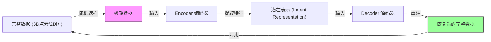
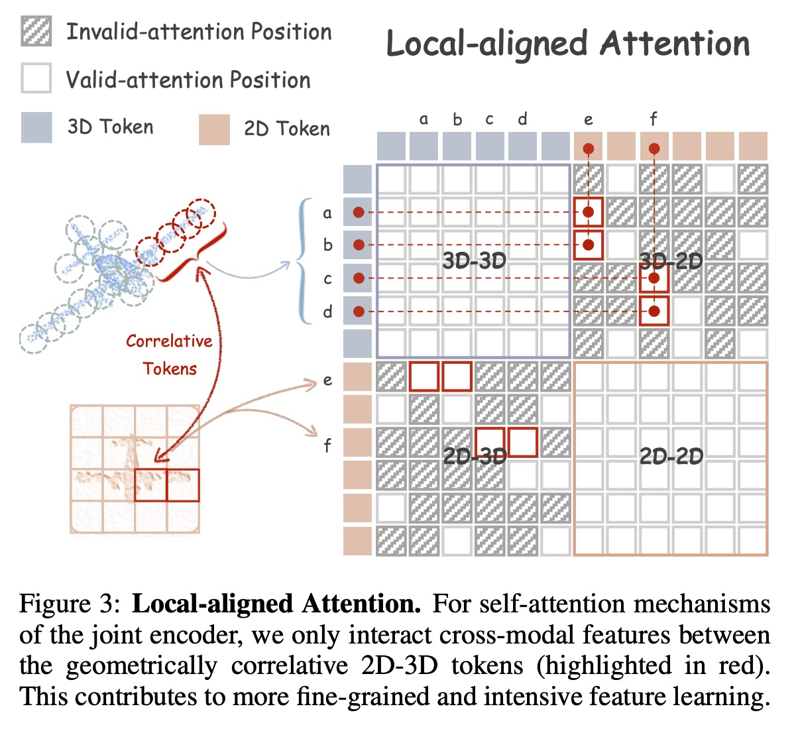
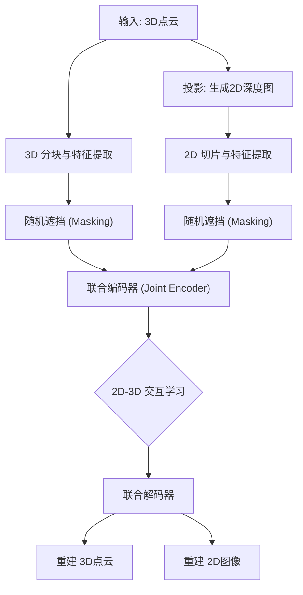
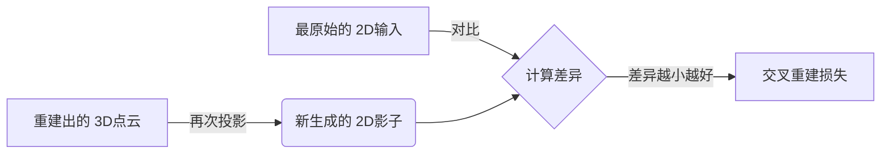

## AI论文解读 | Joint-MAE: 2D-3D Joint Masked Autoencoders for 3D Point Cloud Pre-training
        
### 作者        
digoal        
        
### 日期        
2025-12-12        
        
### 标签        
PostgreSQL , PolarDB , DuckDB , AI , 论文解读        
        
----        
        
## 背景  
      
https://arxiv.org/pdf/2302.14007        
  
提示:          
```          
读懂《Joint-MAE: 2D-3D Joint Masked Autoencoders for 3D Point Cloud Pre-training》这篇论文需要提前掌握哪些基础知识, 请使用中文通熟易懂的讲解这些基础知识, 可以引用论文中的图、表或使用Markdown支持的图形(text,mermaid等)增加解释性. 
  
使用中文通熟易懂的解读《Joint-MAE: 2D-3D Joint Masked Autoencoders for 3D Point Cloud Pre-training》这篇论文, 其中的关键内容请着重讲解, 可以引用论文中的图、表或使用Markdown支持的图形(text,mermaid等)增加解释性. 
  
提取《Joint-MAE: 2D-3D Joint Masked Autoencoders for 3D Point Cloud Pre-training》这篇论文中的重要术语, 使用中文对这些术语进行通熟易懂的讲解, 可以引用论文中的图、表或使用Markdown支持的图形(text,mermaid等)增加解释性. 
```     
  
## 1 前置知识 
  
阅读《Joint-MAE: 2D-3D Joint Masked Autoencoders for 3D Point Cloud Pre-training》这篇论文，你需要掌握以下几个核心领域的“前置知识”。为了帮助你理解，我将这些概念拆解为通俗易懂的模块，并结合论文中的图示进行说明。

主要涉及四大块知识： **自监督学习与MAE范式**、**3D点云基础**、**Transformer架构**、以及**多模态学习**。

-----

### 1\. 自监督学习与 MAE (Masked Autoencoders)

这是这篇论文的**核心思想地基**。

  * **什么是自监督学习 (Self-Supervised Learning, SSL)？**

      * **通俗解释**：通常训练AI需要人工标注（比如告诉AI“这是一只猫”）。但在3D领域数据标注很难。自监督学习就是让AI“自己给自己出题”。比如把一张图遮住一半，让AI去猜被遮住的是什么。如果猜对了，说明它理解了这个物体。
      * **预训练 (Pre-training) 与 微调 (Fine-tuning)** ：论文采用了“预训练+微调”的模式 。
          * **预训练**：先用大量无标签数据让模型练“内功”（学会通用的3D几何特征）。
          * **微调**：再用少量有标签数据让模型练“招式”（专门做分类或分割任务）。

  * **什么是 MAE (Masked Autoencoders)？**

      * **概念**：MAE 是自监督学习的一种主流方法，最初用于2D图像。
      * **流程**：
        1.  **Mask (掩码)** ：随机盖住输入数据的一大部分（例如75%）。
        2.  **Encoder (编码器)** ：只看没被盖住的部分，提取特征。
        3.  **Decoder (解码器)** ：根据特征，尝试把盖住的部分“画”出来（重建）。
      * **论文中的应用**：Joint-MAE 将这个逻辑同时应用到了 **3D点云** 和 **2D图像** 上 。

**Mermaid 流程图解释 MAE 逻辑：**



-----

### 2\. 3D点云基础 (3D Point Clouds)

你需要理解论文处理的数据格式是什么。

  * **什么是点云？**
      * **通俗解释**：想象你用激光扫描仪扫过一个物体，记录下物体表面成千上万个点的坐标 $(x, y, z)$ 。这些点的集合就是点云。它不像图像那样有规则的像素网格，点云是**稀疏**且**无序**的 。
  * **关键操作：FPS 和 k-NN**
      * 论文在处理3D数据时提到了 `FPS` 和 `k-NN` 。
      * **FPS (Farthest Point Sampling)** ：最远点采样。为了从密密麻麻的点中选出有代表性的少数点，每次都选离当前点最远的那个。这能确保采样后的点均匀覆盖物体轮廓。
      * **k-NN (k-Nearest Neighbors)** ：K近邻。为了理解局部形状，对于每个点，找它周围最近的 $k$ 个点，把它们看作一个“局部小分队”（Group）来提取特征 。

-----

### 3\. Transformer 与 Attention (注意力机制)

这是论文用到的**核心网络架构**。

  * **Tokenization (词元化)**

      * Transformer 不能直接吃整张图或整个3D物体，必须切成小块。
      * **2D**：把图切成小方块（Patch）。
      * **3D**：把点云分成局部的小群组（Group）。
      * 这些小块转化成向量后，就被称为 **Tokens**。

  * **Self-Attention (自注意力)**

      * **通俗解释**：模型在处理一个局部（比如飞机的机翼）时，会去“关注”其他部分（比如机身），看看它们之间有什么关系。
      * **论文中的创新**：论文提出了 **Local-aligned Attention (局部对齐注意力)** 。
      * **结合图示理解**：
        请看论文中的 **Figure 3**。普通的Attention是全局瞎看，而论文设计的机制是：只有当3D的一个点投影到2D平面上，刚好落在那个2D像素块里时，这两个Token才进行注意力交互 。  

  

> **图解引用说明** ：
> 上图（Figure 3）展示了红色框选部分。只有在空间上对应的 3D Token 和 2D Token 才会连线进行计算（Valid-attention），不对应的部分（阴影斜线）被忽略。这叫“几何相关性” 。

-----

### 4\. 多模态学习 (Multi-Modality Learning)

这是这篇论文想要解决的**痛点**。

  * **为什么是 2D + 3D？**
      * **3D的缺点**：点云太稀疏，有时看不清细节。
      * **2D的优点**：图像像素密集，纹理和语义细节丰富 。
      * **论文思路**：利用2D图像丰富的信息来“辅助”3D模型的训练 。
  * **投影 (Projection)**
      * **知识点**：如何建立2D和3D的联系？论文使用**投影**。
      * 公式： $I = Project(P)$ 。即把3D空间中的点，通过透视变换，拍扁到一个2D平面上，形成深度图（Depth Map）。这样3D点和2D像素就一一对应了。

-----

### 5\. 损失函数 (Loss Functions)

模型怎么知道自己学得好不好？需要“评分标准”。

  * **Chamfer Distance (倒角距离)**
      * **用途**：专门用来衡量两个点云（重建出的点云 vs 原始点云）长得像不像 。
      * **原理**：对于点云A中的每一个点，去点云B里找离它最近的点算距离，然后加起来。距离越小，重建效果越好。
  * **MSE (均方误差)**
      * **用途**：衡量2D图像像素恢复得好不好。

-----

### 总结：读这篇论文的心理图谱

当你阅读这篇论文时，脑海中应建立这样一个工作流：

1.  **输入端**：有一个3D物体，把它投影成一张2D深度图。现在手里有了两个视角的资料（2D+3D）。
2.  **处理端 (Joint-MAE)** ：
      * 分别把2D图和3D点云切碎（Embedding）。
      * 随机挡住一大半（Masking）。
      * 扔进一个 **Joint Encoder**（联合编码器），让2D和3D的信息互通有无（通过 Attention）。
3.  **输出端**：
      * 尝试恢复被挡住的像素和点坐标 。
      * 计算恢复得像不像（Loss）。

掌握了以上五个模块的基础知识，你就能顺畅地理解这篇论文是如何通过联合2D和3D信息来提升点云理解能力的。
  
## 2 解读论文 
  
这篇论文《Joint-MAE: 2D-3D Joint Masked Autoencoders for 3D Point Cloud Pre-training》提出了一种名为 **Joint-MAE** 的新方法。

简单来说，它的核心思想是： **“男女搭配，干活不累”** —— 利用 **2D图像**（稠密、细节丰富）来辅助 **3D点云**（稀疏、结构性强）的学习，让AI模型通过“填空题”的方式（即MAE掩码自编码机制），同时掌握三维几何结构和二维视觉特征。

以下是通俗易懂的深度解读：

-----

### 1\. 为什么要这么做？（背景与动机）

在计算机视觉中，**MAE (Masked Autoencoders)** 是一种很火的训练方法：把一张图或一个物体遮住一大半，让AI去猜被遮住的部分是什么。

  * **痛点**：以前的方法要么只练3D点云（太稀疏，看不清纹理），要么只练2D图片（没有深度信息）。这两者其实是互补的，但以前被割裂了 。
  * **思路**：3D点云虽然只有坐标点，但把它投影一下就能变成2D深度图。如果我们让模型同时看“3D骨架”和“2D投影”，它是不是能学得更好？。

-----

### 2\. Joint-MAE 是怎么工作的？（核心架构）

Joint-MAE 的工作流程就像一个精密的“拆解-重组”工厂。我们可以通过下面的流程图来理解它的运作机制：



#### 关键步骤详解：

1.  **无需额外数据的投影 (2D Depth Projection)** ：
    模型不需要去网上下载额外的图片。它直接把输入的3D点云，从一个随机角度投影，生成一张 **2D深度图** 。这样既省事，又保证了2D和3D在几何上是完美对应的 。

2.  **分层与遮挡 (Hierarchical Tokenization & Masking)** ：

      * **3D部分**：把点云分成很多小簇（Group），提取特征 。
      * **2D部分**：把深度图切成小方块（Patch）。
      * **遮挡**：然后随机遮住大部分（比如75%），只把剩下的部分交给AI去学 。

3.  **联合编码器 (Joint Encoder)** ：
    这是模型的“大脑”。它把没被遮住的2D和3D碎片（Tokens）拼在一起处理 。为了让模型分清谁是3D谁是2D，还专门加了“身份标签”（Modality Encodings）。

4.  **联合解码器 (Joint Decoder)** ：
    这是模型的“画师”。它包含两部分：

      * **共享解码器 (Modal-Shared)** ：先混在一起解，让3D恢复过程能利用2D的信息，反之亦然 。
      * **特定解码器 (Modal-Specific)** ：最后分开微调，各回各家，分别输出精细的3D点云和2D图像 。

-----

### 3\. 两大“秘密武器” (关键创新)

为了让2D和3D真的“聊”起来，而不是各玩各的，作者设计了两个绝招：

#### 武器一：局部对齐注意力 (Local-aligned Attention)

普通的Transformer是“全局注意力”，即所有的2D块和3D块都在大乱炖，计算量大且容易分心。
**Joint-MAE 的做法**：只有当 **3D点云的位置** 和 **2D图像的像素位置** 在空间上是对应的时候，它们才进行深度交流 。

> **原理解读**：如上图（引用论文 Figure 3）所示，只有红色的框（在空间上对齐的3D点和2D像素）才会有连线（Valid-attention）。比如飞机的“机翼”3D点，只和“机翼”的2D像素通过注意力机制交互 。这能让模型更专注于细粒度的局部特征 。

  

#### 武器二：交叉重建损失 (Cross-reconstruction Loss)

通常的自监督学习是：输入的3D $\leftrightarrow$ 重建的3D，输入的2D $\leftrightarrow$ 重建的2D。
**Joint-MAE 的做法**：增加了一个“跨界考核”。
它把 **重建出来的3D点云** 再次投影成2D图，然后跟 **最开始的输入2D图** 进行比对 。

$$L_{3D-2D} = MSE(Project(Reconstructed\_3D), Input\_Image)$$

这意味着，如果AI重建的3D物体形状歪了，投影出来的影子也会歪，从而产生误差。这强迫AI学出几何结构非常标准的3D点云 。

-----

### 4\. 效果如何？ (实验结果)

Joint-MAE 在多个任务上都取得了SOTA（当前最佳）的效果：

  * **分类任务 (ModelNet40)** ：使用线性SVM分类，准确率达到了 **92.4%**，超过了之前的 Point-MAE (91.0%) 。
  * **现实世界数据 (ScanObjectNN)** ：在最难的分类设置下达到了 **86.07%** 的准确率 。
  * **少样本学习 (Few-shot)** ：即使只给很少的样本（比如每个类别只看10个），它的表现也优于其他方法 。
  * **部件分割 (Part Segmentation)** ：在把物体切分成零件（如飞机的机翼、尾翼）的任务上，也拿到了最高分 。

### 5\. 总结

**Joint-MAE** 证明了在3D点云的学习中，**2D视角的信息是非常宝贵的资产**。通过巧妙设计的“局部对齐注意力”和“交叉重建损失”，它成功地把2D图片的细腻纹理和3D点云的空间结构结合在了一起，训练出了一个更强大的3D理解模型 。
  
## 3 术语 
  
以下是这篇论文《Joint-MAE: 2D-3D Joint Masked Autoencoders for 3D Point Cloud Pre-training》中的核心术语解读。为了让你更轻松地理解，我将这些术语分为**基础概念**、**模型架构**和**关键策略**三个部分，并使用了通俗的类比和图示。

-----

### 一、 基础概念术语

#### 1\. Joint-MAE (联合掩码自编码器)

  * **原文定义**：一种用于3D点云预训练的框架，随机掩盖输入的3D点云和其投影的2D图像，然后重建两种模态的被掩盖信息 。
  * **通俗解读**：这是一个“双修”的学习系统。以前的模型要么只学3D形状，要么只学2D图片。Joint-MAE 强迫AI**同时看**物体的3D骨架（点云）和2D影子（深度图），通过这种“左右互搏”的方式，让AI对物体的理解更深刻。

#### 2\. 2D Depth Projection (2D 深度投影)

  * **原文定义**：不使用额外的2D数据，而是通过高效的投影将3D点云转换为随机视角的2D深度图 。
  * **通俗解读**：这就是把“三维”变“二维”的过程。想象你在灯光下拿一个物体摆pose，墙上会投射出影子。论文里不是用普通的黑白影子，而是用**深度图**（颜色深浅代表距离远近）。
  * **为什么这么做？** 这样不需要去网上下载额外的图片，直接利用现有的3D数据就能生成对应的2D数据，不仅省事，而且保证了2D和3D在空间上是完美对应的 。

#### 3\. Masked Autoencoding (掩码自编码)

  * **原文定义**：随机掩盖大部分输入数据（例如75%），并利用Transformer编码器提取特征，再用解码器重建被掩盖的部分 。
  * **通俗解读**：这就像给AI做 **“完形填空”** 。
    1.  先把物体的75%遮住，只露出一点点碎片。
    2.  让AI去猜：“刚才遮住的地方应该长什么样？”
    3.  如果AI能根据一小块机翼猜出整架飞机，说明它真懂了这个物体的结构。

-----

### 二、 模型架构与处理术语

#### 4\. Hierarchical Embedding (分层嵌入/词元化)

  * **原文定义**：
      * **3D端**：使用最远点采样(FPS)和K近邻(k-NN)将点云分组成Token 。
      * **2D端**：将图像切成小方块(Patch)并进行卷积处理 。
  * **通俗解读**：AI不能一口吃成个胖子，需要把数据切碎了喂给它。
      * **3D部分**：先选几个“队长”（关键点，即FPS），然后把周围的“队员”聚拢过来（k-NN），打包成一个个小分队（Token）。
      * **2D部分**：就像切蛋糕一样，把深度图切成一个个小方块。

#### 5\. Joint Encoder (联合编码器)

  * **原文定义**：一个包含多个Transformer块的编码器，将2D和3D的可见Token连接起来作为输入，进行跨模态特征交互 。
  * **通俗解读**：这是AI的 **“大脑”** 。它不仅仅是分别处理2D和3D，而是把它们放在同一个锅里“炖”。为了不搞混，它会给2D数据贴个“我是图片”的标签，给3D数据贴个“我是点云”的标签（即Modality Encodings），然后一起思考它们之间的联系。

#### 6\. Modal-Shared & Specific Decoders (模态共享与特定解码器)

  * **原文定义**：
      * **共享解码器**：2D和3D的Token先一起通过这里，利用彼此的信息辅助重建 。
      * **特定解码器**：之后分开，分别通过专门的解码器输出最终的3D坐标和2D像素 。
  * **通俗解读**：这是AI的 **“手”** 。
      * **共享阶段**：像是“会诊”，大家一起讨论怎么复原。
      * **特定阶段**：像是“分工”，专门画图的人去画图，专门捏泥人的人去捏3D模型，最后输出成品。

-----

### 三、 关键创新策略 (核心看点)

#### 7\. Local-aligned Attention (局部对齐注意力)

这是论文最核心的创新点之一。

  * **原文定义**：在自注意力机制中，只有当3D Token的中心投影到图像平面时落在某个2D Token范围内，这两个Token才被认为是几何相关的，并计算注意力分数 。
  * **通俗解读**：普通的注意力机制是“广撒网”，看一个点时会胡乱联系所有的点。**局部对齐注意力**则是“精准打击”。
      * 比如AI正在看3D飞机的“左机翼”。
      * 它只允许AI去参考2D图片中“左机翼”的那个位置。
      * 这样避免了AI在看机翼时，错误地被机尾或机头的图片信息干扰。

> **图示说明**：请看上图（论文Figure 3 ）。
>
>   * 红色的框表示**有效关注**（Valid-attention）：比如3D点 `a, b` 和2D像素 `e` 是对应的，它们之间可以连线交流。
>   * 灰色的斜线表示**无效关注**（Invalid-attention）：不对应的地方直接忽略。这让学习效率更高。

  

#### 8\. Cross-reconstruction Loss (交叉重建损失)

  * **原文定义**：将重建后的3D点云再次投影回2D平面，并计算其与原始输入2D深度图之间的均方误差(MSE) 。
  * **通俗解读**：这是一个 **“照镜子”** 的检查机制。
      * **普通检查**：检查复原的3D像不像原来的3D。
      * **交叉检查**：把复原好的3D模型，再在灯光下投影一次。如果复原得完美，那么这个新影子应该和最开始的影子一模一样。如果影子歪了，说明3D模型没捏好。这给AI增加了一个额外的几何约束 。




#### 9\. Chamfer Distance (倒角距离)

  * **原文定义**：用于衡量两个点云之间相似度的损失函数 。
  * **通俗解读**：这是给3D作业 **“打分”** 的尺子。它计算的是“我的每一个点，离你最近的那个点有多远”。平均距离越近，说明重建的形状越精确。
  
## 参考        
         
https://arxiv.org/pdf/2302.14007    
        
<b> 以上内容基于DeepSeek、Qwen、Gemini及诸多AI生成, 轻微人工调整, 感谢杭州深度求索人工智能、阿里云、Google等公司. </b>        
        
<b> AI 生成的内容请自行辨别正确性, 当然也多了些许踩坑的乐趣, 毕竟冒险是每个男人的天性.  </b>        
    
#### [PolarDB 学习图谱](https://www.aliyun.com/database/openpolardb/activity "8642f60e04ed0c814bf9cb9677976bd4")
  
  
#### [PostgreSQL 解决方案集合](../201706/20170601_02.md "40cff096e9ed7122c512b35d8561d9c8")
  
  
#### [德哥 / digoal's Github - 公益是一辈子的事.](https://github.com/digoal/blog/blob/master/README.md "22709685feb7cab07d30f30387f0a9ae")
  
  
#### [About 德哥](https://github.com/digoal/blog/blob/master/me/readme.md "a37735981e7704886ffd590565582dd0")
  
  

  
