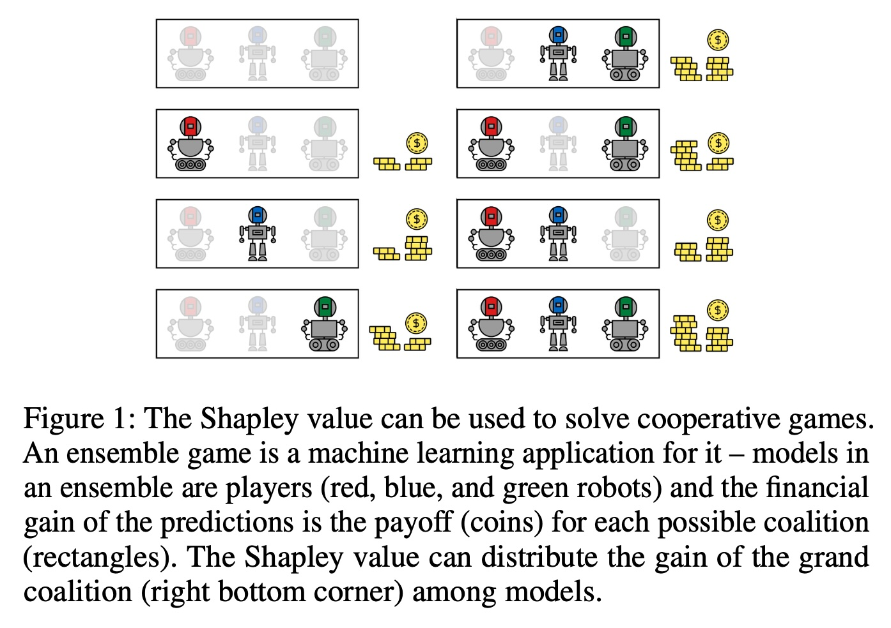
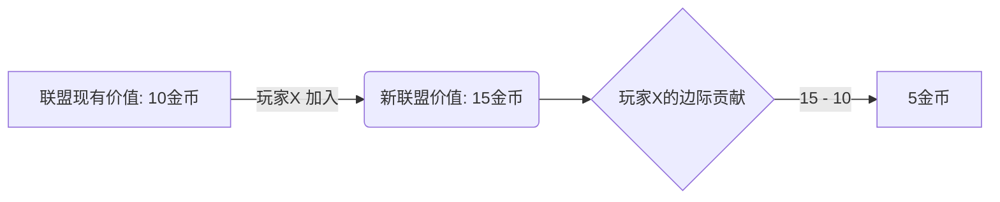
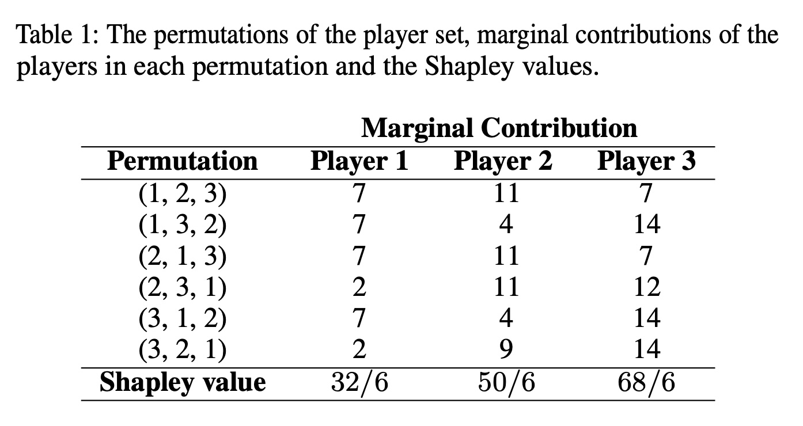
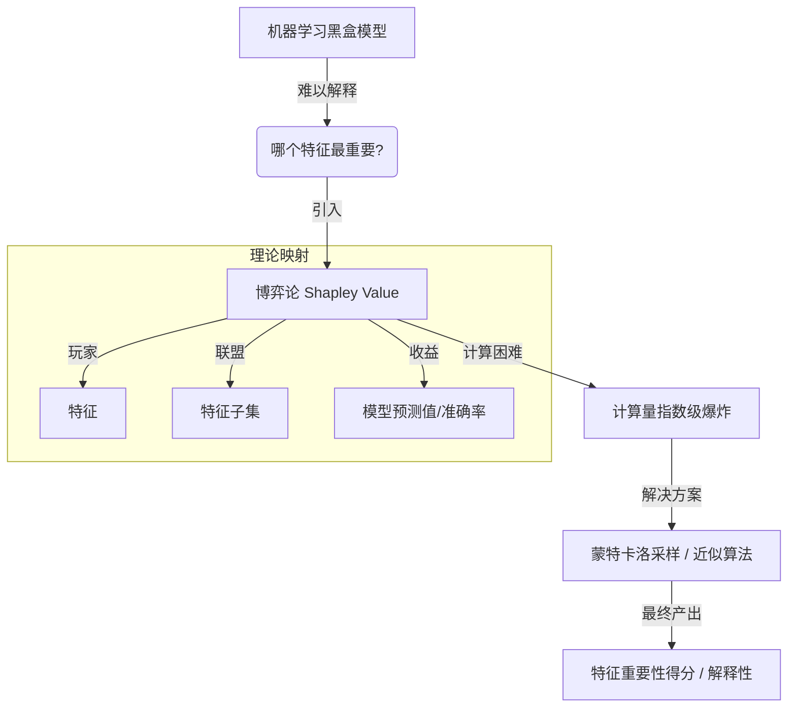
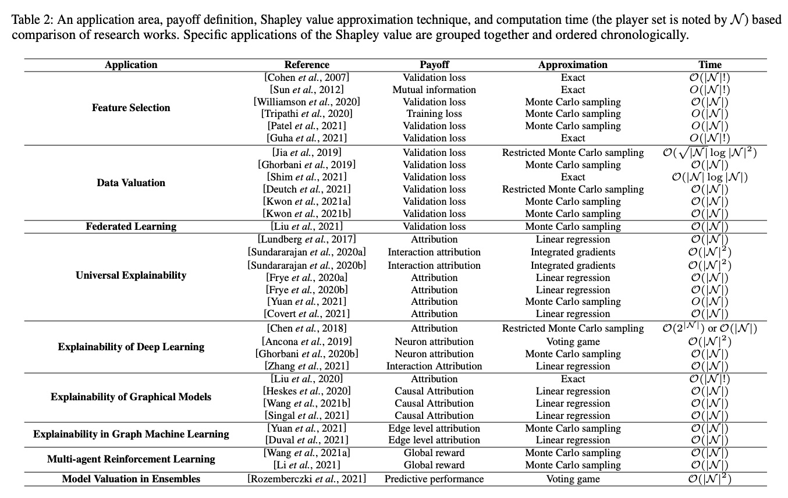
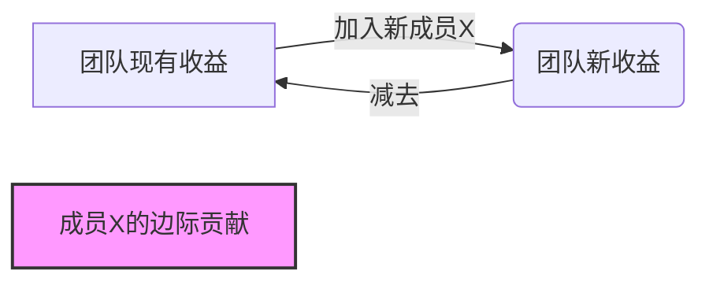

## AI论文解读 | The Shapley Value in Machine Learning
        
### 作者        
digoal        
        
### 日期        
2025-12-12        
        
### 标签        
PostgreSQL , PolarDB , DuckDB , AI , 论文解读        
        
----        
        
## 背景  
      
https://www.researchgate.net/publication/358579179_The_Shapley_Value_in_Machine_Learning        
  
提示:          
```          
读懂《The Shapley Value in Machine Learning》这篇论文需要提前掌握哪些基础知识, 请使用中文通熟易懂的讲解这些基础知识, 可以引用论文中的图、表或使用Markdown支持的图形(text,mermaid等)增加解释性. 
  
使用中文通熟易懂的解读《The Shapley Value in Machine Learning》这篇论文, 其中的关键内容请着重讲解, 可以引用论文中的图、表或使用Markdown支持的图形(text,mermaid等)增加解释性. 
  
提取《The Shapley Value in Machine Learning》这篇论文中的重要术语, 使用中文对这些术语进行通熟易懂的讲解, 可以引用论文中的图、表或使用Markdown支持的图形(text,mermaid等)增加解释性. 
```     
  
## 1 前置知识 
  
要读懂《The Shapley Value in Machine Learning》这篇论文，你不需要成为数学家，但需要掌握三个核心领域的概念： **合作博弈论（Cooperative Game Theory）** 、**机器学习基础（Machine Learning Basics）以及基础的概率与统计（Probability & Statistics）** 。

这篇论文的本质是在讲： **如何用“分蛋糕”的公平逻辑（博弈论），来解释机器学习模型中每个数据或特征到底起了多大作用。**

以下是通俗易懂的基础知识讲解：

-----

### 1\. 核心基石：合作博弈论 (Cooperative Game Theory)

这是论文最核心的理论基础。你需要理解如何在一个团队中公平分配利益。

#### A. 什么是“合作博弈”？

想象一群人（或者机器人）组队去赚钱。有些人能力强，有些人能力弱，但大家必须合作才能赚到更多的钱。

  * **玩家 ( Players, $\mathcal{N}$ )** ：参与游戏的人。
  * **联盟 ( Coalition, $\mathcal{S}$ )** ：玩家组成的任意小组。
  * **特征函数/价值函数 ( Characteristic Function, $v$ )** ：用来衡量一个联盟能赚多少钱的函数。比如 $v(\{1, 2\}) = 100$ 意味着玩家1和2联手能创造100的价值。

#### B. 什么是“Shapley Value”？

Shapley Value 就是一个**公平的分配方案**。它回答的问题是：在大家合作赚到钱后，每个人应该分多少才算公平？

**论文中的例子（引用 Figure 1）：**
论文第一页的 **Figure 1** 非常完美地诠释了这个概念 。

  

> **图解 Figure 1：**
>
>   * **玩家**：红、蓝、绿三个机器人。
>   * **联盟**：它们的不同组合（比如红+蓝，或者三个一起）。
>   * **价值 ( $v$ )** ：每个组合旁边对应的金币数量。
>   * **目标**：当三个机器人一起工作赚到一大堆金币（右下角）时，Shapley Value 告诉我们每个机器人应该分走那一堆金币中的多少。

#### C. 核心概念：边际贡献 (Marginal Contribution)

这是计算 Shapley Value 的关键。它的意思是： **“因为我的加入，团队的收益增加了多少？”**



Shapley Value 的核心思想是：计算你在**所有可能的加入顺序**下的平均边际贡献 。

-----

### 2\. 应用场景：机器学习基础 (Machine Learning Context)

你需要理解机器学习中的元素如何映射到上面的“博弈游戏”中。论文在第4节详细讨论了这些映射。

#### A. 谁是“玩家”？

在机器学习里，“玩家”的身份会变，取决于你想解决什么问题 ：

1.  **特征选择 (Feature Selection)** ：玩家 = 输入特征（比如：年龄、收入、身高）。你想知道哪个特征对预测结果最重要。
2.  **数据估值 (Data Valuation)** ：玩家 = 训练数据点（每一行数据）。你想知道哪条数据对模型训练贡献最大。
3.  **模型集成 (Ensembles)** ：玩家 = 每一个子模型（比如随机森林里的每一棵树）。

#### B. 什么是“赚钱/价值”？

在机器学习里，我们不赚钱，我们赚“准确率”或“性能”。

  * **价值函数 ( $v$ )** = 模型的性能指标（如准确率 Accuracy、R²、或者损失函数的负值） 。

#### C. 映射关系表

为了方便理解，我整理了论文中提到的映射关系：

| 概念 | 合作博弈论 (Game Theory) | 机器学习 (Machine Learning) |
| :--- | :--- | :--- |
| **参与者** | 玩家 (Players) | 特征 (Features) 或 数据点 (Data Points) |
| **团队** | 联盟 (Coalition) | 特征子集 或 训练数据集的一部分 |
| **收益** | 支付/金币 (Payoff) | 模型预测准确度 或 预测值本身 |
| **分配** | 分金币 | 计算特征重要性 (Feature Importance) |

-----

### 3\. 计算工具：排列组合与蒙特卡洛采样 (Approximation Methods)

论文的第3节专门讲“近似计算”，因为直接计算 Shapley Value 太慢了。理解这部分需要一点数学直觉。

#### A. 为什么难算？（排列组合爆炸）

要做到绝对公平，Shapley Value 要求考虑玩家加入的所有**顺序**（Permutations）。

  * 如果有 3 个玩家，顺序有 $3! = 3 \times 2 \times 1 = 6$ 种。这很容易算（如论文 Table 1 所示 ）。
  * 如果有 100 个特征，顺序有 $100!$ 种。这个数字比宇宙中的原子总数还大。

  

> **论文 Table 1 解析** ：
> 表格展示了3个玩家的所有6种排列顺序（(1,2,3), (1,3,2)...）。
> 每一行都在计算：在这个特定顺序下，每个玩家为团队增加了多少价值。
> 最后取**平均值**，就是 Shapley Value。

#### B. 怎么解决？（蒙特卡洛采样）

既然算不完所有顺序，我们就**抽样**。

  * **蒙特卡洛采样 (Monte Carlo Sampling)** ：就像搞民意调查，不需要问遍全国14亿人，随机抽取几千人就能估算出结果。
  * 在算法里，就是随机生成几千个排列顺序，计算这些顺序下的平均贡献，作为最终结果的近似值 。

-----

### 总结：读这篇论文的思维导图

在开始阅读前，请在脑海中建立这个流程：



**建议阅读顺序：**

1.  看 **Figure 1**  和 **Introduction**，理解大意。    
2.  看 **Section 2.1**，结合我上面的“分金币”例子理解定义。
3.  跳到 **Section 4 (Table 2)** ，看它在机器学习里具体有哪些应用（如 Feature Selection, Data Valuation）。    
4.  最后看 **Section 3**，了解为了算得快，大家都用了什么作弊技法（近似算法）。

你需要我针对论文中某个具体的数学公式（比如公式1或公式2）进行更详细的拆解吗？
  
## 2 解读论文 
  
这篇论文《The Shapley Value in Machine Learning》是一篇关于如何将**合作博弈论**中的核心概念——**Shapley Value（沙普利值）** —— 应用到机器学习领域的综述文章。

简单来说，它的核心任务是解决 **“归因”** 问题：在一个复杂的机器学习系统中，谁（哪个特征、哪条数据、哪个模型）功劳最大？

以下是论文关键内容的通俗解读：

### 1\. 核心直觉：机器人分金币的故事

论文开头使用了一个非常直观的例子（Figure 1）来解释什么是 Shapley Value 。    

想象有三个机器人（红、蓝、绿）一起工作赚钱（金币）。

  * **单独干**：每个机器人只能赚一点点。
  * **合作干**：它们两两合作或三人合作时，能赚到更多（产生“1+1\>2”的效果）。
  * **问题**：当三个机器人联手赚了一大笔钱后，如何公平地把钱分给它们？不能简单平分，因为有的机器人可能能力更强（边际贡献大）。

**Shapley Value 的逻辑是**：
考虑所有可能的“入队顺序”。比如，红机器人是第1个加入、第2个加入还是第3个加入？在每种情况下，它给团队带来了多少**额外的收益（边际贡献）** ？把所有情况下的贡献取平均值，就是它应得的“公平份额”。



### 2\. 为什么要用它？（四大公理）

论文指出，Shapley Value 之所以被尊为“黄金标准”，是因为它满足四个符合人类直觉的公平属性（公理）：

1.  **有效性 (Efficiency)** ：大家分到的蛋糕总和，必须等于蛋糕的总大小，不浪费也不多拿 。
2.  **对称性 (Symmetry)** ：如果两个成员贡献完全一样，它们分到的钱必须一样 。
3.  **虚无性 (Null Player)** ：如果一个成员纯属“打酱油”，对团队没有任何贡献，它分到的钱必须是0 。
4.  **线性 (Linearity)** ：如果在两个不同的游戏中合作（比如既修路又造桥），那么总收益等于两个游戏收益的直接相加 。

### 3\. 核心应用：机器学习里的五大“战场”

论文详细列举了 Shapley Value 在机器学习中的五大应用场景。本质上，就是把“玩家”和“收益”替换成了不同的东西 。

我为你总结了这五大场景的映射关系：

| 应用场景 | 谁是“玩家”？ | 什么是“收益”？ | 目标是什么？ |
| :--- | :--- | :--- | :--- |
| **1. 特征选择**  | 输入特征 (如: 年龄, 收入) | 模型的准确率 | 找出哪个特征最重要，去掉无用特征。 |
| **2. 数据估值**  | 训练数据点 (每一行数据) | 模型在测试集上的表现 | 发现高质量数据，给数据提供者定价；或发现有毒数据。 |
| **3. 模型解释性**  | 单个样本的特征值 | 对该样本的预测值 | 解释为什么模型对这个人拒贷（是因为收入低还是年龄小？）。 |
| **4. 联邦学习**  | 数据所有者 (如: 不同医院) | 全局模型的性能 | 公平奖励参与联合建模的机构，谁数据好谁拿得多。 |
| **5. 模型集成**  | 集成中的子模型 | 预测结果的正确性 | 在随机森林或集成模型中，判断哪个子模型最准。 |

#### 特别解读：模型解释性 (Explainability)

这是目前最火的应用（如 SHAP 方法）。

  * **场景**：AI 说这张图片是“猫”。
  * **Shapley 分析**：它会计算图片中每个像素区域（玩家）对“判断为猫”（收益）的贡献。
  * **结果**：可能会发现“猫耳朵”区域的 Shapley Value 很高，说明AI主要靠耳朵认出了猫。

### 4\. 最大的拦路虎：计算太慢

论文在第3节重点讨论了计算问题。

  * **困难**：要精确计算 Shapley Value，需要遍历所有可能的排列组合。如果特征有 $N$ 个，组合就有 $N!$ (N的阶乘) 种。如果 $N=50$ ，这个数字就是天文数字，根本算不完 。
  * **解决方案**：论文介绍了几种**近似算法 (Approximation)** ：
      * **蒙特卡洛采样 (Monte Carlo Sampling)** ：随机抽取一部分排列顺序来估算，而不是算完所有顺序 。
      * **分层采样**：为了减少误差，对不同类型的排列进行分层抽取 。
      * **加权最小二乘法 (如 KernelSHAP)** ：将计算转化为一个回归优化问题来求解 。

### 5\. 局限性与未来方向

论文最后（第5节）非常诚恳地指出了当前的问题 ：

1.  **公理失效风险**：我们因为 Shapley Value 满足“四大公理”才觉得它公平，但当我们为了速度使用“近似算法”时，这些公理可能就不再严格成立了 。
2.  **解释的直观性**：虽然数学上很完美，但告诉用户“这是所有排列组合下的平均边际贡献”，用户可能还是听不懂。用户想要的是因果关系，而不是相关性归因 。
3.  **计算依然昂贵**：即使有近似算法，对于深度学习这种动辄数百万参数或大数据的场景，算一次还是很慢 。

### 总结

这篇论文是一张 **“寻宝图”** ，它告诉我们在机器学习黑盒变得越来越复杂时，古老的博弈论智慧（Shapley Value）如何帮助我们：

1.  **看清内部**（解释性）。
2.  **公平定价**（数据估值）。
3.  **精简瘦身**（特征选择）。

它不仅梳理了理论，还汇总了各种加速计算的技巧，是理解 AI 可解释性（XAI）和数据中心型 AI（Data-centric AI）的重要读物。
  
## 3 术语 
  
这篇论文《The Shapley Value in Machine Learning》将博弈论中的经典概念引入了机器学习领域。为了帮你读懂，我提取了论文中最重要的术语，并按逻辑分为了**基础理论**、**公平规则**、**实际应用**和**计算方法**四个部分进行通俗讲解。

-----

### 第一部分：核心基础术语（基础理论）

这部分解释了“游戏”是怎么组局的。

#### 1\. 合作博弈 (Cooperative Game / TU Game)

  * **通俗解释**：这就好比一群人（或机器人）组队去打工赚钱。在这个游戏里，大家可以自由结盟，重点在于大家合作后产生的总收益是可以互相转让和分配的（比如赚到的钱可以分）。
  * **论文中的定义**：由两部分组成：
    1.  **玩家集合 ( $\mathcal{N}$ )** ：参与游戏的所有人。
    2.  **特征函数 ( $v$ )** ：用来衡量任何一个小团队（联盟）能创造多少价值的函数 。

#### 2\. 特征函数 (Characteristic Function / Payoff)

  * **通俗解释**：这是一个记分牌或计价器。你给它任何一个玩家组合（比如“玩家A+玩家B”），它就告诉你这个组合能得多少分或赚多少钱 。
  * **ML中的映射**：在机器学习里，这个“分”通常是**模型的准确率**、**损失函数的负值**或**预测的置信度** 。

#### 3\. 联盟 (Coalition) 与 大联盟 (Grand Coalition)

  * **通俗解释**：
      * **联盟**：玩家的任意子集（比如3个人里的2个人开小会）。
      * **大联盟**：所有玩家都到齐了的最终团队 。
  * **图解**：
    ```mermaid
    graph TD
    P1((玩家1))
    P2((玩家2))
    P3((玩家3))
    C1["联盟 {1,2}"] --属于--> GC["大联盟 {1,2,3}"]
    C2["联盟 {3}"] --属于--> GC
    ```

#### 4\. 边际贡献 (Marginal Contribution)

  * **通俗解释**：这是计算Shapley Value的灵魂。它的意思是：“**因为我的加入，团队的收益增加了多少？**” 。
  * **计算方式**：(我加入后的团队价值) - (我加入前的团队价值)。

#### 5\. Shapley Value (沙普利值)

  * **通俗解释**：这是一个**公平分配方案**。它计算的是一个玩家在所有可能的“入队顺序”下，平均能为团队带来多少边际贡献 。
  * **核心逻辑**：不仅看你干了多少，还要看如果你不在，团队会损失多少。

-----

### 第二部分：判定公平的“四大公理” (Axioms)

凭什么说 Shapley Value 是公平的？因为它必须满足以下四条铁律 ：

#### 1\. 有效性 (Efficiency / Pareto Optimality)

  * **解释**：分得的蛋糕总和，必须严格等于大联盟创造的总价值。不能有钱没分完，也不能凭空多出钱来 。
  * **ML意义**：所有特征的重要性得分加起来，必须等于模型的总预测值 。

#### 2\. 对称性 (Symmetry)

  * **解释**：同工同酬。如果两个玩家在任何情况下能提供的边际贡献都一样，那他们分到的钱必须一样 。

#### 3\. 虚无性 (Null Player / Dummy Player)

  * **解释**：不干活这就没饭吃。如果一个玩家加入任何团队都不会增加收益（贡献为0），那他的 Shapley Value 就必须是 0 。
  * **ML意义**：对于模型完全无用的噪音特征，其重要性得分应为 0 。

#### 4\. 线性 (Linearity)

  * **解释**：如果你同时打两份工（参与两个游戏），你的总收入应该是两份工收入的直接相加 。

-----

### 第三部分：机器学习中的“游戏” (Applications)

论文将不同的机器学习问题转化为了不同的“游戏” 。

#### 1\. 特征选择游戏 (Feature Selection Game)

  * **玩家**：输入的特征（如：年龄、身高等）。
  * **收益**：模型在测试集上的准确率 。
  * **目的**：找出哪些特征对模型性能贡献最大，保留它们，剔除无用特征。

#### 2\. 数据估值游戏 (Data Valuation Game)

  * **玩家**：训练集里的每一条数据 。
  * **收益**：模型训练后的性能表现 。
  * **目的**：判断哪条数据是“金矿”（高质量），哪条是“垃圾”（误导模型），甚至用于给数据买卖定价。

#### 3\. 模型集成游戏 (Ensemble Game)

  * **玩家**：集成模型中的每一个子模型（比如随机森林里的每一棵树）。
  * **收益**：整个集成系统的预测正确性 。
  * **目的**：看看哪些子模型是拖后腿的，可以把它们剪枝掉。

-----

### 第四部分：解决计算难题的术语 (Approximation)

因为计算所有排列组合（ $N!$ ）太慢了，论文介绍了一些“作弊”技巧 。

#### 1\. 蒙特卡洛排列采样 (Monte Carlo Permutation Sampling)

  * **通俗解释**：不用算完所有可能的入队顺序，而是**随机抽取**几千个顺序来模拟。就像搞民意调查一样，用样本来估算整体 。
  * **算法逻辑**：
    1.  随机抽一个顺序。
    2.  算每个人在这个顺序下的贡献。
    3.  重复多次取平均。

#### 2\. 分层采样 (Stratified Sampling)

  * **通俗解释**：这是对蒙特卡洛的改进。为了防止抽样偏差（比如只抽到了某种极端情况），我们先把顺序分分类（分层），然后在每一类里均匀地抽，这样结果更准，方差更小 。

#### 3\. 线性回归近似 (Linear Regression Approximation / SHAP)

  * **通俗解释**：这是著名方法 **SHAP** (Lundberg et al., 2017) 使用的技巧。它把计算 Shapley Value 的问题转化为了一个**加权最小二乘回归问题**。
  * **本质**：通过解一个方程组来直接估算 Shapley Value，而不是傻傻地遍历所有顺序 。
  
## 参考        
         
https://www.researchgate.net/publication/358579179_The_Shapley_Value_in_Machine_Learning    
        
<b> 以上内容基于DeepSeek、Qwen、Gemini及诸多AI生成, 轻微人工调整, 感谢杭州深度求索人工智能、阿里云、Google等公司. </b>        
        
<b> AI 生成的内容请自行辨别正确性, 当然也多了些许踩坑的乐趣, 毕竟冒险是每个男人的天性.  </b>        
    
#### [PolarDB 学习图谱](https://www.aliyun.com/database/openpolardb/activity "8642f60e04ed0c814bf9cb9677976bd4")
  
  
#### [PostgreSQL 解决方案集合](../201706/20170601_02.md "40cff096e9ed7122c512b35d8561d9c8")
  
  
#### [德哥 / digoal's Github - 公益是一辈子的事.](https://github.com/digoal/blog/blob/master/README.md "22709685feb7cab07d30f30387f0a9ae")
  
  
#### [About 德哥](https://github.com/digoal/blog/blob/master/me/readme.md "a37735981e7704886ffd590565582dd0")
  
  

  
