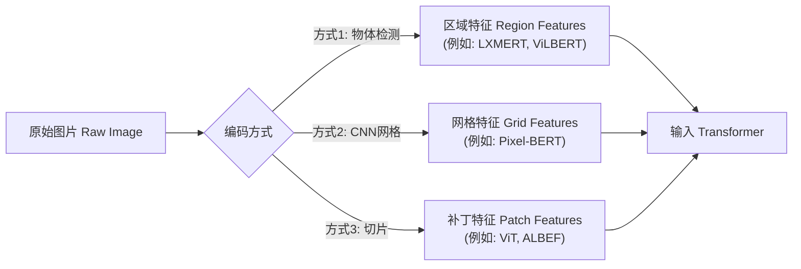
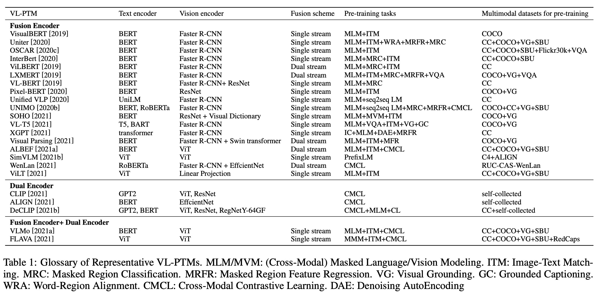
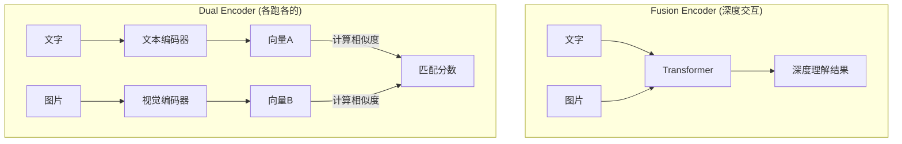
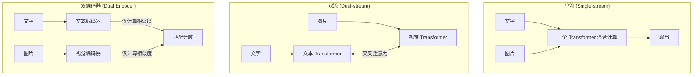
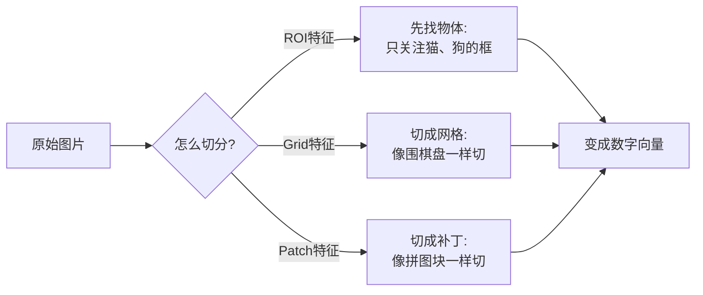
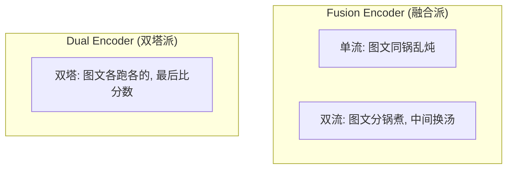

## AI论文解读 | A Survey of Vision-Language Pre-Trained Models
        
### 作者        
digoal        
        
### 日期        
2025-12-12        
        
### 标签        
PostgreSQL , PolarDB , DuckDB , AI , 论文解读        
        
----        
        
## 背景  
      
https://arxiv.org/pdf/2202.10936        
  
提示:          
```          
读懂《A Survey of Vision-Language Pre-Trained Models》这篇论文需要提前掌握哪些基础知识, 请使用中文通熟易懂的讲解这些基础知识, 可以引用论文中的图、表或使用Markdown支持的图形(text,mermaid等)增加解释性. 
  
使用中文通熟易懂的解读《A Survey of Vision-Language Pre-Trained Models》这篇论文, 其中的关键内容请着重讲解, 可以引用论文中的图、表或使用Markdown支持的图形(text,mermaid等)增加解释性. 
  
提取《A Survey of Vision-Language Pre-Trained Models》这篇论文中的重要术语, 使用中文对这些术语进行通熟易懂的讲解, 可以引用论文中的图、表或使用Markdown支持的图形(text,mermaid等)增加解释性. 
```     
  
## 1 前置知识 
  
阅读这篇综述论文《A Survey of Vision-Language Pre-Trained Models》，你需要理解它试图解决的核心问题： **如何让计算机像人类一样，同时看懂图片（Vision）和读懂文字（Language），并理解二者之间的关系。**

为了顺畅地阅读这篇论文，你需要掌握以下四个领域的“前置知识”。我会用通俗的语言配合图表为你讲解。

-----

### 1\. 基础架构：Transformer 模型

这是所有现代 VL-PTMs（视觉-语言预训练模型）的“发动机”。

  * **通俗解释：** 以前的模型（如 RNN）读文章是“逐字阅读”，看图（如 CNN）是“逐层扫描”。Transformer 的核心是**注意力机制（Attention）** ，它能“一眼看完全局”，并自动关注最相关的部分。
      * 比如读到“苹果”，它会关注“红色”、“水果”；
      * 比如看到图中的“猫”，它会关注文字里的“Cat”或“可爱”。
  * **论文中的体现：** 论文提到 Transformer 已成为 NLP 和 CV 领域的主流技术 。它是这一代模型处理长距离依赖关系的核心骨架。

### 2\. 输入表示：如何把图片变成“文字” (Image Representation)

计算机不直接认识图片，它只认识数字向量（Embeddings）。你需要理解图片是如何被“翻译”成 Transformer 能懂的语言的。

  * **通俗解释：**

      * **文字处理 (NLP)：** 很成熟，把句子切成词（Token），每个词变成一个向量。论文中提到这主要遵循 BERT 的方法 。
      * **图片处理 (CV)：** 这是难点。论文介绍了三种主要流派 ：
        1.  **ROI 特征 (Region Features)：** 用物体检测器（如 Faster R-CNN）先把图里的物体（人、车、狗）框出来，每个框变成一个特征。这是早期主流（如 ViLBERT）。
        2.  **网格特征 (Grid Features)：** 直接用 CNN 把整张图切成网格（类似像素块），不刻意区分物体。
        3.  **补丁特征 (Patch Features)：** 这是目前最火的（如 ViT）。把图片切成一个个小方块（比如 16x16 像素），像处理单词一样处理这些方块。

  * **流程图解：**




### 3\. 核心范式：预训练与微调 (Pre-training & Fine-tuning)

这是论文标题中“Pre-Trained Models”的含义，也是一种学习方法论。

  * **通俗解释：**
      * **预训练 (Pre-training)：** 像是“读大学”。让模型在海量数据（几亿张图文对）上泛泛而学，不针对具体考试。目标是学会“通识知识”（比如看到图里的毛茸茸物体知道是猫）。论文中提到这能提高模型的迁移能力 。
      * **微调 (Fine-tuning)：** 像是“岗前培训”。在预训练好的“大学生”模型基础上，用少量专门的数据训练它做具体工作（比如专门回答“图里有几个人”这个问题）。
  * **论文提及的下游任务 (Downstream Tasks)：**
      * **VQA (视觉问答)：** 给图和问题，选答案 。
      * **ITR (图文检索)：** 搜图或搜文 。
      * **NLVR (视觉推理)：** 判断一句话描述两张图是否正确 。

### 4\. 融合架构：单流 vs 双流 (Fusion Strategies)

这是论文第 3 节的核心分类逻辑，理解这个才能看懂 Table 1。    

  * **问题：** 视觉特征（图片）和语言特征（文字）怎么混合在一起？
  * **三种主要架构 ：**

#### A. 融合编码器 (Fusion Encoder) - "大杂烩"

把图片特征和文字特征拼在一起，扔进同一个 Transformer 里狂算。

  * **单流 (Single-stream)：** 图文一上来就混合。优点是交互深，适合做复杂的推理题（如 VQA）；缺点是慢。代表作：VisualBERT, UNITER。
  * **双流 (Dual-stream)：** 图和文先各自在自己的 Transformer 里跑一会儿，再通过“交叉注意力”交换信息。代表作：ViLBERT, LXMERT。

#### B. 双编码器 (Dual Encoder) - "各跑各的"

图和文完全分开处理，最后只算一个相似度分数（比如计算向量夹角）。

  * **特点：** 交互很浅，做推理题很差，但**检索速度极快**（像 CLIP）。




### 5\. 关键预训练任务 (Pre-training Tasks)

模型在“读大学”（预训练）期间，主要通过做哪些题来学习？

  * **MLM (Masked Language Modeling) - 完形填空：**
      * 把这句话里的“猫”字盖住，让模型根据上下文和**图片**，猜出这个字是“猫”。这强迫模型看图。论文称为 Cross-Modal MLM 。
  * **ITM (Image-Text Matching) - 连连看：**
      * 给一张图和一句话，问模型：它俩是一对吗？（Yes/No）。
  * **CMCL (Cross-Modal Contrastive Learning) - 对比学习：**
      * 这是 CLIP 的核心。拉近匹配的图文对（正样本），推开不匹配的（负样本）。论文提到这能学习通用的跨模态表示 。

### 总结：你的阅读路线图

当你掌握了以上知识，阅读这篇论文的路线建议如下：

1.  **看 Table 1 (Page 3)：** 这是全篇精华。用上面的知识去对应：哪个模型用了哪种图片编码（ROI vs Patch）？是单流还是双流？用了什么预训练任务？    
2.  **看 Section 3 (Interaction)：** 重点看图文是怎么“发生关系”的。
3.  **看 Section 4 (Tasks)：** 了解具体的训练题目设计。
  
## 2 解读论文 
  
这篇论文《A Survey of Vision-Language Pre-Trained Models》是对近年来“视觉-语言预训练模型”（VL-PTMs）的一个全面综述 。

简单来说，这篇论文解决的核心问题是： **如何让计算机同时“看懂”图片和“读懂”文字，并理解它们之间的关系。**

为了让你轻松理解，我将按照论文的逻辑架构，将其核心内容拆解为三个关键步骤： **输入（怎么看/读）、模型（怎么理解关系）、任务（怎么训练）** 。

-----

### 1\. 核心逻辑概览

论文指出，训练一个视觉-语言模型通常包含三个步骤 ：

1.  **输入编码 (Representation)：** 把图片和文字变成计算机能懂的数字向量。
2.  **模型架构 (Architecture)：** 设计一个“大脑”来融合和处理这两种信息。
3.  **预训练任务 (Pre-training Tasks)：** 设计各种“练习题”来训练这个大脑。

-----

### 2\. 第一步：怎么把图片和文字“喂”给模型？(Representation)

文字的处理大家都很熟悉，主要沿用 BERT 的方法，把句子切成词（Token）。但这篇论文的重点在于**图片怎么处理**。

论文总结了三种主流的**图像编码方式** ：

  * **区域特征 (Region Features)：**

      * **做法：** 先用一个物体检测器（如 Faster R-CNN）把图里的物体（猫、狗、车）框出来，每个框变成一个特征 。
      * **代表模型：** LXMERT, ViLBERT。
      * **特点：** 语义清晰，但依赖于外部检测器，速度较慢。

  * **网格特征 (Grid Features)：**

      * **做法：** 像切蛋糕一样，直接用 CNN 把图片切成网格，不刻意区分物体 。
      * **代表模型：** Pixel-BERT。

  * **补丁特征 (Patch Features) —— *这是现在的流行趋势*：**

      * **做法：** 模仿 Transformer 处理文字的方式，把图片切成一个个小方块（Patch），直接排成一列输入模型 。
      * **代表模型：** ViT, ALBEF, SimVLM。
      * **特点：** 速度快，端到端训练。

-----

### 3\. 第二步：模型怎么处理“图文关系”？(Architecture)

这是论文最核心的分类部分（Section 3）。当图片和文字都变成了向量，模型该怎么处理它们？论文将其分为三大派系 ：

#### A. 融合编码器 (Fusion Encoder) - “深度交互”

这类模型认为图文需要深度纠缠在一起才能理解。它又细分为两种流派：

1.  **单流架构 (Single-stream)：**

      * **原理：** 把文字和图片特征直接拼接，扔进**同一个** Transformer 里搅拌 。
      * **代表作：** VisualBERT, UNITER, VL-BERT 。
      * **优点：** 架构简单，参数共享。

2.  **双流架构 (Dual-stream)：**

      * **原理：** 图和文先各自通过**两个独立**的 Transformer 处理，中间通过“交叉注意力机制”来交换信息（就像两个人打电话交流）。
      * **代表作：** ViLBERT, LXMERT 。
      * **优点：** 能更好地保留各自模态的独立特征。

#### B. 双编码器 (Dual Encoder) - “各跑各的”

  * **原理：** 图和文完全分开编码，最后只计算两个向量的相似度（比如计算距离）。
  * **代表作：** **CLIP**, ALIGN 。
  * **优点：** **检索速度极快**（因为特征可以预先算好），但在复杂的图文推理任务上表现较弱 。

#### 架构对比图解



-----

### 4\. 第三步：模型通过做什题来变聪明？(Pre-training Tasks)

模型就像学生，需要做题才能学会知识。论文详细介绍了以下几种核心“练习题” ：

1.  **跨模态完形填空 (Cross-Modal MLM)：**

      * **题目：** 把句子里的某个词（如“狗”）盖住，让模型根据上下文和**图片**，猜出这个词是“狗” 。
      * **目的：** 强迫模型必须看图才能懂那句话。

2.  **图文匹配 (Image-Text Matching, ITM)：**

      * **题目：** 给一张图和一句话，问模型：它俩是一对吗？（Yes/No）。
      * **目的：** 学习图文的整体对齐关系。

3.  **图像区域预测 (Masked Region Prediction, MRP)：**

      * **题目：** 把图片挖掉一块，让模型根据文字和周围像素，猜挖掉的是什么（比如猜那是只“猫”的分类，或者恢复像素）。

4.  **跨模态对比学习 (Cross-Modal Contrastive Learning, CMCL) —— *CLIP的核心*：**

      * **题目：** 在一堆数据中，把配对的图和文拉近，不配对的推远 。
      * **目的：** 学习通用的特征空间，这对“零样本”（Zero-shot）任务非常有效 。

-----

### 5\. 所有的努力为了什么？(Downstream Tasks)

预训练好的模型（VL-PTMs）最后会应用在这些下游任务中 ：

  * **视觉问答 (VQA)：** 给张图，问“那个穿红衣服的人在干嘛？”，模型回答 。融合编码器（Fusion Encoder）在这里表现最好 。
  * **图文检索 (Retrieval)：** 搜图或搜文。双编码器（Dual Encoder）在这里效率最高 。
  * **视觉推理 (NLVR)：** 给两张图和一句话，判断这句话描述得对不对 。
  * **生成任务：** 比如看图写作文（Image Captioning）或者文字生成图片 。

### 总结与未来方向

这篇综述最后指出，虽然 VL-PTMs 进步巨大，但未来还有这几个方向 ：

1.  **统一架构 (Unified Model)：** 一个模型搞定所有模态（Data2vec 是个例子）。
2.  **模型压缩 (Compression)：** 现在的模型太大了，需要变小变快以便实际应用 。
3.  **更强的预训练 (Advanced Pre-training)：** 使用对抗训练等新方法 。
4.  **探寻极限 (Reaching the Limit)：** 用更大的数据（如 18亿图文对）和更大的参数量去冲击更好的效果 。
  
## 3 术语 
  
这篇论文《A Survey of Vision-Language Pre-Trained Models》中充满了大量专业术语。为了让你透彻理解，我将这些术语分为**基础概念、输入处理、模型架构、训练任务、应用场景**五大类，并用通俗的语言配合图表进行解读。

-----

### 一、 核心基础概念 (The Basics)

**1. VL-PTMs (Vision-Language Pre-Trained Models) / 视觉-语言预训练模型**

  * **通俗解释：** 这是一个“文武双全”的 AI 模型。它不仅“读过”海量的文字，还“看过”海量的图片。通过在大规模数据上“预习”（Pre-training），它学会了通用的知识（比如看到毛茸茸的图知道是猫，读到“Cat”也知道是猫）。之后，它可以去各个专门领域（如下游任务）“实习”（Fine-tuning）。

**2. Modality / 模态**

  * **通俗解释：** 信息的不同存在形式。在这篇论文里，主要指 **视觉（Vision）** 和 **语言（Language）** 这两种模态。
      * 例子：你听到声音是“听觉模态”，看到字是“视觉/语言模态”。VL-PTMs 的核心就是打通这两种感官。

-----

### 二、 图像“变身”术语 (Image Representation)

计算机不认识图片，只认识数字。把图片变成数字向量的过程叫“图像表示”。

**3. ROI Features (Region-Of-Interest Features) / 感兴趣区域特征**

  * **通俗解释：** 先用一个物体检测器（比如 Faster R-CNN）把图里的关键物体（人、车、狗）用框框出来。模型只看这些框里的内容，忽略背景杂讯。
  * **代表模型：** ViLBERT, LXMERT。
  * **缺点：** 速度慢，可能漏掉框以外的信息。

**4. Patch Features / 补丁特征**

  * **通俗解释：** 像拼图一样，把整张图片切成一个个固定大小的小方块（比如 16x16像素），把这些小方块排成一队喂给模型。这是目前最主流的做法（受 ViT 启发）。
  * **代表模型：** ViT, ALBEF。




-----

### 三、 模型架构术语 (Model Architecture)

这是论文中最关键的分类部分（见论文 Table 1 ），决定了模型如何处理“图”和“文”的关系。    

**5. Fusion Encoder / 融合编码器**

  * **通俗解释：** 这是一个“大熔炉”。它接收图片和文字作为输入，在模型内部进行深度的交互和融合。
  * 它又分为两派：
      * **Single-stream (单流)：** 图和文直接拼接，扔进同一个 Transformer 里搅拌。简单粗暴，参数少。
      * **Dual-stream (双流)：** 图和文先各自在自己的 Transformer 里跑一会儿，中间通过“桥梁”（交叉注意力）交换信息。以此保留各自的特性。

**6. Dual Encoder / 双编码器**

  * **通俗解释：** 这是一个“赛跑道”。图和文完全分开跑，互不打扰。直到终点线，才算一下它俩的“距离”（相似度）。这种架构**检索速度极快**，因为图片特征可以提前算好存起来。
  * **代表模型：** CLIP。




-----

### 四、 预训练任务术语 (Pre-training Tasks)

模型在“上大学”期间做的练习题。

**7. Cross-Modal MLM (Masked Language Modeling) / 跨模态掩码语言建模**

  * **通俗解释：** “看图填空”。
      * 题目：图片是一只猫在草地上。句子是：“一只[MASK]坐在草地上”。
      * 要求：模型不仅要看句子，还要看图片，才能填出“猫”这个字。这是最核心的任务。

**8. ITM (Image-Text Matching) / 图文匹配**

  * **通俗解释：** “判断题”。
      * 题目：给一张图和一句话。
      * 要求：模型回答“Yes”或“No”，判断这句话是不是描述这张图的。

**9. CMCL (Cross-Modal Contrastive Learning) / 跨模态对比学习**

  * **通俗解释：** “连连看”。
      * 原理：在成千上万的数据中，把配对的图和文（正样本）拉近，把不配对的（负样本）推远。目的是学习一个通用的空间，让相关的图文靠在一起。这是 CLIP 模型的核心绝招。

**10. MRC / MRFR (Masked Region Classification / Feature Regression)**

  * **通俗解释：** “看文猜图”。
      * 把图片盖住一块，让模型根据文字和周围的画面，猜盖住的是什么物体（分类 MRC）或者恢复它的像素特征（回归 MRFR）。

-----

### 五、 下游任务术语 (Downstream Tasks)

模型毕业后具体能干的工作。

**11. VQA (Visual Question Answering) / 视觉问答**

  * **工作内容：** 给一张图和一个问题（比如“图中那个人穿什么颜色的衣服？”），模型要输出正确答案。这需要很强的推理能力。

**12. ITR (Image-Text Retrieval) / 图文检索**

  * **工作内容：**
      * 以文搜图：输入“海边的日落”，从图库里找图。
      * 以图搜文：输入一张图，找最匹配的描述文字。
      * *注：双编码器（Dual Encoder）做这个最擅长。*

**13. NLVR (Natural Language for Visual Reasoning) / 视觉推理**

  * **工作内容：** 给两张图片和一句话，判断这句话是否准确描述了这两张图的关系（比如“左图的狗比右图的多”）。

**14. VCR (Visual Commonsense Reasoning) / 视觉常识推理**

  * **工作内容：** 不仅要回答问题，还要给出理由。比如“为什么那个人在跑？”，答案不仅是“他在赶公交”，还要依据图中的线索（他在看表、公车在远处）进行推理。

-----

### 总结图表：论文核心脉络

| 核心步骤 | 关键术语 | 简单比喻 |
| :--- | :--- | :--- |
| **1. 输入** | **Patch / ROI Features** | 把图片切碎成计算机能吃的“饼干” |
| **2. 架构** | **Fusion Encoder** | “火锅乱炖”，适合做深度推理题 (VQA) |
| | **Dual Encoder** | “分道扬镳”，适合快速找东西 (检索) |
| **3. 训练** | **MLM** | 看图填空 |
| | **CMCL** | 连连看 (拉近相似，推开不似) |
| **4. 应用** | **VQA, ITR, NLVR** | 具体的考试科目 |
  
## 参考        
         
https://arxiv.org/pdf/2202.10936    
        
<b> 以上内容基于DeepSeek、Qwen、Gemini及诸多AI生成, 轻微人工调整, 感谢杭州深度求索人工智能、阿里云、Google等公司. </b>        
        
<b> AI 生成的内容请自行辨别正确性, 当然也多了些许踩坑的乐趣, 毕竟冒险是每个男人的天性.  </b>        
    
#### [PolarDB 学习图谱](https://www.aliyun.com/database/openpolardb/activity "8642f60e04ed0c814bf9cb9677976bd4")
  
  
#### [PostgreSQL 解决方案集合](../201706/20170601_02.md "40cff096e9ed7122c512b35d8561d9c8")
  
  
#### [德哥 / digoal's Github - 公益是一辈子的事.](https://github.com/digoal/blog/blob/master/README.md "22709685feb7cab07d30f30387f0a9ae")
  
  
#### [About 德哥](https://github.com/digoal/blog/blob/master/me/readme.md "a37735981e7704886ffd590565582dd0")
  
  

  
