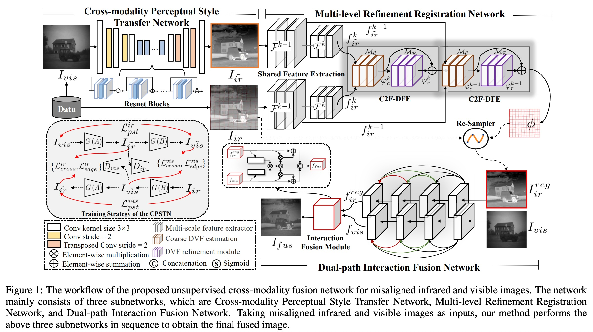
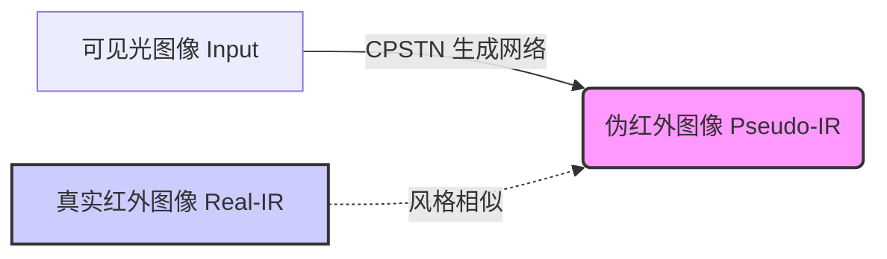
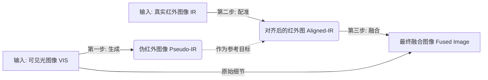
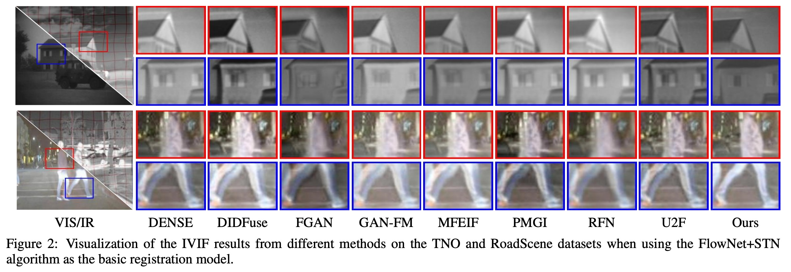
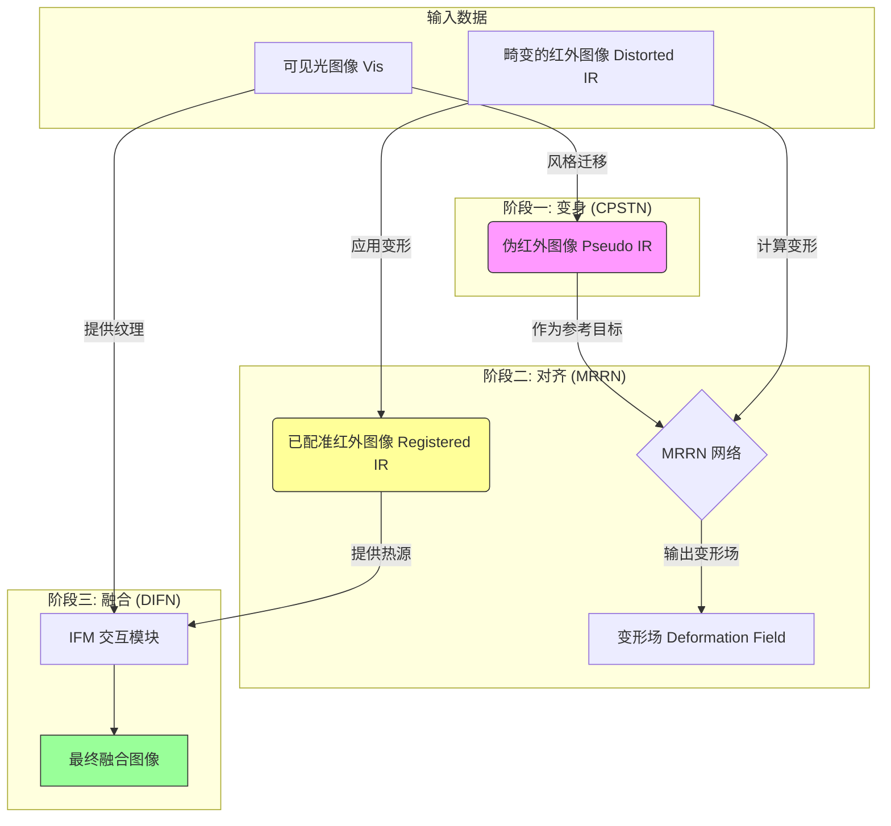

## AI论文解读 | Unsupervised Misaligned Infrared and Visible Image Fusion via Cross-Modality Image Generation and Registration
        
### 作者        
digoal        
        
### 日期        
2025-12-12        
        
### 标签        
PostgreSQL , PolarDB , DuckDB , AI , 论文解读        
        
----        
        
## 背景  
      
https://arxiv.org/pdf/2205.11876        
  
提示:          
```          
读懂《Unsupervised Misaligned Infrared and Visible Image Fusion via Cross-Modality Image Generation and Registration》这篇论文需要提前掌握哪些基础知识, 请使用中文通熟易懂的讲解这些基础知识, 可以引用论文中的图、表或使用Markdown支持的图形(text,mermaid等)增加解释性. 
  
使用中文通熟易懂的解读《Unsupervised Misaligned Infrared and Visible Image Fusion via Cross-Modality Image Generation and Registration》这篇论文, 其中的关键内容请着重讲解, 可以引用论文中的图、表或使用Markdown支持的图形(text,mermaid等)增加解释性. 
  
提取《Unsupervised Misaligned Infrared and Visible Image Fusion via Cross-Modality Image Generation and Registration》这篇论文中的重要术语, 使用中文对这些术语进行通熟易懂的讲解, 可以引用论文中的图、表或使用Markdown支持的图形(text,mermaid等)增加解释性. 
```     
  
## 1 前置知识 
  
要读懂这篇名为《Unsupervised Misaligned Infrared and Visible Image Fusion via Cross-Modality Image Generation and Registration》（基于跨模态图像生成与配准的无监督非对齐红外与可见光图像融合）的论文，你需要掌握以下几个核心的基础知识领域。

为了让你更容易理解，我将这些复杂的概念拆解为通俗的解释，并结合论文中的逻辑进行说明。

-----

### 1\. 基础概念：红外与可见光图像融合 (IVIF)

**通俗解释：**
想象你有两双眼睛，一双是普通人眼（可见光相机），能看到颜色和纹理（如树叶的绿色、路牌的字）；另一双是“热成像眼”（红外相机），能看到物体的温度（如藏在草丛里发热的人或刚熄火的车）。
**图像融合**就是把这两双眼睛看到的画面叠加在一起，既要有纹理细节，又要突出热源目标。

**论文中的痛点：**
通常的融合算法假设这两张图是完美重叠的。但实际上，由于相机位置不同或抖动，两张图往往**对不齐（Misaligned）** 。如果直接硬凑在一起，就会出现“重影”（Ghosting artifacts）。

  

> **图示理解：**
> 论文图1左侧展示了输入：
> * $I_{vis}$ ：可见光图像（主要看清房子结构、树木纹理）
> * $I_{ir}$ ：红外图像（主要看清哪里热，但细节模糊）

-----

### 2\. 核心难点：跨模态 (Cross-Modality) 与 域差异 (Domain Gap)

**通俗解释：**
可见光照片和红外照片长得完全不一样。

  * 可见光图：亮的可能是白墙，暗的可能是黑影。
  * 红外图：亮的代表热（比如人体），暗的代表冷。
    这种**成像原理的巨大差异**被称为“模态差异”。

**为什么需要懂这个？**
因为两张图长得太不一样，计算机很难直接判断如何把它们对齐（比如找不到相同的特征点）。
**论文的解决方案：** 先把“可见光图”伪装成“红外图”（风格迁移），这样两张图就长得像了，计算机就好对齐了 。

-----

### 3\. 关键技术一：生成对抗网络 (GAN) 与 风格迁移 (Style Transfer)

**通俗解释：**
这篇论文使用了类似于 **CycleGAN** 的技术 。
想象一个非常厉害的模仿画家（生成器 Generator）。

1.  你给他一张普通的街景照片（可见光）。
2.  命令他：“请把它画得像热成像拍出来的一样，但是不要改变房子和车的位置。”
3.  画出来的图叫“伪红外图”（Pseudo Infrared Image）。

**论文中的应用 (CPSTN模块)：**
论文设计了一个**跨模态感知风格迁移网络 (CPSTN)** 。

  * **输入：** 可见光图像。
  * **输出：** 伪红外图像（ $I_{\overline{ir}}$ ）。
  * **目的：** 让可见光图像拥有红外图像的“风格”（纹理少、突出结构），从而方便后续的配准 。




-----

### 4\. 关键技术二：图像配准 (Image Registration) 与 变形场 (Deformation Field)

**通俗解释：**
配准就是“把图对齐”。由于两张图不是简单的平移（比如向左移5像素），而是可能有扭曲（比如左上角向左歪，右下角向下拉），所以需要一个**变形场**。

  * **变形场 (Flow Field / Deformation Field)：** 这是一个看不见的网格，告诉图像上的每一个像素点：“你应该往哪个方向移动多少距离”才能和另一张图对上 。

**论文中的应用 (MRRN模块)：**
论文提出了**多级精细配准网络 (MRRN)** 。

  * 因为它已经把可见光图变成了“伪红外图”，现在它只需要把“真实红外图”扭一扭，去对齐那个“伪红外图”即可。
  * 这就像把两张透明纸叠在一起，通过拉伸其中一张（变形），让上面的图案完全重合。

> **数学符号提示：**
> 论文中出现的 $\phi$ (phi) 通常代表这个变形场 。公式 $I_{ir}^{reg} = I_{ir} \circ (-\phi)$ 的意思就是：把红外图按照 $\phi$ 指示的方向扭一扭，得到配准后的图 。

-----

### 5\. 关键技术三：损失函数 (Loss Functions) - 感知损失与结构相似性

**通俗解释：**
在训练神经网络时，怎么告诉电脑它做得好不好？这就需要“损失函数”。

  * **像素级损失 (Pixel-wise Loss)：** 逐个像素比对。但这对跨模态任务不准，因为黑衣服在红外里可能是白的。
  * **感知损失 (Perceptual Loss)：** 论文中使用了 VGG 网络提取特征 。这就像不比对像素颜色，而是比对“这里是不是有个轮廓”、“那里是不是有个圆”。
  * **SSIM (结构相似性)：** 衡量两张图的结构（比如物体边缘）像不像，而不是亮度像不像 。

**论文中的应用：**
论文使用了复杂的组合损失函数，包括感知损失（让生成的图看起来自然）、风格损失（让生成的图像红外图）、梯度损失（保持纹理清晰）等 。

-----

### 总结：阅读这篇论文的思维导图

读这篇论文时，请脑海中保持这个流程，就能看懂了：

1.  **问题：** 红外和可见光图**歪了**，且**长得不像**，没法直接对齐。
2.  **第一步 (CPSTN)：** 把可见光图**整容**成红外图的样子（解决“长得不像”的问题）。
3.  **第二步 (MRRN)：** 计算怎么扭曲真实的红外图，让它和整容后的图**重合**（解决“歪了”的问题）。
4.  **第三步 (DIFN)：** 把对齐后的红外图和原始的可见光图，挑选各自好的特征**合并**在一起（最终融合）。

**建议预习顺序：**

1.  了解什么是 **Image Fusion (图像融合)** 。
2.  简单了解 **CycleGAN** 的原理（A图变B图风格）。
3.  了解 **Spatial Transformer Network (STN)** 或 **Optical Flow (光流)** 的概念（如何用神经网络扭曲图片）。
  
## 2 解读论文 
  
这是一篇非常实用的论文，解决了红外与可见光图像融合（IVIF）中一个最头疼的现实问题： **两张图对不齐怎么办？**

以下是对这篇论文《Unsupervised Misaligned Infrared and Visible Image Fusion via Cross-Modality Image Generation and Registration》的通俗解读。

-----

### 1\. 核心背景：为什么要做这个研究？

**通俗解释：**
目前的图像融合算法（把红外光的热源信息和可见光的纹理信息合二为一）大多假设两张图是**完美重叠**的。但在实际应用中（比如无人机拍摄、车载摄像头抖动），红外相机和可见光相机很难做到像素级对齐，总会有位移或变形。

**痛点：**
如果不先对齐直接融合，结果就会出现严重的**重影（Ghosting artifacts）** ，就像人眼散光一样，物体边缘是模糊双层的 。

**难点：**
两张图长得太不一样了！

  * **可见光图**：看的是颜色、光照（白天亮，晚上暗）。
  * **红外图**：看的是温度（人是亮的，冰是暗的）。
    计算机很难直接找到两张图的共同特征来做对齐（这就叫“跨模态差异大”）。

-----

### 2\. 论文的“神来之笔”：CGRP 范式

论文提出了一个**跨模态生成-配准范式（CGRP）** 。它的核心逻辑非常巧妙，可以总结为三步走：

1.  **变身（生成）：** 把可见光图“伪装”成红外图。
2.  **对齐（配准）：** 让真实的红外图去对齐那个“伪装的红外图”（这时候两张图长得像了，就好对齐了）。
3.  **融合：** 把对齐后的红外图和原始可见光图融合。

我为你画了一个简化的逻辑图来辅助理解：



-----

### 3\. 关键技术模块详解

论文的整体框架如图1所示，主要由三个子网络组成 。    

#### 3.1 第一步：跨模态感知风格迁移网络 (CPSTN)

  * **作用：** 解决“长得不像”的问题。
  * **原理：** 这是一个生成对抗网络（类似 CycleGAN）。它输入可见光图像 $I_{vis}$ ，输出一个“伪红外图像” $I_{\overline{ir}}$ 。
  * **创新点：** 传统的风格迁移容易丢失边缘。作者加入了**感知风格损失（Perceptual Style Loss）和交叉正则化（Cross Regularization）** 。
      * *通俗理解：* 强迫网络生成的图不仅要把“颜色”变成红外风格，还要死死锁住物体的“轮廓结构”不准变。因为红外图虽然没有纹理，但结构（比如房子的线条）是清晰的 。

#### 3.2 第二步：多级精细配准网络 (MRRN)

  * **作用：** 解决“位置歪了”的问题。
  * **原理：** 这是一个从粗到细（Coarse-to-Fine）的配准网络。
  * **怎么做：** 此时，我们要配准的是 **“扭曲的真实红外图”** 和 **“伪红外图”** 。因为两者都是“红外风格”，这就变成了简单的单模态配准问题 。
      * 网络计算出一个**变形场（ Deformation Field, $\phi$ ）** ，就像给红外图施加了一个扭曲滤镜，让它和可见光图的位置完美重合 。

#### 3.3 第三步：双路交互融合网络 (DIFN)

  * **作用：** 把好不容易对齐的图融合成一张高质量图片。
  * **创新点：交互融合模块 (IFM)** 。
      * *传统做法：* 简单的加权平均或拼接，容易导致图像变糊。
      * *本文做法：* IFM 模块会自动评估哪些特征是重要的（比如红外里的人体热源、可见光里的路牌文字），然后自适应地选择特征进行保留，避免了特征平滑带来的模糊 。

-----

### 4\. 实验效果：眼见为实

为了证明效果，作者在 TNO 和 RoadScene 数据集上进行了人工模拟变形测试。

#### 定量对比（数据说话）

在配准准确度上，相比于直接使用 FlowNet 或 VoxelMorph 等知名配准算法，本文的方法（CGRP）在互信息（MI）指标上显著提升（在 RoadScene 数据集上提升了约 0.23）。这说明先把图“变身”再配准的路子是对的。

#### 定性对比（看图说话）

请看论文中的图 2，这展示了极其明显的差异：    

  * **红色框（其他方法）：** 也就是 DENSE, DIDFuse, GAN-FM 等现有的先进算法。因为它们处理不了位移，融合出的物体（如房子、树木）边缘都有明显的**双重虚影（重影）** 。
  * **蓝色框（本文方法 Ours）：** 最右侧的一列。可以看到重影基本消失了，红外图里的热源准确地贴合在可见光图的背景上，图像非常清晰 。

### 5\. 总结

这篇论文最值得学习的思路是： **“分而治之，曲线救国”** 。

  * 直接配准太难？那就先把模态统一了再配准（生成模块 CPSTN）。
  * 配准完了怎么融？不要简单叠加，要交互筛选特征（融合模块 DIFN）。
  * 最终实现了一个 **无监督（不需要人工标注对齐数据）** 的端到端框架，非常适合解决现实场景中红外与可见光相机视差大、甚至发生抖动的问题 。
  
## 3 术语 
  
这篇论文《Unsupervised Misaligned Infrared and Visible Image Fusion via Cross-Modality Image Generation and Registration》提出了一种新颖的方法来解决红外与可见光图像融合中的“错位”问题。

为了让你更轻松地读懂这篇论文，我提取了其中的**7个核心术语**，并用通俗的语言配合逻辑图进行解读。

-----

### 1\. 核心问题与策略

#### **IVIF (红外与可见光图像融合)**

  * **学术定义：** 将红外图像（热源信息）和可见光图像（纹理细节）结合，生成信息更丰富的图像 。
  * **通俗解释：** 就像给原本只能看到亮度的眼睛，戴上一副能看到温度的眼镜。既能看清路边的树叶纹理（可见光优势），又能一眼看到藏在草丛里的发热的人（红外光优势）。

#### **Misalignment & Ghosting Artifacts (非对齐与重影)**

  * **学术定义：** 由于传感器位置不同或抖动，两张图像存在空间变形。直接融合会导致结果出现“重影” 。
  * **通俗解释：** 想象你把两张透明纸叠在一起，一张画着人的轮廓，一张画着衣服。如果没对齐，看起来就像人有“分身”或者边缘模糊，这就是**重影**。这也是这篇论文主要想解决的“痛点”。

#### **CGRP (跨模态生成-配准范式)**

  * **学术定义：** 论文提出的总框架，Cross-modality Generation-Registration Paradigm。通过“图像翻译”来缩小模态差异，从而辅助配准 。
  * **通俗解释：** 这是一个“曲线救国”的策略。
      * *直接做：* 红外图（黑白的）和可见光图（彩色的）长得太不像，很难直接对齐。
      * *CGRP的做法：* 先把可见光图“伪装”成红外图（生成），然后再拿这个伪装图去跟真红外图对齐（配准）。

-----

### 2\. 关键技术模块（三大金刚）

论文的整体流程图如下（图1），包含了下面三个核心网络：   

#### **Term 1: CPSTN (跨模态感知风格迁移网络)**

  * **全称：** Cross-modality Perceptual Style Transfer Network 。
  * **功能：** 输入一张可见光图像，输出一张**伪红外图像 (Pseudo Infrared Image)** 。
  * **通俗解释（变身器）：**
    这就像一个高级“滤镜”。它把可见光照片里的树木、房子，画成红外热成像的那种“高亮、无纹理”的风格，但是**绝对不改变物体的位置和形状**。
      * *为什么要这么做？* 为了让它和真的红外图“长得像”，方便后续找相同点进行对齐 。

#### **Term 2: Mono-modality Registration (单模态配准)**

  * **学术定义：** 将跨模态对齐转化为单模态配准 。
  * **通俗解释（找茬对齐）：**
      * *跨模态（难）：* 让电脑把“彩色照片”和“黑白热成像”对齐，电脑很晕，找不到参考点。
      * *单模态（易）：* 有了 CPSTN 之后，电脑只需要把“真红外图”和“伪红外图”对齐。因为它俩风格一样，电脑很容易算出哪里歪了，然后把真红外图扭正 。

#### **Term 3: MRRN (多级精细配准网络)**

  * **全称：** Multi-level Refinement Registration Network 。
  * **功能：** 预测变形场（Deformation Field），将扭曲的红外图像校正 。
  * **通俗解释（整形医生）：**
    这个网络负责具体的“拉伸”工作。它采用“粗修+精修”的方式（Coarse-to-Fine），先大概把位置对上，再微调细节，确保红外图里的物体和可见光图里的物体严丝合缝地重叠 。

#### **Term 4: DIFN & IFM (双路交互融合网络与交互融合模块)**

  * **全称：** Dual-path Interaction Fusion Network / Interaction Fusion Module 。
  * **功能：** 融合已配准的红外图和可见光图，自适应选择特征 。
  * **通俗解释（智能调音师）：**
    一般的融合是简单叠加（像声音混响一样糊在一起）。IFM 模块像一个智能调音师，它会看：
      * “这一块红外图里有人（热源），保留！”
      * “那一块可见光图里有路牌字，保留！”
        这样融出来的图，既有清晰的文字，又有人体热源的高亮，而且边缘清晰锐利 。

-----

### 3\. 逻辑总结图 (Mermaid)

为了帮你理清这些术语的关系，我制作了这个流程图：



**一句话总结这篇论文的术语逻辑：**
为了解决**错位（Misalignment）** ，先用 **CPSTN** 把可见光图变成**伪红外图**，把难题变成简单的**单模态配准**，再用 **MRRN** 把歪了的红外图拉正，最后用 **IFM** 把两张图完美地**融合**在一起。
  
## 参考        
         
https://arxiv.org/pdf/2205.11876    
        
<b> 以上内容基于DeepSeek、Qwen、Gemini及诸多AI生成, 轻微人工调整, 感谢杭州深度求索人工智能、阿里云、Google等公司. </b>        
        
<b> AI 生成的内容请自行辨别正确性, 当然也多了些许踩坑的乐趣, 毕竟冒险是每个男人的天性.  </b>        
    
#### [PolarDB 学习图谱](https://www.aliyun.com/database/openpolardb/activity "8642f60e04ed0c814bf9cb9677976bd4")
  
  
#### [PostgreSQL 解决方案集合](../201706/20170601_02.md "40cff096e9ed7122c512b35d8561d9c8")
  
  
#### [德哥 / digoal's Github - 公益是一辈子的事.](https://github.com/digoal/blog/blob/master/README.md "22709685feb7cab07d30f30387f0a9ae")
  
  
#### [About 德哥](https://github.com/digoal/blog/blob/master/me/readme.md "a37735981e7704886ffd590565582dd0")
  
  

  
