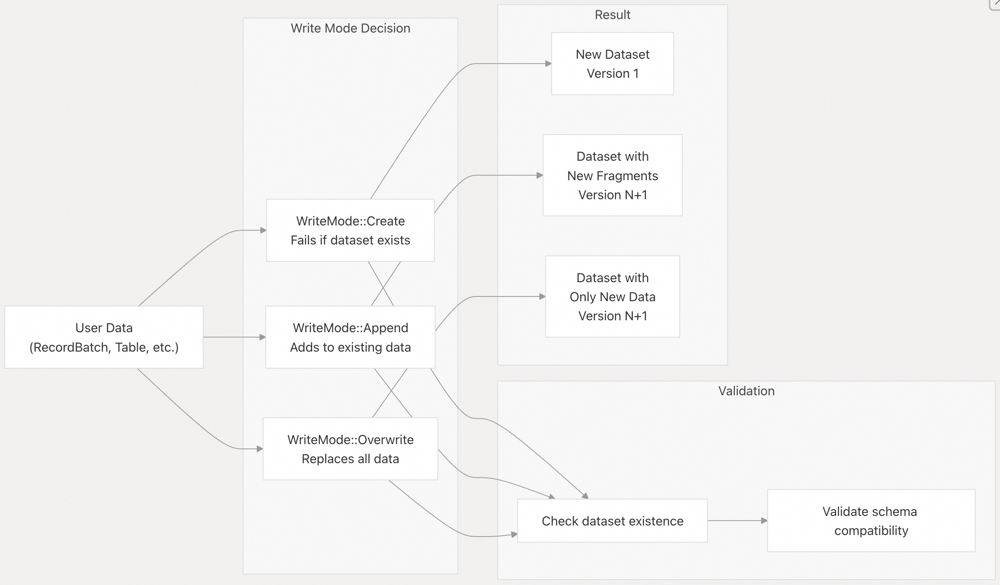
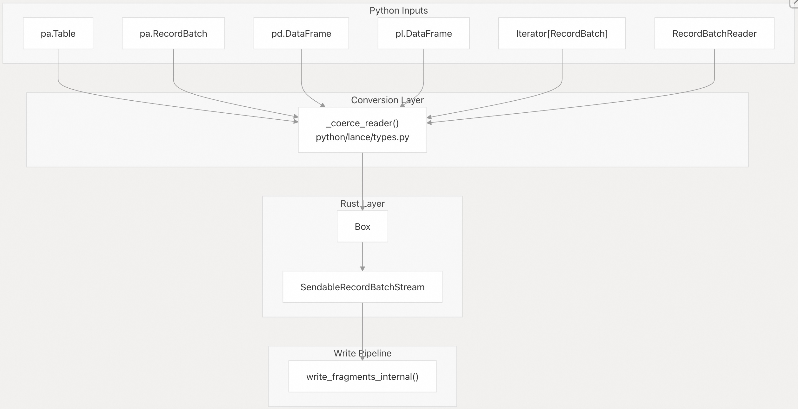
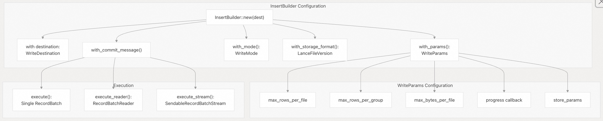
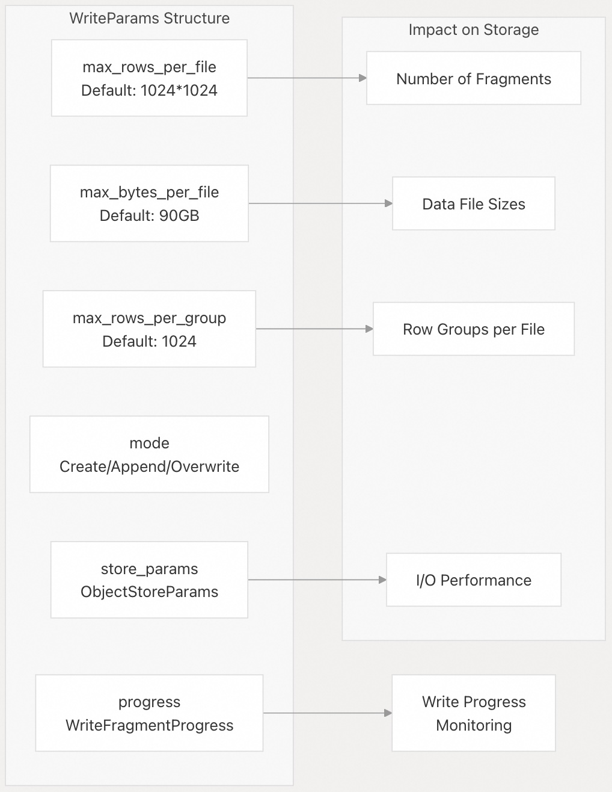
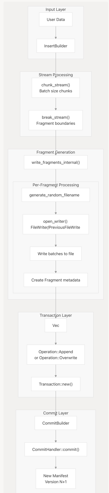
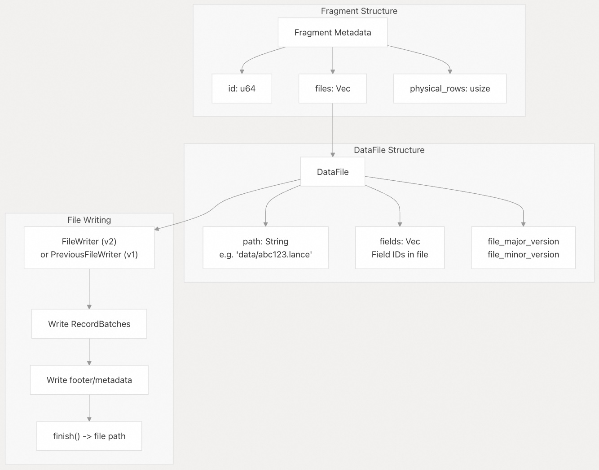
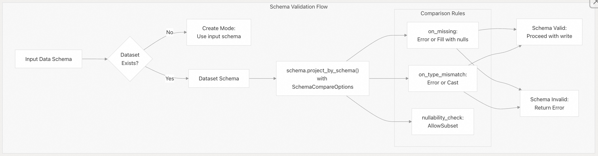
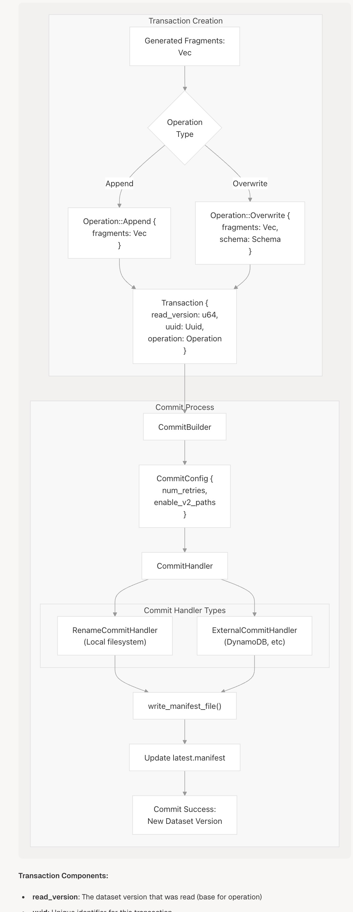
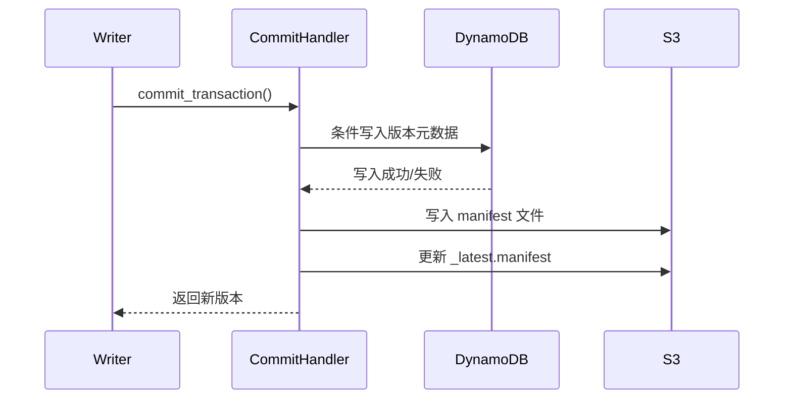

## Lance 源码学习: 5.1 插入和追加操作（Insert and Append Operations）   
          
### 作者          
digoal          
          
### 日期          
2025-12-12          
          
### 标签          
Lance , AI 数据存储与搜索引擎 , 存储引擎 , 向量索引 , 标量索引 , 全文检索 , 多模态支持 , 零拷贝 , 版本控制 , 时间旅行 , 源码学习 , 随机访问加速 , Parquet          
          
----          
          
## 背景      
  
**核心术语保留：**  
  
  * **Dataset**（数据集）  
  * **Fragment**（数据片段）  
  * **Insert and Append Operations**（插入和追加操作）  
  * **Write Mode**（写入模式）  
  * **InsertBuilder**（插入构建器）  
  * **Transaction**（事务）  
  * **Schema**（模式/结构）  
  
本文档描述了如何通过**插入和追加操作**（**Insert and Append Operations**）向 Lance **数据集**（**Dataset**）添加新数据。这些操作会创建包含插入数据的新**数据片段**（**Fragment**），并将其原子性提交到**数据集**。  
  
## 概述  
  
**插入和追加操作**会向 Lance **数据集**添加新记录。主要区别在于**写入模式**（**Write Mode**）：  
  
  * **追加（Append）模式：向现有数据集**添加数据。  
  * **创建（Create）模式：创建新的数据集**（如果**数据集**已存在则失败）。  
  * **覆盖（Overwrite）模式：替换现有数据集**中的所有数据，或创建新的**数据集**。  
  
这两种操作都使用相同的底层 **`InsertBuilder`** 基础架构，将输入数据转换为 Lance **数据片段**并进行原子性提交。  
  
来源: [`rust/lance/src/dataset/write.rs` 113-138](https://github.com/lance-format/lance/blob/0204e7e2/rust/lance/src/dataset/write.rs#L113-L138) [`rust/lance/src/dataset/write/insert.rs` 1-40](https://github.com/lance-format/lance/blob/0204e7e2/rust/lance/src/dataset/write/insert.rs#L1-L40)  
  
## 写入模式  
  
    
  
**写入模式**决定了操作如何与现有数据进行交互：  
  
| 模式（Mode） | 行为（Behavior） | 用例（Use Case） |  
| :--- | :--- | :--- |  
| `WriteMode::Create` | 创建新数据集，如果已存在则报错 | 初始数据集创建 |  
| `WriteMode::Append` | 向现有数据集添加数据 | 增量数据加载 |  
| `WriteMode::Overwrite` | 替换整个数据集 | 完整数据集刷新 |  
  
来源: [`rust/lance/src/dataset/write.rs` 113-138](https://github.com/lance-format/lance/blob/0204e7e2/rust/lance/src/dataset/write.rs#L113-L138) [`python/python/lance/dataset.py` 96-130](https://github.com/lance-format/lance/blob/0204e7e2/python/python/lance/dataset.py#L96-L130)  
  
## 数据输入类型  
  
Lance 接受各种数据源进行**插入操作**：  
  
    
  
**支持的输入类型：**  
  
  * **Arrow 表/批处理**：`pa.Table`、`pa.RecordBatch`  
  * **DataFrames**：`pd.DataFrame`、`pl.DataFrame`  
  * **流式处理（Streaming）** ：`Iterator[RecordBatch]`、`RecordBatchReader`  
  * **Rust**：任何实现 `RecordBatchReader` 的类型  
  
使用迭代器或读取器时，您可能需要显式提供**模式/结构**（**Schema**）：  
  
```  
# With explicit schema  
schema = pa.schema([pa.field("a", pa.float64()), pa.field("b", pa.int64())])  
lance.write_dataset(iter(batches), uri, schema=schema)  
```  
  
来源: [`python/python/lance/types.py`](https://github.com/lance-format/lance/blob/0204e7e2/python/python/lance/types.py) [`python/python/tests/test_dataset.py` 38-62](https://github.com/lance-format/lance/blob/0204e7e2/python/python/tests/test_dataset.py#L38-L62) [`rust/lance/src/dataset.rs` 782-800](https://github.com/lance-format/lance/blob/0204e7e2/rust/lance/src/dataset.rs#L782-L800)  
  
## InsertBuilder API  
  
**`InsertBuilder`** 提供了用于配置**插入操作**的流畅 **API**：  
  
    
  
**关键方法：**  
  
| 方法（Method） | 用途（Purpose） |  
| :--- | :--- |  
| `InsertBuilder::new(dest)` | 创建具有目标（URI 或 Dataset）的构建器 |  
| `with_params(WriteParams)` | 配置写入参数 |  
| `with_mode(WriteMode)` | 设置写入模式（Create/Append/Overwrite） |  
| `with_storage_format(version)` | 设置 Lance 文件版本 |  
| `with_commit_message(msg)` | 添加用于版本控制的提交消息 |  
| `execute()` | 使用单个 `RecordBatch` 执行 |  
| `execute_reader()` | 使用 `RecordBatchReader` 执行 |  
| `execute_stream()` | 使用流式数据执行 |  
  
来源: [`rust/lance/src/dataset/write/insert.rs` 40-277](https://github.com/lance-format/lance/blob/0204e7e2/rust/lance/src/dataset/write/insert.rs#L40-L277) [`python/python/lance/dataset.py` 1053-1130](https://github.com/lance-format/lance/blob/0204e7e2/python/python/lance/dataset.py#L1053-L1130)  
  
## 写入参数  
  
`WriteParams` 控制数据如何写入存储：  
  
    
  
**参数详情：**  
  
| 参数（Parameter） | 默认值（Default） | 描述（Description） |  
| :--- | :--- | :--- |  
| `max_rows_per_file` | 1,048,576 | 在创建新**数据片段**前的最大行数 |  
| `max_rows_per_group` | 1,024 | 每个内部行组的行数 |  
| `max_bytes_per_file` | 90 GB | 文件大小的软限制 |  
| `mode` | Create | 写入模式（Create/Append/Overwrite） |  
| `progress` | NoOp | 写入进度的回调函数 |  
  
**在 Python 中设置参数：**  
  
```python  
import lance  
  
# Using write_dataset  
dataset = lance.write_dataset(  
    data,  
    uri,  
    max_rows_per_file=500000,  
    max_rows_per_group=2048,  
    mode="append"  
)  
  
# Using dataset.insert()  
dataset.insert(  
    data,  
    max_rows_per_file=500000,  
    max_rows_per_group=2048  
)  
```  
  
来源: [`rust/lance/src/dataset/write.rs` 156-211](https://github.com/lance-format/lance/blob/0204e7e2/rust/lance/src/dataset/write.rs#L156-L211) [`python/python/lance/dataset.py` 1053-1130](https://github.com/lance-format/lance/blob/0204e7e2/python/python/lance/dataset.py#L1053-L1130)  
  
## 写入管道架构  
  
从用户数据到提交**数据集**的完整流程：  
  
    
  
**管道阶段：**  
  
1.  **流分块（Stream Chunking）** ：将输入流分解为适当大小的块  
2.  **数据片段边界检测（Fragment Boundary Detection）** ：根据 `max_rows_per_file` 在**数据片段**边界处进行拆分  
3.  **文件写入（File Writing）** ：将每个**数据片段**写入 Lance 数据文件  
4.  **元数据创建（Metadata Creation）** ：生成包含文件路径和行数的 `Fragment` **数据片段**元数据  
5.  **事务创建（Transaction Creation）** ：将**数据片段**打包成 `Operation::Append` 或 `Operation::Overwrite`  
6.  **提交（Commit）** ：原子性提交**事务**（**Transaction**）以创建新的清单（manifest）版本  
  
来源: [`rust/lance/src/dataset/write/insert.rs` 40-277](https://github.com/lance-format/lance/blob/0204e7e2/rust/lance/src/dataset/write/insert.rs#L40-L277) [`rust/lance/src/dataset/write.rs` 280-476](https://github.com/lance-format/lance/blob/0204e7e2/rust/lance/src/dataset/write.rs#L280-L476)  
  
## 数据片段生成详情  
  
每个**数据片段**（**Fragment**）被写入为一个或多个 Lance 数据文件：  
  
    
  
**数据片段创建过程：**  
  
1.  **生成数据片段 ID**：原子计数器或显式 ID  
2.  **创建随机文件名**：格式：`data/{uuid}.lance`  
3.  **打开文件写入器**：选择版本（v1 遗留版本或 v2）  
4.  **写入批次**：将批次流式写入文件  
5.  **定稿**：写入页脚并关闭文件  
6.  **创建元数据**：包含文件路径和统计信息的 `Fragment` 对象  
  
**文件命名：**  
  
  * 基本目录：`{dataset_uri}/data/`  
  * 文件名格式：`{random_uuid}.lance`  
  * 示例：`data/f3e4d5c6-b7a8-9f0e-1d2c-3b4a5c6d7e8f.lance`  
  
来源: [`rust/lance/src/dataset/fragment/write.rs` 1-241](https://github.com/lance-format/lance/blob/0204e7e2/rust/lance/src/dataset/fragment/write.rs#L1-L241) [`rust/lance/src/dataset/write.rs` 280-476](https://github.com/lance-format/lance/blob/0204e7e2/rust/lance/src/dataset/write.rs#L280-L476) [`rust/lance-table/src/format/fragment.rs` 1-266](https://github.com/lance-format/lance/blob/0204e7e2/rust/lance-table/src/format/fragment.rs#L1-L266)  
  
## 模式验证和演变  
  
Lance 在**插入操作**期间会验证**模式/结构**（**Schema**）兼容性：  
  
    
  
**模式兼容性规则：**  
  
| 场景（Scenario） | 追加（Append）模式 | 创建/覆盖（Create/Overwrite）模式 |  
| :--- | :--- | :--- |  
| 输入包含额外字段 | 错误（默认） | 接受 |  
| 输入缺失字段 | 用 null 填充 | 错误 |  
| 类型不匹配 | 错误（或在允许的情况下进行类型转换） | 错误 |  
| 可为空 → 不可为空 | 错误 | 允许 |  
| 不可为空 → 可为空 | 允许 | 允许 |  
  
**追加模式的模式处理：**  
  
在追加模式下，输入**模式**必须与现有**数据集模式**兼容：  
  
```  
# Original dataset  
table1 = pa.table({"a": [1, 2], "b": [3, 4]})  
dataset = lance.write_dataset(table1, uri)  
  
# Valid append: subset of columns (b filled with nulls)  
table2 = pa.table({"a": [5, 6]})  
dataset.insert(table2)  # Results in: a=[1,2,5,6], b=[3,4,null,null]  
  
# Invalid append: incompatible schema  
table3 = pa.table({"c": [7, 8]})  # Error: column 'c' not in dataset  
dataset.insert(table3)  
```  
  
来源: [`rust/lance/src/dataset/write/insert.rs` 119-200](https://github.com/lance-format/lance/blob/0204e7e2/rust/lance/src/dataset/write/insert.rs#L119-L200) [`python/python/tests/test_dataset.py` 111-130](https://github.com/lance-format/lance/blob/0204e7e2/python/python/tests/test_dataset.py#L111-L130) [`rust/lance/src/dataset/write.rs` 280-476](https://github.com/lance-format/lance/blob/0204e7e2/rust/lance/src/dataset/write.rs#L280-L476)  
  
## 事务和提交流程  
  
**插入操作**会创建**事务**（**Transaction**），并进行原子性提交：  
  
    
  
**事务组成部分：**  
  
  * **read\_version**：读取的**数据集**版本（操作的基础）  
  * **uuid**：此**事务**的唯一标识符  
  * **operation**：具体操作（追加 Append 或覆盖 Overwrite）  
  
**提交过程：**  
  
1.  **事务创建**：将**数据片段**打包成相应的 `Operation`  
2.  **CommitBuilder 设置**：配置重试行为和选项  
3.  **提交处理器选择**：根据存储类型选择处理器  
4.  **清单写入**：将新的清单文件写入 `_versions/` 目录  
5.  **原子更新**：更新指向最新版本的指针  
6.  **返回数据集**：返回版本 N+1 的新**数据集**实例  
  
**提交原子性：**  
  
Lance 通过以下方式确保原子性：  
  
  * **基于重命名的提交**（本地文件系统）：原子文件重命名操作  
  * **外部协调**（云存储）：DynamoDB 或类似的协调服务  
  * **乐观并发控制**：检测冲突并在需要时重试  
  
来源: [`rust/lance/src/dataset/write/commit.rs`](https://github.com/lance-format/lance/blob/0204e7e2/rust/lance/src/dataset/write/commit.rs) [`rust/lance/src/dataset/transaction.rs` 1-500](https://github.com/lance-format/lance/blob/0204e7e2/rust/lance/src/dataset/transaction.rs#L1-L500) [`rust/lance-table/src/io/commit.rs` 1-500](https://github.com/lance-format/lance/blob/0204e7e2/rust/lance-table/src/io/commit.rs#L1-L500)  
  
## Python API 示例  
  
### 基础插入操作  
  
```python  
import lance  
import pyarrow as pa  
  
# Create new dataset  
table = pa.table({"a": [1, 2, 3], "b": [4, 5, 6]})  
dataset = lance.write_dataset(table, "dataset.lance")  
  
# Append more data  
table2 = pa.table({"a": [7, 8], "b": [9, 10]})  
dataset = lance.write_dataset(table2, "dataset.lance", mode="append")  
  
# Or use dataset.insert()  
dataset.insert(table2)  
  
# Overwrite entire dataset  
table3 = pa.table({"x": [1, 2], "y": [3, 4]})  
dataset = lance.write_dataset(table3, "dataset.lance", mode="overwrite")  
```  
  
### 流式传输大型数据集  
  
```python  
# Stream from iterator with explicit schema  
schema = pa.schema([  
    pa.field("id", pa.int64()),  
    pa.field("value", pa.float64())  
])  
  
def batch_generator():  
    for i in range(100):  
        yield pa.record_batch({  
            "id": range(i*1000, (i+1)*1000),  
            "value": [v * 0.1 for v in range(1000)]  
        }, schema=schema)  
  
dataset = lance.write_dataset(  
    batch_generator(),  
    "large_dataset.lance",  
    schema=schema,  
    max_rows_per_file=10000  
)  
```  
  
### 配置写入参数  
  
```python  
# Fine-tune fragment size and row groups  
dataset = lance.write_dataset(  
    table,  
    "dataset.lance",  
    max_rows_per_file=500000,     # Smaller fragments  
    max_rows_per_group=2048,      # Larger row groups  
    mode="append"  
)  
  
# With progress callback  
from lance.progress import FileSystemFragmentWriteProgress  
  
progress = FileSystemFragmentWriteProgress()  
dataset = lance.write_dataset(  
    table,  
    "dataset.lance",  
    progress=progress  
)  
```  
  
### 处理模式演变  
  
```python  
# Original dataset with fields a, b  
original = pa.table({"a": [1, 2], "b": [3, 4]})  
dataset = lance.write_dataset(original, "dataset.lance")  
  
# Append with subset of columns (b will be null)  
subset = pa.table({"a": [5, 6]})  
dataset.insert(subset)  
  
# Result: a=[1,2,5,6], b=[3,4,null,null]  
result = dataset.to_table()  
```  
  
来源: [`python/python/lance/dataset.py` 1053-1130](https://github.com/lance-format/lance/blob/0204e7e2/python/python/lance/dataset.py#L1053-L1130) [`python/python/tests/test_dataset.py` 96-164](https://github.com/lance-format/lance/blob/0204e7e2/python/python/tests/test_dataset.py#L96-L164) [`python/python/tests/test_fragment.py` 29-68](https://github.com/lance-format/lance/blob/0204e7e2/python/python/tests/test_fragment.py#L29-L68)  
  
## 性能考量  
  
**数据片段大小（Fragment Sizing）：**  
  
  * 更大的**数据片段**（更高的 `max_rows_per_file`）→ 文件数量更少，对大规模扫描更有利  
  * 更小的**数据片段**→ 查询期间的并行度更高，对选择性读取更有利  
  * 推荐范围：每个**数据片段** 10 万 - 100 万行  
  
**行组大小（Row Group Sizing）：**  
  
  * 更大的行组 → 更好的压缩效果，更少的 I/O 操作  
  * 更小的行组 → 更低的内存使用量，更细粒度的过滤  
  * 默认 1024 行适用于大多数工作负载  
  
**写入性能：**  
  
  * 对于大于内存的**数据集**，使用流式写入  
  * 启用进度回调以监控长时间运行的写入操作  
  * 在迭代生成数据时，考虑批次大小  
  
**存储格式：**  
  
  * V2 格式（默认）提供更好的性能和压缩  
  * 遗留格式（Legacy format）可用于向后兼容  
  
来源: [`rust/lance/src/dataset/write.rs` 156-211](https://github.com/lance-format/lance/blob/0204e7e2/rust/lance/src/dataset/write.rs#L156-L211) [`rust/lance/src/dataset/write/insert.rs` 1-277](https://github.com/lance-format/lance/blob/0204e7e2/rust/lance/src/dataset/write/insert.rs#L1-L277)  
  
-----  
  
# 附录1: 关于数据可靠性与高并发写入的成本  
  
> **视角：架构师 / 平台工程师**    
>     
> **背景痛点：** 在分布式/云存储（如 S3）环境中，实现 ACID 事务（尤其是在高并发追加数据时）是复杂的，它通常需要引入额外的协调服务，这直接影响**写入延迟**和**运行成本**。  
  
Lance **数据集**是如何在**写入管道架构**的**提交原子性**部分，通过**乐观并发控制**和外部协调机制（如 DynamoDB 或类似服务）来保证数据在 S3/GCS 等云存储环境中的 **ACID 事务**特性？  
  
更进一步，对于高并发的**插入和追加操作**，这种**事务**（**Transaction**）机制对**写入延迟**（Latency）和**云存储（API 调用）成本**的具体影响如何？  
  
## 回答  
  
## Lance 的 ACID 事务实现机制  
  
Lance 通过**乐观并发控制**和**外部协调服务**在云存储环境中实现 ACID 事务特性。  
  
### 1. 事务架构与并发控制  
  
Lance 使用 MVCC（多版本并发控制）模型，每个写操作创建新的数据集版本  。事务包含：  
- `read_version`: 基础版本号  
- `operation`: 操作类型（Append/Overwrite/Delete等）  
- `uuid`: 唯一标识符  
  
冲突检测基于可序列化隔离级别，不同操作间的兼容性在事务层定义  。  
  
### 2. 外部协调机制  
  
对于 S3 等不支持原子操作的存储，Lance 使用外部协调服务：  
  
#### DynamoDB 协调实现  
- 使用 `s3+ddb://` URI 模式启用 DynamoDB 协调    
- DynamoDB 表结构：  
  - PK: `base_uri` (字符串)  
  - SK: `version` (数字)  
  - 属性: `path`, `committer`    
- 使用条件写入确保每个版本只有一个写入者成功    
  
#### 提交流程  

  
### 3. 高并发写入的性能影响  
  
#### 写入延迟分析  
基于测试数据，使用 DynamoDB 协调的写入操作需要：  
  
1. **数据文件写入**: 1 次 IOPS  
2. **事务文件**: 1 次 IOPS    
3. **Manifest 文件**: 3 次 IOPS（写入临时文件、复制到最终位置、删除临时文件）    
  
总计：**5 次写入 IOPS + 1 次读取 IOPS** 每次追加操作  。  
  
#### 并发测试结果  
- 5 个并发写入者可以成功完成    
- 10 个并发写入者时会出现失败（需要重试机制）    
- 默认重试次数为 5 次    
  
#### 成本影响  
| 操作类型 | S3 API 调用 | DynamoDB API 调用 |  
|---------|------------|------------------|  
| 单次追加 | 5 写 + 1 读 | 1 写（条件写入）|  
| 读取数据集 | 1 读 | 1 读（查询最新版本）   |  
  
### 4. 优化建议  
  
1. **批量写入**: 使用 `write_fragments` 进行分布式写入，减少提交次数    
2. **跳过自动清理**: 设置 `skip_auto_cleanup=true` 减少提交时的 IOPS    
3. **V2 manifest 路径**: 启用 `enable_v2_manifest_paths` 优化版本查找    
  
## Notes  
  
- DynamoDB 协调是可选的，对于支持原子重命名的存储系统（如本地文件系统），Lance 使用更轻量的 `RenameCommitHandler` 或 `ConditionalPutCommitHandler`    
- 事务的 UUID 和版本号确保了操作的幂等性和可追溯性  
- 测试显示并发写入超过一定阈值时失败率增加，需要根据业务负载调整重试策略  
  
  
  
-----  
  
# 附录2: 关于模式演变和数据管道的鲁棒性  
  
> **视角：数据工程师 / 日常用户**  
>  
> **背景痛点：** 现实中的数据源**模式**（**Schema**）很难保持稳定（即发生 **Schema Drift**）。文档中提到，在**追加模式**（`WriteMode::Append`）下，如果输入数据包含现有**数据集模式**中没有的新字段（**Input has extra fields**），默认操作是 **Error**。这种硬性错误会直接中断数据摄入管道。  
  
作为数据工程师，如何在日常维护中配置 **`InsertBuilder`** 或 **`WriteParams`**，以更优雅、更灵活地处理这种**模式演变**？  
  
例如，是否有参数可以：  
1.  **自动接受新字段**并更新**数据集模式**（模式演变）。  
2.  **忽略额外字段**并只写入现有**模式**匹配的数据，以确保管道连续性。  
  
## 回答  
  
  
Lance 在追加模式下**不支持**自动接受新字段或忽略额外字段的参数配置。对于模式演变，您需要使用专门的模式演化操作（如 `add_columns`）或使用覆盖模式。  
  
## 详细说明  
  
### 当前追加模式的限制  
  
在 `WriteMode::Append` 模式下，Lance 会进行严格的模式验证  ：  
  
```rust  
let schema_cmp_opts = SchemaCompareOptions {  
    compare_dictionary: dataset.manifest.should_use_legacy_format(),  
    compare_nullability: NullabilityComparison::Ignore,  
    allow_missing_if_nullable: true,  // 允许缺失的可空字段  
    ignore_field_order: true,  
    ..Default::default()  
};  
```  
  
当写入数据时，系统会调用 `project_by_schema` 并设置 `OnMissing::Error` 和 `OnTypeMismatch::Error`  ，这意味着：  
- **缺失的非空字段**会导致错误  
- **类型不匹配**会导致错误  
- **额外字段**（输入数据有但数据集没有）会导致错误  
  
### WriteParams 中没有相关配置  
  
查看 `WriteParams` 结构体定义  ，没有提供处理模式漂移的参数，如：  
- 没有 `accept_new_fields` 参数  
- 没有 `ignore_extra_fields` 参数  
  
### 推荐的解决方案  
  
#### 1. 使用模式演化操作  
  
对于需要添加新字段的情况，使用 `add_columns` 方法  ：  
  
```python  
# Python 示例  
dataset.add_columns(pa.field("new_field", pa.string()))  
```  
  
这可以：  
- 仅更新元数据（快速操作）  
- 或同时填充数据（使用 SQL 表达式或 UDF）  
  
#### 2. 使用覆盖模式  
  
如果需要完全更改模式，使用 `WriteMode::Overwrite`  ：  
  
```python  
lance.write_dataset(data, uri, mode="overwrite")  
```  
  
#### 3. 数据预处理  
  
在写入前预处理数据，移除额外字段：  
  
```python  
# 只保留数据集中存在的字段  
existing_columns = dataset.schema.names  
filtered_data = data.select(existing_columns)  
dataset.append(filtered_data)  
```  
  
### 技术原理  
  
Lance 的设计哲学是明确区分：  
- **追加操作**：假设模式稳定，保证数据一致性  
- **模式演化**：通过专门的 API 明确处理模式变更  
  
这种设计避免了意外的模式变更导致的数据管道问题，但需要工程师显式处理模式漂移。  
  
## Notes  
  
- Lance 支持缺失的可空字段（`allow_missing_if_nullable: true`），这是为了支持部分列写入场景  
- 模式演化操作（`add_columns`、`alter_columns`、`drop_columns`）是元数据操作，通常不需要重写数据文件  
- 对于高频模式变更的场景，建议在数据摄入层进行模式标准化处理  
  
  
  
-----  
  
# 附录3: 关于写入参数与混合查询工作负载的性能平衡  
  
> **视角：数据分析师 / 性能调优专家**  
>  
> **背景痛点：** **数据片段**（**Fragment**）大小是影响查询性能的核心参数。文档提供了 `max_rows_per_file` 的推荐范围，但也指出了大**数据片段**有利于大规模扫描，小**数据片段**有利于并行和选择性读取，这是一个典型的性能权衡问题。同时，日常写入往往会产生大量小文件（Small File Problem）。  
  
对于一个同时存在大规模顺序扫描（Sequential Scan）和高选择性点查（Selective Point Read）的**混合型工作负载**，我们应该如何科学地选择**写入参数**中的 `max_rows_per_file` 值？  
  
如果由于初始写入时数据流分散而产生了大量低于推荐范围的小**数据片段**，日常维护中应采取哪些**数据整理/压缩**（Data Compaction）动作来合并这些小**数据片段**，从而优化后续的查询性能？（这涉及到文档中未直接展开的“数据整理”功能。）  
  
## 回答  
  
## 混合工作负载的 `max_rows_per_file` 选择策略  
  
对于同时存在大规模顺序扫描和高选择性点查的混合型工作负载，建议采用以下策略：  
  
### 1. 初始写入参数选择  
  
- **推荐范围**：500K - 2M 行/文件    
- **平衡点**：1M 行/文件（默认值）通常是较好的起点    
- **调整依据**：  
  - 如果顺序扫描占主导（>70%），倾向于更大值（1.5M-2M）  
  - 如果点查占主导（>70%），倾向于较小值（500K-800K）  
  - 对于均衡负载，保持默认 1M  
  
### 2. 动态调整策略  
  
```python  
# 根据查询模式动态调整  
if sequential_scan_ratio > 0.7:  
    max_rows_per_file = 2_000_000  
elif point_read_ratio > 0.7:  
    max_rows_per_file = 500_000  
else:  
    max_rows_per_file = 1_000_000  # 默认值  
```  
  
## 小片段数据整理方案  
  
### 1. 使用 `compact_files` 合并小片段  
  
```python  
# 基本压缩操作  
metrics = dataset.optimize.compact_files(  
    target_rows_per_fragment=1_000_000,  # 目标行数  
    materialize_deletions=True,          # 物化删除  
    materialize_deletions_threshold=0.1  # 10%删除率阈值  
)  
```    
  
### 2. 压缩选项配置  
  
关键参数说明  ：  
  
- `target_rows_per_fragment`: 压缩后每个片段的目标行数  
- `materialize_deletions`: 是否物理删除已标记删除的行  
- `materialize_deletions_threshold`: 触发删除物化的阈值（默认10%）  
- `max_bytes_per_file`: 文件大小软限制  
  
### 3. 压缩执行逻辑  
  
压缩会合并满足以下条件的片段  ：  
1. 片段行数少于 `target_rows_per_fragment`  
2. 删除行比例超过 `materialize_deletions_threshold`  
3. 相邻片段可以合并（保持插入顺序）  
  
### 4. 索引处理  
  
压缩后需要重建索引  ：  
  
```python  
# 压缩后优化索引  
dataset.optimize.optimize_indices()  
```  
  
## 推荐的维护策略  
  
### 1. 定期压缩计划  
  
```python  
# 每日或每周执行  
def maintenance_compaction(dataset):  
    # 合并小片段  
    metrics = dataset.optimize.compact_files(  
        target_rows_per_fragment=1_000_000,  
        materialize_deletions=True  
    )  
      
    # 重建索引  
    if metrics.fragments_removed > 0:  
        dataset.optimize.optimize_indices()  
      
    return metrics  
```  
  
### 2. 监控指标  
  
- 片段数量趋势  
- 平均片段大小  
- 删除行比例  
- 查询性能指标  
  
### 3. 渐进式压缩  
  
对于大型数据集，可以分批压缩  ：  
  
```python  
# 使用 Compaction.plan 进行更精细的控制  
plan = Compaction.plan(dataset, options={  
    'target_rows_per_fragment': 1_000_000,  
    'max_bytes_per_file': 90 * 1024 * 1024 * 1024  
})  
results = [task.execute(dataset) for task in plan.tasks]  
metrics = Compaction.commit(dataset, results)  
```  
  
## Notes  
  
- `max_rows_per_file` 的默认值 1,048,576 是经过测试的平衡点    
- 压缩操作会保留数据的插入顺序，可能不会合并所有小片段    
- 启用 `enable_stable_row_ids` 可以提高压缩效率    
- 压缩过程中会自动处理索引重映射，但可能需要后续优化    
  
    
#### [PolarDB 学习图谱](https://www.aliyun.com/database/openpolardb/activity "8642f60e04ed0c814bf9cb9677976bd4")
  
  
#### [PostgreSQL 解决方案集合](../201706/20170601_02.md "40cff096e9ed7122c512b35d8561d9c8")
  
  
#### [德哥 / digoal's Github - 公益是一辈子的事.](https://github.com/digoal/blog/blob/master/README.md "22709685feb7cab07d30f30387f0a9ae")
  
  
#### [About 德哥](https://github.com/digoal/blog/blob/master/me/readme.md "a37735981e7704886ffd590565582dd0")
  
  

  
