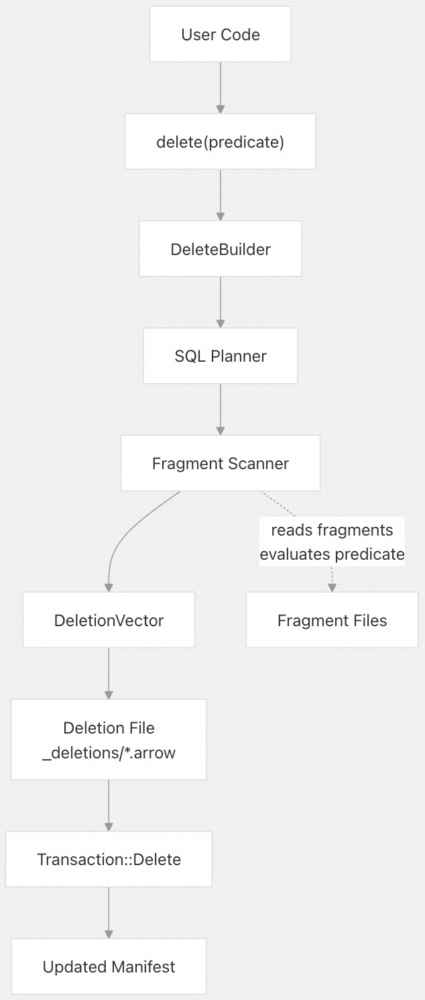
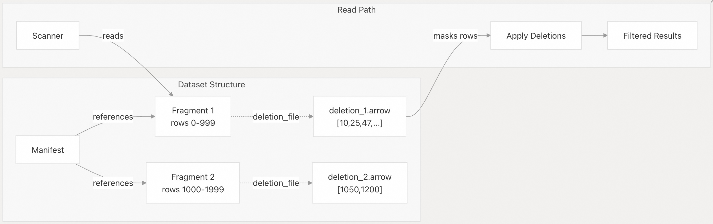
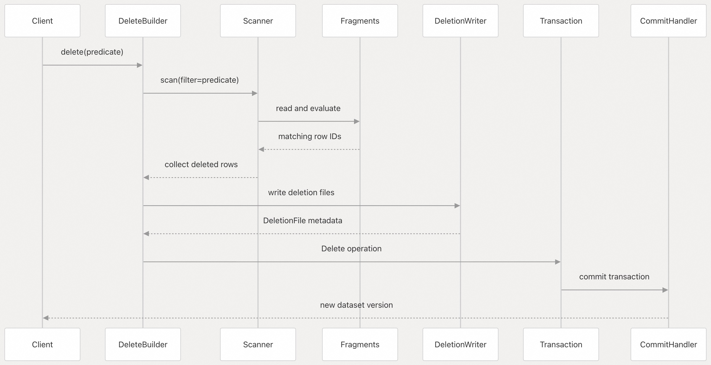
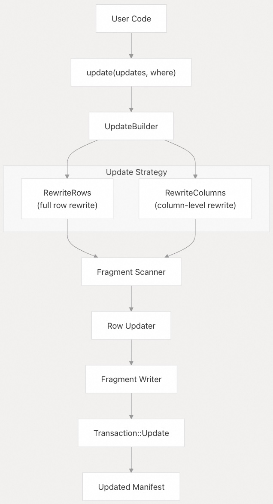
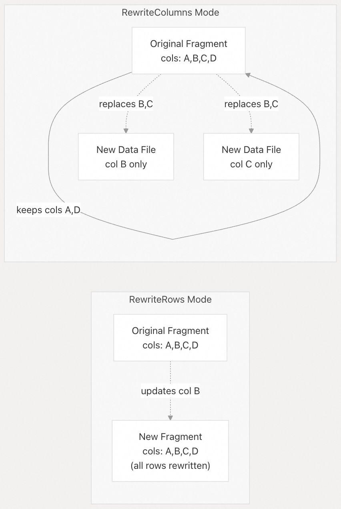
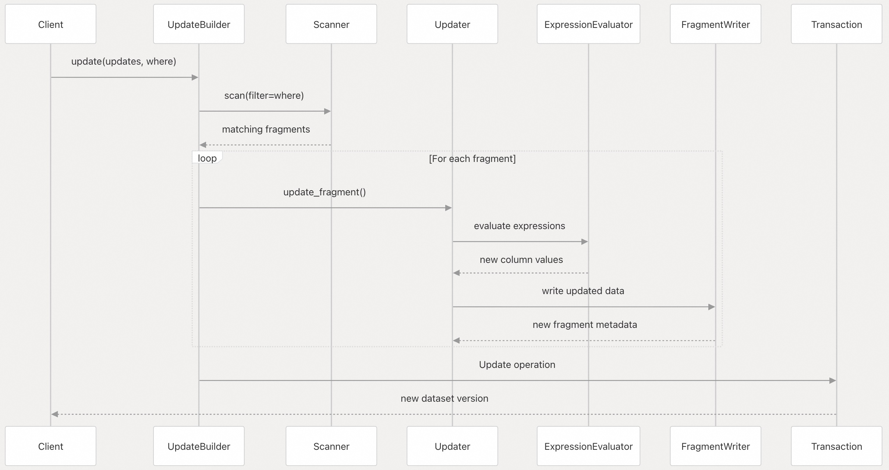
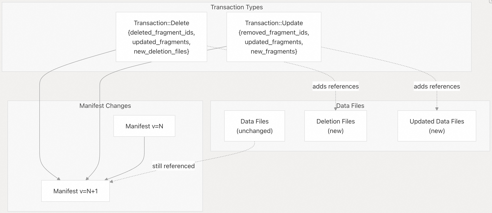

## Lance 源码学习: 5.2 更新和删除操作 (Update and Delete Operations)  
            
### 作者            
digoal            
            
### 日期            
2025-12-12            
            
### 标签            
Lance , AI 数据存储与搜索引擎 , 存储引擎 , 向量索引 , 标量索引 , 全文检索 , 多模态支持 , 零拷贝 , 版本控制 , 时间旅行 , 源码学习 , 随机访问加速 , Parquet            
            
----            
            
## 背景      
本文介绍了如何通过删除（Delete）和更新（Update）操作来修改 Lance 数据集中已有的数据。这些操作提供了高效的机制，可以在**不需要完全重写整个数据集**的情况下，移除行或修改列值。  
  
术语  
  
  * **ACID**: 原子性、一致性、隔离性、持久性  
  * **Predicate**: 谓词  
  * **Fragment**: 数据片段  
  * **Deletion Vector**: 删除向量  
  * **Compaction**: 数据压缩  
  * **RewriteRows**: 重写行  
  * **RewriteColumns**: 重写列  
  * **Manifest**: 清单文件  
  
  
Lance 提供了两种主要的操作来修改现有数据：  
  
| 操作 | 目的 | 机制 |  
| :--- | :--- | :--- |  
| **删除 (Delete)** | 移除匹配 **谓词 (Predicate)** 的行 | 创建删除文件（deletion files）来跟踪已删除的行 ID |  
| **更新 (Update)** | 修改匹配行的列值 | 使用更新后的数据重写受影响的**数据片段 (Fragment)** |  
  
这两个操作都是事务性的（transactional），并通过冲突解决系统支持乐观并发（optimistic concurrency）。如果检测到并发修改，它们可以自动重试。  
  
**关键特性：**  
  
  * **基于谓词 (Predicate-based)** ：两个操作都使用类似 SQL 的 **谓词 (Predicate)** 来选择行。  
  * **事务性 (Transactional)** ：更改是原子性的，并创建新的数据集版本。  
  * **非破坏性 (Non-destructive)** ：原始数据文件保持不变，直到进行 **数据压缩 (Compaction)** 。  
  * **索引感知 (Index-aware)** ：索引会更新以反映这些更改。  
  
来源: [`rust/lance/src/dataset.rs` 1-200](https://github.com/lance-format/lance/blob/0204e7e2/rust/lance/src/dataset.rs#L1-L200) [`python/python/lance/dataset.py` 1100-1300](https://github.com/lance-format/lance/blob/0204e7e2/python/python/lance/dataset.py#L1100-L1300)  
  
-----  
  
## 删除操作 (Delete Operations)  
  
### 删除 API  
  
删除操作根据 SQL **谓词 (Predicate)** 从数据集中移除行，但不会立即重写数据文件。相反，它会创建**删除文件 (deletion files)** 来跟踪哪些行已被逻辑删除。  
  
    
  
**Python API：**  
  
```python  
# Delete rows matching a predicate  
dataset = dataset.delete("price < 10.0")  
  
# Delete with conflict handling  
dataset = dataset.delete(  
    "status = 'inactive'",  
    conflict_retries=5,  
    retry_timeout=timedelta(seconds=60)  
)  
```  
  
**Rust API：**  
  
`DeleteBuilder` 提供了核心功能。  
  
```rust  
DeleteBuilder::new(dataset, predicate)  
    .execute()  
    .await?  
```  
  
来源: [`python/python/lance/dataset.py` 1100-1150](https://github.com/lance-format/lance/blob/0204e7e2/python/python/lance/dataset.py#L1100-L1150) [`python/src/dataset.rs` 1800-1850](https://github.com/lance-format/lance/blob/0204e7e2/python/src/dataset.rs#L1800-L1850) [`rust/lance/src/dataset/write/delete.rs`](https://github.com/lance-format/lance/blob/0204e7e2/rust/lance/src/dataset/write/delete.rs)  
  
### 删除向量和文件 (Deletion Vectors and Files)  
  
Lance 没有立即重写数据文件，而是使用 **删除向量 (Deletion Vector)** 来高效地跟踪已删除的行。这种方法提供了多项优势：  
  
| 方面 | 描述 |  
| :--- | :--- |  
| **存储** | 删除文件存储在 `_deletions/` 目录中 |  
| **格式** | Arrow 格式或 RoaringBitmap 格式 |  
| **粒度** | 按**数据片段 (Fragment)** 跟踪删除情况 |  
| **数据压缩 (Compaction)** | 物理移除发生在 **数据压缩 (Compaction)** 期间 |  
  
    
  
**删除文件结构：**  
  
删除文件是一个简单的包含行 ID 的 Arrow 文件：  
  
```  
_deletions/  
├── {fragment_id}-{uuid}.arrow    # Arrow 格式 (较新)  
└── {fragment_id}-{uuid}.bin      # RoaringBitmap 格式 (传统)  
```  
  
**内部表示：**  
  
  * `DeletionFile` 结构体跟踪文件路径和格式。  
  * `DeletionVector` 使用 `RoaringBitmap` 或 `RoaringTreemap` 提供内存中的表示。  
  * 删除文件在扫描期间按需读取，并与查询结果合并。  
  
来源: [`rust/lance/src/dataset/fragment.rs` 400-500](https://github.com/lance-format/lance/blob/0204e7e2/rust/lance/src/dataset/fragment.rs#L400-L500) [`lance-table/format.rs`](https://github.com/lance-format/lance/blob/0204e7e2/lance-table/format.rs) [`rust/lance/src/io/deletion.rs`](https://github.com/lance-format/lance/blob/0204e7e2/rust/lance/src/io/deletion.rs)  
  
### 删除操作执行流程  
  
    
  
**关键步骤：**  
  
1.  **解析谓词 (Parse Predicate)** ：SQL **谓词 (Predicate)** 被解析为 DataFusion 表达式。  
2.  **识别行 (Identify Rows)** ：扫描器（Scanner）评估所有**数据片段 (Fragment)** 上的 **谓词 (Predicate)** 以识别匹配的行。  
3.  **按数据片段分组 (Group by Fragment)** ：已删除的行按其来源**数据片段 (Fragment)** 分组。  
4.  **写入删除文件 (Write Deletion Files)** ：为每个受影响的**数据片段 (Fragment)** 写入一个包含已删除行 ID 的删除文件。  
5.  **创建事务 (Create Transaction)** ：创建一个带有删除文件引用的 `Transaction::Delete` 操作。  
6.  **提交 (Commit)** ：事务被提交，创建一个新的 **Manifest**（清单文件）版本。  
  
来源: [`rust/lance/src/dataset/write/delete.rs`](https://github.com/lance-format/lance/blob/0204e7e2/rust/lance/src/dataset/write/delete.rs) [`python/src/dataset.rs` 1800-1900](https://github.com/lance-format/lance/blob/0204e7e2/python/src/dataset.rs#L1800-L1900)  
  
-----  
  
## 更新操作 (Update Operations)  
  
### 更新 API  
  
更新操作会修改匹配 WHERE 子句的行的列值。与删除操作不同，更新操作需要重写受影响的数据，因为列值必须被更改。  
  
    
  
**Python API：**  
  
```python  
# Update with SQL expressions  
dataset = dataset.update(  
    updates={"price": "price * 1.1", "status": "'active'"},  
    where="category = 'electronics'"  
)  
  
# Update all rows in a column  
dataset = dataset.update(  
    updates={"last_modified": "current_timestamp()"}  
)  
```  
  
**Rust API：**  
  
```  
UpdateBuilder::new(dataset, updates)  
    .with_filter(predicate)  
    .execute()  
    .await?  
```  
  
来源: [`python/python/lance/dataset.py` 1150-1250](https://github.com/lance-format/lance/blob/0204e7e2/python/python/lance/dataset.py#L1150-L1250) [`python/src/dataset.rs` 1900-2000](https://github.com/lance-format/lance/blob/0204e7e2/python/src/dataset.rs#L1900-L2000) [`rust/lance/src/dataset/updater.rs`](https://github.com/lance-format/lance/blob/0204e7e2/rust/lance/src/dataset/updater.rs)  
  
### 行重写与列重写 (Row Rewriting vs Column Rewriting)  
  
Lance 根据更改的范围采用两种更新策略：  
  
    
  
| 策略 | 使用时机 | 特点 |  
| :--- | :--- | :--- |  
| **重写行 (RewriteRows)** | 更新许多列或大多数行时 | 用新数据重写整个**数据片段 (Fragment)** |  
| **重写列 (RewriteColumns)** | 更新少量列时 | 仅替换修改过的列，引用未更改的列 |  
  
该模式是根据更新范围和数据特性自动确定的。  
  
来源: [`rust/lance/src/dataset/updater.rs`](https://github.com/lance-format/lance/blob/0204e7e2/rust/lance/src/dataset/updater.rs) [`rust/lance/src/dataset/transaction.rs` 200-300](https://github.com/lance-format/lance/blob/0204e7e2/rust/lance/src/dataset/transaction.rs#L200-L300)  
  
### 更新操作执行流程  
  
    
  
**关键步骤：**  
  
1.  **解析更新 (Parse Updates)** ：更新表达式被解析（例如，`"price * 1.1"` → DataFusion 表达式）。  
2.  **过滤行 (Filter Rows)** ：WHERE 子句识别要更新的行。  
3.  **评估表达式 (Evaluate Expressions)** ：为每个匹配的行计算新值。  
4.  **重写数据 (Rewrite Data)** ：受影响的**数据片段 (Fragment)** 使用更新后的值进行重写。  
5.  **更新元数据 (Update Metadata)** ：**数据片段 (Fragment)** 元数据更新为新的文件路径和行计数。  
6.  **提交事务 (Commit Transaction)** ：一个 `Transaction::Update` 操作更新 **Manifest**（清单文件）。  
  
**表达式评估：**  
  
更新支持可以引用现有列值的 SQL 表达式：  
  
  * 简单值: `"'active'"` (字符串字面值)  
  * 计算: `"price * 1.1"` (算术运算)  
  * 函数: `"upper(name)"` (字符串函数)  
  * 条件: `"CASE WHEN x > 0 THEN x ELSE 0 END"`  
  
来源: [`rust/lance/src/dataset/updater.rs` 1-200](https://github.com/lance-format/lance/blob/0204e7e2/rust/lance/src/dataset/updater.rs#L1-L200) [`python/src/dataset.rs` 1900-2000](https://github.com/lance-format/lance/blob/0204e7e2/python/src/dataset.rs#L1900-L2000)  
  
-----  
  
## 事务集成 (Transaction Integration)  
  
删除和更新操作都作为事务实现，用于创建新的数据集版本。这确保了 **ACID** 属性并支持时间旅行。  
  
    
  
### 冲突检测与重试  
  
这两个操作都支持自动重试和冲突检测：  
  
| 场景 | 解决方案 |  
| :--- | :--- |  
| 并发删除相同的行 | 可重试 - 重新检查 **谓词 (Predicate)** |  
| 并发更新相同的行 | 可重试 - 重新应用更新 |  
| 并发删除 + 更新 | 可能冲突，取决于行的重叠情况 |  
| 并发模式更改 | 不兼容 - 失败 |  
  
冲突解决采用了"冲突解决"章节中描述的相同机制。  
  
来源: [`rust/lance/src/dataset/transaction.rs` 400-600](https://github.com/lance-format/lance/blob/0204e7e2/rust/lance/src/dataset/transaction.rs#L400-L600) [`rust/lance/src/io/commit.rs` 200-400](https://github.com/lance-format/lance/blob/0204e7e2/rust/lance/src/io/commit.rs#L200-L400)  
  
-----  
  
## 性能考量  
  
### 删除性能  
  
**删除向量 (Deletion Vector) 的优势：**  
  
  * **快速**：无需立即重写数据。  
  * **空间效率高**：删除文件非常小（通常小于数据大小的 1%）。  
  * **索引友好**：索引保持有效并高效更新。  
  
**注意事项：**  
  
  * 已删除的行在进行 **数据压缩 (Compaction)** 之前仍占用存储空间。  
  * 由于每次读取都需要检查删除文件，读取性能会略有下降。  
  * 定期使用数据压缩(data compaction)来回收空间并提高读取性能。  
  
```  
# Check dataset stats to see deletion overhead  
stats = dataset.stats.dataset_stats()  
deletion_file_size = stats["deletion_file_size_bytes"]  
  
# Compact to remove deleted rows physically  
dataset.optimize.compact_files()  
```  
  
### 更新性能  
  
**性能因素：**  
  
| 因素 | 影响 |  
| :--- | :--- |  
| **更新选择性 (Update selectivity)** | 更新的行越少 = 越快 |  
| **列计数 (Column count)** | 使用 **重写列 (RewriteColumns)** 更新较少的列速度更快 |  
| **数据片段大小 (Fragment size)** | **数据片段 (Fragment)** 越小 = 更新粒度越细 |  
| **索引存在性 (Index presence)** | 索引必须更新，会增加开销 |  
  
**优化策略：**  
  
1.  **批量更新 (Batch Updates)** ：将多次更新分组为一个操作。  
2.  **使用过滤器 (Use Filters)** ：缩小 WHERE 子句范围可减少工作量。  
3.  **考虑合并插入 (Consider Merge Insert)** ：对于大规模更新，合并插入操作可能更高效。  
4.  **分区策略 (Partition Strategy)** ：在单个分区内的更新速度更快。  
  
来源: [`rust/lance/src/dataset/write/delete.rs` 1-100](https://github.com/lance-format/lance/blob/0204e7e2/rust/lance/src/dataset/write/delete.rs#L1-L100) [`rust/lance/src/dataset/updater.rs` 1-150](https://github.com/lance-format/lance/blob/0204e7e2/rust/lance/src/dataset/updater.rs#L1-L150)  
  
-----  
  
## 高级模式  
  
### 条件删除 (Conditional Delete)  
  
使用 SQL 表达式进行复杂**谓词 (Predicate)** 的删除操作：  
  
```python  
# Delete old records  
dataset = dataset.delete("created_at < current_date() - interval '90 days'")  
  
# Delete based on multiple conditions  
dataset = dataset.delete("status = 'inactive' AND last_login < '2023-01-01'")  
```  
  
### 条件更新 (Conditional Update)  
  
具有复杂逻辑的更新操作：  
  
```python  
# Conditional value assignment  
dataset = dataset.update(  
    updates={  
        "price": "CASE WHEN category = 'premium' THEN price * 1.2 ELSE price * 1.05 END",  
        "discount": "CASE WHEN quantity > 100 THEN 0.15 ELSE 0.10 END"  
    },  
    where="in_stock = true"  
)  
```  
  
### 软删除模式 (Soft Delete Pattern)  
  
使用更新操作而非硬删除来实现软删除：  
  
```python  
# Mark as deleted  
dataset = dataset.update(  
    updates={"deleted_at": "current_timestamp()", "active": "false"},  
    where="id IN (1, 2, 3)"  
)  
  
# Later, physically delete  
dataset = dataset.delete("deleted_at IS NOT NULL AND deleted_at < current_date() - interval '30 days'")  
```  
  
来源: [`python/python/tests/test_dataset.py` 2000-2200](https://github.com/lance-format/lance/blob/0204e7e2/python/python/tests/test_dataset.py#L2000-L2200) [`rust/lance/src/dataset/scanner.rs` 230-260](https://github.com/lance-format/lance/blob/0204e7e2/rust/lance/src/dataset/scanner.rs#L230-L260)  
  
-----  
  
## 实现细节  
  
### 删除实现  
  
删除操作遵循以下代码路径：  
  
1.  **DeleteBuilder** [`rust/lance/src/dataset/write/delete.rs`](https://github.com/lance-format/lance/blob/0204e7e2/rust/lance/src/dataset/write/delete.rs) 创建操作。  
2.  **Scanner** 评估 **谓词 (Predicate)** 以识别匹配的行。  
3.  **删除向量 (Deletion Vector)** 收集每个**数据片段 (Fragment)** 的行 ID。  
4.  **write\_deletion\_file()** 将 Arrow 或位图文件写入 `_deletions/` 目录。  
5.  **Transaction** 使用 `Operation::Delete` 封装更改。  
6.  **CommitHandler** 提交新的 **Manifest**（清单文件）版本。  
  
### 更新实现  
  
更新操作遵循以下代码路径：  
  
1.  **UpdateBuilder** [`rust/lance/src/dataset/updater.rs`](https://github.com/lance-format/lance/blob/0204e7e2/rust/lance/src/dataset/updater.rs) 协调更新。  
2.  **DataFusion 表达式** 从 SQL 字符串中解析。  
3.  **Scanner** 识别匹配 WHERE 子句的行。  
4.  **Updater::update()** 评估表达式并重写**数据片段 (Fragment)** 。  
5.  **Transaction** 使用包含 `UpdateMode` (**RewriteRows** 或 **RewriteColumns**) 的 `Operation::Update` 封装更改。  
6.  **CommitHandler** 提交新的 **Manifest**（清单文件）版本。  
  
### 数据片段更新  
  
当**数据片段 (Fragment)** 更新时，**Manifest**（清单文件）会跟踪：  
  
  * **已移除的数据片段 (Removed fragments)** ：逻辑上移除的旧**数据片段 (Fragment)** ID。  
  * **新的数据片段 (New fragments)** ：包含更新数据的新的**数据片段 (Fragment)** ID。  
  * **删除文件 (Deletion files)** ：对于删除操作，引用删除文件。  
  
旧的数据文件会保留，直到清理程序运行，这使得时间旅行到以前的版本成为可能。  
  
来源: [`rust/lance/src/dataset.rs` 1500-1700](https://github.com/lance-format/lance/blob/0204e7e2/rust/lance/src/dataset.rs#L1500-L1700) [`rust/lance/src/dataset/transaction.rs` 1-300](https://github.com/lance-format/lance/blob/0204e7e2/rust/lance/src/dataset/transaction.rs#L1-L300) [`python/src/dataset.rs` 1800-2100](https://github.com/lance-format/lance/blob/0204e7e2/python/src/dataset.rs#L1800-L2100)  
  
-----  
  
# 附录1: 数据维护与成本问题：如何高效管理删除操作带来的存储开销和读取性能衰减？  
  
从**架构师和运维人员**的角度来看，这是最关键的日常维护痛点。  
  
* **痛点背景：** 文档提到删除操作是逻辑删除，通过创建 **删除向量 (Deletion Vector)** 来跟踪已删除的行。这意味着被删除的数据行在进行 **数据压缩 (Compaction)** 之前，仍然占用存储空间，并且在每次读取时需要额外检查删除文件，导致读取性能略微下降。  
* **关键问题：**  
    * 长期来看，如何量化和监控 **删除向量 (Deletion Vector)** 积累对存储成本和查询延迟的具体影响？  
    * Lance 推荐的 **数据压缩 (Compaction)** 策略是什么（例如，基于删除行比例或时间间隔）？在执行 **数据压缩 (Compaction)** 后，旧版本的数据文件和索引是否会被立即安全地移除和清理？  
  
## 回答  
  
## 删除向量管理策略概览  
  
Lance 使用逻辑删除机制，通过删除向量（Deletion Vector）跟踪已删除行，直到执行数据压缩（Compaction）才物理删除数据  。  
  
  
## 监控删除向量影响  
  
### 存储成本量化  
删除向量以两种格式存储：稀疏删除使用 Arrow IPC 格式（`.arrow` 扩展名），密集删除使用 Roaring Bitmap 格式（`.bin` 扩展名）  。每个片段最多有一个删除文件  。  
  
### 查询性能监控  
压缩操作返回 `CompactionMetrics`，包含删除的文件数和片段数等指标  。这些指标可用于跟踪删除向量对性能的影响。  
  
  
## 推荐的压缩策略  
  
### 基于删除行比例的策略  
Lance 默认使用 `materialize_deletions_threshold: 0.1`（10%），当片段中删除行比例超过此阈值时触发压缩  。  
  
```python  
# Python API 示例  
ds.optimizer.compact_files(  
    materialize_deletions=True,  
    materialize_deletions_threshold=0.1  # 10% 阈值  
)  
```    
  
### 压缩选项配置  
完整的压缩选项包括：  
- `target_rows_per_fragment`: 目标每片段行数（默认 1024*1024）  
- `materialize_deletions`: 是否物化删除（默认 True）  
- `materialize_deletions_threshold`: 删除比例阈值（默认 0.1）  
- `num_threads`: 并行线程数    
  
  
## 旧文件清理机制  
  
### 清理策略  
压缩后，旧文件通过 `cleanup_old_versions()` 清理。清理策略保守处理：  
- 旧清单文件：超过阈值且非最新版本则删除  
- 未引用的数据文件：不被任何有效清单引用则删除  
- 未引用的删除文件：不被任何片段引用则删除  
- 未引用的索引文件：不被任何有效清单引用则删除    
  
### 安全保障  
为避免删除正在进行的操作文件，系统采用双重保护：  
1. 如果文件被至少一个清单引用（即使是旧清单），则假设不是进行中的操作  
2. 如果文件未被任何清单引用且创建时间超过 7 天，才删除    
  
### 标签保护  
带标签的版本受 `cleanup_old_versions()` 保护，必须先删除标签才能清理对应版本  。  
  
  
## 实践建议  
  
1. **定期监控**：使用 `CompactionMetrics` 跟踪删除文件积累情况  
2. **阈值调优**：根据工作负载调整 `materialize_deletions_threshold`  
3. **定时压缩**：建议在低峰期执行压缩操作  
4. **版本管理**：使用标签保护重要版本，避免误清理  
  
## Notes  
  
- 删除向量的读取通过 `read_dataset_deletion_file` 函数实现，支持缓存机制    
- 压缩过程中会重建索引以确保查询正确性    
- Java 和 Python API 提供相同的压缩功能，测试用例展示了跨语言的一致性    
  
  
  
  
  
-----  
  
# 附录2: 更新操作的性能优化与 I/O 成本：何时以及如何触发行/列重写策略？  
  
从**开发者和性能工程师**的角度来看，理解更新操作的内在机制对于优化至关重要。  
  
* **细节背景：** 更新操作需要重写数据，并根据更改范围自动选择 **重写行 (RewriteRows)** 或 **重写列 (RewriteColumns)** 策略。其中 **RewriteRows** 可能会重写**整个数据片段 (Fragment)** 。  
* **关键问题：**  
    * Lance 自动判断触发 **重写行 (RewriteRows)** （重写整个 Fragment）和 **重写列 (RewriteColumns)** （仅替换修改列）的具体阈值或逻辑是什么？   
    * 对于大型**数据片段 (Fragment)** ，选择 **RewriteRows** 的性能（I/O 吞吐量和延迟）成本比 **RewriteColumns** 高多少？开发者或用户是否有 API 可以手动指定或倾向于某种重写模式，以牺牲便利性换取精确的性能控制？  
  
## 回答  
  
## 更新操作的重写策略  
  
Lance 的更新操作支持两种重写策略：`RewriteRows` 和 `RewriteColumns`。这些策略的选择不是基于自动阈值判断，而是由具体的操作类型和 API 调用明确指定的。  
  
### 策略定义与使用场景  
  
在 `UpdateMode` 枚举中，两种策略的定义和使用场景如下  ：  
  
- **RewriteRows**: 当大多数列需要重写或只有少量行更新时最优。行在当前片段中被删除并在新片段中重写。  
- **RewriteColumns**: 当大多数行受影响但只有少量列受影响时最优。在每个片段内，列被完全重写并插入为新的数据文件，旧版本的列被标记为删除。  
  
### 触发逻辑  
  
Lance **没有自动阈值判断**来选择策略。策略的选择是显式的：  
  
1. **更新操作（Update）** ：在 `rust/lance/src/dataset/write/update.rs` 中，更新操作默认使用 `RewriteRows` 模式  。  
  
2. **列更新操作**：在 `rust/lance/src/dataset/fragment.rs` 的测试中，列更新使用 `RewriteColumns` 模式  。  
  
3. **Merge Insert 操作**：同样使用 `RewriteRows` 模式  。  
  
### API 控制  
  
开发者可以通过 API 明确指定重写模式：  
  
**Python API**：  
```python  
op = lance.LanceOperation.Update(  
    updated_fragments=[updated_fragment],  
    fields_modified=fields_modified,  
    update_mode="rewrite_columns"  # 或 "rewrite_rows"  
)  
```  
Python 的 `LanceOperation.Update` 类支持 `update_mode` 参数  。  
  
**Rust API**：  
在创建 `Operation::Update` 时，可以指定 `update_mode` 字段  。  
  
**Java API**：  
Java 绑定也暴露了 `UpdateMode` 枚举  。  
  
### 性能考虑  
  
- **RewriteRows** 可能需要重写整个片段，对于大型片段会产生较高的 I/O 成本  
- **RewriteColumns** 只重写修改的列，在列数较少时更高效  
  
由于策略选择是显式的而非自动的，开发者需要根据具体场景（更新的行数、列数、片段大小）来选择合适的策略以优化性能。  
  
## Notes  
  
- 协议缓冲区定义中也包含了这两种模式    
- 在分布式写入文档中展示了如何使用 `update_columns` 方法进行列级更新    
- 没有发现基于阈值的自动策略选择逻辑，所有策略选择都是显式指定的  
  
  
  
  
  
-----  
  
# 附录3: 并发安全与事务细节：冲突检测机制的深层原理是什么？  
  
从**开发者和系统设计者**的角度来看，系统在并发写入环境下的安全性和鲁棒性是核心。  
  
* **背景知识：** 文档强调删除和更新操作是事务性的，支持乐观并发和自动重试，但对于冲突检测的细节描述较少。  
* **关键问题：**  
    * 在并发的 Update/Delete 场景中，事务如何精确地确定发生了冲突？特别是对于删除操作的重试， **“重新检查谓词（recheck predicate）”** 的具体实现细节是什么？它是重新扫描所有**数据片段 (Fragment)** 还是只检查版本 **Manifest**（清单文件）的元数据？  
  
## 回答  
  
## 冲突检测机制的核心原理  
  
Lance 的并发冲突检测基于**片段级和行级双重跟踪**机制，而不是重新执行谓词扫描。    
  
### 冲突检测的两个层次  
  
1. **片段级冲突检测**：事务跟踪修改的片段 ID 集合  
   - 在 `TransactionRebase::try_new` 中初始化 `modified_fragment_ids`    
   - 不同操作类型有不同的兼容性规则    
  
2. **行级冲突检测**：通过 `RowIdTreeMap` 跟踪具体受影响的行  
   - 删除操作在首次执行时扫描并捕获所有要删除的行 ID    
   - 这些行 ID 在事务重试时用于检测行级冲突    
  
### 删除操作的重试机制  
  
删除操作的"重新检查谓词"**不是重新扫描数据**，而是：  
  
1. **初始扫描阶段**：执行谓词并捕获受影响的行 ID  
   ```rust  
   // 在 execute_impl 中扫描并收集行地址  
   let removed_row_addrs = removed_row_ids.row_addrs(row_id_index.as_deref());  
   let affected_rows = RowIdTreeMap::from(removed_row_addrs.as_ref().clone());  
   ```    
  
2. **冲突解决阶段**：检查行级冲突并合并删除向量  
   - 读取现有的删除文件    
   - 检查是否有行重叠    
   - 如果无冲突，合并删除向量并写入新文件    
  
### 冲突检测的具体实现  
  
在 `check_delete_txn` 和 `check_update_txn` 中：  
- 首先检查片段级冲突（是否修改相同的片段）    
- 如果有 `affected_rows`，则进行行级冲突检测    
- 只有当数据文件未修改时（仅删除文件修改），才能进行重试    
  
## 关键设计决策  
  
1. **避免重复扫描**：谓词只在首次执行时扫描，重试时使用捕获的行 ID  
2. **乐观并发控制**：假设冲突很少，通过重试机制处理  
3. **细粒度冲突检测**：片段级快速检查 + 行级精确检测  
  
这种设计确保了高并发环境下的性能，同时保证了数据一致性。  
  
## Notes  
  
- 冲突检测不涉及重新扫描数据片段，而是基于元数据和行 ID 跟踪  
- `RowIdTreeMap` 是行级冲突检测的核心数据结构  
- 只有当两个事务修改相同的行时才会发生真正的冲突，修改不同片段的操作可以并发执行  
  
    
#### [PolarDB 学习图谱](https://www.aliyun.com/database/openpolardb/activity "8642f60e04ed0c814bf9cb9677976bd4")
  
  
#### [PostgreSQL 解决方案集合](../201706/20170601_02.md "40cff096e9ed7122c512b35d8561d9c8")
  
  
#### [德哥 / digoal's Github - 公益是一辈子的事.](https://github.com/digoal/blog/blob/master/README.md "22709685feb7cab07d30f30387f0a9ae")
  
  
#### [About 德哥](https://github.com/digoal/blog/blob/master/me/readme.md "a37735981e7704886ffd590565582dd0")
  
  

  
