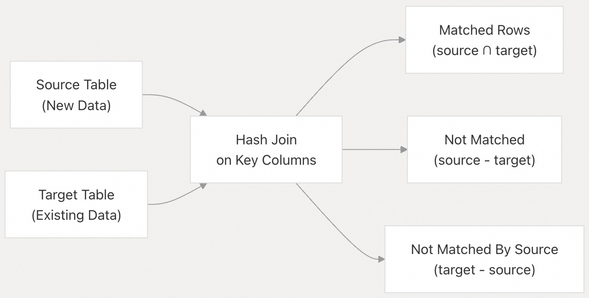
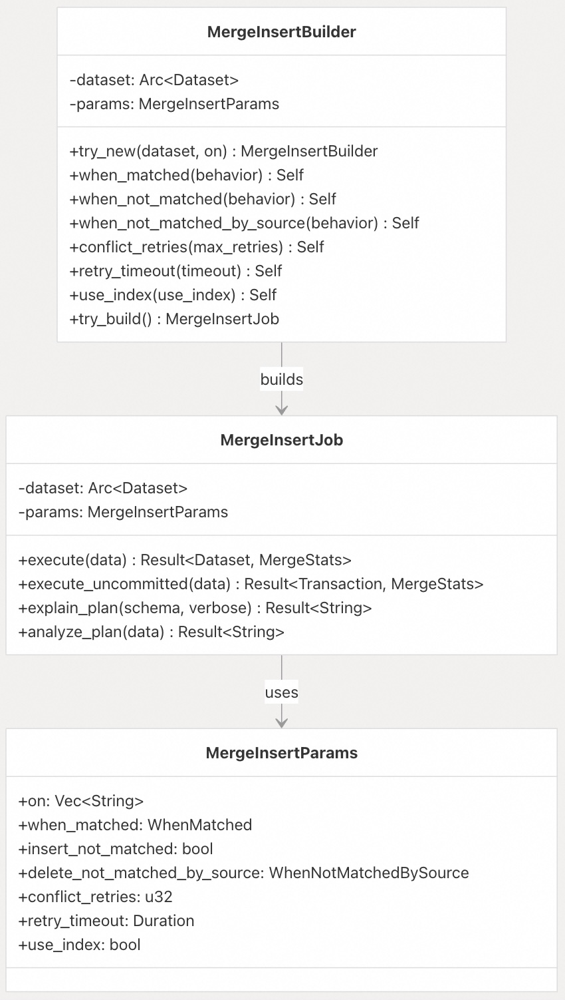
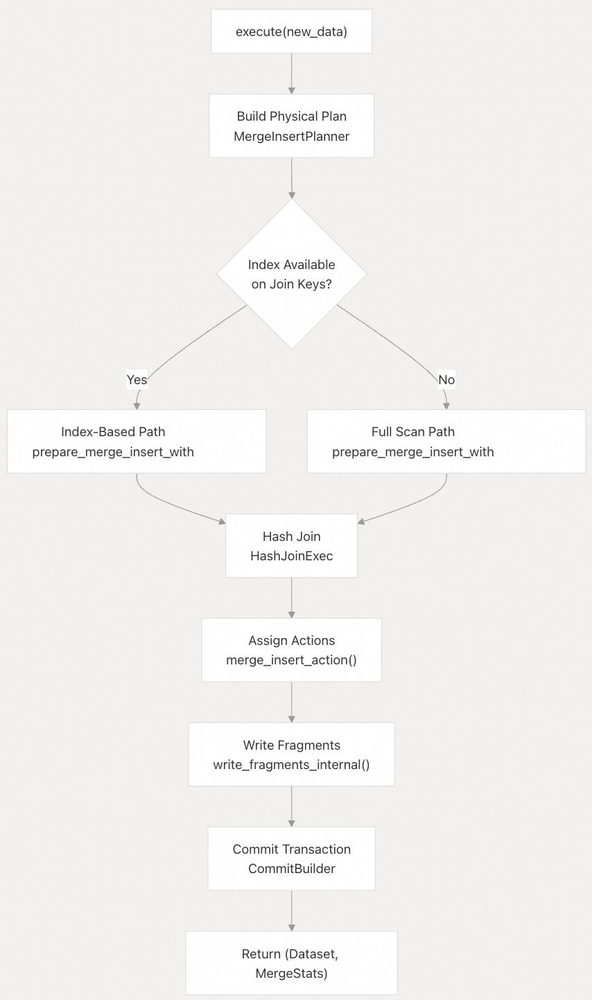
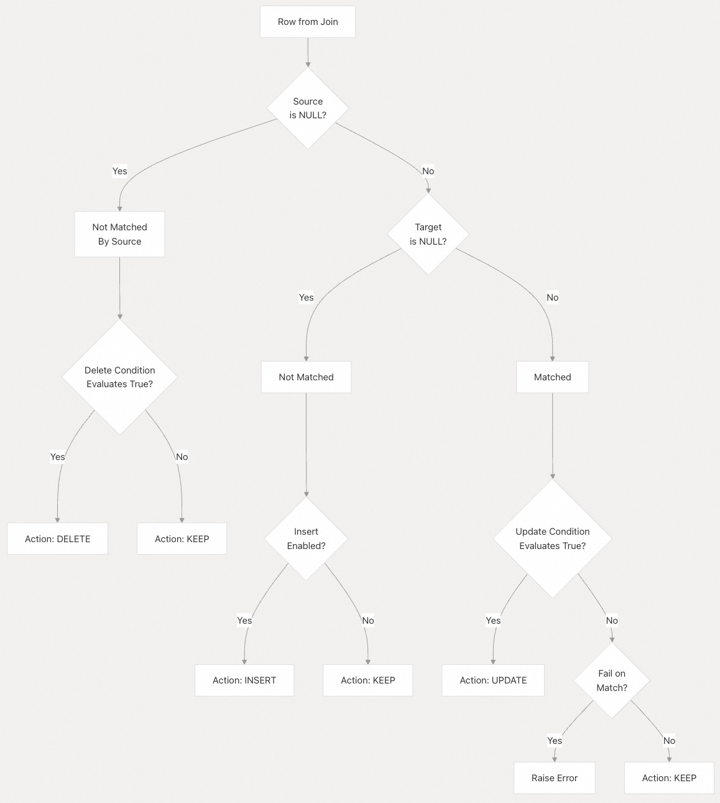
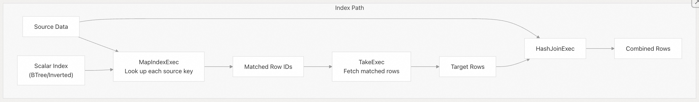
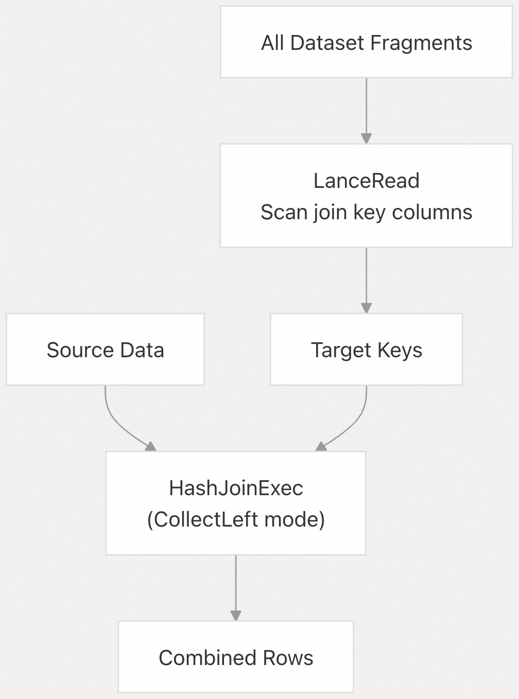
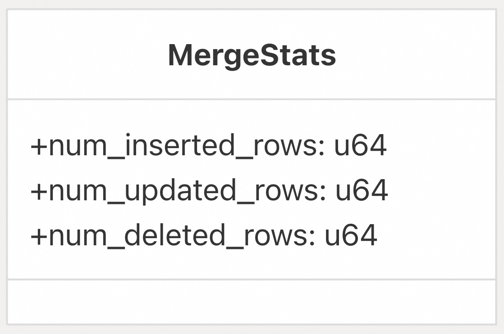

## Lance 源码学习: 5.3 Merge Insert Operations（合并插入操作）  
              
### 作者              
digoal              
              
### 日期              
2025-12-12              
              
### 标签              
Lance , AI 数据存储与搜索引擎 , 存储引擎 , 向量索引 , 标量索引 , 全文检索 , 多模态支持 , 零拷贝 , 版本控制 , 时间旅行 , 源码学习 , 随机访问加速 , Parquet              
              
----              
              
## 背景        
**Merge Insert**（合并插入）操作提供了类似 SQL MERGE 的功能，用于批量 **upsert**（更新或插入）、查找或创建（find-or-create）以及条件更新操作。本页涵盖了 Merge Insert API、执行策略和事务语义。  
  
## Overview (概述)  
  
Merge Insert 操作根据匹配的**键列**（key columns），将源表（新数据）中的数据与目标表（现有数据集）中的数据结合起来。该操作支持三种可配置的行为：  
  
  * **When matched**（匹配时）：当源行匹配目标行时执行的操作（更新、忽略或失败）。  
  * **When not matched**（不匹配时）：当源行在目标中没有匹配项时执行的操作（插入或忽略）。  
  * **When not matched by source**（源未匹配时）：当目标行在源中没有匹配项时执行的操作（保留或删除）。  
  
这使得以下用例成为可能：  
  
  * **Upsert**：插入新行并更新现有行。  
  * **Find-or-create**：仅插入新行，保持现有行不变。  
  * **Replace region**：用新数据替换所有匹配特定条件的数据。  
  
**来源:**  
[`rust/lance/src/dataset/write/merge_insert.rs` 1-352](https://github.com/lance-format/lance/blob/0204e7e2/rust/lance/src/dataset/write/merge_insert.rsL1-L352)  
[`python/python/lance/dataset.py` 92-245](https://github.com/lance-format/lance/blob/0204e7e2/python/python/lance/dataset.pyL92-L245)  
  
## Core Concepts (核心概念)  
  
### Match Conditions (匹配条件)  
  
Merge Insert 操作要求至少有一个**键列**（key column，`on` 参数）来确定源行是否匹配目标行。当源和目标中所有键列的值都相同时，行被视为匹配。  
  
    
  
**来源:**  
[`rust/lance/src/dataset/write/merge_insert.rs` 14-17](https://github.com/lance-format/lance/blob/0204e7e2/rust/lance/src/dataset/write/merge_insert.rsL14-L17)  
[`rust/lance/src/dataset/write/merge_insert.rs` 369-390](https://github.com/lance-format/lance/blob/0204e7e2/rust/lance/src/dataset/write/merge_insert.rsL369-L390)  
  
### Match Behavior Enums (匹配行为枚举)  
  
#### WhenMatched (匹配时的行为)  
  
控制源和目标中都存在的行的行为：  
  
| Variant (变体) | Behavior (行为) | Use Case (用例) |  
| :--- | :--- | :--- |  
| `UpdateAll` | 删除旧行，插入新行 | 标准 **upsert** |  
| `DoNothing` | 保持现有行不变 | **Find-or-create** |  
| `UpdateIf(expr)` | 仅当条件为真时更新 | 条件更新 |  
| `Fail` | 如果找到任何匹配项则中止操作 | 防止覆盖 |  
  
**来源:**  
[`rust/lance/src/dataset/write/merge_insert.rs` 241-266](https://github.com/lance-format/lance/blob/0204e7e2/rust/lance/src/dataset/write/merge_insert.rsL241-L266)  
[`python/python/lance/dataset.py` 141-173](https://github.com/lance-format/lance/blob/0204e7e2/python/python/lance/dataset.pyL141-L173)  
  
#### WhenNotMatched (不匹配时的行为)  
  
控制仅存在于源中的行的行为：  
  
| Variant (变体) | Behavior (行为) | Use Case (用例) |  
| :--- | :--- | :--- |  
| `InsertAll` | 插入新行 | **Upsert**，**find-or-create** |  
| `DoNothing` | 忽略新行 | 仅更新操作 |  
  
**来源:**  
[`rust/lance/src/dataset/write/merge_insert.rs` 268-279](https://github.com/lance-format/lance/blob/0204e7e2/rust/lance/src/dataset/write/merge_insert.rsL268-L279)  
[`python/python/lance/dataset.py` 175-183](https://github.com/lance-format/lance/blob/0204e7e2/python/python/lance/dataset.pyL175-L183)  
  
#### WhenNotMatchedBySource (源未匹配时的行为)  
  
控制仅存在于目标中的行的行为：  
  
| Variant (变体) | Behavior (行为) | Use Case (用例) |  
| :--- | :--- | :--- |  
| `Keep` | 保持行不变 | 标准 **upsert** |  
| `Delete` | 删除该行 | 完全替换 |  
| `DeleteIf(expr)` | 如果条件为真则删除 | 替换数据区域 |  
  
**来源:**  
[`rust/lance/src/dataset/write/merge_insert.rs` 200-239](https://github.com/lance-format/lance/blob/0204e7e2/rust/lance/src/dataset/write/merge_insert.rsL200-L239)  
[`python/python/lance/dataset.py` 185-197](https://github.com/lance-format/lance/blob/0204e7e2/python/python/lance/dataset.pyL185-L197)  
  
## Builder API (构建器 API)  
  
### MergeInsertBuilder  
  
`MergeInsertBuilder` 类使用**流式构建器模式**（fluent builder pattern）构造 **Merge Insert** 操作。  
  
    
  
**来源:**  
[`rust/lance/src/dataset/write/merge_insert.rs` 354-449](https://github.com/lance-format/lance/blob/0204e7e2/rust/lance/src/dataset/write/merge_insert.rsL354-L449)  
[`python/src/dataset.rs` 124-315](https://github.com/lance-format/lance/blob/0204e7e2/python/src/dataset.rsL124-L315)  
  
### Python API  
  
Python 的 `MergeInsertBuilder` 提供了用户友好的界面：  
  
```python  
# Basic usage  
builder = dataset.merge_insert("key_column")  
builder = builder.when_matched_update_all()  
builder = builder.when_not_matched_insert_all()  
stats = builder.execute(new_data)  
  
# With conditional logic  
builder = dataset.merge_insert("id")  
builder = builder.when_matched_update_all("source.timestamp > target.timestamp")  
builder = builder.when_not_matched_by_source_delete("category = 'obsolete'")  
stats = builder.execute(new_data)  
```  
  
**来源:**  
[`python/python/lance/dataset.py` 92-314](https://github.com/lance-format/lance/blob/0204e7e2/python/python/lance/dataset.pyL92-L314)  
[`python/src/dataset.rs` 124-301](https://github.com/lance-format/lance/blob/0204e7e2/python/src/dataset.rsL124-L301)  
  
### Configuration Methods (配置方法)  
  
#### conflict\_retries  
  
设置发生**提交冲突**（commit conflict）时的重试次数（默认值：10）：  
  
```  
builder.conflict_retries(max_retries=20)  
```  
  
**来源:**  
[`python/python/lance/dataset.py` 199-209](https://github.com/lance-format/lance/blob/0204e7e2/python/python/lance/dataset.pyL199-L209)  
[`rust/lance/src/dataset/write/merge_insert.rs` 384](https://github.com/lance-format/lance/blob/0204e7e2/rust/lance/src/dataset/write/merge_insert.rsL384-L384)  
  
#### retry\_timeout  
  
设置用于重试的最大时间（默认值：30 秒）：  
  
```  
builder.retry_timeout(timedelta(seconds=60))  
```  
  
**来源:**  
[`python/python/lance/dataset.py` 211-223](https://github.com/lance-format/lance/blob/0204e7e2/python/python/lance/dataset.pyL211-L223)  
[`rust/lance/src/dataset/write/merge_insert.rs` 385](https://github.com/lance-format/lance/blob/0204e7e2/rust/lance/src/dataset/write/merge_insert.rsL385-L385)  
  
#### use\_index  
  
控制是否为合并操作使用**标量索引**（scalar indices）（默认值：True）：  
  
```  
builder.use_index(False)  # Force full table scan  
```  
  
**来源:**  
[`python/python/lance/dataset.py` 225-244](https://github.com/lance-format/lance/blob/0204e7e2/python/python/lance/dataset.pyL225-L244)  
[`rust/lance/src/dataset/write/merge_insert.rs` 303](https://github.com/lance-format/lance/blob/0204e7e2/rust/lance/src/dataset/write/merge_insert.rsL303-L303)  
  
## Execution Flow (执行流程)  
  
### Overview (概述)  
  
Merge Insert 执行流程经过以下几个阶段：  
  
    
  
**来源:**  
[`rust/lance/src/dataset/write/merge_insert.rs` 489-612](https://github.com/lance-format/lance/blob/0204e7e2/rust/lance/src/dataset/write/merge_insert.rsL489-L612)  
  
### Stage 1: Plan Construction (阶段 1：计划构建)  
  
`MergeInsertPlanner` 为操作创建一个 **DataFusion 物理计划**（physical plan）：  
  
**关键组件：**  
  
  * `MergeInsertPlanner::create_plan()` - 计划（planning）的主要入口点  
  * `prepare_merge_insert_with_index()` - 基于索引的执行路径  
  * `prepare_merge_insert_without_index()` - 全扫描（Full scan）执行路径  
  * `HashJoinExec` - 执行源和目标之间的实际连接（join）  
  
**来源:**  
[`rust/lance/src/dataset/write/merge_insert/logical_plan.rs` 1-500](https://github.com/lance-format/lance/blob/0204e7e2/rust/lance/src/dataset/write/merge_insert/logical_plan.rsL1-L500)  
[`rust/lance/src/dataset/write/merge_insert.rs` 489-612](https://github.com/lance-format/lance/blob/0204e7e2/rust/lance/src/dataset/write/merge_insert.rsL489-L612)  
  
### Stage 2: Join Execution (阶段 2：连接执行)  
  
连接（join）产生一个组合**模式**（schema），其中每行包含源列和目标列：  
  
**组合批次结构：**  
  
```  
[source_col1, source_col2, ..., target_col1, target_col2, ..., target_rowid]  
```  
  
`unzip_batch()` 函数将此结构重新组织成一个嵌套结构，用于条件评估：  
  
```  
struct {  
  source: struct { col1, col2, ... },  
  target: struct { col1, col2, ... }  
}  
```  
  
**来源:**  
[`rust/lance/src/dataset/write/merge_insert.rs` 115-147](https://github.com/lance-format/lance/blob/0204e7e2/rust/lance/src/dataset/write/merge_insert.rsL115-L147)  
  
### Stage 3: Action Assignment (阶段 3：动作分配)  
  
`merge_insert_action()` 函数确定对每一行要采取的**动作**（action）：  
  
    
  
**来源:**  
[`rust/lance/src/dataset/write/merge_insert/assign_action.rs` 1-200](https://github.com/lance-format/lance/blob/0204e7e2/rust/lance/src/dataset/write/merge_insert/assign_action.rsL1-L200)  
  
### Stage 4: Write Execution (阶段 4：写入执行)  
  
操作按动作（action）拆分行并进行处理：  
  
**删除动作：**  
  
  * 标记为删除的行被收集到一个 `RowIdTreeMap` 中。  
  * **删除向量**（Deletion vectors）被写入**片段元数据**（fragment metadata）。  
  
**插入动作：**  
  
  * 新行使用 `write_fragments_internal()` 作为新**片段**（fragments）写入。  
  
**更新动作：**  
  
  * 被视为删除 + 插入。  
  * 旧行被标记为已删除，新行被写入。  
  
**来源:**  
[`rust/lance/src/dataset/write/merge_insert.rs` 678-898](https://github.com/lance-format/lance/blob/0204e7e2/rust/lance/src/dataset/write/merge_insert.rsL678-L898)  
  
## Index Utilization (索引利用)  
  
### Index-Based Execution (基于索引的执行)  
  
当连接键列上存在**标量索引**（scalar index）时，操作可以使用优化路径：  
  
    
  
**优势：**  
  
  * 避免扫描所有**片段**（fragments）。  
  * 当源相对于目标较小时，减少 I/O。  
  * 对**高选择性**（high-selectivity）的合并尤其有效。  
  
**支持的索引类型：**  
  
  * **标量列**（scalar columns）上的 **BTree 索引**（BTree indices）。  
  * **字符串列**（string columns）上的**倒排索引**（Inverted indices）。  
  
**来源:**  
[`rust/lance/src/dataset/write/merge_insert/logical_plan.rs` 200-350](https://github.com/lance-format/lance/blob/0204e7e2/rust/lance/src/dataset/write/merge_insert/logical_plan.rsL200-L350)  
[`rust/lance/src/io/exec/scalar_index.rs` 1-500](https://github.com/lance-format/lance/blob/0204e7e2/rust/lance/src/io/exec/scalar_index.rsL1-L500)  
  
### Full Scan Path (全扫描路径)  
  
当不存在合适的索引时，操作将扫描所有**片段**（fragments）：  
  
    
  
**特点：**  
  
  * 源表在**哈希连接**（hash join）期间被收集到内存中（连接的左侧）。  
  * 目标表以**流式**（streamed）方式处理（连接的右侧）。  
  * 使用 `PartitionMode::CollectLeft` 以实现高效的内存使用。  
  
**来源:**  
[`rust/lance/src/dataset/write/merge_insert/logical_plan.rs` 350-500](https://github.com/lance-format/lance/blob/0204e7e2/rust/lance/src/dataset/write/merge_insert/logical_plan.rsL350-L500)  
  
### Controlling Index Usage (控制索引使用)  
  
即使存在索引，`use_index()` 参数也会强制执行全扫描：  
  
```  
# Useful for benchmarking or when index is suboptimal  
builder.use_index(False)  
```  
  
**来源:**  
[`python/python/lance/dataset.py` 225-244](https://github.com/lance-format/lance/blob/0204e7e2/python/python/lance/dataset.pyL225-L244)  
[`rust/lance/src/dataset/write/merge_insert.rs` 303](https://github.com/lance-format/lance/blob/0204e7e2/rust/lance/src/dataset/write/merge_insert.rsL303-L303)  
  
## Transaction Handling (事务处理)  
  
### Optimistic Concurrency (乐观并发)  
  
Merge Insert 使用带有自动重试机制的**乐观并发控制**（Optimistic Concurrency Control）：  
  
    
  
**重试行为：**  
  
  * 默认：在 30 秒内重试 10 次。  
  * 可通过 `conflict_retries()` 和 `retry_timeout()` 进行配置。  
  * 数据会被**溢出**（spilled）到磁盘/内存，以便在重试时重放。  
  
**来源:**  
[`rust/lance/src/dataset/write/merge_insert.rs` 613-770](https://github.com/lance-format/lance/blob/0204e7e2/rust/lance/src/dataset/write/merge_insert.rsL613-L770)  
[`rust/lance/src/dataset/write/retry.rs` 1-500](https://github.com/lance-format/lance/blob/0204e7e2/rust/lance/src/dataset/write/retry.rsL1-L500)  
  
### Uncommitted Execution (未提交执行)  
  
`execute_uncommitted()` 方法在不提交的情况下写入**片段**（fragments）：  
  
```  
transaction, stats = builder.execute_uncommitted(new_data)  
# Inspect or modify transaction before committing  
dataset = CommitBuilder(dataset).execute(transaction)  
```  
  
这使得以下操作成为可能：  
  
  * 多阶段提交工作流程。  
  * 自定义事务验证。  
  * 跨多个数据集的协调提交。  
  
**来源:**  
[`python/python/lance/dataset.py` 115-137](https://github.com/lance-format/lance/blob/0204e7e2/python/python/lance/dataset.pyL115-L137)  
[`rust/lance/src/dataset/write/merge_insert.rs` 771-850](https://github.com/lance-format/lance/blob/0204e7e2/rust/lance/src/dataset/write/merge_insert.rsL771-L850)  
  
## Merge Statistics (合并统计信息)  
  
操作返回受影响行的统计信息：  
  
    
  
**Python 用法：**  
  
```  
stats = builder.execute(new_data)  
print(f"Inserted: {stats['num_inserted_rows']}")  
print(f"Updated: {stats['num_updated_rows']}")  
print(f"Deleted: {stats['num_deleted_rows']}")  
```  
  
**来源:**  
[`rust/lance/src/dataset/write/merge_insert.rs` 119-123](https://github.com/lance-format/lance/blob/0204e7e2/rust/lance/src/dataset/write/merge_insert.rsL119-L123)  
[`python/src/dataset.rs` 303-311](https://github.com/lance-format/lance/blob/0204e7e2/python/src/dataset.rsL303-L311)  
  
## Plan Analysis (计划分析)  
  
### explain\_plan  
  
生成文本执行计划，但不运行操作：  
  
```  
plan = builder.explain_plan(schema=source_schema, verbose=True)  
print(plan)  
```  
  
输出包括：  
  
  * 连接策略（基于索引 vs. 全扫描）。  
  * 投影表达式（Projection expressions）。  
  * 哈希连接配置。  
  
**来源:**  
[`python/python/lance/dataset.py` 246-314](https://github.com/lance-format/lance/blob/0204e7e2/python/python/lance/dataset.pyL246-L314)  
[`rust/lance/src/dataset/write/merge_insert.rs` 851-950](https://github.com/lance-format/lance/blob/0204e7e2/rust/lance/src/dataset/write/merge_insert.rsL851-L950)  
  
### analyze\_plan  
  
执行操作并收集**性能指标**（performance metrics）：  
  
```  
analysis = builder.analyze_plan(new_data)  
print(analysis)  
```  
  
**关键指标：**  
  
  * `bytes_written`：写入存储的总字节数。  
  * `num_files_written`：新数据文件数。  
  * `bytes_read`：从现有数据读取的字节数。  
  * `fragments_scanned`：访问的**片段**（fragments）数。  
  * `iops`：执行的 I/O 操作数。  
  
**来源:**  
[`python/python/lance/dataset.py` 316-401](https://github.com/lance-format/lance/blob/0204e7e2/python/python/lance/dataset.pyL316-L401)  
[`rust/lance/src/dataset/write/merge_insert.rs` 951-1050](https://github.com/lance-format/lance/blob/0204e7e2/rust/lance/src/dataset/write/merge_insert.rsL951-L1050)  
  
## Error Handling (错误处理)  
  
### Duplicate Source Keys (重复的源键)  
  
如果多个源行匹配同一个目标行，操作将失败：  
  
```  
# This will raise an error if source has duplicate keys:  
# DataFusionError: Ambiguous merge insert: multiple source rows  
# match the same target row on (id = 123)  
```  
  
这可以防止因**模棱两可的更新**（ambiguous updates）而导致的数据损坏。  
  
**来源:**  
[`rust/lance/src/dataset/write/merge_insert.rs` 185-198](https://github.com/lance-format/lance/blob/0204e7e2/rust/lance/src/dataset/write/merge_insert.rsL185-L198)  
  
### Failed Match Conditions (匹配条件失败)  
  
当设置 `when_matched(WhenMatched::Fail)` 时，任何匹配都会导致错误：  
  
```  
builder.when_matched_fail()  
# Raises error if any source row matches existing data  
```  
  
这对于确保没有现有行被修改非常有用。  
  
**来源:**  
[`rust/lance/src/dataset/write/merge_insert.rs` 256-259](https://github.com/lance-format/lance/blob/0204e7e2/rust/lance/src/dataset/write/merge_insert.rsL256-L259)  
[`python/python/lance/dataset.py` 164-173](https://github.com/lance-format/lance/blob/0204e7e2/python/python/lance/dataset.pyL164-L173)  
  
## Performance Considerations (性能考量)  
  
### Key Column Selection (键列选择)  
  
  * 尽可能选择**索引列**（indexed columns）作为连接键。  
  * 避免使用**高基数**（high-cardinality）键（例如，时间戳），以获得更好的索引命中率。  
  * 支持多个键列，但这可能会降低索引的有效性。  
  
### Memory Usage (内存使用)  
  
  * 源表在**哈希连接**（hash join）期间被收集到内存中。  
  * 对于大型源，请考虑对数据进行**分块**（chunking）。  
  * 设置合适的 `retry_timeout` 以避免内存过度保留。  
  
### Fragment Count (片段计数)  
  
  * Merge Insert 为插入的行创建新的**片段**（fragments）。  
  * 在执行大型合并操作后，考虑运行**数据压缩**（compaction）。  
  
### Index Maintenance (索引维护)  
  
  * Merge Insert 自动更新索引以反映更改。  
  * 对于频繁合并，考虑使用批量操作以减少索引更新。  
  * 对于高频写入，使用 `skip_auto_cleanup=True`。  
  
**来源:**  
[`rust/lance/src/dataset/write/merge_insert.rs` 300-304](https://github.com/lance-format/lance/blob/0204e7e2/rust/lance/src/dataset/write/merge_insert.rsL300-L304)  
[`rust/lance/src/dataset/write/merge_insert.rs` 384-388](https://github.com/lance-format/lance/blob/0204e7e2/rust/lance/src/dataset/write/merge_insert.rsL384-L388)  
  
-----  
  
# 附录1: 架构师/性能：执行路径的选择逻辑与资源瓶颈？  
  
**Merge Insert** 的执行路径有两种：**基于索引**（Index-Based）和**全扫描**（Full Scan）。架构师需要了解何时选择哪种路径，以及各自的资源瓶颈。  
  
* **执行路径阈值：** 在何种数据量和**索引选择性**（Index Selectivity）的阈值下，Lance 会倾向于使用**基于索引的执行路径**？如果索引仅覆盖了部分匹配键（Match Keys），系统会如何处理剩余未被索引的匹配？  
* **内存瓶颈：** 在执行流程的**阶段 2：连接执行**中，**哈希连接**（HashJoinExec）要求将源表（新数据）收集到内存中。对于 GB/TB 级别的大规模源数据，Lance 如何进行内存管理？其**溢出**（Spilling）机制是怎样的，这与 `retry_timeout` 设置有何关联？  
* ** фрагment 爆炸：** 频繁的 Merge Insert 会创建大量新**片段**（Fragments）。这会如何影响后续的查询规划效率（查询元数据开销）和数据读取性能？  
  
## 回答  
  
## 执行路径选择逻辑  
  
Lance 的 Merge Insert 操作根据以下条件选择执行路径：  
  
### 索引路径选择条件  
  
系统在 `create_joined_stream` 方法中决定使用索引路径还是全扫描路径  ：  
  
```rust  
let can_use_scalar_index = matches!(  
    self.params.delete_not_matched_by_source,  
    WhenNotMatchedBySource::Keep  
) && self.params.use_index;  
  
if can_use_scalar_index {  
    if let Some(index) = self.join_key_as_scalar_index().await? {  
        self.create_indexed_scan_joined_stream(source, index).await  
    } else {  
        self.create_full_table_joined_stream(source).await  
    }  
} else {  
    self.create_full_table_joined_stream(source).await  
}  
```  
  
**索引路径的使用条件：**  
1. `use_index` 参数为 `true`（默认值）    
2. 连接键上存在标量索引    
3. 未配置删除源表中不匹配的行（`WhenNotMatchedBySource::Keep`）    
  
### 部分索引覆盖处理  
  
当索引仅覆盖部分片段时，系统通过 `partition_frags_by_coverage` 方法将片段分为两类  ：  
- **相关片段**：被所有索引覆盖的片段  
- **缺失片段**：至少有一个索引未覆盖的片段  
  
对于缺失片段，系统会回退到全扫描方式处理。  
  
## 内存管理与溢出机制  
  
### HashJoinExec 的内存使用  
  
在连接执行阶段，Lance 使用 `HashJoinExec` 并配置为 `PartitionMode::CollectLeft`  。这意味着源表（新数据）需要被收集到内存中构建哈希表。  
  
### 溢出机制  
  
系统通过 `LanceExecutionOptions` 启用溢出机制  ：  
  
```rust  
execute_plan(  
    joined,  
    LanceExecutionOptions {  
        use_spilling: true,  
        ..Default::default()  
    },  
)  
```  
  
当内存不足时，DataFusion 的溢出机制会将中间结果写入磁盘。  
  
### retry_timeout 的关联  
  
`retry_timeout` 参数控制整个操作的重试超时时间  ，默认为 30 秒  。它与内存管理的关联在于：  
- 大数据量可能导致内存压力和溢出  
- 溢出操作会增加执行时间  
- 如果执行时间超过 `retry_timeout`，操作将被取消并可能重试  
  
## Fragment 爆炸影响  
  
### 查询规划效率  
  
频繁的 Merge Insert 会创建大量新片段，这会影响：  
1. **元数据开销**：每个片段都需要在 manifest 中记录，增加元数据大小  
2. **索引覆盖**：索引需要跟踪覆盖的片段 bitmap，片段增多会增加 bitmap 大小    
  
### 数据读取性能  
  
片段爆炸对读取性能的影响：  
1. **小文件问题**：过多小片段导致 I/O 操作分散  
2. **索引效率下降**：索引需要检查更多片段的覆盖情况    
3. **缓存效率降低**：更多片段导致缓存命中率下降  
  
### 优化建议  
  
为缓解 fragment 爆炸问题：  
1. 定期运行 `optimize_indices()` 合并小索引  
2. 考虑使用 `skip_auto_cleanup` 参数提高高频写入性能    
3. 监控片段数量并适时进行数据合并  
  
## Notes  
  
- Lance 的执行路径选择主要基于索引可用性和操作类型，没有明确的数据量阈值  
- 内存溢出由 DataFusion 的 `use_spilling` 选项控制，而非 Lance 特定实现  
- Fragment 爆炸的影响主要体现在元数据管理和 I/O 效率上，建议通过定期优化来缓解  
  
  
  
-----  
  
# 附录2: 开发者/数据完整性：条件操作的表达与乐观并发的保证？  
  
开发者需要使用复杂的条件逻辑来实现精确的 **Upsert** 和数据清理，并依赖系统提供强大的数据一致性保证。  
  
* **条件表达式支持：** `WhenMatched::UpdateIf(expr)` 或 `WhenNotMatchedBySource::DeleteIf(expr)` 中的 `expr`（表达式）支持何种 SQL 表达式方言（例如，是否支持嵌套函数、UDF 或复杂的比较操作）？  
* **并发隔离级别：** 在**乐观并发控制**（Optimistic Concurrency Control, OCC）下，Lance 提供的事务隔离级别（Transaction Isolation Level）达到了哪个标准（例如，是否为快照隔离 Snapshot Isolation）？系统如何利用版本化和**清单**（Manifests）来确保读取数据的隔离性和一致性？  
* **冲突处理：** 当 `conflict_retries` 机制触发时，Merge Insert 是否会重新计算整个操作（包括重新执行数据读取和哈希连接），还是仅重放事务的**元数据提交**（Metadata Commit）？如何从日志或统计信息中判断提交冲突发生的频率，并据此优化操作？  
  
## 回答  
  
## 条件表达式支持  
  
Lance 的 Merge Insert 操作支持复杂的 SQL 表达式，这些表达式通过 DataFusion 的 SQL 解析器进行处理  。  
  
### UpdateIf 表达式  
`WhenMatched::UpdateIf` 接受字符串表达式，在执行时解析  ：  
- 支持使用 `source.` 和 `target.` 前缀引用源表和目标表的列  
- 表达式会被优化并转换为物理表达式执行  
- 必须返回布尔值  
  
### DeleteIf 表达式    
`WhenNotMatchedBySource::DeleteIf` 直接存储 `Expr` 对象  ：  
- 支持嵌套函数和复杂比较操作  
- 使用 DataFusion 的表达式优化器进行优化  
  
## 并发隔离级别  
  
Lance 在乐观并发控制下提供 **Serializable** 隔离级别  。  
  
### 版本化和清单机制  
- 每个事务创建新的清单（Manifest），记录数据集的完整状态  
- 读取操作基于特定版本的清单，确保快照隔离  
- 冲突检测通过比较事务的读写集实现  
  
## 冲突处理  
  
当 `conflict_retries` 机制触发时，Merge Insert 会 **重新计算整个操作**，而不仅仅是重放元数据提交  。  
  
### 重试机制  
- 输入数据会被保存在内存或磁盘中，供重试使用    
- 每次重试都会重新执行数据读取和哈希连接  
- 默认重试次数为 10 次，超时时间为 30 秒    
  
### 冲突监控  
通过 `MergeStats` 中的 `num_attempts` 字段跟踪重试次数  ：  
```python  
# Python 示例：获取统计信息  
result = dataset.merge_insert("id").execute(new_data)  
print(result['num_attempts'])  # 查看尝试次数  
```  
  
## Notes  
  
- 条件表达式支持 DataFusion 的完整 SQL 功能，包括 UDF（如果已注册）  
- Java API 也支持相同的条件表达式功能    
- 冲突重试的统计信息可用于优化 `conflict_retries` 参数设置  
  
  
  
-----  
  
# 附录3: 维护/成本：Deletion Vectors 的累积和 Compaction 策略？  
  
维护者关注长期运行的存储效率和查询性能。Merge Insert 对更新的处理方式（Delete + Insert）是其核心维护挑战。  
  
* **存储和读取开销：** 鉴于更新被实现为先标记旧行为删除（使用**删除向量** Deletion Vectors）再插入新行，长期频繁的 Merge Insert 操作会对数据集的**存储空间膨胀率**和**读取延迟**造成多大影响？  
* **Compaction 策略：** 有没有工具或指导原则来衡量和优化**删除向量**（Deletion Vectors）的密度（即，每个片段中被标记删除的行所占比例）？何时应该执行**数据压缩**（Data Compaction）操作来物理清除被标记的旧数据，以平衡写性能和读性能？  
* **索引维护成本：** Merge Insert 会自动更新索引以反映更改。如果更新操作涉及大量行的移动和删除，这对索引（尤其是 **Vector Indices**）的**增量重建**（Incremental Rebuild）会产生多大的 I/O 和计算开销？  
  
## 回答  
  
## 维护成本和策略概览  
  
Lance 的 Merge Insert 操作通过删除向量（Deletion Vectors）处理更新，这确实会带来存储和性能开销。系统提供了自动化的压缩策略来平衡这些成本。  
  
---  
  
## 存储和读取开销  
  
删除向量以独立文件存储，支持 Arrow IPC（稀疏删除）和 Roaring Bitmap（密集删除）两种格式  。长期运行会导致：  
  
1. **存储膨胀**：每个片段最多一个删除文件，频繁更新会增加文件数量  
2. **读取延迟**：查询时必须过滤删除向量中的行偏移量    
  
Merge Insert 实现中，删除操作通过 `apply_deletions` 函数处理，将删除的行地址转换为 RoaringTreemap  。  
  
---  
  
## Compaction 策略  
  
Lance 提供了 `compact_files` 方法来优化存储布局，关键参数包括：  
  
### 删除向量密度控制  
```python  
materialize_deletions_threshold: float = 0.1  # 默认10%阈值  
```  
  
当片段中删除行比例超过此阈值时，压缩会物化删除（物理移除）  。  
  
### 执行时机建议  
- **默认阈值（10%）** ：适合大多数工作负载  
- **更低阈值（如 5%）** ：读密集型场景，优先查询性能  
- **更高阈值（如 20%）** ：写密集型场景，优先写入性能  
  
Java 测试展示了具体使用：  
```java  
CompactionOptions options = CompactionOptions.builder()  
    .withMaterializeDeletions(true)  
    .withMaterializeDeletionsThreshold(0.2f) // 20%阈值  
    .build();  
dataset2.compact(options);  
```    
  
---  
  
## 索引维护成本  
  
索引更新是 Merge Insert 的主要开销来源：  
  
### 向量索引的增量重建  
压缩操作会触发索引重映射（remapping），除非使用稳定行 ID  。系统提供两种策略：  
  
1. **即时重映射**（默认）：压缩时立即更新索引  
2. **延迟重映射**：设置 `defer_index_remap: true`，推迟索引更新    
  
### I/O 和计算开销  
- 重映射需要读取旧索引并重建行地址映射    
- 测试显示，使用稳定行 ID 可避免索引重建，显著降低开销    
  
向量索引测试展示了删除和压缩后的索引行为：  
```rust  
// 删除一半行后压缩  
dataset.delete(&format!("id < {}", half_rows)).await.unwrap();  
compact_files(&mut dataset, CompactionOptions::default(), None).await.unwrap();  
```    
  
---  
  
## 优化建议  
  
1. **监控删除密度**：定期检查片段的删除行比例  
2. **调整压缩阈值**：根据读写比例调整 `materialize_deletions_threshold`  
3. **使用稳定行 ID**：新数据集启用 `enable_stable_row_ids` 避免索引重建  
4. **延迟索引重映射**：大规模更新时考虑 `defer_index_remap` 选项  
  
---  
  
## Notes  
  
- 删除向量的物化会改变行地址，影响所有索引    
- 压缩操作会保留数据插入顺序，可能留下小片段    
- 索引重映射成本取决于索引类型和被重写片段的数量  
  
    
#### [PolarDB 学习图谱](https://www.aliyun.com/database/openpolardb/activity "8642f60e04ed0c814bf9cb9677976bd4")
  
  
#### [PostgreSQL 解决方案集合](../201706/20170601_02.md "40cff096e9ed7122c512b35d8561d9c8")
  
  
#### [德哥 / digoal's Github - 公益是一辈子的事.](https://github.com/digoal/blog/blob/master/README.md "22709685feb7cab07d30f30387f0a9ae")
  
  
#### [About 德哥](https://github.com/digoal/blog/blob/master/me/readme.md "a37735981e7704886ffd590565582dd0")
  
  

  
