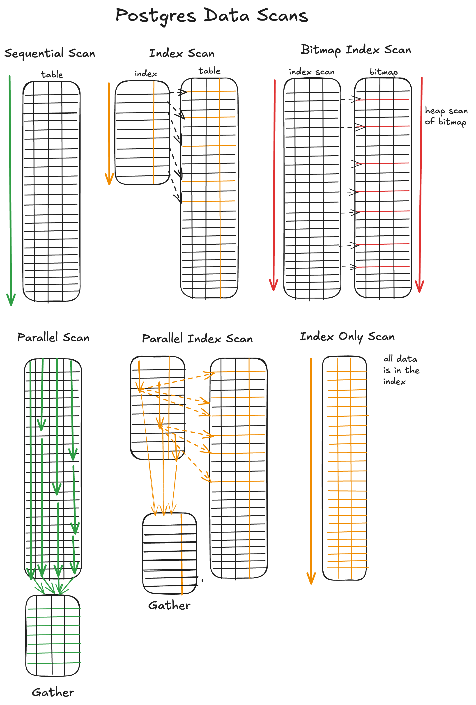

## PostgreSQL 数据扫描方法原理详解  
  
### 作者  
digoal  
  
### 日期  
2025-12-12  
  
### 标签  
PostgreSQL , 数据扫描方法 , 全表扫描 , 顺序扫描 , 并行扫描 , 索引扫描 , 位图扫描 , index only scan , 覆盖索引 , 随机IO , 顺序IO , cluster , 索引组织表 , 索引页随机性 , 堆表字段值与存储的线性相关性 , 随机访问IO代价因子 , 顺序访问IO代价因子 , 预读 , 异步IO , 流式IO , DIO   
  
----  
  
## 背景  
你想知道PostgreSQL在存储中是如何组织数据的吗?  
  
你想知道PostgreSQL是如何从已经组织好的数据中扫描数据的吗?  
  
你想知道PostgreSQL有多少扫描方法吗?  
  
你想知道PostgreSQL如何选择扫描方法的吗?  
  
你想知道不同的扫描方法是如何运行的吗?  
  
你想知道什么情况该选择什么样的扫描方法吗?  
  
看这篇文章: https://www.crunchydata.com/blog/postgres-scan-types-in-explain-plans  
  
## Postgres Scan Types in EXPLAIN Plans  
开启性能提升的关键，往往不仅在于您在查询中提出了什么，而在于 **Postgres** 如何找到答案。**Postgres** 的 `EXPLAIN`（执行计划）系统对于理解数据是如何被查询的非常有用。阅读 `EXPLAIN plans`（执行计划）的秘诀之一是理解用于检索数据的扫描类型（`scan type`）。扫描类型可能是闪电般的快速响应与缓慢查询之间的区别。  
  
    
  
今天，我将分解最常见的扫描类型，它们如何工作，以及您何时会在查询中看到它们。  
  
## `Sequential scan` (顺序扫描, `seq scan`)  
  
    
  
这种数据扫描会读取**整个表**，逐行检查是否匹配查询条件。如果您有 `WHERE` 或 `FILTER` 子句，**Postgres** 只会扫描每一行寻找匹配项。  
  
顺序扫描（`Sequence scans`）是扫描执行方式的基础，对于许多搜索来说，这是 **Postgres** 将使用的默认方式。对于**非常大的数据集**或**经常被查询的数据集**，顺序扫描并不理想，索引扫描（`index scan`）可能会更快。因此，在阅读 `EXPLAIN plan`（执行计划）时，区分顺序扫描（`seq scan`）和索引扫描（`index scan`）是最重要的部分之一。  
  
```sql  
EXPLAIN select * from accounts;  
  
QUERY PLAN  
-------------------------------------------------------------  
Seq Scan on accounts  (cost=0.00..22.70 rows=1270 width=36)  
(1 row)  
```  
  
## `Index Scan` (索引扫描)  
  
    
  
当您在 **Postgres** 中创建索引时，您正在创建磁盘上存储的**单列或多列引用**。**Postgres** 能够使用此索引作为存储在表中的数据**地图**。基本的索引扫描使用 `B-tree`（B-树）来快速找到数据的确切位置，它使用一个两步过程：首先 **Postgres** 在索引中找到条目，使用该引用，然后它从表中**获取**（`fetches`）其余的行数据。  
  
```sql  
EXPLAIN select * from accounts where id = '5';  
  
                                  QUERY PLAN  
-------------------------------------------------------------------------------  
 Index Scan using accounts_pkey on accounts  (cost=0.15..2.37 rows=1 width=36)  
   Index Cond: (id = 5)  
(2 rows)  
```  
  
请注意，`primary keys`（主键）会自动使用 `b-tree index`（B-树索引）进行索引，因此涉及主键的查询可能会使用索引扫描。  
  
在 **Postgres** 中，当查询只需要从一个**大表**中检索**非常小的一部分行**时，索引扫描通常比顺序扫描快。使用索引比扫描整个表更快。  
  
然而，索引扫描并非总是更快。在许多情况下，**Postgres** 的 `query planner`（查询规划器）会正确地选择顺序扫描。这通常发生在被扫描的表**很小**，或者返回的行百分比**超过**了使用索引的效益时。如果一个查询返回大约 **10%** 的行，顺序扫描可能更快。  
  
## `Bitmap Index Scan` (位图索引扫描)  
  
    
  
如果索引扫描或顺序扫描都不是完美的选项，**Postgres** 可以使用位图索引扫描作为一种**混合**（`hybrid`）方法。当查询匹配的行数**过多**，不适合常规索引扫描，但又**不足以**让顺序扫描成为最佳选择时，通常会选择它。  
  
这在 `EXPLAIN plan`（执行计划）中显示为一个**两阶段**方法。  
  
1.  **`Bitmap Index Scan`（位图索引扫描）** : 首先，**Postgres** 扫描一个或多个索引，以创建一个**内存中**的“位图”（`bitmap`），这是一个包含您可能需要的行的所有表页（`table pages`）的简单地图。  
2.  **`Bitmap Heap Scan`（位图堆扫描）** : 位图用于访问主表。这里的关键是它**按顺序**读取磁盘上所需的页，这比标准索引扫描的随机跳转要快得多。  
  
当查询具有**多个过滤条件**，且每个条件都有单独的索引时，位图索引扫描很常见。位图扫描允许数据库同时使用不同列上的独立索引。当 `WHERE` 条件由 `AND` 或 `OR` 运算符连接时，您会看到这种扫描出现。  
  
```sql  
EXPLAIN SELECT customer_id, registration_date  
FROM customer_records  
WHERE gender = 'F'  
  AND state_code = 'KS';  
                                                               QUERY PLAN  
----------------------------------------------------------------------------------------------------------------------------------------  
 Bitmap Heap Scan on customer_records  (cost=835.78..8669.29 rows=49226 width=12) (actual time=5.717..38.642 rows=50184.00 loops=1)  
   Recheck Cond: (state_code = 'NY'::bpchar)  
   Filter: (gender = 'F'::bpchar)  
   Rows Removed by Filter: 49682  
   Heap Blocks: exact=6370  
   Buffers: shared hit=6370 read=87  
   ->  Bitmap Index Scan on idx_customer_state  (cost=0.00..823.48 rows=97567 width=0) (actual time=4.377..4.378 rows=99866.00 loops=1)  
         Index Cond: (state_code = 'NY'::bpchar)  
         Index Searches: 1  
         Buffers: shared read=87  
 Planning:  
   Buffers: shared hit=27 read=2  
 Planning Time: 0.774 ms  
 Execution Time: 40.572 ms  
(14 rows)  
```  
  
## `Parallel Sequential Scan` (并行顺序扫描, `parallel seq scan`)  
  
    
  
当 **Postgres** 使用**多个后台工作进程**（`background workers`）同时对一个大型表执行**多个**顺序扫描时，您会看到并行顺序扫描。表被分成**块**（`chunks`），每个工作进程获得一个块进行扫描，结果在末尾的**收集进程**（`gather process`）中组合起来。根据您的查询，在并行查询之后和最终收集之前，您可能还会有一个**聚合**（`aggregate`）或**排序**（`sort`）操作。这是 **Postgres** 并行查询功能的一部分。  
  
```sql  
EXPLAIN (ANALYZE, VERBOSE, BUFFERS)  
SELECT id, data_value  
FROM parallel_test  
WHERE data_value < 100000  
ORDER BY data_value DESC  
LIMIT 1000;  
  
                                                                         QUERY PLAN  
------------------------------------------------------------------------------------------------------------------------------------------------------------  
 Limit  (cost=161310.11..161431.04 rows=1000 width=16) (actual time=130.300..140.555 rows=1000.00 loops=1)  
   Output: id, data_value  
   Buffers: shared hit=142685  
   ->  Gather Merge  (cost=161310.11..220311.14 rows=487915 width=16) (actual time=130.299..140.468 rows=1000.00 loops=1)  
         Output: id, data_value  
         Workers Planned: 5  
         Workers Launched: 5  
         Buffers: shared hit=142685  
         ->  Sort  (cost=160310.04..160553.99 rows=97583 width=16) (actual time=112.942..112.973 rows=861.17 loops=6)  
               Output: id, data_value  
               Sort Key: parallel_test.data_value DESC  
               Sort Method: top-N heapsort  Memory: 163kB  
               Buffers: shared hit=142685  
               Worker 0:  actual time=112.535..112.571 rows=1000.00 loops=1  
                 Sort Method: top-N heapsort  Memory: 164kB  
                 Buffers: shared hit=21729  
               Worker 1:  actual time=112.271..112.308 rows=1000.00 loops=1  
                 Sort Method: top-N heapsort  Memory: 164kB  
                 Buffers: shared hit=21573  
               Worker 2:  actual time=112.465..112.500 rows=1000.00 loops=1  
                 Sort Method: top-N heapsort  Memory: 164kB  
                 Buffers: shared hit=20549  
               Worker 3:  actual time=99.099..99.133 rows=1000.00 loops=1  
                 Sort Method: top-N heapsort  Memory: 163kB  
                 Buffers: shared hit=17033  
               Worker 4:  actual time=112.333..112.368 rows=1000.00 loops=1  
                 Sort Method: top-N heapsort  Memory: 163kB  
                 Buffers: shared hit=19964  
               ->  Parallel Seq Scan on public.parallel_test  (cost=0.00..154959.67 rows=97583 width=16) (actual time=19.238..99.868 rows=83250.83 loops=6)  
                     Output: id, data_value  
                     Filter: (parallel_test.data_value < '100000'::numeric)  
                     Rows Removed by Filter: 750082  
                     Buffers: shared hit=142500  
                     Worker 0:  actual time=18.837..99.169 rows=83026.00 loops=1  
                       Buffers: shared hit=21692  
                     Worker 1:  actual time=18.594..99.301 rows=84378.00 loops=1  
                       Buffers: shared hit=21536  
                     Worker 2:  actual time=18.706..99.551 rows=79196.00 loops=1  
                       Buffers: shared hit=20512  
                     Worker 3:  actual time=5.308..86.023 rows=81187.00 loops=1  
                       Buffers: shared hit=16996  
                     Worker 4:  actual time=18.694..99.497 rows=83574.00 loops=1  
                       Buffers: shared hit=19927  
 Planning:  
   Buffers: shared hit=15  
 Planning Time: 0.315 ms  
 Execution Time: 140.635 ms  
(47 rows)  
```  
  
## `Parallel index scan` (并行索引扫描)  
  
    
  
并行索引扫描使用**相同的并行工作进程**同时扫描索引。它采用索引扫描的相同方法——只是**多个工作进程**同时执行。每个进程读取索引的不同部分并返回结果。像其他并行扫描一样，它以一个**收集**（`gather`）操作结束。  
  
当涉及的索引和表**非常大**，并且**拆分**和**最终收集**的整个操作比交给单个工作进程更快时，您会看到并行索引扫描。  
  
```sql  
EXPLAIN (ANALYZE, VERBOSE, BUFFERS)  
SELECT data_id, filler_text  
FROM parallel_index_test  
WHERE data_id BETWEEN 1000000 AND 2000000;  
  
                                                                                QUERY PLAN  
---------------------------------------------------------------------------------------------------------------------------------------------------------------------------  
 Gather  (cost=0.43..34560.34 rows=995971 width=109) (actual time=1.014..145.796 rows=1000001.00 loops=1)  
   Output: data_id, filler_text  
   Workers Planned: 4  
   Workers Launched: 4  
   Buffers: shared hit=23385  
   ->  Parallel Index Scan using idx_data_id on public.parallel_index_test  (cost=0.43..33564.37 rows=248993 width=109) (actual time=0.941..38.211 rows=200000.20 loops=5)  
         Output: data_id, filler_text  
         Index Cond: ((parallel_index_test.data_id >= 1000000) AND (parallel_index_test.data_id <= 2000000))  
         Index Searches: 1  
         Buffers: shared hit=23385  
         Worker 0:  actual time=2.104..45.540 rows=240638.00 loops=1  
           Buffers: shared hit=5640  
         Worker 1:  actual time=2.174..45.169 rows=240096.00 loops=1  
           Buffers: shared hit=5638  
         Worker 2:  actual time=0.067..45.380 rows=242658.00 loops=1  
           Buffers: shared hit=5693  
         Worker 3:  actual time=0.306..45.122 rows=242292.00 loops=1  
           Buffers: shared hit=5686  
 Planning:  
   Buffers: shared hit=4  
 Planning Time: 0.526 ms  
 Execution Time: 180.660 ms  
(22 rows)  
```  
  
## `Index-Only Scan` (仅索引扫描)  
  
    
  
**仅索引扫描**（`Index-Only Scan`）是扫描中的“超级明星”，它**仅使用**索引本身存储的信息来回答整个查询。仅索引扫描也称为 **“覆盖索引”** （`covering indexes`），这意味着索引本身**覆盖**了所有数据。它甚至**不需要访问主表**（`main table`）或**堆表**（`heap table`）。仅索引扫描是一个巨大的性能提升，因为它速度非常快 —— **不需要**从堆表（`heap table`）中检索任何信息。它们通常也使用更少的 **I/O** 资源，因为索引非常**缓存友好**（`cache friendly`），并且通常位于 `shared buffers`（共享缓冲区）中——这意味着不需要从底层磁盘读取数据。  
  
在以下情况下，查询会从覆盖索引中受益：  
  
  * 查询**执行频率非常高**。  
  * 当前查询正在执行标准索引扫描，随后是**许多缓慢的磁盘读取**（`heap fetches`，堆提取）并使用了 I/O。  
  * 查询只需要表中的一小部分列，例如您从一个有二十列的表中**仅选择三列**。  
  * 这些列的**写入频率较低**。任何被索引的列都必须写入磁盘和索引，所以如果您开始为所有列添加覆盖索引，您实际上是在创建**写入放大**（`write amplification`）。  
  * 必须覆盖所有所需列的新索引**不会太大**。索引存储在磁盘上，所以您不希望引起存储问题。  
  
  
```sql  
EXPLAIN (ANALYZE, VERBOSE, BUFFERS)  
SELECT code, status  
FROM index_only_test  
WHERE code > 'CODE_050000'  
ORDER BY code  
LIMIT 100;  
                                                                           QUERY PLAN  
----------------------------------------------------------------------------------------------------------------------------------------------------------------  
 Limit  (cost=0.42..2.60 rows=100 width=13) (actual time=0.346..0.362 rows=100.00 loops=1)  
   Output: code, status  
   Buffers: shared hit=1 read=3  
   ->  Index Only Scan using idx_code_status on public.index_only_test  (cost=0.42..1068.02 rows=49000 width=13) (actual time=0.345..0.352 rows=100.00 loops=1)  
         Output: code, status  
         Index Cond: (index_only_test.code > 'CODE_050000'::text)  
         Heap Fetches: 0  
         Index Searches: 1  
         Buffers: shared hit=1 read=3  
 Planning:  
   Buffers: shared hit=19  
 Planning Time: 1.838 ms  
 Execution Time: 0.385 ms  
(13 rows)  
```  
  
## 总结  
  
我们已经涵盖了所有主要的扫描类型，现在阅读您的 `EXPLAIN plans`（执行计划）将更容易一些。  
  
  * **`Seq scan`（顺序扫描）** ：**Postgres** 按顺序查看**整个表**以查找查询数据。  
  * **`Index scan`（索引扫描）** ：**Postgres** 首先查看**索引**，然后**获取**索引指向的行数据。  
  * **`Bitmap index scan`（位图索引扫描）** ：**Postgres** 首先读取索引并创建了一个匹配行的**位图列表**。其次，**Postgres** 使用位图以比顺序扫描**更有效**的方法读取**数据堆**（`data heap`）。  
  * **`Parallel scan`（并行扫描）** ：**Postgres** 使用**多个并行工作进程**扫描表，数据在末尾被**收集**。  
  * **`Parallel index scan`（并行索引扫描）** ：**Postgres** 使用**多个工作进程**执行索引扫描，数据在末尾被**收集**。  
  * **`Index only scan`（仅索引扫描）** ：查询的所有数据都**在索引中**。  
  
这里有一张图表将所有内容汇总：  
  
    
      
#### [PolarDB 学习图谱](https://www.aliyun.com/database/openpolardb/activity "8642f60e04ed0c814bf9cb9677976bd4")
  
  
#### [PostgreSQL 解决方案集合](../201706/20170601_02.md "40cff096e9ed7122c512b35d8561d9c8")
  
  
#### [德哥 / digoal's Github - 公益是一辈子的事.](https://github.com/digoal/blog/blob/master/README.md "22709685feb7cab07d30f30387f0a9ae")
  
  
#### [About 德哥](https://github.com/digoal/blog/blob/master/me/readme.md "a37735981e7704886ffd590565582dd0")
  
  

  
