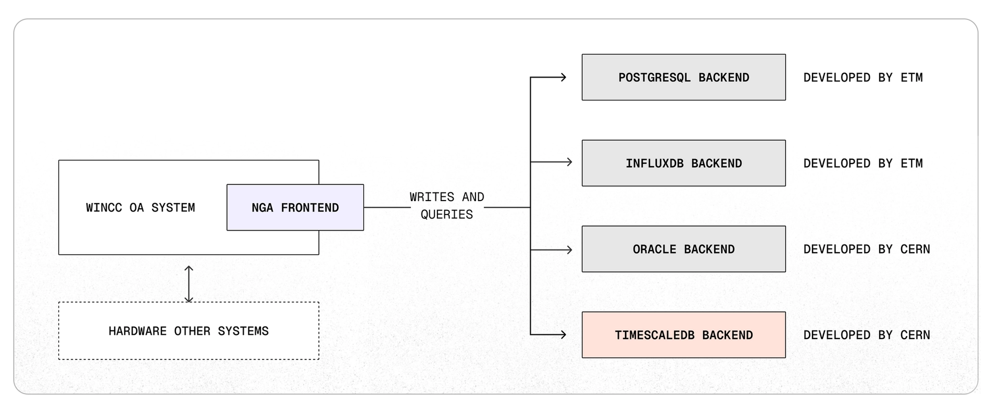
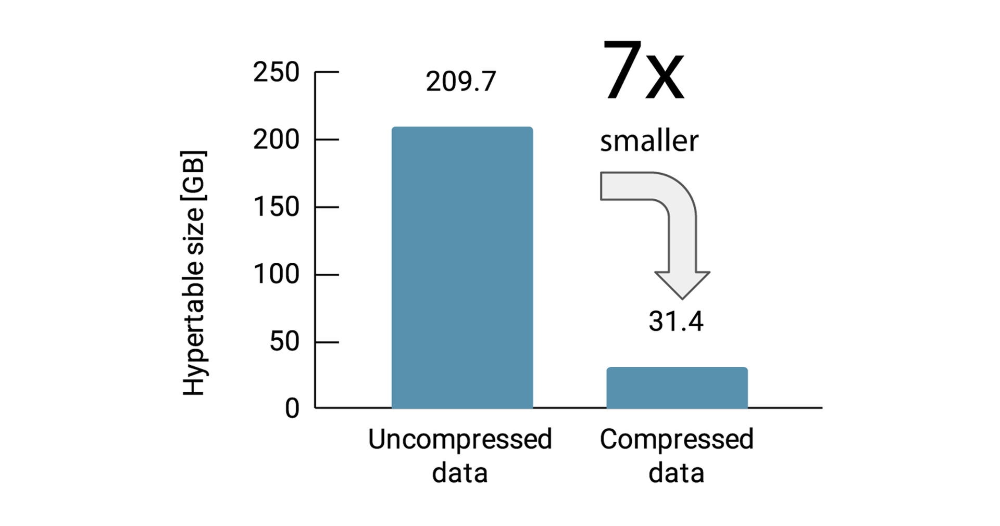
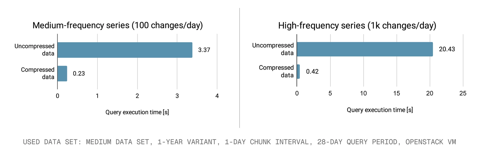
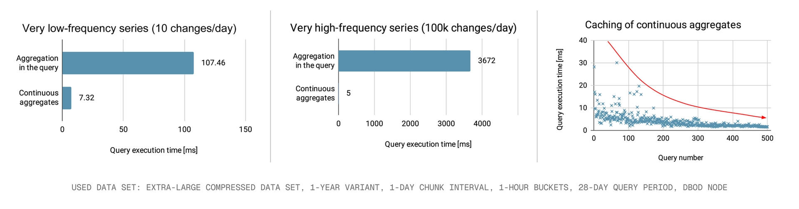

## 欧洲核子研究组织 (CERN) 如何利用 TimescaleDB 助力开创性物理学研究  
    
### 作者    
digoal    
    
### 日期    
2025-12-12    
    
### 标签    
PostgreSQL , 时序数据 , timescaledb , 实时聚合 , 高速写入 , 压缩 , 写入吞吐    
    
----    
    
## 背景    
  
timescaledb 是 PostgreSQL的一款时序数据库插件, 出于时序业务场景的需求, 其主要特性包括:   
- 列存储(节省空间、同时提升分析效率)  
- 冷热存储(可将数据归档到对象存储, 节省成本)  
- 分片管理, 持续高速写入, 即使单表已经非常大的情况下, 几乎不降速  
- 实时聚合(类似流计算)  
- 近似统计类型加持, 类似hll等  
  
这篇文章来自timescaledb blog, 介绍了欧洲核子研究组织 (CERN) 如何利用 TimescaleDB 助力开创性物理学研究  
https://www.tigerdata.com/blog/how-cern-powers-ground-breaking-physics-with-timescaledb  
  
---  
  
**目录**  
  
01 关于公司  
02 关于团队  
03 挑战：驾驭遗留数据环境  
04 CERN 的战略愿景：下一代归档器 (NGA)  
05 选择后端：为何选择 TimescaleDB  
06 未来计划：TimescaleDB 投入生产  
  
---  
  
这是我们“社区成员聚焦”系列的一部分，在该系列中，我们邀请客户分享他们的工作，展示他们的成功，并以使用新技术解决问题的新方式来激励他人。  
  
### 01 关于公司  
  
粒子物理欧洲实验室（**CERN**，European Laboratory for Particle Physics）是基础物理研究领域的全球领导者，负责进行大规模物理实验，例如**大型强子对撞机 (LHC)** （Large Hadron Collider），该实验会产生大量的**时间序列数据**（time-series data）。控制系统会监测电压、压力和温度等参数，以支持物理分析并确保实验的可重现性。  
  
超过 800 个基于 **SIMATIC WinCC 开放架构**（SIMATIC WinCC Open Architecture）构建的 **SCADA**（监控与数据采集）系统每天生成数百千兆字节的数据。如此庞大的数据量要求高效的存储和快速、一致的查询。对于由 CERN 和西门子/ETM 联合开发的 WinCC OA **下一代归档器 (NGA)** （NextGen Archiver）模块而言，在处理不断增长的数据量和吞吐量的同时，提供响应迅速的数据可视化一直是一个持续的挑战。  
  
### 02 关于团队  
  
我是 Rafal Kulaga，CERN 的一名高级软件工程师，拥有十多年开发大型分布式控制系统软件的经验。我的同事，软件工程师 Antonin Kveton 和 Martin Zemko，通过 CERN openlab 项目与西门子/ETM 合作，共同为 WinCC OA 的下一代归档器开发了 **TimescaleDB** 后端。  
  
### 03 挑战：驾驭遗留数据环境  
  
二十多年来，CERN 一直使用 WinCC OA 来构建和运行大规模 **SCADA** 系统，该系统现已成为整个组织的标准。超过 800 个系统涵盖了以下关键领域：  
  
* 气体分配（Gas Distribution）  
* 电网（Electrical Grid）  
* 真空环境和辐射探测器控制（Vacuum Environment & Radiation Detector Controls）  
* 机器保护（Machine Protection）  
* 低温学（Cryogenics）  
* 冷却和通风（Cooling & Ventilation）  
  
仅在**大型强子对撞机 (LHC)** 实验中，每个探测器就使用了 100 多个 WinCC OA 系统，并生成数百万个数据点——这些信号产生了带时间戳的值，对于实时操作和运行后的物理分析都至关重要。  
  
WinCC OA 的核心功能是归档**时间序列数据**（time-series data），包括事件和警报。归档不仅关乎存储，还需要支持高效的查询——无论是通过外部工具还是直接在 WinCC OA 内部。如果没有历史访问权限，操作员只能看到系统状态的实时快照。  
  
自 2008 年以来，**RDB 归档器**（RDB Archiver）一直在 CERN 承担此项任务。尽管它仍在大约 30% 的系统中运行，但它面临两个主要问题：与 **Oracle 数据库**（Oracle Database）的紧密耦合，以及由于死板、复杂的模式限制了灵活性和性能而导致的**技术债务**（technical debt）积累。  
  
### 04 CERN 的战略愿景：下一代归档器 (NGA)  
  
为了克服其遗留系统的局限性，CERN 和西门子/ETM 于 2017 年启动了**下一代归档器 (NGA)** （NextGen Archiver）项目。NGA 现已部署在大约 500 个系统中，其目标是：  
  
* 减少技术债务（Reduce technical debt）  
* 提高性能（Improve performance）  
* 支持新的用例（Support new use cases）  
* 提供 **Oracle** 的替代方案（Provide an alternative to Oracle）  
  
**NGA** 的核心在于其**可插拔后端架构**（pluggable backend architecture），该架构支持多种数据库，包括 **PostgreSQL** 和 **TimescaleDB**，从而实现了一个更开放、更灵活的系统。**Oracle** 支持得以保留，以兼容现有的 **RDB 归档器**（RDB Archiver）模式，而新的 **TimescaleDB** 解决方案目前正在并行运行。  
  
    
  
### 05 选择后端：为何选择 TimescaleDB  
  
CERN 的选择标准包括以下考量：  
  
* 本地部署和支持（On-premise deployment and support）  
* 高可用性和可靠性（High availability and reliability）  
* 长期可行性和潜在退出策略（Long-term viability and potential exit strategies）  
* 可扩展性和性能（Scalability and performance）  
* 生态系统成熟度和客户端支持（Ecosystem maturity and client support）  
  
作为一个 **PostgreSQL** 扩展，**TimescaleDB** 与 CERN 现有的专业知识紧密吻合，并为**时间序列**（time-series）工作负载提供了专门的支持。针对 **PostgreSQL** 进行的基准测试证实了它作为**下一代归档器**（NextGen Archiver）后端的适用性。  
  
#### 写入吞吐量（Writing Throughput）  
  
在基准测试中，**TimescaleDB** 和 **PostgreSQL** 所实现的**写入吞吐量**（Writing Throughput）轻松超出了 CERN 使用的最大型 WinCC OA 系统的要求（每个连接高达每秒 20,000 行）。**TimescaleDB** 提供了最高的性能，即使在数据集庞大、时间序列数量多和并发写入者的情况下也是如此。此外，**TimescaleDB** 通过自动高效地对**超表**（hypertables）进行分区并执行数据保留策略，极大地简化了模式设计。  
  
如果需要，可以通过将数据摄取方式从基于文本的切换到二进制 `COPY`，并通过调整时间参数以支持更少、更大的写入量，来进一步提高摄取速率——但这会以略微增加延迟为代价。  
  
> Rafal Kulaga 说：“我们最大的系统每个连接的写入速率远低于每秒 2 万行，因此测得的每秒 4 万行吞吐量意味着 **TimescaleDB** 可以轻松应对。”  
  
| 指标（Metric） | 所需写入速率（每个系统连接） | PostgreSQL (仅数据库) | TimescaleDB (仅数据库) | TimescaleDB (数据库 + 客户端) |  
| :--- | :--- | :--- | :--- | :--- |  
| 写入速率（Writing rates） | 20k 行/秒（20k rows/sec） | 67k 行/秒（67k rows/sec） | 77k 行/秒（77k rows/sec） | 40k 行/秒（40k rows/sec） |  
  
#### 压缩存储节省（Compression Storage Savings）  
  
在他们的测试中，CERN 证实 **TimescaleDB** 的**列式压缩**（columnar compression）将使存储需求至少减少 7 倍。每个列都会被单独压缩，从而带来显著的节省：  
  
* 合成生成的数据可节省 78-87% 的空间（78-87% space reduction for synthetically generated data）  
* 从生产系统提取的历史数据可节省 90-95% 的空间（90-95% space reduction for historical data extracted from production systems）  
  
    
  
#### 压缩数据上的查询性能（Query Performance on Compressed Data）  
  
由于较低的 I/O，读取压缩数据时的查询速度显着提高。增益随着查询大小和范围的增加而增加。  
  
> Martin Zemko 说：“对于使用压缩的读取结果，我们观察到了相当显著的加速，从 10 倍到 40 倍不等，具体取决于你的查询、范围和数据频率。”  
  
    
  
#### 连续聚合（Continuous Aggregates）  
  
**连续聚合 (CAggs)** （Continuous Aggregates），它能自动实例化并刷新摘要，是另一个关键优势。  
  
> Martin Zemko 说：“对于**连续聚合**（continuous aggregates）而言，性能提升令人印象深刻，因为查询的数据量显著减少了。我们还观察到强烈的缓存效应，因为数据量相对于原始数据来说非常小，使得你的**超表**（hypertables）非常容易地适应内存。我们预计**连续聚合**（Continuous Aggregates）将成为一个颠覆性因素，尤其是在绘制高频信号时。”  
  
    
  
CERN 凭借其严苛的规模、关键的正常运行时间要求和严格的可重现性标准，为任何数据库提供了一个严格的试验台。在这里取得成功，预示着该解决方案有能力在其他复杂的企业环境中运行。  
  
### 06 未来计划：TimescaleDB 投入生产  
  
根据目前的结果，CERN 计划将 **TimescaleDB** 标准化，作为 **Oracle** 的替代方案，用于存储 WinCC OA 系统的历史数据，并利用**压缩**（compression）和**连续聚合**（continuous aggregates）功能。全面的基准测试正在进行中，目标是在 2027 年在 CERN 范围内全面投入生产部署。  
  
为**下一代归档器**（NextGen Archiver）提供支持的 **TimescaleDB** 数据库是通过 CERN IT 部门提供的**按需数据库 (DBOD) 服务**（Database on Demand (DBOD) service）进行配置的，从而实现了符合 CERN 内部基础设施标准的简化、可扩展和完全托管的部署。  
    
      
#### [PolarDB 学习图谱](https://www.aliyun.com/database/openpolardb/activity "8642f60e04ed0c814bf9cb9677976bd4")
  
  
#### [PostgreSQL 解决方案集合](../201706/20170601_02.md "40cff096e9ed7122c512b35d8561d9c8")
  
  
#### [德哥 / digoal's Github - 公益是一辈子的事.](https://github.com/digoal/blog/blob/master/README.md "22709685feb7cab07d30f30387f0a9ae")
  
  
#### [About 德哥](https://github.com/digoal/blog/blob/master/me/readme.md "a37735981e7704886ffd590565582dd0")
  
  

  
