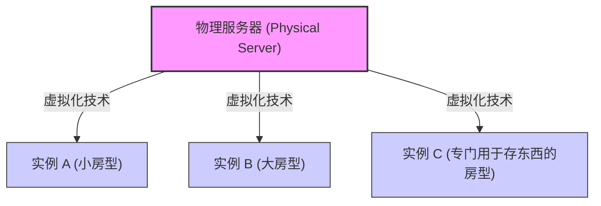
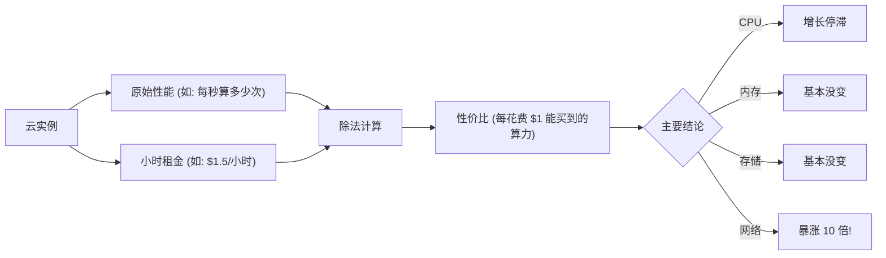
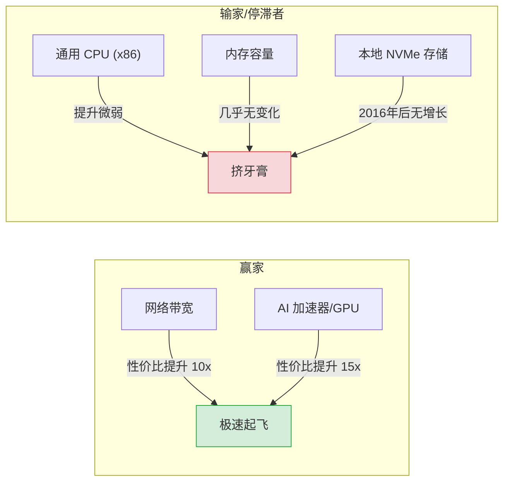
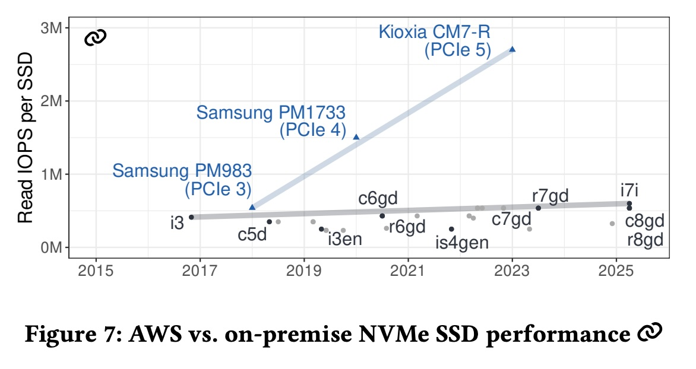
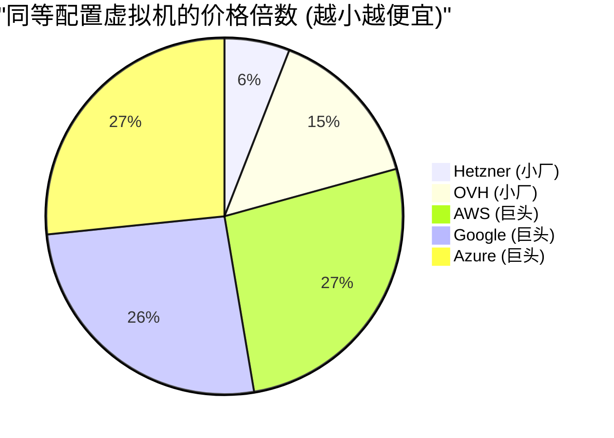
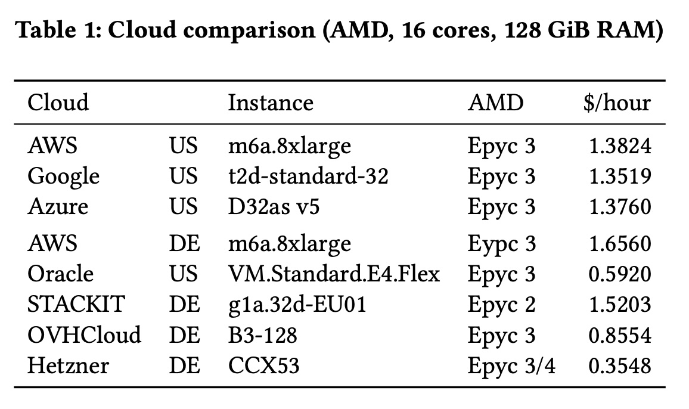
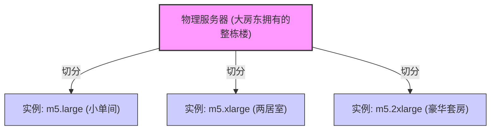
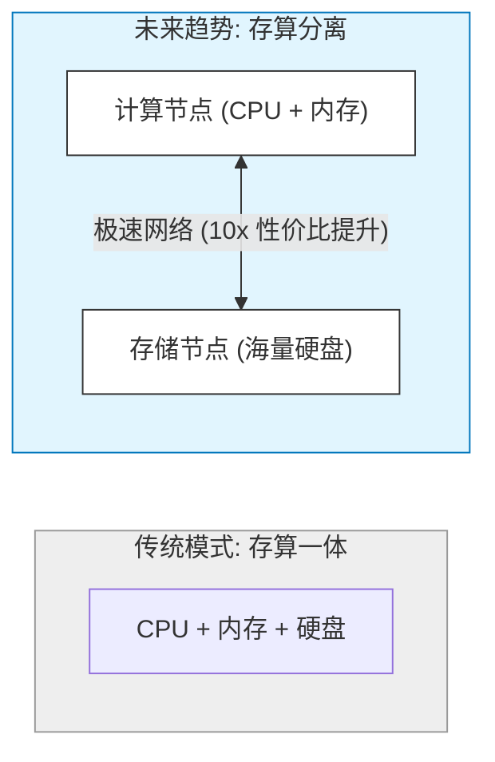

## AI论文解读 | Cloudspecs: Cloud Hardware Evolution Through the Looking Glass
        
### 作者        
digoal        
        
### 日期        
2025-12-13        
        
### 标签        
PostgreSQL , PolarDB , DuckDB , AI , 论文解读        
        
----        
        
## 背景  
      
https://www.cs.cit.tum.de/fileadmin/w00cfj/dis/papers/cloudspecs-final.pdf        
  
提示:          
```          
读懂《Cloudspecs: Cloud Hardware Evolution Through the Looking Glass》这篇论文需要提前掌握哪些基础知识, 请使用中文通熟易懂的讲解这些基础知识, 可以引用论文中的图、表或使用Markdown支持的图形(text,mermaid等)增加解释性. 
  
使用中文通熟易懂的解读《Cloudspecs: Cloud Hardware Evolution Through the Looking Glass》这篇论文, 其中的关键内容请着重讲解, 可以引用论文中的图、表或使用Markdown支持的图形(text,mermaid等)增加解释性. 
  
提取《Cloudspecs: Cloud Hardware Evolution Through the Looking Glass》这篇论文中的重要术语, 使用中文对这些术语进行通熟易懂的讲解, 可以引用论文中的图、表或使用Markdown支持的图形(text,mermaid等)增加解释性. 
```     
  
## 1 前置知识 
  
要读懂《Cloudspecs: Cloud Hardware Evolution Through the Looking Glass》这篇论文，你需要掌握以下几个核心领域的“背景知识”。这篇论文主要是在讲**云硬件（特别是AWS）在过去十年（2015-2025）的演进趋势以及性价比的变化**。

为了让你轻松理解，我将这些基础知识分为四个板块，并配合图表进行讲解。

-----

### 1\. 云计算的基本单位：实例 (Instance)

在阅读论文前，你首先要理解什么是“实例”。

  * **通俗解释**：你可以把云服务商（如 AWS）想象成一个巨大的房东。他们拥有超级多的物理服务器（大楼）。当你需要计算能力时，你不是买下一整栋楼，而是租其中的一个“房间”。这个“房间”就是**实例（Instance）** 。
  * **虚拟化**：一个物理服务器通常会被切分成很多个“虚拟切片”。比如，一个大家族（物理机）可以分家给好几个小家庭（虚拟机/实例）住。
  * **论文中的体现**：论文一开篇就提到，AWS 的实例类型从 2015 年的 52 种爆炸式增长到了 2025 年的 1057 种 。这意味着“房型”的选择变得极其复杂。




**实例家族 (Instance Families) 的命名规则：**
论文中频繁出现 `c5`, `r6`, `g4` 等代号，这其实是 AWS 的命名“黑话”：

  * **C 系列 (Compute)** ：计算优化型。CPU 强，适合算数。
  * **R 系列 (Memory)** ：内存优化型。内存大，适合放数据库。
  * **I 系列 (Storage)** ：存储优化型。硬盘快，适合读写数据。
  * **数字 (如 c4, c5, c6)** ：代表“第几代”。通常数字越大，硬件越新。
  * **后缀 (如 g, a, n)** ：
      * `g`: 代表使用了 AWS 自研的 **Graviton (ARM)** 处理器 。
      * `a`: 代表使用了 **AMD** 处理器 。
      * `n`: 代表**网络**增强型 。

-----

### 2\. 核心硬件组件 (四大件)

论文通篇都在分析这四个组件的**性能**和**价格**变化。

#### A. CPU (处理器) - 大脑

  * **核心 (Core) 与 vCPU**：你可以把 Core 想象成干活的工人。vCPU (虚拟 CPU) 通常指工人的“分身”（超线程技术）。论文指出，云上的核心数在十年间增长了 10 倍，现在最大的实例有 448 个核心 。
  * **架构之争 (x86 vs. ARM)** ：
      * **x86 (Intel/AMD)** ：传统的、通用的，像全能的老牌管家。
      * **ARM (AWS Graviton)** ：新兴的、低功耗的，像精打细算的年轻管家。
      * **关键点**：论文发现 x86 的性价比停滞了，而 ARM (Graviton) 正在接管市场，成为了性价比之王 。

#### B. Memory (内存) - 工作台

  * **DRAM**：数据处理的临时场所。工作台越大，能同时处理的文件就越多。
  * **关键点**：论文指出，内存的**性价比（每块钱能买到的内存容量）在过去十年几乎没变** 。这很反直觉，因为我们要么花更多钱买大内存，要么只能忍受小内存。

#### C. Storage (存储) - 仓库

  * **本地 NVMe SSD**：直接插在服务器上的超高速硬盘。
  * **网络存储 (EBS)** ：通过网络连接的硬盘（就像网盘）。
  * **关键点**：论文主要关注**本地 NVMe**。令人惊讶的是，虽然硬盘技术在进步，但在云上，NVMe 的性价比和性能自从 2016 年以来也**停滞**了 。

#### D. Network (网络) - 运输管道

  * **带宽 (Bandwidth)** ：管道的粗细，决定了数据传输多快。
  * **关键点**：这是论文中唯一的**超级亮点**。相比于 CPU 和 存储的停滞，**网络带宽的性价比提升了 10 倍**，速度提升了 60 倍 。现在的网络快到甚至改变了我们要怎么设计软件 。

-----

### 3\. 核心评价指标：性价比 (Cost-Performance)

这篇论文不是在比谁“跑得快”，而是在比谁“跑得划算”。这是理解论文结论的关键。

  * **摩尔定律 (Moore's Law)** ：以前我们认为，每过 18-24 个月，花同样的钱能买到的电脑性能会翻倍。
  * **论文的发现**：在云端 CPU 上，摩尔定律似乎失效了。性能虽然提升了，但价格也贵了，导致**性价比（Performance per Dollar）提升非常缓慢** 。

**图解：论文中的分析逻辑**



-----

### 4\. 数据库基准测试 (Benchmarks)

论文为了证明哪个硬件好，用这几种标准的“考试试卷”来测试实例 ：

1.  **SPECint 2017**：
      * **考什么**：纯粹的 CPU 整数运算能力。
      * **类比**：做大量的数学加减乘除题，看谁做得快。
2.  **TPC-H (Umbra)** ：
      * **考什么**：分析型数据库查询 (OLAP)。
      * **类比**：老板让你从 10 年的账本里统计出“每年夏天卖得最好的冰淇淋是哪个”。这需要扫描大量数据，考验内存带宽和 CPU。
3.  **TPC-C (Leanstore)** ：
      * **考什么**：交易型数据库处理 (OLTP)。
      * **类比**：模拟双十一购物节，成千上万的人同时下单、付款、改库存。考验系统的随机读写能力和延迟。

### 5\. 存算分离 (Disaggregation)

这是现代云系统设计的一个重要概念，论文在案例分析中用到了它 。

  * **传统模式**：计算和存储在一起。如果你的硬盘满了，但 CPU 还很闲，你也得换个更大的服务器，很浪费。
  * **存算分离**：计算节点（CPU+内存）和存储节点（硬盘）分开。中间通过**极快的网络**连接。
  * **论文的洞察**：因为现在**网络 (Network)** 变得超级快且便宜，而**本地存储 (Storage)** 进步慢，所以通过网络去读数据（存算分离）变得越来越划算，甚至可能比读本地硬盘更好 。

-----

### 总结：读这篇论文时，你的脑海里要有这张图

当你阅读时，时刻带着这个对比视角：

| 硬件组件 | 过去十年的趋势 (论文核心观点) | 对你的启示 |
| :--- | :--- | :--- |
| **CPU** | **挤牙膏**。性价比提升慢，主要靠换 ARM (Graviton) 架构来省钱。 | 尽量选 Graviton (g系列) 实例。 |
| **内存** | **完全躺平**。容量价格比几乎没变。 | 内存很贵，省着点用。 |
| **存储 (SSD)** | **停滞不前**。跟不上物理硬件的发展速度。 | 不要过度依赖本地 SSD 的性能红利。 |
| **网络** | **突飞猛进**！性价比提升 10 倍。 | **大胆地利用网络**！把系统设计成分布式的。 |

掌握了这些，你就可以顺畅地阅读《Cloudspecs》并理解为什么作者会发出“CPU 停滞，网络起飞”的感叹了。
  
## 2 解读论文 
  
这篇论文《Cloudspecs: Cloud Hardware Evolution Through the Looking Glass》通过分析过去十年（2015-2025）AWS 等云服务商的硬件演进，揭示了一个令许多开发者意外的真相： **云硬件的发展并不均衡，摩尔定律在云端似乎“失灵”了，除非你选对方向。**

以下是这篇论文的深度解读，我将其拆解为几个核心故事，配合图表帮助你理解。

-----

### 1\. 核心结论概览：云端的“龟兔赛跑”

如果用一句话总结这篇论文： **网络带宽在狂飙，但计算和存储的性价比却在原地踏步。**

作者分析了 AWS 从 2015 年到 2025 年的实例数据，发现各组件的**性价比（Cost-Performance，即每花费 1 美元能买到的性能）** 变化趋势如下：

| 硬件组件 | 演进趋势 (2015-2025) | 评价 |
| :--- | :--- | :--- |
| **网络 (Network)** | 🚀 **暴涨 10 倍** (性价比) | 唯一的超级赢家 |
| **CPU (处理器)** | 🐢 **缓慢增长** (约 2-3 倍) | 全靠 ARM (Graviton) 撑场面 |
| **内存 (RAM)** | 🛑 **几乎停滞** | 十年如一日的贵 |
| **存储 (NVMe SSD)** | 🛑 **完全停滞** | 2016 年的老实例至今仍是性价比之王 |


为了直观展示这种不平衡，我们可以看下面的对比图：



-----

### 2\. 深度解析：四大硬件领域的十年变迁

#### A. CPU：x86 的黄昏与 ARM 的崛起

过去大家认为电脑每两年快一倍（摩尔定律），但在云上不是这样。

  * **x86 (Intel/AMD) 挤牙膏**：传统的 Intel 和 AMD 实例，虽然核心数变多了（现在最多有 448 个核），但价格也贵了。算下来，每花一块钱买到的算力提升非常有限 。
  * **ARM (Graviton) 是救星**：AWS 自研的 Graviton 芯片改变了游戏规则。如果不算 Graviton，CPU 性价比提升只有 2 倍；算上它，提升勉强达到 3 倍 。
  * **结论**：如果你还在用老架构，你在亏钱。现在超过一半的新实例都是基于 Graviton 的 。

#### B. 内存：昂贵的稀缺资源

这是最令人沮丧的发现。

  * **原地踏步**：不管是看容量（每美元能买多少 GB）还是带宽，过去十年几乎没有实质性的性价比提升 。
  * **对比**：你在云下买内存条便宜了 3 倍，但云厂商并没有把这个实惠完全传导给租户，或者通过其他方式维持了高价 。

#### C. 网络：狂飙的唯一的亮点

这是云架构最大的红利。

  * **速度爆炸**：绝对速度从 10 Gbps 涨到了 600 Gbps 。
  * **极高性价比**：即便算上价格因素，网络带宽的性价比也提升了 **10 倍** 。
  * **启示**：既然网络这么便宜又快，内存又那么贵，未来的系统设计应该**多用网络，少存本地**（存算分离）。

#### D. 存储 (NVMe SSD)：云厂商的“懒惰”？

这是论文中最反直觉的发现。

  * **2016 即巅峰**：AWS 在 2016 年推出的 `i3` 实例，至今在“每美元提供的 IOPS（读写速度）”上仍然是第一名，比 2025 年的新实例还强 。
  * **脱节**：物理世界的 SSD 已经进化到了 PCIe 5.0，速度翻了好几倍，但 AWS 的实例存储性能却像被“锁死”了一样 。

> **图表引用说明**：论文中的图 7 清晰展示了这一点，本地硬件（Samsung/Kioxia SSD）的性能斜率向上飙升，而 AWS 实例的性能曲线是平的 。

  

-----

### 3\. 价格战争：巨头 vs. 小厂

论文不仅对比了 AWS 自己的历史，还横向对比了其他云厂商。

  * **三巨头 (AWS, Google, Azure)** ：价格惊人地相似。看似竞争激烈，实则形成了某种价格默契，特别是网络流量费和基础计算费用 。
  * **挑战者 (Hetzner, OVH 等)** ：小型云厂商极其便宜。
      * **价格差**：同样的配置（AMD 16核，128GB 内存），德国的 Hetzner 比 AWS 便宜 **4 到 5 倍** 。
      * **代价**：小厂虽然便宜，但没有 AWS 那么多花哨的实例类型（如 AI 加速器），数据中心少，网络可能也没那么顶级 。




*(注：数据基于论文 Table 1 的近似比例 )*

  

-----

### 4\. 给开发者的行动指南

基于这些数据，论文作者给出了非常实用的架构建议：

1.  **全面转向 ARM**：
    不要犹豫了，把你的系统迁移到 ARM (AWS Graviton) 上。它不仅计算便宜，连带着网络、存储的性价比通常也是最高的 。

    > *引用:* "Graviton-based instances are... the best choice in terms of compute... network bandwidth... main memory capacity... and NVMe capacity." 

2.  **拥抱“存算分离”** ：
    既然本地 SSD 性能停滞，而网络快得离谱，那就不要执着于把数据存在本地盘了。通过网络去读 S3 或者远程存储，可能比你想象的更划算、更高效 。

3.  **利用 AI 加速器**：
    通用 CPU 跑不动了，但专用芯片（如 AWS Trainium/Inferentia）的性价比提升了 15 倍。如果是机器学习任务，必须用专用硬件 。

4.  **混合云策略**：
    如果你的业务主要是“算”而不是“存”或“传”，可以考虑把纯计算任务放到 Hetzner 这种廉价云上，能省下巨额费用 。

### 5\. 总结

这篇论文像是一份 **“云租房避坑指南”** 。它告诉我们，云服务商并不是每年都在所有领域降价提质。

  * **避坑**：不要指望内存和本地硬盘会越来越便宜。
  * **红利**：尽情挥霍网络带宽，尽早适配 ARM 架构。

作者还开发了一个开源工具 **Cloudspecs** ([https://cloudspecs.fyi](https://cloudspecs.fyi))，让你可以自己去查这些数据，画出针对你业务场景的性价比图表 。
  
## 3 术语 
  
这篇论文《Cloudspecs: Cloud Hardware Evolution Through the Looking Glass》深入探讨了云硬件的演变。为了读懂它，我们需要理解几个核心术语。我将这些术语分为**基础概念**、**硬件技术**和**架构趋势**三个类别，并使用通俗的语言和图表进行解读。

-----

### 第一类：基础概念 (云的计价单位)

#### 1\. Instance Family & Slices (实例家族与切片)

  * **通俗解读**：
      * **Family (家族)** ：你可以把它想象成汽车的“车系”（比如宝马 3 系、5 系）。在 AWS 中，`c5`、`r6`、`i3` 就是不同的家族，每个家族侧重点不同（有的 CPU 强，有的内存大，有的硬盘快）。
      * **Slices (切片)** ：这是指同一个车系里的“配置高低”。云厂商把一台巨大的物理服务器（Physical Server）切分成很多小份租给用户。比如 `xlarge` 是普通房，`2xlarge` 就是两倍大的房。
      * **关键规则**：通常情况下，切片越大，价格越贵，性能也按比例增加（如 2 倍价格 = 2 倍 CPU 和内存）。




#### 2\. Cost-Performance (性价比 / 成本效益)

  * **通俗解读**：这篇论文不看谁跑得“最快”，而是看谁“最划算”。
  * **计算公式**： $\text{性价比} = \frac{\text{性能 (跑分)}}{\text{价格 (每小时租金)}}$ 。
  * **论文发现**：云上并不是越新的硬件性价比越高。有些老实例如 `i3` (2016年发布) 在存储性价比上竟然比 2025 年的新实例还强 。

#### 3\. Hyperscalers (超大规模云厂商)

  * **通俗解读**：指云市场的“三巨头”：AWS (亚马逊)、Microsoft Azure 和 Google Cloud 。
  * **论文发现**：这三家的定价惊人地相似。与之相对的是“Smaller Clouds”（小云厂商，如 Hetzner），小厂的价格可能比大厂便宜 4 到 5 倍 。

-----

### 第二类：硬件技术 (四大件的演变)

#### 4\. Graviton (AWS 自研处理器 / ARM 架构)

  * **通俗解读**：
      * 以前的服务器大多用 Intel 或 AMD 的芯片（x86 架构），就像传统的燃油车。
      * AWS 自己研发了 **Graviton** 芯片（ARM 架构），就像电动车，更省电、更便宜。
  * **重要性**：论文指出，过去十年 x86 处理器的性价比几乎没涨（像挤牙膏），**Graviton 是唯一让计算性价比大幅提升的技术** 。现在它是性价比之王 。

#### 5\. NVMe Instance Storage (本地 NVMe 存储)

  * **通俗解读**：
      * 这是插在云服务器主板上的超快固态硬盘（SSD）。它和我们常用的“云盘”（EBS）不同，云盘是通过网络连接的，而 NVMe 是直连的，速度极快 。
      * **缺点**：它是“易失性”的，如果你关机或重启实例，里面的数据通常就没了（Ephemeral）。
  * **论文发现**：尽管物理硬盘技术在进步，但在 AWS 上，这种高性能存储的性价比自 2016 年以来**完全停滞** 。

#### 6\. Accelerators (加速器 / ASIC)

  * **通俗解读**：专为某种工作（主要是 AI 训练和推理）设计的“特种兵”芯片。比如 AWS 的 `Trainium` (trn) 和 `Inferentia` (inf) 。
  * **对比**：通用 CPU 什么都能干但都不精；GPU 画图和算数强；加速器 (ASIC) 只干 AI 但效率极高。
  * **趋势**：性价比提升极快，比通用显卡 (GPU) 还划算 。

-----

### 第三类：架构趋势 (如何设计系统)

#### 7\. Network Bandwidth Explosion (网络带宽大爆发)

  * **通俗解读**：指云服务器之间传输数据的速度变得极快。
  * **数据支撑**：从 2015 年到现在，网络带宽的性价比提升了 **10 倍**，是所有硬件中提升最猛的 。
  * **意义**：因为网络太快太便宜，我们不再需要把所有数据都塞在本地硬盘里 。

#### 8\. Disaggregation (存算分离)

  * **通俗解读**：一种新的系统搭建方式。
      * **传统模式**：买一台电脑，既算数据（CPU），又存数据（硬盘）。
      * **存算分离**：把 CPU 放在一堆服务器里，把硬盘放在另一堆服务器里，中间用极快的网线连起来。
  * **为什么重要**：论文认为，因为**网络变快了**（见术语7）而**本地存储停滞了**（见术语5），现在通过网络去读数据，往往比在本地读更划算、更灵活 。




#### 9\. Burstable Instances (突发型实例)

  * **通俗解读**：一种特殊的“便宜”实例（通常以 `t` 开头）。
  * **机制**：平时限制你的速度（积攒积分），你需要急用的时候可以瞬间“爆发”一下（消耗积分）。
  * **论文态度**：论文在分析时**排除了**这种实例 。
  * **原因**：因为它们的性能不稳定，不适合用来做严谨的数据库性能基准测试。论文只关注那些性能稳定的“独享”实例。
  
## 参考        
         
https://www.cs.cit.tum.de/fileadmin/w00cfj/dis/papers/cloudspecs-final.pdf    
        
<b> 以上内容基于DeepSeek、Qwen、Gemini及诸多AI生成, 轻微人工调整, 感谢杭州深度求索人工智能、阿里云、Google等公司. </b>        
        
<b> AI 生成的内容请自行辨别正确性, 当然也多了些许踩坑的乐趣, 毕竟冒险是每个男人的天性.  </b>        
    
#### [PolarDB 学习图谱](https://www.aliyun.com/database/openpolardb/activity "8642f60e04ed0c814bf9cb9677976bd4")
  
  
#### [PostgreSQL 解决方案集合](../201706/20170601_02.md "40cff096e9ed7122c512b35d8561d9c8")
  
  
#### [德哥 / digoal's Github - 公益是一辈子的事.](https://github.com/digoal/blog/blob/master/README.md "22709685feb7cab07d30f30387f0a9ae")
  
  
#### [About 德哥](https://github.com/digoal/blog/blob/master/me/readme.md "a37735981e7704886ffd590565582dd0")
  
  

  
