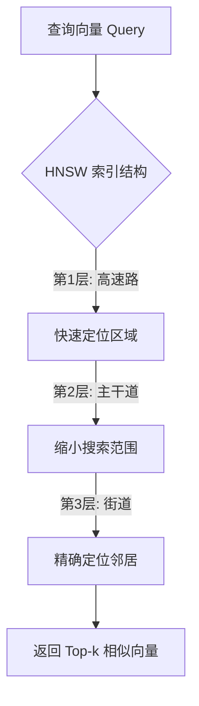
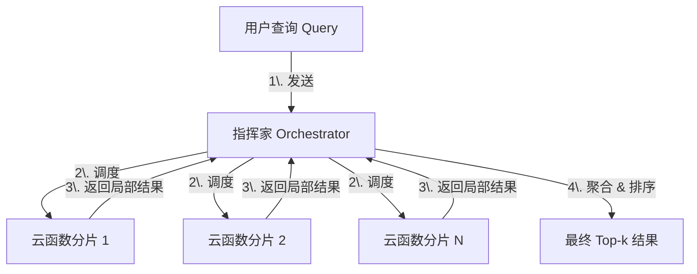
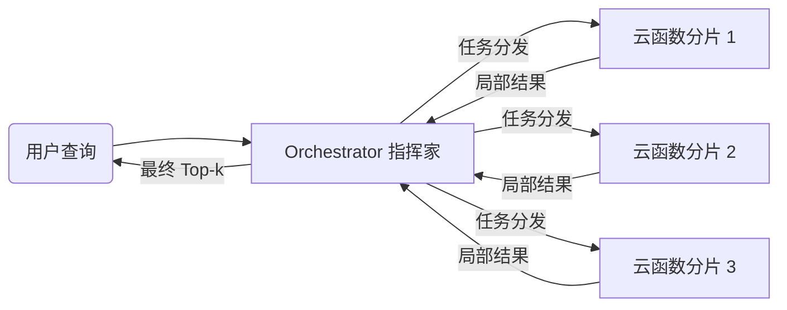

## AI论文解读 | Vexless: A Serverless Vector Data Management System Using Cloud Functions
        
### 作者        
digoal        
        
### 日期        
2025-12-13        
        
### 标签        
PostgreSQL , PolarDB , DuckDB , AI , 论文解读        
        
----        
        
## 背景  
      
https://www.cs.purdue.edu/homes/csjgwang/pubs/SIGMOD24_Vexless.pdf        
  
提示:          
```          
读懂《Vexless: A Serverless Vector Data Management System Using Cloud Functions》这篇论文需要提前掌握哪些基础知识, 请使用中文通熟易懂的讲解这些基础知识, 可以引用论文中的图、表或使用Markdown支持的图形(text,mermaid等)增加解释性. 
  
使用中文通熟易懂的解读《Vexless: A Serverless Vector Data Management System Using Cloud Functions》这篇论文, 其中的关键内容请着重讲解, 可以引用论文中的图、表或使用Markdown支持的图形(text,mermaid等)增加解释性. 
  
提取《Vexless: A Serverless Vector Data Management System Using Cloud Functions》这篇论文中的重要术语, 使用中文对这些术语进行通熟易懂的讲解, 可以引用论文中的图、表或使用Markdown支持的图形(text,mermaid等)增加解释性. 
```     
  
## 1 前置知识 
  
阅读这篇名为《Vexless: A Serverless Vector Data Management System Using Cloud Functions》的论文，你需要建立几个核心领域的知识框架。这篇论文实际上是将 **向量数据库（Vector Database）** 技术与 **无服务器计算（Serverless Computing）** 架构相结合的产物。

为了帮助你更轻松地理解，我将基础知识分为三个模块进行讲解，并结合论文中的概念进行图解。

-----

### 模块一：向量搜索基础 (Vector Search Basics)

这篇论文的核心任务是“在一个巨大的数据库里快速找到相似的图片或文本”。要理解这一点，你需要明白以下概念：

#### 1\. 向量嵌入 (Vector Embeddings)

  * **通俗解释**：计算机看不懂图片或读不懂句子的含义。为了让计算机理解，我们将图片或文本转换成一串长长的数字，这串数字就叫“向量”。意思相近的东西，它们的向量在数学空间里的距离就很近。
  * **论文关联**：论文中使用了 `SIFT10M`、`DEEP10M` 等数据集，这些都是已经转换好的高维向量数据 。

#### 2\. k-NN 与 ANN (k-Nearest Neighbors vs. Approximate Nearest Neighbors)

  * **k-NN (精确搜索)** ：为了找到最相似的 k 个结果，暴力的做法是把查询向量和库里所有向量对比一遍。这在数据量大时太慢了 。
  * **ANN (近似搜索)** ：为了快，我们允许一点点误差。不再对比所有数据，而是通过“索引”快速缩小范围，找到“大概率”最相似的数据。这篇论文关注的就是 ANN 。

#### 3\. HNSW (核心索引算法)

  * **通俗解释**：HNSW (Hierarchical Navigable Small World) 是目前最流行的 ANN 算法之一。你可以把它想象成**城市的交通网**：
      * 最上层是“高速公路”（节点少，跳跃距离大，快速定位大概区域）。
      * 中间层是“主干道”。
      * 最底层是“街道”（节点密，精细查找）。
      * 搜索时，先走高速，再走主干道，最后走街道找到目的地。
  * **论文关联**：Vexless 的底层使用了 HNSW 算法来构建索引 。




-----

### 模块二：无服务器计算架构 (Serverless Computing / FaaS)

Vexless 的创新点在于它不是跑在传统的服务器上，而是跑在“云函数”上。

#### 1\. Serverless vs. 传统虚拟机 (VM)

  * **传统虚拟机 (VM)** ：就像**租房**。不管你住不住，每个月都要付固定的房租。你需要自己打扫卫生（维护系统）。适合连续、稳定的工作负载 。
  * **Serverless (云函数)** ：就像**住酒店**。只有当你去住的时候才计费（按毫秒算），不用时完全不花钱。酒店服务员会帮你打扫（自动管理资源）。适合突发性、稀疏的工作负载 。

#### 2\. 冷启动 (Cold Start)

  * **痛点**：当你去住酒店（调用函数）时，如果前台没人，服务员需要从睡梦中醒来、铺床叠被，这需要时间。这个“唤醒”过程就叫冷启动。
  * **论文关联**：这是 Vexless 要解决的核心难题之一。因为云函数如果不工作就会被“冻结”或回收，下次用需要重新加载，导致搜索变慢  。

#### 3\. 无状态 (Stateless) 与 有状态 (Stateful)

  * **无状态**：普通的云函数像“鱼的记忆”，处理完一个请求就忘了，不保存数据到本地硬盘 。
  * **有状态**：Vexless 使用了 Azure Durable Functions，这是一种特殊的云函数，能通过外部存储“记住”之前的状态。这对协调复杂的搜索任务至关重要 。

-----

### 模块三：分布式数据管理 (Distributed Data Management)

当数据量太大（比如10亿条向量），一个云函数存不下（内存限制），就需要“分治法”。

#### 1\. 分片 (Sharding)

  * **通俗解释**：把一本厚厚的字典撕成 10 薄册，分给 10 个人读。
  * **难点**：如果随意分，可能第1个人分到的特别多，第10个人分到的特别少（负载不均衡）。
  * **论文解法**：论文提到了 **Constrained K-Means (受限 K-Means)** 聚类。普通的 K-Means 可能会分得大小不一，而“受限”版本强制要求每一堆数据的大小差不多，这样每个云函数的内存压力就均衡了 。

**图解：普通聚类 vs. 受限聚类 (Vexless策略)**

| 普通 K-Means (可能导致内存溢出) | 受限 K-Means (Vexless 采用) |
| :--- | :--- |
| Cluster A: ●●●●●●●● (8个, 内存超限) | Cluster A: ●●●●● (5个) |
| Cluster B: ●● (2个, 资源浪费) | Cluster B: ●●●●● (5个) |
| **结果**：有的函数撑死，有的饿死。 | **结果**：大家吃得一样饱，利用率高。 |

#### 2\. 协调器 (Orchestrator) 模式

  * **通俗解释**：就像交响乐团的指挥家。
  * **工作流程**：
    1.  **指挥家 (Orchestrator)** 收到查询请求。
    2.  指挥家判断需要哪几个乐手 (Worker Functions/分片) 干活。
    3.  指挥家唤醒他们。
    4.  乐手们各自演奏 (搜索)。
    5.  指挥家收集所有声音，汇总成最终曲目 (结果) 。

-----

### 总结：读这篇论文的心理预设

当你阅读这篇论文时，请时刻带着以下思维模型：

1.  **场景**：我在做一个向量数据库，但是为了省钱，我想用 Serverless（按次付费）。
2.  **挑战 1 (内存)** ：Serverless 内存很小 。 -\> **解法**：用受限聚类切分数据 (Sharding)。
3.  **挑战 2 (通信)** ：函数之间说话很慢 (HTTP 慢) 。 -\> **解法**：用消息队列和有状态函数 (Communication Optimization)。
4.  **挑战 3 (延迟)** ：函数经常“睡着” (冷启动) 。 -\> **解法**：设计一种机制（Rewind Mechanism）让它们在合适的时候保持“清醒”。

理解了以上基础，你再去读第 3 节的 System Design 和第 4 节的 Experiments，就会发现通顺很多。
  
## 2 解读论文 
  
这篇名为 **《Vexless: A Serverless Vector Data Management System Using Cloud Functions》** 的论文提出了一种创新的思路：利用**无服务器计算（Serverless/Cloud Functions）来构建向量数据库**，以解决传统方案在处理稀疏或突发流量时成本过高的问题。

以下是对 Vexless 系统的通俗化深度解读。

-----

### 1\. 核心背景：为什么要用 Serverless 做向量搜索？

**痛点：**
目前的向量数据库（用于大模型 RAG、图片搜索等）通常运行在虚拟机（VM）上。VM 就像**租房**，不管你住不住，每个月都要付固定的房租。

  * 如果你的应用没什么人访问（稀疏负载），或者流量忽高忽低（突发负载），租一台 24 小时运行的服务器是非常浪费钱的  。

**解决方案：**
Vexless 选择使用 **Serverless 云函数**（如 Azure Functions）。这就像**住酒店**，只有当你发送搜索请求时，服务器才启动并计费，用完即走。

  * **好处**：省钱（按毫秒计费）、自动扩容 。
  * **坏处**：云函数有很多限制（内存小、通信慢、冷启动慢），直接把现有数据库搬上去是用不了的 。

Vexless 的核心贡献就是通过三项关键技术解决了上述“坏处”。

-----

### 2\. 系统架构总览

Vexless 采用了一种 **“指挥家-乐手”** 的分布式架构。

  * **Orchestrator (指挥家)** ：这是一个**有状态**的函数（Stateful Function）。它负责接收用户的查询，指挥具体哪些分片函数去工作，并收集结果 。
  * **Worker Functions (乐手)** ：这些是普通的云函数，每个函数里存储着一部分向量数据的索引（Shard）。它们负责干活（搜索）。




-----

### 3\. 三大关键技术挑战与解决方案

#### 挑战一：云函数内存太小，装不下大索引

云函数通常有严格的内存限制（例如 Azure Function 只有 1.5GB 内存）。如果简单地把数据切分（Sharding），可能会出现“数据倾斜”——有的分片数据太多，直接导致函数内存溢出（OOM）。

**✅ Vexless 解法：受限 K-Means 聚类 (Constrained K-Means)**
Vexless 不使用普通的聚类，而是使用 **“受限”聚类** 算法。

  * **原理**：强制要求每个聚类（分片）的数据量必须均衡，不能超过云函数的内存上限 。
  * **补丁**：为了防止因为强制切分导致搜索精度下降（比如目标向量刚好在两个分片的边界上），Vexless 引入了**冗余索引**，把边界上的点同时存在两个分片里 。

> **对比效果（图3解读）：** 论文中的 Figure 3 显示，普通 K-Means 分片（蓝色柱子）会导致某些分片内存占用极高，超过限制；而 Vexless 的受限分片（橙色柱子）则非常均匀，都在安全范围内 。

  

#### 挑战二：函数之间“打电话”太慢

在分布式搜索中，指挥家需要和多个分片通信。

  * **HTTP 方法**：建立连接太慢，且 Serverless 本身是无状态的，每次都要重新握手 。
  * **中间存储（S3/Blob）** ：读写速度慢，延迟高 。

**✅ Vexless 解法：有状态函数 + 消息队列**
Vexless 使用 **Azure Durable Functions** 作为指挥中心，配合 **Queue Storage** 进行通信 。

  * 这就像从“打电话”（同步等待）变成了“发短信”（异步消息）。指挥家不需要一直等着，分片做完后把结果扔进队列，指挥家不仅能保持状态，还能快速从队列里捞取结果。
  * **效果**：通信延迟从 HTTP 的几毫秒甚至更高，降低到了极低的水平，消除了网络瓶颈 。

#### 挑战三：冷启动（Cold Start）像“起床气”

云函数如果几分钟没人用，就会被系统“冻结”。下次请求来时，它需要重新加载代码和索引（约 1GB 数据），这会导致几秒钟的延迟，用户体验极差 。

**✅ Vexless 解法：智能保活策略 (Rewind & Diligent Search)**
Vexless 设计了一种名为“Rewind”（倒带）的机制：

1.  **自动续命**：如果一个查询命中了某个分片，且这个分片快要“睡着”了（生命周期快结束），系统会自动重置它的倒计时，让它继续保持清醒，以应对可能的后续查询 。
2.  **勤奋搜索 (Diligent Search)** ：利用那些虽然被唤醒但不需要处理当前核心任务的函数，让它们做一些“志愿者”工作（比如进行更彻底的搜索），反正它们已经醒了，不用白不用，以此提高搜索精度 。

-----

### 4\. 实验结果：真的省钱吗？

论文在 SIFT10M、DEEP10M 等数据集上进行了测试，对比了 Vexless 和传统虚拟机（VM）方案。

**💰 成本对比（关键结论）：**

  * **稀疏负载（很久才查一次）** ：Vexless 比 VM 方案**便宜 5.3 倍** 。
  * **突发负载（流量忽高忽低）** ：Vexless 依然保持显著的成本优势，因为它只在有流量时计费 。
  * **持续高负载**：只有当查询量非常密集且持续时（例如持续超过 1000 QPS），VM 才会比 Vexless 便宜 。

**🚀 性能对比：**

  * 在保证低成本的同时，Vexless 的查询延迟（Latency）和准确率（Recall）与 VM 方案相当，甚至在某些情况下更优 。

### 总结

Vexless 证明了在云原生时代，通过精心设计的**分片策略**、**通信机制**和**生命周期管理**，我们可以用 Serverless 技术构建出既**便宜**（针对特定负载）又**高性能**的向量数据库。这对于那些并不是 24 小时都有海量用户访问的 AI 应用来说，是一个极具吸引力的架构选择。
  
## 3 术语 
  
这篇论文《Vexless: A Serverless Vector Data Management System Using Cloud Functions》构建了一个基于“无服务器架构”的向量数据库系统。为了让你更轻松地理解其中的技术细节，我提取了论文中的核心术语，并按**基础架构**、**数据管理**、**优化机制**三个维度进行通俗解读。

-----

### 一、 基础架构类术语

#### 1\. Vexless (系统名)

  * **通俗解释**：这是论文提出的系统名称。你可以把它理解为一个 **“按需付费的向量搜索引擎”** 。它的特点是不像传统数据库那样需要一直租着服务器（哪怕没人用也要付钱），而是建立在云函数之上，只有当你要搜索图片或文本时，它才启动并计费 。

#### 2\. Serverless Cloud Functions (无服务器云函数)

  * **通俗解释**：这是 Vexless 的“原子计算单元”。想象一下，以前你要开一家餐厅，必须长期租店面（传统服务器/虚拟机）。现在有了“云函数”，就像 **“流动摊贩”** ，有客人来了你才出摊，客人走了你立刻收摊。
  * **论文中的作用**：Vexless 将向量搜索的任务拆解，交给一个个云函数去执行。
  * **特点**：
      * **无状态 (Stateless)** ：处理完一个任务就“失忆”，不保存数据到本地 。
      * **资源受限**：每个函数的内存很小（例如 Azure 上只有 1.5GB），不能处理太大的数据 。

#### 3\. Orchestrator (协调器/指挥家)

  * **通俗解释**：因为单个云函数能力有限，Vexless 需要很多云函数协同工作。**Orchestrator** 就是这个乐队的 **“指挥家”** 。
  * **工作流程**：它是一个特殊的“有状态”函数（Global Coordinator）。当查询请求进来时，它负责指挥哪些分片函数去搜索，收集大家的结果，最后整理出最终答案 。




#### 4\. Stateful Functions / Durable Functions (有状态函数)

  * **通俗解释**：普通的云函数是“金鱼记忆”（无状态），但这在复杂的搜索中很麻烦，因为指挥家需要记住任务分发给谁了、谁还没回来。**Stateful Functions** 就是 **“带笔记本的云函数”** ，它利用外部存储记录状态，能记住上下文，专门用来做 Orchestrator，解决了通信和协调的难题 。

-----

### 二、 数据管理与分片术语

#### 5\. Sharding (分片)

  * **通俗解释**：因为一个云函数吃不下所有的向量数据（内存不够），必须把数据切成小块。这个切分的过程就叫**分片** 。

#### 6\. Constrained K-Means (受限 K-Means 聚类)

  * **通俗解释**：这是 Vexless 核心的分片算法。
      * **普通 K-Means**：就像切蛋糕，只管按口味（相似度）切，结果可能一块特别大，一块特别小。大的那块云函数吃不下（内存溢出）。
      * **受限 K-Means**：这是 **“强制均分”** 的切法。它在保证相似数据聚在一起的同时，强制要求每一块的大小都差不多，确保每个云函数都能处理，不会撑死  。

-----

| 普通分片 (Unbalanced) | Vexless 受限分片 (Constrained) |
| :--- | :--- |
| ❌ 有的分片数据量爆表，导致内存溢出。 | ✅ 每个分片数据量均衡，完全适配云函数内存。 |
|  |  |

#### 7\. Boundary Vectors / Redundancy (边界向量与冗余)

  * **通俗解释**：在使用“受限 K-Means”切分数据时，有些数据点可能刚好在两个分片的边界上。如果不小心切错了，搜索时可能找不到它。
  * **Vexless 做法**： **“脚踏两只船”** 。Vexless 允许这些边界上的数据点同时存在于两个分片中（Redundancy）。虽然多占了一点点内存（约 12%），但大大提高了搜索的准确率 。

-----

### 三、 性能优化关键术语

#### 8\. Cold Start (冷启动)

  * **通俗解释**：云函数为了省钱，没任务时会休眠。当你突然叫醒它时，它需要加载代码、加载巨大的索引文件（约 1GB），这需要好几秒钟。这段等待时间就叫 **“冷启动”** ，是 Serverless 最大的性能杀手 。

#### 9\. Rewind Mechanism (倒带机制/自动续命)

  * **通俗解释**：这是 Vexless 解决冷启动的独门绝技。
      * **场景**：云函数通常设定一个存活时间（比如 5 分钟），时间一到就强制下线。
      * **机制**：如果系统发现现在的查询很多（流量来了），它会自动把忙碌函数的“关机倒计时”重置（Rewind），给它 **“续命”** 。这样下一个查询来的时候，函数还是醒着的，不需要冷启动 。

#### 10\. Diligent Search (勤奋搜索)

  * **通俗解释**：利用“已付费”的时间。
      * **原理**：既然某个云函数已经被唤醒了（正在计费周期内），与其让它闲着，不如让它多干点活。Vexless 会让这些醒着的函数去帮忙搜索一些额外的、原本可能被跳过的分片，以此来提高搜索结果的准确度。这叫 **“闲着也是闲着，不如多搜点”** 。

#### 11\. Bursty & Sparse Workloads (突发与稀疏负载)

  * **通俗解释**：这是 Vexless 最擅长的两种应用场景。
      * **Sparse (稀疏)** ：一天没几个人查，或者半夜没人查。传统服务器这会儿也在空转烧钱，Vexless 则完全不花钱 。
      * **Bursty (突发)** ：像“双十一”或者微博热搜，流量突然暴增。Vexless 可以瞬间自动拉起几千个云函数来应对，流量过了又自动缩容 。
  
## 参考        
         
https://www.cs.purdue.edu/homes/csjgwang/pubs/SIGMOD24_Vexless.pdf    
        
<b> 以上内容基于DeepSeek、Qwen、Gemini及诸多AI生成, 轻微人工调整, 感谢杭州深度求索人工智能、阿里云、Google等公司. </b>        
        
<b> AI 生成的内容请自行辨别正确性, 当然也多了些许踩坑的乐趣, 毕竟冒险是每个男人的天性.  </b>        
    
#### [PolarDB 学习图谱](https://www.aliyun.com/database/openpolardb/activity "8642f60e04ed0c814bf9cb9677976bd4")
  
  
#### [PostgreSQL 解决方案集合](../201706/20170601_02.md "40cff096e9ed7122c512b35d8561d9c8")
  
  
#### [德哥 / digoal's Github - 公益是一辈子的事.](https://github.com/digoal/blog/blob/master/README.md "22709685feb7cab07d30f30387f0a9ae")
  
  
#### [About 德哥](https://github.com/digoal/blog/blob/master/me/readme.md "a37735981e7704886ffd590565582dd0")
  
  

  
