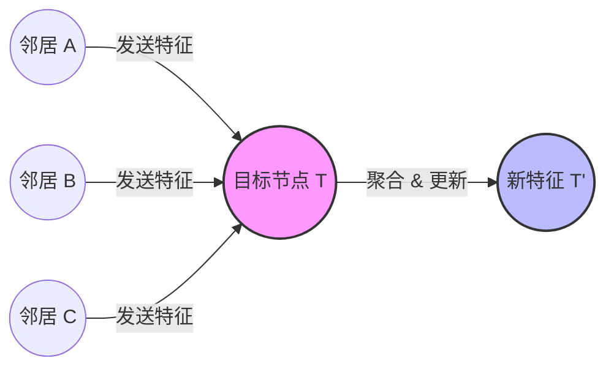
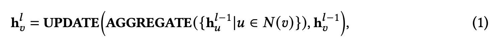
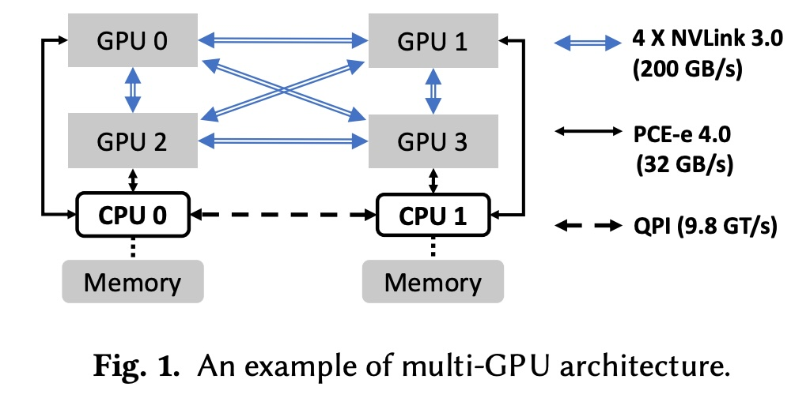
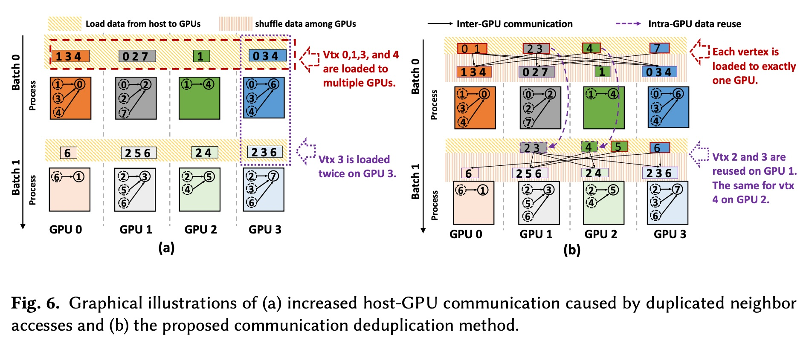
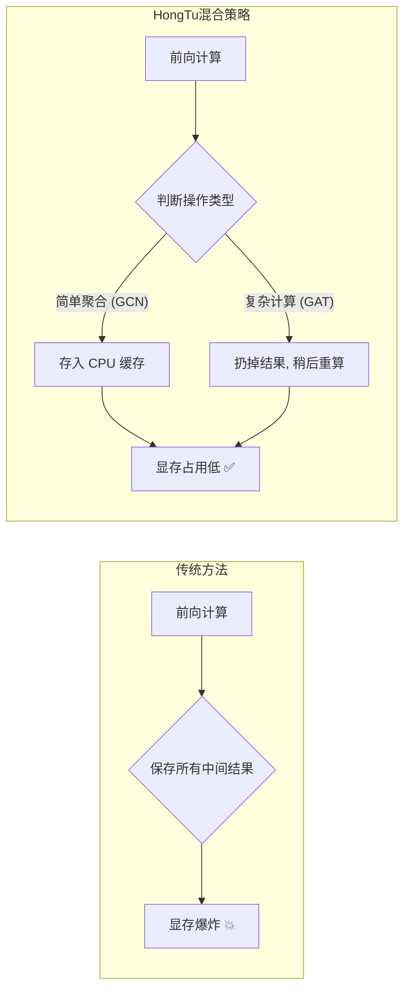
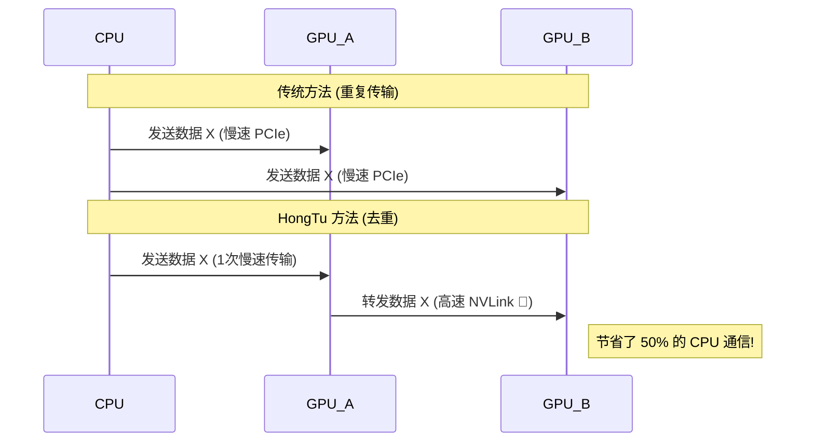
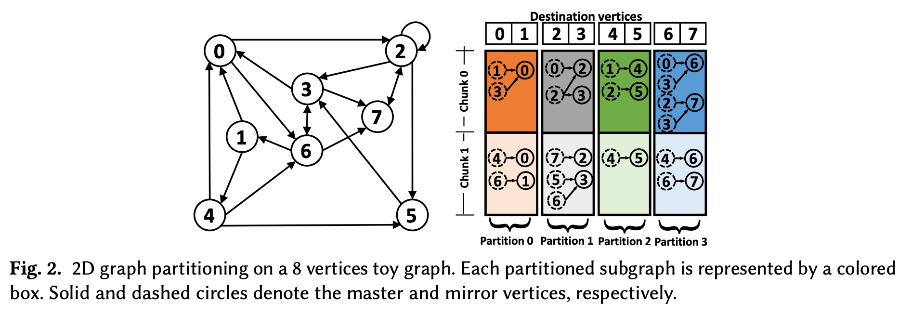
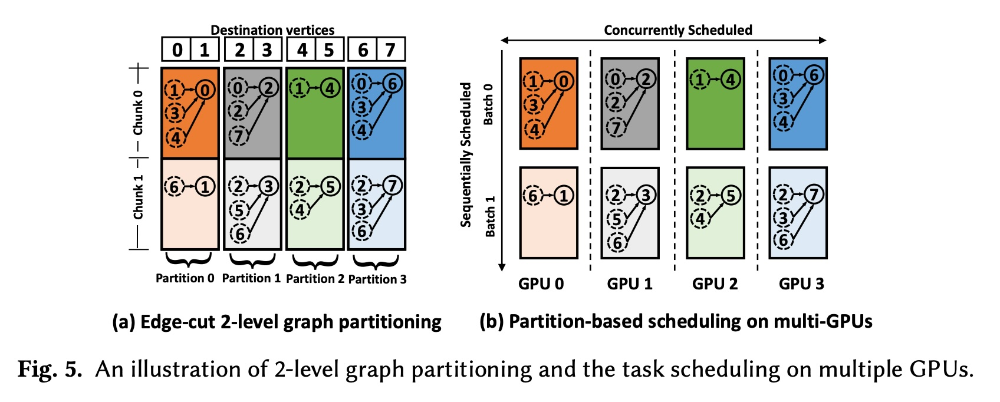
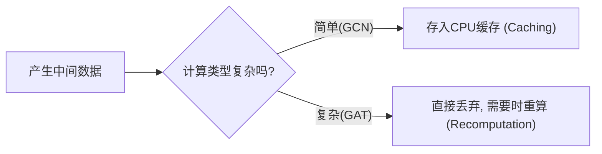
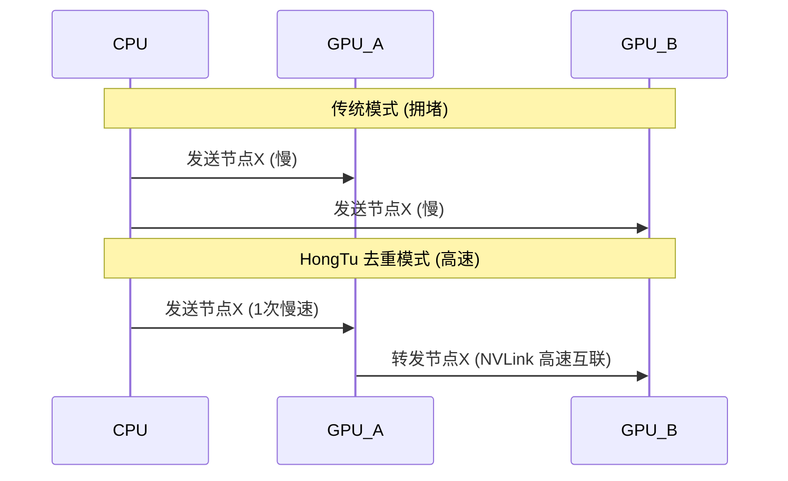

## AI论文解读 | HongTu: Scalable Full-Graph GNN Training on Multiple GPUs
        
### 作者        
digoal        
        
### 日期        
2025-12-13        
        
### 标签        
PostgreSQL , PolarDB , DuckDB , AI , 论文解读        
        
----        
        
## 背景  
      
https://arxiv.org/pdf/2311.14898        
  
提示:          
```          
读懂《HongTu: Scalable Full-Graph GNN Training on Multiple GPUs》这篇论文需要提前掌握哪些基础知识, 请使用中文通熟易懂的讲解这些基础知识, 可以引用论文中的图、表或使用Markdown支持的图形(text,mermaid等)增加解释性. 
  
使用中文通熟易懂的解读《HongTu: Scalable Full-Graph GNN Training on Multiple GPUs》这篇论文, 其中的关键内容请着重讲解, 可以引用论文中的图、表或使用Markdown支持的图形(text,mermaid等)增加解释性. 
  
提取《HongTu: Scalable Full-Graph GNN Training on Multiple GPUs》这篇论文中的重要术语, 使用中文对这些术语进行通熟易懂的讲解, 可以引用论文中的图、表或使用Markdown支持的图形(text,mermaid等)增加解释性. 
```     
  
## 1 前置知识 
  
要读懂这篇名为《HongTu: Scalable Full-Graph GNN Training on Multiple GPUs》的论文，你需要掌握四个核心领域的预备知识。这篇论文主要解决的是 **“图太大，显存放不下，导致训练慢”** 的问题。

以下我将用通俗易懂的语言，配合图示为你讲解这些基础知识。

---

### 1. 图神经网络 (GNN) 的“聚合-更新”机制**核心概念**：GNN 究竟是怎么运算的？
GNN 与传统神经网络最大的不同在于**数据依赖性**。在处理一个节点（Vertex）时，不能只看它自己，必须把它邻居（Neighbors）的信息“抓”过来一起算。

* **聚合 (Aggregate)** ：把周围邻居的信息收集起来（例如求和、取平均）。
* **更新 (Update)** ：结合邻居的信息和自己的信息，通过神经网络变换，得到新的特征。

**为什么这对论文很重要？**
论文中反复提到的“Full-neighbor aggregation”（全邻居聚合）就是指如果不进行采样，这就需要访问大量内存。如果图被切分到了不同的 GPU 上，这种“抓取邻居信息”的操作就会变成跨设备的通信噩梦。



> 
> **论文关联**：论文公式 (1) h_{v}^{l}=UPDATE(AGGREGATE(\{h_{u}^{l-1}|u\in N(v)\}),h_{v}^{l-1}) 讲的就是这个过程 。
> 
> 

  

---

### 2. 全图训练 vs. Mini-batch 训练**核心概念**：怎么把大象装进冰箱（怎么训练大图）？

通常有两种方法处理大图：

1. **Mini-batch (采样)** ：每次只随机选一小部分节点和它们的**部分**邻居来训练。
* *优点*：省内存。
* *缺点*：丢数据，准确率可能下降（Information loss）。


2. **Full-graph (全图)** ：每一层都用所有邻居的完整数据。
* *优点*：准确率高，模型效果好。
* *缺点*：内存爆炸，计算量巨大。


**为什么这对论文很重要？**
HongTu 坚持做 **Full-graph Training** ，因为它效果好。但因为显存不够，它必须把数据放在 CPU 上，这就引出了它的核心痛点： **CPU 和 GPU 之间的数据传输太慢了**。

---

### 3. 硬件架构与通信瓶颈 (The Memory Wall) **核心概念**：为什么要把数据搬来搬去？

在多 GPU 服务器上，存在三种速度截然不同的“路”：

1. **GPU 显存 (HBM)** ：速度极快 (2000 GB/s+)，但容量小 (如 A100 只有 80GB)。
2. **GPU 互联 (NVLink)** ：GPU 之间通信，速度快 (200-600 GB/s)，像高速公路。
3. **CPU-GPU 互联 (PCIe)** ：CPU 传给 GPU，速度慢 (32 GB/s)，像乡村土路。

**可视化解释 (基于论文 Figure 1)** ：

> **图解说明**：
> * 论文图 1 展示了 4 个 GPU 通过蓝色的 **NVLink** 互联（快），但它们都要通过黑色的虚线 **PCIe** 连接到 CPU（慢）。
> 
> 
> * **HongTu 的策略**：因为图太大（TB 级别），GPU 放不下，只能把数据存 CPU（慢内存）。
> * **挑战**：如何尽量少走 PCIe 这条“慢路”，多走 NVLink 这条“快路”？这是 HongTu 的核心贡献之一。
> 
> 
  
  

---

### 4. 图切分与“光环节点” (Halo Nodes) **核心概念**：切蛋糕时，边缘的奶油归谁？

当一张大图被切分成几块（Partitions）分给不同的 GPU 处理时，边界上的节点会很麻烦。
如果 **GPU-0** 负责节点 A，但 A 的邻居 B 在 **GPU-1** 上，为了计算 A，GPU-0 必须去要把 B 的数据复制过来。这个 B 就被称为“Halo Node”或复制节点。

**为什么这对论文很重要？**
这种跨切分的依赖会导致**数据重复传输**。

* 如果节点 B 是很多人的邻居，它可能被 GPU-0 要一次，被 GPU-2 要一次，被 GPU-3 要一次。
* 如果不优化，这些重复的请求都会走那条慢速的 PCIe 总线。
* HongTu 的 **"Deduplicated Communication" (去重通信)** 就是为了解决这个问题 。


**可视化解释 (基于论文 Figure 6a)** ：

> **图解说明**：
> * 在图 6(a) 中，你可以看到红框里的节点（如节点 0, 1）在不同的 GPU 上被重复传输了多次 。
> 
> 
> * HongTu 的做法是只传一次到某一个 GPU，然后让 GPU 之间互相传（走 NVLink 高速路），从而给 PCIe 减负。
> 
> 

  

---

### 5. 重计算 (Recomputation / Gradient Checkpointing) **核心概念**：用“时间”换“空间”。

在深度学习训练中，为了算出梯度（反向传播），通常需要保存前向传播时的“中间结果”（Intermediate Data）。

* **常规做法**：算完前向存起来 -> 显存不够用。
* **重计算**：算完前向就扔掉 -> 反向传播需要时，再重新算一遍 -> 显存省下来了，但速度慢了。

**为什么这对论文很重要？**
GNN 的中间数据非常大。HongTu 提出了一种 **"Recomputation-Caching-Hybrid"** 策略 。

* 简单的运算（如 GCN 的聚合），存在 CPU 里（Cache）。
* 复杂的运算，扔掉重算（Recomputation）。
* 这样既省了显存，又不会让计算时间增加太多。

---

### 总结：阅读路线图带着这些知识去读论文，你的逻辑链应该是这样的：

1. **目标**：我想跑全图 GNN (Full-graph)，因为效果好。
2. **阻碍**：显存太小，放不下十亿级大图。
3. **妥协**：只能把数据放 CPU，需要用的时候通过 PCIe 传给 GPU。
4. **新问题**：PCIe 太慢了，变成了瓶颈。
5. **HongTu 的解法 A (减少存量)** ：利用**重计算**策略，少存点中间数据在显存里 。
6. **HongTu 的解法 B (减少传输)** ：发现邻居数据被重复传输了，设计算法让它们只传一次（**去重**），剩下的通过 GPU 之间互传 。

## 2 解读论文 
  
这篇论文 **《HongTu: Scalable Full-Graph GNN Training on Multiple GPUs》** 介绍了一个名为 **HongTu (宏图)** 的系统。

**一句话总结：** HongTu 是一个能让你用几块普通 GPU（显存有限）就能训练**十亿级节点**超大图神经网络（GNN）的系统，而且速度比单纯用昂贵的 CPU 集群快得多 。

它核心解决的是 **“显存放不下”** 和 **“数据传输慢”** 这两个矛盾。下面我将为你详细解读它的关键设计。

---

### 1. 核心背景与挑战在训练超大图（如社交网络、引文网络）时，最好是进行**全图训练 (Full-Graph Training)** ，因为这样准确率最高 。

但这里有个巨大的**硬件瓶颈**：

* **显存太小**：大图的节点特征和训练中间数据（Intermediate Data）动辄几百 GB 甚至 TB 级，比如 *ogbn-paper* 数据集需要 6TB 内存，而一块 A100 GPU 只有 80GB 。


* **传输太慢**：既然显存放不下，只能把数据存 CPU 内存里，训练时再传给 GPU。但 CPU 和 GPU 之间的通道（PCIe）很窄（慢），传输数据会卡住整个训练流程 。


**HongTu 的使命**：既要把数据放在 CPU 上以节省显存，又要想办法把 CPU-GPU 之间的传输量降到最低，不让它成为瓶颈 。

---

### 2. 关键创新一：像拼图一样切分与管理内存 (Memory-Efficient Framework)为了把大图塞进小显存，HongTu 做了两件事：

#### A. 二级图切分 (2-Level Graph Partitioning)HongTu 不是一股脑把图塞给 GPU，而是把图切得很碎 ：

1. **Level 1 (Partition)** ：先把大图按 GPU 数量切成几大块（Partition），每个 GPU 负责一块。
2. **Level 2 (Chunk)** ：在每个 GPU 内部，再把大块切成无数个小块（Chunk）。
* *好处*：每次训练只需要把这一个小 Chunk 的数据搬进显存，算完就腾地儿，显存占用大大降低 。


#### B. “混合”中间数据管理 (Recomputation-Caching-Hybrid)训练神经网络通常需要保存前向传播（Forward）的中间结果用于反向传播（Backward）。这非常占内存。
HongTu 发现 GNN 有个特点：有些操作（如 GCN 的聚合）计算简单但结果占地大；有些操作（如 GAT 的边计算）计算复杂。

于是它设计了一套**混合策略** ：

* **对于简单操作（如 GCN）** ： **缓存 (Caching)** 。算完的结果直接存回 CPU 内存，反向传播时再读回来。虽然有传输开销，但比重算划算 。


* **对于复杂操作（如 GAT）** ： **重计算 (Recomputation)** 。算完就扔，反向传播时再重新算一遍。虽然多花了计算时间，但省下了宝贵的显存 。




---

### 3. 关键创新二：去重通信框架 (Deduplicated Communication) —— **这是最核心的亮点**在多 GPU 训练图神经网络时，存在一个严重的 **“数据重复搬运”** 问题。
因为图是连通的，切分后，不同 GPU 上的节点可能共享同一个邻居（称为“Halo Nodes”）。如果每个 GPU 都单独去 CPU 请求这个邻居的数据，PCIe 总线就会堵死 。

HongTu 提出了**去重通信 (Deduplicated Communication)** ，核心思想是： **“能蹭车就蹭车，别每个人都自己开车”** 。

#### A. 跨 GPU 去重 (Inter-GPU Deduplication)利用 GPU 之间的高速通道（如 NVLink，速度是 PCIe 的 6 倍以上）。

* **以前**：GPU 0, 1, 2 都需要“节点 A”的数据。它们分别向 CPU 请求 3 次。
* **HongTu**：CPU 只把“节点 A”发给 GPU 0。然后 GPU 1 和 2 直接找 GPU 0 要数据（走 NVLink 高速路）。
* **效果**：原本拥堵的 CPU-GPU 通路（PCIe）的压力瞬间减轻 。


#### B. GPU 内去重 (Intra-GPU Deduplication)利用时间的局部性。

* **以前**：GPU 处理完 Chunk 1，清空显存；接着处理 Chunk 2。如果这两个 Chunk 都需要“节点 B”，就要从 CPU 搬运两次。
* **HongTu**：在调度任务时，看看下一批任务需要谁。如果“节点 B”已经在显存里了，就留着给下一个任务用，不用重新搬 。


#### C. 聪明的任务重排 (Subgraph Reorganization)为了让上述两种“蹭车”效果最大化，HongTu 会在预处理阶段重新排列任务顺序 。

* 它把共享邻居多的 Chunk 排在一起执行，最大化数据复用率，就像把顺路的乘客安排在同一辆车上 。


**(基于论文 Fig 6 的简化示意图)**



  

---

### 4. 实验效果 (Results)论文在 4 块 NVIDIA A100 GPU 上进行了测试，对比了 DistGNN（CPU 集群方案）和其他 GPU 方案 。

* **通信量大幅减少**：相比于直接传输，HongTu 将 CPU-GPU 的通信量减少了 **25% 到 71%** 。


* **速度碾压 CPU 集群**：相比于使用了 16 个 CPU 节点的 DistGNN 系统，HongTu 仅用 4 块 GPU 就实现了 **7.8倍 到 20.2倍** 的加速 。


* **性价比极高**：因为 GPU 数量少，硬件成本显著低于大规模 CPU 集群 。


* **可扩展性 (Scalability)** ：随着 GPU 数量从 1 增加到 4，性能提升接近线性（3.3x - 3.8x），证明了该系统能很好地利用多卡资源 。


### 总结**HongTu** 的成功在于它聪明地“压榨”了现代硬件的特性：

1. 既然显存小，就用精细的切分和混合缓存策略来省着用。
2. 既然 CPU-GPU 传输慢，就利用 GPU 之间超快的 NVLink 来互相分享数据，减少找 CPU 要数据的次数。

这使得在单台多卡服务器上训练超大规模图神经网络成为可能，而且比堆 CPU 机器更便宜、更快。
  
## 3 术语 
  
这篇论文《HongTu: Scalable Full-Graph GNN Training on Multiple GPUs》提出了一种在显存有限的 GPU 上训练超大图神经网络的系统。为了读懂这篇论文，我为你提取并通俗讲解了以下 6 个最核心的术语。

### 1. CPU 数据卸载 (CPU Data Offloading)* **通俗解释**：
这就好比**厨房（GPU 显存）太小，放不下所有的食材（海量图数据）** 。
所以，我们将食材全部存放在空间巨大的**仓库（CPU 内存）** 里。只有当厨师（GPU 计算核心）需要炒某道菜时，才派人去仓库把那部分食材搬到厨房来 。


* **论文中的作用**：
这是 HongTu 的基础架构。因为全图训练的数据量（如 *ogbn-paper* 数据集需要 6TB 内存）远超 GPU 显存（通常仅 80GB），必须把顶点特征存储在 CPU 内存中，计算时再传给 GPU 。


### 2. 两级图切分 (Edge-Cut 2-Level Graph Partitioning)* **通俗解释**：
为了方便“吃”下巨大的图，HongTu 采用了“切两刀”的策略 ：


1. **第一刀 (Partition)** ：把大蛋糕切成几大块，分给不同的 GPU（比如 GPU 0, GPU 1）。这保证了多卡并行工作。
2. **第二刀 (Chunk)** ：在每个 GPU 拿到的大块里，再切成无数个“一口大小”的小块（Chunk）。


* **为什么这么做？** 因为即使分给了 GPU，那一整块可能还是太大塞不进显存。切成 Chunk 后，GPU 每次只用加载这一小口数据，算完就腾地儿，从而极大地节省了显存 。


> **图示参考 (基于图 2 和图 5)** ：
> 图中展示了 Partition（大分区）被进一步切分为 Chunk 0, Chunk 1... 每次只处理一个颜色的框 。
> 
> 

  

  

### 3. 全图训练 (Full-Graph Training)* **通俗解释**：
在学习时，你是把整本教科书的所有知识点关联起来学（全图），还是每次只随机抽几页复印件来学（Mini-batch 采样）？
* **Mini-batch**：省脑子（省内存），但可能漏掉知识点之间的联系，导致考分不高（精度损失）。
* **Full-graph**：虽然费脑子（耗内存、算力大），但能掌握所有细节，模型效果最好 。


* **核心难点**：HongTu 坚持做全图训练以保证高精度，但必须解决这就带来的内存爆炸问题 。


### 4. 重计算与缓存混合管理 (Recomputation-Caching-Hybrid)* **通俗解释**：
在训练中，我们需要保存前向计算的“草稿”（中间数据）以便反向检查（计算梯度）。由于草稿太多，HongTu 采用了一种 **“看情况”** 的策略 ：


* **简单题（如 GCN）** ：草稿很小，算这道题却很费事。策略是 **“缓存”** —— 把草稿存回 CPU 仓库，下次直接拿来用 。


* **复杂题（如 GAT）** ：草稿特别大（占几百 GB），存不下。策略是 **“重计算”** —— 算完就把草稿扔了，等需要检查时，再重新算一遍。虽然多花了点时间，但省下了宝贵的空间 。





### 5. 重复邻居 (Duplicated Neighbors / Halo Nodes)* **通俗解释**：
设想图是一个社交网络。如果把人群切分开， **“大明星”（热门节点）** 可能是很多人的朋友。
* GPU 1 负责的人群认识大明星。
* GPU 2 负责的人群也认识大明星。
* 结果：这个“大明星”的数据被复制了很多份，这就叫重复邻居 。


* **后果**：如果不处理，由于每个分区都要把大明星从 CPU 搬运一次，会导致 CPU 到 GPU 的那条小路（PCIe）严重堵车 。


### 6. 去重通信 (Deduplicated Communication)* **通俗解释**：
这是 HongTu 解决“堵车”的独门绝技 。策略叫 **“只运一次，内部共享”** ：


* **跨 GPU 去重**：既然 GPU 1 和 GPU 2 都需要“大明星”的数据，CPU 就不发两遍了。CPU 只发给 GPU 1，然后 GPU 1 通过它们之间的高速专线（NVLink，比 CPU 线快得多）传给 GPU 2 。


* **GPU 内去重**：如果 GPU 1 现在处理的任务需要“大明星”，下一个任务也需要。那就把“大明星”留在显存里别删，下一个任务直接用（Reuse），不用再找 CPU 要 。


> **数据佐证**：
> 这种“拼车”策略能减少 **25% 到 71%** 的 CPU-GPU 数据传输量，大幅提升速度 。
> 
> 


**(参考论文 Fig. 6 的逻辑)**



  
  
## 参考        
         
https://arxiv.org/pdf/2311.14898    
        
<b> 以上内容基于DeepSeek、Qwen、Gemini及诸多AI生成, 轻微人工调整, 感谢杭州深度求索人工智能、阿里云、Google等公司. </b>        
        
<b> AI 生成的内容请自行辨别正确性, 当然也多了些许踩坑的乐趣, 毕竟冒险是每个男人的天性.  </b>        
    
#### [PolarDB 学习图谱](https://www.aliyun.com/database/openpolardb/activity "8642f60e04ed0c814bf9cb9677976bd4")
  
  
#### [PostgreSQL 解决方案集合](../201706/20170601_02.md "40cff096e9ed7122c512b35d8561d9c8")
  
  
#### [德哥 / digoal's Github - 公益是一辈子的事.](https://github.com/digoal/blog/blob/master/README.md "22709685feb7cab07d30f30387f0a9ae")
  
  
#### [About 德哥](https://github.com/digoal/blog/blob/master/me/readme.md "a37735981e7704886ffd590565582dd0")
  
  

  
