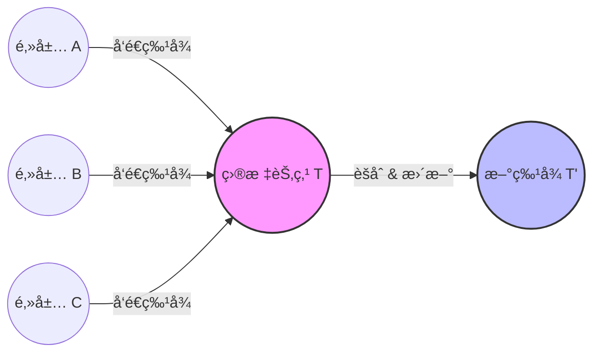
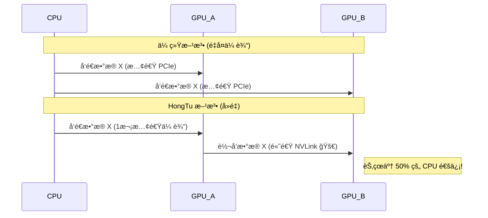
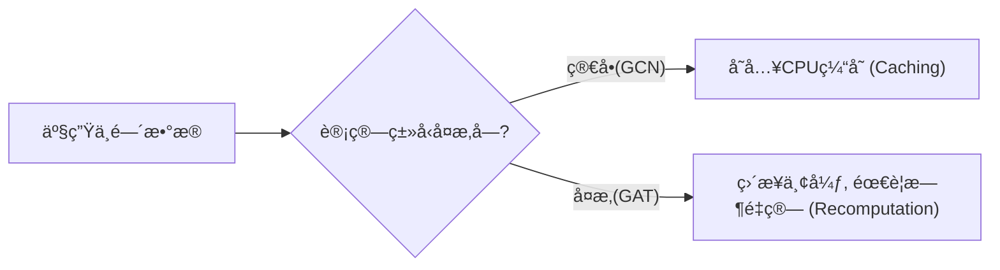
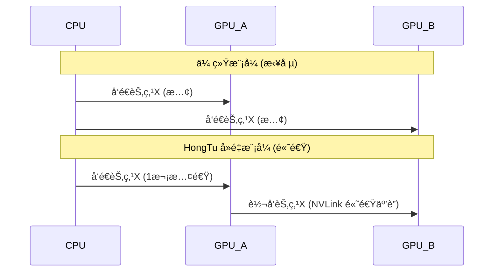

## AI论文解读 | HongTu: Scalable Full-Graph GNN Training on Multiple GPUs
        
### 作者        
digoal        
        
### 日期        
2025-12-13        
        
### 标签        
PostgreSQL , PolarDB , DuckDB , AI , 论文解读        
        
----        
        
## 背景  
      
https://arxiv.org/pdf/2311.14898        
  
æ示:          
```          
读懂《HongTu: Scalable Full-Graph GNN Training on Multiple GPUs》这篇论文需è¦æå‰æŒæ¡å“ªäº›åŸºç¡€çŸ¥è¯†, 请使用中文通熟易懂的讲解这些基础知识, å¯ä»¥å¼•ç”¨è®ºæ–‡ä¸­çš„图ã€è¡¨æˆ–使用Markdown支æŒçš„图形(text,mermaidç­‰)å¢åŠ è§£é‡Šæ€§. 
  
使用中文通熟易懂的解读《HongTu: Scalable Full-Graph GNN Training on Multiple GPUs》这篇论文, 其中的关键内容请ç€é‡è®²è§£, å¯ä»¥å¼•ç”¨è®ºæ–‡ä¸­çš„图ã€è¡¨æˆ–使用Markdown支æŒçš„图形(text,mermaidç­‰)å¢åŠ è§£é‡Šæ€§. 
  
æå–《HongTu: Scalable Full-Graph GNN Training on Multiple GPUs》这篇论文中的é‡è¦æœ¯è¯­, 使用中文对这些术语进行通熟易懂的讲解, å¯ä»¥å¼•ç”¨è®ºæ–‡ä¸­çš„图ã€è¡¨æˆ–使用Markdown支æŒçš„图形(text,mermaidç­‰)å¢åŠ è§£é‡Šæ€§. 
```     
  
## 1 å‰ç½®çŸ¥è¯† 
  
è¦è¯»æ‡‚这篇å为《HongTu: Scalable Full-Graph GNN Training on Multiple GPUs》的论文，你需è¦æŒæ¡å››ä¸ªæ ¸å¿ƒé¢†åŸŸçš„预备知识。这篇论文主è¦è§£å†³çš„是 **“图太大，显存放ä¸ä¸‹ï¼Œå¯¼è‡´è®­ç»ƒæ…¢â€** 的问题。

以下我将用通俗易懂的语言，é…åˆå›¾ç¤ºä¸ºä½ è®²è§£è¿™äº›åŸºç¡€çŸ¥è¯†ã€‚

---

### 1. 图ç¥ç»ç½‘络 (GNN) 的“èšåˆ-æ›´æ–°â€æœºåˆ¶**核心概念**：GNN 究竟是æ€ä¹ˆè¿ç®—的？
GNN ä¸ä¼ ç»Ÿç¥ç»ç½‘络最大的ä¸åŒåœ¨äº**æ•°æ®ä¾èµ–性**。在处ç†ä¸€ä¸ªèŠ‚点（Vertex）时，ä¸èƒ½åªçœ‹å®ƒè‡ªå·±ï¼Œå¿…须把它邻居（Neighbors）的信æ¯â€œæŠ“â€è¿‡æ¥ä¸€èµ·ç®—。

* **èšåˆ (Aggregate)** ：把周围邻居的信æ¯æ”¶é›†èµ·æ¥ï¼ˆä¾‹å¦‚求和ã€å–å¹³å‡ï¼‰ã€‚
* **æ›´æ–° (Update)** ：结åˆé‚»å±…çš„ä¿¡æ¯å’Œè‡ªå·±çš„ä¿¡æ¯ï¼Œé€šè¿‡ç¥ç»ç½‘络å˜æ¢ï¼Œå¾—到新的特å¾ã€‚

**为什么这对论文很é‡è¦ï¼Ÿ**
论文中åå¤æ到的“Full-neighbor aggregationâ€ï¼ˆå…¨é‚»å±…èšåˆï¼‰å°±æ˜¯æŒ‡å¦‚æœä¸è¿›è¡Œé‡‡æ ·ï¼Œè¿™å°±éœ€è¦è®¿é—®å¤§é‡å†…存。如æœå›¾è¢«åˆ‡åˆ†åˆ°äº†ä¸åŒçš„ GPU 上，这ç§â€œæŠ“å–邻居信æ¯â€çš„æ“作就会å˜æˆè·¨è®¾å¤‡çš„通信噩梦。



> 
> **论文关è”**ï¼šè®ºæ–‡å…¬å¼ (1) h_{v}^{l}=UPDATE(AGGREGATE(\{h_{u}^{l-1}|u\in N(v)\}),h_{v}^{l-1}) 讲的就是这个过程 。
> 
> 

  

---

### 2. 全图训练 vs. Mini-batch 训练**核心概念**：æ€ä¹ˆæŠŠå¤§è±¡è£…进冰箱（æ€ä¹ˆè®­ç»ƒå¤§å›¾ï¼‰ï¼Ÿ

通常有两ç§æ–¹æ³•å¤„ç†å¤§å›¾ï¼š

1. **Mini-batch (采样)** ：æ¯æ¬¡åªéšæœºé€‰ä¸€å°éƒ¨åˆ†èŠ‚点和它们的**部分**邻居æ¥è®­ç»ƒã€‚
* *优点*：çœå†…存。
* *缺点*：丢数æ®ï¼Œå‡†ç¡®ç‡å¯èƒ½ä¸‹é™ï¼ˆInformation loss）。


2. **Full-graph (全图)** ：æ¯ä¸€å±‚都用所有邻居的完整数æ®ã€‚
* *优点*：准确ç‡é«˜ï¼Œæ¨¡å‹æ•ˆæœå¥½ã€‚
* *缺点*：内存爆炸，计算é‡å·¨å¤§ã€‚


**为什么这对论文很é‡è¦ï¼Ÿ**
HongTu åšæŒåš **Full-graph Training** ，因为它效æœå¥½ã€‚但因为显存ä¸å¤Ÿï¼Œå®ƒå¿…须把数æ®æ”¾åœ¨ CPU 上，这就引出了它的核心痛点： **CPU å’Œ GPU 之间的数æ®ä¼ è¾“太慢了**。

---

### 3. 硬件æ¶æ„ä¸é€šä¿¡ç“¶é¢ˆ (The Memory Wall) **核心概念**：为什么è¦æŠŠæ•°æ®æ¬æ¥æ¬å»ï¼Ÿ

在多 GPU æœåŠ¡å™¨ä¸Šï¼Œå­˜åœ¨ä¸‰ç§é€Ÿåº¦æˆªç„¶ä¸åŒçš„“路â€ï¼š

1. **GPU 显存 (HBM)** ：速度æå¿« (2000 GB/s+)，但容é‡å° (如 A100 åªæœ‰ 80GB)。
2. **GPU äº’è” (NVLink)** ：GPU 之间通信，速度快 (200-600 GB/s)，åƒé«˜é€Ÿå…¬è·¯ã€‚
3. **CPU-GPU äº’è” (PCIe)** ：CPU ä¼ ç»™ GPU，速度慢 (32 GB/s)，åƒä¹¡æ‘土路。

**å¯è§†åŒ–解释 (基äºè®ºæ–‡ Figure 1)** ：

> **图解说æ˜**：
> * 论文图 1 展示了 4 个 GPU 通过è“色的 **NVLink** 互è”（快），但它们都è¦é€šè¿‡é»‘色的虚线 **PCIe** è¿æ¥åˆ° CPU（慢）。
> 
> 
> * **HongTu çš„ç­–ç•¥**：因为图太大（TB 级别），GPU 放ä¸ä¸‹ï¼Œåªèƒ½æŠŠæ•°æ®å­˜ CPU（慢内存）。
> * **挑战**：如何尽é‡å°‘èµ° PCIe è¿™æ¡â€œæ…¢è·¯â€ï¼Œå¤šèµ° NVLink è¿™æ¡â€œå¿«è·¯â€ï¼Ÿè¿™æ˜¯ HongTu 的核心贡献之一。
> 
> 
  
  

---

### 4. 图切分ä¸â€œå…‰ç¯èŠ‚点†(Halo Nodes) **核心概念**：切蛋糕时，边缘的奶油归è°ï¼Ÿ

当一张大图被切分æˆå‡ å—（Partitions）分给ä¸åŒçš„ GPU 处ç†æ—¶ï¼Œè¾¹ç•Œä¸Šçš„节点会很麻烦。
å¦‚æœ **GPU-0** 负责节点 A，但 A 的邻居 B 在 **GPU-1** 上，为了计算 A，GPU-0 å¿…é¡»å»è¦æŠŠ B çš„æ•°æ®å¤åˆ¶è¿‡æ¥ã€‚这个 B 就被称为“Halo Nodeâ€æˆ–å¤åˆ¶èŠ‚点。

**为什么这对论文很é‡è¦ï¼Ÿ**
è¿™ç§è·¨åˆ‡åˆ†çš„ä¾èµ–会导致**æ•°æ®é‡å¤ä¼ è¾“**。

* 如æœèŠ‚点 B 是很多人的邻居，它å¯èƒ½è¢« GPU-0 è¦ä¸€æ¬¡ï¼Œè¢« GPU-2 è¦ä¸€æ¬¡ï¼Œè¢« GPU-3 è¦ä¸€æ¬¡ã€‚
* 如æœä¸ä¼˜åŒ–，这些é‡å¤çš„请求都会走那æ¡æ…¢é€Ÿçš„ PCIe 总线。
* HongTu çš„ **"Deduplicated Communication" (å»é‡é€šä¿¡)** 就是为了解决这个问题 。


**å¯è§†åŒ–解释 (基äºè®ºæ–‡ Figure 6a)** ：

> **图解说æ˜**：
> * 在图 6(a) 中，你å¯ä»¥çœ‹åˆ°çº¢æ¡†é‡Œçš„节点（如节点 0, 1）在ä¸åŒçš„ GPU 上被é‡å¤ä¼ è¾“了多次 。
> 
> 
> * HongTu çš„åšæ³•æ˜¯åªä¼ ä¸€æ¬¡åˆ°æŸä¸€ä¸ª GPU，然å让 GPU 之间互相传（走 NVLink 高速路），ä»è€Œç»™ PCIe å‡è´Ÿã€‚
> 
> 

  

---

### 5. é‡è®¡ç®— (Recomputation / Gradient Checkpointing) **核心概念**：用“时间â€æ¢â€œç©ºé—´â€ã€‚

在深度学习训练中，为了算出梯度（åå‘传播），通常需è¦ä¿å­˜å‰å‘传播时的“中间结æœâ€ï¼ˆIntermediate Data）。

* **常规åšæ³•**：算完å‰å‘å­˜èµ·æ¥ -> 显存ä¸å¤Ÿç”¨ã€‚
* **é‡è®¡ç®—**：算完å‰å‘å°±æ‰”æ‰ -> åå‘传播需è¦æ—¶ï¼Œå†é‡æ–°ç®—一é -> 显存çœä¸‹æ¥äº†ï¼Œä½†é€Ÿåº¦æ…¢äº†ã€‚

**为什么这对论文很é‡è¦ï¼Ÿ**
GNN 的中间数æ®é常大。HongTu æå‡ºäº†ä¸€ç§ **"Recomputation-Caching-Hybrid"** ç­–ç•¥ 。

* 简å•çš„è¿ç®—（如 GCN çš„èšåˆï¼‰ï¼Œå­˜åœ¨ CPU 里（Cache）。
* å¤æ‚çš„è¿ç®—，扔æ‰é‡ç®—（Recomputation）。
* 这样既çœäº†æ˜¾å­˜ï¼Œåˆä¸ä¼šè®©è®¡ç®—时间å¢åŠ å¤ªå¤šã€‚

---

### 总结：阅读路线图带ç€è¿™äº›çŸ¥è¯†å»è¯»è®ºæ–‡ï¼Œä½ çš„逻辑链应该是这样的：

1. **目标**：我想跑全图 GNN (Full-graph)，因为效æœå¥½ã€‚
2. **阻ç¢**：显存太å°ï¼Œæ”¾ä¸ä¸‹å亿级大图。
3. **妥å**：åªèƒ½æŠŠæ•°æ®æ”¾ CPU，需è¦ç”¨çš„时候通过 PCIe ä¼ ç»™ GPU。
4. **新问题**：PCIe 太慢了，å˜æˆäº†ç“¶é¢ˆã€‚
5. **HongTu 的解法 A (å‡å°‘å­˜é‡)** ：利用**é‡è®¡ç®—**策略，少存点中间数æ®åœ¨æ˜¾å­˜é‡Œ 。
6. **HongTu 的解法 B (å‡å°‘传输)** ：å‘ç°é‚»å±…æ•°æ®è¢«é‡å¤ä¼ è¾“了，设计算法让它们åªä¼ ä¸€æ¬¡ï¼ˆ**å»é‡**），剩下的通过 GPU 之间互传 。

## 2 解读论文 
  
这篇论文 **《HongTu: Scalable Full-Graph GNN Training on Multiple GPUs》** 介ç»äº†ä¸€ä¸ªå为 **HongTu (å®å›¾)** 的系统。

**一å¥è¯æ€»ç»“：** HongTu 是一个能让你用几å—普通 GPU（显存有é™ï¼‰å°±èƒ½è®­ç»ƒ**å亿级节点**超大图ç¥ç»ç½‘络（GNN）的系统，而且速度比å•çº¯ç”¨æ˜‚贵的 CPU 集群快得多 。

它核心解决的是 **“显存放ä¸ä¸‹â€** å’Œ **“数æ®ä¼ è¾“æ…¢â€** 这两个矛盾。下é¢æˆ‘将为你详细解读它的关键设计。

---

### 1. 核心背景ä¸æŒ‘战在训练超大图（如社交网络ã€å¼•æ–‡ç½‘络）时，最好是进行**全图训练 (Full-Graph Training)** ，因为这样准确ç‡æœ€é«˜ 。

但这里有个巨大的**硬件瓶颈**：

* **显存太å°**：大图的节点特å¾å’Œè®­ç»ƒä¸­é—´æ•°æ®ï¼ˆIntermediate Data）动辄几百 GB 甚至 TB 级，比如 *ogbn-paper* æ•°æ®é›†éœ€è¦ 6TB å†…å­˜ï¼Œè€Œä¸€å— A100 GPU åªæœ‰ 80GB 。


* **传输太慢**：既然显存放ä¸ä¸‹ï¼Œåªèƒ½æŠŠæ•°æ®å­˜ CPU 内存里，训练时å†ä¼ ç»™ GPU。但 CPU å’Œ GPU 之间的通é“（PCIe）很窄（慢），传输数æ®ä¼šå¡ä½æ•´ä¸ªè®­ç»ƒæµç¨‹ 。


**HongTu 的使命**：既è¦æŠŠæ•°æ®æ”¾åœ¨ CPU 上以节çœæ˜¾å­˜ï¼Œåˆè¦æƒ³åŠæ³•æŠŠ CPU-GPU 之间的传输é‡é™åˆ°æœ€ä½ï¼Œä¸è®©å®ƒæˆä¸ºç“¶é¢ˆ 。

---

### 2. 关键创新一：åƒæ‹¼å›¾ä¸€æ ·åˆ‡åˆ†ä¸ç®¡ç†å†…å­˜ (Memory-Efficient Framework)为了把大图å¡è¿›å°æ˜¾å­˜ï¼ŒHongTu åšäº†ä¸¤ä»¶äº‹ï¼š

#### A. 二级图切分 (2-Level Graph Partitioning)HongTu ä¸æ˜¯ä¸€è‚¡è„‘把图å¡ç»™ GPUï¼Œè€Œæ˜¯æŠŠå›¾åˆ‡å¾—å¾ˆç¢ ï¼š

1. **Level 1 (Partition)** ：先把大图按 GPU æ•°é‡åˆ‡æˆå‡ å¤§å—（Partition），æ¯ä¸ª GPU 负责一å—。
2. **Level 2 (Chunk)** ：在æ¯ä¸ª GPU 内部，å†æŠŠå¤§å—切æˆæ— æ•°ä¸ªå°å—（Chunk）。
* *好处*：æ¯æ¬¡è®­ç»ƒåªéœ€è¦æŠŠè¿™ä¸€ä¸ªå° Chunk çš„æ•°æ®æ¬è¿›æ˜¾å­˜ï¼Œç®—完就腾地儿，显存å ç”¨å¤§å¤§é™ä½ 。


#### B. “混åˆâ€ä¸­é—´æ•°æ®ç®¡ç† (Recomputation-Caching-Hybrid)训练ç¥ç»ç½‘络通常需è¦ä¿å­˜å‰å‘传播（Forward）的中间结æœç”¨äºåå‘传播（Backward）。这é常å å†…存。
HongTu å‘ç° GNN 有个特点：有些æ“作（如 GCN çš„èšåˆï¼‰è®¡ç®—简å•ä½†ç»“æœå åœ°å¤§ï¼›æœ‰äº›æ“作（如 GAT 的边计算）计算å¤æ‚。

äºæ˜¯å®ƒè®¾è®¡äº†ä¸€å¥—**æ··åˆç­–ç•¥** ：

* **对äºç®€å•æ“作（如 GCN）** ： **缓存 (Caching)** 。算完的结æœç›´æ¥å­˜å› CPU 内存，åå‘ä¼ æ’­æ—¶å†è¯»å›æ¥ã€‚虽然有传输开销，但比é‡ç®—划算 。


* **对äºå¤æ‚æ“作（如 GAT）** ： **é‡è®¡ç®— (Recomputation)** 。算完就扔，åå‘ä¼ æ’­æ—¶å†é‡æ–°ç®—一é。虽然多花了计算时间，但çœä¸‹äº†å®è´µçš„显存 。


```mermaid
graph LR
    subgraph 传统方法
    A[å‰å‘计算] --> B{ä¿å­˜æ‰€æœ‰ä¸­é—´ç»“æœ}
    B --> C[显存爆炸 💥]
    end
    
    subgraph HongTuæ··åˆç­–ç•¥
    D[å‰å‘计算] --> E{判断æ“作类å‹}
    E -->|"简å•èšåˆ (GCN)"| F[存入 CPU 缓存]
    E -->|"å¤æ‚计算 (GAT)"| G[扔æ‰ç»“æœ, ç¨åé‡ç®—]
    F --> H[显存å ç”¨ä½ ✅]
    G --> H
    end
```

---

### 3. 关键创新二：å»é‡é€šä¿¡æ¡†æ¶ (Deduplicated Communication) —— **这是最核心的亮点**在多 GPU 训练图ç¥ç»ç½‘络时，存在一个严é‡çš„ **“数æ®é‡å¤æ¬è¿â€** 问题。
因为图是è¿é€šçš„，切分å，ä¸åŒ GPU 上的节点å¯èƒ½å…±äº«åŒä¸€ä¸ªé‚»å±…（称为“Halo Nodesâ€ï¼‰ã€‚如æœæ¯ä¸ª GPU 都å•ç‹¬å» CPU 请求这个邻居的数æ®ï¼ŒPCIe 总线就会堵死 。

HongTu æ出了**å»é‡é€šä¿¡ (Deduplicated Communication)** ，核心æ€æƒ³æ˜¯ï¼š **“能蹭车就蹭车，别æ¯ä¸ªäººéƒ½è‡ªå·±å¼€è½¦â€** 。

#### A. è·¨ GPU å»é‡ (Inter-GPU Deduplication)利用 GPU 之间的高速通é“（如 NVLink，速度是 PCIe çš„ 6 å€ä»¥ä¸Šï¼‰ã€‚

* **以å‰**：GPU 0, 1, 2 都需è¦â€œèŠ‚点 Aâ€çš„æ•°æ®ã€‚å®ƒä»¬åˆ†åˆ«å‘ CPU 请求 3 次。
* **HongTu**：CPU åªæŠŠâ€œèŠ‚点 Aâ€å‘ç»™ GPU 0。然å GPU 1 å’Œ 2 ç›´æ¥æ‰¾ GPU 0 è¦æ•°æ®ï¼ˆèµ° NVLink 高速路）。
* **效æœ**：åŸæœ¬æ‹¥å µçš„ CPU-GPU 通路（PCIe）的å‹åŠ›ç¬é—´å‡è½» 。


#### B. GPU 内å»é‡ (Intra-GPU Deduplication)利用时间的局部性。

* **以å‰**：GPU 处ç†å®Œ Chunk 1，清空显存；æ¥ç€å¤„ç† Chunk 2。如æœè¿™ä¸¤ä¸ª Chunk 都需è¦â€œèŠ‚点 Bâ€ï¼Œå°±è¦ä» CPU æ¬è¿ä¸¤æ¬¡ã€‚
* **HongTu**：在调度任务时，看看下一批任务需è¦è°ã€‚如æœâ€œèŠ‚点 Bâ€å·²ç»åœ¨æ˜¾å­˜é‡Œäº†ï¼Œå°±ç•™ç€ç»™ä¸‹ä¸€ä¸ªä»»åŠ¡ç”¨ï¼Œä¸ç”¨é‡æ–°æ¬ 。


#### C. èªæ˜çš„任务é‡æ’ (Subgraph Reorganization)为了让上述两ç§â€œè¹­è½¦â€æ•ˆæœæœ€å¤§åŒ–，HongTu 会在预处ç†é˜¶æ®µé‡æ–°æ’åˆ—ä»»åŠ¡é¡ºåº ã€‚

* 它把共享邻居多的 Chunk æ’在一起执行，最大化数æ®å¤ç”¨ç‡ï¼Œå°±åƒæŠŠé¡ºè·¯çš„乘客安æ’在åŒä¸€è¾†è½¦ä¸Š 。


**(基äºè®ºæ–‡ Fig 6 的简化示æ„图)**



  

---

### 4. å®éªŒæ•ˆæœ (Results)论文在 4 å— NVIDIA A100 GPU 上进行了测试，对比了 DistGNN（CPU 集群方案）和其他 GPU 方案 。

* **通信é‡å¤§å¹…å‡å°‘**：相比äºç›´æ¥ä¼ è¾“，HongTu å°† CPU-GPU 的通信é‡å‡å°‘了 **25% 到 71%** 。


* **é€Ÿåº¦ç¢¾å‹ CPU 集群**：相比äºä½¿ç”¨äº† 16 个 CPU 节点的 DistGNN 系统，HongTu 仅用 4 å— GPU å°±å®ç°äº† **7.8å€ åˆ° 20.2å€** 的加速 。


* **性价比æ高**：因为 GPU æ•°é‡å°‘，硬件æˆæœ¬æ˜¾è‘—ä½äºå¤§è§„模 CPU 集群 。


* **å¯æ‰©å±•æ€§ (Scalability)** ：éšç€ GPU æ•°é‡ä» 1 å¢åŠ åˆ° 4，性能æå‡æ¥è¿‘线性（3.3x - 3.8x），è¯æ˜äº†è¯¥ç³»ç»Ÿèƒ½å¾ˆå¥½åœ°åˆ©ç”¨å¤šå¡èµ„æº ã€‚


### 总结**HongTu** çš„æˆåŠŸåœ¨äºå®ƒèªæ˜åœ°â€œå‹æ¦¨â€äº†ç°ä»£ç¡¬ä»¶çš„特性：

1. 既然显存å°ï¼Œå°±ç”¨ç²¾ç»†çš„切分和混åˆç¼“存策略æ¥çœç€ç”¨ã€‚
2. 既然 CPU-GPU 传输慢，就利用 GPU 之间超快的 NVLink æ¥äº’相分享数æ®ï¼Œå‡å°‘找 CPU è¦æ•°æ®çš„次数。

这使得在å•å°å¤šå¡æœåŠ¡å™¨ä¸Šè®­ç»ƒè¶…大规模图ç¥ç»ç½‘络æˆä¸ºå¯èƒ½ï¼Œè€Œä¸”比堆 CPU 机器更便宜ã€æ›´å¿«ã€‚
  
## 3 术语 
  
这篇论文《HongTu: Scalable Full-Graph GNN Training on Multiple GPUs》æ出了一ç§åœ¨æ˜¾å­˜æœ‰é™çš„ GPU 上训练超大图ç¥ç»ç½‘络的系统。为了读懂这篇论文，我为你æå–并通俗讲解了以下 6 个最核心的术语。

### 1. CPU æ•°æ®å¸è½½ (CPU Data Offloading)* **通俗解释**：
这就好比**å¨æˆ¿ï¼ˆGPU 显存）太å°ï¼Œæ”¾ä¸ä¸‹æ‰€æœ‰çš„食æ（海é‡å›¾æ•°æ®ï¼‰** 。
所以，我们将食æ全部存放在空间巨大的**仓库（CPU 内存）** 里。åªæœ‰å½“å¨å¸ˆï¼ˆGPU 计算核心）需è¦ç‚’æŸé“èœæ—¶ï¼Œæ‰æ´¾äººå»ä»“库把那部分食ææ¬åˆ°å¨æˆ¿æ¥ 。


* **论文中的作用**：
这是 HongTu 的基础æ¶æ„。因为全图训练的数æ®é‡ï¼ˆå¦‚ *ogbn-paper* æ•°æ®é›†éœ€è¦ 6TB 内存）远超 GPU 显存（通常仅 80GB），必须把顶点特å¾å­˜å‚¨åœ¨ CPU 内存中，计算时å†ä¼ ç»™ GPU 。


### 2. 两级图切分 (Edge-Cut 2-Level Graph Partitioning)* **通俗解释**：
为了方便“åƒâ€ä¸‹å·¨å¤§çš„图，HongTu 采用了“切两刀â€çš„ç­–ç•¥ ：


1. **第一刀 (Partition)** ：把大蛋糕切æˆå‡ å¤§å—，分给ä¸åŒçš„ GPU（比如 GPU 0, GPU 1）。这ä¿è¯äº†å¤šå¡å¹¶è¡Œå·¥ä½œã€‚
2. **第二刀 (Chunk)** ：在æ¯ä¸ª GPU 拿到的大å—里，å†åˆ‡æˆæ— æ•°ä¸ªâ€œä¸€å£å¤§å°â€çš„å°å—（Chunk）。


* **为什么这么åšï¼Ÿ** 因为å³ä½¿åˆ†ç»™äº† GPU，那一整å—å¯èƒ½è¿˜æ˜¯å¤ªå¤§å¡ä¸è¿›æ˜¾å­˜ã€‚åˆ‡æˆ Chunk å，GPU æ¯æ¬¡åªç”¨åŠ è½½è¿™ä¸€å°å£æ•°æ®ï¼Œç®—完就腾地儿，ä»è€Œæ大地节çœäº†æ˜¾å­˜ 。


> **图示å‚考 (基äºå›¾ 2 和图 5)** ：
> 图中展示了 Partition（大分区）被进一步切分为 Chunk 0, Chunk 1... æ¯æ¬¡åªå¤„ç†ä¸€ä¸ªé¢œè‰²çš„框 。
> 
> 

  

  

### 3. 全图训练 (Full-Graph Training)* **通俗解释**：
在学习时，你是把整本教科书的所有知识点关è”èµ·æ¥å­¦ï¼ˆå…¨å›¾ï¼‰ï¼Œè¿˜æ˜¯æ¯æ¬¡åªéšæœºæŠ½å‡ é¡µå¤å°ä»¶æ¥å­¦ï¼ˆMini-batch 采样）？
* **Mini-batch**：çœè„‘å­ï¼ˆçœå†…存），但å¯èƒ½æ¼æ‰çŸ¥è¯†ç‚¹ä¹‹é—´çš„è”系，导致考分ä¸é«˜ï¼ˆç²¾åº¦æŸå¤±ï¼‰ã€‚
* **Full-graph**：虽然费脑å­ï¼ˆè€—内存ã€ç®—力大），但能æŒæ¡æ‰€æœ‰ç»†èŠ‚，模å‹æ•ˆæœæœ€å¥½ 。


* **核心难点**：HongTu åšæŒåšå…¨å›¾è®­ç»ƒä»¥ä¿è¯é«˜ç²¾åº¦ï¼Œä½†å¿…须解决这就带æ¥çš„内存爆炸问题 。


### 4. é‡è®¡ç®—ä¸ç¼“存混åˆç®¡ç† (Recomputation-Caching-Hybrid)* **通俗解释**：
在训练中，我们需è¦ä¿å­˜å‰å‘计算的“è‰ç¨¿â€ï¼ˆä¸­é—´æ•°æ®ï¼‰ä»¥ä¾¿åå‘检查（计算梯度）。由äºè‰ç¨¿å¤ªå¤šï¼ŒHongTu é‡‡ç”¨äº†ä¸€ç§ **“看情况â€** çš„ç­–ç•¥ ：


* **简å•é¢˜ï¼ˆå¦‚ GCN）** ：è‰ç¨¿å¾ˆå°ï¼Œç®—è¿™é“题å´å¾ˆè´¹äº‹ã€‚策略是 **“缓存â€** —— 把è‰ç¨¿å­˜å› CPU 仓库，下次直æ¥æ‹¿æ¥ç”¨ 。


* **å¤æ‚题（如 GAT）** ：è‰ç¨¿ç‰¹åˆ«å¤§ï¼ˆå å‡ ç™¾ GB），存ä¸ä¸‹ã€‚策略是 **“é‡è®¡ç®—â€** —— 算完就把è‰ç¨¿æ‰”了，等需è¦æ£€æŸ¥æ—¶ï¼Œå†é‡æ–°ç®—一é。虽然多花了点时间，但çœä¸‹äº†å®è´µçš„空间 。





### 5. é‡å¤é‚»å±… (Duplicated Neighbors / Halo Nodes)* **通俗解释**：
设想图是一个社交网络。如æœæŠŠäººç¾¤åˆ‡åˆ†å¼€ï¼Œ **“大æ˜æ˜Ÿâ€ï¼ˆçƒ­é—¨èŠ‚点）** å¯èƒ½æ˜¯å¾ˆå¤šäººçš„朋å‹ã€‚
* GPU 1 负责的人群认识大æ˜æ˜Ÿã€‚
* GPU 2 负责的人群也认识大æ˜æ˜Ÿã€‚
* 结æœï¼šè¿™ä¸ªâ€œå¤§æ˜æ˜Ÿâ€çš„æ•°æ®è¢«å¤åˆ¶äº†å¾ˆå¤šä»½ï¼Œè¿™å°±å«é‡å¤é‚»å±… 。


* **åæœ**：如æœä¸å¤„ç†ï¼Œç”±äºæ¯ä¸ªåˆ†åŒºéƒ½è¦æŠŠå¤§æ˜æ˜Ÿä» CPU æ¬è¿ä¸€æ¬¡ï¼Œä¼šå¯¼è‡´ CPU 到 GPU çš„é‚£æ¡å°è·¯ï¼ˆPCIe）严é‡å µè½¦ 。


### 6. å»é‡é€šä¿¡ (Deduplicated Communication)* **通俗解释**：
这是 HongTu 解决“堵车â€çš„独门ç»æŠ€ ã€‚ç­–ç•¥å« **“åªè¿ä¸€æ¬¡ï¼Œå†…部共享â€** ：


* **è·¨ GPU å»é‡**：既然 GPU 1 å’Œ GPU 2 都需è¦â€œå¤§æ˜æ˜Ÿâ€çš„æ•°æ®ï¼ŒCPU å°±ä¸å‘两é了。CPU åªå‘ç»™ GPU 1，然å GPU 1 通过它们之间的高速专线（NVLink，比 CPU 线快得多）传给 GPU 2 。


* **GPU 内å»é‡**ï¼šå¦‚æœ GPU 1 ç°åœ¨å¤„ç†çš„任务需è¦â€œå¤§æ˜æ˜Ÿâ€ï¼Œä¸‹ä¸€ä¸ªä»»åŠ¡ä¹Ÿéœ€è¦ã€‚那就把“大æ˜æ˜Ÿâ€ç•™åœ¨æ˜¾å­˜é‡Œåˆ«åˆ ï¼Œä¸‹ä¸€ä¸ªä»»åŠ¡ç›´æ¥ç”¨ï¼ˆReuse），ä¸ç”¨å†æ‰¾ CPU è¦ ã€‚


> **æ•°æ®ä½è¯**：
> è¿™ç§â€œæ‹¼è½¦â€ç­–略能å‡å°‘ **25% 到 71%** çš„ CPU-GPU æ•°æ®ä¼ è¾“é‡ï¼Œå¤§å¹…æå‡é€Ÿåº¦ 。
> 
> 


**(å‚考论文 Fig. 6 的逻辑)**



  
  
## å‚考        
         
https://arxiv.org/pdf/2311.14898    
        
<b> 以上内容基äºDeepSeekã€Qwenã€GeminiåŠè¯¸å¤šAI生æˆ, 轻微人工调整, æ„Ÿè°¢æ­å·æ·±åº¦æ±‚索人工智能ã€é˜¿é‡Œäº‘ã€Google等公å¸. </b>        
        
<b> AI 生æˆçš„内容请自行辨别正确性, 当然也多了些许踩å‘çš„ä¹è¶£, 毕竟冒险是æ¯ä¸ªç”·äººçš„天性.  </b>        
    
#### [PolarDB 学习图谱](https://www.aliyun.com/database/openpolardb/activity "8642f60e04ed0c814bf9cb9677976bd4")
  
  
#### [PostgreSQL 解决方案集åˆ](../201706/20170601_02.md "40cff096e9ed7122c512b35d8561d9c8")
  
  
#### [å¾·å“¥ / digoal's Github - 公益是一辈å­çš„事.](https://github.com/digoal/blog/blob/master/README.md "22709685feb7cab07d30f30387f0a9ae")
  
  
#### [About å¾·å“¥](https://github.com/digoal/blog/blob/master/me/readme.md "a37735981e7704886ffd590565582dd0")
  
  

  
