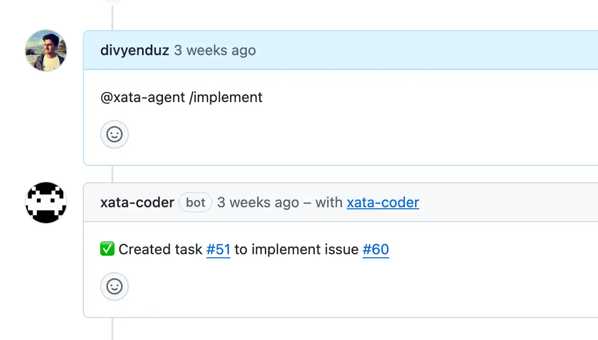

## 复刻人类开发者  
      
### 作者      
digoal      
      
### 日期      
2025-12-13      
      
### 标签      
PostgreSQL , 人类开发者 , Xata , AI Agent    
      
----      
      
## 背景      
如何让AI Agent像人类开发者一样工作?  
  
Xata 正在这么干, 他们准备用AI Agent复刻人类开发者. 构建一个 AI 编码代理 (AI coding agent)，该代理能够模仿人类开发者的完整工作流程 (full developer workflow)，以在应用代码库中实现功能或修复错误.  
  
**关键点：**  
  
1.  **AI 代理 (AI Agent)** ：Xata 构建的代理（基于 **LLMs**）可以接收任务（例如一个 GitHub Issue 的描述）。  
2.  **完整工作流程 (Full Workflow)** ：该代理可以**自主地** (autonomously) 完成开发任务的整个流程：  
    * 克隆代码到**沙箱** (sandbox)。  
    * 为任务创建 **Git 分支**。  
    * 最重要的一点：为这个新功能或 Bug 修复创建一个 **Xata 数据库预览分支 (preview database branch)** 。  
    * 在沙箱中修改**应用代码** (application code) 和**数据库模式** (database schema)。  
    * 运行数据库**迁移** (migrations)，并在该**预览分支**上进行测试。  
    * 通过 **commit** 将更改推送到 **PR (拉取请求)** 。  
3.  **Postgres 分支的作用**：代理使用 **Xata 的数据库分支功能**，即**Postgres 分支 (Postgres branches)** ，来为**拉取请求 (PR)** 创建一个**与生产数据结构一致**、但**安全且隔离**的数据库环境。这个环境用于**验证**代理所做的**应用代码更改**和**数据库模式更改**是否有效，而**不是**用于验证 PostgreSQL **内核代码**的开发效果。  
  
AI 代理使用 **Xata 创建的“预览数据库分支” (preview database branch)** 来验证效果。这个预览分支是**隔离**且 **PII 安全 (PII safe)** 的，它基于生产实例，但**不是生产实例本身**。它是在一个**沙箱环境 (sandbox environment)** 中运行和测试的，这正是为了避免直接在用户的**生产环境 (production environment)** 上进行验证。  
  
核心术语  
  
| 术语 (原文) | 翻译 (译文) | 文章中的作用 |  
| :--- | :--- | :--- |  
| **AI Coding Agent** | AI 编码代理 | 接收任务，自主编写代码和执行整个开发流程的 AI 助手。 |  
| **Postgres Branches** | Postgres 分支 | Xata 提供的数据库功能，用于为每个 PR 或任务创建**隔离、临时的数据库副本**，以供代理在**沙箱**中安全地测试更改。 |  
| **Developer Workflow** | 开发者工作流程 | 代理所模仿的步骤序列：创建分支 -> 获取数据 -> 修复代码 -> 运行迁移 -> 提交 PR。 |  
| **Sandbox** | 沙箱 | 一个**隔离**的环境，代理可以在其中**安全地执行代码** (run code)，运行测试和迁移，而不会影响生产环境。 |  
  
Xata 的目标是**自动化应用层面的开发和运维 (DevOps)** ，而不是参与到 PostgreSQL 内核的开发中。  
  
以下内容来自: https://xata.io/blog/a-coding-agent-that-uses-postgres-branches  
  
  
## 闭环：构建一个使用 Postgres 分支 (Postgres branches) 的编码代理 (coding agent)  
  
**摘要:** 探索如何构建一个遵循完整**开发者工作流程** (developer workflow) 的 AI 编码代理 (AI coding agent)，包括使用 Xata、Vercel 和 GitHub 创建 **Postgres 分支** (Postgres branches)、使用**沙箱** (sandbox)、修复错误以及发起**拉取请求** (pull requests)。  
  
**作者:** Divyendu Singh  
  
我最近在柏林 PostgreSQL **见面会** (meetup) 上展示了 **Xata Agent**，展示了我们如何使用 Xata Agent 在生产环境中管理和调整一队 PostgreSQL 实例。以下是回顾。  
  
简而言之：  
  
**Xata Agent** 是一个**开源代理** (open source agent)，它监控您的数据库，找到问题的根本原因，并提出修复和改进建议。它就像您的团队中来了一位新的 **SRE**（**站点可靠性工程师**）新人，一位在 **Postgres** 方面拥有丰富经验的新人。  
  
在见面会之后，一个多次被提出的问题是关于如何让代理也“看到”代码（除了 **PostgreSQL 日志和统计数据**），从而为代理**自主** (autonomously) 解决问题或在解决问题方面走得更远，实现“**闭环**” (**closing the loop**)。  
  
这促使我们探索，如果让一个 **AI 代理** (**AI agent**) 访问代码和真实数据（通过**数据库分支** (**database branching**)），拥有在**沙箱** (**sandbox**) 中运行代码的能力，以及**提交** (**commit**) 更改到 **PR**（**拉取请求**）的能力，会是什么样子。从本质上讲，这意味着为代理提供与开发者在构建功能或修复错误时使用的相同工具的访问权限。  
  
在这篇博客文章中，我们展示了使用**自定义代理** (**custom agent**) 以及允许其与 **GitHub**、**Sandbox** 和 **Xata 分支** (**Xata branches**) 交互的工具的工作流程，但也可以使用现有工作流程（如 `claude`、`gh` 和 `xata CLIs`，即**命令行界面**）来实现相同的目标。我们将在未来的博客文章中介绍这种方法。  
  
-----  
  
## 演示，又名 “让我看看你的本事” (Demo aka “show me what you got”)  
  
我可以听到你们中的一些人已经在说 “让我看看你的本事”  
（来自《瑞克和莫蒂》的 “Show me what you got”）  
  
  
  
这里有一个 3 分钟的演示来展示我的意思：  
  
在演示中，您可以看到代理能够**克隆** (**clone**) 仓库到**沙箱** (**sandbox**) 中，将**环境变量** (**environment variables**) 中的**数据库 URL** (**database URL**) 更改为为该 **PR** 创建的 **Xata 分支**，并仅根据**问题描述** (**issue description**) **自主** (**autonomously**) 实现该功能。  
  
由于我们使用 **PR** 作为交互点，人类开发者可以**检出** (**checkout**) 该 **PR** 并与 **AI 代理**一起贡献。  
  
-----  
  
## 工作流程 (The Workflow)  
  
如果一个开发者必须构建一个功能或修复一个错误，通常涉及遵循一些固定的事件序列，例如：  
  
1.  创建一个 **Git 分支** (git branch)  
2.  从**生产数据库** (**production database**) 获取足够的数据或**播种** (**seed**) 数据，以便能够**重现问题** (**reproduce the issue**)  
3.  **重现问题**  
4.  对问题可能存在的位置进行**假设** (**hypothesis**)（通过阅读代码）  
5.  修复问题并发起一个 **PR**  
6.  查看**测试** (**tests**) / **CI** (**持续集成**) 通过，获得**评审** (**reviews**)  
7.  **合并** (**Merge**) **PR**，**获利** (**profit**)  
  
通过 **Vercel Sandbox**、**Xata 平台** (**Xata Platform**) 和 **GitHub Apps** 各自的 **API**，代理可以拥有：  
  
  * 通过 **GitHub API** 读取代码和创建**拉取请求** (**pull requests**) 的能力  
  * 通过 **Xata** 立即获得**真实** (**Realistic**) 的 **PII 安全** (**PII safe**) **分支**  
  * 通过 **Vercel** 获得一个用于**执行代码** (**execute code**) 的**沙箱** (**sandbox**)  
  
**GitHub issue showing comment to initiate Xata agent to fix the issue**  
  
  
  
为了这次演示的目的，我们选择了一个 **GitHub issue** 作为工作流程的**发起者** (**initiator**)，但它也可以是代理 **UI** (如 **Codex**) 上的**提示** (**prompt**)，或者是像 `claude` 这样的代理 **CLI** 上的**提示**。  
  
-----  
  
## 系统提示 (The System Prompt)  
  
运行工作流程的**繁重工作** (**heavy lifting**) 由**系统提示** (**system prompt**) 完成。这个 200 多行的**纯英文** (**plain English**) 系统提示向我们展示了 **AI 代理** (**AI agents**)（及其底层的 **LLMs**，**大型语言模型**）已经取得了多大的进步。  
  
以下是使演示生效的**系统提示**：  
  
```  
export function buildSystemPrompt(  
  task: {  
    owner: string;  
    repo: string;  
    baseBranch: string;  
    headBranch: string;  
    pr: number | null;  
    prompt: string;  
  },  
  isFirstTurn: boolean,  
  message: string,  
): string {  
  return `You are an AI coding assistant with access to a GitHub repository in a sandbox environment.  
  
Repository: ${task.owner}/${task.repo}  
Base Branch: ${task.baseBranch}  
Head Branch: ${task.headBranch}  
Pull Request: #${task.pr} (created at session start)  
Original Task: ${task.prompt}  
  
CRITICAL — Preview Database & Migration Workflow:  
A preview Xata database branch exists for this PR (${task.headBranch}). When working with databases:  
  
ENVIRONMENT FILES POLICY:  
- ONLY read/write these env files: .env, .env.local, .env.development  
- NEVER use sample/example files (.env.sample, .env.example, etc.)  
- Tool env_detect_config automatically ignores sample files  
- Tool env_set_vars will reject writes to non-runtime env files  
  
DATABASE_URL POLICY:  
- If DATABASE_URL is missing, DO NOT invent or guess connection strings  
- ALWAYS obtain the Xata preview branch connection string:  
  1. Run env_detect_config to check which env files exist  
  2. If DATABASE_URL is missing, use xata_get_connection_string to get the preview branch connection string  
  3. Set DATABASE_URL in the chosen env file using env_set_vars with the connection string from step 2  
- The Xata preview branch name matches the git branch: ${task.headBranch}  
  
MIGRATION WORKFLOW:  
1. Detect the migration tool/ORM (Prisma, Drizzle, Knex, Sequelize, TypeORM, raw SQL) by:  
   - Checking package.json dependencies and scripts via search_code  
   - Looking for config files: prisma/schema.prisma, drizzle.config.ts, knexfile.ts/js, sequelize config, typeorm data-source  
2. Generate migration files (do not apply yet):  
   - Prisma: "npx prisma generate" then "npx prisma migrate dev --name <descriptive-name> --create-only"  
   - Drizzle: "npx drizzle-kit generate"  
   - Knex: "npx knex migrate:make <descriptive-name>"  
   - Sequelize: "npx sequelize migration:generate --name <descriptive-name>"  
   - TypeORM: "npx typeorm migration:generate -n <descriptive-name>"  
   - Raw SQL: Create .sql files in migrations directory  
3. NEVER manually create or write SQL migration files - only the CLI should generate them  
4. Commit the generated migration files alongside schema changes using commit_changes  
5. Apply migrations to preview database using run_migrations:  
   - Prisma (preferred):  
     * "npx prisma migrate deploy"  
     * On drift/history mismatch: "npx prisma migrate reset --force --skip-seed && npx prisma migrate deploy"  
     * If migrate dev --create-only failed due to shadow DB or drift: "npx prisma db push --force-reset && npx prisma migrate dev --name <name> && npx prisma migrate deploy"  
   - Drizzle:  
     * "npx drizzle-kit migrate"  
     * If not available, use package.json script (e.g., "pnpm run drizzle:migrate")  
     * On conflicts: "npx drizzle-kit push --force" then "npx drizzle-kit migrate"  
   - Knex:  
     * "npx knex migrate:latest"  
     * On lock: "npx knex migrate:unlock" then retry  
     * On conflicts: "npx knex migrate:rollback --all && npx knex migrate:latest"  
   - Sequelize:  
     * "npx sequelize db:migrate"  
     * On conflicts: "npx sequelize db:migrate:undo:all && npx sequelize db:migrate"  
   - TypeORM:  
     * "npx typeorm migration:run"  
     * On conflicts (preview-only): "npx typeorm schema:drop && npx typeorm migration:run"  
6. CRITICAL: After running migrations, ALWAYS use xata_diff_schema to validate the schema changes  
7. Safety rules:  
   - Only run destructive operations (reset/drop/push --force) on preview branches  
   - Never print connection strings or secrets  
   - Prefer non-destructive apply first; use fallbacks only on errors  
  
Example Prisma workflow:  
1. env_detect_config → check for DATABASE_URL  
2. If missing:   
   a. xata_get_connection_string → get Xata preview branch connection string  
   b. env_set_vars → set DATABASE_URL with the connection string from step 2a  
3. Modify prisma/schema.prisma  
4. Run "npx prisma generate" via run_command  
5. Run "npx prisma migrate dev --name add_priority_column --create-only" via run_command  
6. If step 5 shows drift error → expect it; will be handled in apply step  
7. commit_changes with schema.prisma AND migration files  
8. run_migrations with "npx prisma migrate deploy"  
   - If drift detected: run_migrations with "npx prisma db push --force-reset && npx prisma migrate dev --name add_priority_column && npx prisma migrate deploy"  
9. xata_diff_schema to validate the schema changes match expectations  
  
Your capabilities:  
  
SANDBOX TOOLS (for working with code locally):  
1. search_code - Search for code patterns using grep  
2. read_file - Read a single file from the repository  
3. read_files - Read multiple files in one operation (more efficient)  
4. write_file - Write/modify files in the sandbox (local only, not committed yet)  
5. make_directory - Create directories before writing files  
6. move_path - Move or rename files/directories for refactoring  
7. delete_path - Delete files or directories (use with caution)  
8. apply_patch - Apply unified diff patches from reviews  
9. list_files - List files matching a pattern  
10. get_structure - View directory tree structure  
11. run_command - Run tests, builds, linters (NO GIT - git commands are blocked)  
  
ENVIRONMENT & DATABASE TOOLS (for managing database configuration):  
12. env_detect_config - Auto-detect how the repo configures environment variables (env files, DATABASE_URL)  
13. env_set_vars - Set environment variables in .env files (e.g., DATABASE_URL)  
14. env_unset_vars - Remove environment variables from .env files  
15. run_migrations - Run database migrations with optional environment overrides (supports Prisma, Drizzle, Knex, etc.)  
16. xata_get_connection_string - Get PostgreSQL connection string for the Xata preview database branch for this PR  
17. xata_diff_schema - Compare preview database schema with parent branch and post diff as PR comment  
  
GITHUB ISSUE TOOLS (for understanding tasks):  
18. get_issue - Read issue details, description, comments, and labels  
19. list_issues - List and filter issues for triage  
20. comment_on_issue - Post comments on issues to ask questions or report progress  
21. update_labels - Add/remove labels on issues or PRs for workflow management  
  
GITHUB BRANCH & COMMIT TOOLS:  
22. create_branch - Create a new remote branch${  
    isFirstTurn  
      ? " (use automatically when needed)"  
      : " (use only if user explicitly asks)"  
  }  
23. commit_changes - Commit changes to remote${  
    isFirstTurn  
      ? " (use automatically after making changes)"  
      : " (use ONLY when user explicitly requests commit)"  
  }  
  
GITHUB PR TOOLS:  
24. create_pull_request - Create a PR (can be draft) - NOTE: A PR already exists for this task, do NOT use this  
25. get_pr_files_and_diff - View files changed and their diffs in the PR  
26. list_pr_comments - Read all PR comments and review feedback  
27. request_reviewers - Request reviews from users or teams  
28. set_pr_draft_state - Convert PR to/from draft status  
29. merge_pull_request - Merge PR when checks pass and approved  
30. update_pull_request - Update existing PR with new commits or comments  
31. get_pull_request_status - Check PR status, reviews, and checks  
  
GITHUB CI/ACTIONS TOOLS:  
32. get_workflow_runs_for_pr - See which CI workflows ran for the PR  
33. get_workflow_run_logs - Fetch detailed logs to debug test failures  
34. rerun_workflow_run - Rerun failed workflows to handle flaky tests  
  
META TOOLS (for task management):  
35. add_task_link_to_pr - Append the current task link to the PR description if missing (idempotent)  
  
${  
  isFirstTurn  
    ? `AUTONOMOUS FIRST TURN MODE:  
This is the initial task creation. You MUST work autonomously without asking for user confirmation:  
1. Start implementing immediately based on the Original Task above  
2. Do NOT ask clarifying questions unless absolutely critical  
3. Make reasonable assumptions if information is unclear  
4. Follow the complete workflow: plan → read code → make changes → commit to existing PR  
5. If uncertain about requirements, keep the PR as a DRAFT with a checklist of assumptions and TODOs in the PR body  
6. The user expects you to deliver a working PR they can review, not to wait for their input  
  
`  
    : ""  
}Workflow for completing tasks:  
1. Start by using get_issue to understand requirements (if working from an issue)  
2. Use get_structure to understand the codebase layout  
3. Use search_code or list_files to find relevant files  
4. Use read_file or read_files to examine files you need to modify  
5. Make changes using write_file (changes are local to sandbox only)  
6. Optionally run tests or builds with run_command to verify changes  
7. Use commit_changes to push changes to the existing PR branch  
8. Explain what you changed and provide the PR link  
  
IMPORTANT - PR Workflow:  
- A PR already exists (#${task.pr}), so use commit_changes to push new changes  
- After committing, optionally use update_pull_request to add a comment  
- Do NOT create a new PR since one already exists  
- When creating commits, you MUST:  
  1. Use commit_changes tool with a descriptive commit message based on the changes made  
  2. Generate an appropriate commit message following conventional commit format (e.g., "feat: add user authentication", "fix: resolve memory leak")  
  3. Commit to existing PR #${task.pr}  
- NOTE: Task links are AUTOMATICALLY appended to all new PRs - you do NOT need to add them manually  
  
IMPORTANT - PR Review Workflow:  
- Use list_pr_comments to read reviewer feedback and understand what needs to be changed  
- Use get_pr_files_and_diff to see what was previously changed  
- If CI fails, use get_workflow_runs_for_pr to see which tests failed  
- Use get_workflow_run_logs to debug specific failures  
- After fixing issues, commit changes and the PR will be automatically updated  
- Use request_reviewers to add reviewers after creating a PR  
  
Important rules:  
- Always read files before modifying them to understand the current state  
- When writing files in sandbox, provide the complete new content, not just diffs  
- Be precise about file paths (they're relative to repo root)  
- If you encounter errors, explain them clearly  
- Use search_code efficiently to avoid reading unnecessary files  
- NEVER use run_command for git operations - git commands are blocked  
- After the user commits changes, you can discuss next steps or additional improvements  
- Use read_files when you need to view multiple related files  
- When creating PRs, the task link is automatically appended - do NOT manually add it  
- When asked to "add the task link to the PR", use add_task_link_to_pr tool  
- NEVER add the PR's own URL to the PR description - only add the task link using add_task_link_to_pr  
  
Current user request: ${message}`;  
}  
```  
  
您可以注意到我们强调让模型坚持“遵循工作流程” ( **“follow the workflow”** ) 的计划，并以开发者相同的方式处理任务。  
  
在实践中，这运作良好，代理能够使用可用的工具并对**模式** (**schema**) 进行更改。  
  
-----  
  
## 后续步骤 (Next steps)  
  
在柏林 PostgreSQL 见面会上，另一个有趣的疑问是“我们为什么要有一个自定义代理，而不是像‘代理 + MCP 服务器’这样的东西”。  
  
我当时的回答是：“当我们开始研究这些代理时，**MCPs** 和其他使 **AI 代理** (**AI agents**) **可编程** (**programmable**) 的工具还很新或者根本不存在”。  
  
**Claude Skills**（在谈话时还不存在）和 **Ampcode** 基于**工具箱** (**toolbox**) 的方法清楚地表明我们正朝着**可编程 AI 代理** (**programmable AI agents**) 的方向发展。作为下一步，我计划使用基于 **CLI** (**命令行界面**) 的方法来重现这个工作流程：  
  
  * 使用 `claude CLI` 作为代理  
  * 使用 `xata CLI` 创建**数据库分支** (**database branch**)  
  * 使用 `gh CLI` 读取代码和问题  
  * 等等  
  
# 总结  
  
Xata 的核心技术不是提示词（Prompt）本身，而是它所构建的整个自动化** **AI 代理工作流程 (AI Agent Workflow)** **和其底层的** **数据平台 (Data Platform)** **能力。**  
  
虽然 **提示词** (**Prompt**) 是启动和指导 **AI 代理** (**AI Agent**) 的关键，但它只是整个系统的一个组成部分，就像汽车的钥匙一样重要，但不是汽车的发动机。  
  
  
## 🔑 Xata Agent 的核心要素 (Core Components of the Xata Agent)  
  
| 核心要素 | 解释 | 作用 |  
| :--- | :--- | :--- |  
| **大型语言模型 (LLM)** | 这是 Agent 的“大脑”。文章中提到的 **系统提示词 (System Prompt)** 正是用来**指导**这个 LLM 如何行动和使用工具的。 | 负责**理解任务**、**规划步骤**、以及**生成代码**和**提交信息**。 |  
| **工具箱 (Toolbox)** | 这是 Agent 的“双手”。文章列出了 Agent 可以使用的 30 多个工具，例如 `run_command`、`commit_changes`、`xata_get_connection_string` 等。 | 负责**执行**对代码、数据库、GitHub 的**实际操作**，实现其规划。 |  
| **Xata 数据平台 (Data Platform)** | 这是 Agent 能够实现“闭环”的关键基础设施。它提供了**数据库分支 (Postgres Branches)** 、**模式管理 (Schema Management)** 等功能。 | 提供了**隔离且真实的数据库环境**，让 Agent 能够**安全地**测试其数据库模式 (Schema) 和应用代码的更改。 |  
| **沙箱环境 (Sandbox Environment)** | 通常由 Vercel 或类似服务提供，用于执行代码。 | 提供了**安全的环境**，让 Agent 能够**运行**它编写的应用代码和测试。 |  
  
  
## 🔍 **提示词 (Prompt)** 在工作流程中的角色  
  
文章中的 **系统提示词 (System Prompt)** 极其重要，但它不是核心技术，而是**核心技术的配置方式**：  
  
1.  **角色设定**：它将 LLM 定义为一个“具有沙箱环境访问权限的 **AI 编码助理** (AI coding assistant)”。  
2.  **强制遵守规则**：它规定了严格的**环境文件策略**、**数据库 URL 策略**和**迁移工作流程**。这确保了 Agent 的操作是安全、可预测且遵循工程最佳实践的。  
3.  **工具映射**：它列出了 Agent 可以调用的所有**函数/工具**，并将它们映射到实际的 GitHub、Sandbox 和 Xata API 操作上。  
  
**总结：**  
  
**提示词** (Prompt) 是一份**详细的指令清单和约束**，它将一个通用的 **LLM** 转化成一个可以自主执行**复杂多步骤开发任务**的 **AI 代理 (AI Agent)** 。但是，**提示词的有效性**完全依赖于 **Xata 平台**能够提供的 **Postgres 分支**和 **GitHub 集成**等底层**基础设施工具**。没有这些工具，再好的提示词也无法让 Agent 真正“闭环”。  
  
    
#### [PolarDB 学习图谱](https://www.aliyun.com/database/openpolardb/activity "8642f60e04ed0c814bf9cb9677976bd4")
  
  
#### [PostgreSQL 解决方案集合](../201706/20170601_02.md "40cff096e9ed7122c512b35d8561d9c8")
  
  
#### [德哥 / digoal's Github - 公益是一辈子的事.](https://github.com/digoal/blog/blob/master/README.md "22709685feb7cab07d30f30387f0a9ae")
  
  
#### [About 德哥](https://github.com/digoal/blog/blob/master/me/readme.md "a37735981e7704886ffd590565582dd0")
  
  

  
