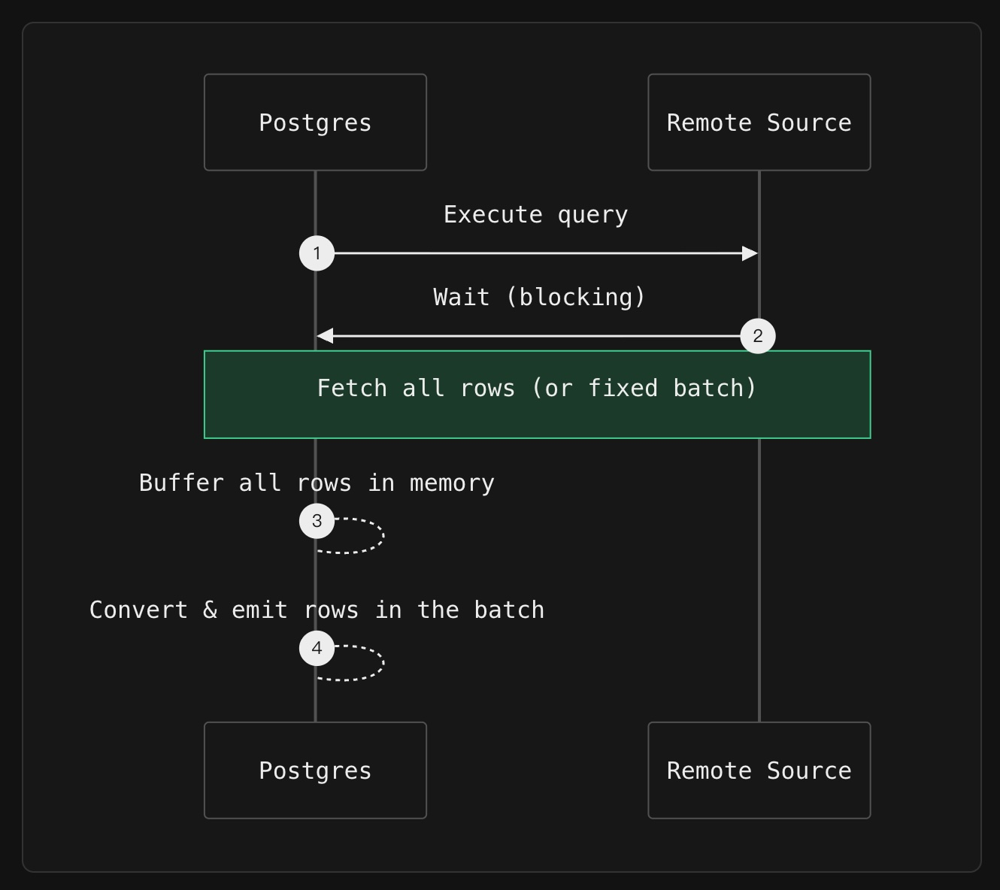
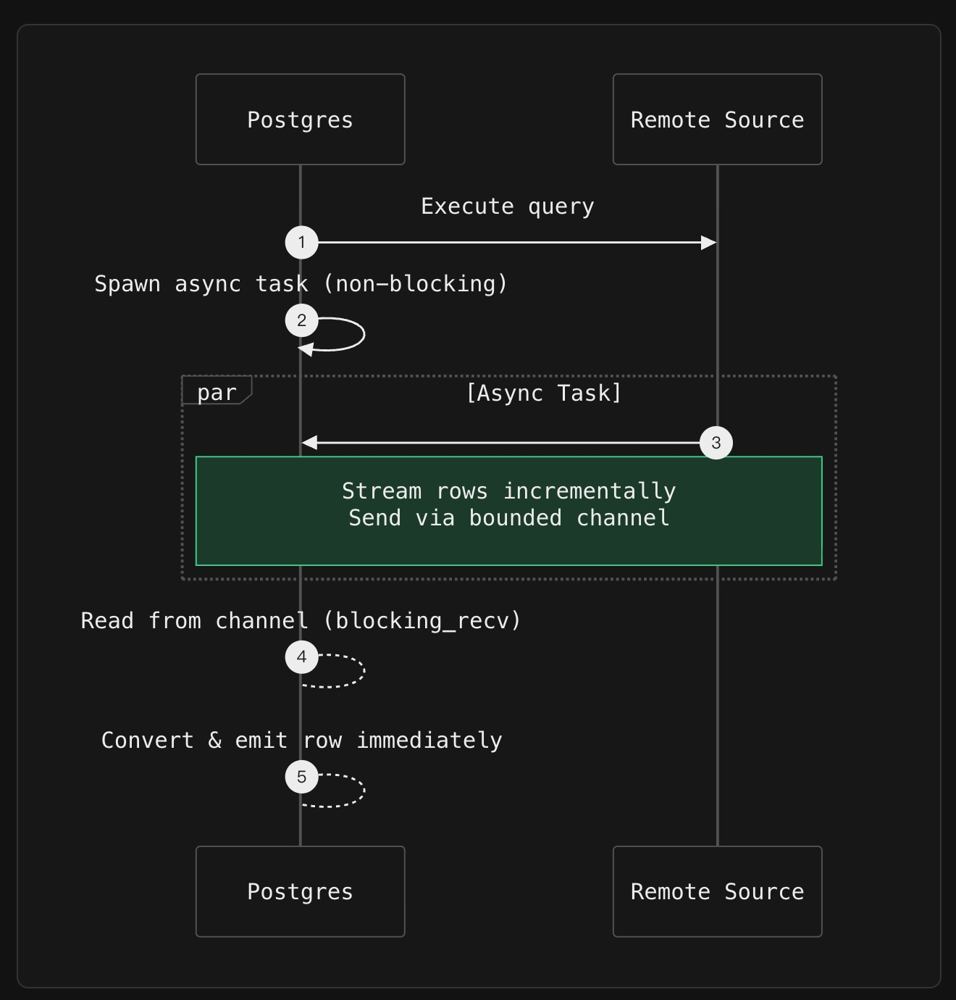

## 跟 PG FDW 瓶颈说拜拜, 异步流式传输来了!  
        
### 作者        
digoal        
        
### 日期        
2025-12-13        
        
### 标签        
PostgreSQL , fdw , 异步流式传输 , supabase , 阻塞式IO    
        
----        
        
## 背景      
震惊！Postgres FDW 接口 不再是“慢郎中”！  
  
**FDW 传统限制？** 拜拜👋！以前查外部数据，Postgres 要像个老干部一样，**傻等（blocking）** 着数据一批批来，内存压力山大，反应慢得像树懒。  
  
🚀 **现在不同了！** Supabase 带着 **Rust** 和 **Async Streaming (异步流式传输)** 杀入战场！  
  
* 🧠 **内存压力？** 滚蛋！我们用**有界通道**，就算查百亿行数据，内存也稳如泰山！  
* ⚡️ **速度？** 飞起！数据像流水一样哗啦啦地来，**第一行结果秒出**，告别漫长等待！  
* 🌐 **兼容性？** 超神！ClickHouse、BigQuery、Snowflake、S3……所有分析系统和 API 都能高效连接！  
  
**总结：** 别再用你那古董 FDW 了！想让你的 Postgres 变身**高能数据管道**，优雅地连接一切？想知道 Rust 怎么施展魔法，把同步（Synchronous）的 Postgres 变成异步（Async）超人吗？  
  
阅读全文，见证 FDW 的超级进化！**别再让你的数据库被“等”字耽误了！**    
  
以下内容来自 : https://supabase.com/blog/adding-async-streaming-to-pg-fdw    
  
---  
  
为 Postgres 外部数据封装器 (**Foreign Data Wrappers**) 添加异步流式传输 (**Async Streaming**)  
  
Postgres 可以通过**外部数据封装器 (Foreign Data Wrappers, FDW)** 查询外部数据库。但长期以来，FDW 都有一个限制：它们倾向于使用同步（synchronous）方法，获取所有结果或固定大小的批次。  
  
借助 **Supabase Wrappers**，我们一直在探索如何利用 **Rust** 将 Postgres FDW 带入现代时代。最新版本向 Postgres 世界引入了一个新事物：数据库之间的**异步流式传输 (asynchronous streaming)** 。  
  
### 传统 FDW 的工作原理  
  
大多数 FDW，包括 **postgres\_fdw**、**mysql\_fdw** 和许多其他 FDW，都采用同步的、拉取式 (pull-based) 的模型：  
  
1.  在远程源上执行查询。  
2.  要么一次性获取所有行，要么以固定大小的批次（例如，使用游标）获取行。  
3.  在等待每个批次到达期间，**Postgres 后端 (Postgres backend)** 会被**阻塞 (Block)** 。  
4.  在继续之前，将获取的行转换为 Postgres 元组。  
  
  
  
虽然批次获取避免了将所有数据预先加载到内存中，但 Postgres 仍然在 **I/O** 期间被阻塞，并且**执行器 (executor)** 无法继续，直到每个批次完全接收和处理完毕。对于针对 ClickHouse 等旨在扫描数十亿行的系统执行**分析工作负载 (Analytical workloads)** 时，这会导致：  
  
  * **高内存压力** (High memory pressure)——特别是当批次大小很大或没有限制时。  
  * **交互性差** (Poor interactivity)——用户必须等到第一个批次返回才能看到第一行数据。  
  * **资源利用效率低下** (Inefficient resource usage)——在网络等待期间，后端处于空闲状态。  
  
简而言之，传统的 FDW 是为面向批次的集成而设计的，而非**流式数据管道 (streaming data pipelines)** 。它们缺乏真正的**非阻塞 I/O (non-blocking I/O)** ，并且无法在远程数据开始流动之前就开始返回结果——即使在数据开始流动后，它们在批次之间也会停滞。  
  
### 我们的构建：Rust 中的异步流式传输  
  
我们最新版本的 **ClickHouse FDW** 引入了**异步流式传输 (asynchronous streaming)** ，即使处理海量结果集，也能实现高效、内存安全的查询。  
  
它的工作原理如下：  
  
1.  一个**后台异步任务 (background async task)** 会以增量方式从 ClickHouse 获取行，随着行通过网络到达。  
2.  这些行通过一个**有界、大小受限的通道 (bounded, size-limited channel)** （默认容量：1024 行）传递给 Postgres 后端。  
3.  FDW 一次从该通道中消耗一行，将其转换并发送给 Postgres，而无需在内存中缓冲整个结果集。  
  
  
  
这意味着 Postgres 可以在第一批行可用时就开始返回结果，即使对于大规模**分析工作负载**，也能显著减少内存压力并提高查询响应速度。  
  
通过将 Rust 的**内存安全 (memory safety)** 和**异步运行时 (async runtime)** 能力与 Postgres 的 FDW 接口相结合，**Wrappers** 在尊重 Postgres 的同步执行模型的同时，实现了真正的**流式传输语义 (streaming semantics)** 。  
  
### 为什么它在 Postgres 生态系统中独一无二  
  
这种流式传输能力不仅是 ClickHouse 的一个功能，它还是**Wrappers** 中内置的一个可重用模式的**首次实现 (first implementation)** 。  
  
与在 Postgres 同步模型中运行的传统 C 语言 FDW——通常加载完整结果集或在批次获取期间阻塞——不同，**Wrappers** 使 FDW 能够从远程源增量地流式传输数据。通过将 I/O 卸载到 Rust 的异步运行时并通过有界通道向 Postgres 馈送行，它实现了：  
  
  * 可预测的、**有界 (bounded)** 的内存使用——即使对于数十亿行的扫描。  
  * **更快的首次结果返回时间** (Faster time-to-first-result)。  
  * 跨越 BigQuery、Snowflake、S3 和 REST API 等不同后端的**一致性能** (Consistent performance)。  
  
借助 **Wrappers**，FDW 可以安全高效地将 Postgres 连接到现代数据栈，而不会牺牲稳定性或可扩展性。  
  
### 它是如何工作的  
  
以前，FDW 预先获取整个结果集或固定批次：  
  
```  
// 旧方法：将所有行加载到内存中  
// Old approach: load all rows into memory  
let rows = client.query(query).fetch_all()?;  
for row in rows {  
    writer.write_row(row)?;  
}  
```  
  
现在，数据使用异步任务和有界通道以增量方式流式传输：  
  
```  
// 新方法：使用有界缓冲进行行流式传输  
// New approach: stream rows with bounded buffering  
let (sender, receiver) = bounded_channel(1024);  
  
spawn_async_task(async move {  
    let mut stream = client.query(query).stream().await?;  
    while let Some(row) = stream.next().await {  
        let _ = sender.send(row).await;  
    }  
});  
  
// Postgres 随着行的到来进行消费  
// Postgres consumes rows as they arrive  
while let Some(row) = receiver.blocking_recv() {  
    writer.write_row(row)?;  
}  
```  
  
> 这是一个简化的**伪代码 (pseudocode)** 。实际实现使用了 **Wrappers** 的内部异步运行时和错误处理。  
  
FDW 派生一个**异步任务**，该任务在行变得可用时从远程源拉取行，并通过大小受限的通道发送它们。然后，主要的 Postgres 后端同步但增量地从该通道中读取，确保内存使用保持有界，并且即使对于大规模扫描，第一批结果也能快速到达。  
  
这种**混合模型 (hybrid model)** 尊重 Postgres 的同步执行模型，同时通过 Rust 的异步能力解锁了高效的、流式的**数据访问 (data access)** 。  
  
### 这对开发者意味着什么  
  
如果您正在使用 **Supabase Wrappers** 进行开发，您可以：  
  
  * 创建能够以**有界内存 (bounded memory)** 流式传输海量结果集的 FDW。  
  * 安全地将 Postgres 连接到**分析系统 (analytical systems)** （如 ClickHouse、BigQuery、Snowflake）、**云存储 (cloud storage)** （S3）和 **API**（Stripe、Airtable、Notion 等）。  
  * 利用 **Rust 的异步生态系统**来构建快速、安全且可维护的集成——无需编写 C 语言或进行手动内存管理。  
  
这种流式传输模式将 FDW 变成了真正的**数据管道组件 (data pipeline components)** ，让 Postgres 能够参与现代分析工作流程——同时将一切都保留在 **SQL** 中。  
  
### 下一步是什么  
  
我们正在 **Wrappers 生态系统**中推广异步流式传输。BigQuery、Snowflake、S3、Stripe 等连接器都将采用相同的流式传输架构 —— 使 Postgres 能够大规模、低延迟和有界内存使用地查询远程数据源。  
  
借助 **Wrappers**，Postgres 成为了一个真正的**通用数据网关 (universal data gateway)** ：一个 SQL 接口即可访问分析仓库、云存储、SaaS API 和实时数据库。而现在，多亏了**异步流式传输**，即使数据量达到数十亿行，它也能高效地完成这项工作。  
  
     
#### [PolarDB 学习图谱](https://www.aliyun.com/database/openpolardb/activity "8642f60e04ed0c814bf9cb9677976bd4")
  
  
#### [PostgreSQL 解决方案集合](../201706/20170601_02.md "40cff096e9ed7122c512b35d8561d9c8")
  
  
#### [德哥 / digoal's Github - 公益是一辈子的事.](https://github.com/digoal/blog/blob/master/README.md "22709685feb7cab07d30f30387f0a9ae")
  
  
#### [About 德哥](https://github.com/digoal/blog/blob/master/me/readme.md "a37735981e7704886ffd590565582dd0")
  
  

  
