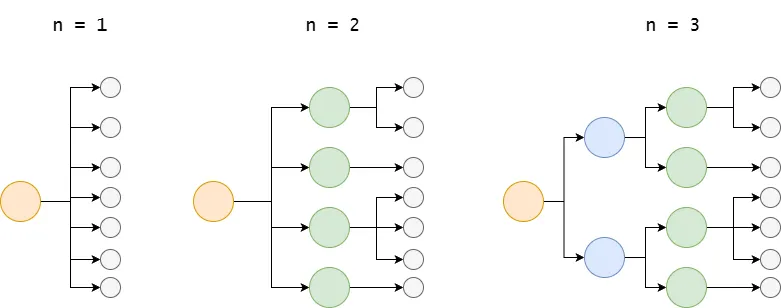
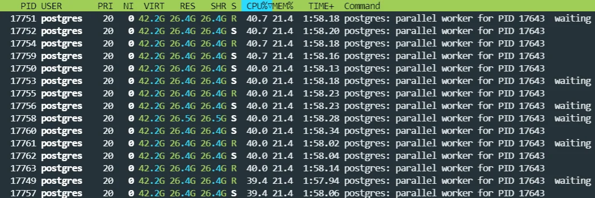
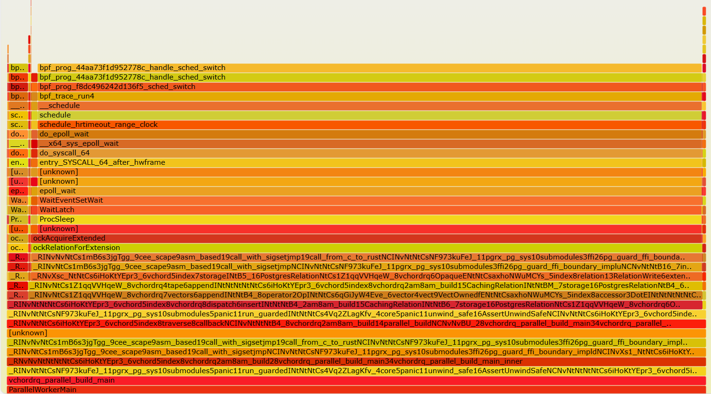
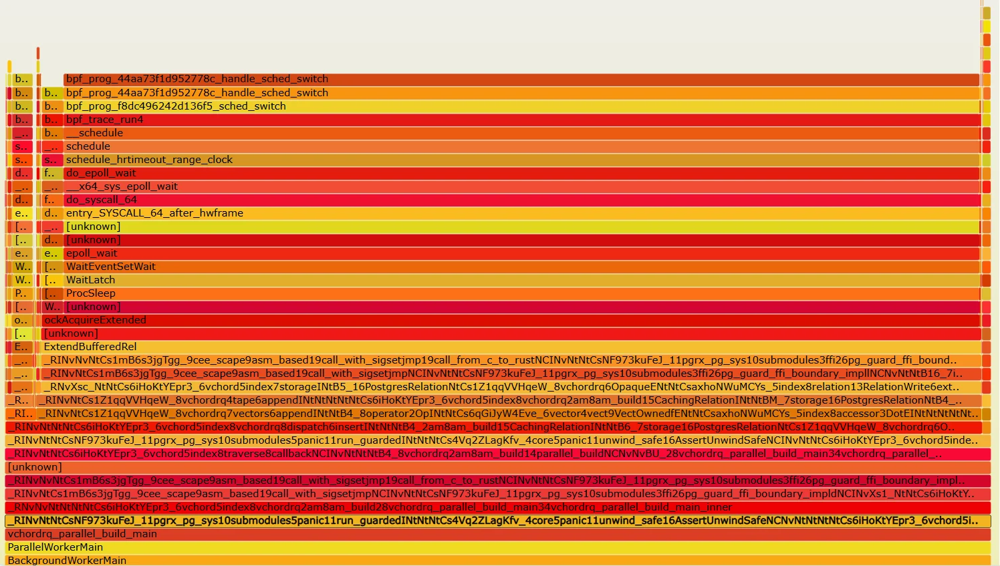

## VectorChord 比 pgvector 快 100 倍  
          
### 作者          
digoal          
          
### 日期          
2025-12-13          
          
### 标签          
PostgreSQL , 向量索引 , vectorchord , ivfflat , 聚集分层 , 批量扩展 , 并行压缩   
          
----          
          
## 背景       
正在打 PolarDB pgvector优化比赛的同学!   
  
pgvector 的用户!   
  
**你还在用 pgvector 吭哧吭哧地构建索引吗？快来试试我们，体验一下风驰电掣的感觉吧！**  
  
想知道如何把 **1 亿向量索引（Vector Indexing）** 这件“要命”的事变得超级简单又飞快的吗？  
  
在 **PostgreSQL** 上，我们完成了几乎不可能的任务：  
  
* **速度大突破！** 💥 以前索引 1 亿向量要 **40 小时**，现在我们只用 **20 分钟**！  
* **内存大瘦身！** 💾 原本需要 **200 GB** 内存，现在只需 **12 GB** 内存！足足节省了 7 倍！  
  
我们是怎么做到的？全靠下面这三板斧：  
  
1.  **「初始化」加速 8 倍！**：用分层 K-均值和降维，让初始化阶段快得像坐火箭！  
2.  **「插入」提速 46 倍！**：通过减少锁争用和批量扩展，把 7 小时的插入时间缩短到 **9 分钟**！  
3.  **「压缩」提速 8 倍！**：并行处理，让压缩阶段在 **1 分钟内**搞定！  
  
想知道更多这些“魔法”背后的技术细节，比如我们是如何巧妙地使用 **Johnson-Lindenstrauss 变换**和**伪随机置换**的吗？  
  
阅读全文，揭秘 VectorChord 1.0 如何让你在便宜的机器上，轻松驾驭亿级向量搜索！  
  
以下内容翻译自: https://blog.vectorchord.ai/how-we-made-100m-vector-indexing-in-20-minutes-possible-on-postgresql  
  
-----  
  
我们在 **PostgreSQL** 上如何实现 1 亿（100M） **向量索引（Vector Indexing）** 在 20 分钟内构建完成  
  
## 1\. 简介（Introduction）  
  
在过去的几个月里，我们听到了用户和合作伙伴一致的反馈：虽然我们提供 **pgvector** 可扩展、高性能替代方案的目标受到了好评，但在十亿（billion）级别的数据上，索引构建时间（index build time）和内存使用仍然是主要问题。  
  
现在，VectorChord 可以在一台 16 vCPU、仅有 12 GB 内存的机器上，在 20 分钟内索引 1 亿个 768 维向量。相比之下，使用 **pgvector** 索引相同的数据，在 16 核实例上大约需要 200 GB 内存和大约 40 小时。而且，内存不足的 **pgvector** 经常会出现页面交换（page swapping），使构建速度更慢。  
  
简而言之，内存使用和构建时间已成为大规模部署向量的关键障碍。通过一系列有针对性的优化，我们仅以轻微的准确性权衡（accuracy trade-offs）为代价，将构建时间减少到 20 分钟，并将内存使用减少了 7 倍。  
  
通过这些改进，我们现在可以使用更便宜、内存少得多的机器，且无需 GPU，即可托管 1 亿个 768 维向量：  
  
| 实例 | 价格 | 内存使用/总内存 | 备注 |  
| :--- | :--- | :--- | :--- |  
| 之前的最低要求 Amazon i7i.8xlarge | 🟨 每月 2174 美元 | 135 GB / 256 GB | 推荐用于更快索引 |  
| Amazon i7i.4xlarge | ✅ 每月 1087 美元 | 12 GB / 128 GB | **最低要求** |  
| Amazon i7i.xlarge + GPU (用于索引) | ✅ 每月 272 美元 + GPU 成本 | 6 GB / 32 GB | |  
  
在接下来的部分中，我们将介绍如何优化这些阶段，以使索引构建更快、内存效率更高。优化按其目标阶段组织如下：  
  
| 优化 | 目标阶段 | 结果 |  
| :--- | :--- | :--- |  
| **分层 K-均值（Hierarchical K-means）➕ 降维（Dimensionality Reduction） | 1️⃣ 初始化（Initialization） | 🚀 30 分钟 (GPU) → 8 分钟 (CPU) |  
| | | 🧾 135 → 23 GB |  
| 减少争用（Contention）** | 2️⃣ 插入（Insertion） | 🚀 420 分钟 → 9 分钟 |  
| 并行化**紧凑/压缩（Compaction）** | 3️⃣ 紧凑/压缩（Compaction） | 🚀 8 分钟 → 1 分钟 |  
  
## 2\. 背景（Background）  
  
VectorChord 中使用的索引类型 `vchordrq` 在逻辑上是一棵高度为 $n + 1$ 的树。树的前 $n$ 层是不可变的，纯粹用作搜索的路由结构（routing structure）。第 $n + 1$ 层存储所有数据。  
  
如果 $n = 1$ ，索引是一种扁平的、非分区的结构。如果 $n = 2$ ，它是一个倒排文件索引（inverted file index）。如果 $n = 3$ ，它有一个额外的层。  
  
  
  
索引构建可以分为 3 个阶段：初始化（Initialization）、插入（Insertion）和**紧凑/压缩（Compaction）** 。  
  
### 初始化阶段（Initialization Phase）  
  
在此阶段，树的顶部 $n$ 层被写入索引。首先，索引对表中的向量进行采样（samples vectors）。然后，索引通过对样本、质心（centroids），以及质心中的质心等进行聚类（clustering）来构建树，直到 $n$ 层。最后，树被写入索引。  
  
### 插入阶段（Insertion Phase）  
  
索引将表中的向量插入到树的底部层。  
  
### 紧凑/压缩阶段（Compaction Phase）  
  
索引将所有插入的向量从非紧凑布局（non-compact layout）转换为紧凑布局（compact layout）。  
  
## 3\. 使聚类更快、更省内存（Making Clustering Faster and More Memory-efficient）  
  
过去，尽管我们可以在小型实例上为 1 亿个向量构建索引，但通常需要 GPU 来加速聚类。  
  
初始化阶段的主要瓶颈是聚类，它既耗时又耗内存。事实上，它决定了索引构建所需的最小内存量。如果我们在 CPU 上以一种既快速又省内存的方式实现聚类，那么在没有大内存和 GPU 的小型实例上构建索引将是可行的。  
  
设 $n$ 是向量的数量， $c$ 是质心的数量， $d$ 是向量的维度， $l$ 是迭代次数。K-均值的时间复杂度是 $O(ncdl)$ ，空间复杂度是 $O(nd + cd)$ 。设 $f$ 是采样因子，换句话说， $n = fc$ 。K-均值的时间复杂度是 $O(fc^2dl)$ ，空间复杂度是 $O(fcd)$ 。  
  
在以下部分中，我们将解释如何降低复杂度，以及如何减小 $d$ 和 $f$ 以获得更好的性能。  
  
### 分层 K-均值（Hierarchical K-means）  
  
受时间复杂度限制，K-均值无论应用何种优化，都无法超越线性加速。即使在 GPU 上，这也需要 30 分钟。因此，我们必须降低时间复杂度。  
  
一个简单的想法是将样本划分为多个不相交的子集（disjoint subsets），在每个子集上运行 K-均值，然后合并每个子集上的质心。为了平衡这些子集的大小和它们的数量，我们选择 $c$ 作为子集的数量。为了生成 $c$ 个子集，我们最初执行一个小规模的 K-均值，然后使用 $c$ 个质心将 $n$ 个向量分配给 $c$ 个不相交的子集。  
  
假设子集的大小均匀，此步骤的时间复杂度是 $O(\frac{fc}{c} c d l) \times c = O(f c^{1.5} d l)$ 。如果 $f = 64$ 且 $c = 160,000$ ，该算法将大约快 3,200 倍。  
  
这里还有一个小问题。一个子集应该计算多少个质心？如果我们忽略它必须是整数的约束，它是 $\frac{n_{|s|}}{c}$ 。考虑到这个约束，这个问题类似于比例代表制（proportional representation），其中 Sainte-Laguë 方法是一种最小化平均席位与选票比率偏差的算法。它的工作原理如下：  
  
> 在所有选票都被计票后，为每个政党计算连续的商数。商数的公式是 $\frac{V}{s_i + 0.5}$ ，其中 $V$ 是该政党获得的总票数， $s_i$ 是迄今为止已分配给该政党的席位数量，最初所有政党的 $s_i$ 均为 0。  
  
现在在 CPU 上进行聚类是可行的。然而，该算法并未减少内存使用。  
  
### 降维（Dimensionality Reduction）  
  
是时候回顾用于 K-均值样本的 140 GB 内存了。这肯定会导致内存为 128 GB 的机器上出现 **OOM（Out-of-Memory）** 。考虑到空间复杂度 $O(fcd)$ ，我们有两种方法来减少内存使用：减少 $f$ 和减少 $d$ 。  
  
现在我们来减少 $d$ 。虽然听起来不可思议，但我们可以先降低向量的维度，然后再进行聚类，而不会损害准确性。Christos 的结果表明，在低维投影上运行 K-均值仍然可以保持良好的准确性。  
  
> **Johnson–Lindenstrauss 引理（Johnson–Lindenstrauss lemma）** 指出，高维空间中的一组点可以嵌入到维度低得多的空间中，使得点之间的距离几乎得以保持。在该引理的经典证明中，嵌入（embedding）是随机正交投影（random orthogonal projection）。  
  
根据该定理， $n$ 个向量可以减少到 $O(\log n)$ 维度。具体来说，我们只需要构造一个随机高斯矩阵（random Gaussian matrix），它允许我们使用矩阵乘法将高维向量减少到低维向量。然后我们对其执行 K-均值。  
  
由于我们需要减少内存使用，因此我们在采样期间直接应用 **Johnson-Lindenstrauss 变换（Johnson-Lindenstrauss transform）** 。最后，我们获得低维质心。我们不尝试执行逆变换；相反，我们再次从表中采样，在 **Johnson-Lindenstrauss 变换**后在低维空间中找到最近的簇，从而恢复高维质心。  
  
通过将维度从 768 降低到 100，实例的常驻集大小（resident set size）降至 23 GB，使我们能够在 i4i.xlarge 实例上构建索引。此外，这在理论上也使聚类速度加快了 7 倍。结合**分层 K-均值**和**降维**，初始化阶段的总时间降至 24 分钟。  
  
减少 $f$ 是微不足道的。它被配置为 `build.internal.sampling_factor`，因此我们只需要更改配置。我们将 $f$ 设置为 64。实例的常驻集大小降至 6 GB，聚类速度大约快 2 倍。  
  
### 采样（Sampling）  
  
为了执行聚类，我们需要从表中采样向量。我们以前的方法，蓄水池采样（reservoir sampling）可靠但速度慢。使用此方法是因为我们不知道表中的行数，除非进行全表扫描（full table scan）。但是，它仍然会执行全表扫描。  
  
为了避免全表扫描，我们利用了 **PostgreSQL** 表访问方法的采样接口。该接口接受一个函数，该函数在给定最大块号的情况下，生成一个块号迭代器。然后该接口返回这些块中元组（tuples）的迭代器。为了生成这样的随机迭代器，我们可以生成一个有序序列并对其执行 Fisher–Yates 洗牌算法，但这会消耗内存。事实上，我们有一个更巧妙的方法。在密码学中，伪随机置换（pseudorandom permutation）是一个无法与随机置换区分的函数。  
  
**Feistel 网络（Feistel network）** 可以用作伪随机置换。它定义为 $L_{i+1} = R_i$ ， $R_{i+1} = L_i \oplus F(R_i, K_i)$ ，其中 $F$ 是一个哈希函数， $K_i$ 是随机种子。函数的输入是 $(L_0, R_0)$ ，函数的输出是 $(L_n, R_n)$ 。因此，它是一个从 $[0, 2^n) \times [0, 2^n)$ 到 $[0, 2^n) \times [0, 2^n)$ 的函数。巧妙的是，由于 $R_i = L_{i+1}$ ， $L_i = R_{i+1} \oplus F(L_{i+1}, K_i)$ ，这个函数是可逆的。可逆函数是双射（bijective），因此这个函数是双射。 $[0, 2^n) \times [0, 2^n)$ 等价于 $[0, 4^n)$ ，因此它是 $[0, 4^n)$ 的一个置换。现在，通过从该置换中过滤掉所有大于最大块号的元素，我们获得了我们需要的惰性随机置换（lazy random permutation）。  
  
基于该接口和此函数，我们实现了块采样（block sampling），它只需要访问采样的向量。  
  
通过所有这些优化，初始化阶段现在总共只需要 8 分钟。  
  
## 4\. 减少争用（Reducing Contention）  
  
在早期的实验中，在 Amazon i7i.16xlarge（64 vCPU）实例上为 LAION-100m 数据集构建索引，如果使用 $n = 2$ ，插入阶段大约需要 420 分钟，而且这完全受限于计算（computation-bound）。  
  
从 0.1 版本开始，VectorChord 允许将 $n$ 设置为不大于 8 的正整数。从我们的角度来看，这对于十亿级数据是必要的。然而，那时我们并不知道它会快多少。  
  
在较小的实例 i7i.4xlarge（16 vCPU）上尝试 $n = 3$ 后，我们观察到插入阶段仅在 40–60 分钟内完成。那时，CPU 利用率维持在 40% 左右，IO 吞吐量在 300 MB/s 到 800 MB/s 之间波动，这表明有很大的优化空间。  
  
### 减少链表争用（Linked-List Contention）  
  
插入阶段耗时 40–60 分钟。令人惊讶的是，我们的测试显示 8 个工作进程需要 40 分钟，而 16 个工作进程需要 55 分钟。这表明在插入过程中，工作进程之间存在潜在的**争用（Contention）** 。  
  
在实现中，索引维护一个单链表来存储全精度向量（full-precision vectors），与树分开，而树只存储量化向量（quantized vectors）。这使得树节点小得多，并允许树适应内存。  
  
由于将 $n$ 从 2 更改为 3，插入阶段的计算次数有所减少。因此，向量插入到此链表中的频率更高。并行工作进程在插入到列表中时会遇到**争用（Contention）** 。因此，更多的工作进程实际上会减慢插入速度，使性能不可预测。  
  
为了解决这个问题，我们将单链表替换为 $1 + k$ 个链表。第一个链表存储树的顶部 $n$ 层的全精度向量，而其他 $k$ 个列表存储底部层的向量。在索引构建期间，第 $i$ 个工作进程将向量插入到第 $(i \bmod k)$ 个列表中。我们将 $k = 32$ 设置为默认值，并认为它足以应对大多数情况。  
  
通过此更改，CPU 利用率稳定在 54% 左右，插入阶段现在在大约 30 分钟内完成。  
  
### 减少页面扩展锁争用（Page Extension Lock Contention）  
  
CPU 利用率仍然表明可能存在更多优化。但瓶颈到底在哪里？我们通过使用 `htop` 检查 **PostgreSQL** 工作进程开始了我们的调查。  
  
  
  
许多进程在其标题中显示“waiting”（等待），这表明 **PostgreSQL** 内部存在严重的内部**争用（Contention）** 。搜索代码，我们将导致设置等待状态的源头追溯到 `lock.c`。为了测量离 CPU 时间（off-CPU time），我们转向了 BCC 的 `offcputime`。然后，使用 Brendan Gregg 的 FlameGraph 中的 `stackcollapse.pl` 和 `flamegraph.pl`，我们为进程的离 CPU 时间生成了一个火焰图（flame graph）。  
  
  
  
结果令人惊讶：罪魁祸首是 `LockRelationForExtension`，它获取索引的锁以对其进行扩展。  
  
> 💡  
>  
> 这里的 `ockRelationForExtension` 应该是 `LockRelationForExtension`。这可能是由于 `flamegraph.pl` 脚本的未知行为导致的。  
  
为什么获取此锁会成为瓶颈？搜索 **PostgreSQL** 邮件列表将我们引向了[这个讨论](https://postgr.es/m/20221029025420.eplyow6k7tgu6he3@awork3.anarazel.de)。  
  
简而言之，**PostgreSQL** 对每个索引施加一个锁，以防止该索引被并发扩展。但是，此锁的粒度（granularity）太粗。感谢 Andres Freund，引入了一个补丁，它缩小了临界区（critical section）并修复了此问题，但它需要 **PostgreSQL** 16 中可用的新 API。  
  
由于 VectorChord 支持 **PostgreSQL** 13 到 18，我们在早期开发中利用了旧 API。不幸的是，这意味着我们忽略了这种优化。  
  
切换到新 API 后，插入阶段降至 22 分钟。  
  
### 批量页面扩展（Bulk Page Extensions）  
  
然而，另一轮分析表明瓶颈仍停留在同一区域。  
  
  
  
由于锁的临界区已经被缩小，我们需要加快页面扩展速度以缓解瓶颈。使用 `fallocate` 扩展文件在文件系统上是很快的。如果使用 `fallocate` 来扩展索引，扩展页面的平均时间将更短。所以问题变成了：我们可以使用 `fallocate` 来扩展索引吗？  
  
答案是肯定的。如果索引一次扩展超过 8 个页面，**PostgreSQL** 会自动从 `pwrite` 切换到 `fallocate`。通过一次请求 16 个页面，我们显着提高了页面扩展的速度。  
  
通过此更改，插入阶段降至 9 分钟，CPU 利用率稳定在 90%，写入吞吐量保持在 1.8 GB/s 左右。`iostat` 报告 IO 利用率为 0.75–0.85，表明我们最终更好地利用了资源。  
  
仍然有改进的空间。但目前，插入阶段不再有任何微不足道的瓶颈。  
  
## 5\. 并行化紧凑/压缩（Parallelize Compaction）  
  
在树的底部层，量化向量以两种布局存在：  
  
1.  **非紧凑布局（non-compact layout）** （以插入为导向）：每个量化向量都存储为一个元组（tuple），因此数据可以直接附加，而无需修改现有元组。  
2.  **紧凑布局（compact layout）** （以搜索为导向）：每 32 个量化向量存储为一个元组。它针对 SIMD 进行了优化，使搜索速度很快。  
  
所有向量最初都以非紧凑布局插入，并将在最后阶段转换为紧凑布局。值得注意的是，该阶段是串行的（serial），并且在索引构建期间大约需要 8 分钟。  
  
由于其他阶段已经变得快得多，优化此阶段变得更加重要。因此，我们并行化了此阶段。如果存在 $k$ 个工作进程，并且树的第 $n$ 层中有 $m$ 个节点，则第 $i$ 个节点的子节点将由第 $(i \bmod k)$ 个工作进程进行**紧凑/压缩（Compaction）** 。得益于并行化，**紧凑/压缩**阶段现在只需要不到 1 分钟。  
  
您可能会注意到，一个有效的索引也需要偶尔进行此**紧凑/压缩**以保持搜索性能。**PostgreSQL** 为此目的有一个清理（vacuum）机制。因此，此阶段也会在清理中定期对索引执行。不幸的是，我们无法在清理中并行化它： **PostgreSQL** 不允许索引使用嵌套并行（nested parallelism）。如果清理是并行的，则索引就不能再次启动并行工作进程。  
  
## 6\. 结论（Conclusion）  
  
以前，在 Amazon i7i.4xlarge 实例上使用 VectorChord 0.5.3 索引 LAION-100M 数据集是不可行的，因为它会发生 **OOM（Out-of-Memory）** 故障。将聚类卸载到 GPU 上使构建成为可能，在查询前 10 个结果时，在 120 QPS 下召回率（recall）为 95.6%，在 GPU 上的构建时间为 30 分钟，在 i7i.4xlarge 上为 420 分钟。  
  
通过 VectorChord 1.0.0 中引入的优化，索引现在可以完全在 i7i.4xlarge 实例上构建，只需 18 分钟，在相同的 QPS 设置下，召回率（recall）达到 94.9%。  
  
```sql  
CREATE INDEX ON laion USING vchordrq (embedding vector_ip_ops) WITH (options = $$  
build.pin = 2  
[build.internal]  
lists = [400, 160000]  
build_threads = 16  
spherical_centroids = true  
kmeans_algorithm.hierarchical = {}  
kmeans_dimension = 100  
sampling_factor = 64  
$$);  
```  
  
我们的目标是让 VectorChord 成为在 **PostgreSQL** 上进行检索（retrieval）的最佳方式之一，从第一个原型到十亿级数据集。如果您已经在使用 **pgvector**，我们非常希望您在您的实际工作负载上尝试 VectorChord 1.0，并告诉我们在哪些方面有所帮助以及在哪些方面可以做得更好。  
   
    
#### [PolarDB 学习图谱](https://www.aliyun.com/database/openpolardb/activity "8642f60e04ed0c814bf9cb9677976bd4")
  
  
#### [PostgreSQL 解决方案集合](../201706/20170601_02.md "40cff096e9ed7122c512b35d8561d9c8")
  
  
#### [德哥 / digoal's Github - 公益是一辈子的事.](https://github.com/digoal/blog/blob/master/README.md "22709685feb7cab07d30f30387f0a9ae")
  
  
#### [About 德哥](https://github.com/digoal/blog/blob/master/me/readme.md "a37735981e7704886ffd590565582dd0")
  
  

  
