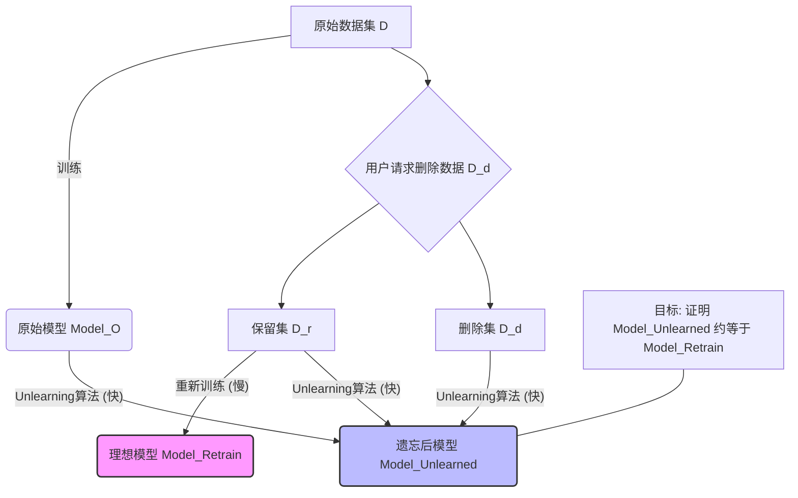
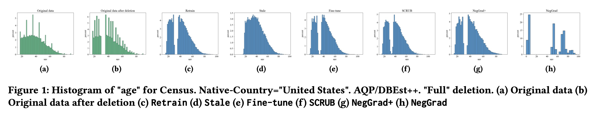
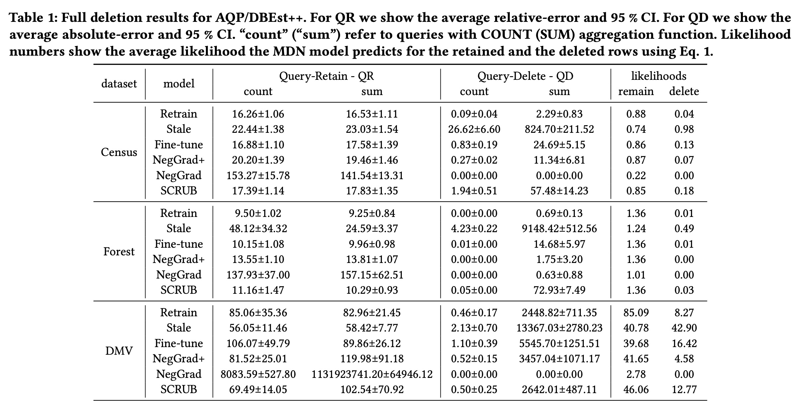
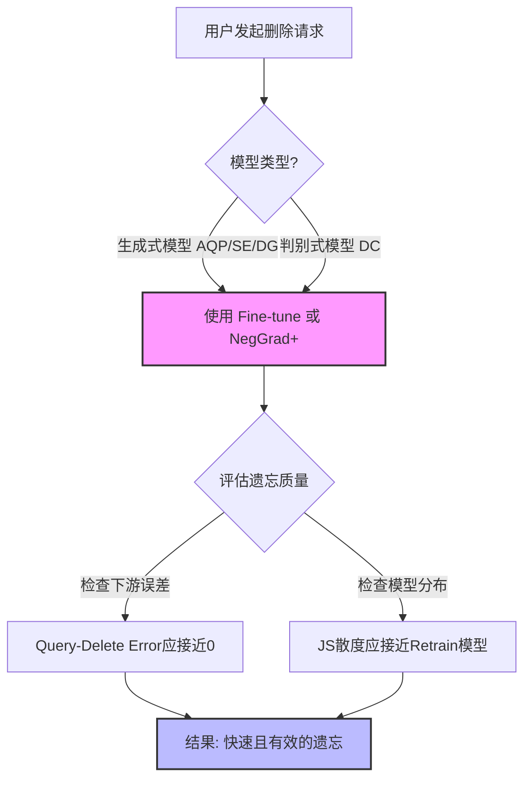
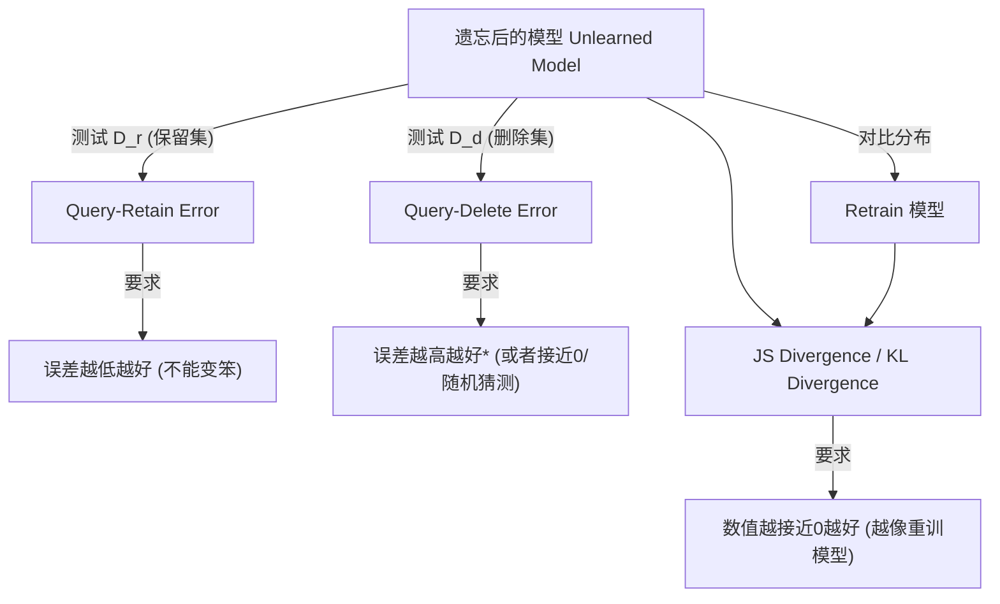

## AI论文解读 | Machine Unlearning in Learned Databases: An Experimental Analysis
        
### 作者        
digoal        
        
### 日期        
2025-12-14        
        
### 标签        
PostgreSQL , PolarDB , DuckDB , AI , 论文解读        
        
----        
        
## 背景  
      
https://arxiv.org/pdf/2311.17276        
  
提示:          
```          
读懂《Machine Unlearning in Learned Databases: An Experimental Analysis》这篇论文需要提前掌握哪些基础知识, 请使用中文通熟易懂的讲解这些基础知识, 可以引用论文中的图、表或使用Markdown支持的图形(text,mermaid等)增加解释性. 
  
使用中文通熟易懂的解读《Machine Unlearning in Learned Databases: An Experimental Analysis》这篇论文, 其中的关键内容请着重讲解, 可以引用论文中的图、表或使用Markdown支持的图形(text,mermaid等)增加解释性. 
  
提取《Machine Unlearning in Learned Databases: An Experimental Analysis》这篇论文中的重要术语, 使用中文对这些术语进行通熟易懂的讲解, 可以引用论文中的图、表或使用Markdown支持的图形(text,mermaid等)增加解释性. 
```     
  
## 1 前置知识 
  
阅读这篇论文《Machine Unlearning in Learned Databases: An Experimental Analysis》（学习型数据库中的机器遗忘：实验分析），你需要掌握三个维度的基础知识： **数据库基础（特别是学习型数据库）** 、**机器学习核心原理**以及**机器遗忘（Machine Unlearning）的概念**。

为了让你更轻松地理解，我将用通俗的语言配合图表为你拆解这些知识点。

-----

### 1\. 什么是“学习型数据库” (Learned Databases)?

传统数据库（如 MySQL, PostgreSQL）在处理查询优化或估算数据量时，依赖的是静态的统计信息（如直方图）。而**学习型数据库**的核心思想是： **用机器学习模型（神经网络）来替换或增强数据库的传统组件** 。

你可以把它想象成从“查字典”变成了“问专家”：

  * **传统方式**：查阅记录好的统计表，估算大概有多少行数据满足条件。
  * **学习型方式**：训练一个神经网络，它看过所有数据，记住了数据的分布规律。你问它问题，它通过推理给你答案。

**论文中提到的关键应用场景：**
这篇论文在以下四个场景中测试了“遗忘”的效果，理解它们是读懂实验部分的前提：

1.  **基数/选择性估计 (SE - Selectivity Estimation)** ：
      * **任务**：预测 `SELECT * FROM Table WHERE age > 30` 这条语句会返回多少行数据。
      * **作用**：帮助数据库优化器决定是用索引还是全表扫描。
2.  **近似查询处理 (AQP - Approximate Query Processing)** ：
      * **任务**：不需要扫描几亿行数据，直接通过模型预测出 `SUM(salary)` 或 `COUNT(*)` 的近似值。
      * **特点**：速度极快，但给的是近似解。
3.  **数据生成 (DG - Data Generation)** ：
      * **任务**：生成各种虚假的“合成数据”，这些数据在统计特性上和真实数据一模一样。
      * **作用**：用于保护隐私（把假数据给第三方分析）或数据增强。
4.  **数据分类 (DC - Data Classification)** ：
      * **任务**：判断某条数据属于哪个类别（例如：这笔交易是否欺诈）。

-----

### 2\. 机器学习核心原理 (Machine Learning Basics)

论文中使用了不同类型的神经网络来解决上述问题，你需要理解以下概念：

#### A. 神经网络与训练 (Training)

模型通过不断看数据（训练集），调整内部的参数（Weights），试图最小化预测错误（Loss）。

  * **前向传播**：模型给出预测结果。
  * **反向传播 (Gradient Descent)** ：根据错误的程度，反向告诉模型如何调整参数。论文中提到的 **NegGrad (Gradient Ascent)** 就是反着来：故意让模型在某些数据上最大化错误，从而“忘记”它们 。

#### B. 生成式模型 vs. 判别式模型

论文在实验中区分了这两类模型 ：

  * **判别式 (Discriminative)** ：像分类器。给它数据 $X$ ，它告诉你类别 $Y$ 。主要用于上面的 **DC** 任务。
  * **生成式 (Generative)** ：像画家。它学习数据的**概率分布 (Probability Distribution)** 。它可以自己画出（生成）新的数据 $X$ 。主要用于 **AQP, SE, DG** 任务。
      * *论文难点预警*：论文中提到了 **MDN (混合密度网络)**  和 **Autoregressive Models (自回归模型)** 。你只需要知道它们都是用来 **极其精准地描绘数据长什么样（分布）** 的工具。

-----

### 3\. 什么是“机器遗忘” (Machine Unlearning)?

这是这篇论文的核心。当数据库里的某行数据被删除了（比如用户退户，或者行使“被遗忘权”），基于这些数据训练出来的 AI 模型该怎么办？

#### A. 为什么不能直接删除？

这就好比你读了一本书学到了知识，现在把书里的一页撕掉，你脑子里的知识并不会自动消失。模型已经把那行数据的特征“记”在参数里了 。

#### B. 核心挑战：Retrain vs. Unlearning

  * **笨办法 (Retrain from Scratch)** ：把数据删掉，用剩下的数据重新训练一个新模型。
      * *优点*：最干净，效果最好。
      * *缺点*： **太慢了！** 训练大模型可能要几天几夜。
  * **机器遗忘 (Unlearning)** ：通过某种算法，微调现在的模型，让它“忘掉”被删的数据，同时“保留”其他数据的记忆。
      * *目标*：速度要快，效果要接近“笨办法”。

#### C. 数据集划分 (Dataset Partitioning)

理解实验设置必须懂这两个词 ：

  * **Delete-set (Forget-set)** $D_d$ ：需要被遗忘的数据。
  * **Retain-set** $D_r$ ：需要被保留的数据。
  * **理想结果**：模型在 $D_r$ 上表现依然很好，但在 $D_d$ 上表现得像从来没见过这些数据一样。

我们来看一下 mermaid 流程图来理解这个过程：



-----

### 4\. 论文中用到的评估指标 (Metrics)

论文怎么判断模型有没有“遗忘”成功？你需要理解以下几种度量方式：

  * **下游任务误差 (Downstream Task Error)** ：
      * 如果不该忘的忘了，查询准确率会下降。
      * 如果该忘的没忘，针对删除数据的查询（Query-Delete）可能还会返回非零结果（在 AQP/SE 任务中，删掉的数据统计结果应该是 0）。
  * **KL散度 / JS散度 (KL/JS Divergence)** ：
      * 用来衡量两个**概率分布**有多像。
      * **应用**：比较“执行遗忘算法后的模型分布”和“真正重新训练的模型分布”。数值越接近 0，说明遗忘得越成功。

为了直观展示这一点，我们可以参考论文中的 **Figure 1**。这是一个非常好的可视化例子，展示了数据分布的变化：

  

**(a) 原始数据** -\> **(b) 删除后的真实数据**
对比不同算法的效果：

  * **(d) Stale (旧模型)** ：完全没变，还记着被删的数据（红色框部分）。
  * **(c) Retrain (重训)** ：最完美的参照物，红色部分没了。
  * **(e) Fine-tune (微调)** 和 **(f) SCRUB**：试图模仿 (c)，效果看起来不错。
  * **(h) NegGrad**：虽然删掉了数据，但把其他数据的形状也搞乱了（引入了噪音）。

> **总结：**
> 读这篇论文时，请时刻带着这个问题： **“这个算法是否在‘不损坏其他知识’的前提下，快速地把‘指定数据的痕迹’从神经网络中擦除了？”**

-----

**下一步建议：**
你现在已经具备了基础知识。如果你想深入阅读论文的实验部分，我可以为你详细解读 **Figure 1** 或 **Table 1** 的具体数据含义。

  

  
  
## 2 解读论文 
  
这篇论文《Machine Unlearning in Learned Databases: An Experimental Analysis》是数据库（DB）与机器学习（ML）交叉领域的一项重要研究。它的核心目的是回答一个问题： **当我们在数据库中使用人工智能模型（即“学习型数据库”）时，如果用户删除了数据，我们如何让模型快速且干净地“忘记”这些数据，而不需要昂贵地从头重新训练？** 

以下是对这篇论文的通俗解读：

### 1\. 背景：当数据库遇上“健忘”难题

**什么是学习型数据库？**
传统的数据库（如 MySQL）用直方图等统计信息来优化查询。而“学习型数据库”使用神经网络（NN）来学习数据的分布，从而更精准地进行**基数估计（SE）** 、**近似查询处理（AQP）或数据生成（DG）** 。

**痛点是什么？**
数据库是动态的，数据经常被删除（比如用户注销、隐私合规要求）。

  * **笨办法（Retrain）** ：删掉数据后，用剩下的数据从头训练模型。这最干净，但**太慢了**，甚至不可行 。
  * **挑战（Unlearning）** ：我们需要一种算法，能修改现有的模型参数，让它“忘掉”被删的数据，同时保留对其他数据的记忆 。这在机器学习界叫“机器遗忘”（Machine Unlearning）。

-----

### 2\. 研究范围：任务与模型

论文在四个具体的数据库任务上进行了实验 ：

| 缩写 | 任务名称 | 用途 | 使用的模型 |
| :--- | :--- | :--- | :--- |
| **AQP** | 近似查询处理 | 快速估算 SUM/COUNT 等聚合结果 | MDN (混合密度网络)  |
| **SE** | 基数/选择性估计 | 预测 `SELECT * WHERE...` 返回多少行 | Naru/NeuroCard (自回归网络)  |
| **DG** | 数据生成 | 生成用于测试的合成数据 | VAE (变分自编码器)  |
| **DC** | 数据分类 | 判断数据类别（如分类器） | ResNet (深度神经网络)  |

-----

### 3\. 参赛选手：各种“遗忘”算法

论文对比了多种让模型“失忆”的方法。为了方便理解，我们可以把模型比作一个学生，把被删的数据比作“错误的知识点”：

1.  **Retrain (从头重训 - 金标准)** ：
      * 把书里错误的那页撕掉，让学生把整本书重新背一遍。效果最好，但耗时极长 。
2.  **Stale (摆烂/过时模型)** ：
      * 完全不处理。学生脑子里还记着错误的知识点。这是最差的基准线 。
3.  **Fine-tune (微调)** ：
      * 让学生只复习“正确且保留下来”的内容。通过不断强化正确的记忆，试图冲淡被删数据的印象 。
4.  **NegGrad (梯度上升)** ：
      * 专门挑出“错误的知识点”，让学生反向思考（最大化误差）。目的是专门破坏对这些数据的记忆 。
5.  **NegGrad+ (增强版梯度上升)** ：
      * 一边拼命忘掉“错误的知识点”（梯度上升），一边努力复习“正确的知识点”（梯度下降）。这是为了防止忘得太猛，把该记的也忘了 。
6.  **SCRUB (师生蒸馏 - 图像领域的SOTA)** ：
      * 请一个老师（原始模型）和一个学生（新模型）。学生要模仿老师对“保留数据”的反应，但要故意在这个基础上和老师对“删除数据”的反应唱反调 。
7.  **SISA (分片隔离)** ：
      * 把书撕成10份，每份单独背。如果要删某一页，只用重新背包含那一页的那一小份即可。这是一种“精确遗忘”，但会降低模型整体准确度 。

-----

### 4\. 裁判标准：怎么算“忘干净”了？

这是一个难点。论文提出不能只看单一指标，必须从两个维度评估 ：

#### A. 下游任务表现 (Downstream Performance)

模型在实际干活时表现如何？

  * **Query-Retain (QR) 误差**：查“保留数据”时，越准越好（误差越低越好）。
  * **Query-Delete (QD) 误差**：查“被删数据”时，结果应该是0（或者无法分类）。如果模型还能查出来，说明没忘干净 。

#### B. 模型内部状态 (Internal Metrics)

检查模型的大脑结构是否真的变了。

  * **JS 散度 (JS Divergence)** ：对比“遗忘后的模型生成的分布”和“真正重训的模型生成的分布”。两者越接近（越趋近于0），说明遗忘得越成功 。
  * **似然性 (Likelihood)** ：模型觉得被删数据的出现概率应该很低 。

-----

### 5\. 核心实验发现 (Key Findings)

这是论文最精彩的部分，有些结论出乎意料：

#### 发现一：简单的方法竟然最好用！

在图像识别领域（如人脸识别），简单的 **Fine-tune（微调）** 效果很差。但在数据库领域，**Fine-tune** 和 **NegGrad+** 的表现非常出色，不仅速度快（比重训快10-20倍），而且遗忘效果好，同时没怎么破坏原有知识 。

> **为什么？** 作者推测是因为数据库用的神经网络通常比较浅（2-5层），而图像识别用的网络很深（20+层）。浅层网络更容易通过简单微调来修正 。

#### 发现二：只看任务准确率会骗人

论文展示了一个有趣的案例（Census数据集的DG任务）：即使是 **Stale（完全没改的模型）** ，在某些分类任务上的准确率也和其他模型一样好。这说明有时候删除的数据并不影响特定的下游任务。因此，必须结合 **JS散度** 等内部指标来确诊模型是否真的“忘”了 。

#### 发现三：可以一边学新知识，一边忘旧知识

论文测试了一个混合场景：先删除一波数据，再插入一波新数据。结果发现，把 **Fine-tune**（用于遗忘）和现有的插入更新算法结合起来，依然能保持很高的精度。这意味着我们可以构建一个既能持续学习又能持续遗忘的“终身学习”数据库系统 。

#### 发现四：可视化证据

论文中的 **Figure 1**  直观地展示了这一点：   

  * **Stale** 模型的分布图里，被删数据的峰值还在（没忘掉）。
  * **NegGrad** 模型的分布图虽然删掉了数据，但其他部分的形状歪了（破坏了记忆）。
  * **Retrain** 是完美目标。
  * **Fine-tune** 和 **SCRUB** 生成的分布图与 **Retrain** 几乎一模一样，证明了它们的有效性。

-----

### 6\. 总结与流程图

这篇论文通过详实的实验告诉我们： **在学习型数据库中，我们不需要昂贵的重训，也不一定要用复杂的SOTA算法。简单的“微调”往往就是性价比最高的“遗忘”策略。**

以下是论文推荐的遗忘处理流程示意图：



**一句话总结：** 给数据库的AI模型做“切除手术”（删除数据），用微创手术（Fine-tune）就够了，不用做开颅手术（Retrain）。
  
## 3 术语 
  
这篇论文充满了数据库（DB）和机器学习（ML）交叉领域的专业术语。为了让你彻底读懂，我将这些术语分为四大类： **核心概念**、**应用场景**、**遗忘算法**和**评估指标**，并用通俗的语言配合图表进行讲解。

-----

### 第一类：核心概念 (The Core Concepts)

#### 1\. Learned Databases (学习型数据库)

  * **通俗解释**：传统数据库（如MySQL）像是一个**查表员**，它用固定的规则和统计表来管理数据。学习型数据库则像是一个**经验丰富的管家**（神经网络模型）。它通过“看”过所有数据，记住了数据的分布规律。当你问它问题时，它不需要去翻账本，而是通过“推理”直接告诉你答案。
  * **论文中的角色**：这是研究的对象。论文研究的是当数据被删除时，这个“管家”如何更新它的记忆。

#### 2\. Machine Unlearning (机器遗忘)

  * **通俗解释**：相当于 **“选择性失忆”** 。当数据库里的某条记录被删除了，我们希望训练好的AI模型也能把这条记录对应的特征忘掉，就像它从来没见过这条数据一样。
  * **难点**：AI模型不是硬盘，不能直接“右键删除”。记忆是分散在无数个参数（神经元连接）里的。

#### 3\. Generative Models (生成式模型) vs. Discriminative Models (判别式模型)

  * **生成式 (Generative)** ：
      * **比喻**：像一个**画家**。它学习数据长什么样，能画出（生成）新的数据，或者告诉你某个数据出现的概率。
      * **应用**：论文中的 AQP, SE, DG 任务。
  * **判别式 (Discriminative)** ：
      * **比喻**：像一个**阅卷老师**。它不关心数据怎么产生的，只关心这个数据属于哪一类（打分/分类）。
      * **应用**：论文中的 DC 任务。

-----

### 第二类：四大应用场景 (The 4 Tasks)

论文在四个具体任务上测试了遗忘效果，这四个缩写贯穿全文：

| 术语 | 全称 | 通俗解释 | 典型例子 |
| :--- | :--- | :--- | :--- |
| **SE** | **Cardinality/Selectivity Estimation** (基数/选择性估计) | **估算数量**。预测一个查询（Query）大概会返回多少行数据。 | `SELECT * FROM Users WHERE age > 30` -\> 模型预测：大概有 5000 人。 |
| **AQP** | **Approximate Query Processing** (近似查询处理) | **快速算账**。不扫描全表，直接预测聚合结果（求和、平均）。 | `SELECT AVG(salary)` -\> 模型预测：平均工资约 8000 (误差\<1%)。 |
| **DG** | **Data Generation** (数据生成) | **造假数据**。生成一批和真实数据统计特征一模一样的“假数据”。 | 用于隐私保护，把假数据给第三方做分析。 |
| **DC** | **Data Classification** (数据分类) | **打标签**。判断某条数据属于哪个类别。 | 判断这笔信用卡交易是“正常”还是“欺诈”。 |

-----

### 第三类：怎么让模型“遗忘”？ (Unlearning Algorithms)

这是论文的重头戏，描述了不同的“手术”方法：

#### 1\. Retrain (重训 - The Gold Standard)

  * **解释**：把要删的数据扔掉，用剩下的数据从头训练一个新模型。
  * **地位**：这是**参考答案**。虽然最慢，但最干净。所有其他算法都要和它比，看谁能在效果上最接近它。

#### 2\. Fine-tune (微调)

  * **解释**：模型不再看被删的数据，只拿着**保留下来的数据 ( $D_r$ )** 再复习几遍。
  * **论文发现**：在数据库任务中，这个简单的方法竟然效果出奇的好！它通过强化“正确记忆”来冲淡“错误记忆”。

#### 3\. Gradient Ascent / NegGrad (梯度上升)

  * **解释**：
      * 正常训练是**梯度下降**（Gradient Descent）：试图减少错误，让模型记住数据。
      * **梯度上升**（Gradient Ascent）：反其道而行之，故意最大化错误，强迫模型“讨厌”或“远离”被删的数据。
  * **风险**：用力过猛可能会把模型搞坏（Catastrophic Forgetting，灾难性遗忘），导致它连该记的数据也忘了。

#### 4\. SCRUB (Teacher-Student Distillation)

  * **解释**：找两个模型，一个是“老师”（原始模型），一个是“学生”（新模型）。
      * 对于**保留数据**：学生要模仿老师（保持记忆）。
      * 对于**删除数据**：学生要故意和老师唱反调（通过梯度上升）。
  * **特点**：在图像领域很强，但在数据库的简单模型上，表现不一定比微调好太多。

-----

### 第四类：怎么评估“忘”得好不好？ (Evaluation Metrics)

要读懂实验图表，必须懂这几个词：

#### 1\. Data Subsets (数据子集)

  * **$D$**: 原始完整数据集。
  * **$D_d$ (Delete-set)** : **遗忘集**。用户要求删除的那部分数据。
  * **$D_r$ (Retain-set)** : **保留集**。剩下的、需要被模型记住的数据。

#### 2\. Evaluation Flow (评估流程图)



#### 3\. JS Divergence (JS散度)

  * **通俗解释**： **“像不像指数”** 。
  * **论文用法**：用来衡量“使用遗忘算法后的模型”和“真正重训的模型”在概率分布上有多像。
  * **图表解读**：如果你在论文的柱状图或表格里看到 JS Divergence，**数值越小越好**。0 表示两者完全一样，遗忘非常完美。

#### 4\. Confidence / Likelihood (置信度/似然性)

  * **解释**：模型对某个数据“存在”的确信程度。
  * **目标**：对于被删的数据 $D_d$ ，模型的置信度应该大幅下降；对于保留的数据 $D_r$ ，置信度应该保持不变。

-----

### 总结：如何串联这些术语？

读论文时，你可以把这些术语串成一个故事：

> 我们有一个**学习型数据库 (Learned DB)** ，用来做 **SE/AQP** 等任务。
> 突然，用户发来一个请求，要删除部分数据 **( $D_d$ )** 。
> 我们不想 **Retrain**（太慢），所以尝试了 **Fine-tune** 和 **NegGrad** 等算法。
> 最后，我们通过计算 **JS Divergence** 和 **Query Error**，发现简单的 **Fine-tune** 其实效果就很好，成功地让模型“忘掉”了 $D_d$ 且记住了 **$D_r$**。

建议重点关注论文中的 **Figure 1**，它用图形化的方式（直方图）展示了：原始模型、重训模型、以及各种遗忘算法处理后的模型，在数据分布上长得像不像。有了上面的术语基础，你就能看懂那张图了。
  
  

## 参考        
         
https://arxiv.org/pdf/2311.17276    
        
<b> 以上内容基于DeepSeek、Qwen、Gemini及诸多AI生成, 轻微人工调整, 感谢杭州深度求索人工智能、阿里云、Google等公司. </b>        
        
<b> AI 生成的内容请自行辨别正确性, 当然也多了些许踩坑的乐趣, 毕竟冒险是每个男人的天性.  </b>        
    
#### [PolarDB 学习图谱](https://www.aliyun.com/database/openpolardb/activity "8642f60e04ed0c814bf9cb9677976bd4")
  
  
#### [PostgreSQL 解决方案集合](../201706/20170601_02.md "40cff096e9ed7122c512b35d8561d9c8")
  
  
#### [德哥 / digoal's Github - 公益是一辈子的事.](https://github.com/digoal/blog/blob/master/README.md "22709685feb7cab07d30f30387f0a9ae")
  
  
#### [About 德哥](https://github.com/digoal/blog/blob/master/me/readme.md "a37735981e7704886ffd590565582dd0")
  
  

  
