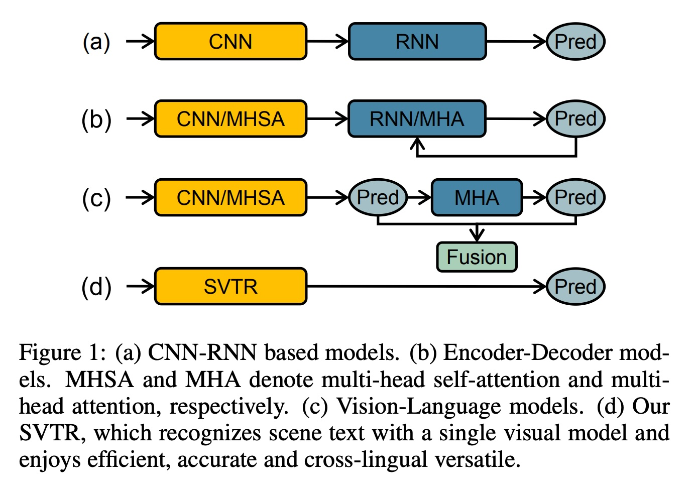
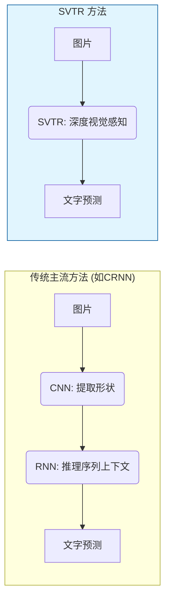
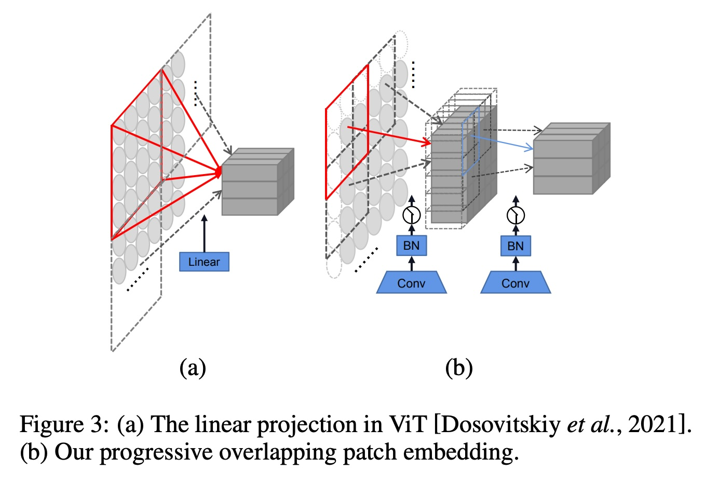
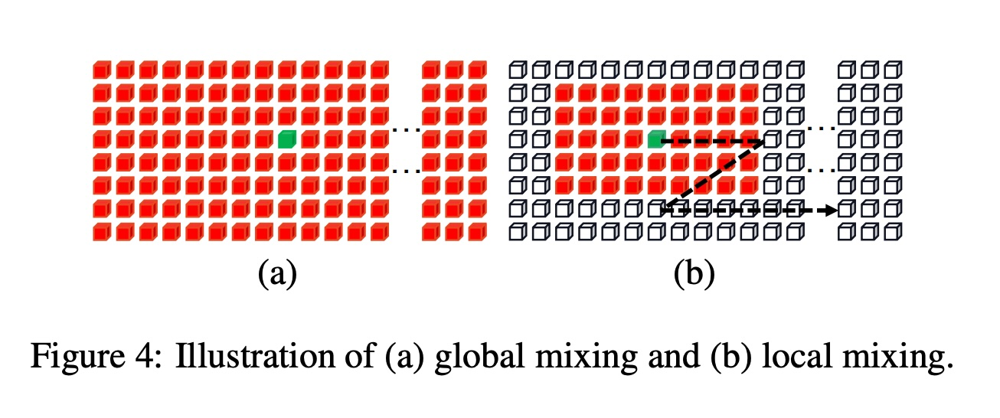
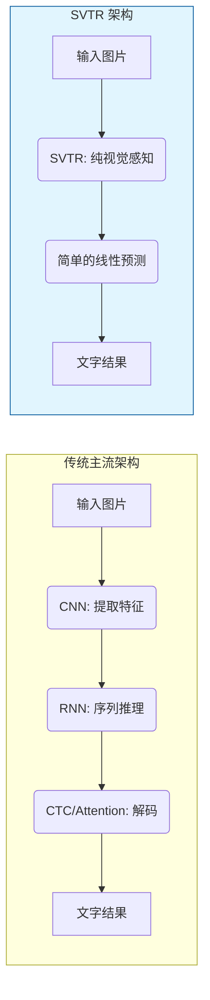
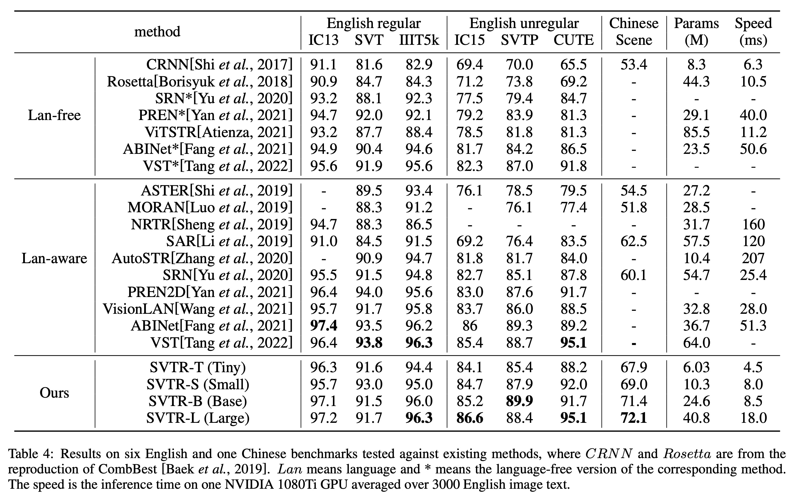
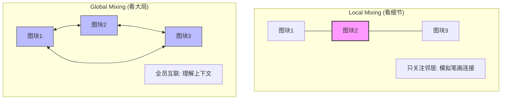

## AI论文解读 | SVTR: Scene Text Recognition with a Single Visual Model
        
### 作者        
digoal        
        
### 日期        
2025-12-15        
        
### 标签        
PostgreSQL , PolarDB , DuckDB , AI , 论文解读        
        
----        
        
## 背景  
      
https://arxiv.org/pdf/2205.00159        
  
提示:          
```          
读懂《SVTR: Scene Text Recognition with a Single Visual Model》这篇论文需要提前掌握哪些基础知识, 请使用中文通熟易懂的讲解这些基础知识, 可以引用论文中的图、表或使用Markdown支持的图形(text,mermaid等)增加解释性. 
  
使用中文通熟易懂的解读《SVTR: Scene Text Recognition with a Single Visual Model》这篇论文, 其中的关键内容请着重讲解, 可以引用论文中的图、表或使用Markdown支持的图形(text,mermaid等)增加解释性. 
  
提取《SVTR: Scene Text Recognition with a Single Visual Model》这篇论文中的重要术语, 使用中文对这些术语进行通熟易懂的讲解, 可以引用论文中的图、表或使用Markdown支持的图形(text,mermaid等)增加解释性. 
```     
  
## 1 前置知识 
  
要深入理解《SVTR: Scene Text Recognition with a Single Visual Model》这篇论文，你不需要是人工智能专家，但需要掌握几个核心的深度学习概念。SVTR 的核心思想是用**纯视觉**的方法（不依赖复杂的语言模型）来“看”懂图片中的文字。

以下是读懂这篇论文所需的五个基础知识模块，我使用了通俗的语言和图表来帮助你理解。

-----

### 1\. 场景文本识别 (Scene Text Recognition, STR) 的主流架构

**基础概念**：STR 的任务是把一张包含文字的自然场景图片（比如路牌、菜单）转换成计算机文本。

**通俗解释**：
在 SVTR 之前，主流方法通常像是一个“接力赛”：

1.  **视觉特征提取（眼睛）** ：先用 CNN（卷积神经网络）看图片，提取特征。
2.  **序列建模（大脑逻辑）** ：再用 RNN（循环神经网络）处理这些特征，以此来推断文字的顺序关系。
3.  **预测（嘴巴）** ：最后输出文字。

**论文中的突破**：
SVTR 认为这个流程太复杂、效率低。它提出： **能不能只用“眼睛”（视觉模型）就直接把字认出来，不要后面那个负责逻辑的“大脑”（RNN）？**

  * **图解对比** (参考论文 Figure 1 )：    
      * (a) 是传统方法（CNN + RNN）。
      * (d) 是 **SVTR**，只有一个 Visual Model（视觉模型），结构更简单。




-----

### 2\. Vision Transformer (ViT) 与 Patch（图块）化

**基础概念**：Transformer 原本是用来处理文字翻译的，Vision Transformer (ViT) 是把它拿来处理图片的技术。

**通俗解释**：
传统的 CNN 是一点一点“扫描”图片。而 ViT 的做法是： **把图片切成一小块一小块的拼图（Patch），然后把每一块拼图当成一个“单词”来处理。**

  * **SVTR 的改进**：普通的切分是像切蛋糕一样切开（互不重叠）。但 SVTR 使用了**重叠切分 (Overlapping Patch Embedding)** 。
      * *为什么？* 因为文字的笔画是连贯的，如果一刀切断，可能就把一个字的特征切碎了。
      * 参考论文 Figure 3 ，(a) 是 ViT 的切法（生硬），(b) 是 SVTR 的切法（有重叠，保留了边缘信息）。    

-----

### 3\. 注意力机制 (Attention) 与 自注意力 (Self-Attention)

**基础概念**：这是 Transformer 的核心。它允许模型在处理某一个局部信息时，同时“关注”到全局的其他信息。

**通俗解释**：
当你读句子“**苹果**很好**吃**”时，看到“吃”这个字，你的脑子会自动联系到前面的“苹果”。这就是注意力。
在图片里同理，当模型看到一个类似 "H" 的左半边竖线时，它需要关注右边有没有对应的竖线，才能确认这是 "H"。

**SVTR 的核心创新 - 两种 Mixing (混合) 方式** (参考论文 Figure 4 )：    
SVTR 设计了两个模块来让特征“混合”起来：

1.  **Global Mixing (全局混合)** ：

      * **作用**：看大局。
      * **例子**：看到左边有 "Tele"，右边很远的地方有 "phone"，虽然距离远，但通过全局注意力能把它们联系起来，知道这是一个词。
      * *对应论文 Figure 4(a)*。

2.  **Local Mixing (局部混合)** ：

      * **作用**：看细节（笔画）。
      * **例子**：专门盯着一个字符内部看，区分它是 "E" 还是 "F"，这需要看清细微的笔画连接。
      * *对应论文 Figure 4(b)*，类似 CNN 的滑动窗口，只看邻居。

-----

### 4\. 卷积神经网络 (CNN) 的“归纳偏置” (Inductive Bias)

**基础概念**：CNN 天生擅长处理“局部”关系（比如像素点和它旁边的点通常是相关的）。

**通俗解释**：
论文中提到 Transformer 虽然强大，但缺乏 CNN 那种“关注局部”的本能。

  * **知识点**：CNN 就像用放大镜看地图，能看清街道细节（局部特征强）。Transformer 就像在卫星看地图，能看清城市布局（全局特征强）。
  * **SVTR 的做法**：它在 Local Mixing Block 中引入了类似 CNN 的特性，专门用来捕捉**笔画特征 (Stroke-like features)** 。这是理解为什么 SVTR 既能认得准细节，又能理解长单词的关键。

-----

### 5\. CTC 解码 vs. 简单的线性预测 (Linear Prediction)

**基础概念**：CTC (Connectionist Temporal Classification) 是一种无需对齐就能把语音或图像序列转化成文本的算法，是传统 STR 模型的标配。

**通俗解释**：

  * **以前的难点**：图片里的 "apple" 宽度是不确定的，可能占 50 像素，也可能 100 像素。传统模型需要 CTC 这种复杂的算法来“对齐”时长和字符。
  * **SVTR 的简化**：
    由于 SVTR 的视觉特征提取能力非常强（多粒度特征），它放弃了复杂的序列解码（如 RNN+CTC 或 Attention Decoder）。
    它直接在最后接一个**简单的线性分类器 (Linear Classifier)** 。
      * *流程*：模型输出一串特征 -\> 简单的全连接层 -\> 去除重复字符 -\> 最终结果。
      * 这解释了论文标题中 "Single Visual Model" 的含义： **去掉了复杂的翻译官，直接让眼睛“读”出来。**

### 总结：阅读路线图

当你阅读这篇论文时，请按这个逻辑串联这些知识：

1.  **出发点**：传统方法 (CNN+RNN) 太慢太复杂 。
2.  **方案**：用 ViT 的思路（切块）来处理图片，做成纯视觉模型 。
3.  **难点**：普通 ViT 容易忽略文字的微小笔画细节。
4.  **解决**：
      * 用 **Overlapping Embedding** 避免切断字符 。
      * 设计 **Global Mixing** (看上下文) 和 **Local Mixing** (看笔画) 两个模块交替使用 。
5.  **结果**：因为看得够清楚，所以最后不需要复杂的“脑补”模块，直接输出文字，速度快且准 。

掌握这些，你就能顺畅地理解 SVTR 为何能在速度和精度上都取得优异成绩了。
  
## 2 解读论文 
  
这篇论文提出了一种名为 **SVTR (Scene Text Recognition with a Single Visual Model)** 的新模型。它的核心理念是： **抛弃复杂的序列模型（如RNN），仅依靠一个强大的视觉模型就能实现快速、精准的场景文字识别** 。

以下是对这篇论文的通俗解读，重点讲解其核心创新点。

-----

### 1\. 为什么要提出 SVTR？（背景与痛点）

在 SVTR 出现之前，主流的文字识别模型通常像个“接力赛”，由两个部分组成 ：

1.  **视觉模型 (CNN/ViT)** ：负责“看”图，提取特征。
2.  **序列模型 (RNN/Attention)** ：负责“读”逻辑，把特征转成文字序列。

**痛点在于**：这种“视觉+序列”的混合架构虽然准确，但结构复杂，且因为是串行处理（一个字接一个字），速度较慢 。

**SVTR 的突破**：它证明了如果视觉模型足够强大，能同时看清“笔画细节”和“整体单词”，就不需要后面的序列模型了。SVTR **完全舍弃了 RNN**，直接从图像特征预测文字，实现了速度和精度的双赢 。



*(参考论文 Figure 1 绘制 )*

  

-----

### 2\. SVTR 是如何工作的？（核心方法）

SVTR 的设计灵感来自于 Vision Transformer (ViT)，它把图片切成小块（Patches）来处理。但为了识别文字，它做了三个关键的专门设计：

#### A. 渐进式重叠切块 (Progressive Overlapping Patch Embedding)

普通的 ViT 像切蛋糕一样把图切开，容易把一个字符切断。SVTR 采用了**重叠切分**的方式 。

  * **作用**：保留了字符笔画的连贯性，防止特征断裂。
  * **流程**：先把图片切成小块（Character Components），这就像是把文字拆解成了基本的“零件” 。

#### B. 两种“混合块” (Mixing Blocks) —— 核心创新

为了认字，模型需要具备两种能力： **看细节**（区分 'E' 和 'F' 的细微笔画）和 **看大局**（把 't', 'h', 'e' 连成 "the"）。SVTR 设计了两种模块交替使用 ：

1.  **Local Mixing (局部混合)** ：

      * **功能**：只看通过一个小窗口看邻居。
      * **目的**：模拟**笔画特征**。它关注字符内部的形态，比如横竖撇捺的连接 。
      * *类比*：像拿放大镜看每一个字的写法。

2.  **Global Mixing (全局混合)** ：

      * **功能**：看整行文字。
      * **目的**：捕捉**字符间的依赖关系**。它能理解 "phone" 即使很长也是一个词，或者处理因遮挡导致的识别困难 。
      * *类比*：像读书时一眼扫过整个单词，理解上下文。

这两种模块在网络中反复交替，使得 SVTR 既有 CNN 的局部感知能力，又有 Transformer 的全局感知能力 。

#### C. 倒金字塔结构 (Merging)

SVTR 是一个三阶段网络，随着层数加深，特征图的**高度 (Height) 逐渐减半**，但宽度保持不变 。

  * **为什么只减高度？** 因为大多数文字是水平排列的。压缩高度可以减少计算量，同时保留文字在水平方向的序列信息 。

-----

### 3\. 极简的预测头 (Prediction)

因为前面的视觉特征提取非常充分（包含多粒度特征），最后的预测环节非常简单：

  * 直接使用一个**并行的线性分类器 (Linear Prediction)** 。
  * 不需要等待上一个字预测完再预测下一个字，这大大提高了推理速度 。

-----

### 4\. 实验效果 (图表数据支撑)

论文在英文（如 IC15）和中文场景数据集上进行了测试，结果非常亮眼：

  * **中文识别**：SVTR-L（大模型版本）在中文场景数据集上大幅超越了之前的方法（SAR, CNN等），准确率提升了 **5.4% 到 9.6%** 。这意味着它特别擅长处理中文这种笔画复杂的文字 。
  * **速度与精度**：
      * **SVTR-L (Large)** ：在英文和中文任务上都达到了极高的准确率 。
      * **SVTR-T (Tiny)** ：这是一个超轻量版本，参数量仅 6.03M，在 GPU 上处理一张图仅需 4.5ms，非常适合在端侧部署，且准确率依然很有竞争力 。

**性能对比概览 (基于论文 Table 4):**

| 模型 | 特点 | 英文 IC15 准确率 | 中文场景准确率 | 速度 (ms) |
| :--- | :--- | :--- | :--- | :--- |
| CRNN (经典) | 早期主流 | 70.0% | 53.4% | 8.3 |
| ABINet (先进) | 需语言模型 | 84.2% | - | 23.5 |
| **SVTR-T (极速版)** | **本文极小模型** | **84.1%** | **67.9%** | **4.5** |
| **SVTR-L (高精版)** | **本文大模型** | **87.9%** | **72.1%** | **18.0** |

  

-----

### 5\. 总结

**SVTR 为什么重要？**
它打破了“只有加上语言模型（RNN/LM）才能认得准”的思维定势。通过精心设计的 **Local/Global Mixing** 机制，SVTR 证明了一个纯视觉模型（Single Visual Model）完全可以同时具备：

1.  **高准确率**（看清笔画和上下文）。
2.  **高速度**（并行计算，无循环网络）。
3.  **跨语言通用性**（对英文和复杂的中文都有效）。
  
## 3 术语 
  
这篇论文提出了一种名为 **SVTR** 的新型文字识别模型。为了让你轻松读懂，我提取了论文中最重要的 6 个核心术语，并用通俗的比喻和图解来解释。

### 1\. SVTR (Single Visual Model / 单一视觉模型)

  * **定义**：SVTR 是论文提出的模型名称，全称是 "Scene Text Recognition with a Single Visual Model" 。
  * **通俗解释**：
    以前的文字识别模型（如 CRNN）像是一个“二人转”组合：一个人负责看图（视觉模型），另一个人负责把看到的零碎特征拼成通顺的句子（序列模型，如 RNN）。
    **SVTR 则是“独角戏”** 。它认为只要眼神足够好（视觉特征提取够强），就不需要后面那个负责拼句子的人了。它彻底丢弃了序列模型，只用一个视觉模型就直接认出了文字 。
  * **优势**：结构简单，速度更快，而且在中文这种复杂的文字上效果特别好 。

### 2\. Character Component (字符组件)

  * **定义**：这是 SVTR 处理图像的基本单位。它将图像切分成许多小的二维图块（Patches），每个小块被称为一个“字符组件” 。
  * **通俗解释**：
    这就好比把一个个汉字拆解成了“偏旁部首”或者更小的“笔画积木”。
    SVTR 不直接看整张图，而是先把它切碎成无数个小方块。每个小方块可能只包含一个字的一小部分（比如一个横、一个点） 。
  * **目的**：为了让模型能从最微小的细节开始学习文字的特征。

### 3\. Progressive Overlapping Patch Embedding (渐进式重叠切块)

  * **定义**：这是将图像转化为字符组件的具体操作方式。与传统的“切蛋糕”（一刀切，互不干扰）不同，SVTR 采用了一种有重叠的切分方式 。
  * **通俗解释**：
    **“藕断丝连”切法**。
    如果你把一个字切开，但切口处不留一点余地，可能正好把关键的笔画切断了，导致两边都认不出这是啥。
    SVTR 在切分图片时，让每一个小块和旁边的小块有一部分是重叠的。这样能保证笔画的连贯性，不丢失关键信息 。

### 4\. Mixing Block (混合块：Local & Global)

这是论文最核心的创新点，也是 SVTR 眼神好的秘密武器。它分为两种模式：

#### A. Local Mixing (局部混合)

  * **定义**：在一个限定的窗口内评估组件之间的关联 。
  * **通俗解释**： **“拿放大镜看细节”** 。
    模型只关注当前小方块和它周围邻居的关系。这主要是为了看清**笔画特征**（Stroke-like features）。比如区分“士”和“土”，就得靠这种局部细节的观察，看清楚那一竖到底有多长 。

#### B. Global Mixing (全局混合)

  * **定义**：评估所有字符组件之间的依赖关系 。
  * **通俗解释**： **“退后一步看大局”** 。
    模型会忽略距离限制，看整行文字。这主要是为了建立**字符间的依赖**（Inter-character dependence）。比如看到左边是 "Tele"，即使中间有污渍，只要看到右边很远的地方是 "one"，也能猜出是 "Telephone" 。




### 5\. Merging (合并/降采样)

  * **定义**：在网络的不同阶段之间，对特征图进行尺寸缩减的操作 。
  * **通俗解释**：
    **“只压扁，不变窄”** 。
    通常的卷积神经网络会让图片的长和宽都变小。但 SVTR 发现文字通常是长条形的，所以它在合并特征时，**只把高度减半，宽度保持不变** 。
    这样做既减少了计算量，又保留了文字在水平方向上的排列顺序，不会把左右相邻的两个字混在一起。

### 6\. Linear Prediction (线性预测)

  * **定义**：模型的最后一步，直接使用简单的全连接层进行字符预测 。
  * **通俗解释**：
    **“直觉反应”** 。
    传统的模型最后通常需要一个复杂的“解码器”（像翻译官一样反复推敲）。
    但因为 SVTR 前面的视觉特征提取非常到位，到了最后一步，它只需要一个简单的线性分类器，就能直接把特征映射成文字 。这就像你看到熟人，不需要思考，脱口而出他的名字，这就是 SVTR 速度快的原因之一。
  
## 参考        
         
https://arxiv.org/pdf/2205.00159    
        
<b> 以上内容基于DeepSeek、Qwen、Gemini及诸多AI生成, 轻微人工调整, 感谢杭州深度求索人工智能、阿里云、Google等公司. </b>        
        
<b> AI 生成的内容请自行辨别正确性, 当然也多了些许踩坑的乐趣, 毕竟冒险是每个男人的天性.  </b>        
    
#### [PolarDB 学习图谱](https://www.aliyun.com/database/openpolardb/activity "8642f60e04ed0c814bf9cb9677976bd4")
  
  
#### [PostgreSQL 解决方案集合](../201706/20170601_02.md "40cff096e9ed7122c512b35d8561d9c8")
  
  
#### [德哥 / digoal's Github - 公益是一辈子的事.](https://github.com/digoal/blog/blob/master/README.md "22709685feb7cab07d30f30387f0a9ae")
  
  
#### [About 德哥](https://github.com/digoal/blog/blob/master/me/readme.md "a37735981e7704886ffd590565582dd0")
  
  

  
