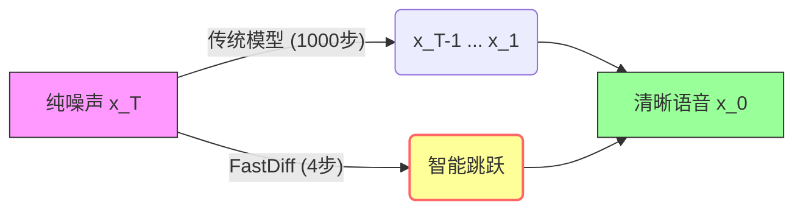
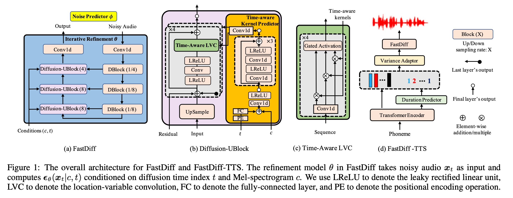
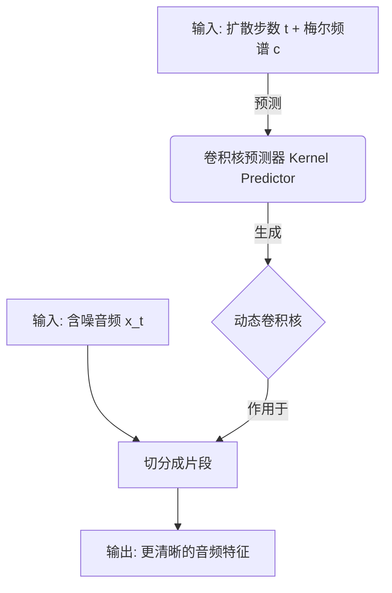
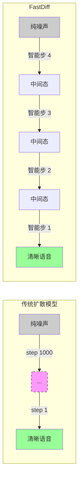
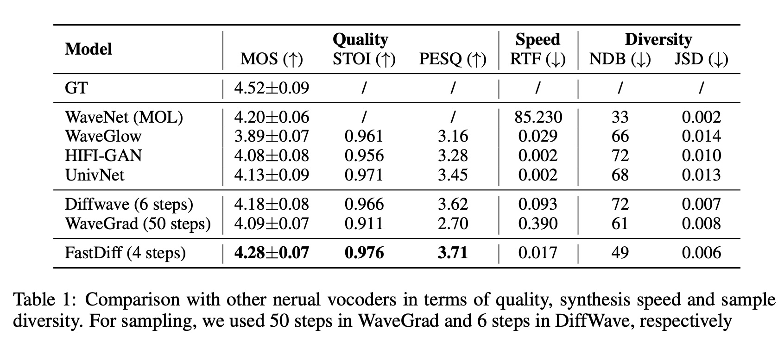
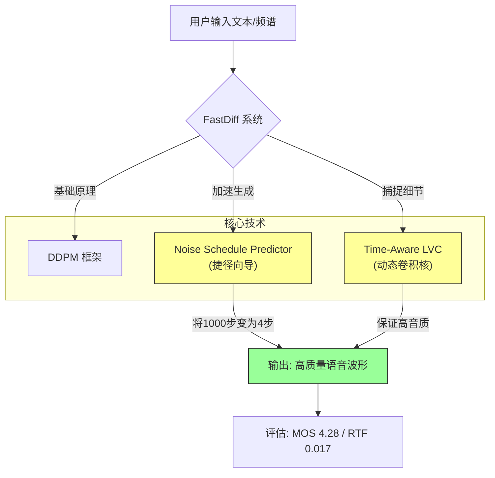

## AI论文解读 | FastDiff: A Fast Conditional Diffusion Model for High-Quality Speech Synthesis
        
### 作者        
digoal        
        
### 日期        
2025-12-16        
        
### 标签        
PostgreSQL , PolarDB , DuckDB , AI , 论文解读        
        
----        
        
## 背景  
      
https://arxiv.org/abs/2204.09934        
  
提示:          
```          
读懂《FastDiff: A Fast Conditional Diffusion Model for High-Quality Speech Synthesis》这篇论文需要提前掌握哪些基础知识, 请使用中文通熟易懂的讲解这些基础知识, 可以引用论文中的图、表或使用Markdown支持的图形(text,mermaid等)增加解释性. 
  
使用中文通熟易懂的解读《FastDiff: A Fast Conditional Diffusion Model for High-Quality Speech Synthesis》这篇论文, 其中的关键内容请着重讲解, 可以引用论文中的图、表或使用Markdown支持的图形(text,mermaid等)增加解释性. 
  
提取《FastDiff: A Fast Conditional Diffusion Model for High-Quality Speech Synthesis》这篇论文中的重要术语, 使用中文对这些术语进行通熟易懂的讲解, 可以引用论文中的图、表或使用Markdown支持的图形(text,mermaid等)增加解释性. 
```     
  
## 1 前置知识 
  
要深入理解《FastDiff: A Fast Conditional Diffusion Model for High-Quality Speech Synthesis》这篇论文，你需要建立几个层面的知识储备。这篇论文主要解决的是扩散模型（Diffusion Models）在语音生成中**推理速度慢**的问题，同时保持**高音质** 。

为了让你更轻松地读懂它，我将基础知识拆解为以下四个通俗易懂的模块：

-----

### 1\. 语音信号处理基础：从“菜谱”到“菜肴”

首先，你需要理解语音合成（TTS）任务中的核心数据形态。FastDiff 是一个**声码器 (Vocoder)** ，它的工作是将声学特征转化为声音波形。

  * **梅尔频谱图 (Mel-spectrogram)** ：这就好比一道菜的“详细菜谱”。它是一张图，横轴是时间，纵轴是频率，颜色深浅代表响度。它包含了语音的内容和韵律，但不是声音本身 。
  * **波形 (Waveform)** ：这就是“做好的菜”，即我们耳朵听到的连续声波信号。
  * **声码器的任务**：论文中提到的 "Mel-spectrogram inversion" 指的就是根据梅尔频谱图（菜谱）还原出高保真的波形（菜肴）的过程 。

> **💡 通俗理解**：FastDiff 的工作就是一位顶级大厨，看着这一张张“梅尔频谱图”，快速炒出美味的“波形”大餐。

-----

### 2\. 生成模型的演变：为什么要用扩散模型？

在 FastDiff 之前，语音合成界有几位“老前辈”，你需要了解它们的优缺点，才能明白 FastDiff 的创新之处：

  * **自回归模型 (Autoregressive, 如 WaveNet)** ：
      * **特点**：像接龙一样，产生第一个点，再根据第一个产生第二个……
      * **缺点**：音质极好，但速度极慢（计算成本昂贵），很难实时应用 。
  * **GAN (生成对抗网络, 如 HiFi-GAN)** ：
      * **特点**：一个造假（生成器），一个打假（判别器），互相博弈。
      * **缺点**：虽然速度快，但训练很难（容易坍塌），而且生成的多样性有时不足 。
  * **扩散模型 (Diffusion Models, 如 DiffWave)** ：
      * **特点**：音质好，生成多样性强。
      * **痛点**： **太慢了！** 传统的扩散模型需要几百上千步的迭代才能生成一段音频，这正是 FastDiff 想要解决的核心痛点 。

-----

### 3\. 扩散模型 (DDPM) 的核心机制

这是理解论文最关键的部分。想象一下“把一张清晰的照片逐渐弄成雪花屏，然后再把雪花屏复原成照片”的过程。

#### **A. 两个过程 (The Two Processes)**

论文中反复提到的 $q(x_t|x_{t-1})$ 和 $p_{\theta}(x_{t-1}|x_t)$ ：

1.  **前向扩散 (Diffusion Process)** ：向原始数据 $x_0$ 中不断添加高斯噪声，直到变成纯噪声 $x_T$ 。这个过程是固定的 。
2.  **反向去噪 (Reverse Process)** ：这是模型要学的本事。从纯噪声 $x_T$ 开始，一步步去除噪声，最终还原出清晰的语音 $x_0$ 。

#### **B. 噪声调度 (Noise Schedule)**

  * **概念**：你可以把它理解为“去噪的时间表”。传统的扩散模型在去噪时非常谨慎，每一步只去掉一点点噪点，所以需要 1000 步 ( $T=1000$ ) 。
  * **FastDiff 的创新**：它引入了一个 **Noise Predictor (噪声预测器)** ，能够计算出一个更聪明、更高效的“时间表” 。
  * **结果**：它只需要 **4 步** 就能走完别人 1000 步的路，实现了 58 倍于实时的生成速度 。




-----

### 4\. 神经网络架构知识：卷积的进化

FastDiff 为了处理长音频依赖，设计了特殊的卷积结构。

  * **感受野 (Receptive Field)** ：指神经元能“看到”多长的一段声音。声音有很长的时间依赖关系，所以需要很大的感受野 。
  * **时间感知位置变量卷积 (Time-Aware Location-Variable Convolution)** ：
      * **普通卷积**：用固定的卷积核（过滤器）去扫过整段音频。
      * **FastDiff 的卷积**：它是动态的。
        1.  **Time-Aware (时间感知)** ：它知道现在处于去噪的第几步（是第 100 步还是第 1 步？），根据时间调整处理方式 。
        2.  **Location-Variable (位置可变)** ：它对音频的不同片段（位置）使用不同的卷积核，而不是一套参数用到底。这能更好地适应声音在不同时刻的频率变化 。

> **图表辅助**：你可以参考论文中的 **Figure 1 (c)** ，图中展示了 Time-Aware LVC 如何根据条件 $c$ (梅尔频谱) 和时间 $t$ 生成特定的卷积核 。

  

-----

### 总结：读这篇论文前，你心中要有的“地图”

1.  **目标**：输入梅尔频谱，输出高质量波形。
2.  **背景**：扩散模型生成质量好，但传统方法需要迭代几千次，太慢。
3.  **手段 (FastDiff 的大招)** ：
      * 用 **Time-Aware LVC** 增强模型捕捉细节的能力 。
      * 用 **Noise Predictor** 找到捷径，把几千步压缩到 4 步 。
4.  **扩展**：它还可以和 FastSpeech 2 结合，变成端到端模型 (FastDiff-TTS) 。

-----

### 下一步建议

基于这些基础，你现在可以更顺畅地阅读论文了。**你希望我为你详细解析 Figure 1 中的模型架构图，通过具体的信号流向来巩固这些概念吗？**

  
  
## 2 解读论文 
  
这篇论文 **《FastDiff: A Fast Conditional Diffusion Model for High-Quality Speech Synthesis》** 提出了一种名为 **FastDiff** 的模型。

简单来说，它的核心成就在于： **打破了扩散模型（Diffusion Models）“好听但太慢”的魔咒**。它能在保持极高音质的同时，将生成速度提升到实时的 58 倍 。

以下是为您拆解的通俗解读：

-----

### 1\. 核心背景：为什么要发明 FastDiff？

在语音合成领域，主要存在一个“不可能三角”般的困境：

  * **WaveNet (自回归模型)** ：音质极好，但像蜗牛一样慢（因为它是一个点一个点生成的）。
  * **GAN (生成对抗网络)** ：速度快，但训练难，且生成的多样性有时候不够好 。
  * **扩散模型 (Diffusion Models)** ：最近的大明星，音质极其逼真，多样性好。**但是！** 传统的扩散模型需要迭代几百甚至上千步才能生成一段音频，慢到无法在实际产品中使用 。

**FastDiff 的目标**：保留扩散模型的高音质，同时把几千步的计算压缩到几步，实现工业级的高速生成。

-----

### 2\. FastDiff 的两大“杀手锏”

为了实现“又快又好”，作者提出了两个关键技术创新。建议结合论文中的 **Figure 1** 理解。    

#### 第一招：时间感知位置变量卷积 (Time-Aware LVC) —— 更聪明的“耳朵”

扩散模型的工作是把一堆噪点逐步还原成声音。在这个过程中，模型需要“听”出声音的长期依赖关系（比如语调的起伏）。

  * **传统做法**：使用空洞卷积（Dilated Convolution），但这往往需要堆叠很多层才能覆盖足够长的声音片段，计算量大。
  * **FastDiff 的做法**： **Time-Aware Location-Variable Convolution (LVC)** 。

你可以把它想象成一个**动态变形的滤波器**：

1.  **Time-Aware (时间感知)** ：模型知道当前处于去噪的第几步（是刚开始全是噪点，还是快完成了）。它会根据当前的“噪声水平”调整处理策略 。
2.  **Location-Variable (位置可变)** ：对于音频的不同片段（位置），它会根据当前的声学特征（梅尔频谱）生成**不同**的卷积核，而不是用同一套参数硬套 。

**图解原理 (基于 Figure 1c):**



  

> **优势**：这种设计让模型能极其高效地捕捉声音的长距离细节，不需要堆叠过深的网络，从而为加速打好基础 。

#### 第二招：噪声预测器 (Noise Schedule Predictor) —— 寻找“捷径”

这是 FastDiff 能快的关键。

  * **传统扩散模型**：像下楼梯，必须老老实实走 1000 个台阶（1000步迭代）才能从“噪声”走到“清晰音频” 。
  * **FastDiff**：它带有一个“向导”（噪声预测器）。这个向导会计算出一条捷径，告诉你：“不需要走 1000 步，只需要踩这关键的 4 个点就能跳下去。”

论文中提到，通过这个预测器，FastDiff 只需要 **4 步 (4 iterations)** 就能生成高质量音频 。



> **技术细节**：它使用了一种叫 BDDMs (Bilateral Denoising Diffusion Models) 的技术来寻找这个最优的噪声时间表 。

-----

### 3\. FastDiff-TTS：端到端的一站式服务

除了作为一个声码器（把频谱变声音），论文还提出了 **FastDiff-TTS** 。

  * **传统流程**：文本 $\rightarrow$ 声学模型 $\rightarrow$ 梅尔频谱 $\rightarrow$ 声码器 $\rightarrow$ 波形。
  * **FastDiff-TTS**：文本 $\rightarrow$ **FastDiff-TTS** $\rightarrow$ 波形。

它不需要中间生成“梅尔频谱”这个半成品，直接从文本（音素）生成最终的波形，进一步简化了流程并减少了误差累积 。架构上，它参考了 FastSpeech 2 的骨干网络 。

-----

### 4\. 实验结果：真的有那么强吗？

论文在 LJSpeech 数据集上进行了对比测试，结果非常惊人（参考 Table 1）：

| 模型 (Model) | 采样步数 (Steps) | 音质评分 (MOS) $\uparrow$ | 推理速度 (RTF) $\downarrow$ |
| :--- | :--- | :--- | :--- |
| **真实录音 (GT)** | - | 4.52 | - |
| WaveNet (经典慢速) | 自回归 | 4.20 | 85.23 (极慢) |
| DiffWave (其他扩散模型) | 6 | 4.18 | 0.093 |
| WaveGrad (其他扩散模型) | 50 | 4.09 | 0.390 |
| **FastDiff (本论文)** | **4** | **4.28** | **0.017 (极快)** |

  

**解读数据**：

1.  **音质 (MOS)** ：FastDiff 得分 **4.28**，超过了经典的 WaveNet (4.20) 和其他扩散模型，非常接近真实人声。
2.  **速度 (RTF)** ：0.017 的实时率意味着它生成 1 秒钟的语音只需要 0.017 秒。比实时快 **58倍** 。

-----

### 5\. 总结

**FastDiff** 是一篇非常扎实的工程优化论文。它没有改变扩散模型的基本原理，而是通过：

1.  **改进网络结构 (Time-Aware LVC)** 让每一步计算更精准；
2.  **改进采样策略 (Noise Predictor)** 让步数大幅减少。

最终实现了在 **4步** 之内生成比肩 WaveNet 音质的语音，让扩散模型真正具备了在工业界落地的能力（比如智能音箱、实时语音助手等场景）。
  
## 3 术语 
  
这篇论文提出了一种名为 **FastDiff** 的技术，旨在解决语音合成中扩散模型生成速度慢的问题。为了让你透彻理解，我从论文中提取了最核心的术语，并用通俗的语言配合图解进行介绍。

以下是《FastDiff》中的关键术语解析：

### 1\. 核心模型概念

#### **FastDiff (快速条件扩散模型)**

  * **原文定义**：一种用于高质量语音合成的快速条件扩散模型 。
  * **通俗解释**：它是本文的主角。以前的扩散模型像是一个追求完美但动作很慢的画家，画一幅画（生成一段语音）需要涂改几千次。FastDiff 就像是一个掌握了速写技巧的大师，它能在保持画作精美（高音质）的同时，只用极少的几笔（几次迭代）就完成作品。
  * **关键能力**：
      * **高音质**：听感评分（MOS）甚至超过了作为“地面真值”的录音 。
      * **极速**：比实时快 58 倍，只需要 4 步就能生成语音 。

#### **Denoising Diffusion Probabilistic Models (DDPMs, 去噪扩散概率模型)**

  * **原文定义**：一类生成模型，通过反转扩散过程（从噪声中恢复数据）来生成样本 。
  * **通俗解释**：这是 FastDiff 的地基。想象你把一张清晰的照片（干净的语音）滴入墨水，直到它完全变成一团黑（纯噪声），这叫“扩散”。DDPM 的工作就是学会“逆向”操作——看着一团黑墨水，一步步把墨水擦掉，变回清晰的照片。
  * **痛点**：通常这个“擦除墨水”的过程需要擦 1000 次，太慢了 。

-----

### 2\. FastDiff 的“秘密武器” (关键创新)

#### **Time-Aware Location-Variable Convolution (Time-Aware LVC, 时间感知位置变量卷积)**

  * **原文定义**：FastDiff 采用的一堆卷积层，具有不同的感受野模式，能够根据自适应条件有效地建模长期时间依赖关系 。

  * **通俗解释**：这是 FastDiff 的“智能耳朵”。普通的卷积网络处理声音时，往往用一套固定的“模具”去套用整段声音。而 Time-Aware LVC 是动态的：

    1.  **时间感知 (Time-Aware)** ：它知道现在去噪进行到第几步了（是刚开始还是快结束了？），根据进度调整处理力度 。
    2.  **位置变量 (Location-Variable)** ：它对声音的不同片段（位置）使用不同的处理方式（卷积核），能更好地捕捉细节 。

    **Mermaid 流程图解（基于 Figure 1c ）：**    

    ```mermaid
    graph LR
        subgraph 输入
        T[时间步 t]
        C[声学特征 c]
        end
        
        T & C --> KP[卷积核预测器 Kernel Predictor]
        KP --> |生成动态参数| Kernel{时间感知卷积核}
        
        Audio[含噪音频片段] --> Kernel
        Kernel --> |处理| Output[去噪后的音频特征]
        
        style Kernel fill:#f9f,stroke:#333
        style KP fill:#ff9,stroke:#333
    ```

#### **Noise Schedule Predictor (噪声调度预测器)**

  * **原文定义**：一种用于推导短而有效的噪声调度（Schedule）的预测器，可显著减少去噪步骤 。
  * **通俗解释**：这就像是一个“捷径向导”。传统的扩散模型必须走完 1000 个台阶才能下楼。这个预测器通过学习，能告诉模型：“你不需要走 1000 步，只需要踩准这关键的 4 个台阶，就能安全跳到楼下。”
  * **效果**：它让采样步骤从几千步减少到仅仅 4 步，且不牺牲音质 。

#### **Schedule Alignment (调度对齐)**

  * **原文定义**：将预测出的短步数（例如 4 步）映射对齐到训练时的长步数（例如 1000 步）的过程 。
  * **通俗解释**：因为模型训练时是按 1000 步训练的，但预测器只给了 4 个关键点。这个过程就是把这 4 个“捷径点”精确地对应回原始那 1000 步的地图上，确保模型能看懂指令。

-----

### 3\. 系统扩展与评估

#### **FastDiff-TTS (端到端语音合成器)**

  * **原文定义**：基于 FastDiff 设计的端到端文本到语音（Text-to-Speech）合成器 。
  * **通俗解释**：这是一个“一站式”系统。
      * **传统做法**：文本 -\> 声学模型 -\> 梅尔频谱 -\> 声码器 -\> 波形（分两步走）。
      * **FastDiff-TTS**：文本 -\> FastDiff-TTS -\> 波形。它不需要生成中间的“梅尔频谱”文件，直接从文字生成声音，简化了流程 。

#### **Mel-spectrogram (梅尔频谱图)**

  * **原文定义**：一种声学特征，用作声码器任务的条件 。
  * **通俗解释**：如果说波形是“做好的菜”，梅尔频谱就是“详细菜谱”。FastDiff（作为声码器时）的工作就是看着这张菜谱（条件），把菜（波形）做出来。

#### **MOS (Mean Opinion Score, 平均意见得分)**

  * **原文定义**：用于评估音频质量的主观测试分数 。
  * **通俗解释**：这是找真人听众来打分（1-5分）。
      * **FastDiff 的表现**：MOS 为 **4.28**，不仅超过了以前最强的 WaveNet (4.20)，甚至在某些测试中非常接近真人录音 。

#### **RTF (Real-Time Factor, 实时率)**

  * **原文定义**：用于评估采样速度的指标 。
  * **通俗解释**：生成 1 秒钟的语音需要花多长时间。
      * **FastDiff 的表现**：RTF 约为 **0.017**（在 V100 GPU 上），意味着生成 1 秒语音只需要 0.017 秒，极快 。

-----

### 总结图谱

为了方便记忆，我们可以这样理解这些术语之间的关系：


  
## 参考        
         
https://arxiv.org/abs/2204.09934    
        
<b> 以上内容基于DeepSeek、Qwen、Gemini及诸多AI生成, 轻微人工调整, 感谢杭州深度求索人工智能、阿里云、Google等公司. </b>        
        
<b> AI 生成的内容请自行辨别正确性, 当然也多了些许踩坑的乐趣, 毕竟冒险是每个男人的天性.  </b>        
  
    
#### [PolarDB 学习图谱](https://www.aliyun.com/database/openpolardb/activity "8642f60e04ed0c814bf9cb9677976bd4")
  
  
#### [PostgreSQL 解决方案集合](../201706/20170601_02.md "40cff096e9ed7122c512b35d8561d9c8")
  
  
#### [德哥 / digoal's Github - 公益是一辈子的事.](https://github.com/digoal/blog/blob/master/README.md "22709685feb7cab07d30f30387f0a9ae")
  
  
#### [About 德哥](https://github.com/digoal/blog/blob/master/me/readme.md "a37735981e7704886ffd590565582dd0")
  
  

  
