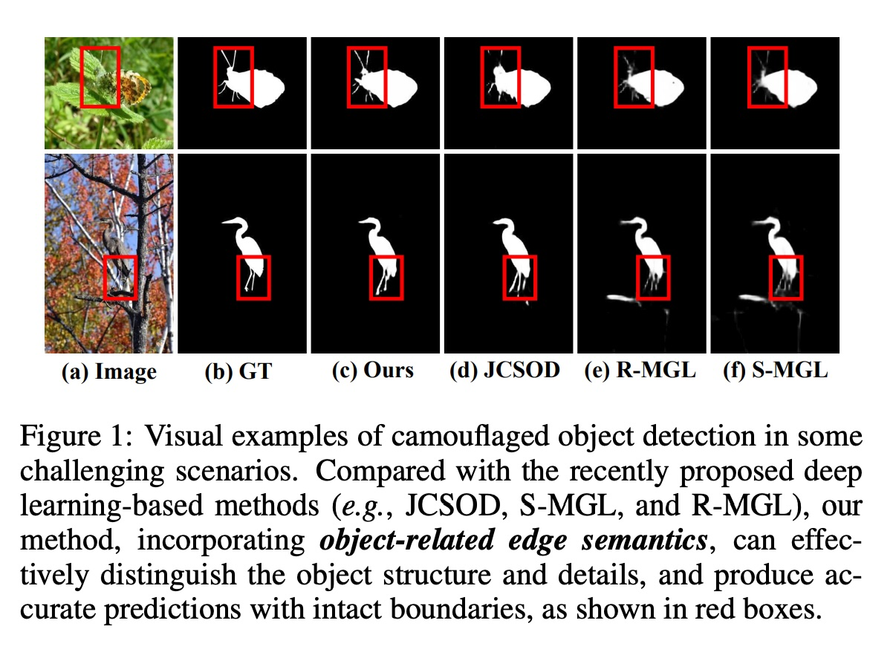
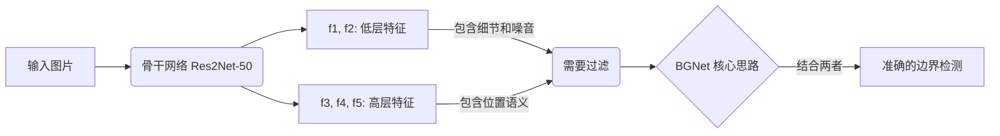
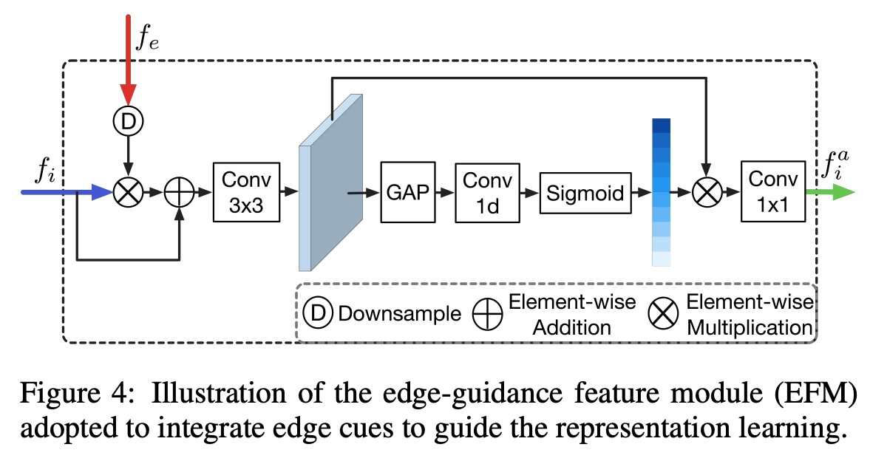
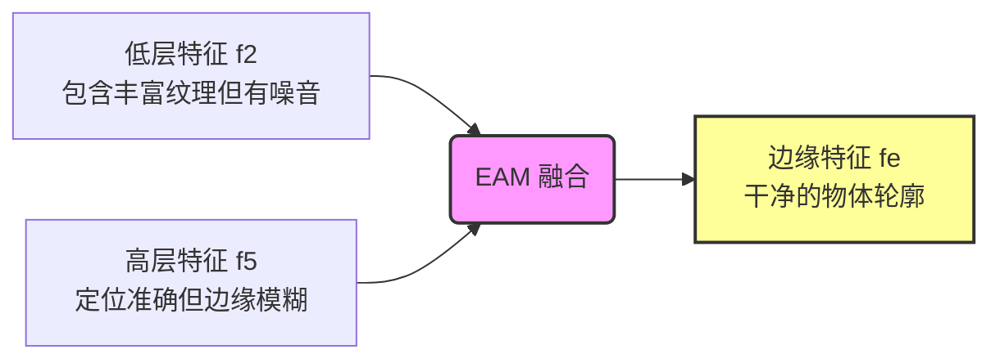
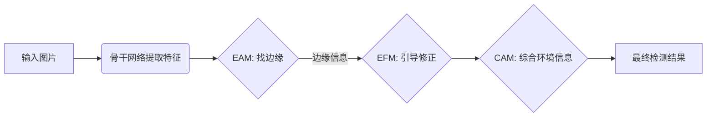

## AI论文解读 | Boundary-Guided Camouflaged Object Detection
        
### 作者        
digoal        
        
### 日期        
2025-12-17        
        
### 标签        
PostgreSQL , PolarDB , DuckDB , AI , 论文解读        
        
----        
        
## 背景  
      
https://arxiv.org/pdf/2207.00794        
  
提示:          
```          
读懂《Boundary-Guided Camouflaged Object Detection》这篇论文需要提前掌握哪些基础知识, 请使用中文通熟易懂的讲解这些基础知识, 可以引用论文中的图、表或使用Markdown支持的图形(text,mermaid等)增加解释性. 
  
使用中文通熟易懂的解读《Boundary-Guided Camouflaged Object Detection》这篇论文, 其中的关键内容请着重讲解, 可以引用论文中的图、表或使用Markdown支持的图形(text,mermaid等)增加解释性. 
  
提取《Boundary-Guided Camouflaged Object Detection》这篇论文中的重要术语, 使用中文对这些术语进行通熟易懂的讲解, 可以引用论文中的图、表或使用Markdown支持的图形(text,mermaid等)增加解释性. 
```     
  
## 1 前置知识 
  
要深入理解《Boundary-Guided Camouflaged Object Detection》（边界引导的伪装目标检测）这篇论文，你需要掌握以下几个核心领域的“前置知识”。

这篇论文提出了一个名为 **BGNet** 的模型，旨在解决伪装目标（如变色龙、昆虫）难以被检测的问题 。

以下是用通俗易懂的语言为你梳理的基础知识点：

---

### 1. 什么是伪装目标检测 (COD)？

**基础概念：**
普通的“目标检测”是找出图像中明显的物体（如街上的汽车）。而 **COD (Camouflaged Object Detection)** 的任务是找出那些故意“躲”在背景里的物体。

* 
**难点：** 这些物体与背景的纹理、颜色高度相似（即“高内在相似性”），这就是所谓的伪装 。


* **论文中的例子：** 如下图所示，普通的检测方法很难分清苍鹭的腿或蝴蝶的头部在哪里，因为它们和树枝、树叶融为一体了。

> **论文图示解释：**
> 如下图 (a) 和 (b) 所示，伪装物体（如昆虫、鸟类）的边缘非常模糊。论文指出，现有方法往往不仅检测不准，而且容易丢失**边界细节** 。
> 
> 
> 
> 图 1：(a) 原图 (b) 真实标签 (c) 本文方法 (d)-(f) 其他方法。可以看到红色框内，其他方法很难分清物体和背景的边界，而本文方法能准确还原细节 。
> 
> 

  

---

### 2. 深度学习中的“特征金字塔” (Multi-level Features)

**基础概念：**
卷积神经网络（CNN）在处理图片时，提取的信息是分层级的。这篇论文极其依赖对**低层特征**和**高层特征**的理解。

* 
**低层特征 (Low-level features)：** 比如网络的浅层（f_1, f_2）。它们分辨率高，包含丰富的**细节、边缘、纹理**，但不知道画面里具体是“猫”还是“狗” 。


* 
**高层特征 (High-level features)：** 比如网络的深层（f_4, f_5）。它们分辨率低，比较模糊，但包含了**语义信息**（即“哪里大概有个物体”），有很强的定位能力 。


**论文的应用：**
BGNet 的核心思想就是：既然低层特征有“边缘”，高层特征有“位置”，那就把它们结合起来！

* 它使用 Res2Net-50 作为骨干网络（Backbone），提取 f_1 到 f_5 五层特征 。


* 
**Edge-Aware Module (EAM)** 模块正是利用了低层特征 f_2（看清边缘）和高层特征 f_5（看清位置）来挖掘伪装物体的边界 。




---

### 3. 边缘先验 (Edge Prior) 与注意力机制

**基础概念：**
在计算机视觉中，“先验”是指我们预先知道的一些规律。这里指：如果我们知道物体的**边缘**在哪里，就能更好地把物体从背景里扣出来。

* 
**边缘的作用：** 论文认为，之前的模型之所以效果不好，是因为它们忽略了清晰的边缘信息 。


* **通道注意力 (Channel Attention)：** CNN 的特征图有很多“通道”（类似于图片的RGB层，但有成百上千个）。有些通道关注形状，有些关注纹理。注意力机制就是给这些通道“打分”，重要的通道权重高，不重要的（比如背景噪音）权重低。

**论文的应用：**
论文设计了 **EFM (Edge-Guidance Feature Module)** 。

1. 它把提取出的“边缘信息”注入到特征图中 。


2. 它使用了**局部通道注意力 (Local Channel Attention, LCA)** ，专门去强化那些与物体结构相关的特征，抑制背景噪音 。


> **图解 EFM 模块：**
> 如下图所示，边缘特征 f_e 被融合进特征流中，通过注意力机制（LCA）让网络“聚焦”于物体的轮廓。
> 
> 图 4：EFM 模块结构。通过乘法和加法操作，将边缘信息融入特征中 。
> 
> 

  

---

### 4. 空洞卷积 (Atrous/Dilated Convolution) 与感受野

**基础概念：**

* **感受野 (Receptive Field)：** 卷积核在原图上能看到的范围。感受野越大，看到的上下文越多（比如看到整只鸟，而不是只看到羽毛）。
* **空洞卷积：** 普通卷积是密集的，空洞卷积是在卷积核里“打洞”（扩大间距）。这样做的好处是： **不降低分辨率，就能扩大感受野**。

**论文的应用：**
论文设计了 **CAM (Context Aggregation Module)** 。

* 因为伪装物体和背景很像，必须看清“周围环境”才能判断。
* CAM 模块使用了不同膨胀率（dilation rate）的空洞卷积，以此来捕捉不同尺度的上下文信息（Multi-scale context） 。


---

### 5. 损失函数 (Loss Functions)

**基础概念：**
模型训练就是不断纠错的过程。损失函数就是用来计算“当前预测”和“标准答案”之间差距的公式。

* **BCE Loss (二元交叉熵)：** 像素级的分类错误（这个点是黑还是白？）。
* **IoU Loss (交并比)：** 预测框/区域和真实区域的重叠程度。
* 
**Dice Loss：** 专门用于处理**正负样本不平衡**的问题。在边缘检测中，边缘像素很少，背景像素很多，Dice Loss 能让模型更关注那少量的边缘像素 。


**论文的应用：**
BGNet 使用了组合拳：`BCE + IoU` 用于预测物体掩码（Mask），而 `Dice Loss` 专门用于监督**边缘预测** 。

---

### 总结：如何串联起来阅读？

当你阅读这篇论文时，可以按照这个逻辑链条：

1. **问题：** 伪装物体难发现，因为边缘模糊（对应知识点 1）。
2. **对策：** 我们需要专门强化边缘信息。
3. **手段 A (EAM)：** 从神经网络的“浅层”找细节，从“深层”找位置，合成边缘特征（对应知识点 2）。
4. **手段 B (EFM)：** 用注意力机制把边缘特征“贴”回到网络的主干中，指导网络去识别物体（对应知识点 3）。
5. **手段 C (CAM)：** 用空洞卷积看清大范围背景，进一步确认物体（对应知识点 4）。
6. **监督：** 用 Dice Loss 强迫网络必须画出清晰的边缘（对应知识点 5）。

**下一步建议：**
如果你想更深入了解其中的某个模块（例如 EAM 具体是如何融合 f_2 和 f_5 的），我可以为你详细拆解那个模块的数学公式和流程。
  
## 2 解读论文 
  
这份论文 **《Boundary-Guided Camouflaged Object Detection》 (BGNet)** 解决的是计算机视觉中一个非常棘手的问题： **伪装目标检测 (COD)** 。

简单来说，普通的物体检测是找“显眼包”（比如马路上的汽车），而伪装目标检测是找“老六”（比如躲在树叶里的变色龙）。

以下我将用通俗易懂的方式为你拆解这篇论文的核心逻辑、独创方法以及效果。

---

### 1. 核心痛点：为什么伪装目标这么难找？

现有的 AI 模型在找伪装物体时，往往能大概猜出物体在**哪里**，但很难画出物体精确的**轮廓**。

* 
**问题：** 伪装物体的纹理和背景太像了（高内在相似性），导致模型容易把背景当成物体，或者把物体的一部分当成背景 。


* 
**后果：** 预测出来的结果边缘模糊、残缺不全。就像下面论文图 1 展示的：其他方法（d, e, f）很难分清苍鹭的腿或蝴蝶的头，只有本文的方法（c）精准扣出了边缘 。

  

---

### 2. 核心思路：边界引导 (Boundary-Guided)

这篇论文的作者认为： **既然边缘最难找，那我们就专门设计一个模块来找边缘，然后把这个“边缘信息”强制喂给网络，告诉它“这里是轮廓，照着这个画”！** 

为此，作者提出了 **BGNet (Boundary-Guided Network)** 。它的结构可以拆解为三个“秘密武器”：

#### 武器一：边缘感知模块 (EAM - Edge-Aware Module)

**作用：** 专门负责在一堆乱糟糟的背景里把物体的边缘“抠”出来。

* **原理：**
* 如果只看**低层特征**（图象的浅层信息），边缘很清晰，但全是杂乱的背景纹理（噪点多）。
* 如果只看**高层特征**（图象的深层信息），位置很准，但边缘很模糊。
* 
**EAM 的做法：** 结合 **低层特征(f_2, 看细节)** + **高层特征(f_5, 定位置)** 。利用高层的定位能力，去过滤低层特征里的背景噪音，从而得到干净的物体边缘 。




> 
> **论文证据：** 作者在消融实验中测试了不同层级的组合，发现 f_2 + f_5 的组合效果最好 。
> 
> 

#### 武器二：边缘引导特征模块 (EFM - Edge-Guidance Feature Module)

**作用：** 把 EAM 找到的“边缘特征”注入到主干网络中，给网络“开天眼”。

* **原理：**
* 它不是简单地把边缘加进去，而是使用了一种**局部通道注意力机制 (Local Channel Attention, LCA)** 。


* 
**通俗解释：** 这就像老师划重点。EFM 告诉网络：“在这些特征通道里，只有那些跟边缘有关的信息是重要的，其他的背景噪音给我通过注意力机制抑制掉！” 。


#### 武器三：上下文聚合模块 (CAM - Context Aggregation Module)

**作用：** 结合上下文信息，进一步确认物体。

* 
**原理：** 伪装物体通常需要看“周围环境”才能识别（比如它是趴在树枝上还是藏在草丛里）。CAM 使用了不同比例的**空洞卷积**（Atrous Convolution），这就好比用不同倍数的放大镜同时看一张图，既看清了局部，也看清了全局，从而更准确地识别物体 。


---

### 3. 整体架构 (The Big Picture)

让我们把这三个模块拼起来，看下 BGNet 是怎么工作的（参考下图）：

1. 
**骨干网络 (Res2Net-50)：** 先把图片处理成5层不同深度的特征 (f_1 到 f_5) 。


2. 
**找边缘 (EAM)：** 拿 f_2 和 f_5 算出边缘特征 f_e 。


3. 
**注入引导 (EFM)：** 把边缘特征 f_e 分别注入到每一层特征中，修正网络的认知 。


4. 
**聚合输出 (CAM)：** 最后把各层修正后的特征融合起来，输出最终的预测图 。


---

### 4. 实验结果：效果如何？

为了证明这个方法好用，作者在三个主流数据集（CAMO, COD10K, NC4K）上跟 18 个顶尖模型打了一架。

* 
**定量对比：** 在所有指标上（S-measure, E-measure 等），BGNet 均取得了**第一名**的成绩 。


* 例如在 COD10K 数据集上，相比第二名 JCSOD，它的结构度量指标 (S_{\alpha}) 提升了 1.8% 。


* **定性对比（看图）：**
* 如下图所示，针对极其难识别的透明海洋生物或昆虫，BGNet (c列) 生成的掩码非常完整，而其他模型 (d-k列) 往往是破碎的 。


* **边缘对比：**
* 论文还特意对比了提取出的边缘（下图）。可以看到，相比于当时最强的 MGL 模型（基于复杂的图神经网络），BGNet 虽然结构简单，但提取出的边缘更细致、杂音更少 。


---

### 5. 总结

**《Boundary-Guided Camouflaged Object Detection》这篇论文教会了我们什么？**

1. **抓主要矛盾：** 伪装检测难在“边缘不清”，那就专门针对边缘建模。
2. **巧用特征：** 不需要复杂的图神经网络，只需要合理利用 CNN 的浅层细节（f_2）和深层语义（f_5），就能提取出绝佳的边缘先验。
3. **引导式学习：** 提取出先验知识（边缘）后，要通过注意力机制（EFM）显式地去“引导”网络，而不是让网络自己瞎猜。

这就是 BGNet 的核心魅力： **结构简单，但逻辑清晰，直击伪装目标检测的痛点。**
  
## 3 术语 
  
这篇论文提出了一种名为 **BGNet (Boundary-Guided Network)** 的深度学习模型，专门用于解决“伪装目标检测”这一难题。

为了让你更直观地理解，我提取了论文中的几个核心术语，并用通俗的语言配合图示进行讲解：

### 1. 伪装目标检测 (COD - Camouflaged Object Detection)

* **通俗解释**：普通的“目标检测”是找画面里显眼的东西（比如马路上的车），而 **COD** 是找那些“躲起来”的东西。
* 
**难点**：目标物体通过颜色、纹理模仿背景（如变色龙、枯叶蝶），导致它和背景极其相似，边缘非常模糊 。


* **论文中的例子**：
如下图所示，第一行的虫子和第二行的鸟（苍鹭），它们的身体颜色和周围的树叶、树枝几乎融为一体。普通方法（d, e, f 列）很难看清它们的轮廓，而本文的方法（c 列）能精准地把它们“抠”出来 。


### 2. 边界引导网络 (BGNet - Boundary-Guided Network)

* 
**通俗解释**：这是论文提出的总模型名称。它的核心思想是：“既然伪装物体很难找，那我们就专门派一个‘侦察兵’去找它的**边缘（边界）** ，然后用这个边缘信息告诉大部队物体在哪里” 。


* **工作流程**：
1. 先提取边缘特征。
2. 把边缘特征注入到网络中，修正识别结果。
3. 最后结合上下文环境，输出最终结果。




### 3. 边缘感知模块 (EAM - Edge-Aware Module)

* **通俗解释**：这是 BGNet 中的“侦察兵”，专门负责找边缘。
* **原理**：
* 神经网络的**浅层特征**（f_2）像放大镜，能看清纹理细节，但杂乱的背景噪音也多。
* **深层特征**（f_5）像望远镜，能定位物体大概在哪，但看不清边缘。
* 
**EAM 的做法**：把“放大镜”看到的细节和“望远镜”看到的位置结合起来，过滤掉背景噪音，只保留属于物体的边缘 。


* **图示**：
如下图所示，输入浅层特征 f_2 和深层特征 f_5，经过处理后输出清晰的边缘特征 f_e 。


### 4. 边缘引导特征模块 (EFM - Edge-Guidance Feature Module)

* **通俗解释**：这个模块的作用是“打辅助”和“划重点”。
* 
**原理**：它接收 EAM 找到的边缘信息 (f_e)，将其融合到主干网络的每一层特征中。它就像在告诉网络：“注意看！这里是物体的轮廓，别把背景算进来了” 。


* 
**局部通道注意力 (Local Channel Attention)** ：EFM 内部还包含一个机制，用来给特征通道“打分”。重要的特征（跟物体结构有关的）给高分，不重要的（背景噪音）给低分 。


### 5. 上下文聚合模块 (CAM - Context Aggregation Module)

* **通俗解释**：这个模块负责“顾全大局”。
* 
**原理**：伪装物体往往需要结合周围环境才能判断（比如它是趴在树上还是藏在草里）。CAM 利用不同比例的**空洞卷积**（Atrous Convolution），就像用不同倍数的镜头同时观察，既能看清局部细节，又能看清整体环境（多尺度上下文），从而更准确地判断物体范围 。


### 总结

这篇论文的逻辑非常清晰：针对伪装物体**边缘模糊**的问题，提出了 **BGNet**。它通过 **EAM** 挖掘边缘，通过 **EFM** 利用边缘信息指导识别，最后通过 **CAM** 结合环境信息，实现了比现有方法更精准的检测效果 。
  
## 参考        
         
https://arxiv.org/pdf/2207.00794    
        
<b> 以上内容基于DeepSeek、Qwen、Gemini及诸多AI生成, 轻微人工调整, 感谢杭州深度求索人工智能、阿里云、Google等公司. </b>        
        
<b> AI 生成的内容请自行辨别正确性, 当然也多了些许踩坑的乐趣, 毕竟冒险是每个男人的天性.  </b>        
  
    
#### [PolarDB 学习图谱](https://www.aliyun.com/database/openpolardb/activity "8642f60e04ed0c814bf9cb9677976bd4")
  
  
#### [PostgreSQL 解决方案集合](../201706/20170601_02.md "40cff096e9ed7122c512b35d8561d9c8")
  
  
#### [德哥 / digoal's Github - 公益是一辈子的事.](https://github.com/digoal/blog/blob/master/README.md "22709685feb7cab07d30f30387f0a9ae")
  
  
#### [About 德哥](https://github.com/digoal/blog/blob/master/me/readme.md "a37735981e7704886ffd590565582dd0")
  
  

  
