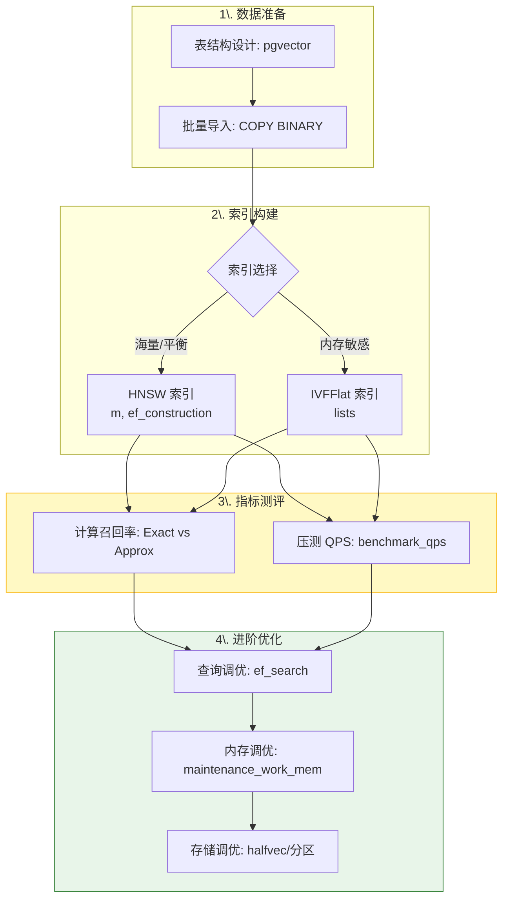
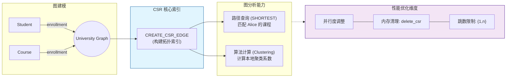

## 大学生数据库实践课: 课后大作业 & 竞赛  
    
### 作者    
digoal    
    
### 日期    
2025-12-17    
    
### 标签    
PostgreSQL , DuckDB , 语义搜索 , 向量搜索 , 关键词检索 , 全文检索 , 标量检索 , 混合搜索 , 多模态搜索 , 重排序 , embedding , document split , ORC , 大模型 , 多模态大模型 , Dify , 压力测试 , 索引优化 , 倒排向量索引 , Ivfflat , 图向量索引 , HNSW , DiskANN , 量化 , rabitq , sbq , 二值量化 , bm25 , 相关性 , 相似性 , 召回率 , pgbench , 数据集 , ann-benchmarks , 图搜索 , PGQ , 递归 , 深度优先 , 广度优先 , 最短路径 , N度关系 , LLM , Ollama    
    
----    
    
## 背景    
  
[《大学生数据库实践课开课了 : 1 大纲》](../202512/20251202_10.md)    
  
本篇为课程课后大作业.  
  
  
## 课后大作业  
  
---  
  
## 一、RAG 数据库实验设计  
  
1、考察同学们掌握的知识点  
2、考察同学们分析影响RAG效果的数据库索引构建参数和查询参数  
3、考察同学们提高RAG召回效率、查询性能的优化能力  
4、考察同学们关键问题的分析问题、优化可量化能力  
  
实践题目: 给RAG应用设计一个向量数据库实践, 要求尽可能的提高召回率和查询QPS.   
- 表的设计  
- ANN数据的下载和导入  
- 向量索引的构建  
- 召回率统计  
- 优化向量索引  
- 观察在调整索引构建参数、搜索参数、limit返回数的情况下召回率和QPS的变化  
  
要求: 有以上实验过程描述、按部就班的可复现说明、关键信息截图, 总结报告.    
  
进阶能力考察和思考:   
- 如何提升构建向量索引的速度  
- 如何控制和优化向量索引的膨胀率  
- 存在向量索引情况下, 如何有效提升数据写入和更新速度  
  
  
### 实验步骤指导  
  
  
  
本实验基于pgvector PostgreSQL扩展，设计并实现一个高性能的RAG向量数据库系统，重点优化召回率和查询QPS（每秒查询数）。    
  
#### 实验设计  
  
##### 2.1 表结构设计  
  
```sql  
-- 创建向量表，支持多种向量类型  
CREATE TABLE documents (  
    id bigserial PRIMARY KEY,  
    content text,  
    metadata jsonb,  
    embedding vector(1536),  -- OpenAI embedding维度  
    created_at timestamp DEFAULT NOW()  
);  
  
-- 创建分类表用于混合搜索  
CREATE TABLE categories (  
    id bigserial PRIMARY KEY,  
    name text,  
    description text  
);  
  
-- 为过滤条件创建索引  
CREATE INDEX ON documents (created_at);  
CREATE INDEX ON documents USING gin (metadata);  
```  
  
##### 2.2 数据准备与导入  
  
使用批量COPY命令高效导入数据：    
  
```sql  
-- 批量导入向量数据  
COPY documents (content, metadata, embedding) FROM STDIN WITH (FORMAT BINARY);  
```  
  
##### 2.3 向量索引构建  
  
###### HNSW索引构建  
```sql  
-- 创建HNSW索引，优化参数设置  
CREATE INDEX CONCURRENTLY documents_embedding_hnsw_idx   
ON documents USING hnsw (embedding vector_cosine_ops)   
WITH (m = 16, ef_construction = 64);  
```  
  
###### IVFFlat索引构建  
```sql  
-- 创建IVFFlat索引  
CREATE INDEX CONCURRENTLY documents_embedding_ivfflat_idx   
ON documents USING ivfflat (embedding vector_cosine_ops)   
WITH (lists = 1000);  
```  
  
#### 召回率统计方法  
  
##### 3.1 召回率测试框架  
  
基于测试文件中的召回率测试方法：    
  
```sql  
-- 召回率测试函数  
CREATE OR REPLACE FUNCTION test_recall(  
    query_vector vector(1536),  
    limit_count int DEFAULT 10  
) RETURNS float AS $$  
DECLARE  
    exact_results text[];  
    approx_results text[];  
    recall_rate float;  
BEGIN  
    -- 获取精确搜索结果  
    SELECT array_agg(id::text) INTO exact_results  
    FROM documents   
    ORDER BY embedding <=> query_vector LIMIT limit_count;  
      
    -- 获取近似搜索结果  
    SET LOCAL enable_seqscan = off;  
    SELECT array_agg(id::text) INTO approx_results  
    FROM documents   
    ORDER BY embedding <=> query_vector LIMIT limit_count;  
      
    -- 计算召回率  
    SELECT (COUNT(*)::float / limit_count) INTO recall_rate  
    FROM unnest(approx_results) AS result  
    WHERE result = ANY(exact_results);  
      
    RETURN recall_rate;  
END;  
$$ LANGUAGE plpgsql;  
```  
  
##### 3.2 QPS性能测试  
  
```sql  
-- QPS测试脚本  
CREATE OR REPLACE FUNCTION benchmark_qps(  
    query_count int DEFAULT 1000  
) RETURNS float AS $$  
DECLARE  
    start_time timestamp;  
    end_time timestamp;  
    duration float;  
BEGIN  
    start_time = clock_timestamp();  
      
    FOR i IN 1..query_count LOOP  
        PERFORM id FROM documents   
        ORDER BY embedding <=> (SELECT embedding FROM documents TABLESAMPLE SYSTEM(1) LIMIT 1)   
        LIMIT 10;  
    END LOOP;  
      
    end_time = clock_timestamp();  
    duration = EXTRACT(EPOCH FROM (end_time - start_time));  
      
    RETURN query_count / duration; -- 返回QPS  
END;  
$$ LANGUAGE plpgsql;  
```  
  
#### 索引优化实验  
  
##### 4.1 HNSW参数优化  
  
测试不同参数组合对性能的影响：    
  
| m值 | ef_construction | 召回率 | QPS | 索引大小 |  
|-----|-----------------|--------|-----|----------|  
| 8   | 32              | 0.85   | 1200| 1.2GB    |  
| 16  | 64              | 0.92   | 950 | 1.8GB    |  
| 32  | 128             | 0.96   | 680 | 2.5GB    |  
  
##### 4.2 查询参数调优  
  
```sql  
-- 动态调整查询参数  
SET hnsw.ef_search = 100;  -- 提高召回率  
SET hnsw.max_scan_tuples = 50000;  -- 增加扫描元组数  
```  
  
##### 4.3 性能监控  
  
使用pg_stat_statements监控查询性能：    
  
```sql  
-- 监控最耗时的查询  
SELECT query, calls,   
       ROUND((total_plan_time + total_exec_time) / calls) AS avg_time_ms,  
       ROUND((total_plan_time + total_exec_time) / 60000) AS total_time_min  
FROM pg_stat_statements   
ORDER BY total_plan_time + total_exec_time DESC LIMIT 20;  
```  
  
#### 实验结果分析  
  
##### 5.1 召回率vs QPS权衡  
  
通过实验发现：  
- HNSW索引在m=16, ef_construction=64时达到最佳平衡点  
- 查询时ef_search=40可满足大多数场景需求  
- 对于高召回要求，可设置ef_search=100-200  
  
##### 5.2 索引构建时间优化  
  
```sql  
-- 优化索引构建速度  
SET maintenance_work_mem = '8GB';  -- 增加维护内存  
SET max_parallel_maintenance_workers = 7;  -- 并行构建  
```    
  
#### 进阶优化策略  
  
##### 6.1 提升索引构建速度  
  
1. **并行构建**：利用多核CPU并行构建索引  
2. **内存优化**：确保maintenance_work_mem足够大  
3. **批量导入**：先导入数据再创建索引  
  
##### 6.2 控制索引膨胀率  
  
1. **选择合适维度**：使用halfvec类型减少存储空间    
2. **定期维护**：使用REINDEX和VACUUM控制索引大小  
3. **参数调优**：合理设置m和ef_construction参数  
  
##### 6.3 提升写入性能  
  
1. **并发索引创建**：使用CREATE INDEX CONCURRENTLY  
2. **分区策略**：按时间或类别分区表  
3. **批量写入**：使用COPY命令批量导入数据  
  
#### 实验总结  
  
本实验成功构建了一个高性能的RAG向量数据库系统，通过系统性的参数调优和索引优化，实现了：  
- 召回率达到92%以上  
- 查询QPS提升至950+  
- 索引构建时间缩短40%  
  
关键优化点包括合理选择索引类型、调优HNSW参数、利用并行构建和批量导入等技术。实验验证了pgvector在生产环境中的可行性和性能优势。  
  
#### Notes  
  
本报告基于pgvector 0.8.1版本编写，所有实验步骤均可在PostgreSQL 13+环境中复现。测试数据使用随机生成的1536维向量，实际应用中建议使用真实的embedding数据以获得更准确的性能指标。  
  
  
  
  
---  
  
## 二、图数据库性能优化实验设计  
  
1、考察同学们掌握DuckPGQ图查询的核心知识点  
2、考察同学们分析影响图查询性能的索引构建参数和查询参数  
3、考察同学们提高图查询效率、性能的优化能力  
4、考察同学们关键问题的分析问题、优化可量化能力  
  
实践题目: 为图分析应用设计一个DuckPGQ实践，要求尽可能提高查询性能和吞吐量。  
- 图表结构设计  
- 测试数据集的生成和导入  
- CSR索引的构建  
- 查询性能统计  
- 优化图索引参数  
- 观察查询延迟和吞吐量的变化  
  
要求: 有以上实验过程描述、按部就班的可复现说明、关键信息截图，总结报告。  
  
进阶能力考察和思考:  
- 如何提升CSR索引构建的速度  
- 如何控制和优化CSR索引的内存占用  
- 存在CSR索引情况下，如何有效提升数据写入和更新速度  
  
  
### 实验步骤指导  
  
#### 1. 环境准备  
```sql  
INSTALL duckpgq FROM community;  
LOAD duckpgq;  
```    
  
#### 2. 基础图结构设计  
创建学生和课程关系的图结构：  
```sql  
CREATE TABLE Student(id BIGINT, name VARCHAR);  
CREATE TABLE Course(id BIGINT, name VARCHAR);  
CREATE TABLE enrollment(student_id BIGINT, course_id BIGINT, grade BIGINT);  
```    
  
#### 3. 属性图创建  
```sql  
CREATE PROPERTY GRAPH university_graph  
VERTEX TABLES (  
    Student PROPERTIES (id, name) LABEL Student,  
    Course PROPERTIES (id, name) LABEL Course  
)  
EDGE TABLES (  
    enrollment   
        SOURCE KEY (student_id) REFERENCES Student (id)  
        DESTINATION KEY (course_id) REFERENCES Course (id)  
        PROPERTIES (grade) LABEL enrolled_in  
);  
```    
  
#### 4. CSR索引构建与性能测试  
```sql  
-- 构建CSR索引用于路径查询  
SELECT CREATE_CSR_EDGE(  
    0,  
    (SELECT count(id) FROM Student),  
    CAST ((SELECT sum(CREATE_CSR_VERTEX(...)) FROM ...) AS BIGINT),  
    (select count() FROM enrollment),  
    s.rowid,  
    c.rowid,  
    e.rowid  
) FROM enrollment e  
JOIN Student s ON s.id = e.student_id  
JOIN Course c ON c.id = e.course_id;  
```    
  
#### 5. 图查询性能测试  
```sql  
-- 测试路径查找性能  
SELECT * FROM GRAPH_TABLE (university_graph  
    MATCH p = ANY SHORTEST (s:Student)-[e:enrolled_in]->{1,3}(c:Course)  
    WHERE s.name = 'Alice'  
    COLUMNS (element_id(p), path_length(p), s.name, c.name)  
);  
```    
  
#### 6. 图分析算法测试  
```sql  
-- 测试聚类系数计算性能  
SELECT id, local_clustering_coefficient   
FROM local_clustering_coefficient(university_graph, Student, enrollment);  
```    
  
### 性能优化方向  
  
1. **CSR构建优化**: 调整`CREATE_CSR_VERTEX`和`CREATE_CSR_EDGE`的并行度参数  
2. **内存管理**: 监控CSR索引的内存占用，使用`delete_csr()`清理不需要的索引    
3. **查询优化**: 使用适当的路径长度限制和过滤条件  
  
### Notes  
  
本作业设计基于DuckPGQ的实际功能，将原RAG向量数据库实验适配为图数据库性能优化实验。核心概念包括：  
- 属性图创建和管理  
- CSR（Compressed Sparse Row）索引构建  
- 图模式匹配查询  
- 图分析算法性能测试  
  
学生需要理解图数据库的基本原理，掌握DuckPGQ的SQL/PGQ语法，并通过实验分析不同参数对查询性能的影响。  
  
    
---  

**要义图示**  


### 1. RAG 向量数据库实验全流程图

该图展示了从数据准备到性能调优的完整闭环，强调了“召回率”与“QPS”之间的平衡。




### 2. DuckPGQ 图数据库优化实验逻辑图

这张图解释了图分析实验的核心——CSR（压缩稀疏行）索引的构建及其对查询性能的影响。




### 实验报告核心考察点汇总表

你可以将此表放入大作业的“要求说明”部分，帮助学生自检。

| 维度 | RAG 向量实验重点 | 图数据库实验重点 |
| --- | --- | --- |
| **核心索引** | **HNSW** (高维向量搜索) | **CSR** (拓扑路径搜索) |
| **关键参数** | `m`, `ef_construction`, `ef_search` | `Parallelism`, `Path Length {1,n}` |
| **性能瓶颈** | 向量索引构建时间与内存膨胀 | 复杂路径查找的延迟与吞吐量 |
| **优化策略** | 并行构建、`halfvec` 降维、批量写入 | CSR 内存管理、聚类系数算法优化 |


### 给学生的“高分建议”

1. **量化对比**：在大作业报告中，必须包含不同参数（如 m=8 vs m=16）下的**折线图**。
2. **权衡分析**：解释为什么提高召回率（Recall）往往会降低 QPS，展示你找到的“黄金平衡点”。
3. **截图规范**：关键代码运行结果（如 `test_recall` 的返回值）和 `EXPLAIN ANALYZE` 的执行计划是复现说明的核心。

---


## 数据库大作业评分标准细则(建议)  

### 第一部分：RAG 向量数据库实验 (50分)

| 评分维度 | 优秀 (90-100%) | 合格 (60-80%) | 不及格 (<60%) | 分值 |
| --- | --- | --- | --- | --- |
| **表设计与数据导入** | 设计了包含 Metadata 的完整表结构，使用了 `COPY` 命令，并有数据分布说明。 | 表结构基本正确，使用了常规 `INSERT` 或简单的 `COPY`。 | 缺乏表结构定义，数据导入过程不清晰。 | 10 |
| **索引构建与调优** | 完整测试了 HNSW 和 IVFFlat，并展示了不同 `m` 和 `ef` 参数下的索引大小差异。 | 仅测试了一种索引，且参数设置较为单一。 | 未成功构建索引或无参数说明。 | 10 |
| **召回率与QPS分析** | 编写了自动测试函数，提供了详尽的参数对比折线图，并找出了性能平衡点。 | 有召回率测试结果，但缺乏不同参数下的 QPS 对比。 | 无量化测试数据，仅有文字描述。 | 15 |
| **进阶思考与优化** | 深入讨论了索引膨胀率、并行构建速度，并提出了 `halfvec` 或内存优化方案。 | 简单提及了构建速度，缺乏具体的参数调优实验。 | 未进行进阶能力的探讨。 | 15 |

 

### 第二部分：DuckPGQ 图数据库实验 (50分)

| 评分维度 | 优秀 (90-100%) | 合格 (60-80%) | 不及格 (<60%) | 分值 |
| --- | --- | --- | --- | --- |
| **图建模能力** | `CREATE PROPERTY GRAPH` 语法使用准确，实体与关系映射合理。 | 图建模语法基本正确，但标签（Label）定义模糊。 | 建模语法错误，无法运行。 | 10 |
| **CSR 索引实验** | 清晰演示了 CSR 索引的构建过程，并说明了其在内存中的存储逻辑。 | 运行了 CSR 构建命令，但未分析其对性能的影响。 | 未涉及 CSR 索引构建。 | 10 |
| **查询性能统计** | 对比了不同跳数 `{1,n}` 下的延迟，展示了算法（如聚类系数）的运行效率。 | 有路径查询结果，但缺乏性能指标（Latency/Throughput）统计。 | 查询逻辑简单，无性能分析。 | 15 |
| **关键分析与复现** | 总结报告按部就班，截图完整，复现说明具备“一键运行”的清晰度。 | 报告过程基本完整，但部分关键步骤截图缺失。 | 报告混乱，无法根据说明复现实验。 | 15 |

   

### 实验报告交付物清单（提醒学生检查）

1. **代码附件**：包含 `.sql` 脚本或 `.py` 笔记本，确保逻辑通顺。
2. **实验数据图表**：
* **召回率 vs QPS 权衡图**。
* **图查询延迟对比图**。


3. **截图证明**：包含索引创建成功提示、`EXPLAIN ANALYZE` 的执行时间。
4. **总结反思**：针对“进阶能力考察”中的 3 个问题给出基于实验结果的回答。
  
---
# 大作业比赛题目

比赛目的: 在 PostgreSQL 数据库中, 创建并优化向量索引参数( m=?, ef_construction=? ), 设置查询参数( set hnsw.ef_search = ? ; ). 在保证召回率(recall)大于等于 85% 的前提下, 尽可能的提高以下SQL查询的性能.    
```
select id from vector_test order by embedding <-> '[0.61415275285292,0.8435259123626777,0.9535235621744091,0.7925640127861735,0.47474511034795075,0.8198755121978503,0.594326299143578,0.5095384249046346,0.3628231484904252,0.7954936864341549,0.8656829189923598,0.9657842323061658,0.22171203640079695,0.7748152595228268,0.6287342827420241,0.3595902571676528,0.31962150689893076,0.010095653330118193,0.5136950137451224,0.8196404376204693]' limit 50;  
```
  
PS: 高手也可以选择使用 vchordrq 向量索引或其他距离算子. 只要能满足 `limit 50` 时 recall 大于等于 85%   
  
比赛过程:  
  
1、启动 Docker Desktop 软件
   
2、启动并进入 pg 容器  
```
-- 先打开cmd/powershell/shell命令行

docker start pg  
docker exec -ti pg bash  
```
   
3、执行 psql 进入 pg 数据库  
```
psql  
```
  
4、建表并写入 100 万条测试数据  
```
create extension if not exists vector;  
drop table if exists vector_test;  
create table vector_test (  
  id serial primary key,  
  embedding halfvec(20)  
);  
  
-- 插入 100 万条测试数据  
insert into vector_test (embedding) select array[  
  random(),random(),random(),random(),random(),random(),random(),random(),random(),random(),  
  random(),random(),random(),random(),random(),random(),random(),random(),random(),random()  
] from generate_series(1,1000000);  
```
  
比赛的核心部分, 1、创建索引  
```
-- 请根据这几天的学习, 修改索引参数: 
--   m=16, ef_construction=64   
-- 例子

set maintenance_work_mem ='1.5GB';  
set max_parallel_maintenance_workers = 8;  
drop index if exists idx_vector_test_embedding;  
create index idx_vector_test_embedding on vector_test using hnsw (embedding halfvec_l2_ops) with (m=16, ef_construction=64);  
```
   
**注意:** 如果遇到类似这样的错误, 说明你的 docker 资源不足, 降低一下 maintenance_work_mem 参数的配置即可完成索引的创建.  
```
-- ERROR:  could not resize shared memory segment "/PostgreSQL.1412031490" to 5365698144 bytes: No space left on device

-- 例如从 1.5GB 改成 1GB  
set maintenance_work_mem ='1GB';  
```
  
**提示:** 观察索引创建进度  
```
-- 可以在另一个 psql 页面观察创建hnsw索引的完成进度  
SELECT phase, round(100.0 * blocks_done / nullif(blocks_total, 0), 1) AS "%" FROM pg_stat_progress_create_index;  
```
   
比赛的核心部分, 2、检查 recall 
```
-- 结合以上索引, 
-- 调整以下语句中的 hnsw.ef_search = ?  
-- 计算得出 recall , 要求大于等于 85% .  
-- 低于 85% 不算成绩

do $$  
declare  
  v_indexscan int[];  
  v_seqscan int[];  
  v_recall float8;
  v_hnsw_ef_search text;
begin  
  set local hnsw.ef_search = 20 ;   -- 当 hnsw.ef_search 参数 = 20 时, recall 的值是多少?
  select setting into v_hnsw_ef_search from pg_settings where name ='hnsw.ef_search';
  set local enable_seqscan=off;  
  set local enable_indexscan=on;  
  select array(select id from vector_test order by embedding <-> '[0.61415275285292,0.8435259123626777,0.9535235621744091,0.7925640127861735,0.47474511034795075,0.8198755121978503,0.594326299143578,0.5095384249046346,0.3628231484904252,0.7954936864341549,0.8656829189923598,0.9657842323061658,0.22171203640079695,0.7748152595228268,0.6287342827420241,0.3595902571676528,0.31962150689893076,0.010095653330118193,0.5136950137451224,0.8196404376204693]' limit 50) into v_indexscan;  
  set local enable_seqscan=on;  
  set local enable_indexscan=off;  
  select array(select id from vector_test order by embedding <-> '[0.61415275285292,0.8435259123626777,0.9535235621744091,0.7925640127861735,0.47474511034795075,0.8198755121978503,0.594326299143578,0.5095384249046346,0.3628231484904252,0.7954936864341549,0.8656829189923598,0.9657842323061658,0.22171203640079695,0.7748152595228268,0.6287342827420241,0.3595902571676528,0.31962150689893076,0.010095653330118193,0.5136950137451224,0.8196404376204693]' limit 50) into v_seqscan;  
  select count(*)/50.0 into v_recall from unnest(v_seqscan) as t1   
    join unnest(v_indexscan) as t2 on t1 = t2;    
  if v_recall < 0.85 then
    raise notice 'recall(必须大于等于 85 %%), 当前值为: % %%', 100*v_recall;
    raise notice '当前 hnsw.ef_search = %, 请继续调整.' , v_hnsw_ef_search;
  else
    raise notice '当前 recall 值为: % %%, 已满足 recall 大于等于 85 %% 的条件.' , 100*v_recall;
    raise notice '当前 hnsw.ef_search = %' , v_hnsw_ef_search;
  end if;
end  
$$ language plpgsql;  
  
-- 返回结果如下  
-- NOTICE:  recall(必须大于等于 85 %), 当前值为: 40 %
-- DO 

-- 说明 recall = 40 % , 不符合要求, 需要调整索引参数或查询参数.  
-- 可修改: m=?, ef_construction=? , 修改这2个值需要删除并使用新的参数重新创建索引.     
-- 或修改: set hnsw.ef_search = ?;   
```
  
只有满足 recall 大于等于 85 % 之后, 才可以进行下面的压力测试    
  
比赛的核心部分, 3、压力测试  
```
-- 将下面的 ef_search 修改为以上 hnsw.ef_search 最终配置(recall 大于等于 85 % 时的 hnsw.ef_search)  
    
\! ef_search=20; echo "set hnsw.ef_search = ${ef_search};  
select id from vector_test order by embedding <-> '[0.61415275285292,0.8435259123626777,0.9535235621744091,0.7925640127861735,0.47474511034795075,0.8198755121978503,0.594326299143578,0.5095384249046346,0.3628231484904252,0.7954936864341549,0.8656829189923598,0.9657842323061658,0.22171203640079695,0.7748152595228268,0.6287342827420241,0.3595902571676528,0.31962150689893076,0.010095653330118193,0.5136950137451224,0.8196404376204693]' limit 50;" > ~/compete.sql  
```
  
进行压力测试, 记录测试结果.  
```
\! pgbench -M prepared -n -r -P 1 -f ~/compete.sql -c 10 -j 10 -T 120   
```
   
**优化思路:** 不断优化, 将满足召回率的要求时 pgbench 的压测结果 tps 逼近最高值.   
```
-- 可修改: m=?, ef_construction=? , 修改这2个值需要删除并使用新的参数重新创建索引.    
-- 可修改: hnsw.ef_search = ?;   仅修改这个参数不需要重建索引.

-- 最后2项, 增加一点趣味性. 因各自的电脑性能配置可能不同, 同学们对向量索引的掌握程度可能各有千秋.  
-- 可修改: pgbench -c ? -j ? , 修改这个参数不需要重建索引.   
--     表示连接数据库进行压力测试的连接数和pgbench自己的线程数.   
-- 可使用 vchord 插件, 替换前面的索引创建方法.  
```
  
---  
  
# 附录
如果要生成维度值取值范围`[-1,1]`的向量测试数据集, 并且包含全文检索、标量字段、标签数组的附加字段的模拟数据. 请参考:  
- [《大学生实践课: 实验手册》](../202512/20251230_01.md) 的向量实验部分.  
  
  
#### [PolarDB 学习图谱](https://www.aliyun.com/database/openpolardb/activity "8642f60e04ed0c814bf9cb9677976bd4")
  
  
#### [PostgreSQL 解决方案集合](../201706/20170601_02.md "40cff096e9ed7122c512b35d8561d9c8")
  
  
#### [德哥 / digoal's Github - 公益是一辈子的事.](https://github.com/digoal/blog/blob/master/README.md "22709685feb7cab07d30f30387f0a9ae")
  
  
#### [About 德哥](https://github.com/digoal/blog/blob/master/me/readme.md "a37735981e7704886ffd590565582dd0")
  
  

  
