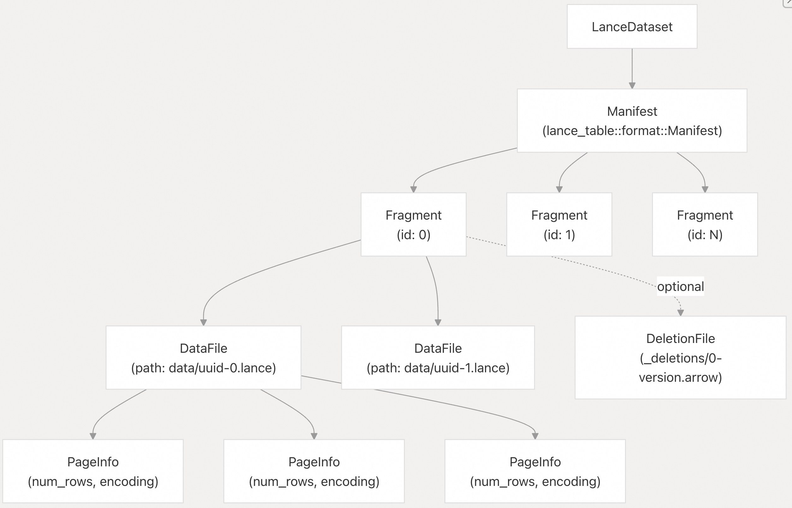
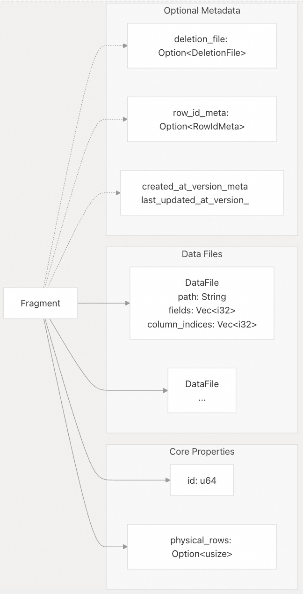
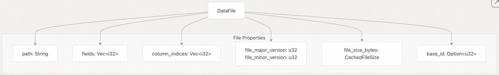
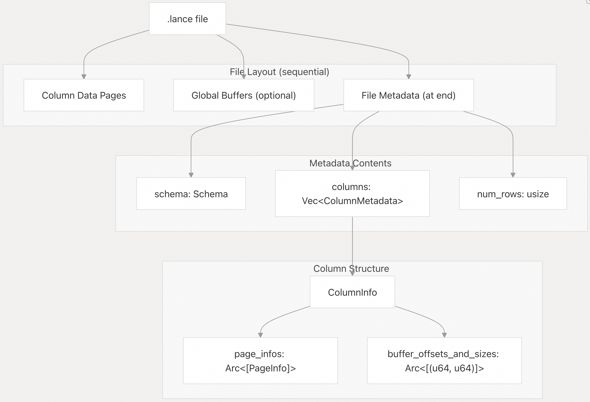
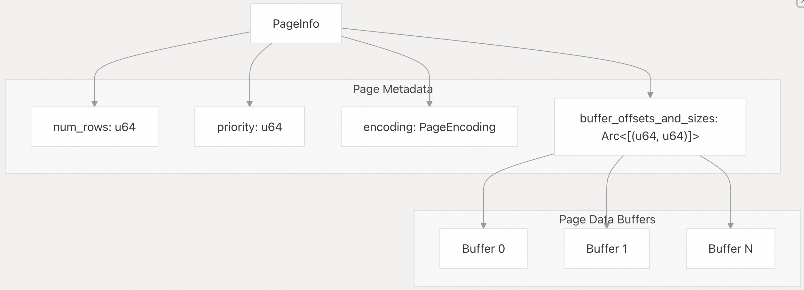
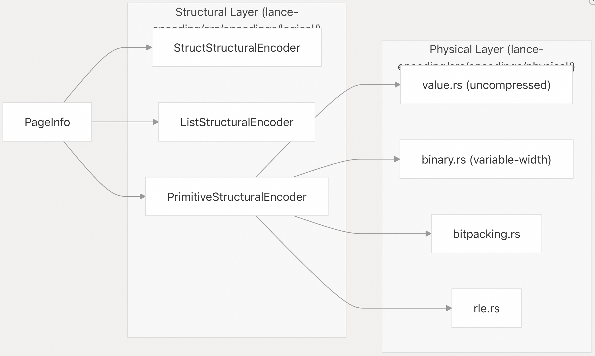
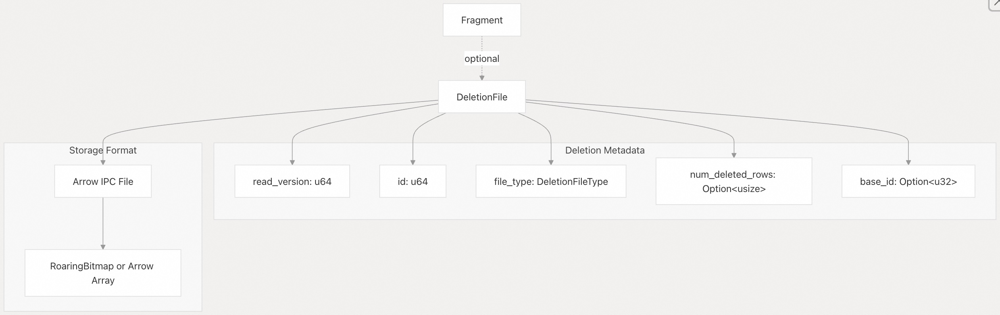
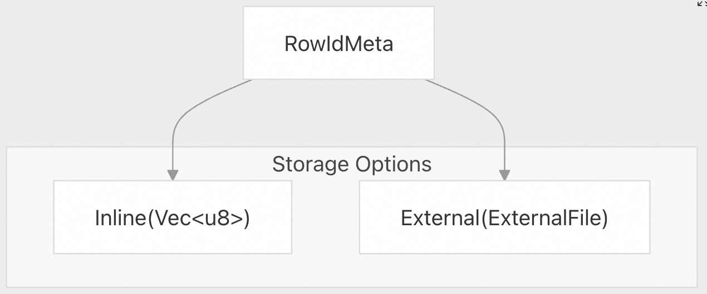

## Lance 源码学习: 6 数据组织 (Data Organization)  
                
### 作者                
digoal                
                
### 日期                
2025-12-24                
                
### 标签                
Lance , AI 数据存储与搜索引擎 , 存储引擎 , 向量索引 , 标量索引 , 全文检索 , 多模态支持 , 零拷贝 , 版本控制 , 时间旅行 , 源码学习 , 随机访问加速 , Parquet                
                
----                
                
## 背景          
  
本文介绍 Lance 如何在磁盘上物理组织数据，涵盖了从数据集到单个数据文件的层级结构。描述分片 (fragments)、数据文件 (data files)、页面 (pages) 以及相关的元数据结构的作用。  
  
## 数据集存储层级 (Dataset Storage Hierarchy)  
  
Lance 以层级结构组织数据，旨在支持高效的版本控制、更新和列式访问：  
  
**图表：Lance 数据集存储层级**  
  
    
  
在最高层级，一个数据集包含：  
  
* 指向数据集位置的 `URI`。  
* 存储在 `_versions/` 中的 `Manifest`（清单），用于跟踪当前版本、模式 (schema) 和 `Fragment` 对象列表。  
* 一个或多个 `Fragment` 实例（由 `lance_table::format::Fragment` 表示），代表数据的逻辑分区。  
* 每个分片包含一个或多个存储实际列数据的 `DataFile` 结构。  
* 可选的 `DeletionFile`，使用 RoaringBitmaps 跟踪每个分片的已删除行。  
* 每个数据文件包含多个描述编码列数据的 `PageInfo` 结构。  
  
## 分片 (Fragments)  
  
分片是 Lance 数据组织的基本单元。每个分片代表行的一个逻辑分区，并维护存储这些行的数据文件的元数据。  
  
### 分片结构  
  
**图表：lance_table::format::Fragment 中的分片结构**  
  
    
  
`Fragment` 结构包含：  
  
| 字段 | 类型 | 描述 |  
| --- | --- | --- |  
| `id` | `u64` | 分片的唯一标识符 |  
| `files` | `Vec<DataFile>` | 属于该分片的数据文件列表 |  
| `physical_rows` | `Option<usize>` | 删除前的总行数（旧版分片为 None） |  
| `deletion_file` | `Option<DeletionFile>` | 使用 RoaringBitmap 跟踪已删除行（存储在 `_deletions/` 目录） |  
| `row_id_meta` | `Option<RowIdMeta>` | 稳定行 ID 的元数据（见 `Stable Row IDs`） |  
| `created_at_version_meta` | `Option<RowDatasetVersionMeta>` | 行创建时的版本 |  
| `last_updated_at_version_meta` | `Option<RowDatasetVersionMeta>` | 行最后一次更新时的版本 |  
  
分片中实际可见的行数为 `physical_rows - num_deletions`。`python/python/lance/fragment.py` 中的 `LanceFragment` 封装通过 PyO3 绑定提供了对此结构的 Python 访问。  
  
## 数据文件 (Data Files)  
  
数据文件是包含编码列数据的物理存储单元。每个分片可以有多个数据文件，每个文件存储数据集列的一个子集。`DataFile` 结构体定义在 `rust/lance-table/src/format/fragment.rs` 中。  
  
### 数据文件结构  
  
**图表：lance_table::format::DataFile 中的 DataFile 结构**  
  
    
  
每个 `DataFile` 包含：  
  
| 字段 | 类型 | 描述 |  
| --- | --- | --- |  
| `path` | `String` | 相对于数据集根目录的路径（如果使用 `base_id` 则为绝对路径） |  
| `fields` | `Vec<i32>` | 存储在该文件中的字段 ID 列表（来自模式） |  
| `column_indices` | `Vec<i32>` | 对于每个字段，其在文件中的列索引（若无顶层列则为 -1） |  
| `file_major_version` | `u32` | Lance 文件格式的主版本号（0 为旧版，2 为 v2.x） |  
| `file_minor_version` | `u32` | 次版本号（0 为 v2.0，1 为 v2.1 等） |  
| `file_size_bytes` | `CachedFileSize` | 缓存的文件大小以避免 stat 调用 |  
| `base_id` | `Option<u32>` | 外部存储位置的可选引用（见 `Multi-Base Storage`） |  
  
### 字段到列的映射  
  
模式字段与物理列之间的关系取决于数据类型和编码策略。`rust/lance-encoding/src/encoder.rs` 中的 `ColumnIndexSequence` 在编码期间管理此映射。  
  
**图表：字段到列的映射（使用 StructuralEncodingStrategy）**  
  
    
  
  
`rust/lance-encoding/src/encoder.rs` 中 `StructuralEncodingStrategy::create_field_encoder` 实现的映射规则：  
  
* 原生类型 (int, float, string 等)：通过 `PrimitiveStructuralEncoder` 映射为单列。  
* 结构体类型（非压缩）：每个子字段通过 `StructStructuralEncoder` 获得列。  
* 列表类型：项存储在列中，偏移量通过 `ListStructuralEncoder` 存储在重复/定义层级 (rep/def levels) 中。  
* 压缩结构体：作为原生类型编码为单列。  
* 固定大小列表：视为原生类型（扁平化为单列）。  
  
`DataFile` 中的 `column_indices` 数组提供了从字段 ID 到该特定文件中列索引的映射。在旧版文件 (v0.2) 中，此数组为空，字段按顺序直接映射到列。在 v2.0+ 文件中，`column_indices` 明确存储映射。  
  
## Lance 文件格式结构  
  
Lance 文件使用针对随机访问和高效编码优化的列式格式。`python/src/file.rs` 中的 `LanceFileWriter` 处理文件创建，而 `LanceFileReader` 处理读取。  
  
**图表：Lance 文件结构 (.lance 文件)**  
  
    
  
### 文件布局  
  
Lance 文件由 `LanceFileWriter` 顺序写入，并由 `LanceFileReader` 随机访问读取。  
  
1. **列数据页 (Column data pages)** 首先被写入（偏移量 0），通过 `BatchEncoder` 每次写入一个列。  
2. **全局缓冲区 (Global buffers)** （如有）在列数据之后通过 `OutOfLineBuffers` 写入。  
3. **文件元数据 (File metadata)** 作为 protobuf 消息最后写入，包含：  
* 模式定义 (`lance_core::datatypes::Schema`)  
* 列元数据 (`Vec<ColumnMetadata>`，包含缓冲区位置和页面描述)  
* 统计信息和版本信息  
  
  
  
这种“元数据在末尾”的设计允许读取器：  
  
* 无需读取数据即可确定模式（通过定位到文件末尾）。  
* 使用 `buffer_offsets_and_sizes` 直接定位到特定页面进行随机访问。  
* 高效投影列（通过 `ColumnInfo` 仅读取需要的列）。  
  
`rust/lance-encoding/src/decoder.rs` 中的 `DecodeBatchScheduler` 使用这些元数据来调度 I/O 操作。  
  
## 页面与列组织  
  
在每个数据文件中，数据被组织成“页面 (pages)”。页面是 I/O 和解码的基本单位，由 `rust/lance-encoding/src/decoder.rs` 中的 `PageInfo` 表示。  
  
### 页面结构  
  
**图表：lance_encoding::decoder 中的 PageInfo 结构**  
  
    
  
每个 `PageInfo` 结构包含：  
  
| 字段 | 类型 | 描述 |  
| --- | --- | --- |  
| `num_rows` | `u64` | 该页面中的行数 |  
| `priority` | `u64` | 第一行的顶层行号（用于 I/O 调度优先级） |  
| `encoding` | `PageEncoding` | `Legacy` (旧版) 或 `Structural` (结构化) 编码 |  
| `buffer_offsets_and_sizes` | `Arc<[(u64, u64)]>` | 页面中每个缓冲区的（文件偏移量, 大小）对数组 |  
  
`rust/lance-encoding/src/encoder.rs` 中的 `EncodedPage` 结构是写入端的对应项，在写入磁盘前包含已编码的缓冲区。  
  
### 页面大小与边界  
  
页面大小可通过 `rust/lance-encoding/src/encoder.rs` 中的 `EncodingOptions` 进行配置：  
  
| 选项 | 默认值 | 描述 |  
| --- | --- | --- |  
| `cache_bytes_per_column` | `8 MiB` | 创建页面前内存中累积的数据量 |  
| `max_page_bytes` | `32 MiB` | 单个页面的最大尺寸（较大的页面将被拆分） |  
| `buffer_alignment` | `64 bytes` | 文件内缓冲区的对齐方式 |  
  
页面边界规则：  
  
* 页面永远不会拆分顶层行（最外层的行）。  
* 对于列表/嵌套数据，一个顶层行可能包含许多项。  
* 示例：列表数据 `[[1,2,3], [4,5], [6]]` 包含 3 个顶层行，但包含 6 个项。  
  
`EncodedPage` 中的 `row_number` 字段存储第一行的顶层行号，I/O 调度器利用该字段来优先处理页面，以便尽快解码完整的行。  
  
### 编码概述  
  
页面内的数据使用编码系统实现的两级编码方案。  
  
**图表：两级编码架构**  
  
    
  
* `结构化编码 (Structural encoding)`：通过 `StructuralFieldEncoder` trait 处理模式层级问题（空值、列表、结构体）。  
* `物理编码 (Physical encoding)`：通过 `MiniBlockCompressor` 和 `PerValueCompressor` trait 处理压缩和高效存储。  
  
`rust/lance-encoding/src/encoder.rs` 中的 `StructuralEncodingStrategy` 根据数据类型和配置决定使用哪些编码器。每个页面使用的具体编码存储在 `PageEncoding` 枚举中。  
  
## 删除跟踪 (Deletion Tracking)  
  
Lance 使用“删除文件 (deletion files)”来跟踪已删除的行，而无需重写数据文件。这实现了高效的更新和删除。`DeletionFile` 结构体定义在 `rust/lance-table/src/format/fragment.rs` 中。  
  
### 删除文件结构  
  
**图表：lance_table::format 中的 DeletionFile 结构**  
  
    
  
`DeletionFile` 结构包含：  
  
| 字段 | 类型 | 描述 |  
| --- | --- | --- |  
| `read_version` | `u64` | 记录删除时的版本 |  
| `id` | `u64` | 删除文件的唯一 ID |  
| `file_type` | `DeletionFileType` | `Array` (数组) 或 `Bitmap` (位图) |  
| `num_deleted_rows` | `Option<usize>` | 已删除行的计数（未知则为 None） |  
| `base_id` | `Option<u32>` | 外部存储基准（如适用） |  
  
删除文件路径计算为 `_deletions/<fragment_id>-<version>-<id>.<suffix>`。文件包含一个 RoaringBitmap（针对 `Bitmap` 类型）或 Arrow 数组（针对 `Array` 类型），用于跟踪分片内的已删除行偏移量。  
  
## 行 ID 与版本元数据  
  
对于启用了稳定行 ID 的数据集，分片会跟踪用于行识别和版本控制的额外元数据。  
  
### RowIdMeta 结构  
  
**图表：lance_table::format 中的 RowIdMeta**  
  
    
  
`RowIdMeta` 枚举以内联或外部文件的方式存储行 ID 序列数据：  
  
| 变体 | 描述 |  
| --- | --- |  
| `Inline(Vec<u8>)` | 行 ID 序列直接存储在清单中 |  
| `External(ExternalFile)` | 引用包含行 ID 序列的外部文件 |  
  
稳定行 ID 允许行在压缩和其他维护操作中保持一致的标识符。  
  
## 版本元数据  
  
**图表：RowDatasetVersionMeta 跟踪**  
  
    
  
`RowDatasetVersionMeta` 结构（定义在 `rust/lance-table/src/rowids/version.rs` 中）跟踪分片中的行何时被创建或更新。此元数据实现了：  
  
* 时间旅行查询（检索数据在特定版本时的状态）。  
* 审计能力（跟踪数据谱系和修改历史）。  
* 增量处理（识别版本之间哪些行发生了变化）。  
  
## 文件版本兼容性  
  
Lance 支持多个文件格式版本，并具有向后兼容性：  
  
| 版本 | 主.次版本 | 描述 |  
| --- | --- | --- |  
| 旧版 (Legacy) | 0.2 | 原始格式，效率较低 |  
| 2.0 (稳定版) | 0.3 | 改进的编码，性能更佳 |  
| 2.1+ (最新版) | 2.1+ | 结构化编码，高级压缩 |  
  
每个数据文件在其元数据中存储其版本，允许在迁移期间数据集中存在混合版本的分片。  
  
  
