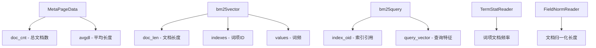
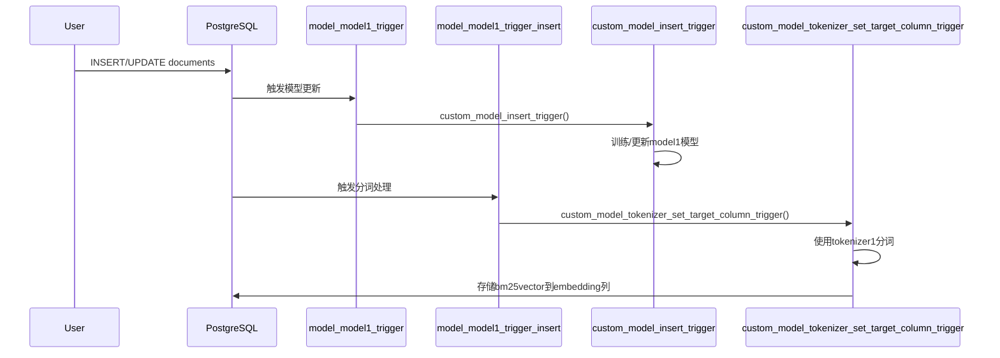

## 大学生数据库实践课: 14.3 如何计算 bm25 得分  
  
### 作者  
digoal  
  
### 日期  
2026-01-04  
  
### 标签  
PostgreSQL , DuckDB , 语义搜索 , 向量搜索 , 关键词检索 , 全文检索 , 标量检索 , 混合搜索 , 多模态搜索 , 重排序 , embedding , document split , ORC , 大模型 , 多模态大模型 , Dify , 压力测试 , 索引优化 , 倒排向量索引 , Ivfflat , 图向量索引 , HNSW , DiskANN , 量化 , rabitq , sbq , 二值量化 , bm25 , 相关性 , 相似性 , 召回率 , pgbench , 数据集 , ann-benchmarks , 图搜索 , PGQ , 递归 , 深度优先 , 广度优先 , 最短路径 , N度关系 , LLM , Ollama  
  
----  
  
## 背景  
  
vectorchord-bm25 deepwiki:  
  
  
https://deepwiki.com/search/bm25_dde82e0e-e939-481f-9f84-676910c67524?mode=fast  
  
面向大学生通俗讲解以下内容:  
1、如何得知计算bm25得分所需的变量信息, 例如索引中的总文档数, 平均长度, 某个文档的特征信息, 查询条件的特征信息.  
2、term_stat_reader(词项统计) 包含了哪些信息?  
3、归一化长度值起什么作用  
4、这些信息如何通过SQL接口来获得?  
5、使用bm25索引时, 为什么会自动创建触发器, 作用是什么?  
  
---  
  
计算bm25得分, 需要: 总文档数, 平均文档长度, 词项统计(各词项的文档频率), 文档向量, 查询向量  
  
在 VectorChord-BM25 中，计算 BM25 得分所需的变量信息通过以下方式获取：  
  
## 核心变量获取方式  
  
### 1. 索引中的总文档数和平均长度  
这些信息存储在索引的元数据页面 `MetaPageData` 中  ：  
- `doc_cnt`: 总文档数  
- `doc_term_cnt`: 所有文档的词项总数  
- `avgdl()`: 平均文档长度计算方法  
  
### 2. 文档特征信息  
文档特征以 `bm25vector` 类型存储，包含：  
- `doc_len`: 文档长度（所有词频之和）  
- `indexes`: 词项ID数组  
- `values`: 对应的词频数组  
  
### 3. 查询条件特征信息  
查询特征通过 `bm25query` 复合类型封装  ：  
- `index_oid`: 索引OID，用于获取索引统计信息  
- `query_vector`: 查询的 `bm25vector` 表示  
  
## 详细获取流程  
  
### 索引统计信息获取  
在查询时，系统首先读取元数据页面获取全局统计  ：  
```rust  
let page = page_read(index, METAPAGE_BLKNO);  
let meta: &MetaPageData = page.as_ref();  
let avgdl = meta.avgdl();  
```  
  
### 词项统计信息  
通过 `TermStatReader` 获取每个词项的文档频率，用于计算 IDF  ：  
```rust  
let term_stat_reader = TermStatReader::new(index, meta);  
```  
  
### 文档长度归一化  
通过 `FieldNormReader` 读取文档的归一化长度值  ：  
```rust  
let fieldnorm_reader = FieldNormReader::new(index, meta.field_norm_blkno);  
```  
  
### BM25 得分计算  
所有变量汇集到 `bm25_score_batch` 函数进行最终得分计算  ：  
```rust  
let scores = bm25_score_batch(  
    meta.doc_cnt,      // 总文档数  
    avgdl,             // 平均文档长度  
    &term_stat_reader, // 词项统计  
    target_vector,     // 文档特征  
    query_vector,      // 查询特征  
);  
```  
  
## 数据结构关系  
  

  
## Notes  
  
- 所有统计信息在索引构建时计算并存储  
- 文档插入时会动态更新元数据  
- BM25 得分返回负值以便排序（值越小越相关）  
  
---  
  
词项统计信息的介绍.  
  
  
## TermStatReader 包含的信息  
  
`TermStatReader` 是 VectorChord-BM25 中用于读取词项统计信息的核心组件，主要包含每个词项的文档频率（Document Frequency）信息。  
  
### 核心信息内容  
  
#### 1. 词项文档频率  
每个词项 ID 对应包含该词项的文档数量  ：  
```rust  
let term_cnt = term_stat_reader.read(term_id);  
let idf = idf(meta.doc_cnt, term_cnt);  
```  
  
#### 2. 存储结构  
词项统计以数组形式存储，索引为词项 ID，值为文档频率  ：  
```rust  
let mut term_stats = (0..term_id_cnt).map(|_| 0u32).collect::<Vec<_>>();  
```  
  
### 主要操作方法  
  
#### 1. 读取词项频率  
`read(term_id)` 方法返回指定词项 ID 的文档频率  ：  
```rust  
for term_id in vector_borrow.indexes().iter() {  
    term_stat_reader.update(*term_id, |tf| {  
        *tf += 1;  
    });  
}  
```  
  
#### 2. 更新词项统计  
`update(term_id, fn)` 方法用于更新词项的文档频率  ：  
```rust  
for i in 0..term_id_cnt {  
    term_stat_reader.update(i, |tf| {  
        *tf = term_stats[i as usize];  
    });  
}  
```  
  
### 在 BM25 计算中的作用  
  
#### 1. IDF 计算  
词项统计用于计算逆文档频率（IDF），这是 BM25 算法的关键组件  ：  
```rust  
pub fn idf(doc_cnt: u32, doc_freq: u32) -> f32 {  
    (((doc_cnt + 1) as f32) / (doc_freq as f32 + 0.5)).ln()  
}  
```  
  
#### 2. 权重计算  
在 BM25 得分计算中，每个词项的 IDF 与其词频结合计算权重  ：  
```rust  
let idf = idf(doc_cnt, term_stat_reader.read(li[lp]));  
let tf = lv[lp] as f32;  
let res = rv[rp] as f32 * idf * (K1 + 1.0) * tf / (tf + precompute);  
```  
  
### 数据维护流程  
  
#### 1. 文档插入时更新  
每当插入新文档时，会递增文档中所有词项的频率计数  。  
  
#### 2. Vacuum 时重新计算  
在清理操作后，系统会扫描所有文档重新计算词项统计  。  
  
## Notes  
  
- TermStatReader 存储的是文档频率而非词频，即包含该词项的文档数量，而非词项在所有文档中的总出现次数  
- 词项统计信息存储在虚拟页面中，通过 `meta.term_stat_blkno` 定位  
- 这些统计信息对 BM25 得分的准确性至关重要，因为 IDF 反映了词项的稀有程度  
  
---  
  
## 归一化长度值的作用  
  
归一化长度值（field norm）在BM25算法中用于调整文档长度对相关性得分的影响，防止长文档因包含更多词项而获得不公平的高分。  
  
### 核心作用  
  
#### 1. 文档长度归一化  
在BM25公式中，field norm作为文档长度的归一化值，用于计算长度惩罚因子  ：  
```rust  
// 将实际文档长度转换为归一化ID  
pub fn fieldnorm_to_id(fieldnorm: u32) -> u8  
  
// 将归一化ID转换回实际长度值  
pub fn id_to_fieldnorm(id: u8) -> u32  
```  
  
#### 2. BM25得分计算  
在BM25权重计算中，field norm直接影响最终得分  ：  
```rust  
let fieldnorm_id = fieldnorm_reader.read(docid);  
let fieldnorm = id_to_fieldnorm(fieldnorm_id);  
let score = scorer.weight.score(fieldnorm, tf);  
```  
  
### 实现细节  
  
#### 量化存储  
系统使用预定义的量化表将文档长度映射到256个离散值  ：  
- 节省存储空间：每个文档只需1字节存储长度信息  
- 非线性映射：较短文档的长度差异更敏感，长文档的长度差异被压缩  
  
#### 索引构建时写入  
文档插入时，长度信息被量化并写入field norm存储  ：  
```rust  
let mut field_norm_writer = VirtualPageWriter::open(index, field_norm_blkno, false);  
field_norm_writer.write(&fieldnorm_to_id(doc_len).to_le_bytes());  
```  
  
### 在Block-WAND优化中的作用  
  
#### Block级别上界计算  
field norm用于计算每个block的最大可能得分，支持Block-WAND算法的早期终止优化  ：  
```rust  
let fieldnorm_id = self.fieldnorm_reader.read(docid);  
let len = id_to_fieldnorm(fieldnorm_id);  
let score = weight.score(len, freq);  
if score > blockwand_score {  
    blockwand_tf = freq;  
    blockwand_fieldnorm_id = fieldnorm_id;  
    blockwand_score = score;  
}  
```  
  
### 为什么需要归一化  
  
1. **长度偏差校正**：长文档天然有更高概率包含查询词项，需要通过长度归一化来平衡  
2. **存储优化**：原始文档长度变化范围大，量化后可用固定空间存储  
3. **查询性能**：预计算的归一化值避免查询时重复计算  
  
## Notes  
  
- field norm的量化表是非线性的，对短文档更敏感  
- 在vacuum操作中，删除文档时会更新总词项统计，但field norm本身不会被修改  
- field norm是BM25算法区别于简单词频统计的关键特征之一  
  
-----  
  
vchord-bm25插件如何实时更新文档的统计信息?  
  
## 触发器作用说明  
  
这两个触发器构成了VectorChord-BM25中自定义模型和分词器的自动化管道：  
  
### 1. `model_model1_trigger` - 模型更新触发器  
```sql  
BEFORE INSERT OR UPDATE OF passage ON documents FOR EACH ROW  
EXECUTE FUNCTION custom_model_insert_trigger('model1', 'passage', 'text_analyzer1')  
```  
  
**作用**：  
- 在文档插入或更新时自动训练或更新模型  
- 使用指定的文本分析器(`text_analyzer1`)处理`passage`列内容  
- 将处理结果用于更新名为`model1`的自定义模型  
  
### 2. `model_model1_trigger_insert` - 分词触发器  
```sql  
BEFORE INSERT OR UPDATE OF passage ON documents FOR EACH ROW  
EXECUTE FUNCTION custom_model_tokenizer_set_target_column_trigger('tokenizer1', 'passage', 'embedding')  
```  
  
**作用**：  
- 在文档插入或更新时自动进行分词处理  
- 使用名为`tokenizer1`的分词器处理`passage`列  
- 将分词结果存储到`embedding`列作为`bm25vector`类型  
  
## 完整工作流程  
  
这两个触发器通过`create_custom_model_tokenizer_and_trigger`函数一起创建  ：  
  

  
## 实际使用示例  
  
```sql  
-- 创建文本分析器  
SELECT create_text_analyzer('text_analyzer1', $$  
pre_tokenizer = "unicode_segmentation"  
[[character_filters]]  
to_lowercase = {}  
[[token_filters]]  
stopwords = "nltk_english"  
$$);  
  
-- 一次性创建模型、分词器和触发器  
SELECT create_custom_model_tokenizer_and_trigger(  
    tokenizer_name => 'tokenizer1',  
    model_name => 'model1',  
    text_analyzer_name => 'text_analyzer1',  
    table_name => 'documents',  
    source_column => 'passage',  
    target_column => 'embedding'  
);  
```  
  
## Notes  
  
- 这两个触发器确保了文档插入/更新时的自动化处理  
- 第一个触发器负责模型训练，第二个负责实际的分词和向量生成  
- 触发器在`BEFORE INSERT OR UPDATE`时执行，确保数据写入前完成处理  
- 这种设计支持增量学习，新文档会持续更新模型和分词器  
  
  
#### [PolarDB 学习图谱](https://www.aliyun.com/database/openpolardb/activity "8642f60e04ed0c814bf9cb9677976bd4")
  
  
#### [PostgreSQL 解决方案集合](../201706/20170601_02.md "40cff096e9ed7122c512b35d8561d9c8")
  
  
#### [德哥 / digoal's Github - 公益是一辈子的事.](https://github.com/digoal/blog/blob/master/README.md "22709685feb7cab07d30f30387f0a9ae")
  
  
#### [About 德哥](https://github.com/digoal/blog/blob/master/me/readme.md "a37735981e7704886ffd590565582dd0")
  
  

  
