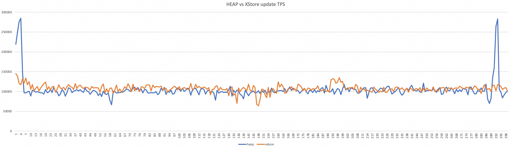

## 为了体验电信openteledb 开源PG XStore, 我做了个docker镜像 
  
### 作者  
digoal  
  
### 日期  
2026-01-06  
  
### 标签  
PostgreSQL , openTeleDB , XStore , undo , 中国电信   
  
----  
  
## 背景  
  
## OpenTeleDB 项目介绍  
  
https://github.com/OpenTeleDB/OpenTeleDB  
  
天翼云OpenTeleDB是在中国电信云改数转大背景诞生的，结合TeleDB在电信集团业务和天翼云客户实战打磨的企业级特性，着重解决PostgreSQL存在的并发连接瓶颈，存储空间膨胀，高可用切换的外部依赖等问题。OpenTeleDB本次新增**XProxy**、**XStore**、**XRaft**三大能力，并完美兼容PostgreSQL，基于PostgreSQL的相关业务系统可以无缝的迁移到OpenTeleDB。  
  
- **XProxy**：能够提供十万级原生连接上限的接入能力，支持自动读写分离与负载均衡，实现系统的横向扩展，提升整体性能与可用性，让资源利用更充分。  
- **Xstore**：相较于原生PostgreSQL在高并发更新下，因MVCC机制易导致存储空间持续膨胀，且周期性Vacuum回收会引发性能剧烈波动，执行TPCC模型时性能波动常超40%。OpenTeleDB通过XStore存储引擎对存储层进行全链路重构：通过**原位更新**与**Undo日志管理**，从根本杜绝空间膨胀，表空间占用几乎零增长；同时对索引采用原位更新，彻底告别扫表式Vacuum，将执行TPCC模型时性能波动压制在5%以内。  
- **XRaft**：在数据库核内完成自动高可用，杜绝脑裂，而不依赖第三方外部组件，结构简单，有效保障业务高可用。  
  
  
为了体验电信openteledb 开源PG XStore, 做了个docker镜像  
  
## 制作镜像  
1、下载必要脚本, 由于openteledb基于pg 17, 这里直接使用pg 17 dockerfile里的官方脚本  
```  
mkdir -p ~/openteledb/logs  
cd ~/openteledb  
  
curl -L https://raw.githubusercontent.com/docker-library/postgres/refs/heads/master/17/bookworm/docker-entrypoint.sh -o ./docker-entrypoint.sh  
```  
  
2、参考了openteledb的安装文档和pg 17的官方dockerfile, 加入一些常用工具. 编辑 Dockerfile 如下  
```  
# 第一阶段：编译阶段 (Builder)
FROM debian:bookworm-slim AS builder

RUN set -ex; \
    # 1. 彻底清空旧的源配置目录和文件
    rm -rf /etc/apt/sources.list.d/*; \
    echo "" > /etc/apt/sources.list; \
    \
    # 2. 写入阿里云镜像源
    cat <<EOF > /etc/apt/sources.list
# Debian 12 Bookworm 阿里云镜像源
deb http://mirrors.aliyun.com/debian/ bookworm main contrib non-free non-free-firmware
deb-src http://mirrors.aliyun.com/debian/ bookworm main contrib non-free non-free-firmware

deb http://mirrors.aliyun.com/debian/ bookworm-updates main contrib non-free non-free-firmware
deb-src http://mirrors.aliyun.com/debian/ bookworm-updates main contrib non-free non-free-firmware

deb http://mirrors.aliyun.com/debian/ bookworm-backports main contrib non-free non-free-firmware
deb-src http://mirrors.aliyun.com/debian/ bookworm-backports main contrib non-free non-free-firmware

deb http://mirrors.aliyun.com/debian-security/ bookworm-security main contrib non-free non-free-firmware
deb-src http://mirrors.aliyun.com/debian-security/ bookworm-security main contrib non-free non-free-firmware
EOF

# 安装 OpenTeleDB 编译所需的软件依赖
RUN set -ex; \
    apt-get update; \
    apt-get install -y --no-install-recommends \
        ca-certificates \
        git \
        gcc \
        g++ \
        make \
        flex \
        bison \
        pkg-config \
        libreadline-dev \
        zlib1g-dev \
        libssl-dev \
        libxml2-dev \
        libxslt1-dev \
        libicu-dev \
        libzstd-dev \
        liblz4-dev \
        libcurl4-openssl-dev \
        uuid-dev \
        libsystemd-dev \
        gettext; \
    rm -rf /var/lib/apt/lists/*

# 设置安装目录
ENV PG_INSTALL_DIR=/usr/local/openteledb

# 下载源码 (此处假设从社区获取，或者你可以用 COPY 放入本地源码)
# 注意：实际使用时请替换为正确的仓库地址或本地路径
WORKDIR /usr/src/openteledb
RUN git clone --depth 1 -b v2.0 https://github.com/OpenTeleDB/openteledb.git .

# 编译安装
# 根据说明文档增加 --with-zstd --with-lz4 --with-xraft(不包含) --with-openssl
RUN set -ex; \
    ./configure \
        --prefix=$PG_INSTALL_DIR \
        --with-zstd \
        --with-lz4 \
        --with-openssl \
        --with-icu \
        --with-libxml \
        --with-libxslt \
        --with-uuid=e2fs \
        --with-systemd; \
    make -j "$(nproc)"; \
    make install; \
    make -C contrib install


# 第二阶段：运行阶段 (Final)
FROM debian:bookworm-slim

RUN set -ex; \
    sed -i 's/deb.debian.org/mirrors.aliyun.com/g' /etc/apt/sources.list.d/debian.sources; \
    sed -i 's/security.debian.org/mirrors.aliyun.com/g' /etc/apt/sources.list.d/debian.sources;

# 显式设置用户 ID (参考官方 PG Dockerfile)
RUN set -eux; \
    groupadd -r postgres --gid=999; \
    useradd -r -g postgres --uid=999 --home-dir=/var/lib/postgresql --shell=/bin/bash postgres; \
    install --verbose --directory --owner postgres --group postgres --mode 1777 /var/lib/postgresql

# 安装运行时的最小依赖 (不含编译工具)
RUN set -ex; \
    apt-get update; \
    apt-get install -y --no-install-recommends \
        libreadline8 \
        libssl3 \
        libxml2 \
        libicu72 \
        libzstd1 \
        liblz4-1 \
        libcurl4 \
        libxslt1.1 \
        ca-certificates \
        locales \
        gosu \
    ; \
    rm -rf /var/lib/apt/lists/*

# 设置语言环境
RUN set -eux; \
    echo 'en_US.UTF-8 UTF-8' >> /etc/locale.gen; \
    locale-gen
ENV LANG=en_US.utf8
ENV PG_MAJOR=17
ENV PATH=/usr/local/openteledb/bin:$PATH
ENV PGDATA=/var/lib/postgresql/data

RUN set -ex; \
    # 配置 root 用户
    { \
        echo "alias ll='ls -larth'"; \
        echo "alias rm='rm -i'"; \
        echo "alias cp='cp -i'"; \
        echo "alias mv='mv -i'"; \
        echo "export PATH=\"$PATH\""; \
        echo "export PGDATA=\"$PGDATA\""; \
        echo "export PGUSER=postgres"; \
        echo "export LANG=\"$LANG\""; \
    } >> /root/.bashrc; \
    # 配置 postgres 用户
    { \
        echo "alias ll='ls -larth'"; \
        echo "alias rm='rm -i'"; \
        echo "alias cp='cp -i'"; \
        echo "alias mv='mv -i'"; \
        echo "export PGDATA=\"$PGDATA\""; \
        echo "export PATH=\"$PATH\""; \
        echo "export LANG=\"$LANG\""; \
    } >> /var/lib/postgresql/.bash_profile; \
    chown postgres:postgres /var/lib/postgresql/.bash_profile

# 从编译阶段拷贝安装好的二进制文件
COPY --from=builder /usr/local/openteledb /usr/local/openteledb

# 创建数据目录和初始化脚本目录
RUN mkdir /docker-entrypoint-initdb.d; \
    install --verbose --directory --owner postgres --group postgres --mode 1777 "$PGDATA" /var/run/postgresql

# 准备配置文件 (由于是编译安装，需手动处理样本配置)
RUN set -eux; \
    cp /usr/local/openteledb/share/postgresql/postgresql.conf.sample /usr/local/openteledb/share/postgresql/postgresql.conf.sample.orig; \
    sed -ri "s!^#?(listen_addresses)\s*=\s*\S+.*!\1 = '*'!" /usr/local/openteledb/share/postgresql/postgresql.conf.sample

RUN set -ex; \
    apt-get update; \
    apt-get install -y --no-install-recommends \
        vim \
        procps \
        iotop sysstat \
        iputils-ping telnet curl wget net-tools \
        libreadline8 libssl3 libxml2 libicu72 libzstd1 liblz4-1 \
        libcurl4 libxslt1.1 libsystemd0 libuuid1 ca-certificates locales gosu \
    ; \
    rm -rf /var/lib/apt/lists/*

# 关键步骤：在初始化时自动加载 xraft
# 我们可以利用 Docker 的 initdb 特性或在 entrypoint 中处理
# 代码暂时不支持, 注释
# RUN echo "shared_preload_libraries = 'xraft.so'" >> /usr/local/openteledb/share/postgresql/postgresql.conf.sample

# 借用官方的 entrypoint 脚本 (需确保上下文中存在该脚本)
# 如果没有官方脚本，可以使用简单的启动脚本
COPY docker-entrypoint.sh /usr/local/bin/
RUN chmod +x /usr/local/bin/docker-entrypoint.sh

ENTRYPOINT ["docker-entrypoint.sh"]

STOPSIGNAL SIGINT
EXPOSE 5432
VOLUME /var/lib/postgresql/data
USER root
WORKDIR /root
CMD ["postgres"]
```  
  
3、build 镜像  
```  
docker build --platform=linux/arm64 -t="digoal/openteledb:arm64" --debug --no-cache . 2>&1 | tee ./logs/build.log  
```  
  
4、测试镜像是否正常  
```  
mkdir -p ~/openteledb_docker_data  
  
cd ~/openteledb_docker_data  
PG_DATA=`pwd`  
PG_USER="postgres"  
PG_PASSWORD="123456"  
  
docker run -d -it -p 0.0.0.0:5432:5432 --add-host=host.docker.internal:host-gateway \
  -u root -w /var/lib/postgresql -e LANG=en_US.utf8 \
  -e POSTGRES_INITDB_ARGS="-E UTF8 --locale=C --lc-ctype=en_US.utf8" \
  -v $PG_DATA:/var/lib/postgresql/data \
  -e PGDATA=/var/lib/postgresql/data \
  --cap-add=SYS_PTRACE --cap-add SYS_ADMIN --privileged=true --shm-size=1g \
  -e POSTGRES_USER=$PG_USER -e POSTGRES_PASSWORD=$PG_PASSWORD \
  --name openteledb-test digoal/openteledb:arm64  
```  
  
  
测试变量是否正常, psql 客户端是否正常, xstore插件是否正常  
```  
docker exec -ti openteledb-test bash  
  
# psql  
psql (17.6)  
Type "help" for help.  
  
postgres=# create extension xstore ;  
CREATE EXTENSION

postgres=# \dA
List of access methods
  Name  | Type  
--------+-------
 brin   | Index
 btree  | Index
 gin    | Index
 gist   | Index
 hash   | Index
 heap   | Table
 spgist | Index
 xbtree | Index
 xstore | Table
(9 rows)

postgres=# create table test (id serial primary key, info text, ts timestamp) using xstore;  
CREATE TABLE  
postgres=# insert into test (info, ts) select md5(random()::text), clock_timestamp() from generate_series(1,1000000);  
INSERT 0 1000000  
postgres=# select * from test limit 2;  
 id |               info               |             ts  
----+----------------------------------+----------------------------  
  1 | 8d5d0f6a1c7a0e453ec29e27b7adce96 | 2026-01-06 11:25:12.336555  
  2 | 850928863c29386c6fc84a4f953f3e00 | 2026-01-06 11:25:12.341424  
(2 rows)  
```  
  
5、上传容器  
```  
$ docker images  
IMAGE                                                                                     ID             DISK USAGE   CONTENT SIZE   EXTRA  
digoal/openteledb:arm64                                                                   5e7958e2bbd1        297MB             0B    U  
  
  
  
docker tag 5e7958e2bbd1 registry.cn-hangzhou.aliyuncs.com/digoal/opensource_database:openteledb-17-arm64  
docker push registry.cn-hangzhou.aliyuncs.com/digoal/opensource_database:openteledb-17-arm64  
```  
  
x86_64的也已经做好了  
```  
registry.cn-hangzhou.aliyuncs.com/digoal/opensource_database:openteledb-17-amd64  
```  
  
用起来:  
```  
mkdir -p ~/openteledb_docker_data1  
  
cd ~/openteledb_docker_data1  
PG_DATA=`pwd`  
PG_USER="postgres"  
PG_PASSWORD="123456"  
  
docker run -d -it -p 0.0.0.0:5433:5432 --add-host=host.docker.internal:host-gateway \
  -u root -w /var/lib/postgresql -e LANG=en_US.utf8 \
  -e POSTGRES_INITDB_ARGS="-E UTF8 --locale=C --lc-ctype=en_US.utf8" \
  -v $PG_DATA:/var/lib/postgresql/data \
  -e PGDATA=/var/lib/postgresql/data \
  --cap-add=SYS_PTRACE --cap-add SYS_ADMIN --privileged=true --shm-size=1g \
  -e POSTGRES_USER=$PG_USER -e POSTGRES_PASSWORD=$PG_PASSWORD \
  --name openteledb-test1 \
  registry.cn-hangzhou.aliyuncs.com/digoal/opensource_database:openteledb-17-arm64  
```

## XStore vs HEAP 测试
修改配置文件  
```  
psql


\! echo "shared_buffers = 2GB  
maintenance_work_mem = 1GB  
autovacuum_work_mem = -1  
synchronous_commit = off  
wal_writer_delay = 10ms  
max_wal_size = 6GB  
min_wal_size = 1GB  
autovacuum = on  
autovacuum_max_workers = 3  
autovacuum_vacuum_cost_delay = 2ms  
autovacuum_vacuum_cost_limit = -1" >> /var/lib/postgresql/data/postgresql.auto.conf  
```  
  
重启容器后继续测试  
```  
create extension if not exists xstore ;    
drop table if exists tbl_xstore ;  
create unlogged table tbl_xstore (id serial primary key, info text, ts timestamp) using xstore;    
insert into tbl_xstore (info, ts) select md5(random()::text), clock_timestamp() from generate_series(1,5000000);    
select pg_size_pretty(pg_total_relation_size('tbl_xstore'));  
  
 pg_size_pretty   
----------------  
 570 MB  -- 主要是xbtree索引较大, 未来有文章来分析xbtree索引为什么更大? 
(1 row)  
  
drop table if exists tbl_heap ;  
create unlogged table tbl_heap (id serial primary key, info text, ts timestamp) using heap;    
insert into tbl_heap (info, ts) select md5(random()::text), clock_timestamp() from generate_series(1,5000000);    
select pg_size_pretty(pg_total_relation_size('tbl_heap'));  
  
 pg_size_pretty   
----------------  
 472 MB  
(1 row)  
```  
  
xstore 表更新压测  
```  
\! echo "\set id random(1,5000000)  
update tbl_xstore set info=md5(random()::text), ts=clock_timestamp() where id=:id;" > ~/xstore.sql  
  
\! pgbench -M prepared -n -r -P 1 -f ~/xstore.sql -c 8 -j 8 -T 300  
```  
  
heap 表更新压测  
```  
checkpoint;  
  
  
\! echo "\set id random(1,5000000)  
update tbl_heap set info=md5(random()::text), ts=clock_timestamp() where id=:id;" > ~/heap.sql  
  
\! pgbench -M prepared -n -r -P 1 -f ~/heap.sql -c 8 -j 8 -T 300  
```  
  
对比更新效率和膨胀率  
  
引擎 | 更新 tps | 膨胀率  
---|---|---  
xstore | 107831 | 0 (570MB 大小无变化)  
heap | 104360 | 6.1% (472MB 膨胀到 501MB)  
  
更新抖动情况: XStore 比 HEAP 平稳. 由于 heap 开始膨胀, 相信如果持续拉长测试时间, xstore的表现会更好.    
  
  
  
## 怎么heap表只膨胀了一点点, 难道大家冤枉PG了?
不是说PG的heap表很容易膨胀吗? 被这么多人吐槽的膨胀问题就这? 用户是不是没事找事?  
  
抱歉, 忘了开长事务, 真实业务场景不可能全是小事务, 总会有意外, 例如某些SQL的时间耗时比较长, 或者有一些应用或人为的不小心开启了长事务, 或者逻辑备份导出、逻辑复制初始同步等由于一致性快照的需要产生的长事务等等.   
  
有长事务, 膨胀问题就容易显现了.   
  
为了模拟更加真实的环境, 特别是(长事务), 另外开启一个测试会话, 让它跑最长耗时10秒的随机时长事务.  
  
```  
\! echo "begin;  
select txid_current();  
select pg_sleep(random()*10);  
end;  
" > ~/long.sql  
```  
  
```  
\! pgbench -n -r -P 1 -f ~/long.sql -c 1 -j 1 -T 1000  
```  
  
然后再跑前面的更新压测, tbl_xstore依旧不变  
  
```  
postgres=# select pg_size_pretty(pg_total_relation_size('tbl_xstore'));    
 pg_size_pretty   
----------------  
 570 MB  
(1 row)  
```  
  
而tbl_heap表终于膨胀了, 如果时间在久一点, 长事务再长一点, 可想而知问题会越来越严重.  当然: 前提是你在长事务的过程中不断的进行高频率的更新, 这两者得同时发生才会膨胀.    
  
```  
postgres=# select pg_size_pretty(pg_total_relation_size('tbl_heap'));    
 pg_size_pretty   
----------------  
 630 MB  
(1 row)  
```  
    
  
## 遇到 bug ?
后来有运行了3000秒的以上update负载, heap表膨胀到507MB后不再膨胀, 而xstore表崩溃了. 报如下日志:
```
INFO:  undo record discontinuous,logno 131073, buffer 77453, startingByte 601, page start 24, page end 8192, alreadyWritten 0, lastPageWritten 0, diffpage true, urp 9223442407746503257, newpage true.

AI 认为是如下参数配置太小, 但实际上已经很大. 可能是 bug? 
postgres=# show xstore.undo_max_size_per_transaction;
 xstore.undo_max_size_per_transaction 
--------------------------------------
 32GB
(1 row)

postgres=# show xstore.undo_max_total_size;
 xstore.undo_max_total_size 
----------------------------
 256GB
(1 row)
```
    
  
#### [PolarDB 学习图谱](https://www.aliyun.com/database/openpolardb/activity "8642f60e04ed0c814bf9cb9677976bd4")
  
  
#### [PostgreSQL 解决方案集合](../201706/20170601_02.md "40cff096e9ed7122c512b35d8561d9c8")
  
  
#### [德哥 / digoal's Github - 公益是一辈子的事.](https://github.com/digoal/blog/blob/master/README.md "22709685feb7cab07d30f30387f0a9ae")
  
  
#### [About 德哥](https://github.com/digoal/blog/blob/master/me/readme.md "a37735981e7704886ffd590565582dd0")
  
  

  
